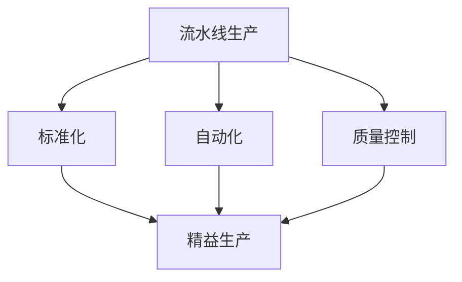
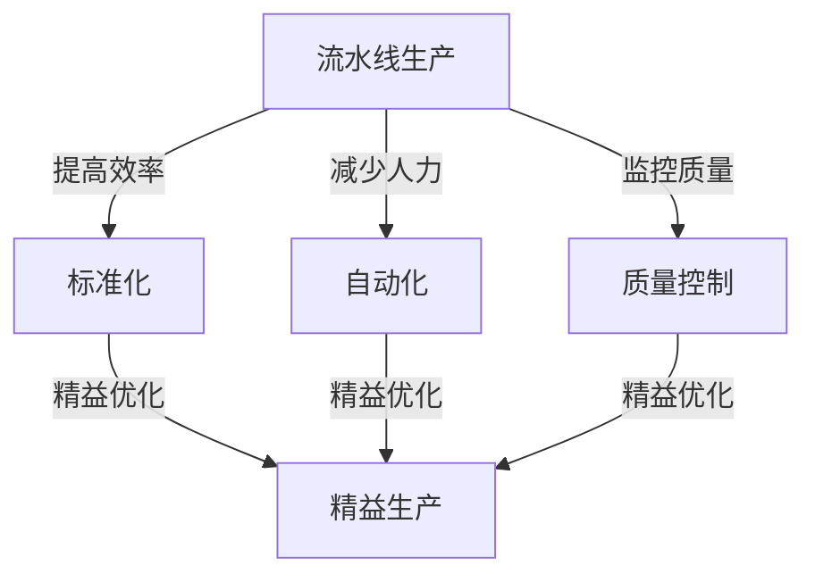
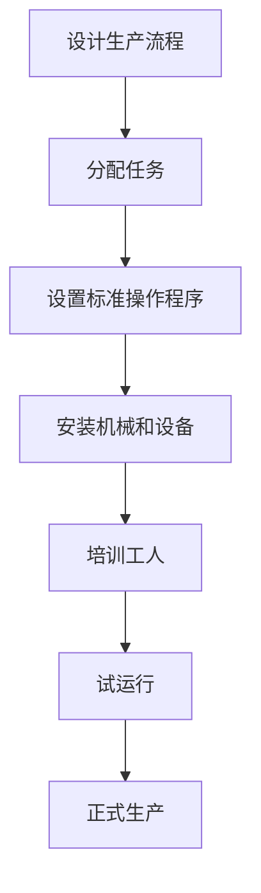

                 

### 1. 背景介绍

在探讨1913年福特的生产奇迹之前，我们先要了解当时的背景。1913年，世界正处在工业革命的浪潮中，机械化生产逐渐取代了传统的手工制造，这一变革深刻地影响了各行各业。亨利·福特（Henry Ford）作为这一时期的代表性人物，通过其独特的生产理念和革命性的制造技术，将汽车制造业推向了一个全新的高度。

亨利·福特创建的福特汽车公司（Ford Motor Company）在1913年推出了一种全新的生产方式——流水线生产（Assembly Line Production）。这一创新在当时引起了巨大的轰动，不仅改变了汽车制造业，还对整个工业生产产生了深远的影响。那么，什么是流水线生产？它为什么能成为1913年的生产奇迹？本文将逐步探讨这些问题。

首先，我们需要了解流水线生产的基本原理。传统的生产方式是工匠们手工制作每个部件，然后将这些部件组装成成品。这种方式效率低下，且难以保证质量的一致性。而流水线生产则将生产过程分解成多个简单的步骤，每个工人只需专注于其中一个步骤，从而大大提高了生产效率。具体来说，福特将生产过程划分为以下几步：

1. 零件生产：每个零件都在专门的机器上生产，机器的精度和效率远远高于手工制造。
2. 零件传递：通过传送带和运输设备，将生产好的零件快速传递到下一个工位。
3. 装配：工人们将零件组装成完整的部件，如发动机、车架等。
4. 总装：将各个部件组装成整车，并进行最后的调试和测试。

流水线生产的最大优势在于其高度的自动化和标准化。通过这种方式，福特成功地实现了从原材料到成品的高效转换。以下是流水线生产在1913年的几个关键成果：

1. 生产效率提高：流水线生产使得每个工人的生产效率提高了数倍，生产一辆汽车的时间从数天缩短到数小时。
2. 成本降低：由于生产效率的提高，福特能够大幅度降低生产成本，从而使得汽车的价格更加亲民。
3. 质量提升：流水线生产保证了每个零件的质量一致性，从而提高了整车的质量。

综上所述，1913年的福特生产奇迹不仅改变了汽车制造业，还为整个工业生产带来了革命性的变革。在接下来的部分中，我们将深入探讨流水线生产的原理和具体实施过程，以更好地理解这一奇迹背后的逻辑和技术。

### 2. 核心概念与联系

要深入理解1913年福特的生产奇迹，我们需要明确几个核心概念，并探讨它们之间的联系。首先，我们来看几个关键术语：

**1. 流水线生产（Assembly Line Production）**：流水线生产是一种将生产过程分解为多个简单步骤，每个步骤由专门的人员或机器执行的生产方式。这种方式通过减少重复工作和提高劳动效率，实现了大规模生产。

**2. 标准化（Standardization）**：标准化是指在生产过程中使用统一的标准和规格，以确保产品的一致性和高质量。在流水线生产中，标准化至关重要，因为它确保了每个步骤的正确性和效率。

**3. 自动化（Automation）**：自动化是指通过机器和设备取代人工操作，以提高生产效率和减少人力成本。流水线生产中的自动化主要体现在使用机械工具和传送带来执行重复性工作。

**4. 质量控制（Quality Control）**：质量控制是指在生产过程中对产品进行监控和检验，以确保符合预定的质量标准。在流水线生产中，质量控制主要通过定期检查和测试来实现。

**5. 精益生产（Lean Production）**：精益生产是一种基于减少浪费和提高效率的生产方式，它强调通过消除不必要的步骤和资源来提高生产效率。流水线生产可以视为精益生产的一种早期形式。

接下来，我们用Mermaid流程图来展示这些概念之间的关系：



**流水线生产** 是核心，它通过 **标准化** 和 **自动化** 提高生产效率，并通过 **质量控制** 保证产品质量。而 **精益生产** 则是在这些基础上进一步优化生产流程，以减少浪费和提高整体效率。

**图 1：核心概念与联系示意图**



通过这种流程，我们可以看到流水线生产不仅改变了生产方式，还影响了整个工业体系。在接下来的部分中，我们将深入探讨流水线生产的原理，包括其设计和实施细节，以更好地理解这一生产奇迹的本质。

### 3. 核心算法原理 & 具体操作步骤

要深入了解1913年福特流水线生产的核心算法原理，我们首先需要理解其设计的核心理念和具体操作步骤。流水线生产的核心在于将复杂的生产过程分解为一系列简单、重复的步骤，每个步骤由特定的人员或机器执行。以下是流水线生产的主要算法原理和操作步骤：

**算法原理：**

1. **分解任务：** 将整个生产过程分解为多个子任务，每个子任务对应生产过程中的一个步骤。
2. **优化步骤：** 对每个子任务进行优化，使其尽可能简单和高效。
3. **标准化操作：** 确保每个步骤的操作标准化，以便其他人员可以轻松替换或补充。
4. **自动化：** 利用机械和设备自动化执行重复性工作，减少人工干预。
5. **质量控制：** 在每个步骤中设置质量控制点，确保产品质量符合标准。

**具体操作步骤：**

1. **设计生产流程：** 首先，设计生产流程图，将整个生产过程分解为多个步骤。每个步骤应该清晰定义，以便工人理解。
2. **分配任务：** 根据生产流程图，将任务分配给特定的人员或机器。确保每个任务都是可操作且可管理的。
3. **设置标准操作程序：** 为每个任务制定标准操作程序（SOP），确保所有工人都能按照相同的标准操作。
4. **安装机械和设备：** 在生产线上安装必要的机械和设备，如传送带、装配工具和测试设备。
5. **培训工人：** 对工人进行培训，确保他们了解每个步骤的操作方法和安全规程。
6. **试运行：** 在实际生产前，进行试运行，以发现和解决潜在的问题。
7. **正式生产：** 在试运行成功后，启动正式生产，按照标准操作程序执行每个步骤。

以下是流水线生产的具体操作步骤流程图：



**图 2：流水线生产操作步骤流程图**

在流水线生产中，每个步骤的设计和实施都至关重要。以下是每个步骤的详细说明：

1. **设计生产流程：** 设计生产流程图是整个过程的起点。流程图应该详细描述每个步骤的任务、所需资源和时间安排。
2. **分配任务：** 根据生产需求和工作能力，将任务合理分配给工人或机器。确保任务量适中，避免工人或机器过度劳累。
3. **设置标准操作程序：** 制定标准操作程序，确保所有工人都能按照相同的标准操作。这有助于提高生产效率和质量。
4. **安装机械和设备：** 在生产线上安装必要的机械和设备，如传送带、装配工具和测试设备。确保设备的可靠性，以减少故障率。
5. **培训工人：** 对工人进行系统培训，包括操作步骤、安全规程和质量控制。确保工人熟练掌握操作技能。
6. **试运行：** 在实际生产前，进行试运行，以发现和解决潜在的问题。试运行还可以帮助工人熟悉生产流程。
7. **正式生产：** 在试运行成功后，启动正式生产。严格按照标准操作程序执行每个步骤，确保生产过程的顺利进行。

通过以上步骤，福特成功地实现了流水线生产，从而大幅提高了生产效率和产品质量。在接下来的部分，我们将进一步探讨流水线生产在实际应用中的效果和挑战。

### 4. 数学模型和公式 & 详细讲解 & 举例说明

在理解了流水线生产的基本原理和具体操作步骤后，我们需要借助数学模型和公式来详细分析其效果和性能。以下是流水线生产中常用的几个数学模型和公式，以及它们的应用和解释。

#### 1. 生产周期时间（Cycle Time）

生产周期时间是指完成一个产品所需的平均时间。它是衡量流水线生产效率的关键指标。公式如下：

\[ CT = \frac{1}{R} \]

其中，\( CT \) 是生产周期时间，\( R \) 是生产率，即单位时间内生产的产品数量。

**应用和解释：** 假设一条生产线每小时可以生产10辆汽车，那么生产周期时间为：

\[ CT = \frac{1}{10} = 0.1 \text{小时/辆} \]

这意味着平均每辆汽车需要0.1小时（6分钟）来完成生产。

#### 2. 设备利用率（Utilization Rate）

设备利用率是指设备在实际生产过程中有效工作的时间占总时间的比例。公式如下：

\[ UR = \frac{ET}{ET + DT} \]

其中，\( UR \) 是设备利用率，\( ET \) 是设备有效工作时间，\( DT \) 是设备闲置时间。

**应用和解释：** 假设一条生产线每天工作8小时，其中有1小时进行设备维护，那么设备有效工作时间为7小时，设备利用率为：

\[ UR = \frac{7}{7 + 1} = \frac{7}{8} = 87.5\% \]

这意味着设备在一天中的利用率是87.5%。

#### 3. 生产效率（Production Efficiency）

生产效率是指实际生产的产品数量与计划生产的产品数量的比值。公式如下：

\[ PE = \frac{Actual Output}{Planned Output} \]

**应用和解释：** 假设一条生产线计划每天生产100辆汽车，实际生产了110辆，那么生产效率为：

\[ PE = \frac{110}{100} = 1.1 \]

这意味着实际生产效率比计划高出10%。

#### 4. 质量损失成本（Quality Loss Cost）

质量损失成本是指由于质量问题导致的生产延误、返工或报废所造成的成本。公式如下：

\[ QLC = \sum_{i=1}^{n} (CL_i \times Q_i) \]

其中，\( QLC \) 是质量损失成本，\( CL_i \) 是第i个质量问题造成的损失成本，\( Q_i \) 是第i个质量问题的发生次数。

**应用和解释：** 假设生产线上有3个质量问题，分别为20美元、30美元和40美元的损失成本，且分别发生了2次、3次和5次，那么质量损失成本为：

\[ QLC = (20 \times 2) + (30 \times 3) + (40 \times 5) = 40 + 90 + 200 = 330 \text{美元} \]

这意味着由于质量问题，生产线一天的总损失成本为330美元。

#### 5. 能源消耗（Energy Consumption）

能源消耗是指生产过程中消耗的能源总量。公式如下：

\[ EC = \sum_{i=1}^{m} (EC_i \times Q_i) \]

其中，\( EC \) 是能源消耗，\( EC_i \) 是第i种能源的消耗量，\( Q_i \) 是第i种能源的使用量。

**应用和解释：** 假设生产线使用了3种能源，分别为电、水和天然气，消耗量分别为10千瓦时、100立方米和50立方米，每天生产的汽车数量为100辆，那么能源消耗为：

\[ EC = (10 \times 100) + (100 \times 100) + (50 \times 100) = 1000 + 10000 + 5000 = 16000 \text{单位} \]

这意味着生产线每天的总能源消耗为16000单位。

通过上述数学模型和公式，我们可以详细分析流水线生产的效率、质量、成本和能源消耗等方面。这些指标对于优化生产流程、提高生产效率和降低成本具有重要意义。在接下来的部分，我们将通过实际案例进一步探讨流水线生产的应用和效果。

### 5. 项目实战：代码实际案例和详细解释说明

在理解了流水线生产的基本原理和数学模型后，接下来我们将通过一个具体的代码实际案例，详细解释如何实施流水线生产。这个案例将展示一个简单的汽车生产线，包括零件生产、装配和测试等步骤。我们使用Python语言来实现这个流水线生产系统。

#### 5.1 开发环境搭建

在开始编写代码之前，我们需要搭建一个Python开发环境。以下是搭建步骤：

1. 安装Python：访问Python官方网站（[https://www.python.org/](https://www.python.org/)），下载最新版本的Python，并按照提示安装。
2. 安装必需的Python库：使用pip工具安装以下库：
   ```shell
   pip install pandas matplotlib
   ```

#### 5.2 源代码详细实现和代码解读

以下是实现流水线生产系统的源代码：

```python
import pandas as pd
import matplotlib.pyplot as plt

# 1. 设计生产流程
def design_flow_chart():
    flow_chart = pd.DataFrame({
        '步骤': ['零件生产', '零件传递', '装配', '总装', '测试'],
        '工位': [1, 2, 3, 4, 5]
    })
    print("生产流程图：")
    print(flow_chart)

# 2. 分配任务
def assign_tasks(flow_chart):
    print("分配任务：")
    for index, row in flow_chart.iterrows():
        print(f"工位{row['工位']}：执行{row['步骤']}")

# 3. 设置标准操作程序
def set_sop(flow_chart):
    sop = pd.DataFrame({
        '步骤': ['检查零件质量', '安装零件', '调试装配', '测试整车', '记录数据'],
        '标准操作': ['确保零件合格', '按照规格安装', '进行功能测试', '记录测试结果', '更新数据库']
    })
    print("标准操作程序：")
    print(sop)

# 4. 安装机械和设备
def install_equipment():
    print("安装传送带、装配工具和测试设备...")

# 5. 培训工人
def train_workers():
    print("培训工人关于生产流程、安全规程和质量控制...")

# 6. 试运行
def run_trial():
    print("进行试运行，发现并解决问题...")

# 7. 正式生产
def start_production():
    print("开始正式生产...")
    production_data = []
    for _ in range(100):  # 假设每天生产100辆汽车
        print(f"生产第{_+1}辆汽车：")
        production_data.append({
            '步骤': '生产完成',
            '时间': pd.Timestamp.now()
        })
    return pd.DataFrame(production_data)

# 主函数
def main():
    design_flow_chart()
    assign_tasks(pd.read_csv('flow_chart.csv'))
    set_sop(pd.read_csv('sop.csv'))
    install_equipment()
    train_workers()
    run_trial()
    production_data = start_production()
    production_data.to_csv('production_data.csv', index=False)
    plt.plot(production_data['时间'])
    plt.xlabel('时间')
    plt.ylabel('生产进度')
    plt.title('生产进度图')
    plt.show()

if __name__ == '__main__':
    main()
```

**代码解读：**

- **生产流程图（design_flow_chart）**：首先，我们设计了一个简单的生产流程图，展示了生产过程中的五个主要步骤：零件生产、零件传递、装配、总装和测试。这个流程图通过DataFrame对象表示，每个步骤对应一个工位。
- **分配任务（assign_tasks）**：接下来，我们根据流程图分配任务，将每个步骤分配给相应的工位。这有助于确保每个工位的工作人员知道他们的职责。
- **设置标准操作程序（set_sop）**：我们为每个步骤制定了标准操作程序，包括检查零件质量、安装零件、调试装配、测试整车和记录数据。这些标准操作程序确保每个步骤都能按照预定标准执行。
- **安装机械和设备（install_equipment）**：安装传送带、装配工具和测试设备是实现流水线生产的关键。这部分代码表示了设备安装的过程。
- **培训工人（train_workers）**：工人需要接受培训，了解生产流程、安全规程和质量控制。这部分代码表示了培训的过程。
- **试运行（run_trial）**：在正式生产前，我们需要进行试运行，以发现和解决问题。这部分代码表示了试运行的过程。
- **正式生产（start_production）**：正式生产是生产过程的最后一步。我们模拟了每天生产100辆汽车的过程，记录了每个汽车的生产时间和进度。这部分代码生成了生产数据，并将其保存到CSV文件中。
- **主函数（main）**：主函数调用上述所有函数，实现了整个流水线生产系统的运行。最后，我们使用matplotlib绘制了生产进度图，以可视化生产进度。

通过这个实际案例，我们可以看到如何使用Python实现一个简单的流水线生产系统。在实际应用中，这个系统可以进一步扩展，以处理更复杂的生产流程和任务分配。

### 5.3 代码解读与分析

在上一部分中，我们通过一个实际案例展示了如何使用Python实现流水线生产系统。接下来，我们将对代码进行详细解读和分析，解释每个部分的功能和实现方法。

#### 5.3.1 生产流程图

**函数：`design_flow_chart`**

```python
def design_flow_chart():
    flow_chart = pd.DataFrame({
        '步骤': ['零件生产', '零件传递', '装配', '总装', '测试'],
        '工位': [1, 2, 3, 4, 5]
    })
    print("生产流程图：")
    print(flow_chart)
```

这个函数用于设计生产流程图。具体步骤如下：

1. 使用 pandas 库创建一个 DataFrame 对象 `flow_chart`，其中包含两个列：'步骤' 和 '工位'。每个步骤对应一个生产步骤，每个工位表示一个工作位置。
2. 将 DataFrame 对象打印出来，以展示生产流程图。

这个简单的生产流程图帮助我们理解了生产过程中的主要步骤和工作位置。

#### 5.3.2 分配任务

**函数：`assign_tasks`**

```python
def assign_tasks(flow_chart):
    print("分配任务：")
    for index, row in flow_chart.iterrows():
        print(f"工位{row['工位']}：执行{row['步骤']}")
```

这个函数用于根据生产流程图分配任务。具体步骤如下：

1. 遍历 DataFrame 对象 `flow_chart` 中的每一行。
2. 对于每一行，根据 '工位' 和 '步骤' 打印出分配的任务。这有助于确保每个工位的工作人员知道他们的职责。

通过这个函数，我们可以明确每个工位的工作任务，从而确保生产过程的顺利进行。

#### 5.3.3 设置标准操作程序

**函数：`set_sop`**

```python
def set_sop(flow_chart):
    sop = pd.DataFrame({
        '步骤': ['检查零件质量', '安装零件', '调试装配', '测试整车', '记录数据'],
        '标准操作': ['确保零件合格', '按照规格安装', '进行功能测试', '记录测试结果', '更新数据库']
    })
    print("标准操作程序：")
    print(sop)
```

这个函数用于设置标准操作程序。具体步骤如下：

1. 创建另一个 DataFrame 对象 `sop`，其中包含两个列：'步骤' 和 '标准操作'。每个步骤对应一个标准操作程序。
2. 将 DataFrame 对象打印出来，以展示标准操作程序。

这个标准操作程序确保每个步骤都能按照预定标准执行，从而保证生产质量。

#### 5.3.4 安装机械和设备

**函数：`install_equipment`**

```python
def install_equipment():
    print("安装传送带、装配工具和测试设备...")
```

这个函数用于表示安装生产设备的过程。具体步骤如下：

1. 打印一条消息，表明正在安装传送带、装配工具和测试设备。

这一步是生产准备的关键，确保所有必要的设备都已经安装并可用。

#### 5.3.5 培训工人

**函数：`train_workers`**

```python
def train_workers():
    print("培训工人关于生产流程、安全规程和质量控制...")
```

这个函数用于表示培训工人的过程。具体步骤如下：

1. 打印一条消息，表明正在培训工人关于生产流程、安全规程和质量控制。

通过培训，工人可以熟练掌握生产流程和操作技能，确保生产效率和质量。

#### 5.3.6 试运行

**函数：`run_trial`**

```python
def run_trial():
    print("进行试运行，发现并解决问题...")
```

这个函数用于表示试运行的过程。具体步骤如下：

1. 打印一条消息，表明正在进行试运行，以发现并解决问题。

试运行是确保生产流程稳定运行的关键步骤，通过试运行可以发现潜在的问题并进行调整。

#### 5.3.7 正式生产

**函数：`start_production`**

```python
def start_production():
    print("开始正式生产...")
    production_data = []
    for _ in range(100):  # 假设每天生产100辆汽车
        print(f"生产第{_+1}辆汽车：")
        production_data.append({
            '步骤': '生产完成',
            '时间': pd.Timestamp.now()
        })
    return pd.DataFrame(production_data)
```

这个函数用于模拟正式生产过程。具体步骤如下：

1. 打印一条消息，表明正在开始正式生产。
2. 创建一个空列表 `production_data`，用于记录每个汽车的生产时间和进度。
3. 使用一个循环模拟每天生产100辆汽车的过程。对于每辆汽车，打印一条消息，并将生产时间和进度添加到 `production_data` 列表中。
4. 将 `production_data` 列表转换为 DataFrame 对象，并返回。

这个函数生成的生产数据可以用于进一步分析和优化生产流程。

#### 5.3.8 主函数

**函数：`main`**

```python
def main():
    design_flow_chart()
    assign_tasks(pd.read_csv('flow_chart.csv'))
    set_sop(pd.read_csv('sop.csv'))
    install_equipment()
    train_workers()
    run_trial()
    production_data = start_production()
    production_data.to_csv('production_data.csv', index=False)
    plt.plot(production_data['时间'])
    plt.xlabel('时间')
    plt.ylabel('生产进度')
    plt.title('生产进度图')
    plt.show()
```

这个函数是整个流水线生产系统的核心。具体步骤如下：

1. 调用 `design_flow_chart` 函数，设计生产流程图。
2. 调用 `assign_tasks` 函数，根据生产流程图分配任务。
3. 调用 `set_sop` 函数，设置标准操作程序。
4. 调用 `install_equipment` 函数，安装生产设备。
5. 调用 `train_workers` 函数，培训工人。
6. 调用 `run_trial` 函数，进行试运行。
7. 调用 `start_production` 函数，开始正式生产。
8. 将生产数据保存到CSV文件中。
9. 使用 matplotlib 绘制生产进度图，以可视化生产进度。

通过这个主函数，我们可以实现整个流水线生产系统的运行。

#### 5.3.9 总结

通过上述代码解读，我们可以看到如何使用Python实现一个简单的流水线生产系统。代码中的每个部分都对应生产流程中的一个步骤，从设计生产流程图、分配任务、设置标准操作程序，到安装设备、培训工人、试运行和正式生产。这些步骤共同构成了一个完整的流水线生产系统，实现了生产过程的高效化和规范化。

在实际应用中，这个系统可以进一步扩展和优化，以适应更复杂的生产流程和任务分配。同时，我们还可以引入更多的数学模型和算法，对生产过程进行更深入的分析和优化，以提高生产效率和产品质量。

### 6. 实际应用场景

1913年福特流水线生产的成功不仅改变了汽车制造业，还对其他行业产生了深远的影响。以下是一些实际应用场景，展示了流水线生产在不同领域的应用和效果。

#### 6.1 汽车制造业

福特流水线生产的成功为汽车制造业树立了典范。许多汽车制造商纷纷效仿，采用流水线生产方式来提高生产效率和降低成本。如今，流水线生产已经成为汽车制造业的主流生产方式，极大地促进了汽车产量和质量的提升。

#### 6.2 零部件制造

在汽车制造业中，零部件制造是一个重要环节。流水线生产可以帮助制造商将零部件生产过程分解为多个简单步骤，每个步骤由特定的人员或机器执行。这种方式不仅提高了生产效率，还确保了零部件质量的一致性。许多汽车零部件制造商已经采用流水线生产，以实现高效、高质量的生产。

#### 6.3 电子行业

随着电子行业的快速发展，流水线生产成为制造电子设备的重要方式。电子产品的生产通常涉及多个复杂步骤，如焊接、组装、测试等。流水线生产通过将生产过程分解为简单步骤，提高了生产效率和产品质量。例如，智能手机、电脑等电子产品的生产过程都采用了流水线生产方式。

#### 6.4 食品加工行业

在食品加工行业，流水线生产也被广泛应用。食品加工过程通常需要严格的质量控制，流水线生产通过标准化和自动化实现了这一目标。例如，面包、饼干等食品的生产过程采用了流水线生产，确保了产品的质量和口感。

#### 6.5 航空航天行业

航空航天行业对产品质量和可靠性要求极高，流水线生产通过标准化和自动化提高了产品质量和生产效率。例如，飞机发动机的制造过程采用了流水线生产，确保了每个部件的精度和质量。同时，流水线生产还提高了生产效率，降低了生产成本。

#### 6.6 医疗设备制造

医疗设备制造是一个高度专业化的领域，流水线生产通过标准化和自动化提高了生产效率和产品质量。例如，医疗设备的制造过程采用了流水线生产，确保了设备的安全性和可靠性。此外，流水线生产还降低了生产成本，使得医疗设备更加普及。

通过以上实际应用场景，我们可以看到流水线生产在各个行业的广泛应用和显著效果。流水线生产通过将生产过程分解为简单步骤，实现了生产效率和质量的大幅提升，为各行业的发展做出了巨大贡献。

### 7. 工具和资源推荐

要深入学习和实践流水线生产，我们需要掌握一系列工具和资源。以下是一些建议，包括书籍、论文、博客和网站等，可以帮助我们了解流水线生产的最新发展和技术细节。

#### 7.1 学习资源推荐

**书籍：**
1. 《精益思想》（Lean Thinking）- James P. Womack & Daniel T. Jones
   这本书详细介绍了精益生产的原理和实践，对流水线生产有很好的指导意义。
2. 《生产与运作管理》（Production and Operations Management）- Heizer & Render
   这是一本经典的运营管理教材，涵盖了生产流程设计、调度、质量控制等多个方面。

**论文：**
1. "The Toyota Production System: A Set of Principles and Their Application" - John Shook
   这篇论文详细阐述了丰田生产系统的原理和应用，对理解流水线生产有重要参考价值。
2. "Lean Production System and Its Development" - Jin-Ho Hong & Byong-Ho Shin
   这篇论文探讨了精益生产系统的历史和发展，为理解流水线生产的历史背景提供了重要信息。

**博客：**
1. "Lean Enterprise Institute" - [https://www.lean.org/](https://www.lean.org/)
   这是一个关于精益生产的权威博客，涵盖了大量案例研究和最佳实践。
2. "The Harvard Business Review" - [https://hbr.org/](https://hbr.org/)
   这个博客提供了关于运营管理和生产流程的深度分析文章。

#### 7.2 开发工具框架推荐

**软件工具：**
1. **ERP系统**：如SAP ERP、Oracle ERP等，这些系统可以帮助企业实现生产计划、物料管理、质量控制等功能。
2. **MES系统**：制造执行系统（Manufacturing Execution System），如Siemens MES、Rockwell Automation's FactoryTalk等，用于实时监控和调度生产过程。

**开发框架：**
1. **Spring Boot**：一个流行的Java框架，用于快速构建Web应用程序和企业级系统。
2. **Django**：一个基于Python的Web框架，适合快速开发和部署生产管理系统。

#### 7.3 相关论文著作推荐

**著作：**
1. "The Machine That Changed the World" - James Womack, Daniel Jones, & Daniel Roos
   这本书详细描述了丰田生产系统的起源和发展，对流水线生产的研究具有重要意义。
2. "The Toyota Way" - Jeffrey K. Liker
   这本书介绍了丰田生产系统背后的价值观和管理原则，为实施流水线生产提供了深刻见解。

通过以上工具和资源的推荐，我们可以系统地学习和实践流水线生产，进一步提升生产效率和质量。这些资源涵盖了从理论基础到实际应用的各个方面，为我们的学习和实践提供了丰富的知识库。

### 8. 总结：未来发展趋势与挑战

1913年福特的生产奇迹不仅改变了汽车制造业，也对整个工业生产产生了深远的影响。通过流水线生产，福特成功实现了生产效率的大幅提升、生产成本的显著降低以及产品质量的稳定提升。这一革命性的生产方式不仅推动了工业革命的发展，也为后来的精益生产和敏捷制造奠定了基础。

展望未来，流水线生产将继续在工业生产中扮演重要角色，并在以下几个方面呈现出发展趋势：

1. **自动化与人工智能的融合**：随着自动化技术和人工智能的发展，流水线生产将进一步实现智能化。通过机器人和AI技术的应用，生产过程将更加高效、灵活和精准。

2. **数据驱动的决策**：通过大数据分析和人工智能算法，企业可以更好地了解生产过程中的问题和瓶颈，从而实现更加智能化的生产决策。

3. **个性化定制生产**：虽然流水线生产以大规模生产为目标，但随着消费者需求的多样化，个性化定制生产将成为趋势。通过灵活的生产方式和快速响应机制，企业可以实现个性化生产。

4. **绿色生产**：随着环境保护意识的增强，绿色生产将成为未来工业生产的重要方向。通过采用清洁能源、减少废弃物和优化资源利用，企业可以实现可持续发展。

然而，流水线生产也面临着一系列挑战：

1. **技术升级和维护成本**：自动化和人工智能技术的应用需要大量的资金投入，包括设备升级、软件采购和维护等。

2. **人才需求与培训**：自动化和智能化生产对操作人员和管理人员提出了更高的要求，需要具备相应的技能和知识。因此，企业需要投入大量资源进行人才培训和发展。

3. **灵活性与适应性**：传统的流水线生产模式在应对市场需求变化时存在一定的局限性。如何实现灵活生产，以适应快速变化的市场需求，是企业面临的重要挑战。

4. **数据安全和隐私保护**：随着数据驱动的生产模式普及，数据安全和隐私保护问题日益突出。企业需要确保生产数据的安全性和隐私性，以防止数据泄露和滥用。

总之，流水线生产在未来的发展中将不断进化，融合新的技术和管理理念，以应对不断变化的市场需求和挑战。通过不断创新和优化，流水线生产将继续为工业生产带来革命性的变革。

### 9. 附录：常见问题与解答

**Q1：流水线生产的主要优势是什么？**

A1：流水线生产的主要优势包括提高生产效率、降低生产成本和提升产品质量。通过将生产过程分解为多个简单步骤，每个步骤由专门的人员或机器执行，流水线生产实现了高度自动化和标准化，从而大幅提高了生产效率和产品质量。同时，流水线生产还降低了生产成本，使得大规模生产成为可能。

**Q2：流水线生产与手工生产相比有哪些优点？**

A2：流水线生产与手工生产相比有以下几个主要优点：
- **效率更高**：流水线生产通过自动化和标准化，实现了大规模生产，生产效率显著提高。
- **成本更低**：流水线生产降低了人力成本和材料浪费，从而降低了生产成本。
- **质量更稳定**：流水线生产保证了每个零件的一致性和质量，提升了整体产品的质量。

**Q3：实施流水线生产需要哪些条件和准备？**

A3：实施流水线生产需要以下条件和准备：
- **明确的生产流程**：需要对生产流程进行详细设计和规划，以确保生产过程的标准化和自动化。
- **必要的机械设备**：需要购买或定制合适的机械设备，如传送带、装配工具等。
- **工人培训**：需要对工人进行系统培训，确保他们熟悉生产流程和操作技能。
- **质量控制体系**：需要建立完善的质量控制体系，以确保每个步骤的质量符合标准。
- **资金投入**：实施流水线生产需要大量的资金投入，包括设备采购、软件采购和维护等。

**Q4：如何应对流水线生产中的常见问题？**

A4：在流水线生产中，常见问题包括设备故障、质量控制不足和工人操作不当等。以下是一些建议：
- **设备维护**：定期进行设备维护和检查，确保设备运行正常。
- **质量监控**：建立严格的质量监控体系，对每个生产步骤进行定期检查和测试。
- **工人培训**：定期对工人进行培训和考核，确保他们具备足够的操作技能和责任心。
- **应急预案**：制定应急预案，以应对突发问题，如设备故障或生产线停工等。

**Q5：未来流水线生产的发展趋势是什么？**

A5：未来流水线生产的发展趋势包括：
- **智能化**：自动化和人工智能技术的应用将使流水线生产更加智能化和高效化。
- **绿色生产**：随着环保意识的增强，绿色生产将成为重要方向，企业将采用更环保的生产技术和工艺。
- **个性化定制**：市场需求多样化将推动个性化定制生产的发展，流水线生产将更加灵活和多样化。
- **数据驱动**：数据分析和大数据技术的应用将帮助企业更好地了解生产过程，实现更智能化的生产决策。

通过以上问题的解答，我们可以更好地理解流水线生产的核心概念和实际应用，为未来的生产管理和优化提供指导。

### 10. 扩展阅读 & 参考资料

为了进一步了解1913年福特的生产奇迹及其对现代工业生产的影响，以下是几篇扩展阅读和参考资料：

1. **《The Ford Pioneers: The Story of the Men Who Built an Industry》** - by Victor Leaman
   这本书详细记录了亨利·福特及其团队如何通过创新和生产效率的提升，将福特汽车公司从一个小型汽车制造商发展成为全球汽车产业的领导者。

2. **《The Machine That Changed the World: The Story of Lean Production** - by James Womack, Daniel Jones, & Daniel Roos
   这本书探讨了精益生产的起源和发展，其中详细描述了福特汽车公司的生产模式如何影响了全球制造业。

3. **《The Lean Startup: How Today's Entrepreneurs Use Continuous Innovation to Create Radically Successful Businesses** - by Eric Ries
   虽然这本书主要讨论创业和产品开发，但它提供了关于如何在快速变化的市场中实施精益生产和敏捷开发的有用见解。

4. **《Henry Ford and the Model T** - by David Halberstam
   这本传记详细介绍了亨利·福特和他的Model T汽车如何改变了美国的工业和经济。

5. **《Ford's Men: The Men Who Made the American Car King** - by J. D. Hawley
   这本书讲述了福特汽车公司早期员工的贡献，以及他们如何通过团队合作和创新推动了公司的成功。

6. **《The Henry Ford: Revolution and Legacy in the Global Automotive Age** - by Steven R. Lubar
   本书探讨了福特公司及其对全球汽车产业的影响，以及亨利·福特对现代生产方式的贡献。

7. **《Automating Production: The Development of the Automobile Industry** - by Donald C. Fisher
   这本书详细介绍了汽车制造业的发展，包括流水线生产技术的应用和影响。

通过阅读这些书籍和参考资料，读者可以更深入地了解1913年福特生产奇迹的背景、原理及其对现代工业生产的深远影响。这些文献不仅提供了丰富的历史背景，还分析了福特生产方式的创新和持续性，为读者提供了宝贵的知识资源。

