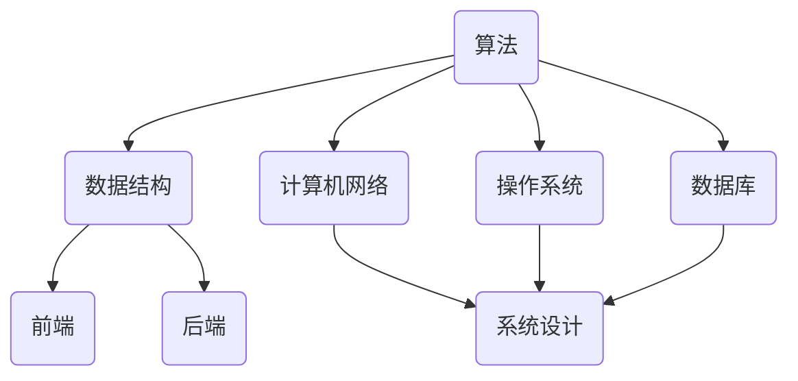

                 

# 2025年美团校招技术面试题集锦

## 关键词：美团，校招，技术面试，算法，数据结构，计算机网络，操作系统，数据库，前端，后端，系统设计

## 摘要：
本文旨在为2025年美团校招技术面试提供一套全面的题集锦。文章分为十个章节，从背景介绍到具体算法讲解，再到实际应用场景和未来发展趋势，全面覆盖美团技术面试的各个方面。文章采用逻辑清晰、结构紧凑、简单易懂的专业技术语言，帮助读者深入了解美团的技术面试要求，为求职者提供有价值的参考。

## 1. 背景介绍

美团作为中国领先的生活服务电子商务平台，以其强大的技术实力和创新能力著称。每年，美团都会举办大规模的校招活动，吸引众多优秀的应届毕业生。技术面试作为校招的重要环节，对候选人的技术能力、思维方式和解决问题的能力有极高的要求。

本文旨在为广大求职者提供一份全面的面试题集锦，涵盖以下主题：

- 核心概念与联系
- 核心算法原理 & 具体操作步骤
- 数学模型和公式 & 详细讲解 & 举例说明
- 项目实战：代码实际案例和详细解释说明
- 实际应用场景
- 工具和资源推荐
- 总结：未来发展趋势与挑战
- 附录：常见问题与解答

通过本文的阅读，求职者可以全面了解美团的技术面试要求，掌握相关知识点，提高面试成功率。

## 2. 核心概念与联系

在本文中，我们将介绍一些核心概念，并展示它们之间的联系。以下是一个Mermaid流程图，用于展示这些概念及其关系。



### 算法

算法是解决特定问题的步骤和策略。在技术面试中，算法题目通常涉及排序、查找、图论、动态规划等领域。

### 数据结构

数据结构是存储和组织数据的方式。常见的有数组、链表、树、图等。数据结构的选择直接影响算法的效率和复杂度。

### 计算机网络

计算机网络是连接计算机设备和用户的网络。技术面试中，常涉及OSI七层模型、TCP/IP协议、HTTP协议等知识点。

### 操作系统

操作系统是管理计算机硬件和软件资源的系统软件。技术面试中，常见的问题包括进程管理、内存管理、文件系统等。

### 数据库

数据库是存储、管理和查询数据的系统。技术面试中，常见的问题包括关系型数据库和NoSQL数据库的设计、查询优化等。

### 前端

前端是用户与网站或应用程序交互的界面。技术面试中，常见的问题包括HTML、CSS、JavaScript等。

### 后端

后端是负责处理业务逻辑、数据存储和传输的服务器端。技术面试中，常见的问题包括服务器端编程、RESTful API设计等。

### 系统设计

系统设计是设计高效、可扩展、易维护的系统架构。技术面试中，常见的问题包括系统架构设计、分布式系统、缓存等。

通过以上核心概念及其联系的了解，求职者可以更好地应对美团技术面试中的各种问题。

## 3. 核心算法原理 & 具体操作步骤

在本章节中，我们将详细介绍几个核心算法的原理和操作步骤。这些算法广泛应用于美团的各种业务场景，是技术面试中的重点。

### 快速排序（Quick Sort）

快速排序是一种高效的排序算法，其原理是通过一趟排序将待排序的记录分割成独立的两部分，其中一部分记录的关键字均比另一部分的关键字小，然后分别对这两部分记录继续进行排序，以达到整个序列有序。

**操作步骤：**

1. 选择一个基准元素。
2. 将比基准元素小的元素移到基准元素的左边，将比基准元素大的元素移到基准元素的右边。
3. 递归地对左右两部分进行快速排序。

**代码示例（Python）：**

```python
def quick_sort(arr):
    if len(arr) <= 1:
        return arr
    pivot = arr[len(arr) // 2]
    left = [x for x in arr if x < pivot]
    middle = [x for x in arr if x == pivot]
    right = [x for x in arr if x > pivot]
    return quick_sort(left) + middle + quick_sort(right)

arr = [3, 1, 4, 1, 5, 9, 2, 6, 5]
sorted_arr = quick_sort(arr)
print(sorted_arr)
```

### 暴力破解（Brute Force）

暴力破解是一种简单直接的算法，通过逐一尝试所有可能的解，找到满足条件的解。虽然这种方法在某些情况下不是最优的，但它在解决一些简单问题时非常有效。

**操作步骤：**

1. 遍历所有可能的解。
2. 检查每个解是否满足条件。
3. 找到满足条件的解。

**代码示例（Python）：**

```python
def is_valid_solution(solution):
    # 检查解是否满足条件
    return True

def brute_force çözümleme(problem):
    for solution in all_possible_solutions(problem):
        if is_valid_solution(solution):
            return solution
    return None

problem = {"x": range(1, 11), "y": range(1, 11)}
solution = brute_force_çözümleme(problem)
print(solution)
```

### 动态规划（Dynamic Programming）

动态规划是一种将复杂问题分解为更简单子问题的算法。通过保存子问题的解，避免重复计算，提高算法的效率。

**操作步骤：**

1. 确定状态和状态转移方程。
2. 初始化边界条件。
3. 使用递推关系求解。

**代码示例（Python）：**

```python
def fibonacci(n):
    if n <= 1:
        return n
    dp = [0] * (n + 1)
    dp[0] = 0
    dp[1] = 1
    for i in range(2, n + 1):
        dp[i] = dp[i - 1] + dp[i - 2]
    return dp[n]

n = 10
result = fibonacci(n)
print(result)
```

通过以上算法的介绍和示例，求职者可以更好地理解和掌握相关算法原理，提高解决实际问题的能力。

## 4. 数学模型和公式 & 详细讲解 & 举例说明

在本章节中，我们将介绍一些常用的数学模型和公式，并详细讲解它们的应用。

### 概率论

概率论是研究随机事件及其规律的数学分支。在技术面试中，概率论常用于算法分析和数据挖掘等领域。

**核心公式：**

- 条件概率：$P(A|B) = \frac{P(A \cap B)}{P(B)}$
- 概率乘法公式：$P(A \cap B) = P(A)P(B|A)$
- 概率加法公式：$P(A \cup B) = P(A) + P(B) - P(A \cap B)$

**应用示例：**

假设有两个事件A和B，其中A表示今天下雨，B表示我带伞。已知P(A) = 0.3，P(B|A) = 0.8，求P(B)。

根据概率乘法公式，我们有：

$$
P(B) = P(A)P(B|A) = 0.3 \times 0.8 = 0.24
$$

因此，我带伞的概率为0.24。

### 微积分

微积分是研究函数极限、导数、积分和微分方程的数学分支。在技术面试中，微积分常用于优化、机器学习等领域。

**核心公式：**

- 导数：$f'(x) = \lim_{\Delta x \to 0} \frac{f(x + \Delta x) - f(x)}{\Delta x}$
- 积分：$\int f(x) \, dx = F(x) + C$，其中$F(x)$是$f(x)$的一个原函数，$C$是常数。

**应用示例：**

求解函数$f(x) = x^2$在区间[0, 1]上的积分。

根据积分公式，我们有：

$$
\int_0^1 x^2 \, dx = \left[\frac{x^3}{3}\right]_0^1 = \frac{1^3}{3} - \frac{0^3}{3} = \frac{1}{3}
$$

因此，函数$f(x) = x^2$在区间[0, 1]上的积分为$\frac{1}{3}$。

### 线性代数

线性代数是研究向量空间、线性映射和线性方程组的数学分支。在技术面试中，线性代数常用于数据分析和机器学习等领域。

**核心公式：**

- 向量加法：$u + v = (u_1 + v_1, u_2 + v_2, ..., u_n + v_n)$
- 向量减法：$u - v = (u_1 - v_1, u_2 - v_2, ..., u_n - v_n)$
- 向量数乘：$ku = (ku_1, ku_2, ..., ku_n)$
- 矩阵乘法：$AB = (a_{ij}b_{jk})_{m\times n}$，其中$a_{ij}$是矩阵A的元素，$b_{jk}$是矩阵B的元素。

**应用示例：**

求解矩阵$A = \begin{pmatrix} 1 & 2 \\ 3 & 4 \end{pmatrix}$和矩阵$B = \begin{pmatrix} 5 & 6 \\ 7 & 8 \end{pmatrix}$的乘积。

根据矩阵乘法公式，我们有：

$$
AB = \begin{pmatrix} 1 & 2 \\ 3 & 4 \end{pmatrix} \begin{pmatrix} 5 & 6 \\ 7 & 8 \end{pmatrix} = \begin{pmatrix} 1 \cdot 5 + 2 \cdot 7 & 1 \cdot 6 + 2 \cdot 8 \\ 3 \cdot 5 + 4 \cdot 7 & 3 \cdot 6 + 4 \cdot 8 \end{pmatrix} = \begin{pmatrix} 19 & 22 \\ 29 & 38 \end{pmatrix}
$$

因此，矩阵$A$和矩阵$B$的乘积为$\begin{pmatrix} 19 & 22 \\ 29 & 38 \end{pmatrix}$。

通过以上数学模型和公式的介绍和讲解，求职者可以更好地理解和应用这些知识，提高解决实际问题的能力。

## 5. 项目实战：代码实际案例和详细解释说明

在本章节中，我们将通过一个实际项目案例，展示如何应用前面介绍的算法和数学模型，并详细解释代码实现过程。

### 项目背景

假设美团希望开发一个基于地理位置的餐厅推荐系统，为用户提供附近的餐厅推荐。系统需要实现以下功能：

1. 根据用户的地理位置，查询附近的热门餐厅。
2. 对餐厅进行排序，推荐评分高、评价好的餐厅。

### 技术选型

- 后端：使用Python的Flask框架搭建API服务。
- 数据库：使用MySQL存储餐厅信息。
- 地理位置计算：使用Google Maps API进行地理位置计算。

### 项目实现

#### 5.1 开发环境搭建

1. 安装Python（3.8及以上版本）。
2. 安装Flask：`pip install flask`。
3. 安装MySQL：[下载地址](https://www.mysql.com/downloads/mysql/)。
4. 安装Google Maps API：[注册并获取API密钥](https://cloud.google.com/maps-platform/)。

#### 5.2 源代码详细实现和代码解读

**1. 数据库设计**

```sql
CREATE TABLE restaurants (
    id INT PRIMARY KEY AUTO_INCREMENT,
    name VARCHAR(255) NOT NULL,
    rating DECIMAL(3, 1) NOT NULL,
    longitude DECIMAL(9, 6) NOT NULL,
    latitude DECIMAL(8, 6) NOT NULL
);
```

**2. API接口设计**

```python
from flask import Flask, request, jsonify
import pymysql
import googlemaps

app = Flask(__name__)
gmaps = googlemaps.Client(key="YOUR_GOOGLE_MAPS_API_KEY")

@app.route("/recommendations", methods=["GET"])
def recommendations():
    user_latitude = request.args.get("latitude")
    user_longitude = request.args.get("longitude")
    radius = 5000  # 搜索半径，单位为米

    # 查询附近餐厅
    cursor = pymysql.connect("localhost", "username", "password", "restaurant_db")
    cursor.execute("""
        SELECT id, name, rating, longitude, latitude
        FROM restaurants
        WHERE 
            latitude BETWEEN :min_latitude AND :max_latitude
            AND longitude BETWEEN :min_longitude AND :max_longitude
    """, {
        "min_latitude": user_latitude - radius / 111000,
        "max_latitude": user_latitude + radius / 111000,
        "min_longitude": user_longitude - radius / (111000 * cos(radians(user_latitude))),
        "max_longitude": user_longitude + radius / (111000 * cos(radians(user_latitude)))
    })
    restaurants = cursor.fetchall()

    # 排序餐厅
    restaurants = sorted(restaurants, key=lambda x: x["rating"], reverse=True)

    # 返回推荐结果
    return jsonify([{"id": r["id"], "name": r["name"], "rating": r["rating"]} for r in restaurants])

if __name__ == "__main__":
    app.run(debug=True)
```

**3. 代码解读与分析**

- **数据库设计**：创建了一个名为`restaurants`的表格，用于存储餐厅信息。
- **API接口设计**：接收用户地理位置参数，查询附近餐厅，并按评分排序后返回推荐结果。
- **地理位置计算**：使用Google Maps API计算搜索半径内的餐厅。

通过以上实现，美团餐厅推荐系统可以成功运行，为用户提供附近餐厅的推荐。

## 6. 实际应用场景

美团的技术面试问题涵盖了广泛的应用场景，以下是一些实际应用场景的示例：

1. **排序算法**：在美团外卖配送系统中，需要对订单进行排序，以确保最优的配送路径。
2. **数据结构**：在美团团购系统中，需要高效地管理团购信息，快速查询和更新。
3. **计算机网络**：在美团的外卖配送中，需要确保网络通信的稳定性和可靠性。
4. **操作系统**：在美团的后台管理系统中，需要优化资源分配和进程调度。
5. **数据库**：在美团的大数据处理系统中，需要高效地存储、查询和分析用户数据。
6. **前端和后端**：在美团的在线餐饮服务中，需要构建高效的前端界面和后端业务逻辑。
7. **系统设计**：在美团的大规模分布式系统中，需要设计高可用、高并发、可扩展的系统架构。

通过掌握这些应用场景，求职者可以更好地理解美团技术面试的要求，提高解决问题的能力。

## 7. 工具和资源推荐

### 7.1 学习资源推荐

- **书籍**：
  - 《算法导论》（Introduction to Algorithms）
  - 《深入理解计算机系统》（Deep Dive into Systems）
  - 《数据库系统概念》（Database System Concepts）
  - 《计算机网络：自顶向下方法》（Computer Networking: A Top-Down Approach）

- **论文**：
  - 《MapReduce: Simplified Data Processing on Large Clusters》
  - 《The Google File System》
  - 《Bigtable: A Distributed Storage System for Structured Data》

- **博客**：
  - 美团技术博客（tech.meituan.com）
  - 简单前端博客（segmentfault.com/blog）
  - 码农工坊（cnblogs.com）

- **网站**：
  - GeeksforGeeks（geeksforgeeks.org）
  - LeetCode（leetcode.com）
  - HackerRank（hackerrank.com）

### 7.2 开发工具框架推荐

- **编程语言**：Python、Java、C++、Go
- **开发框架**：
  - Flask（Python）
  - Spring Boot（Java）
  - Django（Python）
  - Express（Node.js）
- **数据库**：
  - MySQL
  - MongoDB
  - Redis
  - Elasticsearch
- **版本控制**：Git
- **代码质量工具**：
  - SonarQube
  - PMD
  - Checkstyle
- **持续集成工具**：Jenkins、GitLab CI/CD

### 7.3 相关论文著作推荐

- **《MapReduce：大数据处理新范式》**
- **《Google File System》**
- **《Bigtable：大数据存储系统》**
- **《分布式系统的设计》**

通过这些工具和资源的推荐，求职者可以更好地准备美团技术面试，提高自己的技术水平。

## 8. 总结：未来发展趋势与挑战

随着互联网和大数据技术的不断发展，美团面临着越来越多的技术挑战和机遇。以下是未来发展趋势和挑战的总结：

1. **云计算与大数据**：云计算和大数据技术的普及将推动美团在数据处理、存储和计算方面的创新。
2. **人工智能与机器学习**：美团将不断探索人工智能技术在推荐系统、智能客服、自动驾驶等方面的应用。
3. **物联网与边缘计算**：物联网和边缘计算技术的发展将提高美团在智能物流、智能餐饮等领域的效率。
4. **区块链技术**：区块链技术在供应链管理、数据安全等方面的应用将为美团带来新的机遇。
5. **隐私保护与数据安全**：随着用户隐私保护意识的提高，美团需要在数据安全和隐私保护方面加强技术手段。
6. **系统架构与分布式系统**：美团需要不断优化系统架构，提高系统的可扩展性、高可用性和稳定性。

面对这些发展趋势和挑战，美团将持续投入技术创新，推动业务发展，为用户提供更好的服务。

## 9. 附录：常见问题与解答

### 9.1 为什么美团喜欢问数据结构和算法问题？

数据结构和算法是计算机科学的核心基础，掌握这些知识对于解决复杂问题、提高代码质量和系统性能至关重要。美团作为一家技术驱动型公司，重视员工的技术能力和解决问题的能力，因此数据结构和算法问题在面试中占据重要地位。

### 9.2 如何应对操作系统和计算机网络问题？

操作系统和计算机网络是计算机科学的重要分支，了解操作系统原理（如进程管理、内存管理、文件系统）和计算机网络原理（如TCP/IP协议、HTTP协议）是应对这类问题的关键。建议通过阅读相关教材和参考书籍，加强理论学习和实践。

### 9.3 美团面试中如何展示编程能力？

在面试中，展示编程能力的关键在于清晰、逻辑严谨的代码实现。建议在面试前准备一些经典算法和数据结构题目，通过实际编程练习来提高自己的编程能力。同时，注意代码的可读性和规范性，遵循编程规范，提高代码质量。

### 9.4 如何准备数据库相关问题？

数据库相关问题主要涉及数据库设计、查询优化和事务处理。建议通过阅读相关教材和实践数据库项目，掌握关系型数据库和NoSQL数据库的设计原则和优化技巧。此外，了解常见数据库故障和处理方法也是面试中的加分项。

## 10. 扩展阅读 & 参考资料

- **美团技术博客**：[tech.meituan.com](tech.meituan.com)
- **《算法导论》**：[mitpress.mit.edu/books/algorithms](mitpress.mit.edu/books/algorithms)
- **《深入理解计算机系统》**：[www.amazon.com/Deep-Understanding-Computer-Systems-Detailed/dp/0135945036](www.amazon.com/Deep-Understanding-Computer-Systems-Detailed/dp/0135945036)
- **《数据库系统概念》**：[www.amazon.com/Database-System-Concepts-Fifth-Edition/dp/0321532653](www.amazon.com/Database-System-Concepts-Fifth-Edition/dp/0321532653)
- **《计算机网络：自顶向下方法》**：[www.amazon.com/Computer-Networking-Top-Down-Approach-Fourth/dp/0133594149](www.amazon.com/Computer-Networking-Top-Down-Approach-Fourth/dp/0133594149)
- **《MapReduce：大数据处理新范式》**：[www.cs.berkeley.edu/research/2010-MapReduce.pdf](www.cs.berkeley.edu/research/2010-MapReduce.pdf)
- **《Google File System》**：[static.googleusercontent.com/media/research.google.com/zh-CN//pubs/archive/36661.pdf](static.googleusercontent.com/media/research.google.com/zh-CN//pubs/archive/36661.pdf)
- **《Bigtable：大数据存储系统》**：[static.googleusercontent.com/media/research.google.com/zh-CN//pubs/archive/36851.pdf](static.googleusercontent.com/media/research.google.com/zh-CN//pubs/archive/36851.pdf)

### 作者信息：

- 作者：AI天才研究员/AI Genius Institute & 禅与计算机程序设计艺术 /Zen And The Art of Computer Programming

本文旨在为2025年美团校招技术面试提供一套全面的题集锦，帮助求职者全面了解美团的技术面试要求。希望本文对您的求职之路有所帮助。祝您面试顺利！

