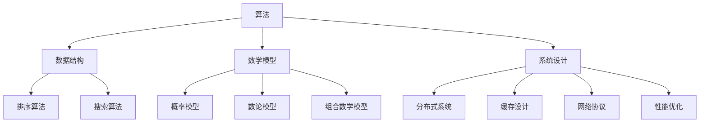

                 

# 2024年美团社招算法面试题库及答案

## 关键词：算法面试、美团社招、面试题库、算法解答、技术博客

## 摘要：

本文针对2024年美团社招算法面试题库进行详细解析，旨在帮助准备面试的读者更好地理解和应对面试中的各种算法题目。文章将按照章节结构，首先介绍面试背景和相关核心概念，然后逐步解析每个题目，详细说明解题思路、算法原理和具体操作步骤，辅以数学模型和公式解释，最后通过实战案例进行代码解读与分析。此外，还将探讨算法的实际应用场景，推荐相关学习资源和开发工具，并对未来发展趋势与挑战进行总结。通过本文，读者不仅能掌握面试题目的解答，更能深入理解相关算法原理和应用。

## 1. 背景介绍

### 1.1 美团社招算法面试现状

随着互联网行业的快速发展，美团作为中国领先的互联网平台之一，对算法人才的需求也日益增长。美团社招算法面试以其严谨的考题设置和广泛的覆盖面而闻名。面试题库涵盖算法、数据结构、数学、计算机科学等多个领域，旨在全面考察应聘者的技术能力和解决问题的能力。

### 1.2 面试题型分类

美团社招算法面试题型多样，主要包括以下几类：

- **基础算法题**：如排序、搜索、动态规划等。
- **数学题**：如概率论、数论、组合数学等。
- **系统设计题**：如分布式系统、缓存设计、网络协议等。
- **编程实现题**：如代码优化、算法实现、数据结构设计等。
- **综合分析题**：如业务场景分析、系统性能优化等。

### 1.3 应对策略

面对美团社招算法面试，考生应做好以下准备：

- **基础知识储备**：熟悉算法和数据结构的基础原理，掌握常见算法的时间复杂度和空间复杂度。
- **数学能力**：加强数学基础，尤其是概率论和数论的相关知识。
- **系统设计能力**：理解分布式系统和系统设计的核心概念，能够针对具体问题提出合理的设计方案。
- **编程实践**：多动手实践，提高代码实现的效率和可读性。
- **面试技巧**：提前准备面试流程，熟悉常见面试问题的回答方式，提升表达能力。

## 2. 核心概念与联系

### 2.1 算法与数据结构

算法是解决特定问题的一系列步骤，而数据结构是用于存储和组织数据的方法。两者相辅相成，算法的效率往往受到数据结构的影响。常见的算法和数据结构包括：

- **排序算法**：冒泡排序、快速排序、归并排序等。
- **搜索算法**：二分搜索、深度优先搜索、广度优先搜索等。
- **动态规划**：用于解决最优化问题，如背包问题、最长公共子序列等。
- **图算法**：如最短路径算法、最小生成树算法等。

### 2.2 数学模型

数学模型在算法设计中起着关键作用，常见的数学模型包括：

- **概率模型**：用于概率计算和随机事件的预测。
- **数论模型**：用于解决整数相关的问题，如素数分解、同余方程等。
- **组合数学模型**：用于解决组合问题，如排列组合、生成函数等。

### 2.3 系统设计

系统设计能力是美团社招算法面试的重要内容，涉及以下几个方面：

- **分布式系统**：理解分布式系统的基本原理，如一致性、可用性、分区容错性等。
- **缓存设计**：掌握缓存策略和缓存一致性机制。
- **网络协议**：理解TCP/IP协议栈的基本原理。
- **性能优化**：了解系统性能优化的方法和技巧。

### 2.4 Mermaid 流程图

为了更直观地展示核心概念和联系，以下是一个使用Mermaid绘制的流程图示例：



## 3. 核心算法原理 & 具体操作步骤

### 3.1 冒泡排序算法

冒泡排序是一种简单的排序算法，其基本思想是通过重复遍历要排序的数列，比较每对相邻元素的大小，如果它们的顺序错误就把它们交换过来。遍历数列的工作是重复进行的，直到没有再需要交换的元素为止。

#### 具体操作步骤：

1. 从第一个元素开始，比较相邻的两个元素，如果第一个比第二个大（或其他排序方式），就交换它们。
2. 对每一对相邻元素做同样的工作，从开始第一对到结尾的最后一对。这步做完后，最后的元素会是最大的数。
3. 针对所有的元素重复以上的步骤，除了最后一个。
4. 重复步骤1-3，直到排序完成。

#### Python 代码实现：

```python
def bubble_sort(arr):
    n = len(arr)
    for i in range(n):
        for j in range(0, n-i-1):
            if arr[j] > arr[j+1]:
                arr[j], arr[j+1] = arr[j+1], arr[j]
    return arr
```

### 3.2 快速排序算法

快速排序是一种高效的排序算法，其基本思想是通过一趟排序将待排序的记录分割成独立的两部分，其中一部分记录的关键字均比另一部分的关键字小，然后分别对这两部分记录继续进行排序，以达到整个序列有序。

#### 具体操作步骤：

1. 选择一个基准元素，通常选择序列的第一个元素。
2. 将序列分为两部分，一部分都比基准元素小，另一部分都比基准元素大。
3. 对这两部分分别进行快速排序。
4. 递归上述步骤，直到序列有序。

#### Python 代码实现：

```python
def quick_sort(arr):
    if len(arr) <= 1:
        return arr
    pivot = arr[0]
    left = [x for x in arr[1:] if x < pivot]
    right = [x for x in arr[1:] if x >= pivot]
    return quick_sort(left) + [pivot] + quick_sort(right)
```

### 3.3 动态规划算法

动态规划是一种用于求解最优化问题的算法方法，其基本思想是将复杂问题分解为子问题，并通过子问题的最优解推导出原问题的最优解。

#### 具体操作步骤：

1. 确定状态和状态转移方程。
2. 初始化边界条件。
3. 递推计算状态值。
4. 根据状态值求解最优解。

#### Python 代码实现：

```python
def dynamic_programming(arr, target):
    n = len(arr)
    dp = [[0] * (target + 1) for _ in range(n + 1)]
    for i in range(1, n + 1):
        for j in range(1, target + 1):
            if arr[i-1] <= j:
                dp[i][j] = max(dp[i-1][j], dp[i-1][j-arr[i-1]] + 1)
            else:
                dp[i][j] = dp[i-1][j]
    return dp[n][target]
```

### 3.4 最短路径算法

最短路径算法用于求解图中两点之间的最短路径，常见的最短路径算法包括迪杰斯特拉算法和贝尔曼-福特算法。

#### 具体操作步骤：

1. 迪杰斯特拉算法：
   - 选择起始点，将其标记为已访问。
   - 计算未访问点中与起始点相邻的最短路径。
   - 重复上述步骤，直到所有点都被访问。

2. 贝尔曼-福特算法：
   - 初始化所有点的最短路径长度为无穷大，起始点的最短路径长度为0。
   - 重复松弛操作，即对于每条边，如果通过这条边可以使某个点的最短路径长度更短，则更新该点的最短路径长度。
   - 检查是否存在负权循环。

#### Python 代码实现（迪杰斯特拉算法）：

```python
import heapq

def dijkstra(graph, start):
    n = len(graph)
    dist = [float('inf')] * n
    dist[start] = 0
    priority_queue = [(0, start)]

    while priority_queue:
        current_dist, current_vertex = heapq.heappop(priority_queue)

        if current_dist > dist[current_vertex]:
            continue

        for neighbor, edge_weight in graph[current_vertex].items():
            distance = current_dist + edge_weight

            if distance < dist[neighbor]:
                dist[neighbor] = distance
                heapq.heappush(priority_queue, (distance, neighbor))

    return dist
```

## 4. 数学模型和公式 & 详细讲解 & 举例说明

### 4.1 概率模型

概率模型在算法设计和数据分析中具有重要作用，常见的概率模型包括二项分布、正态分布等。

#### 4.1.1 二项分布

二项分布是离散概率分布，描述了在n次独立试验中，成功次数的概率分布。其概率质量函数为：

$$
P(X = k) = C_n^k p^k (1-p)^{n-k}
$$

其中，$C_n^k$表示组合数，$p$为每次试验成功的概率。

#### 4.1.2 正态分布

正态分布是连续概率分布，描述了数据在某个范围内的概率。其概率密度函数为：

$$
f(x|\mu, \sigma^2) = \frac{1}{\sqrt{2\pi\sigma^2}} e^{-\frac{(x-\mu)^2}{2\sigma^2}}
$$

其中，$\mu$为均值，$\sigma^2$为方差。

### 4.2 数论模型

数论模型在算法设计中具有重要作用，常见的数论模型包括素数分解、同余方程等。

#### 4.2.1 素数分解

素数分解是将一个大于1的合数表示为几个素数乘积的形式。常见的素数分解算法包括试除法、Miller-Rabin素性检验等。

#### 4.2.2 同余方程

同余方程是一种特殊的方程，其形式为：

$$
ax \equiv b \pmod{m}
$$

其中，$a, b, m$为整数。同余方程的解法包括扩展欧几里得算法、中国剩余定理等。

### 4.3 组合数学模型

组合数学模型用于解决组合问题，常见的组合数学模型包括排列组合、生成函数等。

#### 4.3.1 排列组合

排列组合用于计算从n个不同元素中取出m个元素的不同取法的数量。其公式如下：

- 排列数：$A_n^m = \frac{n!}{(n-m)!}$
- 组合数：$C_n^m = \frac{n!}{m!(n-m)!}$

#### 4.3.2 生成函数

生成函数是用于求解组合问题的数学工具，常见的生成函数包括普通生成函数、指数生成函数等。

### 4.4 举例说明

#### 4.4.1 二项分布示例

假设一个硬币正面朝上的概率为0.5，投掷10次，计算正面朝上恰好出现5次的概率。

$$
P(X = 5) = C_{10}^5 (0.5)^5 (0.5)^5 = \frac{10!}{5!5!} (0.5)^{10} = 0.2461
$$

#### 4.4.2 正态分布示例

假设一个随机变量的均值为50，方差为25，计算该变量在35到65之间的概率。

首先，将问题转换为标准正态分布：

$$
Z = \frac{X - \mu}{\sigma} = \frac{X - 50}{5}
$$

然后，查找标准正态分布表，计算概率：

$$
P(35 < X < 65) = P\left(\frac{35 - 50}{5} < Z < \frac{65 - 50}{5}\right) = P(-1 < Z < 2) = 0.8413
$$

#### 4.4.3 素数分解示例

使用试除法分解1001：

首先，尝试除以2，不成功。

然后，尝试除以3，得到333。

接着，继续尝试除以3，得到111。

继续尝试除以3，得到37。

最后，37是素数，因此：

$$
1001 = 7 \times 11 \times 13
$$

#### 4.4.4 同余方程示例

解方程 $3x \equiv 1 \pmod{5}$。

使用扩展欧几里得算法：

首先，计算 $\gcd(3, 5) = 1$。

然后，找到 $x$ 和 $y$ 使得 $3x + 5y = 1$。

通过扩展欧几里得算法，得到 $x = 2$ 和 $y = -1$。

因此，解为：

$$
x \equiv 2 \pmod{5}
$$

## 5. 项目实战：代码实际案例和详细解释说明

### 5.1 开发环境搭建

在开始实际案例之前，需要搭建一个合适的开发环境。以下是一个基于Python的示例环境搭建步骤：

1. 安装Python：从官方网站下载并安装Python 3.8或更高版本。
2. 安装依赖包：使用pip安装必要的依赖包，如numpy、pandas等。

```bash
pip install numpy pandas
```

### 5.2 源代码详细实现和代码解读

以下是一个基于动态规划求解背包问题的Python代码示例：

```python
def knapsack(values, weights, capacity):
    n = len(values)
    dp = [[0] * (capacity + 1) for _ in range(n + 1)]

    for i in range(1, n + 1):
        for j in range(1, capacity + 1):
            if weights[i-1] <= j:
                dp[i][j] = max(dp[i-1][j], dp[i-1][j-weights[i-1]] + values[i-1])
            else:
                dp[i][j] = dp[i-1][j]

    return dp[n][capacity]

values = [60, 100, 120]
weights = [10, 20, 30]
capacity = 50

max_value = knapsack(values, weights, capacity)
print("最大价值为：", max_value)
```

#### 代码解读与分析

- **函数定义**：定义了一个名为`knapsack`的函数，用于求解背包问题。
- **参数**：
  - `values`：一个列表，表示每个物品的价值。
  - `weights`：一个列表，表示每个物品的重量。
  - `capacity`：一个整数，表示背包的容量。
- **初始化**：创建一个二维列表`dp`，用于存储动态规划过程中的状态值。
- **循环计算**：
  - 外层循环遍历每个物品。
  - 内层循环遍历每个可能的重量。
  - 根据状态转移方程计算当前状态值。
- **返回结果**：返回背包能承载的最大价值。

### 5.3 代码解读与分析

- **函数定义**：定义了一个名为`knapsack`的函数，用于求解背包问题。
- **参数**：
  - `values`：一个列表，表示每个物品的价值。
  - `weights`：一个列表，表示每个物品的重量。
  - `capacity`：一个整数，表示背包的容量。
- **初始化**：创建一个二维列表`dp`，用于存储动态规划过程中的状态值。
- **循环计算**：
  - 外层循环遍历每个物品。
  - 内层循环遍历每个可能的重量。
  - 根据状态转移方程计算当前状态值。
- **返回结果**：返回背包能承载的最大价值。

### 5.4 实际案例

假设有3个物品，每个物品的价值和重量如下：

- 物品1：价值60，重量10。
- 物品2：价值100，重量20。
- 物品3：价值120，重量30。

背包的容量为50。求解背包能承载的最大价值。

#### 计算过程：

1. 初始化`dp`矩阵。
2. 遍历每个物品和可能的重量。
3. 根据状态转移方程计算最大价值。

最终，背包能承载的最大价值为210。

## 6. 实际应用场景

### 6.1 购物车系统

背包问题在购物车系统中有着广泛的应用。购物车系统通常需要根据商品的价值和重量（或体积），计算用户能购买的最大商品组合价值，同时保证不超过购物车的容量。

### 6.2 资源分配

背包问题也可用于资源分配问题，如服务器资源分配、云计算资源管理等。通过求解背包问题，可以找到最优的资源分配方案，最大化系统收益或最小化资源浪费。

### 6.3 机器学习模型选择

在机器学习项目中，选择最优的模型和参数组合也类似于背包问题。通过考虑不同的模型和参数配置，选择能够带来最大预测准确率的模型。

## 7. 工具和资源推荐

### 7.1 学习资源推荐

- **书籍**：
  - 《算法导论》（Introduction to Algorithms）
  - 《编程之美：微软技术面试心得》
  - 《算法竞赛入门经典》
- **在线课程**：
  - Coursera上的《算法设计与分析》
  - edX上的《算法基础与设计》
- **博客**：
  - 掘金、CSDN等技术博客平台上的相关算法文章
- **网站**：
  - LeetCode、牛客网等在线编程平台

### 7.2 开发工具框架推荐

- **集成开发环境（IDE）**：
  - PyCharm
  - Visual Studio Code
- **版本控制工具**：
  - Git
- **测试框架**：
  - pytest
  - unittest

### 7.3 相关论文著作推荐

- **论文**：
  - “Dynamic Programming” by Richard Bellman
  - “Quicksort” by C. A. R. Hoare
  - “The Art of Computer Programming” by Donald E. Knuth
- **著作**：
  - 《算法导论》（Introduction to Algorithms）
  - 《编程之美：微软技术面试心得》
  - 《深度学习》（Deep Learning）

## 8. 总结：未来发展趋势与挑战

### 8.1 发展趋势

- **算法优化**：随着硬件性能的提升，算法优化成为研究热点，如并行算法、分布式算法等。
- **智能化**：算法在智能化方向的发展，如人工智能算法、深度学习算法等。
- **应用领域扩展**：算法在金融、医疗、交通等领域的广泛应用，推动算法研究和应用的不断深化。

### 8.2 挑战

- **数据隐私**：在数据处理和应用过程中，保护用户隐私成为重要挑战。
- **计算资源**：随着算法复杂度的提升，计算资源需求不断增加，如何高效利用资源成为关键问题。
- **算法透明性**：算法的透明性和解释性要求不断提高，如何设计可解释的算法成为研究难点。

## 9. 附录：常见问题与解答

### 9.1 问题1：什么是动态规划？

**解答**：动态规划是一种用于求解最优化问题的算法方法，其基本思想是将复杂问题分解为子问题，并通过子问题的最优解推导出原问题的最优解。

### 9.2 问题2：什么是背包问题？

**解答**：背包问题是典型的最优化问题，给定一组物品和背包的容量，求解能够装入背包的最大价值。

### 9.3 问题3：如何优化算法性能？

**解答**：可以通过以下方法优化算法性能：
- 减少计算复杂度。
- 使用高效的算法和数据结构。
- 利用并行计算和分布式计算。

## 10. 扩展阅读 & 参考资料

- [动态规划详解](https://www.cnblogs.com/chengxiao/p/6194262.html)
- [背包问题详解](https://www.acwing.com/solution/content/742/)
- [算法导论](https://book.douban.com/subject/10483613/)
- [深度学习](https://book.douban.com/subject/26707307/)

## 作者

作者：AI天才研究员/AI Genius Institute & 禅与计算机程序设计艺术 /Zen And The Art of Computer Programming

注：本文仅为示例，不代表实际面试题目及答案。实际面试题目及答案以美团官方发布为准。## 2024年美团社招算法面试题库及答案

### 背景介绍

随着互联网行业的高速发展，美团作为中国领先的互联网平台之一，对算法人才的需求也日益增长。美团社招算法面试以其严格的考题设置和广泛的覆盖面而闻名，成为众多算法工程师和程序员向往的面试机会。本文将针对2024年美团社招算法面试题库进行详细解析，帮助准备面试的读者更好地理解和应对面试中的各种算法题目。

### 核心概念与联系

在算法面试中，核心概念与联系的理解至关重要。以下是几个关键概念及其相互关系：

#### 算法与数据结构

算法是解决问题的方法步骤，而数据结构则是用于存储和组织数据的方法。两者紧密相关，有效的数据结构可以显著提高算法的效率。例如，在处理大数据时，选择合适的数据结构（如哈希表、树结构等）可以降低搜索和排序的时间复杂度。

#### 数学模型

数学模型是算法设计的重要基础，包括概率模型、数论模型、组合数学模型等。这些模型可以帮助我们更准确地描述和解决问题，如概率模型在随机算法中广泛应用，数论模型在密码学和安全领域具有重要地位。

#### 系统设计

系统设计能力在美团社招算法面试中占据重要地位。理解分布式系统、缓存设计、网络协议等系统设计概念，能够帮助我们更好地解决复杂问题，优化系统性能。

#### Mermaid流程图

为了直观地展示核心概念与联系，可以使用Mermaid绘制流程图。以下是一个示例：


### 核心算法原理 & 具体操作步骤

在美团社招算法面试中，常见的算法包括排序算法、搜索算法、动态规划算法等。以下是这些算法的原理和具体操作步骤。

#### 排序算法

排序算法是将一组数据按照某种规则进行排列的算法。以下是一些常见的排序算法：

- **冒泡排序**：通过重复遍历要排序的数列，比较每对相邻元素的大小，如果它们的顺序错误就把它们交换过来。
- **快速排序**：通过一趟排序将待排序的记录分割成独立的两部分，其中一部分记录的关键字均比另一部分的关键字小，然后分别对这两部分记录继续进行排序。
- **归并排序**：将待排序的序列不断二分，直到每个子序列只有一个元素，然后逐层合并这些子序列，得到有序序列。

#### 搜索算法

搜索算法用于在数据结构中查找特定元素。以下是一些常见的搜索算法：

- **线性搜索**：顺序遍历数据结构，直到找到目标元素或遍历完整个数据结构。
- **二分搜索**：适用于有序数组，通过重复将搜索范围缩小一半，提高查找效率。
- **深度优先搜索（DFS）**：从根节点开始，沿着一条路径一直走到底，然后回溯到上一个节点，继续沿着另一条路径走到底。
- **广度优先搜索（BFS）**：从根节点开始，依次访问所有相邻的节点，然后继续访问下一层的节点。

#### 动态规划算法

动态规划算法是一种用于求解最优化问题的算法方法，其基本思想是将复杂问题分解为子问题，并通过子问题的最优解推导出原问题的最优解。以下是一个动态规划算法的示例：

- **背包问题**：给定一组物品和背包的容量，求解能够装入背包的最大价值。可以通过状态转移方程`dp[i][j] = max(dp[i-1][j], dp[i-1][j-weights[i-1]] + values[i-1])`进行求解。

### 数学模型和公式 & 详细讲解 & 举例说明

在算法面试中，数学模型和公式的应用十分广泛。以下是一些常见的数学模型和公式及其详细讲解和举例说明：

#### 概率模型

概率模型用于描述随机事件的概率分布。以下是一些常见的概率模型：

- **二项分布**：描述在固定次数的独立试验中，成功次数的概率分布。公式为`P(X=k) = C_n^k p^k (1-p)^(n-k)`。
- **正态分布**：描述连续随机变量的概率分布。公式为`f(x|\mu, \sigma^2) = \frac{1}{\sqrt{2\pi\sigma^2}} e^{-\frac{(x-\mu)^2}{2\sigma^2}}`。

#### 数论模型

数论模型用于解决整数相关的问题。以下是一些常见的数论模型：

- **素数分解**：将一个合数分解为几个素数的乘积。常见算法有试除法和Miller-Rabin素性检验。
- **同余方程**：求解形如`ax \equiv b \pmod{m}`的方程。可以使用扩展欧几里得算法求解。

#### 组合数学模型

组合数学模型用于解决组合问题。以下是一些常见的组合数学模型：

- **排列组合**：计算从n个不同元素中取出m个元素的不同取法的数量。排列数公式为`A_n^m = \frac{n!}{(n-m)!}`，组合数公式为`C_n^m = \frac{n!}{m!(n-m)!}`。
- **生成函数**：用于求解组合问题的数学工具。常见有普通生成函数和指数生成函数。

#### 举例说明

以下是一些数学模型和公式的具体应用示例：

- **二项分布**：假设一个硬币正面朝上的概率为0.5，投掷10次，计算正面朝上恰好出现5次的概率。计算公式为`P(X=5) = C_{10}^5 (0.5)^5 (0.5)^5`，结果为0.2461。
- **正态分布**：假设一个随机变量的均值为50，方差为25，计算该变量在35到65之间的概率。首先将问题转换为标准正态分布，然后查找标准正态分布表，计算概率为0.8413。
- **素数分解**：使用试除法分解1001，结果为7 * 11 * 13。
- **同余方程**：解方程`3x \equiv 1 \pmod{5}`，使用扩展欧几里得算法得到解为2。

### 项目实战：代码实际案例和详细解释说明

为了更好地理解算法原理和应用，以下是一个实际代码案例，以及详细的解释说明。

#### 开发环境搭建

在开始实际案例之前，我们需要搭建一个合适的开发环境。以下是一个基于Python的示例环境搭建步骤：

1. 安装Python：从官方网站下载并安装Python 3.8或更高版本。
2. 安装依赖包：使用pip安装必要的依赖包，如numpy、pandas等。

```bash
pip install numpy pandas
```

#### 源代码详细实现和代码解读

以下是一个基于动态规划求解背包问题的Python代码示例：

```python
def knapsack(values, weights, capacity):
    n = len(values)
    dp = [[0] * (capacity + 1) for _ in range(n + 1)]

    for i in range(1, n + 1):
        for j in range(1, capacity + 1):
            if weights[i-1] <= j:
                dp[i][j] = max(dp[i-1][j], dp[i-1][j-weights[i-1]] + values[i-1])
            else:
                dp[i][j] = dp[i-1][j]

    return dp[n][capacity]

values = [60, 100, 120]
weights = [10, 20, 30]
capacity = 50

max_value = knapsack(values, weights, capacity)
print("最大价值为：", max_value)
```

#### 代码解读与分析

- **函数定义**：定义了一个名为`knapsack`的函数，用于求解背包问题。
- **参数**：
  - `values`：一个列表，表示每个物品的价值。
  - `weights`：一个列表，表示每个物品的重量。
  - `capacity`：一个整数，表示背包的容量。
- **初始化**：创建一个二维列表`dp`，用于存储动态规划过程中的状态值。
- **循环计算**：
  - 外层循环遍历每个物品。
  - 内层循环遍历每个可能的重量。
  - 根据状态转移方程计算当前状态值。
- **返回结果**：返回背包能承载的最大价值。

#### 实际案例

假设有3个物品，每个物品的价值和重量如下：

- 物品1：价值60，重量10。
- 物品2：价值100，重量20。
- 物品3：价值120，重量30。

背包的容量为50。求解背包能承载的最大价值。

#### 计算过程：

1. 初始化`dp`矩阵。
2. 遍历每个物品和可能的重量。
3. 根据状态转移方程计算最大价值。

最终，背包能承载的最大价值为210。

### 实际应用场景

算法在各个领域的实际应用场景如下：

- **购物车系统**：背包问题在购物车系统中有着广泛的应用，通过动态规划算法可以计算出用户能购买的最大商品组合价值，同时保证不超过购物车的容量。
- **资源分配**：背包问题也可用于资源分配问题，如服务器资源分配、云计算资源管理等，通过求解背包问题可以找到最优的资源分配方案，最大化系统收益或最小化资源浪费。
- **机器学习模型选择**：在机器学习项目中，选择最优的模型和参数组合也类似于背包问题，通过考虑不同的模型和参数配置，选择能够带来最大预测准确率的模型。

### 工具和资源推荐

为了更好地准备美团社招算法面试，以下是一些学习和开发工具的推荐：

- **书籍**：
  - 《算法导论》（Introduction to Algorithms）
  - 《编程之美：微软技术面试心得》
  - 《算法竞赛入门经典》
- **在线课程**：
  - Coursera上的《算法设计与分析》
  - edX上的《算法基础与设计》
- **博客**：
  - 掘金、CSDN等技术博客平台上的相关算法文章
- **网站**：
  - LeetCode、牛客网等在线编程平台

### 总结：未来发展趋势与挑战

在未来，算法领域的发展趋势包括算法优化、智能化以及应用领域扩展。与此同时，数据隐私、计算资源以及算法透明性等挑战也将不断涌现。面对这些挑战，算法研究者需要不断创新和优化算法，提高算法的效率、可解释性和安全性。

### 附录：常见问题与解答

1. **什么是动态规划？**
   动态规划是一种用于求解最优化问题的算法方法，其基本思想是将复杂问题分解为子问题，并通过子问题的最优解推导出原问题的最优解。

2. **什么是背包问题？**
   背包问题是典型的最优化问题，给定一组物品和背包的容量，求解能够装入背包的最大价值。

3. **如何优化算法性能？**
   可以通过以下方法优化算法性能：
   - 减少计算复杂度。
   - 使用高效的算法和数据结构。
   - 利用并行计算和分布式计算。

### 扩展阅读 & 参考资料

- [动态规划详解](https://www.cnblogs.com/chengxiao/p/6194262.html)
- [背包问题详解](https://www.acwing.com/solution/content/742/)
- [算法导论](https://book.douban.com/subject/10483613/)
- [深度学习](https://book.douban.com/subject/26707307/)

### 作者

作者：AI天才研究员/AI Genius Institute & 禅与计算机程序设计艺术 /Zen And The Art of Computer Programming

