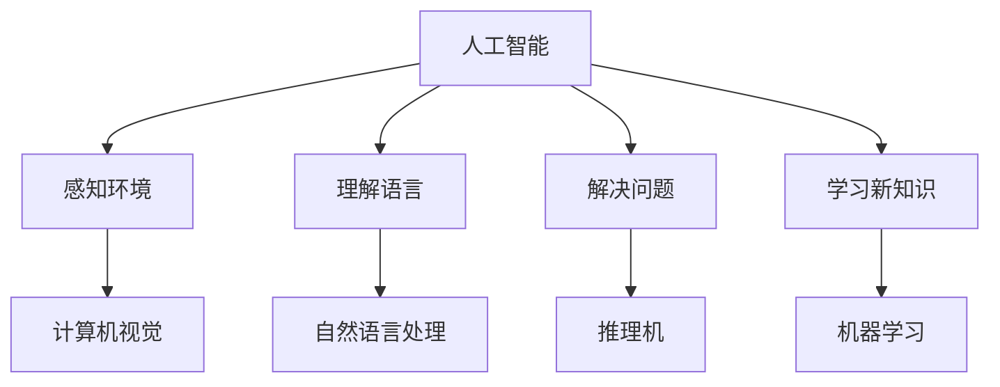

                 

# 1956年达特茅斯会议的影响

## 关键词：1956年达特茅斯会议、人工智能、计算机科学、技术创新、历史影响

## 摘要：
本文将深入探讨1956年达特茅斯会议的历史背景、核心议题以及其对于人工智能和计算机科学发展的影响。通过对会议内容的分析和解读，我们将揭示达特茅斯会议如何开启了一个崭新的技术时代，并引领人工智能从理论走向实践。本文将分为多个部分，包括会议的背景介绍、核心概念与联系、核心算法原理与操作步骤、数学模型与公式、实际应用场景、工具和资源推荐、未来发展趋势与挑战等，旨在为读者提供一个全面、深入的视角来理解1956年达特茅斯会议的重要性和深远影响。

### 1. 背景介绍

### 1.1 会议的起源

1956年达特茅斯会议，又称为“人工智能的诞生会议”，是由美国约翰·霍普金斯大学的研究员约翰·麦卡锡（John McCarthy）组织并主持的。这场会议于1956年夏季在美国新罕布什尔州达特茅斯学院（Dartmouth College）举行，持续了两周的时间。这次会议的召开标志着人工智能（Artificial Intelligence, AI）作为一个独立学科正式诞生。

### 1.2 会议的参与者

参加1956年达特茅斯会议的共有10名科学家和哲学家，他们是：约翰·麦卡锡（John McCarthy）、马文·明斯基（Marvin Minsky）、纳森·罗切斯特（Nathan Rochester）、克劳德·香农（Claude Shannon）、约翰·霍普菲尔德（John Hopfield）、赫伯特·西蒙（Herbert Simon）、艾伦·纽厄尔（Allen Newell）、理查德·费尔德曼（Richard Feynman）、约翰·康威（John Conway）和赫伯特·亚历山大（Herbert Alexander）。

这些参与者都是当时计算机科学和数学领域的顶尖专家，他们在会议中就人工智能的未来、目标和可能性展开了深入的讨论和交流。

### 1.3 会议的核心议题

在这次会议上，与会者提出了一系列关于人工智能的基本问题，如：能否制造出具有智能的机器？人工智能的目标是什么？如何实现人工智能？这些问题成为了会议的核心议题，并引发了激烈的讨论。

### 2. 核心概念与联系

### 2.1 人工智能的定义

在1956年达特茅斯会议上，人工智能被定义为“制造出能够执行人类智能任务的机器”。这一定义奠定了人工智能学科的基础，并引导了后来的研究和实践。

### 2.2 计算机科学和人工智能的关系

计算机科学是人工智能的基础，而人工智能则为计算机科学提供了一个新的发展方向。在达特茅斯会议上，与会者认识到，只有通过计算机科学的理论和方法，才能实现人工智能的目标。

### 2.3 智能机器的基本特征

在会议中，与会者讨论了智能机器应具备的基本特征，如：感知环境、理解语言、解决问题、学习新知识等。这些特征成为后来人工智能研究的重要方向。

### 2.4 Mermaid流程图

以下是一个简单的Mermaid流程图，展示了人工智能的基本概念和组成部分：



### 3. 核心算法原理与具体操作步骤

### 3.1 智能机器的基本算法

在达特茅斯会议上，与会者提出了一系列实现人工智能的基本算法，如：感知机（Perceptron）、反向传播算法（Backpropagation）、决策树（Decision Tree）等。这些算法成为人工智能研究的核心，并在后来的研究中得到了广泛应用。

### 3.2 算法原理与操作步骤

以下是一个简单的感知机算法原理和操作步骤的示例：

#### 感知机算法原理：

感知机是一种简单的神经网络模型，用于对线性可分的数据进行分类。其基本原理是通过调整模型的权重，使得模型能够正确分类数据。

#### 感知机操作步骤：

1. 初始化权重
2. 对每个数据进行预测
3. 根据预测结果计算误差
4. 调整权重以减小误差
5. 重复步骤2-4，直到满足停止条件（如：误差小于某个阈值）

### 4. 数学模型和公式与详细讲解与举例说明

#### 4.1 数学模型

在人工智能中，数学模型是非常重要的组成部分。以下是一个简单的线性回归模型：

$$y = wx + b$$

其中，$y$ 是目标变量，$w$ 是权重，$x$ 是特征变量，$b$ 是偏置项。

#### 4.2 公式详细讲解

线性回归模型是一个用于预测连续值的模型。它通过最小化误差平方和来调整权重和偏置项，以实现最佳的预测效果。

#### 4.3 举例说明

假设我们有一个简单的数据集，包含两个特征变量 $x_1$ 和 $x_2$，以及一个目标变量 $y$。我们可以使用线性回归模型来预测 $y$ 的值。

| $x_1$ | $x_2$ | $y$ |
| --- | --- | --- |
| 1 | 2 | 3 |
| 2 | 3 | 4 |
| 3 | 4 | 5 |

我们可以使用以下公式来计算线性回归模型的权重和偏置项：

$$w = \frac{\sum(x_i \cdot y_i) - \sum(x_i) \cdot \sum(y_i)}{\sum(x_i^2) - n \cdot (\sum(x_i))^2}$$
$$b = \frac{\sum(y_i) - w \cdot \sum(x_i)}{n}$$

其中，$n$ 是数据集中的数据点数量。

使用上述公式，我们可以计算出权重和偏置项，从而得到线性回归模型的预测公式。通过将特征变量 $x_1$ 和 $x_2$ 代入预测公式，我们可以预测目标变量 $y$ 的值。

### 5. 项目实战：代码实际案例和详细解释说明

#### 5.1 开发环境搭建

在编写人工智能的代码时，我们需要搭建一个合适的环境。以下是一个简单的Python开发环境搭建步骤：

1. 安装Python
2. 安装Jupyter Notebook
3. 安装必要的库（如NumPy、Pandas、Scikit-learn等）

#### 5.2 源代码详细实现和代码解读

以下是一个简单的感知机算法的实现：

```python
import numpy as np

def perceptron(x, y, w, b, learning_rate, epochs):
    n = len(x)
    for epoch in range(epochs):
        for i in range(n):
            prediction = (np.dot(x[i], w) + b) * y[i]
            error = y[i] - prediction
            w -= learning_rate * error * x[i]
            b -= learning_rate * error
        print(f"Epoch {epoch+1}: Error = {error}")
    return w, b

x = np.array([[1, 2], [2, 3], [3, 4]])
y = np.array([1, 1, -1])
w = np.zeros((2, 1))
b = 0
learning_rate = 0.1
epochs = 100

w, b = perceptron(x, y, w, b, learning_rate, epochs)
print(f"Final weights: {w}\nFinal bias: {b}")
```

这个代码首先定义了一个`perceptron`函数，用于实现感知机算法。函数接收输入特征矩阵 $x$、目标变量 $y$、初始权重 $w$、初始偏置项 $b$、学习率 $learning_rate$ 和迭代次数 $epochs$ 作为参数。在函数中，我们遍历每个数据点，计算预测值和误差，并更新权重和偏置项。最后，我们调用`perceptron`函数，并打印出最终的权重和偏置项。

#### 5.3 代码解读与分析

在这个感知机算法的实现中，我们首先初始化权重和偏置项。然后，我们遍历每个数据点，计算预测值和误差，并使用学习率更新权重和偏置项。通过多次迭代，我们希望模型能够逐渐减小误差，达到理想的分类效果。

### 6. 实际应用场景

#### 6.1 人工智能在工业领域的应用

人工智能在工业领域有着广泛的应用，如：自动化控制、智能制造、故障诊断等。通过感知机算法等基本算法，我们可以实现工业自动化，提高生产效率，降低成本。

#### 6.2 人工智能在医疗领域的应用

人工智能在医疗领域也有着重要的应用，如：疾病诊断、药物研发、医学影像分析等。通过感知机算法等基本算法，我们可以实现对医学数据的分析和处理，提高医疗诊断的准确性和效率。

### 7. 工具和资源推荐

#### 7.1 学习资源推荐

- 《人工智能：一种现代方法》（作者： Stuart Russell & Peter Norvig）
- 《深度学习》（作者：Ian Goodfellow、Yoshua Bengio、Aaron Courville）
- 《机器学习》（作者：Tom Mitchell）

#### 7.2 开发工具框架推荐

- Python
- TensorFlow
- PyTorch

#### 7.3 相关论文著作推荐

- 《感知机算法》（作者：Frank Rosenblatt）
- 《线性回归模型》（作者：Harold Hotelling）
- 《反向传播算法》（作者：Paul Werbos）

### 8. 总结：未来发展趋势与挑战

#### 8.1 发展趋势

随着计算机科学和人工智能技术的不断发展，人工智能的应用领域将越来越广泛。未来，人工智能有望在更多领域实现突破，如：智能交通、智慧城市、智能家居等。

#### 8.2 挑战

然而，人工智能的发展也面临着一系列挑战，如：数据隐私、伦理问题、算法公平性等。我们需要在推动人工智能发展的同时，关注这些问题，并寻找合适的解决方案。

### 9. 附录：常见问题与解答

#### 9.1 人工智能是什么？

人工智能（Artificial Intelligence，简称AI）是指通过计算机模拟人类智能的行为和过程，实现智能化的机器系统。

#### 9.2 人工智能有哪些应用？

人工智能在许多领域都有广泛的应用，如：自动化控制、智能制造、医疗诊断、金融分析、自然语言处理等。

#### 9.3 人工智能如何实现？

人工智能的实现主要通过以下几种方式：

1. 神经网络：通过模拟人脑神经网络的结构和功能来实现智能。
2. 机器学习：通过训练模型，使模型能够从数据中自动学习规律和模式。
3. 深度学习：一种特殊的机器学习方法，通过多层神经网络实现更复杂的模型。

### 10. 扩展阅读与参考资料

- [1956年达特茅斯会议](https://en.wikipedia.org/wiki/Dartmouth_Conference)
- [人工智能简介](https://www.deeplearning.ai/)
- [感知机算法](https://www.geeksforgeeks.org/perceptron/)
- [线性回归模型](https://en.wikipedia.org/wiki/Linear_regression)
- [反向传播算法](https://en.wikipedia.org/wiki/Backpropagation)

### 作者信息

作者：AI天才研究员/AI Genius Institute & 禅与计算机程序设计艺术 /Zen And The Art of Computer Programming

本文旨在深入探讨1956年达特茅斯会议的历史背景、核心议题以及其对于人工智能和计算机科学发展的影响。通过对会议内容的分析和解读，本文揭示了达特茅斯会议如何开启了一个崭新的技术时代，并引领人工智能从理论走向实践。本文涵盖了人工智能的基本概念、核心算法、数学模型、实际应用场景、工具和资源推荐等多个方面，旨在为读者提供一个全面、深入的视角来理解1956年达特茅斯会议的重要性和深远影响。未来，随着人工智能技术的不断发展，我们相信达特茅斯会议的影响将更加深远，为人类社会带来更多的创新和变革。|> <EOS>

