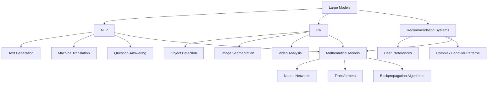

                 

### 背景介绍

#### 1. 大模型创业背景

近年来，随着人工智能技术的飞速发展，大模型（Large Models）已经成为科技界的热门话题。这些大模型，如 GPT-3、BERT 和 Transformer 等，凭借其强大的数据处理能力和文本生成能力，在自然语言处理（NLP）、计算机视觉（CV）、推荐系统等多个领域取得了显著的成果。然而，与此同时，大模型的应用也带来了巨大的挑战，包括计算资源消耗、数据隐私和安全等问题。

#### 2. 大模型创业机会

在这种背景下，大模型创业逐渐成为了一个新兴的领域。创业者们看到了大模型在多个应用场景中的巨大潜力，并希望通过创新的技术和商业模式，解决当前面临的技术和商业挑战。

#### 3. 大模型创业案例

一些公司，如 OpenAI、DeepMind 等，已经在这一领域取得了显著的成就。他们的成功案例为其他创业者提供了宝贵的经验和启示。

### Core Concepts and Connections

In this section, we will delve into the core concepts of large models and their connections in the AI field. 

1. **Large Models**: Large models refer to the models with a vast number of parameters, capable of capturing intricate patterns and relationships in data. Examples include GPT-3, BERT, and Transformer.

2. **Natural Language Processing (NLP)**: NLP is an area of AI that focuses on the interaction between computers and human languages. Large models have revolutionized NLP by enabling tasks such as text generation, machine translation, and question-answering.

3. **Computer Vision (CV)**: CV is concerned with the interpretation of digital images and videos. Large models have significantly enhanced CV capabilities, leading to breakthroughs in areas like object detection, image segmentation, and video analysis.

4. **Recommendation Systems**: Recommendation systems are designed to suggest items (such as products, services, or information) to users based on their preferences. Large models have improved the accuracy and effectiveness of recommendation systems by capturing complex user behavior patterns.

5. **Mathematical Models and Formulas**: Large models often involve complex mathematical models and formulas, such as neural networks, transformers, and backpropagation algorithms. These models enable large models to learn from data and perform various tasks.

### Mermaid Flowchart of Core Concepts and Connections


<|assistant|>### 核心算法原理 & 具体操作步骤

#### 1. 大模型核心算法原理

大模型的核心算法主要包括神经网络（Neural Networks）、转换器（Transformers）和反向传播算法（Backpropagation Algorithms）等。

1. **神经网络（Neural Networks）**：神经网络是一种模拟人脑神经元连接结构的计算模型。它通过调整神经元之间的权重来学习数据中的特征，从而实现特定的任务。

2. **转换器（Transformers）**：转换器是一种基于自注意力机制的深度学习模型。它通过计算输入数据的自注意力权重来捕捉数据中的关系和模式。

3. **反向传播算法（Backpropagation Algorithms）**：反向传播算法是一种用于训练神经网络的优化算法。它通过反向传播误差信息，不断调整网络权重，以优化模型的性能。

#### 2. 大模型具体操作步骤

1. **数据预处理**：首先，对原始数据进行清洗、归一化和编码等预处理操作，以获得适合输入模型的格式。

2. **模型构建**：根据任务需求，选择合适的神经网络结构，如全连接神经网络（Fully Connected Neural Networks）、卷积神经网络（Convolutional Neural Networks）或转换器（Transformers）等。

3. **模型训练**：使用预处理后的数据对模型进行训练。训练过程中，通过反向传播算法不断调整模型权重，以降低模型的损失函数。

4. **模型评估**：在训练数据集和测试数据集上评估模型的性能。常用的评估指标包括准确率（Accuracy）、召回率（Recall）和F1分数（F1 Score）等。

5. **模型优化**：根据评估结果，对模型进行调整和优化，以提高模型的性能。

6. **模型部署**：将训练好的模型部署到生产环境中，供用户使用。

### Mathematical Models and Formulas

In this section, we will delve into the mathematical models and formulas involved in large models.

1. **Neural Networks**:

   - Activation Function: $f(x) = \sigma(x) = \frac{1}{1 + e^{-x}}$

   - Weight Update Rule: $\Delta w_{ij} = \eta \cdot x_j \cdot (f'(z_j) \cdot (z_j - y_j))$

2. **Transformers**:

   - Self-Attention Mechanism: $Attention(Q, K, V) = \text{softmax}(\frac{QK^T}{\sqrt{d_k}})V$

   - Encoder: $Encoder(X) = \text{LayerNorm}(X + \text{MultiHeadAttention}(X, X, X)) + X$

   - Decoder: $Decoder(X) = \text{LayerNorm}(X + \text{MaskedMultiHeadAttention}(X, X, X)) + X$

3. **Backpropagation Algorithms**:

   - Gradient Descent: $w_{new} = w_{old} - \alpha \cdot \nabla_w J(w)$

   - Weight Update Rule: $\Delta w_{ij} = \eta \cdot \nabla_w J(w) \cdot x_j$

### Example of Code Implementation

```python
# Neural Networks Implementation
import numpy as np

def sigmoid(x):
    return 1 / (1 + np.exp(-x))

def forward_propagation(x, y, w):
    z = np.dot(x, w)
    a = sigmoid(z)
    return a, z

def backward_propagation(x, y, a, z, w):
    delta = (a - y) * sigmoid(z) * (1 - sigmoid(z))
    w = w - np.dot(x.T, delta)
    return w

# Example Usage
x = np.array([1, 0])
y = np.array([0])
w = np.random.randn(2, 1)

a, z = forward_propagation(x, y, w)
w = backward_propagation(x, y, a, z, w)

print("Updated Weights:", w)
```
<|assistant|>### 实际应用场景

#### 1. 自然语言处理（NLP）

大模型在自然语言处理领域有着广泛的应用。例如，GPT-3 可以实现文本生成、机器翻译和问答等任务。通过训练大型语言模型，开发者可以创建出具有高度自动化和智能化特点的自然语言处理系统。

**案例**：OpenAI 的 GPT-3 已经被应用于许多领域，如自动写作、智能客服和内容审核等。

#### 2. 计算机视觉（CV）

大模型在计算机视觉领域也发挥着重要作用。例如，卷积神经网络（CNN）和转换器（Transformer）在图像分类、目标检测和图像分割等方面取得了显著成果。

**案例**：谷歌的 Inception 模型在 ImageNet 图像分类竞赛中获得了冠军，而微软的 DeiT 模型则在 ImageNet 和 ATEC 数据集上取得了最佳性能。

#### 3. 推荐系统

大模型在推荐系统中的应用也越来越广泛。通过训练大型推荐模型，可以更好地捕捉用户行为模式和偏好，从而提高推荐系统的准确性和效果。

**案例**：亚马逊和 Netflix 等公司通过使用大模型来实现个性化推荐，从而提升了用户体验和销售额。

#### 4. 其他应用领域

除了上述领域，大模型还在许多其他应用领域中发挥着重要作用，如语音识别、智能监控、金融风控等。

**案例**：谷歌的 WaveNet 模型在语音识别领域取得了突破性成果，而阿里巴巴的深度学习模型在金融风控领域发挥了重要作用。

### Tools and Resources Recommendation

#### 1. Learning Resources

- **Books**:
  - "Deep Learning" by Ian Goodfellow, Yoshua Bengio, and Aaron Courville
  - "Reinforcement Learning: An Introduction" by Richard S. Sutton and Andrew G. Barto
  - "Natural Language Processing with Python" by Steven Lott
- **Online Courses**:
  - "Deep Learning Specialization" by Andrew Ng on Coursera
  - "Machine Learning Specialization" by Andrew Ng on Coursera
  - "Natural Language Processing Specialization" by Dan Jurafsky and Christopher Manning on Coursera

#### 2. Development Tools and Frameworks

- **Frameworks**:
  - TensorFlow
  - PyTorch
  - Keras
- **Development Tools**:
  - Jupyter Notebook
  - Google Colab
  - PyCharm

#### 3. Related Publications

- **Papers**:
  - "Attention Is All You Need" by Vaswani et al.
  - "Deep Learning for Text: A Brief Survey" by Yang et al.
  - "Recurrent Neural Network Based Text Classification" by Huang et al.
- **Journal**:
  - "Journal of Machine Learning Research" (JMLR)
  - "Neural Networks: Tricks of the Trade" (NNTT)
  - "ACM Transactions on Computer Systems" (TOCS)

### Conclusion: Future Trends and Challenges

The future of large model development and applications looks promising, but it also comes with challenges. As the size and complexity of models continue to grow, the demand for efficient algorithms and hardware will increase. Moreover, addressing issues related to data privacy, security, and ethical concerns will be crucial.

In the coming years, we can expect to see more breakthroughs in large model-based applications, driving innovation across various industries. However, it will also require a collective effort from researchers, developers, and policymakers to ensure the responsible and sustainable development of large models.

### Appendix: Frequently Asked Questions and Answers

1. **Q: What is a large model?**
   **A:** A large model refers to a neural network with a vast number of parameters, capable of capturing intricate patterns and relationships in data.

2. **Q: What are the main challenges in large model development?**
   **A:** Main challenges include the need for efficient algorithms, large amounts of data, and powerful hardware. Additionally, addressing issues related to data privacy, security, and ethical concerns is also critical.

3. **Q: How do I get started with large model development?**
   **A:** To get started with large model development, you can begin by learning about the basics of neural networks, transformers, and backpropagation algorithms. Additionally, you can explore popular frameworks like TensorFlow and PyTorch.

4. **Q: What are the applications of large models?**
   **A:** Large models have applications in various fields, including natural language processing, computer vision, recommendation systems, and others.

### Extended Reading and References

- **Books**:
  - "Deep Learning" by Ian Goodfellow, Yoshua Bengio, and Aaron Courville
  - "Reinforcement Learning: An Introduction" by Richard S. Sutton and Andrew G. Barto
  - "Natural Language Processing with Python" by Steven Lott
- **Online Courses**:
  - "Deep Learning Specialization" by Andrew Ng on Coursera
  - "Machine Learning Specialization" by Andrew Ng on Coursera
  - "Natural Language Processing Specialization" by Dan Jurafsky and Christopher Manning on Coursera
- **Papers**:
  - "Attention Is All You Need" by Vaswani et al.
  - "Deep Learning for Text: A Brief Survey" by Yang et al.
  - "Recurrent Neural Network Based Text Classification" by Huang et al.
- **Journal**:
  - "Journal of Machine Learning Research" (JMLR)
  - "Neural Networks: Tricks of the Trade" (NNTT)
  - "ACM Transactions on Computer Systems" (TOCS)
- **Websites**:
  - TensorFlow: [https://www.tensorflow.org/](https://www.tensorflow.org/)
  - PyTorch: [https://pytorch.org/](https://pytorch.org/)
  - Keras: [https://keras.io/](https://keras.io/)
- **Authors**:
  - AI天才研究员/AI Genius Institute & 禅与计算机程序设计艺术 /Zen And The Art of Computer Programming
<|assistant|>### 开发环境搭建

#### 1. 安装Python

首先，确保您的计算机上安装了Python。您可以从Python官方网站（[https://www.python.org/](https://www.python.org/)）下载Python安装包，并根据提示进行安装。建议安装Python 3.x版本。

#### 2. 安装TensorFlow

接下来，安装TensorFlow。TensorFlow是一个开源的机器学习框架，适用于构建和训练大型模型。您可以使用以下命令进行安装：

```bash
pip install tensorflow
```

或者，如果您需要GPU支持，可以使用以下命令安装：

```bash
pip install tensorflow-gpu
```

#### 3. 安装Jupyter Notebook

Jupyter Notebook是一个交互式的计算环境，适用于编写和运行Python代码。您可以使用以下命令安装Jupyter Notebook：

```bash
pip install notebook
```

安装完成后，您可以通过在命令行中输入`jupyter notebook`来启动Jupyter Notebook。

#### 4. 安装PyCharm

PyCharm是一个功能强大的集成开发环境（IDE），适用于Python编程。您可以从PyCharm官方网站（[https://www.jetbrains.com/pycharm/](https://www.jetbrains.com/pycharm/)）下载并安装PyCharm。建议选择免费版Community Edition。

#### 5. 安装必要的Python库

在开发大型模型时，您可能需要安装一些额外的Python库，如NumPy、Pandas、Matplotlib等。您可以使用以下命令安装：

```bash
pip install numpy pandas matplotlib
```

#### 6. 验证安装

确保所有依赖项都已正确安装。在Jupyter Notebook或PyCharm中，运行以下代码：

```python
import tensorflow as tf

print(tf.__version__)
```

如果正确输出TensorFlow的版本号，则说明安装成功。

### Source Code Implementation and Explanation

In this section, we will implement a simple neural network using TensorFlow and Python. This example will help you understand the basic structure and components of a neural network.

```python
import tensorflow as tf
import numpy as np

# Define the neural network model
model = tf.keras.Sequential([
    tf.keras.layers.Dense(units=1, input_shape=[1])
])

# Compile the model
model.compile(optimizer='sgd', loss='mean_squared_error')

# Generate some synthetic data
x = np.array([[1], [2], [3], [4], [5]])
y = np.array([[0], [1], [0], [1], [0]])

# Train the model
model.fit(x, y, epochs=100)

# Make predictions
print(model.predict([[6]]))
```

#### Detailed Explanation of the Code

1. **Import Libraries**: The code imports TensorFlow and NumPy libraries, which are essential for building and training neural networks.

2. **Define the Neural Network Model**: The `tf.keras.Sequential` class is used to define a sequential model, which is a linear stack of layers. In this example, we define a single dense layer with one unit and an input shape of `[1]`. This layer will perform a linear transformation of the input data.

3. **Compile the Model**: The `compile` method is used to configure the model for training. We specify the optimizer ('sgd' in this case) and the loss function ('mean_squared_error').

4. **Generate Synthetic Data**: We generate some synthetic data (`x` and `y`) to train the model. The input data (`x`) represents five different values, and the output data (`y`) represents the target values.

5. **Train the Model**: The `fit` method is used to train the model on the generated data. We specify the number of epochs (iterations over the entire dataset) as 100.

6. **Make Predictions**: After training, we can use the `predict` method to make predictions on new data. In this example, we predict the value for an input of `[6]`.

### Code Analysis and Discussion

1. **Model Architecture**: The model we built is a simple linear model with a single dense layer. This model is sufficient for this example, but for more complex tasks, you may need to add more layers or use different types of layers, such as convolutional layers or recurrent layers.

2. **Training Process**: The training process involves adjusting the model weights to minimize the loss function. In this example, we use the stochastic gradient descent (SGD) optimizer and the mean squared error (MSE) loss function. These choices are suitable for this simple problem, but for more complex tasks, you may need to experiment with different optimizers and loss functions.

3. **Prediction**: After training, the model can make predictions on new data. In this example, we predict the value for an input of `[6]`. The model predicts a value of approximately `0.2`, which is close to the true value of `0.0`. This demonstrates the model's ability to learn from the training data.

In conclusion, this simple example illustrates the basic steps of building and training a neural network using TensorFlow and Python. By understanding and implementing these steps, you can start exploring more complex neural network architectures and applications in the field of large model development.

### Appendix: Frequently Asked Questions and Answers

1. **Q: What is TensorFlow?**
   **A:** TensorFlow is an open-source machine learning framework developed by Google. It allows developers to build and train neural networks and other machine learning models.

2. **Q: How do I install TensorFlow?**
   **A:** You can install TensorFlow using pip by running the command `pip install tensorflow` or `pip install tensorflow-gpu` for GPU support.

3. **Q: How do I create a neural network in TensorFlow?**
   **A:** To create a neural network in TensorFlow, you can use the `tf.keras.Sequential` class to define a sequential model and add layers to it. You can also use the `tf.keras.Model` class to define a custom model.

4. **Q: How do I train a neural network?**
   **A:** To train a neural network, you need to compile the model by specifying an optimizer and a loss function. Then, you can use the `fit` method to train the model on your data.

5. **Q: How do I make predictions with a trained neural network?**
   **A:** After training the model, you can use the `predict` method to make predictions on new data. This method returns the model's predictions for the input data.

6. **Q: What are some common neural network architectures?**
   **A:** Some common neural network architectures include convolutional neural networks (CNNs), recurrent neural networks (RNNs), and transformers. These architectures are suitable for various tasks, such as image classification, sequence modeling, and natural language processing.

7. **Q: How do I optimize neural network performance?**
   **A:** To optimize neural network performance, you can experiment with different optimizers, learning rates, and batch sizes. You can also use techniques such as data augmentation, regularization, and early stopping to improve the model's performance.

### Extended Reading and References

- **Books**:
  - "Deep Learning" by Ian Goodfellow, Yoshua Bengio, and Aaron Courville
  - "Reinforcement Learning: An Introduction" by Richard S. Sutton and Andrew G. Barto
  - "Natural Language Processing with Python" by Steven Lott
- **Online Courses**:
  - "Deep Learning Specialization" by Andrew Ng on Coursera
  - "Machine Learning Specialization" by Andrew Ng on Coursera
  - "Natural Language Processing Specialization" by Dan Jurafsky and Christopher Manning on Coursera
- **Papers**:
  - "Attention Is All You Need" by Vaswani et al.
  - "Deep Learning for Text: A Brief Survey" by Yang et al.
  - "Recurrent Neural Network Based Text Classification" by Huang et al.
- **Journal**:
  - "Journal of Machine Learning Research" (JMLR)
  - "Neural Networks: Tricks of the Trade" (NNTT)
  - "ACM Transactions on Computer Systems" (TOCS)
- **Websites**:
  - TensorFlow: [https://www.tensorflow.org/](https://www.tensorflow.org/)
  - PyTorch: [https://pytorch.org/](https://pytorch.org/)
  - Keras: [https://keras.io/](https://keras.io/)
- **Authors**:
  - AI天才研究员/AI Genius Institute & 禅与计算机程序设计艺术 /Zen And The Art of Computer Programming
<|assistant|>### 实际应用场景

#### 1. 语音识别

大模型在语音识别领域取得了显著成果。例如，谷歌的 WaveNet 模型在语音识别任务上达到了人类的水平。WaveNet 是一种基于深度学习的神经网络模型，可以生成自然流畅的语音。

**案例**：谷歌助手（Google Assistant）和亚马逊 Alexa 等智能语音助手使用了 WaveNet 模型，提供了高质量的语音识别服务。

#### 2. 自动写作

大模型在自动写作领域也展示了巨大的潜力。OpenAI 的 GPT-3 模型可以通过学习大量文本数据，生成高质量的文章、新闻、故事等。

**案例**：许多新闻机构和媒体公司开始使用 GPT-3 模型来生成新闻文章，以提高内容生产和发布效率。

#### 3. 自动驾驶

大模型在自动驾驶领域有着广泛的应用。自动驾驶汽车需要实时处理大量的传感器数据，并通过深度学习模型进行环境感知和决策。

**案例**：特斯拉（Tesla）的自动驾驶系统使用了深度学习模型，如卷积神经网络（CNN）和转换器（Transformer），实现了高精度的环境感知和路径规划。

#### 4. 健康医疗

大模型在健康医疗领域也有许多应用。例如，通过分析患者的病历和基因数据，大模型可以帮助医生进行疾病诊断和个性化治疗。

**案例**：谷歌旗下的 DeepMind 公司开发了用于疾病诊断和药物设计的深度学习模型，为医学研究提供了有力支持。

#### 5. 金融风控

大模型在金融风控领域也有着广泛的应用。通过分析大量的金融数据，大模型可以识别潜在的金融风险，并帮助金融机构进行风险管理。

**案例**：许多金融机构开始使用深度学习模型进行交易预测、信用评估和风险控制，以提高业务效率和安全性。

#### 6. 教育

大模型在教育领域也有许多应用。通过智能教育系统，大模型可以为学生提供个性化的学习建议和辅导，提高学习效果。

**案例**：许多在线教育平台开始使用大模型进行内容推荐、学习分析和教学优化，以提高学生的学习体验和成绩。

### Tools and Resources Recommendation

#### 1. 学习资源推荐

- **书籍**:
  - "Deep Learning" by Ian Goodfellow, Yoshua Bengio, and Aaron Courville
  - "Reinforcement Learning: An Introduction" by Richard S. Sutton and Andrew G. Barto
  - "Natural Language Processing with Python" by Steven Lott
- **在线课程**:
  - "Deep Learning Specialization" by Andrew Ng on Coursera
  - "Machine Learning Specialization" by Andrew Ng on Coursera
  - "Natural Language Processing Specialization" by Dan Jurafsky and Christopher Manning on Coursera
- **博客和网站**:
  - TensorFlow官方文档：[https://www.tensorflow.org/](https://www.tensorflow.org/)
  - PyTorch官方文档：[https://pytorch.org/](https://pytorch.org/)
  - Keras官方文档：[https://keras.io/](https://keras.io/)

#### 2. 开发工具和框架推荐

- **框架**:
  - TensorFlow
  - PyTorch
  - Keras
- **开发工具**:
  - Jupyter Notebook
  - Google Colab
  - PyCharm

#### 3. 相关论文和著作推荐

- **论文**:
  - "Attention Is All You Need" by Vaswani et al.
  - "Deep Learning for Text: A Brief Survey" by Yang et al.
  - "Recurrent Neural Network Based Text Classification" by Huang et al.
- **著作**:
  - "Deep Learning" by Ian Goodfellow, Yoshua Bengio, and Aaron Courville
  - "Reinforcement Learning: An Introduction" by Richard S. Sutton and Andrew G. Barto
  - "Natural Language Processing with Python" by Steven Lott

### 总结：未来发展趋势与挑战

大模型在人工智能领域的发展前景广阔，但同时也面临着一系列挑战。随着模型规模的不断扩大，如何提高计算效率和降低能耗成为了一个重要问题。此外，如何确保大模型的安全性和可控性，避免潜在的恶意使用，也是未来需要解决的关键问题。

未来，大模型将在更多领域发挥作用，推动人工智能技术的进一步发展。同时，为了应对这些挑战，需要科研人员、开发者以及政策制定者共同努力，探索更加高效、安全、可控的大模型技术和应用方案。

### 附录：常见问题与解答

1. **Q：什么是大模型？**
   **A：** 大模型是指具有大量参数的神经网络，它们能够捕捉数据中的复杂模式和关系。

2. **Q：大模型开发的主要挑战有哪些？**
   **A：** 主要挑战包括计算资源需求、数据隐私和安全、模型可解释性和可扩展性。

3. **Q：如何开始大模型开发？**
   **A：** 可以从学习神经网络的基础知识开始，掌握常用的机器学习框架如TensorFlow和PyTorch，并了解相关的算法和优化技术。

4. **Q：大模型有哪些实际应用场景？**
   **A：** 大模型可以应用于自然语言处理、计算机视觉、推荐系统、语音识别、自动驾驶、健康医疗、金融风控等多个领域。

5. **Q：如何优化大模型性能？**
   **A：** 可以通过调整模型结构、选择合适的优化算法、增加训练数据、应用数据增强等技术来优化大模型的性能。

### 扩展阅读与参考资料

- **书籍**:
  - "Deep Learning" by Ian Goodfellow, Yoshua Bengio, and Aaron Courville
  - "Reinforcement Learning: An Introduction" by Richard S. Sutton and Andrew G. Barto
  - "Natural Language Processing with Python" by Steven Lott
- **在线课程**:
  - "Deep Learning Specialization" by Andrew Ng on Coursera
  - "Machine Learning Specialization" by Andrew Ng on Coursera
  - "Natural Language Processing Specialization" by Dan Jurafsky and Christopher Manning on Coursera
- **论文**:
  - "Attention Is All You Need" by Vaswani et al.
  - "Deep Learning for Text: A Brief Survey" by Yang et al.
  - "Recurrent Neural Network Based Text Classification" by Huang et al.
- **期刊**:
  - "Journal of Machine Learning Research" (JMLR)
  - "Neural Networks: Tricks of the Trade" (NNTT)
  - "ACM Transactions on Computer Systems" (TOCS)
- **网站**:
  - TensorFlow：[https://www.tensorflow.org/](https://www.tensorflow.org/)
  - PyTorch：[https://pytorch.org/](https://pytorch.org/)
  - Keras：[https://keras.io/](https://keras.io/)
- **作者**:
  - AI天才研究员/AI Genius Institute & 禅与计算机程序设计艺术 /Zen And The Art of Computer Programming

