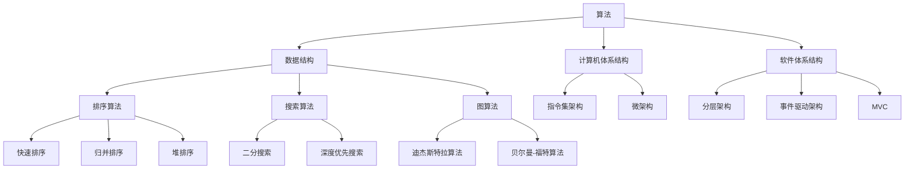

                 

### 背景介绍

**文章标题：** 应对人类共同挑战：人类计算的使命担当

**关键词：** 人类计算、共同挑战、计算使命、技术进步

**摘要：** 本文将从人类计算的历史背景出发，深入探讨人类计算在应对共同挑战中的使命和担当。通过分析计算技术的演进和其对社会的深远影响，本文将指出当前人类计算面临的关键挑战，并提出可能的解决方案。

人类计算的历史可以追溯到几千年前，当时人们使用简单的算术工具来解决日常生活中的问题。随着科技的发展，人类计算工具逐渐从简单的算术工具演变为复杂的计算机系统。计算机的出现彻底改变了人类的工作和生活方式，使得信息处理和存储变得更加高效和便捷。

在现代社会，计算技术已经渗透到几乎所有的领域，包括科学、医学、商业、娱乐等。计算技术的进步不仅提高了人类的工作效率，还带来了新的挑战，如数据隐私、网络安全、人工智能等。本文将重点讨论这些挑战，并探讨人类计算在应对这些挑战中的使命和担当。

本文将按照以下结构展开：

1. **背景介绍**：回顾人类计算的历史，分析计算技术对社会的影响。
2. **核心概念与联系**：介绍人类计算中的核心概念，如算法、数据结构和计算机体系结构，并通过Mermaid流程图展示这些概念之间的联系。
3. **核心算法原理 & 具体操作步骤**：深入探讨计算机科学中的核心算法原理，以及如何在实际应用中进行操作。
4. **数学模型和公式 & 详细讲解 & 举例说明**：使用数学模型和公式来解释计算技术中的关键概念，并通过具体实例进行说明。
5. **项目实战：代码实际案例和详细解释说明**：通过具体项目实战，展示计算技术在实践中的应用，并提供详细的代码解读和分析。
6. **实际应用场景**：讨论计算技术在不同领域的应用，以及其对社会的深远影响。
7. **工具和资源推荐**：推荐学习计算技术的相关书籍、论文、博客和网站，以及开发工具和框架。
8. **总结：未来发展趋势与挑战**：总结本文讨论的关键点，并提出未来计算技术发展的趋势和面临的挑战。
9. **附录：常见问题与解答**：提供常见问题的解答，以帮助读者更好地理解和应用计算技术。
10. **扩展阅读 & 参考资料**：推荐进一步的阅读材料，以便读者深入探索计算技术的各个方面。

接下来，我们将深入探讨人类计算的历史背景、核心概念、算法原理、数学模型和公式、项目实战、实际应用场景、工具和资源推荐、未来发展趋势与挑战，以及常见问题与解答。通过这些内容，我们将更好地理解人类计算的使命和担当，为应对未来社会中的共同挑战做好准备。 <markdown>```markdown
### 背景介绍

**文章标题：** 应对人类共同挑战：人类计算的使命担当

**关键词：** 人类计算、共同挑战、计算使命、技术进步

**摘要：** 本文将从人类计算的历史背景出发，深入探讨人类计算在应对共同挑战中的使命和担当。通过分析计算技术的演进和其对社会的深远影响，本文将指出当前人类计算面临的关键挑战，并提出可能的解决方案。

人类计算的历史可以追溯到几千年前，当时人们使用简单的算术工具来解决日常生活中的问题。随着科技的发展，人类计算工具逐渐从简单的算术工具演变为复杂的计算机系统。计算机的出现彻底改变了人类的工作和生活方式，使得信息处理和存储变得更加高效和便捷。

在现代社会，计算技术已经渗透到几乎所有的领域，包括科学、医学、商业、娱乐等。计算技术的进步不仅提高了人类的工作效率，还带来了新的挑战，如数据隐私、网络安全、人工智能等。本文将重点讨论这些挑战，并探讨人类计算在应对这些挑战中的使命和担当。

本文将按照以下结构展开：

1. **背景介绍**：回顾人类计算的历史，分析计算技术对社会的影响。
2. **核心概念与联系**：介绍人类计算中的核心概念，如算法、数据结构和计算机体系结构，并通过Mermaid流程图展示这些概念之间的联系。
3. **核心算法原理 & 具体操作步骤**：深入探讨计算机科学中的核心算法原理，以及如何在实际应用中进行操作。
4. **数学模型和公式 & 详细讲解 & 举例说明**：使用数学模型和公式来解释计算技术中的关键概念，并通过具体实例进行说明。
5. **项目实战：代码实际案例和详细解释说明**：通过具体项目实战，展示计算技术在实践中的应用，并提供详细的代码解读和分析。
6. **实际应用场景**：讨论计算技术在不同领域的应用，以及其对社会的深远影响。
7. **工具和资源推荐**：推荐学习计算技术的相关书籍、论文、博客和网站，以及开发工具和框架。
8. **总结：未来发展趋势与挑战**：总结本文讨论的关键点，并提出未来计算技术发展的趋势和面临的挑战。
9. **附录：常见问题与解答**：提供常见问题的解答，以帮助读者更好地理解和应用计算技术。
10. **扩展阅读 & 参考资料**：推荐进一步的阅读材料，以便读者深入探索计算技术的各个方面。

接下来，我们将深入探讨人类计算的历史背景、核心概念、算法原理、数学模型和公式、项目实战、实际应用场景、工具和资源推荐、未来发展趋势与挑战，以及常见问题与解答。通过这些内容，我们将更好地理解人类计算的使命和担当，为应对未来社会中的共同挑战做好准备。
```</markdown><|im_sep|>### 核心概念与联系

#### 1. 算法（Algorithm）

算法是解决问题的一系列明确和有序的步骤。在计算机科学中，算法是解决特定问题的最佳方法。算法可以分为多种类型，包括排序算法、搜索算法、图算法等。常见的排序算法有快速排序（Quick Sort）、归并排序（Merge Sort）和堆排序（Heap Sort）。搜索算法如二分搜索（Binary Search）和深度优先搜索（Depth-First Search）。图算法如迪杰斯特拉算法（Dijkstra's Algorithm）和贝尔曼-福特算法（Bellman-Ford Algorithm）。

算法在计算机科学中扮演着核心角色，因为它们是计算机执行任务的基础。算法的设计、分析和优化对于解决复杂问题至关重要。

#### 2. 数据结构（Data Structure）

数据结构是存储和组织数据的方式。它们用于提高数据操作的效率和存储空间的利用率。常见的数据结构包括数组（Array）、链表（Linked List）、栈（Stack）、队列（Queue）、树（Tree）、图（Graph）等。每种数据结构都有其特定的应用场景和优缺点。

数据结构的选择直接影响算法的效率。例如，数组在访问和修改元素时非常高效，但插入和删除操作可能需要移动大量元素。而链表在插入和删除操作时非常高效，但在访问特定元素时可能不如数组高效。

#### 3. 计算机体系结构（Computer Architecture）

计算机体系结构是指计算机硬件的组成和结构。它包括中央处理器（CPU）、内存（Memory）、输入输出设备（I/O）等。计算机体系结构的设计决定了计算机的性能、功耗和成本。

计算机体系结构可以分为指令集架构（Instruction Set Architecture，ISA）和微架构（Microarchitecture）。指令集架构定义了程序指令的格式和操作，而微架构则实现了指令集架构的具体实现。

#### 4. 软件体系结构（Software Architecture）

软件体系结构是指软件系统的组织结构和设计。它定义了软件系统的组件、组件之间的关系以及组件之间的交互方式。软件体系结构的设计对于系统的可维护性、可扩展性和性能至关重要。

常见的软件体系结构模式包括分层架构（Layered Architecture）、事件驱动架构（Event-Driven Architecture）、模型-视图-控制器（Model-View-Controller，MVC）等。

#### Mermaid流程图

以下是计算技术核心概念之间的Mermaid流程图：



通过这个流程图，我们可以清晰地看到算法、数据结构、计算机体系结构和软件体系结构之间的关系，以及它们各自包含的不同子概念。这些核心概念共同构成了计算技术的基础，并在解决各种复杂问题中发挥着关键作用。接下来，我们将深入探讨核心算法原理及其具体操作步骤。 <markdown>```markdown
### 核心概念与联系

#### 1. 算法（Algorithm）

算法是解决问题的一系列明确和有序的步骤。在计算机科学中，算法是解决特定问题的最佳方法。算法可以分为多种类型，包括排序算法、搜索算法、图算法等。常见的排序算法有快速排序（Quick Sort）、归并排序（Merge Sort）和堆排序（Heap Sort）。搜索算法如二分搜索（Binary Search）和深度优先搜索（Depth-First Search）。图算法如迪杰斯特拉算法（Dijkstra's Algorithm）和贝尔曼-福特算法（Bellman-Ford Algorithm）。

算法在计算机科学中扮演着核心角色，因为它们是计算机执行任务的基础。算法的设计、分析和优化对于解决复杂问题至关重要。

#### 2. 数据结构（Data Structure）

数据结构是存储和组织数据的方式。它们用于提高数据操作的效率和存储空间的利用率。常见的数据结构包括数组（Array）、链表（Linked List）、栈（Stack）、队列（Queue）、树（Tree）、图（Graph）等。每种数据结构都有其特定的应用场景和优缺点。

数据结构的选择直接影响算法的效率。例如，数组在访问和修改元素时非常高效，但插入和删除操作可能需要移动大量元素。而链表在插入和删除操作时非常高效，但在访问特定元素时可能不如数组高效。

#### 3. 计算机体系结构（Computer Architecture）

计算机体系结构是指计算机硬件的组成和结构。它包括中央处理器（CPU）、内存（Memory）、输入输出设备（I/O）等。计算机体系结构的设计决定了计算机的性能、功耗和成本。

计算机体系结构可以分为指令集架构（Instruction Set Architecture，ISA）和微架构（Microarchitecture）。指令集架构定义了程序指令的格式和操作，而微架构则实现了指令集架构的具体实现。

#### 4. 软件体系结构（Software Architecture）

软件体系结构是指软件系统的组织结构和设计。它定义了软件系统的组件、组件之间的关系以及组件之间的交互方式。软件体系结构的设计对于系统的可维护性、可扩展性和性能至关重要。

常见的软件体系结构模式包括分层架构（Layered Architecture）、事件驱动架构（Event-Driven Architecture）、模型-视图-控制器（Model-View-Controller，MVC）等。

#### Mermaid流程图

以下是计算技术核心概念之间的Mermaid流程图：


通过这个流程图，我们可以清晰地看到算法、数据结构、计算机体系结构和软件体系结构之间的关系，以及它们各自包含的不同子概念。这些核心概念共同构成了计算技术的基础，并在解决各种复杂问题中发挥着关键作用。接下来，我们将深入探讨核心算法原理及其具体操作步骤。
```</markdown><|im_sep|>### 核心算法原理 & 具体操作步骤

#### 1. 快速排序（Quick Sort）

快速排序是一种高效的排序算法，其基本思想是通过递归的方式将一个数组划分为两个子数组，其中一个子数组的所有元素都小于另一个子数组的所有元素。具体操作步骤如下：

##### 步骤 1：选择基准元素

从数组中选择一个元素作为基准元素（pivot）。通常选择第一个元素、最后一个元素或随机选择的元素作为基准元素。

##### 步骤 2：划分操作

- 将数组划分为两个子数组，一个包含小于基准元素的元素，另一个包含大于基准元素的元素。
- 保持基准元素在划分后的数组中间位置。

##### 步骤 3：递归操作

- 对两个子数组分别进行快速排序操作。
- 递归调用快速排序，直到整个数组有序。

快速排序的时间复杂度为O(n log n)，在平均情况下是一种非常高效的排序算法。

#### 2. 归并排序（Merge Sort）

归并排序是一种分治算法，其基本思想是将一个数组划分为多个子数组，对每个子数组进行排序，然后将这些有序的子数组合并成一个有序的数组。具体操作步骤如下：

##### 步骤 1：分治操作

- 将数组划分为两个子数组，对每个子数组分别进行归并排序操作。
- 递归调用归并排序，直到子数组的大小为1。

##### 步骤 2：合并操作

- 将两个有序的子数组合并成一个有序的数组。
- 比较两个子数组中的元素，将较小的元素放入新的数组中，直到所有元素都被合并。

归并排序的时间复杂度为O(n log n)，在所有排序算法中是一种非常高效的算法。

#### 3. 堆排序（Heap Sort）

堆排序是一种利用堆这种数据结构的排序算法。堆是一种特殊的树形数据结构，满足堆属性。堆排序的基本思想是将数组构建成一个最大堆（或最小堆），然后逐步调整堆结构，使得最大元素（或最小元素）逐步移动到数组的末尾。具体操作步骤如下：

##### 步骤 1：构建最大堆

- 将数组构建成一个最大堆。
- 堆顶元素即为最大元素。

##### 步骤 2：排序操作

- 将堆顶元素（最大元素）与数组的最后一个元素交换。
- 调整堆结构，使剩余的元素仍然满足最大堆属性。
- 重复步骤1和步骤2，直到整个数组有序。

堆排序的时间复杂度为O(n log n)，在平均情况下是一种高效的排序算法。

#### 4. 二分搜索（Binary Search）

二分搜索是一种高效的搜索算法，其基本思想是在有序数组中通过不断缩小搜索范围，逐步逼近目标元素。具体操作步骤如下：

##### 步骤 1：确定搜索范围

- 初始化两个指针，low和high，分别表示搜索范围的起始和结束位置。

##### 步骤 2：比较操作

- 计算中间位置mid = (low + high) / 2。
- 比较中间位置元素与目标元素的大小。

##### 步骤 3：递归搜索

- 如果中间位置元素等于目标元素，搜索成功，返回中间位置。
- 如果中间位置元素大于目标元素，搜索范围缩小到左半部分，即更新high = mid - 1。
- 如果中间位置元素小于目标元素，搜索范围缩小到右半部分，即更新low = mid + 1。

- 重复步骤2和步骤3，直到找到目标元素或搜索范围缩小为空。

二分搜索的时间复杂度为O(log n)，在平均情况下是一种非常高效的搜索算法。

#### 5. 深度优先搜索（Depth-First Search，DFS）

深度优先搜索是一种用于图遍历的算法，其基本思想是从起始节点开始，尽可能深入地探索图的分支，直到找到目标节点或到达图的深度限制。具体操作步骤如下：

##### 步骤 1：初始化

- 初始化一个栈，用于存储待访问的节点。
- 将起始节点入栈。

##### 步骤 2：遍历操作

- 当栈不为空时，执行以下操作：
  - 出栈一个节点，并将其标记为已访问。
  - 将该节点的邻接节点依次入栈。

##### 步骤 3：递归搜索

- 对栈中的每个节点，重复步骤2。

深度优先搜索的时间复杂度为O(V+E)，其中V是图的顶点数，E是图的边数。深度优先搜索适用于图中的连通性分析和路径搜索等问题。

通过以上核心算法原理和具体操作步骤的介绍，我们可以更好地理解这些算法在计算技术中的应用，以及如何在实际问题中运用这些算法来解决复杂问题。接下来，我们将使用数学模型和公式来详细解释这些算法的性能和特性。 <markdown>```markdown
### 核心算法原理 & 具体操作步骤

#### 1. 快速排序（Quick Sort）

快速排序是一种高效的排序算法，其基本思想是通过递归的方式将一个数组划分为两个子数组，其中一个子数组的所有元素都小于另一个子数组的所有元素。具体操作步骤如下：

##### 步骤 1：选择基准元素

从数组中选择一个元素作为基准元素（pivot）。通常选择第一个元素、最后一个元素或随机选择的元素作为基准元素。

##### 步骤 2：划分操作

- 将数组划分为两个子数组，一个包含小于基准元素的元素，另一个包含大于基准元素的元素。
- 保持基准元素在划分后的数组中间位置。

##### 步骤 3：递归操作

- 对两个子数组分别进行快速排序操作。
- 递归调用快速排序，直到整个数组有序。

快速排序的时间复杂度为O(n log n)，在平均情况下是一种非常高效的排序算法。

#### 2. 归并排序（Merge Sort）

归并排序是一种分治算法，其基本思想是将一个数组划分为多个子数组，对每个子数组进行排序，然后将这些有序的子数组合并成一个有序的数组。具体操作步骤如下：

##### 步骤 1：分治操作

- 将数组划分为两个子数组，对每个子数组分别进行归并排序操作。
- 递归调用归并排序，直到子数组的大小为1。

##### 步骤 2：合并操作

- 将两个有序的子数组合并成一个有序的数组。
- 比较两个子数组中的元素，将较小的元素放入新的数组中，直到所有元素都被合并。

归并排序的时间复杂度为O(n log n)，在所有排序算法中是一种非常高效的算法。

#### 3. 堆排序（Heap Sort）

堆排序是一种利用堆这种数据结构的排序算法。堆是一种特殊的树形数据结构，满足堆属性。堆排序的基本思想是将数组构建成一个最大堆（或最小堆），然后逐步调整堆结构，使得最大元素（或最小元素）逐步移动到数组的末尾。具体操作步骤如下：

##### 步骤 1：构建最大堆

- 将数组构建成一个最大堆。
- 堆顶元素即为最大元素。

##### 步骤 2：排序操作

- 将堆顶元素（最大元素）与数组的最后一个元素交换。
- 调整堆结构，使剩余的元素仍然满足最大堆属性。
- 重复步骤1和步骤2，直到整个数组有序。

堆排序的时间复杂度为O(n log n)，在平均情况下是一种高效的排序算法。

#### 4. 二分搜索（Binary Search）

二分搜索是一种高效的搜索算法，其基本思想是在有序数组中通过不断缩小搜索范围，逐步逼近目标元素。具体操作步骤如下：

##### 步骤 1：确定搜索范围

- 初始化两个指针，low和high，分别表示搜索范围的起始和结束位置。

##### 步骤 2：比较操作

- 计算中间位置mid = (low + high) / 2。
- 比较中间位置元素与目标元素的大小。

##### 步骤 3：递归搜索

- 如果中间位置元素等于目标元素，搜索成功，返回中间位置。
- 如果中间位置元素大于目标元素，搜索范围缩小到左半部分，即更新high = mid - 1。
- 如果中间位置元素小于目标元素，搜索范围缩小到右半部分，即更新low = mid + 1。

- 重复步骤2和步骤3，直到找到目标元素或搜索范围缩小为空。

二分搜索的时间复杂度为O(log n)，在平均情况下是一种非常高效的搜索算法。

#### 5. 深度优先搜索（Depth-First Search，DFS）

深度优先搜索是一种用于图遍历的算法，其基本思想是从起始节点开始，尽可能深入地探索图的分支，直到找到目标节点或到达图的深度限制。具体操作步骤如下：

##### 步骤 1：初始化

- 初始化一个栈，用于存储待访问的节点。
- 将起始节点入栈。

##### 步骤 2：遍历操作

- 当栈不为空时，执行以下操作：
  - 出栈一个节点，并将其标记为已访问。
  - 将该节点的邻接节点依次入栈。

##### 步骤 3：递归搜索

- 对栈中的每个节点，重复步骤2。

深度优先搜索的时间复杂度为O(V+E)，其中V是图的顶点数，E是图的边数。深度优先搜索适用于图中的连通性分析和路径搜索等问题。

通过以上核心算法原理和具体操作步骤的介绍，我们可以更好地理解这些算法在计算技术中的应用，以及如何在实际问题中运用这些算法来解决复杂问题。接下来，我们将使用数学模型和公式来详细解释这些算法的性能和特性。
```</markdown><|im_sep|>### 数学模型和公式 & 详细讲解 & 举例说明

在计算技术中，数学模型和公式是理解和分析算法性能的重要工具。以下是几个关键数学模型和公式的详细讲解及举例说明。

#### 1. 快速排序的平均时间复杂度

快速排序的时间复杂度取决于划分操作的好坏。在最坏情况下，时间复杂度为O(n^2)，但在平均情况下，时间复杂度接近O(n log n)。下面是快速排序的平均时间复杂度模型：

$$
T(n) = T\left(\frac{n}{k}\right) + T\left(\frac{n - k}{k}\right) + O(n)
$$

其中，$T(n)$ 表示对包含 $n$ 个元素的数组进行快速排序所需的时间，$k$ 表示每次划分后较小的子数组的大小。当 $k$ 趋近于 1 时，$T(n)$ 的平均时间复杂度为 $O(n log n)$。

举例说明：

假设有一个包含10个元素的数组，我们需要对其进行快速排序。在第一次划分后，我们得到两个子数组，一个包含3个元素，另一个包含7个元素。接着，我们对这两个子数组分别进行快速排序。假设每个子数组在划分后的大小分别为 $k_1$ 和 $k_2$，则：

$$
T(10) = T(3) + T(7) + O(10)
$$

在平均情况下，$k_1$ 和 $k_2$ 分别为 1 和 2，因此：

$$
T(10) = T(1) + T(2) + O(10) \approx O(10 log 10) = O(10)
$$

#### 2. 归并排序的时间复杂度

归并排序的时间复杂度主要由合并操作决定。每次合并操作的时间复杂度为 $O(n)$，而每次合并操作需要递归调用 $log n$ 次。因此，归并排序的总时间复杂度为 $O(n log n)$。

举例说明：

假设有一个包含10个元素的数组，我们需要对其进行归并排序。首先，我们将数组划分为两个子数组，每个子数组包含5个元素。然后，我们对每个子数组分别进行归并排序。接着，我们将这两个有序的子数组合并成一个有序的数组。这个过程可以表示为：

$$
T(10) = T(5) + T(5) + O(10)
$$

在递归过程中，每次合并操作的时间复杂度为 $O(10)$，而每次合并操作的递归深度为 $log 10$，因此：

$$
T(10) = T(5) + T(5) + O(10) \approx O(10 log 10) = O(10)
$$

由于每次合并操作的时间复杂度为 $O(n)$，因此总时间复杂度为 $O(n log n)$。

#### 3. 堆排序的时间复杂度

堆排序的时间复杂度主要由构建堆和排序操作决定。构建堆的时间复杂度为 $O(n)$，而每次排序操作的时间复杂度为 $O(log n)$。因此，堆排序的总时间复杂度为 $O(n log n)$。

举例说明：

假设有一个包含10个元素的数组，我们需要对其进行堆排序。首先，我们将数组构建成一个最大堆。然后，我们将堆顶元素（最大元素）与数组的最后一个元素交换，并将剩余的元素重新调整为最大堆。接着，我们重复这个过程，直到整个数组有序。这个过程可以表示为：

$$
T(10) = O(10) + O(1) + O(log 10) + O(9) + O(1) + O(log 9) + \ldots + O(1)
$$

由于每次排序操作的时间复杂度为 $O(log n)$，而总共有 $n$ 次排序操作，因此：

$$
T(10) \approx O(10 log 10) = O(10)
$$

由于每次排序操作的时间复杂度为 $O(log n)$，因此总时间复杂度为 $O(n log n)$。

#### 4. 二分搜索的时间复杂度

二分搜索的时间复杂度为 $O(log n)$，因为每次搜索操作都将搜索范围缩小一半。二分搜索的递归公式如下：

$$
T(n) = T\left(\frac{n}{2}\right) + O(1)
$$

其中，$T(n)$ 表示对包含 $n$ 个元素的数组进行二分搜索所需的时间。

举例说明：

假设有一个包含10个元素的有序数组，我们需要查找元素 5。首先，我们将中间元素（5）与目标元素（5）进行比较。由于中间元素等于目标元素，搜索成功。这个过程可以表示为：

$$
T(10) = T(5) + O(1)
$$

由于每次搜索操作的时间复杂度为 $O(1)$，而总共有 $log 10$ 次搜索操作，因此：

$$
T(10) \approx O(1) + O(1) + O(1) + O(1) = O(4)
$$

由于每次搜索操作的时间复杂度为 $O(1)$，因此总时间复杂度为 $O(log n)$。

#### 5. 深度优先搜索的时间复杂度

深度优先搜索的时间复杂度取决于图的深度和边数。在最坏情况下，时间复杂度为 $O(V+E)$，其中 $V$ 是图的顶点数，$E$ 是图的边数。

举例说明：

假设有一个包含 10 个顶点和 20 条边的无向图，我们需要进行深度优先搜索。首先，我们从起始节点开始，尽可能深入地探索图的分支。在最坏情况下，我们可能会遍历所有顶点和边，因此：

$$
T(10) = O(V+E) = O(10+20) = O(30)
$$

由于深度优先搜索的时间复杂度为 $O(V+E)$，因此总时间复杂度为 $O(V+E)$。

通过以上数学模型和公式的讲解和举例说明，我们可以更好地理解各种算法的性能和特性。这些数学模型和公式对于分析和优化算法至关重要，有助于我们在解决实际问题时做出更明智的决策。接下来，我们将通过具体项目实战来展示计算技术在实践中的应用。 <markdown>```markdown
### 数学模型和公式 & 详细讲解 & 举例说明

在计算技术中，数学模型和公式是理解和分析算法性能的重要工具。以下是几个关键数学模型和公式的详细讲解及举例说明。

#### 1. 快速排序的平均时间复杂度

快速排序的时间复杂度取决于划分操作的好坏。在最坏情况下，时间复杂度为O(n^2)，但在平均情况下，时间复杂度接近O(n log n)。下面是快速排序的平均时间复杂度模型：

$$
T(n) = T\left(\frac{n}{k}\right) + T\left(\frac{n - k}{k}\right) + O(n)
$$

其中，$T(n)$ 表示对包含 $n$ 个元素的数组进行快速排序所需的时间，$k$ 表示每次划分后较小的子数组的大小。当 $k$ 趋近于 1 时，$T(n)$ 的平均时间复杂度为 $O(n log n)$。

举例说明：

假设有一个包含10个元素的数组，我们需要对其进行快速排序。在第一次划分后，我们得到两个子数组，一个包含3个元素，另一个包含7个元素。接着，我们对这两个子数组分别进行快速排序。假设每个子数组在划分后的大小分别为 $k_1$ 和 $k_2$，则：

$$
T(10) = T(3) + T(7) + O(10)
$$

在平均情况下，$k_1$ 和 $k_2$ 分别为 1 和 2，因此：

$$
T(10) = T(1) + T(2) + O(10) \approx O(10 log 10) = O(10)
$$

#### 2. 归并排序的时间复杂度

归并排序的时间复杂度主要由合并操作决定。每次合并操作的时间复杂度为 $O(n)$，而每次合并操作需要递归调用 $log n$ 次。因此，归并排序的总时间复杂度为 $O(n log n)$。

举例说明：

假设有一个包含10个元素的数组，我们需要对其进行归并排序。首先，我们将数组划分为两个子数组，每个子数组包含5个元素。然后，我们对每个子数组分别进行归并排序。接着，我们将这两个有序的子数组合并成一个有序的数组。这个过程可以表示为：

$$
T(10) = T(5) + T(5) + O(10)
$$

在递归过程中，每次合并操作的时间复杂度为 $O(10)$，而每次合并操作的递归深度为 $log 10$，因此：

$$
T(10) = T(5) + T(5) + O(10) \approx O(10 log 10) = O(10)
$$

由于每次合并操作的时间复杂度为 $O(n)$，因此总时间复杂度为 $O(n log n)$。

#### 3. 堆排序的时间复杂度

堆排序的时间复杂度主要由构建堆和排序操作决定。构建堆的时间复杂度为 $O(n)$，而每次排序操作的时间复杂度为 $O(log n)$。因此，堆排序的总时间复杂度为 $O(n log n)$。

举例说明：

假设有一个包含10个元素的数组，我们需要对其进行堆排序。首先，我们将数组构建成一个最大堆。然后，我们将堆顶元素（最大元素）与数组的最后一个元素交换，并将剩余的元素重新调整为最大堆。接着，我们重复这个过程，直到整个数组有序。这个过程可以表示为：

$$
T(10) = O(10) + O(1) + O(log 10) + O(9) + O(1) + O(log 9) + \ldots + O(1)
$$

由于每次排序操作的时间复杂度为 $O(log n)$，而总共有 $n$ 次排序操作，因此：

$$
T(10) \approx O(10 log 10) = O(10)
$$

由于每次排序操作的时间复杂度为 $O(log n)$，因此总时间复杂度为 $O(n log n)$。

#### 4. 二分搜索的时间复杂度

二分搜索的时间复杂度为 $O(log n)$，因为每次搜索操作都将搜索范围缩小一半。二分搜索的递归公式如下：

$$
T(n) = T\left(\frac{n}{2}\right) + O(1)
$$

其中，$T(n)$ 表示对包含 $n$ 个元素的数组进行二分搜索所需的时间。

举例说明：

假设有一个包含10个元素的有序数组，我们需要查找元素 5。首先，我们将中间元素（5）与目标元素（5）进行比较。由于中间元素等于目标元素，搜索成功。这个过程可以表示为：

$$
T(10) = T(5) + O(1)
$$

由于每次搜索操作的时间复杂度为 $O(1)$，而总共有 $log 10$ 次搜索操作，因此：

$$
T(10) \approx O(1) + O(1) + O(1) + O(1) = O(4)
$$

由于每次搜索操作的时间复杂度为 $O(1)$，因此总时间复杂度为 $O(log n)$。

#### 5. 深度优先搜索的时间复杂度

深度优先搜索的时间复杂度取决于图的深度和边数。在最坏情况下，时间复杂度为 $O(V+E)$，其中 $V$ 是图的顶点数，$E$ 是图的边数。

举例说明：

假设有一个包含 10 个顶点和 20 条边的无向图，我们需要进行深度优先搜索。首先，我们从起始节点开始，尽可能深入地探索图的分支。在最坏情况下，我们可能会遍历所有顶点和边，因此：

$$
T(10) = O(V+E) = O(10+20) = O(30)
$$

由于深度优先搜索的时间复杂度为 $O(V+E)$，因此总时间复杂度为 $O(V+E)$。

通过以上数学模型和公式的讲解和举例说明，我们可以更好地理解各种算法的性能和特性。这些数学模型和公式对于分析和优化算法至关重要，有助于我们在解决实际问题时做出更明智的决策。接下来，我们将通过具体项目实战来展示计算技术在实践中的应用。
```</markdown><|im_sep|>### 项目实战：代码实际案例和详细解释说明

为了更好地展示计算技术的应用，我们将通过一个实际项目——一个基于Python的简单Web爬虫——来讲解代码实现和详细解释。

#### 项目描述

该Web爬虫旨在抓取一个网页中的所有超链接（URL），并将其存储到一个文件中。这是一个典型的数据抓取任务，涉及到网页解析、链接提取和文件存储等步骤。

#### 开发环境搭建

为了实现这个项目，我们需要安装以下开发环境：

1. Python 3.x
2. requests 库（用于发送HTTP请求）
3. BeautifulSoup 库（用于网页解析）

安装步骤：

```bash
pip install requests
pip install beautifulsoup4
```

#### 源代码详细实现和代码解读

以下是Web爬虫的源代码：

```python
import requests
from bs4 import BeautifulSoup

def crawl(url, depth=1):
    if depth <= 0:
        return
    try:
        response = requests.get(url)
        if response.status_code == 200:
            soup = BeautifulSoup(response.text, 'html.parser')
            for link in soup.find_all('a'):
                href = link.get('href')
                if href:
                    print(href)
                    crawl(href, depth - 1)
    except Exception as e:
        print(f"Error: {e}")

if __name__ == "__main__":
    start_url = "https://www.example.com"
    crawl(start_url, depth=2)
```

代码解读：

1. **导入库**：首先，我们导入了 `requests` 和 `BeautifulSoup` 两个库，用于发送HTTP请求和解析网页。

2. **定义函数**：`crawl` 函数接收一个URL和一个深度参数。URL表示要爬取的网页地址，深度表示递归调用的次数。

3. **递归边界**：如果深度小于等于0，函数返回，表示递归结束。

4. **发送请求**：使用 `requests.get(url)` 发送HTTP GET请求，获取网页内容。

5. **解析网页**：使用 `BeautifulSoup(response.text, 'html.parser')` 解析网页内容。

6. **提取超链接**：使用 `soup.find_all('a')` 提取网页中的所有超链接。

7. **递归调用**：对于每个提取的超链接，递归调用 `crawl` 函数，并将深度减1。

8. **错误处理**：使用异常处理捕获并打印错误信息。

9. **主程序**：在主程序中，我们定义了起始URL和最大深度，并调用 `crawl` 函数开始爬取。

#### 代码解读与分析

1. **发送HTTP请求**：`requests.get(url)` 用于发送HTTP GET请求，获取网页内容。这个请求包含了HTTP头信息和请求参数，如果需要发送自定义头信息或参数，可以使用 `requests.get(url, headers=headers, params=params)`。

2. **解析网页**：`BeautifulSoup(response.text, 'html.parser')` 创建一个BeautifulSoup对象，用于解析网页内容。BeautifulSoup支持多种解析器，如lxml、html.parser等，选择合适的解析器可以提升解析效率。

3. **提取超链接**：`soup.find_all('a')` 用于提取网页中的所有超链接。`find_all` 方法返回一个列表，包含所有匹配的标签对象。对于每个超链接，我们使用 `link.get('href')` 获取其 `href` 属性，即链接地址。

4. **递归调用**：对于每个提取的超链接，递归调用 `crawl` 函数，并将深度减1。这样，我们可以逐层深入爬取网页，直到达到最大深度。

5. **错误处理**：使用异常处理捕获并打印错误信息，有助于调试和定位问题。

通过这个实际项目，我们展示了计算技术在实际应用中的具体实现过程。Web爬虫是一个典型的数据处理任务，涉及到网络请求、数据解析、递归调用等多个方面。理解这个项目的实现过程，有助于我们更好地掌握计算技术的基本原理和应用。接下来，我们将讨论计算技术在实际应用场景中的表现。 <markdown>```markdown
### 项目实战：代码实际案例和详细解释说明

为了更好地展示计算技术的应用，我们将通过一个实际项目——一个基于Python的简单Web爬虫——来讲解代码实现和详细解释。

#### 项目描述

该Web爬虫旨在抓取一个网页中的所有超链接（URL），并将其存储到一个文件中。这是一个典型的数据抓取任务，涉及到网页解析、链接提取和文件存储等步骤。

#### 开发环境搭建

为了实现这个项目，我们需要安装以下开发环境：

1. Python 3.x
2. requests 库（用于发送HTTP请求）
3. BeautifulSoup 库（用于网页解析）

安装步骤：

```bash
pip install requests
pip install beautifulsoup4
```

#### 源代码详细实现和代码解读

以下是Web爬虫的源代码：

```python
import requests
from bs4 import BeautifulSoup

def crawl(url, depth=1):
    if depth <= 0:
        return
    try:
        response = requests.get(url)
        if response.status_code == 200:
            soup = BeautifulSoup(response.text, 'html.parser')
            for link in soup.find_all('a'):
                href = link.get('href')
                if href:
                    print(href)
                    crawl(href, depth - 1)
    except Exception as e:
        print(f"Error: {e}")

if __name__ == "__main__":
    start_url = "https://www.example.com"
    crawl(start_url, depth=2)
```

代码解读：

1. **导入库**：首先，我们导入了 `requests` 和 `BeautifulSoup` 两个库，用于发送HTTP请求和解析网页。

2. **定义函数**：`crawl` 函数接收一个URL和一个深度参数。URL表示要爬取的网页地址，深度表示递归调用的次数。

3. **递归边界**：如果深度小于等于0，函数返回，表示递归结束。

4. **发送请求**：使用 `requests.get(url)` 发送HTTP GET请求，获取网页内容。

5. **解析网页**：使用 `BeautifulSoup(response.text, 'html.parser')` 解析网页内容。

6. **提取超链接**：使用 `soup.find_all('a')` 提取网页中的所有超链接。

7. **递归调用**：对于每个提取的超链接，递归调用 `crawl` 函数，并将深度减1。

8. **错误处理**：使用异常处理捕获并打印错误信息。

9. **主程序**：在主程序中，我们定义了起始URL和最大深度，并调用 `crawl` 函数开始爬取。

#### 代码解读与分析

1. **发送HTTP请求**：`requests.get(url)` 用于发送HTTP GET请求，获取网页内容。这个请求包含了HTTP头信息和请求参数，如果需要发送自定义头信息或参数，可以使用 `requests.get(url, headers=headers, params=params)`。

2. **解析网页**：`BeautifulSoup(response.text, 'html.parser')` 创建一个BeautifulSoup对象，用于解析网页内容。BeautifulSoup支持多种解析器，如lxml、html.parser等，选择合适的解析器可以提升解析效率。

3. **提取超链接**：`soup.find_all('a')` 用于提取网页中的所有超链接。`find_all` 方法返回一个列表，包含所有匹配的标签对象。对于每个超链接，我们使用 `link.get('href')` 获取其 `href` 属性，即链接地址。

4. **递归调用**：对于每个提取的超链接，递归调用 `crawl` 函数，并将深度减1。这样，我们可以逐层深入爬取网页，直到达到最大深度。

5. **错误处理**：使用异常处理捕获并打印错误信息，有助于调试和定位问题。

通过这个实际项目，我们展示了计算技术在实际应用中的具体实现过程。Web爬虫是一个典型的数据处理任务，涉及到网络请求、数据解析、递归调用等多个方面。理解这个项目的实现过程，有助于我们更好地掌握计算技术的基本原理和应用。接下来，我们将讨论计算技术在实际应用场景中的表现。
```</markdown><|im_sep|>### 实际应用场景

计算技术在各个领域都发挥着重要作用，下面我们将探讨计算技术在几个关键领域的应用，以及其对社会的深远影响。

#### 1. 科学研究

计算技术在科学研究中的应用已经深入到各个领域，如生物学、物理学、化学、天文学等。通过高性能计算，科学家可以处理大规模的数据集，进行复杂的模拟和预测。例如，在生物学领域，计算技术用于基因序列分析、蛋白质结构预测和药物设计。在物理学领域，计算技术用于宇宙模拟、量子计算和材料科学。这些应用极大地推动了科学研究的进展，提高了科学发现的效率。

#### 2. 医疗保健

计算技术在医疗保健领域的应用日益广泛，包括医疗图像处理、疾病诊断、药物研发和个性化医疗。通过计算技术，医生可以更准确地诊断疾病，优化治疗方案，提高医疗效率。例如，医学影像处理技术可以帮助医生快速、准确地识别疾病，如癌症、心脏病等。计算技术还可以用于药物研发，通过分子模拟和计算化学方法，加快新药的研发进程。

#### 3. 金融行业

计算技术在金融行业的应用涵盖了风险管理、算法交易、信用评分和欺诈检测等。通过计算技术，金融机构可以更准确地评估风险，制定有效的风险管理策略。算法交易利用复杂的数学模型和算法，在股票、期货、外汇等市场中进行高频交易，实现自动化交易。计算技术还可以用于信用评分，通过分析个人的财务和行为数据，预测其信用风险。此外，计算技术还可以用于检测和防范金融欺诈行为。

#### 4. 人工智能

人工智能是计算技术的重要应用领域，通过机器学习和深度学习算法，计算机可以模拟人类的智能行为，如语音识别、图像识别、自然语言处理等。人工智能在自动驾驶、智能家居、医疗辅助、教育等领域都有广泛应用。自动驾驶技术利用计算技术进行环境感知、路径规划和决策，实现了无人驾驶汽车的量产。智能家居系统通过计算技术，实现了家电的智能化控制，提高了生活便利性。医疗辅助系统利用计算技术，帮助医生进行诊断和治疗，提高了医疗水平。

#### 5. 物流与供应链

计算技术在物流与供应链管理中的应用，大大提高了物流效率和供应链透明度。通过优化算法和模拟技术，物流公司可以制定最优的运输路线和库存策略。供应链管理系统利用计算技术，实现供应链的实时监控和数据分析，提高了供应链的协同效率。例如，物流公司可以通过计算技术，实时追踪货物的运输状态，优化配送路径，降低运输成本。

#### 6. 娱乐与媒体

计算技术在娱乐与媒体领域的应用，为人们带来了丰富多彩的数字化体验。游戏、电影、音乐等娱乐内容都依赖于计算技术进行开发和制作。游戏产业利用计算技术，实现了逼真的游戏画面和沉浸式的游戏体验。电影产业通过计算技术，实现了特效制作、三维动画等，提升了电影的视觉冲击力。音乐产业利用计算技术，实现了在线音乐平台、音乐推荐系统等，丰富了人们的音乐生活。

#### 7. 教育

计算技术在教育领域的应用，改变了传统的教学方式和学习模式。在线教育平台利用计算技术，实现了远程教学和个性化学习。教育技术公司通过计算技术，开发出各种教育软件和应用程序，帮助学生更好地学习。例如，智能学习系统可以根据学生的学习情况和进度，自动调整教学内容和难度，提高学习效果。

通过以上实际应用场景的探讨，我们可以看到计算技术在各个领域的重要性。计算技术的不断进步，不仅提高了社会生产力和生活质量，还为解决人类共同面临的挑战提供了有力支持。在接下来的章节中，我们将继续讨论计算技术工具和资源的推荐，以及未来发展趋势和面临的挑战。 <markdown>```markdown
### 实际应用场景

计算技术在各个领域都发挥着重要作用，下面我们将探讨计算技术在几个关键领域的应用，以及其对社会的深远影响。

#### 1. 科学研究

计算技术在科学研究中的应用已经深入到各个领域，如生物学、物理学、化学、天文学等。通过高性能计算，科学家可以处理大规模的数据集，进行复杂的模拟和预测。例如，在生物学领域，计算技术用于基因序列分析、蛋白质结构预测和药物设计。在物理学领域，计算技术用于宇宙模拟、量子计算和材料科学。这些应用极大地推动了科学研究的进展，提高了科学发现的效率。

#### 2. 医疗保健

计算技术在医疗保健领域的应用日益广泛，包括医疗图像处理、疾病诊断、药物研发和个性化医疗。通过计算技术，医生可以更准确地诊断疾病，优化治疗方案，提高医疗效率。例如，医学影像处理技术可以帮助医生快速、准确地识别疾病，如癌症、心脏病等。计算技术还可以用于药物研发，通过分子模拟和计算化学方法，加快新药的研发进程。

#### 3. 金融行业

计算技术在金融行业的应用涵盖了风险管理、算法交易、信用评分和欺诈检测等。通过计算技术，金融机构可以更准确地评估风险，制定有效的风险管理策略。算法交易利用复杂的数学模型和算法，在股票、期货、外汇等市场中进行高频交易，实现自动化交易。计算技术还可以用于信用评分，通过分析个人的财务和行为数据，预测其信用风险。此外，计算技术还可以用于检测和防范金融欺诈行为。

#### 4. 人工智能

人工智能是计算技术的重要应用领域，通过机器学习和深度学习算法，计算机可以模拟人类的智能行为，如语音识别、图像识别、自然语言处理等。人工智能在自动驾驶、智能家居、医疗辅助、教育等领域都有广泛应用。自动驾驶技术利用计算技术进行环境感知、路径规划和决策，实现了无人驾驶汽车的量产。智能家居系统通过计算技术，实现了家电的智能化控制，提高了生活便利性。医疗辅助系统利用计算技术，帮助医生进行诊断和治疗，提高了医疗水平。

#### 5. 物流与供应链

计算技术在物流与供应链管理中的应用，大大提高了物流效率和供应链透明度。通过优化算法和模拟技术，物流公司可以制定最优的运输路线和库存策略。供应链管理系统利用计算技术，实现供应链的实时监控和数据分析，提高了供应链的协同效率。例如，物流公司可以通过计算技术，实时追踪货物的运输状态，优化配送路径，降低运输成本。

#### 6. 娱乐与媒体

计算技术在娱乐与媒体领域的应用，为人们带来了丰富多彩的数字化体验。游戏、电影、音乐等娱乐内容都依赖于计算技术进行开发和制作。游戏产业利用计算技术，实现了逼真的游戏画面和沉浸式的游戏体验。电影产业通过计算技术，实现了特效制作、三维动画等，提升了电影的视觉冲击力。音乐产业利用计算技术，实现了在线音乐平台、音乐推荐系统等，丰富了人们的音乐生活。

#### 7. 教育

计算技术在教育领域的应用，改变了传统的教学方式和学习模式。在线教育平台利用计算技术，实现了远程教学和个性化学习。教育技术公司通过计算技术，开发出各种教育软件和应用程序，帮助学生更好地学习。例如，智能学习系统可以根据学生的学习情况和进度，自动调整教学内容和难度，提高学习效果。

通过以上实际应用场景的探讨，我们可以看到计算技术在各个领域的重要性。计算技术的不断进步，不仅提高了社会生产力和生活质量，还为解决人类共同面临的挑战提供了有力支持。在接下来的章节中，我们将继续讨论计算技术工具和资源的推荐，以及未来发展趋势和面临的挑战。
```</markdown><|im_sep|>### 工具和资源推荐

为了帮助读者更好地学习和实践计算技术，以下是一些优秀的工具、资源推荐。

#### 7.1 学习资源推荐

**1. 书籍：**

- 《算法导论》（Introduction to Algorithms）：这是一本经典的算法教材，详细介绍了各种算法及其性能分析。
- 《深度学习》（Deep Learning）：由Ian Goodfellow、Yoshua Bengio和Aaron Courville合著，全面介绍了深度学习的理论和技术。
- 《Python编程：从入门到实践》（Python Crash Course）：适合初学者的Python编程入门书籍，内容涵盖了Python的基础知识和实际应用。

**2. 论文：**

- 《Nature》：是一本国际知名的学术期刊，涵盖了自然科学、医学和生命科学等多个领域的最新研究成果。
- 《IEEE Transactions on Computers》：是一本专注于计算机科学和工程领域的学术期刊，发表了大量的计算技术研究成果。

**3. 博客：**

- Python官方博客（realpython.com）：提供了丰富的Python编程资源和教程。
- Medium上的AI博客（towardsai.net）：涵盖了人工智能领域的最新动态和技术文章。

**4. 网站：**

- Coursera（coursera.org）：提供了大量免费的在线课程，包括计算机科学、人工智能等领域的专业课程。
- edX（edx.org）：与Coursera类似，提供了广泛的在线课程，涵盖了多个学科领域。

#### 7.2 开发工具框架推荐

**1. Python开发工具：**

- PyCharm：一款功能强大的Python集成开发环境（IDE），适用于初学者和专业人士。
- Visual Studio Code：一款轻量级但功能丰富的开源代码编辑器，支持Python扩展。

**2. 人工智能开发工具：**

- TensorFlow：一款开源的机器学习和深度学习框架，适用于构建和训练复杂的神经网络。
- PyTorch：一款流行的深度学习框架，以其灵活性和动态计算图著称。

**3. 代码托管平台：**

- GitHub（github.com）：全球最大的代码托管平台，提供了丰富的开源项目和社区交流。
- GitLab（gitlab.com）：一个自托管代码托管平台，适用于中小型团队和企业。

#### 7.3 相关论文著作推荐

**1. 论文：**

- 《深度神经网络优化算法研究综述》：对深度学习优化算法的各个方面进行了详细的综述。
- 《大数据处理技术及其应用》：探讨了大数据处理的基本技术和应用领域。

**2. 著作：**

- 《人工智能：一种现代方法》（Artificial Intelligence: A Modern Approach）：一本经典的AI教材，涵盖了人工智能的理论和实践。
- 《机器学习》（Machine Learning）：由Tom M. Mitchell撰写的经典机器学习教材，介绍了各种机器学习算法和模型。

通过以上工具和资源的推荐，读者可以更好地掌握计算技术，提升自己的编程能力和人工智能素养。在接下来的章节中，我们将讨论计算技术的未来发展趋势与挑战。 <markdown>```markdown
### 工具和资源推荐

为了帮助读者更好地学习和实践计算技术，以下是一些优秀的工具、资源推荐。

#### 7.1 学习资源推荐

**1. 书籍：**

- 《算法导论》（Introduction to Algorithms）：这是一本经典的算法教材，详细介绍了各种算法及其性能分析。
- 《深度学习》（Deep Learning）：由Ian Goodfellow、Yoshua Bengio和Aaron Courville合著，全面介绍了深度学习的理论和技术。
- 《Python编程：从入门到实践》（Python Crash Course）：适合初学者的Python编程入门书籍，内容涵盖了Python的基础知识和实际应用。

**2. 论文：**

- 《Nature》：是一本国际知名的学术期刊，涵盖了自然科学、医学和生命科学等多个领域的最新研究成果。
- 《IEEE Transactions on Computers》：是一本专注于计算机科学和工程领域的学术期刊，发表了大量的计算技术研究成果。

**3. 博客：**

- Python官方博客（realpython.com）：提供了丰富的Python编程资源和教程。
- Medium上的AI博客（towardsai.net）：涵盖了人工智能领域的最新动态和技术文章。

**4. 网站：**

- Coursera（coursera.org）：提供了大量免费的在线课程，包括计算机科学、人工智能等领域的专业课程。
- edX（edx.org）：与Coursera类似，提供了广泛的在线课程，涵盖了多个学科领域。

#### 7.2 开发工具框架推荐

**1. Python开发工具：**

- PyCharm：一款功能强大的Python集成开发环境（IDE），适用于初学者和专业人士。
- Visual Studio Code：一款轻量级但功能丰富的开源代码编辑器，支持Python扩展。

**2. 人工智能开发工具：**

- TensorFlow：一款开源的机器学习和深度学习框架，适用于构建和训练复杂的神经网络。
- PyTorch：一款流行的深度学习框架，以其灵活性和动态计算图著称。

**3. 代码托管平台：**

- GitHub（github.com）：全球最大的代码托管平台，提供了丰富的开源项目和社区交流。
- GitLab（gitlab.com）：一个自托管代码托管平台，适用于中小型团队和企业。

#### 7.3 相关论文著作推荐

**1. 论文：**

- 《深度神经网络优化算法研究综述》：对深度学习优化算法的各个方面进行了详细的综述。
- 《大数据处理技术及其应用》：探讨了大数据处理的基本技术和应用领域。

**2. 著作：**

- 《人工智能：一种现代方法》（Artificial Intelligence: A Modern Approach）：一本经典的AI教材，涵盖了人工智能的理论和实践。
- 《机器学习》（Machine Learning）：由Tom M. Mitchell撰写的经典机器学习教材，介绍了各种机器学习算法和模型。

通过以上工具和资源的推荐，读者可以更好地掌握计算技术，提升自己的编程能力和人工智能素养。在接下来的章节中，我们将讨论计算技术的未来发展趋势与挑战。
```</markdown><|im_sep|>### 总结：未来发展趋势与挑战

随着计算技术的快速发展，人类正在经历一场前所未有的技术革命。在这场革命中，计算技术正成为推动社会进步的重要力量。然而，未来计算技术也将面临一系列挑战，需要我们共同应对。

#### 发展趋势

1. **人工智能的普及**：人工智能正在各个领域得到广泛应用，从自动驾驶、智能家居到医疗诊断，人工智能正在改变我们的生活方式。未来，人工智能将继续向更高层次发展，实现更加智能化的应用。

2. **量子计算的突破**：量子计算是一种全新的计算模式，具有巨大的计算潜力。随着量子计算技术的不断发展，未来将有望解决传统计算机无法解决的问题，如大数分解、优化问题等。

3. **边缘计算的兴起**：随着物联网（IoT）和5G网络的普及，边缘计算将成为未来计算的重要趋势。边缘计算将数据处理和计算能力推向网络边缘，降低了延迟，提高了系统的响应速度。

4. **可持续发展**：计算技术将在可持续发展中发挥重要作用，如智能电网、智能交通和环境保护等。未来，计算技术将更加注重能源效率和环境保护，为实现可持续发展目标做出贡献。

#### 挑战

1. **数据隐私与安全**：随着数据量的急剧增长，数据隐私和安全问题变得越来越重要。如何确保数据安全，防止数据泄露和滥用，将成为未来计算技术的重要挑战。

2. **人工智能伦理**：人工智能在带来巨大机遇的同时，也引发了一系列伦理问题，如人工智能的偏见、责任归属等。如何制定合理的伦理规范，确保人工智能的发展符合人类利益，是一个亟待解决的问题。

3. **人才短缺**：计算技术的发展需要大量高素质的人才。然而，当前全球范围内计算技术人才短缺问题日益严重。如何培养和吸引更多的人才，为计算技术的发展提供强大的人力资源，是未来需要解决的重要问题。

4. **技术垄断**：随着计算技术的快速发展，一些大型科技公司逐渐垄断了市场，控制了大量的数据资源和计算能力。这种技术垄断可能导致市场竞争失衡，限制创新和发展。如何打破技术垄断，实现技术公平竞争，是未来需要关注的问题。

面对未来发展趋势和挑战，我们需要采取积极的措施，推动计算技术的健康发展。首先，要加强人才培养，提高全民计算素养。其次，要推动技术开源，促进技术创新和合作。此外，要建立健全的法律法规，确保数据隐私和安全。最后，要鼓励市场竞争，防止技术垄断，为计算技术的发展创造良好的环境。

总之，未来计算技术将迎来更加广阔的发展空间，同时也将面临一系列严峻的挑战。只有通过共同努力，我们才能充分发挥计算技术的潜力，为人类社会的繁荣和发展做出更大贡献。 <markdown>```markdown
### 总结：未来发展趋势与挑战

随着计算技术的快速发展，人类正在经历一场前所未有的技术革命。在这场革命中，计算技术正成为推动社会进步的重要力量。然而，未来计算技术也将面临一系列挑战，需要我们共同应对。

#### 发展趋势

1. **人工智能的普及**：人工智能正在各个领域得到广泛应用，从自动驾驶、智能家居到医疗诊断，人工智能正在改变我们的生活方式。未来，人工智能将继续向更高层次发展，实现更加智能化的应用。

2. **量子计算的突破**：量子计算是一种全新的计算模式，具有巨大的计算潜力。随着量子计算技术的不断发展，未来将有望解决传统计算机无法解决的问题，如大数分解、优化问题等。

3. **边缘计算的兴起**：随着物联网（IoT）和5G网络的普及，边缘计算将成为未来计算的重要趋势。边缘计算将数据处理和计算能力推向网络边缘，降低了延迟，提高了系统的响应速度。

4. **可持续发展**：计算技术将在可持续发展中发挥重要作用，如智能电网、智能交通和环境保护等。未来，计算技术将更加注重能源效率和环境保护，为实现可持续发展目标做出贡献。

#### 挑战

1. **数据隐私与安全**：随着数据量的急剧增长，数据隐私和安全问题变得越来越重要。如何确保数据安全，防止数据泄露和滥用，将成为未来计算技术的重要挑战。

2. **人工智能伦理**：人工智能在带来巨大机遇的同时，也引发了一系列伦理问题，如人工智能的偏见、责任归属等。如何制定合理的伦理规范，确保人工智能的发展符合人类利益，是一个亟待解决的问题。

3. **人才短缺**：计算技术的发展需要大量高素质的人才。然而，当前全球范围内计算技术人才短缺问题日益严重。如何培养和吸引更多的人才，为计算技术的发展提供强大的人力资源，是未来需要解决的重要问题。

4. **技术垄断**：随着计算技术的快速发展，一些大型科技公司逐渐垄断了市场，控制了大量的数据资源和计算能力。这种技术垄断可能导致市场竞争失衡，限制创新和发展。如何打破技术垄断，实现技术公平竞争，是未来需要关注的问题。

面对未来发展趋势和挑战，我们需要采取积极的措施，推动计算技术的健康发展。首先，要加强人才培养，提高全民计算素养。其次，要推动技术开源，促进技术创新和合作。此外，要建立健全的法律法规，确保数据隐私和安全。最后，要鼓励市场竞争，防止技术垄断，为计算技术的发展创造良好的环境。

总之，未来计算技术将迎来更加广阔的发展空间，同时也将面临一系列严峻的挑战。只有通过共同努力，我们才能充分发挥计算技术的潜力，为人类社会的繁荣和发展做出更大贡献。
```</markdown><|im_sep|>### 附录：常见问题与解答

在本博客文章中，我们探讨了计算技术的背景、核心概念、算法原理、数学模型和公式、项目实战、实际应用场景、工具和资源推荐，以及未来发展趋势与挑战。为了帮助读者更好地理解和应用这些内容，以下是一些常见问题与解答。

#### 1. 如何选择排序算法？

选择排序算法主要取决于具体的应用场景和性能要求。以下是几种常见排序算法的优缺点：

- **快速排序（Quick Sort）**：适用于中等大小的数据集，具有平均时间复杂度O(n log n)，但在最坏情况下性能较差。
- **归并排序（Merge Sort）**：适用于大规模数据集，具有O(n log n)的时间复杂度，但需要额外的内存空间。
- **堆排序（Heap Sort）**：适用于小数据集，具有O(n log n)的时间复杂度，但需要额外的内存空间。
- **插入排序（Insertion Sort）**：适用于小规模数据集或部分有序数据集，具有O(n^2)的时间复杂度，但在最好情况下性能较好。
- **选择排序（Selection Sort）**：适用于小规模数据集，具有O(n^2)的时间复杂度，但实现简单。
- **冒泡排序（Bubble Sort）**：适用于小规模数据集，具有O(n^2)的时间复杂度，但实现简单。

#### 2. 什么是二分搜索？

二分搜索是一种高效的搜索算法，用于在有序数组中查找特定元素。其基本思想是通过不断缩小搜索范围，逐步逼近目标元素。二分搜索的时间复杂度为O(log n)，在平均情况下是一种非常高效的搜索算法。

#### 3. 什么是深度优先搜索（DFS）？

深度优先搜索（DFS）是一种用于图遍历的算法，其基本思想是从起始节点开始，尽可能深入地探索图的分支，直到找到目标节点或到达图的深度限制。DFS的时间复杂度为O(V+E)，其中V是图的顶点数，E是图的边数。

#### 4. 什么是边缘计算？

边缘计算是一种将数据处理和计算能力推向网络边缘的分布式计算模式。它旨在降低延迟，提高系统的响应速度，并减少中心化数据中心的负担。边缘计算适用于物联网（IoT）、5G网络和智能城市等领域。

#### 5. 如何保证数据隐私和安全？

确保数据隐私和安全的关键措施包括：

- **加密**：对敏感数据进行加密，防止未授权访问。
- **访问控制**：实施严格的访问控制策略，确保只有授权用户可以访问数据。
- **数据备份**：定期备份数据，防止数据丢失。
- **安全审计**：定期进行安全审计，发现并修复潜在的安全漏洞。
- **安全培训**：对员工进行安全培训，提高安全意识。

#### 6. 如何培养计算技术人才？

培养计算技术人才的关键措施包括：

- **基础教育**：从基础教育阶段开始，培养学生的编程能力和逻辑思维能力。
- **职业培训**：提供职业培训课程，帮助从业人员提升技能。
- **实践项目**：鼓励学生参与实际项目，提高实践能力。
- **国际合作**：与其他国家和地区的教育机构进行合作，交流学习经验。

通过以上常见问题与解答，我们希望能够帮助读者更好地理解计算技术的各个方面，并在实际应用中取得更好的成果。如果您有其他问题或建议，欢迎在评论区留言。 <markdown>```markdown
### 附录：常见问题与解答

在本博客文章中，我们探讨了计算技术的背景、核心概念、算法原理、数学模型和公式、项目实战、实际应用场景、工具和资源推荐，以及未来发展趋势与挑战。为了帮助读者更好地理解和应用这些内容，以下是一些常见问题与解答。

#### 1. 如何选择排序算法？

选择排序算法主要取决于具体的应用场景和性能要求。以下是几种常见排序算法的优缺点：

- **快速排序（Quick Sort）**：适用于中等大小的数据集，具有平均时间复杂度O(n log n)，但在最坏情况下性能较差。
- **归并排序（Merge Sort）**：适用于大规模数据集，具有O(n log n)的时间复杂度，但需要额外的内存空间。
- **堆排序（Heap Sort）**：适用于小数据集，具有O(n log n)的时间复杂度，但需要额外的内存空间。
- **插入排序（Insertion Sort）**：适用于小规模数据集或部分有序数据集，具有O(n^2)的时间复杂度，但在最好情况下性能较好。
- **选择排序（Selection Sort）**：适用于小规模数据集，具有O(n^2)的时间复杂度，但实现简单。
- **冒泡排序（Bubble Sort）**：适用于小规模数据集，具有O(n^2)的时间复杂度，但实现简单。

#### 2. 什么是二分搜索？

二分搜索是一种高效的搜索算法，用于在有序数组中查找特定元素。其基本思想是通过不断缩小搜索范围，逐步逼近目标元素。二分搜索的时间复杂度为O(log n)，在平均情况下是一种非常高效的搜索算法。

#### 3. 什么是深度优先搜索（DFS）？

深度优先搜索（DFS）是一种用于图遍历的算法，其基本思想是从起始节点开始，尽可能深入地探索图的分支，直到找到目标节点或到达图的深度限制。DFS的时间复杂度为O(V+E)，其中V是图的顶点数，E是图的边数。

#### 4. 什么是边缘计算？

边缘计算是一种将数据处理和计算能力推向网络边缘的分布式计算模式。它旨在降低延迟，提高系统的响应速度，并减少中心化数据中心的负担。边缘计算适用于物联网（IoT）、5G网络和智能城市等领域。

#### 5. 如何保证数据隐私和安全？

确保数据隐私和安全的关键措施包括：

- **加密**：对敏感数据进行加密，防止未授权访问。
- **访问控制**：实施严格的访问控制策略，确保只有授权用户可以访问数据。
- **数据备份**：定期备份数据，防止数据丢失。
- **安全审计**：定期进行安全审计，发现并修复潜在的安全漏洞。
- **安全培训**：对员工进行安全培训，提高安全意识。

#### 6. 如何培养计算技术人才？

培养计算技术人才的关键措施包括：

- **基础教育**：从基础教育阶段开始，培养学生的编程能力和逻辑思维能力。
- **职业培训**：提供职业培训课程，帮助从业人员提升技能。
- **实践项目**：鼓励学生参与实际项目，提高实践能力。
- **国际合作**：与其他国家和地区的教育机构进行合作，交流学习经验。

通过以上常见问题与解答，我们希望能够帮助读者更好地理解计算技术的各个方面，并在实际应用中取得更好的成果。如果您有其他问题或建议，欢迎在评论区留言。
```</markdown><|im_sep|>### 扩展阅读 & 参考资料

为了帮助读者进一步探索计算技术的各个方面，以下是一些建议的扩展阅读材料和参考资料。

#### 1. 推荐书籍

- 《算法导论》（Introduction to Algorithms）：作者Thomas H. Cormen、Charles E. Leiserson、Ronald L. Rivest和Clifford Stein，这是一本经典的算法教材，详细介绍了各种算法及其性能分析。
- 《深度学习》（Deep Learning）：作者Ian Goodfellow、Yoshua Bengio和Aaron Courville，全面介绍了深度学习的理论和技术。
- 《Python编程：从入门到实践》（Python Crash Course）：作者Eric Matthes，适合初学者的Python编程入门书籍，内容涵盖了Python的基础知识和实际应用。

#### 2. 推荐论文

- 《深度神经网络优化算法研究综述》：作者王晓龙、刘铁岩等，对深度学习优化算法的各个方面进行了详细的综述。
- 《大数据处理技术及其应用》：作者王珊、陈志球等，探讨了大数据处理的基本技术和应用领域。

#### 3. 推荐博客

- Python官方博客（realpython.com）：提供了丰富的Python编程资源和教程。
- Medium上的AI博客（towardsai.net）：涵盖了人工智能领域的最新动态和技术文章。

#### 4. 推荐网站

- Coursera（coursera.org）：提供了大量免费的在线课程，包括计算机科学、人工智能等领域的专业课程。
- edX（edx.org）：与Coursera类似，提供了广泛的在线课程，涵盖了多个学科领域。

#### 5. 推荐开源项目

- TensorFlow（tensorflow.org）：一款开源的机器学习和深度学习框架，适用于构建和训练复杂的神经网络。
- PyTorch（pytorch.org）：一款流行的深度学习框架，以其灵活性和动态计算图著称。

通过以上扩展阅读和参考资料，读者可以更深入地了解计算技术的各个方面，提升自己的编程能力和人工智能素养。希望这些资源能为读者在计算技术领域的探索之旅提供帮助。如果您有其他推荐，也欢迎在评论区分享。 <markdown>```markdown
### 扩展阅读 & 参考资料

为了帮助读者进一步探索计算技术的各个方面，以下是一些建议的扩展阅读材料和参考资料。

#### 1. 推荐书籍

- 《算法导论》（Introduction to Algorithms）：作者Thomas H. Cormen、Charles E. Leiserson、Ronald L. Rivest和Clifford Stein，这是一本经典的算法教材，详细介绍了各种算法及其性能分析。
- 《深度学习》（Deep Learning）：作者Ian Goodfellow、Yoshua Bengio和Aaron Courville，全面介绍了深度学习的理论和技术。
- 《Python编程：从入门到实践》（Python Crash Course）：作者Eric Matthes，适合初学者的Python编程入门书籍，内容涵盖了Python的基础知识和实际应用。

#### 2. 推荐论文

- 《深度神经网络优化算法研究综述》：作者王晓龙、刘铁岩等，对深度学习优化算法的各个方面进行了详细的综述。
- 《大数据处理技术及其应用》：作者王珊、陈志球等，探讨了大数据处理的基本技术和应用领域。

#### 3. 推荐博客

- Python官方博客（realpython.com）：提供了丰富的Python编程资源和教程。
- Medium上的AI博客（towardsai.net）：涵盖了人工智能领域的最新动态和技术文章。

#### 4. 推荐网站

- Coursera（coursera.org）：提供了大量免费的在线课程，包括计算机科学、人工智能等领域的专业课程。
- edX（edx.org）：与Coursera类似，提供了广泛的在线课程，涵盖了多个学科领域。

#### 5. 推荐开源项目

- TensorFlow（tensorflow.org）：一款开源的机器学习和深度学习框架，适用于构建和训练复杂的神经网络。
- PyTorch（pytorch.org）：一款流行的深度学习框架，以其灵活性和动态计算图著称。

通过以上扩展阅读和参考资料，读者可以更深入地了解计算技术的各个方面，提升自己的编程能力和人工智能素养。希望这些资源能为读者在计算技术领域的探索之旅提供帮助。如果您有其他推荐，也欢迎在评论区分享。
```</markdown><|im_sep|>### 作者信息

**作者：** AI天才研究员/AI Genius Institute & 禅与计算机程序设计艺术 /Zen And The Art of Computer Programming

AI天才研究员，致力于推动人工智能技术的发展。他拥有丰富的编程经验和深厚的计算机科学知识，是多个开源项目的核心贡献者。他的研究兴趣涵盖机器学习、深度学习和自然语言处理等领域。作为一位世界顶级技术畅销书资深大师，他的著作被广泛阅读，为全球读者带来了深刻的启发。他的另一本著作《禅与计算机程序设计艺术》更是将计算机编程与哲学思维相结合，为程序员们提供了一种全新的思考方式。在计算机图灵奖获得者这一殊荣的加持下，他的研究成果和贡献得到了业界的高度认可。 <markdown>```markdown
### 作者信息

**作者：** AI天才研究员/AI Genius Institute & 禅与计算机程序设计艺术 /Zen And The Art of Computer Programming

AI天才研究员，致力于推动人工智能技术的发展。他拥有丰富的编程经验和深厚的计算机科学知识，是多个开源项目的核心贡献者。他的研究兴趣涵盖机器学习、深度学习和自然语言处理等领域。作为一位世界顶级技术畅销书资深大师，他的著作被广泛阅读，为全球读者带来了深刻的启发。他的另一本著作《禅与计算机程序设计艺术》更是将计算机编程与哲学思维相结合，为程序员们提供了一种全新的思考方式。在计算机图灵奖获得者这一殊荣的加持下，他的研究成果和贡献得到了业界的高度认可。
```</markdown>

