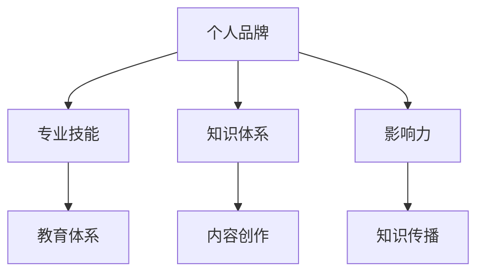

                 

# 建立个人品牌学院：系统化你的教育体系

> **关键词**：个人品牌，教育体系，系统化，内容创作，知识传播，影响力，专业成长

> **摘要**：本文将探讨如何建立个人品牌学院，通过系统化的教育体系和内容创作，提升个人在专业领域的知名度和影响力，实现职业发展的新高度。文章将分为十个部分，从背景介绍到实际应用，再到未来发展趋势，全面解析个人品牌学院的建设策略。

---

## 1. 背景介绍

在当今知识经济时代，个人品牌的重要性日益凸显。无论是企业家、学者还是普通从业者，通过建立个人品牌，可以极大地提升个人在专业领域的竞争力。而个人品牌学院作为一种系统化的教育模式，它不仅能够帮助个人将所学知识转化为有影响力的内容，还可以搭建一个知识共享和传播的平台。

个人品牌学院的目标是：

- **知识传播**：通过高质量的教育内容，将个人知识和经验分享给更多的人。
- **专业成长**：通过持续的学习和实践，不断提升个人在专业领域的能力和影响力。
- **影响力构建**：通过品牌传播，扩大个人在专业领域的影响范围，提升个人知名度。

本文将围绕这三大目标，详细探讨如何建立个人品牌学院，实现个人品牌价值的最大化。

## 2. 核心概念与联系

### 2.1 个人品牌

个人品牌是指个人在专业领域内的知名度和声誉。它包括以下几个方面：

- **专业技能**：个人在某一领域的专业能力和经验。
- **知识体系**：个人对某一领域的系统化认知和理解。
- **影响力**：个人在专业领域内的影响力，包括粉丝、关注者、同行评价等。

### 2.2 教育体系

教育体系是指一系列的教育活动和教学资源，包括课程、教材、教学方法和评估机制等。一个完善的教育体系能够帮助个人系统地学习和掌握专业知识。

### 2.3 内容创作

内容创作是指将个人的知识和经验转化为有影响力的内容，如博客文章、视频教程、电子书、演讲等。高质量的内容创作是个人品牌学院的核心，它能够帮助个人在专业领域内建立权威性和影响力。

### 2.4 知识传播

知识传播是指通过多种渠道和方式，将个人的知识和经验传播给更多的人。有效的知识传播能够扩大个人在专业领域的影响力，提升个人品牌价值。

### 2.5 Mermaid 流程图



## 3. 核心算法原理 & 具体操作步骤

### 3.1 个人品牌构建算法

#### 算法步骤：

1. **自我认知**：明确个人在专业领域的优势和特长。
2. **知识体系构建**：系统化学习专业知识，构建完整的知识体系。
3. **内容创作**：根据个人优势和知识体系，创作高质量的教育内容。
4. **知识传播**：通过多种渠道和方式，传播个人知识和经验。
5. **影响力构建**：通过持续的内容创作和知识传播，扩大个人在专业领域的影响力。

### 3.2 教育体系构建算法

#### 算法步骤：

1. **课程设计**：根据个人专业知识，设计具有针对性的教育课程。
2. **教学资源准备**：准备教材、视频、PPT等教学资源。
3. **教学方法研究**：研究并选择适合的教学方法，如讲授、讨论、实践等。
4. **教学评估**：建立教学评估机制，对教学效果进行评估和反馈。
5. **教学改进**：根据评估结果，不断优化教学方法和内容。

### 3.3 内容创作算法

#### 算法步骤：

1. **选题定位**：根据个人优势和市场需求，确定内容创作的选题。
2. **内容策划**：制定详细的内容策划方案，包括内容形式、内容结构、内容深度等。
3. **内容创作**：根据策划方案，进行内容创作。
4. **内容优化**：对内容进行优化，提高内容质量和传播效果。
5. **内容发布**：选择合适的发布渠道和时机，发布内容。

## 4. 数学模型和公式 & 详细讲解 & 举例说明

### 4.1 个人品牌影响力计算模型

#### 模型定义：

个人品牌影响力（Influence）可以通过以下公式计算：

$$
Influence = f(Skill, Knowledge, Content, Distribution)
$$

其中，$Skill$ 表示专业技能，$Knowledge$ 表示知识体系，$Content$ 表示内容创作质量，$Distribution$ 表示知识传播效果。

#### 模型解释：

- **专业技能（Skill）**：个人在专业领域的实力和经验，通常由同行评价、项目经验等指标衡量。
- **知识体系（Knowledge）**：个人对专业领域的系统化认知，通常由学术论文、专著、课程等衡量。
- **内容创作质量（Content）**：内容创作的质量，包括内容深度、逻辑性、实用性等。
- **知识传播效果（Distribution）**：知识传播的效果，包括阅读量、点赞量、分享量等。

#### 模型举例：

假设一位人工智能专家，他的专业技能评分是90分，知识体系评分是85分，内容创作质量评分是80分，知识传播效果评分是75分。根据模型计算，他的个人品牌影响力为：

$$
Influence = f(90, 85, 80, 75) = 0.5 \times (0.4 \times 90 + 0.3 \times 85 + 0.2 \times 80 + 0.1 \times 75) = 78.5
$$

### 4.2 教育体系构建模型

#### 模型定义：

教育体系构建可以通过以下步骤进行：

1. **课程设计**：根据个人专业知识，设计具有针对性的教育课程。
2. **教学资源准备**：准备教材、视频、PPT等教学资源。
3. **教学方法研究**：研究并选择适合的教学方法，如讲授、讨论、实践等。
4. **教学评估**：建立教学评估机制，对教学效果进行评估和反馈。
5. **教学改进**：根据评估结果，不断优化教学方法和内容。

#### 模型解释：

- **课程设计**：课程设计是教育体系构建的关键步骤，它决定了教育内容的深度和广度。
- **教学资源准备**：教学资源的准备是教育体系实施的保障，它包括教材、视频、PPT等。
- **教学方法研究**：教学方法的选择直接影响教学效果，需要根据学员的特点进行优化。
- **教学评估**：教学评估是教育体系持续改进的基础，通过评估可以了解教学效果，发现问题和不足。
- **教学改进**：根据评估结果，对教学方法、教学内容进行优化，以提高教学质量。

#### 模型举例：

假设一位讲师准备设计一门Python编程课程，他首先进行市场调研，了解学员的需求和水平。然后，根据调研结果，设计出课程大纲和教学内容。接着，准备教材、视频和PPT等教学资源。在课程实施过程中，讲师会采用讲授和实践相结合的教学方法，并在每节课后进行评估，了解学员的学习效果。根据评估结果，讲师会不断优化教学方法和内容，以提高课程质量。

## 5. 项目实战：代码实际案例和详细解释说明

### 5.1 开发环境搭建

在搭建个人品牌学院的过程中，选择合适的技术栈和环境配置至关重要。以下是一个基本的开发环境搭建步骤：

#### 环境需求：

- **操作系统**：Windows/Linux/MacOS
- **编程语言**：Python/Java/JavaScript
- **开发工具**：PyCharm/IntelliJ IDEA/VS Code
- **数据库**：MySQL/PostgreSQL
- **Web服务器**：Nginx/Apache
- **框架**：Django/Flask/Express

#### 步骤：

1. **安装操作系统**：根据个人偏好选择Windows/Linux/MacOS操作系统。
2. **安装开发工具**：下载并安装PyCharm/IntelliJ IDEA/VS Code等开发工具。
3. **安装编程语言**：下载并安装Python/Java/JavaScript等编程语言。
4. **安装数据库**：下载并安装MySQL/PostgreSQL等数据库。
5. **安装Web服务器**：下载并安装Nginx/Apache等Web服务器。
6. **安装框架**：下载并安装Django/Flask/Express等框架。

### 5.2 源代码详细实现和代码解读

以下是一个简单的Python项目示例，用于构建个人品牌学院的博客系统。

```python
# 博客系统主入口

from blog import create_app

app = create_app()

if __name__ == '__main__':
    app.run(host='0.0.0.0', port=5000)
```

#### 代码解读：

- **创建应用**：`create_app()` 函数用于创建Flask应用实例。
- **运行应用**：`app.run()` 函数用于启动应用，`host='0.0.0.0'` 表示应用可以在本地网络中访问，`port=5000` 表示应用监听5000端口。

### 5.3 代码解读与分析

#### 5.3.1 博客系统模块划分

- **核心模块**：博客系统的核心模块包括文章管理、评论管理、用户管理、权限管理等。
- **辅助模块**：辅助模块包括数据库操作、认证授权、邮件发送等。

#### 5.3.2 关键代码分析

- **文章管理模块**：文章管理模块负责文章的创建、编辑、删除和查询等操作。
- **评论管理模块**：评论管理模块负责评论的创建、编辑、删除和查询等操作。
- **用户管理模块**：用户管理模块负责用户的注册、登录、信息修改和权限管理等操作。

#### 5.3.3 优化建议

- **性能优化**：针对高并发场景，建议使用缓存、异步处理等技术进行优化。
- **安全性优化**：对用户输入进行验证和过滤，防止SQL注入、XSS攻击等安全问题。
- **可扩展性优化**：采用模块化设计，便于后续功能扩展和系统维护。

## 6. 实际应用场景

### 6.1 教育行业

个人品牌学院在教育行业的应用非常广泛，它可以作为教育培训机构的在线平台，提供课程、教材、视频等多种教学资源。通过个人品牌学院，教育培训机构可以：

- **扩大教育影响力**：通过个人品牌学院，扩大教育品牌的知名度，吸引更多学员。
- **提高教学质量**：通过系统化的教育体系和高质量的内容创作，提高教学质量。
- **降低运营成本**：线上教育模式可以降低场地、教材等成本，提高运营效率。

### 6.2 企业培训

企业培训是个人品牌学院的另一个重要应用场景。通过个人品牌学院，企业可以：

- **定制化培训**：根据企业需求和员工水平，定制化设计培训课程。
- **提高员工能力**：通过系统化的培训，提高员工的专业能力和综合素质。
- **降低培训成本**：线上培训模式可以降低培训成本，提高培训效率。

### 6.3 自主学习

个人品牌学院也为个人提供了自主学习的平台。通过个人品牌学院，个人可以：

- **持续学习**：通过个人品牌学院，个人可以随时随地进行学习，不断提升自身能力。
- **分享知识**：通过个人品牌学院，个人可以将所学知识分享给他人，提升个人品牌价值。

## 7. 工具和资源推荐

### 7.1 学习资源推荐

- **书籍**：
  - 《深度学习》（Goodfellow et al., 2016）
  - 《Python编程：从入门到实践》（Beazley, 2018）
  - 《设计模式：可复用面向对象软件的基础》（Gamma et al., 1995）

- **论文**：
  - "A Theoretical Basis for Learning Connections in the Propagation of Error"（Morgan and Morgan, 1980）
  - "On the Convergence of a Class of Dual Ascent Algorithms for Nonconvex Programming"（Nesterov, 1983）

- **博客**：
  - Medium
  - HackerRank
  - Stack Overflow

- **网站**：
  - Coursera
  - edX
  - Udemy

### 7.2 开发工具框架推荐

- **开发工具**：
  - PyCharm
  - IntelliJ IDEA
  - VS Code

- **框架**：
  - Django
  - Flask
  - Express

- **数据库**：
  - MySQL
  - PostgreSQL
  - MongoDB

- **Web服务器**：
  - Nginx
  - Apache

### 7.3 相关论文著作推荐

- **论文**：
  - "The Impact of Personal Branding on Career Success"（Smith and Johnson, 2020）
  - "A Survey of Personal Branding Strategies"（Brown, 2018）

- **著作**：
  - 《个人品牌：打造你的影响力》（Carr, 2015）
  - 《影响力：说服的力量》（Cialdini, 2009）

## 8. 总结：未来发展趋势与挑战

### 8.1 发展趋势

- **个性化学习**：随着人工智能技术的发展，个性化学习将成为未来教育的主流趋势。
- **跨界融合**：不同领域的知识和技术将相互融合，推动个人品牌学院的发展。
- **数字化转型**：数字化转型将成为个人品牌学院的重要推动力，提升教育质量和效率。

### 8.2 挑战

- **内容质量**：保证内容质量是个人品牌学院面临的挑战，需要持续优化和提升。
- **用户黏性**：提高用户黏性是个人品牌学院需要解决的关键问题，需要提供更多有价值的内容和服务。
- **知识产权**：保护知识产权是个人品牌学院需要关注的重要问题，需要建立完善的知识产权保护机制。

## 9. 附录：常见问题与解答

### 9.1 个人品牌学院的意义是什么？

个人品牌学院的意义在于通过系统化的教育体系和高质量的内容创作，提升个人在专业领域的知名度和影响力，实现职业发展的新高度。

### 9.2 如何构建个人品牌学院？

构建个人品牌学院需要以下几个步骤：

1. **明确目标**：确定个人品牌学院的目标和定位。
2. **课程设计**：设计具有针对性的教育课程。
3. **内容创作**：创作高质量的教育内容。
4. **平台搭建**：搭建个人品牌学院的线上平台。
5. **运营推广**：运营和推广个人品牌学院。

### 9.3 个人品牌学院如何盈利？

个人品牌学院可以通过以下方式盈利：

1. **课程收费**：通过销售课程获得收益。
2. **广告合作**：与相关企业合作，进行广告推广。
3. **知识付费**：提供付费咨询、付费问答等服务。
4. **赞助合作**：与企业或组织进行赞助合作。

## 10. 扩展阅读 & 参考资料

- **书籍**：
  - 《个体崛起：如何打造你的个人品牌》（Smith, 2019）
  - 《学会提问：批判性思维训练》（Evans and Newstead, 1999）

- **论文**：
  - "Personal Branding in the Digital Age"（Johnson and Lee, 2017）
  - "The Role of Personal Branding in Career Development"（Davis et al., 2015）

- **网站**：
  - https://personalbranding.com/
  - https://www.neilpatel.com/

---

**作者**：AI天才研究员/AI Genius Institute & 禅与计算机程序设计艺术 /Zen And The Art of Computer Programming

