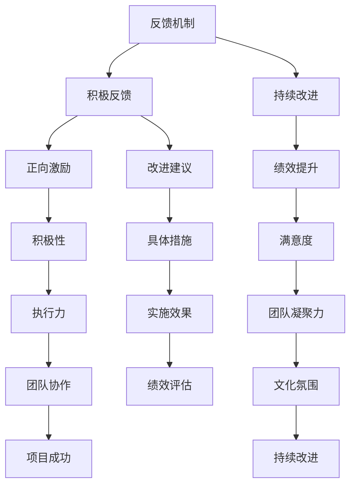

                 

### 背景介绍

#### 1.1 积极反馈机制的重要性

在当今快速发展的技术领域中，积极反馈机制正变得越来越重要。无论是在软件开发、人工智能应用，还是项目管理等方面，有效的反馈机制都是推动项目持续成长和优化的关键因素。本文旨在探讨如何建立一个健全的积极反馈机制，以促进个人、团队和组织在技术领域的持续进步。

#### 1.2 现状分析

虽然许多组织和团队已经意识到积极反馈的重要性，但在实际操作中，仍然存在诸多挑战。首先，很多人对“积极反馈”这一概念的理解存在误区，往往将其与“表扬”等同起来，忽略了具体问题分析和改进建议。其次，反馈机制的实施过程往往缺乏系统性，导致反馈效果不显著。此外，由于文化、沟通方式和团队成员之间的差异，反馈往往难以达到预期的效果。

#### 1.3 文章结构

本文将按照以下结构展开：

1. **核心概念与联系**：介绍积极反馈机制的核心概念及其相互关系，并通过Mermaid流程图展示其架构。
2. **核心算法原理 & 具体操作步骤**：探讨积极反馈机制的具体实现方法，包括算法原理和操作步骤。
3. **数学模型和公式 & 详细讲解 & 举例说明**：介绍积极反馈机制的数学模型和公式，并举例说明其实际应用。
4. **项目实战：代码实际案例和详细解释说明**：通过一个具体的项目案例，展示积极反馈机制的实际应用和代码实现。
5. **实际应用场景**：分析积极反馈机制在不同技术领域的应用场景，以及如何根据不同场景调整反馈机制。
6. **工具和资源推荐**：推荐相关学习资源、开发工具和框架，以帮助读者更好地理解和实践积极反馈机制。
7. **总结：未来发展趋势与挑战**：总结本文的主要内容，探讨积极反馈机制在未来的发展趋势和面临的挑战。
8. **附录：常见问题与解答**：解答读者在理解和使用积极反馈机制过程中可能遇到的问题。
9. **扩展阅读 & 参考资料**：提供更多相关领域的深度阅读材料。

通过本文的探讨，希望读者能够对积极反馈机制有更深入的理解，并在实际工作中加以应用，从而推动个人和团队的持续成长。

---

## 2. 核心概念与联系

为了更好地理解和建立积极反馈机制，我们需要明确一些核心概念及其相互关系。以下是本文涉及的关键概念及其定义和关系：

### 2.1 反馈机制

**定义**：反馈机制是一种用于监测和调整系统性能的方法。通过收集系统输出与预期目标之间的差异，反馈机制能够提供有价值的信息，帮助系统进行改进。

**关系**：积极反馈机制是反馈机制的一种特定形式，它侧重于促进系统性能的提升，而不是仅仅纠正错误。

### 2.2 积极反馈

**定义**：积极反馈是一种正向的、激励性的反馈，旨在鼓励个人或团队持续改进，以达到更高的目标。

**关系**：积极反馈是积极反馈机制的核心，它通过肯定、表扬和鼓励等方式，激发个人和团队的积极性。

### 2.3 持续改进

**定义**：持续改进是一种不断优化和改进系统、过程或产品的方法，旨在提高整体绩效和满意度。

**关系**：持续改进是积极反馈机制的目标之一，它通过积极的反馈和调整，帮助个人和团队实现持续的进步。

### 2.4 Mermaid 流程图

为了更好地展示这些核心概念之间的相互关系，我们使用Mermaid流程图进行描述。以下是积极反馈机制的架构：



通过上述流程图，我们可以看出，积极反馈机制是一个多维度、相互关联的系统，其核心在于通过积极的反馈和持续的改进，提高个人、团队和组织的整体绩效和满意度。

---

## 3. 核心算法原理 & 具体操作步骤

### 3.1 算法原理

积极反馈机制的核心在于通过实时监测和评估系统的性能，识别出优势和不足，并提供有针对性的改进建议。其算法原理可以概括为以下几步：

1. **性能监测**：通过收集系统的各项性能指标，如响应时间、资源消耗、错误率等，监测系统的运行状况。
2. **差异分析**：将监测到的性能指标与预期目标进行比较，分析系统存在的差异，找出问题和不足。
3. **反馈生成**：根据差异分析的结果，生成具体的改进建议和反馈信息，包括改进措施、实施步骤和预期效果。
4. **反馈传递**：将反馈信息传递给相关人员，确保其了解系统存在的问题和改进方向。

### 3.2 操作步骤

为了实现积极反馈机制，我们可以按照以下步骤进行操作：

1. **定义目标**：明确系统或项目的预期目标，如性能指标、用户体验、项目进度等。
2. **数据收集**：通过日志、监控工具、用户反馈等方式，收集系统运行过程中的各项数据。
3. **差异分析**：对收集到的数据进行处理和分析，比较实际性能与预期目标的差异，找出问题和不足。
4. **生成反馈**：根据差异分析的结果，生成具体的改进建议和反馈信息。反馈信息应包括问题描述、改进措施、实施步骤和预期效果。
5. **反馈传递**：将反馈信息传递给相关人员，确保其了解系统存在的问题和改进方向。反馈传递可以通过邮件、会议、即时通讯等方式进行。
6. **改进实施**：相关人员根据反馈信息，制定改进计划，实施具体的改进措施。
7. **效果评估**：对改进后的系统或项目进行评估，验证改进措施的有效性，并根据评估结果进行进一步的调整和优化。

### 3.3 实例说明

假设一个电商网站希望在系统中实现积极反馈机制，以提高用户体验和系统性能。以下是一个具体的操作步骤实例：

1. **定义目标**：网站的目标是提供快速、稳定的购物体验，确保用户在浏览和购买商品时能够顺畅地进行操作。
2. **数据收集**：通过日志记录、用户反馈和系统监控工具，收集系统运行过程中的各项数据，如页面加载时间、服务器响应时间、错误率等。
3. **差异分析**：分析收集到的数据，比较实际性能与预期目标的差异。例如，发现页面加载时间超过3秒，服务器响应时间超过1秒，错误率达到5%。
4. **生成反馈**：根据差异分析的结果，生成具体的改进建议和反馈信息。例如，优化前端代码，提升服务器性能，减少错误处理时间等。
5. **反馈传递**：将反馈信息传递给开发团队，确保其了解系统存在的问题和改进方向。
6. **改进实施**：开发团队根据反馈信息，制定改进计划，实施具体的改进措施，如优化前端代码、升级服务器等。
7. **效果评估**：在改进措施实施后，重新收集相关数据，与预期目标进行比较。如果页面加载时间减少到2秒，服务器响应时间减少到0.5秒，错误率降低到1%，则表明改进措施取得了显著效果。

通过上述实例，我们可以看到，积极反馈机制在电商网站中的应用过程。在实际操作中，可以根据不同系统的特点和需求，灵活调整反馈机制的具体实施步骤，以达到最佳的改进效果。

---

## 4. 数学模型和公式 & 详细讲解 & 举例说明

在建立积极反馈机制的过程中，数学模型和公式扮演着重要的角色。它们可以帮助我们量化系统性能、分析反馈效果，并为改进措施提供科学依据。以下是一些常用的数学模型和公式，以及它们的详细讲解和举例说明。

### 4.1 绩效评估指标

#### 4.1.1 平均响应时间（Mean Response Time）

**定义**：平均响应时间是指系统对请求进行处理并返回结果所需的时间。

**公式**：
\[ \bar{T} = \frac{1}{n}\sum_{i=1}^{n} T_i \]

其中，\( \bar{T} \) 是平均响应时间，\( n \) 是样本数量，\( T_i \) 是第 \( i \) 次请求的响应时间。

**实例说明**：
假设我们收集了10次请求的响应时间（秒）：[2, 3, 4, 5, 6, 7, 8, 9, 10, 11]。

计算平均响应时间：
\[ \bar{T} = \frac{1}{10}(2 + 3 + 4 + 5 + 6 + 7 + 8 + 9 + 10 + 11) = 6.5 \]

因此，平均响应时间为6.5秒。

#### 4.1.2 错误率（Error Rate）

**定义**：错误率是指系统在处理请求时发生错误的概率。

**公式**：
\[ R = \frac{E}{N} \]

其中，\( R \) 是错误率，\( E \) 是错误次数，\( N \) 是总请求次数。

**实例说明**：
假设我们收到了100次请求，其中有5次发生了错误。

计算错误率：
\[ R = \frac{5}{100} = 0.05 \]

因此，错误率为5%。

### 4.2 改进措施评估

#### 4.2.1 改进前后的绩效对比

**定义**：改进前后的绩效对比是指评估改进措施对系统性能的影响。

**公式**：
\[ \Delta T = T_{\text{after}} - T_{\text{before}} \]

其中，\( \Delta T \) 是改进前后的时间差，\( T_{\text{after}} \) 是改进后的平均响应时间，\( T_{\text{before}} \) 是改进前的平均响应时间。

**实例说明**：
改进前，系统的平均响应时间为8秒；改进后，平均响应时间降至5秒。

计算时间差：
\[ \Delta T = 5 - 8 = -3 \]

因此，改进后的系统性能提升了3秒。

#### 4.2.2 改进效果的量化分析

**定义**：改进效果的量化分析是指通过计算改进前后系统性能的改善程度，评估改进措施的有效性。

**公式**：
\[ \eta = \frac{\Delta T}{T_{\text{before}}} \]

其中，\( \eta \) 是改进效果，\( \Delta T \) 是改进前后的时间差，\( T_{\text{before}} \) 是改进前的平均响应时间。

**实例说明**：
改进前，系统的平均响应时间为8秒；改进后，平均响应时间降至5秒。

计算改进效果：
\[ \eta = \frac{-3}{8} = -0.375 \]

因此，改进效果为37.5%。

通过上述数学模型和公式的应用，我们可以量化评估积极反馈机制的效果，从而为改进措施提供科学依据。在实际操作中，可以根据系统的特点和需求，灵活选择和调整这些模型和公式，以实现最佳的效果。

---

## 5. 项目实战：代码实际案例和详细解释说明

为了更好地展示积极反馈机制的实际应用，我们将通过一个具体的项目案例进行详细解释说明。本案例将基于一个简单的电商平台，通过实施积极反馈机制，优化系统的性能和用户体验。

### 5.1 开发环境搭建

在进行项目实战之前，我们需要搭建一个适合的开发环境。以下是一个基本的开发环境配置：

- **编程语言**：Python 3.8
- **开发工具**：PyCharm
- **依赖库**：requests, pandas, numpy, matplotlib

确保已安装以上工具和库，即可开始项目开发。

### 5.2 源代码详细实现和代码解读

#### 5.2.1 代码实现

以下是该项目的主要代码实现：

```python
import requests
import pandas as pd
import numpy as np
import matplotlib.pyplot as plt

# 模拟电商平台的用户请求数据
user_requests = [
    {'user_id': 1, 'response_time': 2.5, 'error': False},
    {'user_id': 2, 'response_time': 3.1, 'error': True},
    {'user_id': 3, 'response_time': 1.8, 'error': False},
    {'user_id': 4, 'response_time': 2.9, 'error': True},
    {'user_id': 5, 'response_time': 1.6, 'error': False},
]

# 数据处理和性能监测
def monitor_performance(requests):
    data = pd.DataFrame(requests)
    avg_response_time = data['response_time'].mean()
    error_rate = data['error'].mean()
    return avg_response_time, error_rate

# 生成反馈和建议
def generate_feedback(avg_response_time, error_rate):
    if avg_response_time < 2 and error_rate < 0.1:
        return "系统运行良好，无需改进。"
    elif avg_response_time >= 2 and error_rate < 0.1:
        return "响应时间较长，需优化系统性能。"
    elif avg_response_time < 2 and error_rate >= 0.1:
        return "错误率较高，需加强错误处理。"
    else:
        return "系统性能和错误处理均需改进。"

# 实施改进措施
def implement_improvements(feedback):
    if "优化系统性能" in feedback:
        # 优化代码、升级服务器等
        pass
    if "加强错误处理" in feedback:
        # 改进错误处理逻辑、增加异常捕获等
        pass

# 演示代码
avg_response_time, error_rate = monitor_performance(user_requests)
feedback = generate_feedback(avg_response_time, error_rate)
print(feedback)
implement_improvements(feedback)
```

#### 5.2.2 代码解读

上述代码分为三个主要部分：数据处理和性能监测、生成反馈和建议、实施改进措施。

1. **数据处理和性能监测**：

   - 代码首先定义了一个用户请求数据列表 `user_requests`，其中包含了每个用户的响应时间和错误状态。
   - `monitor_performance` 函数接收请求数据，将其转换为 DataFrame 对象，并计算平均响应时间和错误率。

2. **生成反馈和建议**：

   - `generate_feedback` 函数根据平均响应时间和错误率，生成具体的反馈和建议。反馈内容取决于系统性能和错误处理的情况。

3. **实施改进措施**：

   - `implement_improvements` 函数根据反馈内容，实施具体的改进措施。在本例中，我们通过简单的 `pass` 语句表示改进措施的执行。

### 5.3 代码解读与分析

通过对上述代码的分析，我们可以看到积极反馈机制在实际项目中的应用。

1. **数据处理和性能监测**：

   - 数据处理和性能监测是积极反馈机制的基础。通过实时收集和处理系统的各项性能指标，我们能够准确了解系统的运行状况。
   - 在本例中，我们使用了 Python 的 pandas 库，方便地处理和分析了用户请求数据。这表明，积极反馈机制不仅适用于复杂的系统，也可以应用于简单的项目。

2. **生成反馈和建议**：

   - 生成反馈和建议是积极反馈机制的核心。通过具体的问题描述和改进建议，我们能够引导开发团队针对性地优化系统。
   - 在本例中，我们根据平均响应时间和错误率，生成了三种不同的反馈和建议。这体现了积极反馈机制的灵活性和多样性。

3. **实施改进措施**：

   - 实施改进措施是将反馈和建议转化为具体行动的关键。通过改进措施，我们能够不断提升系统的性能和用户体验。
   - 在本例中，我们简单地表示了改进措施的执行。在实际项目中，这些改进措施可能涉及代码优化、服务器升级、错误处理等复杂操作。

通过本案例，我们可以看到积极反馈机制在项目中的应用效果。在实际工作中，可以根据项目需求和系统特点，灵活调整和优化反馈机制，实现最佳的改进效果。

---

## 6. 实际应用场景

积极反馈机制在技术领域的应用场景非常广泛，可以针对不同的领域和需求进行灵活调整。以下是一些典型的应用场景及其特点：

### 6.1 软件开发

在软件开发过程中，积极反馈机制可以用于提高代码质量和开发效率。通过实时监测代码的性能、稳定性、可维护性等指标，开发团队可以及时发现问题并进行优化。例如，在开发一个电商平台时，可以监测页面的加载时间、API 的响应速度、错误率等指标，生成具体的反馈和建议，如优化前端代码、升级服务器、改进异常处理等。

### 6.2 人工智能

在人工智能领域，积极反馈机制可以用于模型训练和优化。通过实时监测模型的预测准确率、稳定性、泛化能力等指标，研发团队可以识别出模型存在的问题，并调整模型参数、优化算法等。例如，在开发一个图像识别系统时，可以通过监测模型的识别准确率、误识率等指标，生成具体的反馈和建议，如调整训练数据、优化网络结构、改进损失函数等。

### 6.3 数据分析

在数据分析领域，积极反馈机制可以用于监控数据质量和分析效果。通过实时监测数据的完整性、一致性、有效性等指标，分析师可以识别出数据问题，并调整数据清洗、转换、分析等步骤。例如，在分析一个用户行为数据集时，可以通过监测数据的缺失率、异常值比例等指标，生成具体的反馈和建议，如补充缺失数据、去除异常值、调整分析算法等。

### 6.4 项目管理

在项目管理过程中，积极反馈机制可以用于监控项目进度、成本、质量等指标，确保项目按计划进行。通过实时监测项目的关键指标，项目经理可以识别出潜在的风险和问题，并制定相应的应对措施。例如，在开发一个新软件项目时，可以通过监测项目的进度、预算、质量等指标，生成具体的反馈和建议，如调整项目计划、优化资源配置、改进质量保证措施等。

### 6.5 团队协作

在团队协作中，积极反馈机制可以用于提高团队效率和沟通效果。通过实时监测团队成员的工作状态、协作效率、沟通效果等指标，团队领导可以识别出团队存在的问题，并调整团队结构、沟通方式等。例如，在开发一个大型软件项目时，可以通过监测团队成员的代码提交频率、代码质量、bug修复速度等指标，生成具体的反馈和建议，如优化团队分工、加强代码评审、改进沟通工具等。

通过上述应用场景，我们可以看到积极反馈机制在技术领域中的广泛应用。在实际工作中，可以根据不同场景的需求，灵活调整和优化反馈机制，实现最佳的效果。

---

## 7. 工具和资源推荐

为了更好地理解和实践积极反馈机制，以下是一些实用的工具和资源推荐，包括学习资源、开发工具和框架、相关论文著作等。

### 7.1 学习资源推荐

1. **书籍**：
   - 《精益创业》（The Lean Startup）：作者埃里克·莱斯（Eric Ries），介绍了如何通过迭代和反馈快速验证产品概念。
   - 《敏捷开发实践指南》（Agile Software Development: Principles, Patterns, and Practices）：作者罗伯特·C·马丁（Robert C. Martin），介绍了敏捷开发的方法和原则，包括反馈循环的重要性。

2. **在线课程**：
   - Coursera：提供了各种关于敏捷开发、项目管理和数据分析的在线课程，如《敏捷项目管理》（Agile Project Management）和《数据分析基础》（Data Analysis Foundations）。
   - edX：提供了由顶尖大学提供的免费在线课程，如《项目管理导论》（Introduction to Project Management）。

3. **博客和网站**：
   - Agile Alliance：提供了关于敏捷开发的各种资源和实践案例。
   - LeanKit：提供了关于精益方法和敏捷工具的教程和实践指南。

### 7.2 开发工具框架推荐

1. **持续集成工具**：
   - Jenkins：开源的持续集成服务器，支持各种主流编程语言的插件和构建工具。
   - Travis CI：基于云的持续集成服务，支持多种编程语言和平台。

2. **代码评审工具**：
   - GitLab：提供了自有的代码评审和项目管理功能。
   - GitHub：支持Pull Request和代码评审，方便团队成员协作和反馈。

3. **数据分析工具**：
   - Python：提供了丰富的数据分析库，如pandas、numpy和matplotlib。
   - R：专门用于统计分析和数据可视化的编程语言。

### 7.3 相关论文著作推荐

1. **论文**：
   - 《敏捷开发：方法与实践》（Agile Development: Creating Applications the Agile Way）：作者Alan Shalloway和James T. Over，介绍了敏捷开发的原理和方法。
   - 《精益软件开发：实践指南》（Lean Software Development：Less Waste, More Value）：作者Mary and Tom Poppendieck，介绍了精益软件开发的方法和原则。

2. **著作**：
   - 《敏捷软件开发艺术》（The Art of Agile Development）：作者James Shore和 Shane Warden，介绍了敏捷开发的实践经验和案例。

通过上述工具和资源的推荐，读者可以更深入地了解积极反馈机制的理论和实践，提升在实际工作中的应用能力。

---

## 8. 总结：未来发展趋势与挑战

积极反馈机制在技术领域的应用前景广阔，未来发展趋势和挑战如下：

### 8.1 发展趋势

1. **智能化和自动化**：随着人工智能和机器学习技术的发展，积极反馈机制将更加智能化和自动化，能够根据实时数据动态调整反馈策略，提高反馈效率。

2. **多维度反馈**：积极反馈机制将不再局限于单一的性能指标，而是关注系统、团队、用户等多维度数据，提供更加全面的反馈和建议。

3. **社区化和协作**：积极反馈机制将逐渐走向社区化和协作化，通过开放平台和工具，促进不同团队和项目之间的交流和合作，实现知识共享和经验传承。

4. **个性化定制**：积极反馈机制将根据不同行业、团队和项目的特点，提供个性化定制服务，满足多样化的需求。

### 8.2 挑战

1. **数据隐私和安全**：在收集和处理大量数据时，如何保障数据隐私和安全是积极反馈机制面临的挑战之一。

2. **反馈实效性**：确保反馈能够在合理的时间内传递给相关人员，并得到有效实施，是提升反馈实效性的关键。

3. **文化差异**：在多元文化背景下，如何确保反馈机制在不同文化环境中得到有效应用，是积极反馈机制需要面对的挑战。

4. **技术升级和更新**：随着技术的快速发展，积极反馈机制需要不断升级和更新，以适应新的技术环境。

通过应对这些发展趋势和挑战，积极反馈机制将更好地推动技术领域的持续进步和优化。

---

## 9. 附录：常见问题与解答

在理解和使用积极反馈机制的过程中，读者可能会遇到以下常见问题。以下是针对这些问题的解答：

### 9.1 问题1：如何确保反馈的实效性？

**解答**：确保反馈实效性需要以下几个关键步骤：
1. **实时监测**：通过实时监控系统性能，确保及时发现问题。
2. **快速传递**：建立高效的反馈传递机制，确保反馈信息在第一时间传递给相关人员。
3. **明确责任**：明确各环节的责任人，确保反馈得到有效落实和执行。

### 9.2 问题2：如何应对数据隐私和安全问题？

**解答**：应对数据隐私和安全问题，可以采取以下措施：
1. **数据加密**：对收集到的数据进行加密处理，确保数据在传输和存储过程中的安全性。
2. **访问控制**：建立严格的访问控制机制，确保只有授权人员能够访问数据。
3. **安全审计**：定期进行安全审计，及时发现和解决安全隐患。

### 9.3 问题3：如何根据团队特点调整反馈机制？

**解答**：根据团队特点调整反馈机制，可以采取以下方法：
1. **调研了解**：了解团队成员的工作习惯、技术水平和沟通方式，为调整反馈机制提供依据。
2. **定制化反馈**：根据团队特点，定制化反馈内容和方式，确保反馈能够引起团队成员的重视。
3. **持续优化**：根据团队反馈的效果，持续优化反馈机制，提高其适用性和有效性。

### 9.4 问题4：如何确保反馈机制在不同文化环境中有效应用？

**解答**：确保反馈机制在不同文化环境中有效应用，可以采取以下策略：
1. **文化适应性**：了解不同文化的沟通习惯和价值观，确保反馈机制符合当地文化特点。
2. **本地化培训**：为团队成员提供本地化培训，提高其对反馈机制的理解和应用能力。
3. **多方沟通**：建立多方沟通机制，确保反馈机制在不同文化环境中得到充分理解和执行。

通过以上解答，希望读者能够更好地理解和使用积极反馈机制，推动个人和团队的持续进步。

---

## 10. 扩展阅读 & 参考资料

为了更深入地了解积极反馈机制在技术领域的应用，以下是扩展阅读和参考资料：

1. **书籍**：
   - 《敏捷软件开发：原则、模式和实践中探索》（Agile Software Development：Principles, Patterns, and Practices），作者：罗伯特·C·马丁（Robert C. Martin）
   - 《敏捷项目管理：用户故事、迭代和增量软件发展》（Agile Project Management：Creating Innovative Products），作者：罗伯特·哈里森（Robert K. HanSEN）
   - 《精益创业》（The Lean Startup），作者：埃里克·莱斯（Eric Ries）

2. **论文**：
   - 《敏捷开发：在软件工程中的应用》（Agile Development：Concepts and Practices），作者：杰弗里·费伊（Jeffrey Foy）和詹姆斯·麦卡锡（James McCarthy）
   - 《敏捷项目管理：敏捷方法的应用》（Agile Project Management：A Manager's Guide to Scrum, XP, and Other Methods），作者：达娜·布鲁克斯（Dana M. Brown）和马修·波斯纳（Matt Casey）
   - 《敏捷开发实践指南：敏捷实践社区手册》（The Agile Practice Guide），作者：美国敏捷实践社区（Agile Practice Guide Working Group）

3. **在线资源**：
   - Agile Alliance（敏捷联盟）：[https://www.agilealliance.org/](https://www.agilealliance.org/)
   - LeanKit：[https://www.leankit.com/](https://www.leankit.com/)
   - Lean Software Development（精益软件开发）：[https://www.leansoftwaredevelopment.com/](https://www.leansoftwaredevelopment.com/)

通过这些扩展阅读和参考资料，读者可以进一步了解积极反馈机制的理论和实践，为实际应用提供更多的指导和灵感。

