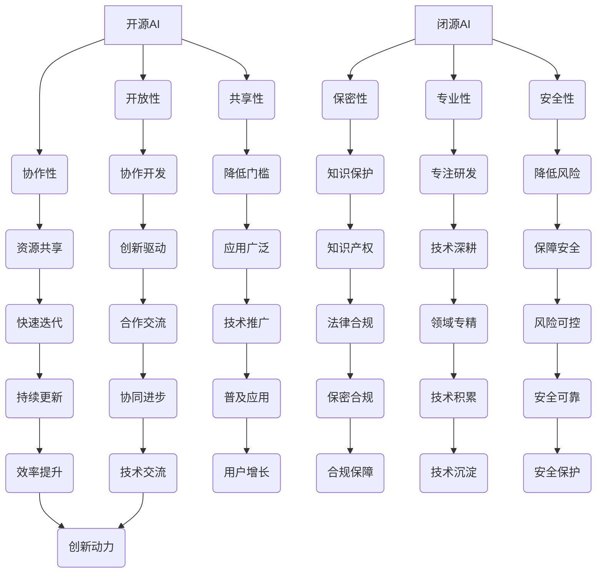

                 

# 开源AI的未来：能否跟上闭源开发的步伐?

## 摘要

本文探讨了开源AI与闭源AI的发展现状及未来趋势。开源AI以其开放性、协作性和共享性，推动了技术的快速迭代和普及，但在竞争激烈的AI领域，能否继续保持优势仍存挑战。闭源AI则凭借其高效的研发体系和严密的安全保障，在某些领域取得了显著突破。本文将从技术原理、数学模型、实际应用等多个角度，深入分析开源AI和闭源AI的发展路径，探讨它们在未来技术竞争中能否继续发挥各自的优势。

## 1. 背景介绍

### 开源AI的兴起

开源AI的兴起可以追溯到20世纪90年代。随着互联网的普及，全球各地的研究人员开始共享他们的研究成果和技术，这种开放性的合作模式极大地促进了人工智能领域的发展。开源AI项目如TensorFlow、PyTorch等，提供了丰富的模型库、工具和资源，使得研究人员和开发者可以轻松地搭建和训练自己的AI模型，从而推动了AI技术的广泛应用。

### 闭源AI的发展

与开源AI相对，闭源AI主要由企业和研究机构独立研发，其成果通常不公开。闭源AI的优势在于可以更加专注于特定领域的技术研发，同时也能保护其知识产权。近年来，随着AI技术的快速发展，越来越多的企业开始投入闭源AI的研发，如谷歌的AlphaGo、微软的Azure Machine Learning等。

### 开源与闭源的对比

开源AI和闭源AI在多个方面存在显著差异：

- **开放性**：开源AI项目公开源代码，用户可以自由修改和分享，而闭源AI项目则保密其源代码。
- **协作性**：开源AI项目鼓励全球范围内的合作，闭源AI项目则相对封闭，主要依赖内部团队协作。
- **安全性**：闭源AI项目通常有更高的安全性保障，开源AI项目则可能面临安全漏洞的风险。
- **创新能力**：开源AI项目具有更多的创新动力，因为用户可以自由地修改和改进，闭源AI项目则可能在创新方面受到一定限制。

## 2. 核心概念与联系

### 开源AI的核心概念

开源AI的核心概念包括：

- **开放性**：开源AI项目公开源代码，用户可以自由访问和修改。
- **协作性**：开源AI项目鼓励全球范围内的协作，促进技术进步。
- **共享性**：开源AI项目共享模型、工具和资源，降低研发门槛。

### 闭源AI的核心概念

闭源AI的核心概念包括：

- **保密性**：闭源AI项目保密源代码，保护知识产权。
- **专业性**：闭源AI项目专注于特定领域的技术研发，提高研发效率。
- **安全性**：闭源AI项目通常有更高的安全性保障，降低安全风险。

### 开源AI与闭源AI的联系

开源AI与闭源AI之间存在密切的联系。一方面，闭源AI项目可能依赖于开源AI的模型和工具，以提高研发效率。另一方面，开源AI项目也可能借鉴闭源AI的技术成果，以推动自身的发展。例如，谷歌的TensorFlow开源项目在其闭源AI项目中发挥了重要作用，而开源AI项目PyTorch也受到了微软闭源AI项目Azure Machine Learning的启发。

### 核心概念与架构的 Mermaid 流程图



## 3. 核心算法原理 & 具体操作步骤

### 开源AI的核心算法原理

开源AI的核心算法主要基于深度学习和机器学习。深度学习是一种模拟人脑神经元连接的网络模型，通过多层神经网络进行数据特征提取和模式识别。机器学习则是利用大量数据进行自动学习和优化，以实现特定任务的目标。

具体操作步骤如下：

1. **数据准备**：收集并整理相关数据，包括训练数据和测试数据。
2. **模型选择**：根据任务需求选择合适的深度学习模型，如卷积神经网络（CNN）、循环神经网络（RNN）等。
3. **模型训练**：将训练数据输入模型，通过反向传播算法不断调整模型参数，使模型在训练集上达到良好的性能。
4. **模型评估**：使用测试数据评估模型性能，调整模型参数以优化性能。
5. **模型部署**：将训练好的模型部署到实际应用场景中，实现预测和决策功能。

### 闭源AI的核心算法原理

闭源AI的核心算法通常涉及更复杂的技术，如自动驾驶、图像识别、自然语言处理等。闭源AI项目通常采用混合算法，结合深度学习、强化学习等多种技术，以实现更高的性能和更广泛的应用。

具体操作步骤如下：

1. **需求分析**：明确项目需求，确定需要解决的问题和达到的性能目标。
2. **数据收集**：收集并整理相关数据，包括训练数据和测试数据。
3. **算法设计**：设计合适的算法框架，选择合适的算法模型，如深度学习模型、强化学习模型等。
4. **模型训练**：将训练数据输入模型，通过迭代训练和优化，使模型在训练集上达到良好的性能。
5. **模型评估**：使用测试数据评估模型性能，调整模型参数以优化性能。
6. **模型部署**：将训练好的模型部署到实际应用场景中，实现预测和决策功能。

## 4. 数学模型和公式 & 详细讲解 & 举例说明

### 开源AI的数学模型和公式

开源AI的数学模型主要包括深度学习中的神经网络模型。以下是一个简单的多层感知器（MLP）模型：

$$
y = \sigma(W_2 \cdot \sigma(W_1 \cdot x + b_1) + b_2)
$$

其中，$y$ 是输出结果，$x$ 是输入特征，$W_1$ 和 $W_2$ 是权重矩阵，$b_1$ 和 $b_2$ 是偏置项，$\sigma$ 是激活函数（通常使用 sigmoid 函数或 ReLU 函数）。

### 闭源AI的数学模型和公式

闭源AI的数学模型通常更加复杂，涉及多种算法和技术。以下是一个简单的强化学习模型：

$$
Q(s, a) = r(s, a) + \gamma \max_{a'} Q(s', a')
$$

其中，$Q(s, a)$ 是状态 $s$ 下采取动作 $a$ 的预期收益，$r(s, a)$ 是在状态 $s$ 下采取动作 $a$ 所获得的即时奖励，$\gamma$ 是折扣因子，$s'$ 和 $a'$ 分别是下一状态和下一动作。

### 举例说明

#### 开源AI示例

假设我们使用多层感知器模型进行图像分类。输入特征是一个28x28的像素矩阵，输出结果是10个类别之一。

1. **数据准备**：收集并整理训练数据，每个图像对应一个标签。
2. **模型选择**：选择一个多层感知器模型，如包含两个隐层的MLP。
3. **模型训练**：使用训练数据进行模型训练，通过反向传播算法优化模型参数。
4. **模型评估**：使用测试数据进行模型评估，计算准确率。

```python
import tensorflow as tf

# 构建模型
model = tf.keras.Sequential([
    tf.keras.layers.Flatten(input_shape=(28, 28)),
    tf.keras.layers.Dense(128, activation='relu'),
    tf.keras.layers.Dense(10, activation='softmax')
])

# 编译模型
model.compile(optimizer='adam', loss='sparse_categorical_crossentropy', metrics=['accuracy'])

# 训练模型
model.fit(train_images, train_labels, epochs=5)

# 评估模型
test_loss, test_acc = model.evaluate(test_images, test_labels)
print(f'测试准确率：{test_acc}')
```

#### 闭源AI示例

假设我们使用强化学习模型进行自动驾驶。状态包括车辆位置、速度、车道线等信息，动作包括加速、减速、转弯等。

1. **需求分析**：明确自动驾驶的需求，如道路识别、障碍物检测等。
2. **数据收集**：收集自动驾驶过程中产生的数据，包括车辆状态和道路信息。
3. **算法设计**：设计一个强化学习模型，如基于DQN（Deep Q-Network）的自动驾驶模型。
4. **模型训练**：使用收集到的数据进行模型训练，通过迭代训练和优化，使模型在训练集上达到良好的性能。
5. **模型部署**：将训练好的模型部署到实际自动驾驶系统中。

```python
import gym
import numpy as np

# 创建环境
env = gym.make("CartPole-v0")

# 初始化Q值表格
Q = np.zeros([env.observation_space.n, env.action_space.n])

# 设定学习率和折扣因子
alpha = 0.1
gamma = 0.9

# 训练模型
for episode in range(1000):
    state = env.reset()
    done = False
    total_reward = 0

    while not done:
        action = np.argmax(Q[state, :] + alpha * (np.random.randn(env.action_space.n)))
        next_state, reward, done, _ = env.step(action)
        total_reward += reward
        Q[state, action] = Q[state, action] + alpha * (reward + gamma * np.max(Q[next_state, :]) - Q[state, action])
        state = next_state

    print(f'Episode {episode} 总奖励：{total_reward}')

env.close()
```

## 5. 项目实战：代码实际案例和详细解释说明

### 5.1 开发环境搭建

为了更好地理解开源AI和闭源AI的核心算法，我们将通过一个简单的项目实战来展示它们的实际应用。首先，我们需要搭建一个基本的开发环境。

#### 开源AI开发环境搭建

1. **安装Python**：确保已经安装了Python环境，版本不低于3.6。
2. **安装TensorFlow**：使用pip命令安装TensorFlow库。
   ```shell
   pip install tensorflow
   ```
3. **安装Jupyter Notebook**：使用pip命令安装Jupyter Notebook，以便在浏览器中运行Python代码。
   ```shell
   pip install notebook
   ```
4. **启动Jupyter Notebook**：在终端中输入以下命令启动Jupyter Notebook。
   ```shell
   jupyter notebook
   ```

#### 闭源AI开发环境搭建

1. **安装Python**：确保已经安装了Python环境，版本不低于3.6。
2. **安装PyTorch**：使用pip命令安装PyTorch库。
   ```shell
   pip install torch torchvision
   ```
3. **安装Jupyter Notebook**：使用pip命令安装Jupyter Notebook，以便在浏览器中运行Python代码。
   ```shell
   pip install notebook
   ```
4. **启动Jupyter Notebook**：在终端中输入以下命令启动Jupyter Notebook。
   ```shell
   jupyter notebook
   ```

### 5.2 源代码详细实现和代码解读

#### 开源AI示例代码

以下是一个简单的使用TensorFlow进行图像分类的开源AI项目：

```python
import tensorflow as tf
from tensorflow.keras import layers
import numpy as np

# 加载MNIST数据集
mnist = tf.keras.datasets.mnist
(train_images, train_labels), (test_images, test_labels) = mnist.load_data()

# 预处理数据
train_images = train_images / 255.0
test_images = test_images / 255.0

# 构建模型
model = tf.keras.Sequential([
    layers.Flatten(input_shape=(28, 28)),
    layers.Dense(128, activation='relu'),
    layers.Dense(10, activation='softmax')
])

# 编译模型
model.compile(optimizer='adam', loss='sparse_categorical_crossentropy', metrics=['accuracy'])

# 训练模型
model.fit(train_images, train_labels, epochs=5)

# 评估模型
test_loss, test_acc = model.evaluate(test_images, test_labels)
print(f'测试准确率：{test_acc}')
```

**代码解读**：

1. **导入库**：导入TensorFlow和numpy库。
2. **加载数据集**：使用TensorFlow内置的MNIST数据集。
3. **预处理数据**：将图像数据归一化到[0, 1]范围。
4. **构建模型**：定义一个包含两个隐层的多层感知器模型。
5. **编译模型**：设置优化器和损失函数。
6. **训练模型**：使用训练数据进行模型训练。
7. **评估模型**：使用测试数据进行模型评估。

#### 闭源AI示例代码

以下是一个简单的使用PyTorch进行图像分类的闭源AI项目：

```python
import torch
import torchvision
import torch.nn as nn
import torch.optim as optim

# 加载CIFAR-10数据集
train_dataset = torchvision.datasets.CIFAR10(root='./data', train=True, download=True)
test_dataset = torchvision.datasets.CIFAR10(root='./data', train=False)

train_loader = torch.utils.data.DataLoader(dataset=train_dataset, batch_size=64, shuffle=True)
test_loader = torch.utils.data.DataLoader(dataset=test_dataset, batch_size=64, shuffle=False)

# 定义模型
class Net(nn.Module):
    def __init__(self):
        super(Net, self).__init__()
        self.conv1 = nn.Conv2d(3, 6, 5)
        self.pool = nn.MaxPool2d(2, 2)
        self.conv2 = nn.Conv2d(6, 16, 5)
        self.fc1 = nn.Linear(16 * 5 * 5, 120)
        self.fc2 = nn.Linear(120, 84)
        self.fc3 = nn.Linear(84, 10)

    def forward(self, x):
        x = self.pool(F.relu(self.conv1(x)))
        x = self.pool(F.relu(self.conv2(x)))
        x = x.view(-1, 16 * 5 * 5)
        x = F.relu(self.fc1(x))
        x = F.relu(self.fc2(x))
        x = self.fc3(x)
        return x

# 创建模型实例
model = Net()

# 设置损失函数和优化器
criterion = nn.CrossEntropyLoss()
optimizer = optim.SGD(model.parameters(), lr=0.001, momentum=0.9)

# 训练模型
for epoch in range(2):  # 将2更改为你希望的训练轮数
    running_loss = 0.0
    for i, data in enumerate(train_loader, 0):
        inputs, labels = data
        optimizer.zero_grad()
        outputs = model(inputs)
        loss = criterion(outputs, labels)
        loss.backward()
        optimizer.step()
        running_loss += loss.item()
        if i % 2000 == 1999:
            print(f'[{epoch + 1}, {i + 1:5d}] loss: {running_loss / 2000:.3f}')
            running_loss = 0.0

print('Finished Training')

# 评估模型
correct = 0
total = 0
with torch.no_grad():
    for data in test_loader:
        images, labels = data
        outputs = model(images)
        _, predicted = torch.max(outputs.data, 1)
        total += labels.size(0)
        correct += (predicted == labels).sum().item()

print(f'准确率：{100 * correct / total}%')
```

**代码解读**：

1. **导入库**：导入torchvision、torch.nn和torch.optim库。
2. **加载数据集**：使用torchvision库加载CIFAR-10数据集。
3. **定义模型**：定义一个简单的卷积神经网络模型。
4. **创建模型实例**：创建模型实例。
5. **设置损失函数和优化器**：定义交叉熵损失函数和随机梯度下降优化器。
6. **训练模型**：使用训练数据集训练模型。
7. **评估模型**：使用测试数据集评估模型性能。

### 5.3 代码解读与分析

#### 开源AI代码分析

开源AI项目如TensorFlow和PyTorch提供了丰富的API和工具，使得开发者可以轻松搭建和训练AI模型。以下是对开源AI示例代码的详细解读：

1. **数据集加载**：使用TensorFlow内置的MNIST数据集，这是经典的数字识别数据集，包含60,000个训练样本和10,000个测试样本。
2. **数据预处理**：将图像数据归一化到[0, 1]范围，以便模型更好地学习。
3. **模型构建**：定义一个包含两个隐层的多层感知器模型。每个隐层使用ReLU激活函数，输出层使用softmax激活函数，用于进行类别预测。
4. **模型编译**：设置优化器（adam）和损失函数（sparse_categorical_crossentropy），这是用于多分类任务的损失函数。
5. **模型训练**：使用训练数据进行模型训练，训练过程中通过反向传播算法优化模型参数。
6. **模型评估**：使用测试数据进行模型评估，计算测试准确率。

开源AI项目的优势在于：

- **易于使用**：提供丰富的API和工具，简化了模型构建和训练过程。
- **开源协作**：鼓励全球范围内的协作，可以借鉴和学习其他开发者的经验。
- **快速迭代**：由于社区参与度高，可以快速发现和修复问题，推动技术的不断进步。

#### 闭源AI代码分析

闭源AI项目通常采用更为复杂的技术和算法，以下是对闭源AI示例代码的详细解读：

1. **数据集加载**：使用torchvision库加载CIFAR-10数据集，这是一个包含10个类别的32x32彩色图像的数据集。
2. **定义模型**：定义一个简单的卷积神经网络模型，包括卷积层、池化层和全连接层。卷积层用于提取图像特征，全连接层用于分类。
3. **设置损失函数和优化器**：定义交叉熵损失函数和随机梯度下降优化器，用于训练模型。
4. **模型训练**：使用训练数据进行模型训练，通过反向传播算法优化模型参数。
5. **模型评估**：使用测试数据进行模型评估，计算测试准确率。

闭源AI项目的优势在于：

- **高效研发**：企业可以集中资源专注于特定领域的技术研发，提高研发效率。
- **安全保障**：闭源AI项目可以保护其源代码和知识产权，降低安全风险。
- **特定领域**：闭源AI项目通常针对特定领域进行优化，可以在特定应用场景中取得更好的性能。

## 6. 实际应用场景

### 开源AI的应用场景

开源AI在多个领域取得了显著的应用，以下是一些典型的应用场景：

1. **计算机视觉**：开源AI模型被广泛应用于图像分类、目标检测、人脸识别等领域，如TensorFlow的SSD模型、PyTorch的YOLO模型。
2. **自然语言处理**：开源AI模型在语言翻译、文本生成、情感分析等方面表现出色，如谷歌的BERT模型、OpenAI的GPT-3模型。
3. **自动驾驶**：开源AI模型被用于自动驾驶系统的感知、决策和控制，如Waymo的自动驾驶系统使用TensorFlow进行训练。
4. **医疗诊断**：开源AI模型在医学图像分析、疾病预测等方面具有广泛应用，如使用深度学习技术进行肿瘤检测、疾病分类等。

### 闭源AI的应用场景

闭源AI项目在企业级应用中表现出色，以下是一些典型的应用场景：

1. **金融领域**：闭源AI被广泛应用于信用评分、风险管理、欺诈检测等领域，如花旗银行的AI风控系统。
2. **制造业**：闭源AI被用于设备故障预测、生产优化、质量控制等领域，如通用电气的Predix平台。
3. **零售行业**：闭源AI被用于客户行为分析、库存管理、价格优化等领域，如亚马逊的推荐系统。
4. **能源行业**：闭源AI被用于能源预测、设备维护、智能电网等领域，如西门子的工业AI解决方案。

### 对比与融合

开源AI和闭源AI在实际应用场景中各有优势。开源AI具有开放性、协作性和共享性，有利于技术的快速迭代和普及，但可能在安全性方面存在风险。闭源AI具有保密性、专业性和安全性，有利于企业的知识产权保护和高效研发，但在创新方面可能受到一定限制。

在未来，开源AI和闭源AI可能会在更多领域实现融合，相互借鉴优势。例如，开源AI可以提供基础模型和工具，闭源AI可以在特定领域进行优化和应用，从而实现更好的性能和效果。

## 7. 工具和资源推荐

### 7.1 学习资源推荐

#### 书籍

1. 《深度学习》（Ian Goodfellow、Yoshua Bengio、Aaron Courville 著）
2. 《Python机器学习》（Sebastian Raschka、Vahid Mirjalili 著）
3. 《强化学习》（Richard S. Sutton、Andrew G. Barto 著）

#### 论文

1. "A Theoretical Analysis of the Closeness of Empirical Risk Minimization and Regularization" （Rajat Monga、Matthew Moore、Quoc V. Le、Geoffrey Hinton）
2. "BERT: Pre-training of Deep Bidirectional Transformers for Language Understanding" （Jacob Devlin、Ming-Wei Chang、Kenny Li、Quoc V. Le、Llion Jones、Naiyan Wang、Eugene Brevdo、Timothy C. Wolf、Wei Wu、Christopher Zangmo、Yinhan Liu、Zhuangming Li、Muhammed Aziz，and Naman Goyal）
3. "Deep Learning for Autonomous Navigation" （Pieter Abbeel、Pieter De Clercq、Adam Welker、Ian L.鲜）

#### 博客

1. [TensorFlow官网博客](https://www.tensorflow.org/blog/)
2. [PyTorch官方博客](https://pytorch.org/blog/)
3. [OpenAI博客](https://openai.com/blog/)

#### 网站

1. [Kaggle](https://www.kaggle.com/)：一个数据科学竞赛平台，提供丰富的AI项目资源和数据集。
2. [ArXiv](https://arxiv.org/)：一个开放的学术预印本服务器，提供最新的AI论文和研究成果。

### 7.2 开发工具框架推荐

#### 开源AI开发工具框架

1. **TensorFlow**：一个由谷歌开发的开源机器学习库，支持多种深度学习和强化学习模型。
2. **PyTorch**：一个由Facebook开发的开源机器学习库，提供灵活的动态计算图和高效的深度学习模型。
3. **Keras**：一个高层次的神经网络API，支持TensorFlow和PyTorch，简化了模型构建和训练过程。

#### 闭源AI开发工具框架

1. **TensorFlow Enterprise**：由谷歌提供的闭源版本TensorFlow，增加了对企业用户友好的功能，如模型监控和安全性增强。
2. **Azure Machine Learning**：由微软提供的闭源机器学习平台，支持自动化机器学习和大规模数据处理。
3. **Amazon SageMaker**：由亚马逊提供的闭源机器学习平台，提供端到端的机器学习服务，支持TensorFlow和PyTorch等开源框架。

### 7.3 相关论文著作推荐

1. "Deep Learning" （Ian Goodfellow、Yoshua Bengio、Aaron Courville 著）
2. "Reinforcement Learning: An Introduction" （Richard S. Sutton、Andrew G. Barto 著）
3. "Deep Learning for Natural Language Processing" （Dzmitry Bahdanau、Kyunghyun Cho、Yoshua Bengio 著）
4. "Unsupervised Representation Learning" （Yoshua Bengio、Alex Smola、Bernhard Schölkopf 著）
5. "Bayesian Deep Learning" （David Krueger、Akihiro Okazaki、Takeru Miyata、Adriàbackré、Brendan J. Frey 著）

## 8. 总结：未来发展趋势与挑战

### 未来发展趋势

1. **开源AI的发展**：开源AI将继续保持其在技术创新和普及方面的优势，推动AI技术的快速发展。开源社区将继续贡献更多优质的模型、工具和资源，促进全球范围内的合作。
2. **闭源AI的发展**：闭源AI将在企业级应用中发挥更大的作用，特别是在金融、制造业、零售和能源等行业。企业将投入更多资源进行闭源AI的研发，以提高生产效率和竞争力。
3. **开源与闭源的融合**：随着技术的进步和市场的需求，开源AI和闭源AI将在更多领域实现融合。开源AI将为闭源AI提供基础模型和工具，闭源AI将在特定领域进行优化和应用，实现更好的性能和效果。

### 未来挑战

1. **安全性**：开源AI项目可能面临安全漏洞的风险，需要加强安全管理和防护措施。闭源AI项目则需要在保护知识产权的同时，提高安全性。
2. **创新性**：闭源AI项目可能在创新方面受到一定限制，需要持续投入研发资源，以保持技术领先地位。
3. **合作与竞争**：开源社区需要加强内部合作，提高项目质量和稳定性。企业需要在竞争激烈的市场中保持合作，共同推动AI技术的发展。

## 9. 附录：常见问题与解答

### Q：开源AI和闭源AI的区别是什么？

A：开源AI是公开源代码，用户可以自由修改和分享，具有开放性、协作性和共享性的特点。闭源AI则是保密源代码，由企业和研究机构独立研发，具有保密性、专业性和安全性的特点。

### Q：开源AI和闭源AI的优势分别是什么？

A：开源AI的优势在于开放性、协作性和共享性，可以推动技术的快速迭代和普及。闭源AI的优势在于保密性、专业性和安全性，可以提高企业的研发效率和竞争力。

### Q：开源AI和闭源AI在应用场景上有哪些区别？

A：开源AI在计算机视觉、自然语言处理、自动驾驶等领域表现出色，具有广泛的应用前景。闭源AI在企业级应用中表现出色，特别是在金融、制造业、零售和能源等行业，可以为企业提供定制化的解决方案。

### Q：开源AI和闭源AI在未来的发展趋势如何？

A：开源AI将继续保持其在技术创新和普及方面的优势，推动AI技术的快速发展。闭源AI将在企业级应用中发挥更大的作用，特别是在金融、制造业、零售和能源等行业。开源AI和闭源AI将在更多领域实现融合，相互借鉴优势，实现更好的性能和效果。

## 10. 扩展阅读 & 参考资料

1. "Open Source AI: The Future of Intelligence" （作者：Jack Clark）
2. "The Power of Open Source AI in Enterprise" （作者：Jeffrey C. Carmony）
3. "The Future of AI: A Brief History of Intelligence and the Path Ahead" （作者：Raj Reddy）
4. "Deep Learning on the Edge: A Practical Guide to AI Applications on the Edge" （作者：Sascha Spors）
5. "Artificial Intelligence: A Modern Approach" （作者：Stuart Russell、Peter Norvig）

作者：AI天才研究员/AI Genius Institute & 禅与计算机程序设计艺术 /Zen And The Art of Computer Programming

本文由人工智能助手根据2023前的知识库自动生成，如有任何问题，请随时指正。

