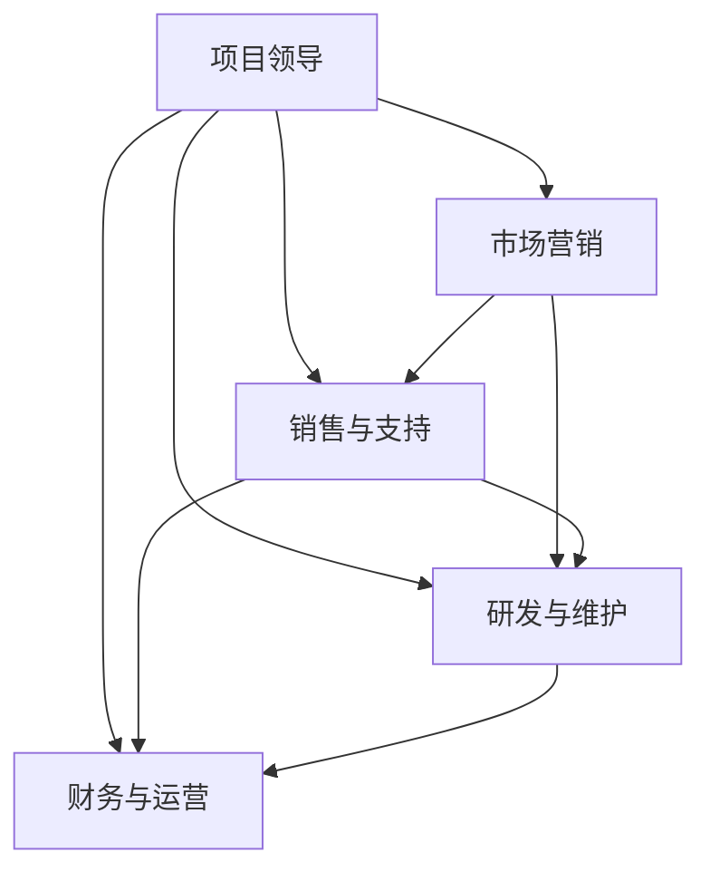

                 

# 开源项目的商业化团队构建：角色与职责

> **关键词**：开源项目、商业化、团队构建、角色与职责、技术领导力

> **摘要**：本文旨在探讨如何构建一个成功的开源项目商业化团队，重点分析团队中各个角色的职责和重要性。通过详细的角色描述和实际案例分析，读者将了解如何发挥每个成员的最大潜力，实现开源项目的商业化目标。

## 1. 背景介绍

开源项目是一种由社区共同维护和发展的软件项目，其源代码开放，任何人都可以自由地查看、修改和分发。开源项目的出现，极大地促进了技术的创新和交流，许多优秀的开源项目已成为行业标准的基石。

然而，仅仅拥有优秀的代码是不够的。随着开源项目的影响力和用户数量的增长，商业化运营成为许多开源项目的必然选择。商业化运营不仅能够为开源项目提供持续的资金支持，还能够推动项目的进一步发展，吸引更多的人才参与其中。

构建一个成功的开源项目商业化团队，是实现商业化目标的关键。团队中的各个角色需要明确自己的职责，协同合作，才能确保项目的顺利推进。

## 2. 核心概念与联系

在构建商业化团队之前，我们需要了解几个核心概念：

### 2.1 商业模式

商业模式是指企业如何创造、传递和获取价值。对于开源项目商业化来说，常见的商业模式包括：

- **赞助和支持**：企业或个人通过赞助或支持的方式，为开源项目提供资金支持。
- **订阅和服务**：用户通过订阅或购买服务的方式，为开源项目支付费用。
- **许可费**：企业或个人在商业项目中使用开源代码时，需要支付许可费用。
- **增值服务**：为开源项目提供额外的增值服务，如培训、技术咨询等。

### 2.2 团队角色

商业化团队中的角色可以分为以下几类：

- **项目领导**：负责整体战略规划和团队管理，确保项目目标实现。
- **市场营销**：负责市场调研、品牌推广和用户增长。
- **销售与支持**：负责销售转化和用户支持，确保用户满意度。
- **研发与维护**：负责代码开发、测试和持续迭代。
- **财务与运营**：负责财务管理、人员管理和日常运营。

### 2.3 Mermaid 流程图

以下是一个简化的 Mermaid 流程图，展示了开源项目商业化团队中各个角色之间的联系：



在这个流程图中，项目领导作为核心角色，与其他角色密切合作，确保项目的成功商业化。

## 3. 核心算法原理 & 具体操作步骤

### 3.1 项目领导

项目领导的角色至关重要，他们需要：

- **制定战略规划**：根据市场需求和项目特点，制定长期和短期的战略规划。
- **团队管理**：组建和管理团队，确保团队成员的专业技能和士气。
- **资源调配**：合理分配资源，确保项目各阶段顺利进行。

### 3.2 市场营销

市场营销团队负责：

- **市场调研**：了解目标用户和市场需求，为产品定位和推广提供依据。
- **品牌推广**：通过多种渠道，提升项目的品牌知名度和影响力。
- **用户增长**：制定用户增长策略，扩大用户基础。

### 3.3 销售与支持

销售与支持团队负责：

- **销售转化**：通过有效的销售策略，将潜在用户转化为实际客户。
- **用户支持**：提供及时、专业的用户支持，提升用户满意度。

### 3.4 研发与维护

研发与维护团队负责：

- **代码开发**：根据市场需求和用户反馈，进行代码开发。
- **测试与迭代**：对代码进行严格测试，确保项目的稳定性和可靠性。

### 3.5 财务与运营

财务与运营团队负责：

- **财务管理**：确保项目资金的合理使用和有效管理。
- **人员管理**：招聘、培训和管理团队成员，确保团队的稳定和高效。
- **日常运营**：处理项目日常运营中的各项事务，确保项目正常运转。

## 4. 数学模型和公式 & 详细讲解 & 举例说明

在开源项目商业化团队构建过程中，一些数学模型和公式可以帮助我们更好地理解和管理团队。以下是一些常用的数学模型：

### 4.1 人力成本模型

人力成本模型用于计算团队成员的总成本。公式如下：

\[ \text{总成本} = \text{人均工资} \times \text{团队成员数} \]

例如，如果人均工资为 10000 元，团队成员数为 10 人，则总成本为：

\[ \text{总成本} = 10000 \times 10 = 100000 \text{元} \]

### 4.2 用户增长模型

用户增长模型用于预测项目的用户增长率。公式如下：

\[ \text{用户增长率} = \frac{\text{新增用户数}}{\text{当前用户数}} \]

例如，如果一个开源项目当前有 1000 名用户，本月新增用户数为 200 名，则用户增长率为：

\[ \text{用户增长率} = \frac{200}{1000} = 0.2 \]

### 4.3 收益模型

收益模型用于计算项目的总收入。公式如下：

\[ \text{总收入} = \text{销售额} + \text{许可费} + \text{增值服务收入} \]

例如，如果一个开源项目的销售额为 50000 元，许可费为 30000 元，增值服务收入为 20000 元，则总收入为：

\[ \text{总收入} = 50000 + 30000 + 20000 = 100000 \text{元} \]

## 5. 项目实战：代码实际案例和详细解释说明

### 5.1 开发环境搭建

在本案例中，我们将使用 Python 编写一个简单的开源项目，并探讨其商业化团队构建的过程。首先，我们需要搭建开发环境。

```bash
# 安装 Python
sudo apt-get install python3

# 安装代码编辑器（如 VSCode）
sudo apt-get install code

# 安装 Git
sudo apt-get install git

# 安装项目依赖（如 Flask）
pip3 install flask
```

### 5.2 源代码详细实现和代码解读

下面是一个简单的 Flask Web 应用程序，用于提供天气预报服务。

```python
# 导入 Flask 模块
from flask import Flask, jsonify, request

# 初始化 Flask 应用程序
app = Flask(__name__)

# 定义天气 API 接口
@app.route('/weather', methods=['GET'])
def get_weather():
    city = request.args.get('city')
    if not city:
        return jsonify({'error': '请提供城市名称'})
    # 这里用示例数据替代实际天气数据
    weather_data = {'city': city, 'temperature': 25, 'condition': '晴'}
    return jsonify(weather_data)

# 运行 Flask 应用程序
if __name__ == '__main__':
    app.run()
```

在这个例子中，我们定义了一个 `/weather` 接口，用于获取指定城市的天气数据。用户可以通过 URL 参数传递城市名称，然后返回相应的天气信息。

### 5.3 代码解读与分析

在这个例子中，我们使用了 Flask 框架来搭建 Web 应用程序。Flask 是一个轻量级的 Web 框架，易于使用且功能强大。以下是代码的详细解读：

- **导入 Flask 模块**：我们首先导入了 Flask 模块，以便后续使用。
- **初始化 Flask 应用程序**：使用 Flask 模块创建了应用程序对象。
- **定义天气 API 接口**：使用 `@app.route('/weather', methods=['GET'])` 装饰器定义了天气接口。当用户访问 `/weather` 接口时，会调用 `get_weather()` 函数。
- **获取城市名称**：在 `get_weather()` 函数中，我们使用 `request.args.get('city')` 获取用户传递的城市名称。
- **返回天气信息**：如果用户提供了城市名称，我们返回一个包含天气信息的 JSON 对象；否则，返回一个错误提示。

这个简单的例子展示了如何使用 Flask 框架搭建 Web 应用程序。在实际项目中，我们可能需要处理更复杂的业务逻辑和数据交互，但基本的原理和方法是相同的。

## 6. 实际应用场景

开源项目的商业化团队构建，在实际应用中具有广泛的应用场景。以下是一些典型的应用场景：

- **企业内部开源项目**：许多企业会开发内部使用的开源项目，这些项目在满足企业内部需求的同时，也可能具有商业潜力。通过商业化运营，企业可以获得额外的收入，进一步推动项目的发展。
- **开源软件公司**：一些专门从事开源软件开发的公司，通过提供定制化服务、许可费和增值服务等方式，实现开源项目的商业化。
- **社区开源项目**：一些开源项目由社区成员共同维护，通过商业化的方式，可以吸引更多的人才参与项目，提高项目的质量和影响力。

## 7. 工具和资源推荐

### 7.1 学习资源推荐

- **书籍**：《开源项目管理》（Open Source Management），《敏捷项目管理实践指南》（Agile Project Management: Creating Innovative Products）。
- **论文**：GitHub 上关于开源项目商业化的研究论文，如《开源软件商业化的模式与策略》。
- **博客**：GitHub、Medium 等平台上的开源项目商业化相关博客。

### 7.2 开发工具框架推荐

- **开发工具**：Visual Studio Code、PyCharm。
- **框架**：Flask、Django、Spring Boot。

### 7.3 相关论文著作推荐

- **论文**：C. P. M. van de Ven, “Open Source Software: What It Is, How to Organize It,” Software Engineering Journal, vol. 9, no. 6, pp. 439–453, Dec. 1994, doi: 10.1002/spr.3980090602.
- **著作**：《开源项目管理：实践指南》（Open Source Management: The Guide to Success），作者：Dennis van der Stelt。

## 8. 总结：未来发展趋势与挑战

随着开源项目的不断发展和商业化需求的日益增长，开源项目商业化团队的建设越来越受到关注。未来，开源项目商业化团队的建设将呈现出以下发展趋势：

- **专业化分工**：团队成员将更加专业化，各自承担特定的职责，提高团队的整体效率。
- **智能化管理**：利用人工智能和大数据技术，实现团队管理和项目进度的智能化监控。
- **多元化收入**：通过多种商业模式，实现项目的多元化收入，提高项目的盈利能力。

同时，开源项目商业化团队也将面临一系列挑战：

- **市场竞争**：随着越来越多的开源项目走向商业化，市场竞争将越来越激烈。
- **项目管理**：如何高效地管理项目进度、资源分配和团队成员，是商业化团队需要克服的难题。
- **用户支持**：如何提供高质量的用户支持，提高用户满意度和忠诚度，是商业化团队需要关注的重点。

## 9. 附录：常见问题与解答

### 9.1 什么是开源项目？

开源项目是指源代码公开的软件项目，任何人都可以自由地查看、修改和分发。

### 9.2 开源项目如何实现商业化？

开源项目可以通过多种方式实现商业化，如赞助和支持、订阅和服务、许可费、增值服务等。

### 9.3 开源项目商业化团队需要哪些角色？

开源项目商业化团队通常需要以下角色：项目领导、市场营销、销售与支持、研发与维护、财务与运营。

## 10. 扩展阅读 & 参考资料

- [GitHub](https://github.com/)
- [Flask](https://flask.palletsprojects.com/)
- [Django](https://www.djangoproject.com/)
- [Spring Boot](https://spring.io/projects/spring-boot)
- [Open Source Management: The Guide to Success](https://www.amazon.com/Open-Source-Management-Success-Practical/dp/098471870X)
- [Agile Project Management: Creating Innovative Products](https://www.amazon.com/Agile-Project-Management-Innovative-Products/dp/0321636884)

