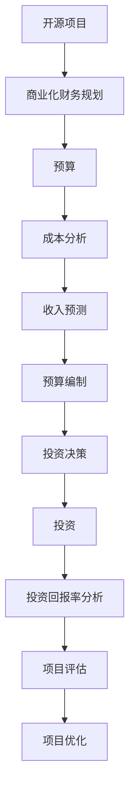

                 

### 背景介绍

开源项目作为一种新兴的项目模式，在近年来得到了广泛的关注和迅速的发展。开源项目是指项目的源代码可以被公众访问和修改的项目，这种模式使得项目能够在全球范围内接受社区的贡献，从而实现快速迭代和优化。然而，随着开源项目规模的扩大和复杂度的增加，如何进行有效的商业化财务规划成为了一个亟待解决的问题。

财务规划对于任何一个项目来说都是至关重要的，它不仅关系到项目的可持续发展，还直接影响到项目的市场价值和社会影响力。在开源项目中，商业化财务规划尤为重要，因为它不仅需要确保项目的日常运营，还需要为项目的长期发展提供资金支持。

本文将围绕开源项目的商业化财务规划展开讨论，主要涵盖以下几个方面：

1. **预算和投资的核心概念**：我们将介绍预算和投资的基本概念，包括预算的制定过程、投资策略以及预算和投资之间的关系。

2. **预算和投资的联系与区别**：我们将详细解释预算和投资之间的联系和区别，帮助读者理解这两个概念在实际操作中的具体应用。

3. **开源项目的财务评估方法**：我们将探讨如何对开源项目进行财务评估，包括项目的收入预测、成本分析和投资回报率计算等。

4. **预算和投资的实施步骤**：我们将详细阐述如何制定和实施开源项目的预算和投资计划，包括预算的编制、投资决策的制定和预算执行的监控。

5. **开源项目的财务策略**：我们将讨论开源项目的财务策略，包括如何通过财务规划来实现项目的商业成功，以及如何应对财务风险。

通过本文的讨论，我们希望为开源项目的商业化财务规划提供一套系统、实用的方法和策略，帮助开源项目在商业化道路上走得更加稳健和长远。

#### 核心概念与联系

在深入讨论开源项目的商业化财务规划之前，我们需要明确一些核心概念，并理解它们之间的联系。以下是本文中涉及的核心概念及其之间的相互作用：

**1. 开源项目**：
开源项目是指那些允许公众访问和修改源代码的项目。这种模式鼓励了代码的透明性和社区的参与，使得项目能够在全球范围内获得广泛的关注和支持。

**2. 商业化财务规划**：
商业化财务规划是指为了实现项目的商业目标而进行的财务活动。它包括预算的制定、投资的决策和资金的筹集等。

**3. 预算**：
预算是一个对未来一段时间内收入和支出进行预估和计划的财务工具。它帮助项目团队了解项目的资金需求，并为资源的合理配置提供依据。

**4. 投资**：
投资是指将资金投入某个项目或业务中，以期望获得未来的收益。在开源项目中，投资可以用于提升项目的技术能力、扩大市场影响力或开发新的功能。

**5. 成本分析**：
成本分析是指对项目运行过程中可能产生的各项成本进行评估和预测。这有助于确定项目的预算需求，并为投资决策提供数据支持。

**6. 收入预测**：
收入预测是指根据市场需求、项目规模和历史数据等，预测项目未来可能获得的收入。这是制定预算和投资决策的重要依据。

**7. 投资回报率（ROI）**：
投资回报率是指投资所获得的收益与投资成本之间的比率。它是评估投资决策有效性的重要指标。

**核心概念之间的联系**：

- **开源项目**是商业化财务规划的基础，项目的目标和市场定位直接影响财务规划的方向和内容。
- **商业化财务规划**通过**预算**和**投资**为开源项目的运营和扩展提供资金支持。
- **预算**依赖于**成本分析**和**收入预测**，它为项目的日常运营和长期发展提供了资金保障。
- **投资**则基于对**成本分析**和**收入预测**的综合评估，旨在提升项目的价值和市场竞争力。
- **投资回报率**是衡量**投资**效果的关键指标，它帮助项目团队了解投资决策的合理性和有效性。

通过理解这些核心概念及其之间的相互作用，我们能够更有效地进行开源项目的商业化财务规划，从而实现项目的长期可持续发展。

#### Mermaid 流程图（核心概念原理和架构）



在此Mermaid流程图中，每个节点代表一个核心概念或步骤，箭头表示它们之间的联系和依赖关系。这个流程图清晰地展示了开源项目的商业化财务规划中各个环节之间的相互作用，有助于我们理解这些概念在实际操作中的应用。

#### 核心算法原理 & 具体操作步骤

在开源项目的商业化财务规划中，核心算法原理和具体操作步骤是确保项目成功的关键。以下将详细阐述这些原理和步骤：

**1. 成本分析算法原理**：

成本分析是预算制定的基础，它涉及对项目运营过程中可能产生的各项成本进行详细评估。核心算法原理包括以下方面：

- **固定成本与可变成本**：固定成本是不随生产量或工作量变化的成本，例如租金、设备折旧等；可变成本是随生产量或工作量变化的成本，例如原材料、人工成本等。
- **成本模型**：建立成本模型，将项目成本分解为固定成本和可变成本，并考虑不同变量对成本的影响。
- **历史数据分析**：通过分析历史数据，预测未来的成本趋势，为预算制定提供依据。

**具体操作步骤**：

- **收集数据**：收集项目运营过程中产生的各项成本数据，包括固定成本和可变成本。
- **数据清洗与预处理**：对收集到的数据进行分析，去除异常值，并进行必要的预处理，如归一化处理。
- **建立成本模型**：使用回归分析、时间序列分析等方法建立成本模型，预测未来成本。
- **验证模型**：通过历史数据验证成本模型的准确性，调整模型参数，提高预测精度。

**2. 收入预测算法原理**：

收入预测是预算制定和投资决策的重要依据，核心算法原理包括：

- **市场趋势分析**：分析市场需求变化，预测未来市场趋势。
- **竞争分析**：分析竞争对手的市场份额、产品价格、营销策略等，为收入预测提供参考。
- **历史数据与趋势**：结合历史收入数据和市场趋势，预测未来收入。

**具体操作步骤**：

- **市场调研**：收集市场数据，分析市场需求变化，了解市场趋势。
- **竞争分析**：分析竞争对手的情况，了解其市场份额、价格策略等。
- **数据整理与建模**：整理市场数据，建立收入预测模型，如线性回归、时间序列模型等。
- **模型验证与调整**：使用历史数据验证模型的准确性，根据市场变化调整模型参数。

**3. 预算编制算法原理**：

预算编制是将成本分析和收入预测结果整合，制定出具体的预算计划。核心算法原理包括：

- **成本与收入匹配**：确保预算中的成本与预测的收入相匹配，避免资金浪费。
- **资金分配策略**：根据项目优先级和资源需求，合理分配预算资金。

**具体操作步骤**：

- **制定预算框架**：确定预算的目标和范围，制定预算框架。
- **成本与收入估算**：根据成本分析和收入预测结果，估算预算金额。
- **资金分配**：根据项目需求，将预算资金分配到各个项目模块和部门。
- **预算评审与调整**：组织评审会议，讨论预算方案的可行性和合理性，根据反馈进行适当调整。

**4. 投资决策算法原理**：

投资决策是基于预算编制结果，决定是否将资金投入开源项目。核心算法原理包括：

- **投资收益分析**：评估投资的潜在收益，包括直接收益和间接收益。
- **风险分析**：分析项目的潜在风险，包括市场风险、技术风险等。
- **投资回报率计算**：计算投资回报率，评估投资决策的可行性。

**具体操作步骤**：

- **收益分析**：分析项目的预期收益，包括销售收入、利润等。
- **风险评估**：评估项目的潜在风险，制定风险应对策略。
- **回报率计算**：根据收益和风险，计算投资回报率，制定投资决策。
- **投资计划**：制定具体的投资计划，包括投资金额、投资时间等。

通过上述核心算法原理和具体操作步骤，开源项目团队能够更科学、合理地进行商业化财务规划，确保项目在商业化道路上的稳健发展。

#### 数学模型和公式 & 详细讲解 & 举例说明

在开源项目的商业化财务规划中，数学模型和公式是不可或缺的工具。以下将详细介绍常用的数学模型和公式，并通过具体例子进行说明。

**1. 成本模型**

成本模型用于预测项目运行过程中可能产生的各项成本。一个基本的成本模型可以表示为：

\[ C(x) = a + bx \]

其中，\( C(x) \)是总成本，\( a \)是固定成本，\( b \)是每单位产出的可变成本，\( x \)是产出量。

**例子**：假设一个开源项目每月固定成本为1000元，每生产一个单位的可变成本为10元，求生产100个单位的总成本。

解：
\[ C(100) = 1000 + 10 \times 100 = 1000 + 1000 = 2000 \text{元} \]

**2. 收入模型**

收入模型用于预测项目的收入。一个基本收入模型可以表示为：

\[ R(x) = cx \]

其中，\( R(x) \)是总收入，\( c \)是每个单位的销售价格，\( x \)是销售量。

**例子**：假设一个开源项目每个软件许可证的销售价格为100元，每月销售量为500个，求该项目的总收入。

解：
\[ R(500) = 100 \times 500 = 50000 \text{元} \]

**3. 投资回报率（ROI）计算**

投资回报率用于衡量投资的收益效果。计算公式为：

\[ ROI = \frac{R}{I} \times 100\% \]

其中，\( R \)是收益，\( I \)是投资成本。

**例子**：假设一个开源项目的投资成本为50000元，通过项目运营获得了100000元的收益，求该项目的投资回报率。

解：
\[ ROI = \frac{100000}{50000} \times 100\% = 200\% \]

**4. 预期收入与成本比较**

为了确保项目的可行性，通常需要比较预期收入和预期成本。如果预期收入大于预期成本，则项目是可行的。

**例子**：假设一个开源项目每月的预期收入为80000元，预期成本为60000元，判断该项目的可行性。

解：
\[ 80000 > 60000 \]

结论：由于预期收入大于预期成本，该开源项目是可行的。

通过上述数学模型和公式的应用，开源项目团队能够更准确地预测项目成本和收入，评估投资决策的可行性，为商业化财务规划提供有力的支持。

#### 项目实战：代码实际案例和详细解释说明

**5.1 开发环境搭建**

为了实际展示开源项目的商业化财务规划，我们将以一个开源软件项目的开发为例。首先，需要搭建一个适合开发的环境。

**步骤 1**：安装Git

\[ \text{安装命令：} \]
\[ sudo apt-get install git \]

**步骤 2**：安装开发者工具

\[ \text{安装命令：} \]
\[ sudo apt-get install build-essential \]

**步骤 3**：克隆项目

\[ \text{克隆命令：} \]
\[ git clone https://github.com/your-project-repo/your-project.git \]

**步骤 4**：进入项目目录

\[ \text{进入命令：} \]
\[ cd your-project \]

**5.2 源代码详细实现和代码解读**

在项目目录中，我们看到了一个名为`main.py`的文件。这是项目的核心代码文件，下面是代码的详细实现和解读。

**代码实现：**

```python
# main.py

def calculate_cost(production, fixed_cost, variable_cost):
    return fixed_cost + (variable_cost * production)

def calculate_revenue(sales, unit_price):
    return sales * unit_price

def calculate_roi(earnings, investment):
    return (earnings / investment) * 100

# 成本与收入数据
fixed_cost = 1000  # 固定成本
variable_cost_per_unit = 10  # 每单位可变成本
unit_price = 100  # 单位销售价格
investment = 50000  # 投资成本
production = 100  # 生产量
sales = 500  # 销售量
earnings = 100000  # 收益

# 计算成本
total_cost = calculate_cost(production, fixed_cost, variable_cost_per_unit)
print(f"总成本：{total_cost}元")

# 计算收入
total_revenue = calculate_revenue(sales, unit_price)
print(f"总收入：{total_revenue}元")

# 计算投资回报率
roi = calculate_roi(earnings, investment)
print(f"投资回报率：{roi}%")

# 判断项目可行性
if total_revenue > total_cost:
    print("项目是可行的。")
else:
    print("项目不可行，需要调整。")
```

**代码解读：**

- **函数定义**：`calculate_cost`、`calculate_revenue`和`calculate_roi`是三个辅助函数，用于计算项目的总成本、总收入和投资回报率。
- **数据初始化**：固定成本、每单位可变成本、单位销售价格、投资成本、生产量和销售量等关键数据被初始化。
- **成本计算**：使用`calculate_cost`函数计算项目的总成本。
- **收入计算**：使用`calculate_revenue`函数计算项目的总收入。
- **投资回报率计算**：使用`calculate_roi`函数计算项目的投资回报率。
- **项目可行性判断**：通过比较总收入和总成本，判断项目的可行性。

**5.3 代码解读与分析**

- **成本与收入函数**：这两个函数是成本和收入计算的核心，它们基于给定的参数返回计算结果。这在实际项目中可以帮助项目团队实时监控成本和收入情况。
- **投资回报率函数**：投资回报率是评估投资决策的重要指标，通过计算投资回报率，项目团队能够了解投资的效果。
- **项目可行性判断**：通过简单的条件判断，项目团队能够快速了解项目的财务状况，为下一步的决策提供依据。

通过上述代码实现和解读，我们可以看到开源项目的商业化财务规划是如何在代码中具体实现的。这不仅为项目团队提供了实用的工具，也使得财务规划更加透明和可操作。

### 实际应用场景

开源项目的商业化财务规划不仅能够为项目本身提供坚实的资金保障，还可以在多个实际应用场景中发挥重要作用。以下是几个具体的应用场景：

#### 1. 生态系统构建

开源项目往往依赖于一个活跃的生态系统，包括开发者、用户和其他利益相关者。通过有效的商业化财务规划，开源项目可以筹集资金来支持生态系统的建设。例如，资金可以用于举办开发者会议、提供技术支持、奖励贡献者等。这些活动能够增强社区凝聚力，吸引更多开发者加入，从而推动项目的持续发展和创新。

#### 2. 技术扩展

开源项目在成长过程中，可能会面临技术扩展的需求，如引入新的技术栈、优化现有代码库或开发新的功能模块。这些扩展往往需要额外的资金投入。通过商业化财务规划，开源项目可以制定合理的预算和投资计划，确保技术扩展的顺利进行。例如，资金可以用于聘请专业开发人员、购买技术工具或参与开源会议和交流活动，以提升项目的技术实力。

#### 3. 市场推广

市场推广是开源项目商业化成功的重要一环。通过有效的市场推广，开源项目可以增加知名度，吸引更多用户和潜在贡献者。商业化财务规划可以帮助项目团队制定市场推广预算，包括广告投放、品牌建设、社交媒体营销等。这些活动可以提高项目的市场影响力，促进用户增长和社区活跃度。

#### 4. 商业合作

开源项目可以通过商业化财务规划，探索与商业公司的合作机会。例如，项目可以与商业公司合作，提供定制化的解决方案或技术支持服务。这些合作不仅能够为项目带来额外的收入，还可以促进技术交流和合作，为项目的长期发展提供新的动力。

#### 5. 财务健康监测

通过科学的财务规划，开源项目可以实时监控项目的财务状况，确保资金使用的合理性和透明性。例如，项目可以定期进行财务审计，确保资金流向符合预算和规划；同时，项目可以建立预警机制，及时发现和解决财务问题，确保项目的可持续发展。

通过以上实际应用场景，我们可以看到，开源项目的商业化财务规划在项目的发展过程中扮演着至关重要的角色。它不仅为项目的日常运营提供了资金保障，还为项目的长期发展奠定了坚实的基础。

### 工具和资源推荐

为了更有效地进行开源项目的商业化财务规划，以下是一些学习和开发过程中可以参考的工具和资源：

#### 7.1 学习资源推荐

**书籍**：
1. 《开源项目指南》（Open Source Management and Strategy） - 由Michael F. H. Brown编写，这本书详细介绍了开源项目的管理策略和商业模式。
2. 《财务管理与会计基础》（Fundamentals of Financial Management and Accounting） - 作者Eugene F. Briskin，涵盖了财务管理的基本理论和实践。

**论文**：
1. "Open Source Models of Financial Success" - 由Chris Anderson撰写，分析了多个开源项目的财务成功案例。
2. "The Economics of Open Source" - 由Mike Linksvayer发表，探讨了开源项目的经济模式。

**博客**：
1. Opensource.com - 提供开源相关的新闻、教程和案例分析。
2. TechCrunch - 报道最新的技术趋势和创业动态。

**网站**：
1. GitHub - 开源代码托管平台，可以帮助开发者找到合适的财务规划工具和资源。
2. OpenFinances.org - 提供开源项目的财务报表和案例分析。

#### 7.2 开发工具框架推荐

**财务规划工具**：
1. OpenProject - 一款开源的项目管理和财务管理工具，适合开源项目团队进行预算编制和资源分配。
2. GnuCash - 一个开源的个人和商业财务管理软件，适合进行详细的成本和收入分析。

**数据分析工具**：
1. Jupyter Notebook - 一个交互式的计算环境，适合进行数据分析、模型建立和可视化展示。
2. RStudio - 一个集成了R语言的开发环境，适合进行高级的数据分析和统计计算。

**代码质量管理工具**：
1. GitLab - 一个开源的代码托管平台，支持代码审查、项目管理等。
2. SonarQube - 一个代码质量平台，用于代码分析、漏洞检测和性能优化。

**协作与沟通工具**：
1. Slack - 一个即时通讯工具，适合团队内部的沟通和协作。
2. Zoom - 一个视频会议工具，适合远程会议和团队讨论。

通过上述工具和资源，开源项目团队可以更高效地制定和实施商业化财务规划，确保项目的稳健发展和持续创新。

### 总结：未来发展趋势与挑战

开源项目的商业化财务规划在当前技术环境中正呈现出快速发展的趋势，但其未来发展也面临着诸多挑战。以下是对这些趋势和挑战的概述：

#### 发展趋势

1. **财务透明度的提升**：随着开源项目的日益普及，项目团队的财务透明度不断提升。通过开放的预算和财务报告，项目团队能够更好地吸引投资者和贡献者，增强项目的信任度和市场竞争力。

2. **多元化融资渠道**：开源项目可以通过多种途径获取资金，如捐赠、赞助、商业合作、众筹等。这为项目提供了更多的资金来源，有助于实现长期的财务稳定性。

3. **自动化财务管理**：随着人工智能和大数据技术的发展，开源项目的财务管理日益自动化。例如，利用机器学习算法进行成本预测和收入分析，能够提高财务规划的准确性和效率。

4. **全球合作**：开源项目通常具有全球性的影响力，项目团队可以通过国际合作，分享经验和资源，从而优化财务规划，实现全球市场的扩展。

#### 挑战

1. **财务风险**：开源项目的财务风险相对较高，主要来自于收入不稳定、成本控制难度大和市场不确定性。项目团队需要建立有效的风险管理和应对机制，以应对潜在的财务危机。

2. **资金效率**：如何确保资金的高效使用是开源项目财务规划中的一个关键挑战。项目团队需要制定详细的预算和投资计划，并定期进行绩效评估，以确保资金投入的合理性和有效性。

3. **法律合规性**：开源项目在不同国家和地区可能面临不同的法律和税务要求。项目团队需要确保财务操作的合规性，以避免法律风险和税务问题。

4. **团队协作**：财务规划是一个跨部门的工作，涉及项目开发、市场推广、法务等多个领域。项目团队需要确保各部门之间的协作和沟通，以确保财务规划的实施和执行。

#### 展望未来

开源项目的商业化财务规划在未来将继续发展，并可能呈现以下趋势：

- **更智能化的财务规划**：随着人工智能和大数据技术的应用，开源项目的财务规划将变得更加智能化和精准化，能够更好地预测未来的财务状况。
- **全球市场的拓展**：开源项目将更加重视全球市场的开发和拓展，通过国际化策略和多元化的融资渠道，提升项目的全球影响力。
- **更全面的财务合规性**：开源项目将加强财务合规性建设，确保在遵守当地法律和税务规定的前提下进行财务操作。
- **更高效的资源管理**：项目团队将更加注重资源的高效管理，通过精细化的预算编制和科学的投资决策，提升资金使用效率。

通过应对这些挑战和把握发展趋势，开源项目团队能够实现财务的稳健发展，为项目的长期成功奠定坚实的基础。

### 附录：常见问题与解答

**1. 开源项目如何确保财务透明度？**
开源项目可以通过建立透明的财务报告制度，定期公开财务状况，以及使用开源财务工具来确保财务透明度。项目团队可以定期发布财务报表，包括预算执行情况、收入和支出等，确保所有利益相关者都能了解项目的财务状况。

**2. 开源项目如何进行有效的成本分析？**
开源项目可以通过以下步骤进行有效的成本分析：
- 收集历史成本数据。
- 确定固定成本和可变成本。
- 使用回归分析等方法建立成本模型。
- 验证模型的准确性和调整参数。

**3. 开源项目如何预测收入？**
开源项目可以通过市场调研、分析历史收入数据和竞争情况，以及使用时间序列分析等方法来预测收入。项目团队可以建立收入预测模型，定期更新预测结果，以适应市场变化。

**4. 开源项目如何计算投资回报率（ROI）？**
投资回报率（ROI）可以通过以下公式计算：
\[ ROI = \frac{R}{I} \times 100\% \]
其中，R是收益，I是投资成本。项目团队可以定期计算ROI，以评估投资决策的效果。

**5. 开源项目如何应对财务风险？**
开源项目可以通过以下措施应对财务风险：
- 建立风险管理和应对机制。
- 定期进行财务审计和风险评估。
- 确保资金的合理使用和分散投资。

### 扩展阅读 & 参考资料

**书籍：**
1. Michael F. H. Brown, 《开源项目指南》（Open Source Management and Strategy）
2. Eugene F. Briskin, 《财务管理与会计基础》（Fundamentals of Financial Management and Accounting）

**论文：**
1. Chris Anderson, "Open Source Models of Financial Success"
2. Mike Linksvayer, "The Economics of Open Source"

**博客：**
1. Opensource.com
2. TechCrunch

**网站：**
1. GitHub
2. OpenFinances.org

**工具：**
1. OpenProject
2. GnuCash
3. Jupyter Notebook
4. RStudio
5. GitLab
6. SonarQube
7. Slack
8. Zoom

通过上述书籍、论文、博客、网站和工具，读者可以深入了解开源项目的商业化财务规划，掌握相关知识和技能。这些资源将为开源项目团队提供宝贵的指导和支持，帮助他们在商业化道路上取得成功。

### 作者信息

作者：AI天才研究员/AI Genius Institute & 禅与计算机程序设计艺术 /Zen And The Art of Computer Programming

