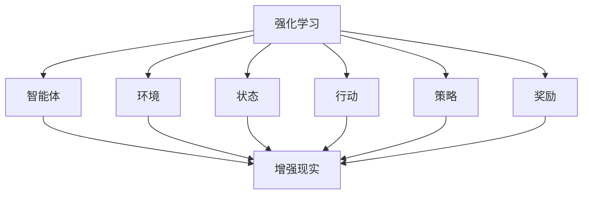

                 

### 背景介绍

#### 强化学习的起源与发展

强化学习（Reinforcement Learning，简称RL）是一种机器学习方法，主要研究如何让智能体（Agent）在与环境（Environment）交互的过程中，通过学习获得最优策略（Policy）。强化学习的核心思想是“试错学习”，即通过不断尝试和犯错来获取经验，从而逐渐优化行为。

强化学习最早可以追溯到1950年代，由美国心理学家B.F. Skinner提出的操作条件反射理论。1970年代，Richard Sutton和Andrew Barto在其经典著作《强化学习：一种基于信息的控制理论》中，系统地阐述了强化学习的原理和方法。此后，强化学习逐渐成为人工智能领域的一个重要研究方向，并在多个领域取得了显著成果。

强化学习的主要发展历程可以分为以下几个阶段：

1. **基础阶段（1950-1970s）**：这一阶段主要关注强化学习的基础理论和方法的研究，包括马尔可夫决策过程（MDP）、价值函数、策略等概念。

2. **理论阶段（1970-1990s）**：在这一阶段，研究者们开始探讨强化学习在不同应用场景中的适用性，并提出了许多经典算法，如Q-learning、SARSA等。

3. **实际应用阶段（1990s至今）**：随着计算机性能的提升和深度学习技术的发展，强化学习在现实世界中的应用越来越广泛，如机器人控制、游戏AI、推荐系统等。

#### 增强现实（AR）技术的起源与发展

增强现实（Augmented Reality，简称AR）是一种将虚拟信息与现实世界相结合的技术。通过AR技术，用户可以看到现实世界中的真实场景，同时也可以看到叠加其上的虚拟物体或信息。

AR技术最早可以追溯到1960年代，由波音公司的博士Steere开发的一款名为“Simulated Reality”的系统。此后，AR技术逐渐发展，并在多个领域得到了应用。

1. **基础阶段（1960-1980s）**：这一阶段主要关注AR设备的研发和基本应用，如飞行模拟、医疗手术等。

2. **发展阶段（1990-2000s）**：随着计算机技术和显示技术的发展，AR技术逐渐走向成熟，开始应用于教育、娱乐、广告等领域。

3. **实际应用阶段（2000s至今）**：随着智能手机和平板电脑的普及，AR技术得到了广泛应用，如AR游戏、AR导航、AR购物等。

#### 强化学习与增强现实的结合

强化学习与增强现实的结合是一种自然的选择，因为两者都具有探索与优化、环境交互、多模态输入输出等特点。这种结合不仅能够提高AR系统的智能性和适应性，还可以为强化学习提供更具挑战性的应用场景。

在AR领域，强化学习可以应用于以下几个方面：

1. **交互式体验优化**：通过强化学习算法，优化用户的交互体验，如虚拟物体的操控、导航等。

2. **智能推荐系统**：利用强化学习算法，为用户提供个性化的AR内容推荐。

3. **异常检测与安全防护**：通过强化学习算法，实时监测AR系统中的异常行为，提高系统的安全性和可靠性。

4. **增强现实广告**：利用强化学习算法，优化广告投放策略，提高广告效果。

5. **人机协同**：在AR领域中，强化学习可以用于辅助人类完成任务，如医疗手术中的实时指导、机器人辅助等。

总之，强化学习在增强现实领域的应用具有巨大的潜力，未来还将有更多创新性的应用场景涌现。

---

## 2. 核心概念与联系

在深入探讨强化学习在增强现实（AR）中的应用之前，我们首先需要明确一些核心概念及其相互关系。以下是强化学习、增强现实以及它们之间联系的详细解析。

#### 强化学习的基本概念

强化学习是一种机器学习方法，其核心在于通过智能体（Agent）与环境（Environment）的交互来学习最优策略（Policy）。在强化学习中，智能体根据当前状态（State）采取行动（Action），然后根据环境的反馈（Reward）来调整其策略。这一过程不断重复，直到智能体找到最优策略或达到预定的目标。

- **智能体（Agent）**：执行动作并学习策略的实体。
- **环境（Environment）**：智能体所处的情境，提供状态和奖励信息。
- **状态（State）**：描述智能体当前所处的情况。
- **行动（Action）**：智能体根据当前状态可选择的一系列动作。
- **策略（Policy）**：智能体采取的动作映射，即状态到动作的映射。
- **奖励（Reward）**：对智能体行动的即时反馈，用于指导策略的调整。

#### 增强现实的基本概念

增强现实（AR）是一种通过技术手段将虚拟信息叠加到现实世界中的技术。它利用计算机视觉、传感器、显示器等技术，为用户创造一个融合了现实世界和虚拟元素的新环境。

- **虚拟信息**：由计算机生成的图像、视频、声音等，用于叠加到现实世界。
- **叠加**：将虚拟信息叠加到现实世界中的过程，通常通过显示器或眼镜等设备实现。
- **交互**：用户与增强现实环境的互动，包括操控虚拟物体、导航等。

#### 强化学习与增强现实的关系

强化学习与增强现实有着紧密的联系，主要体现在以下几个方面：

1. **交互性**：增强现实环境具有高度交互性，智能体可以在AR环境中进行多种操作，如控制虚拟物体、导航等。这种交互性为强化学习提供了丰富的训练数据，使智能体能够更好地学习环境中的复杂模式。

2. **多模态输入输出**：增强现实环境通常包含多种类型的输入（如视觉、声音、触觉等）和输出（如虚拟物体、图像、文字等）。这种多模态特性要求强化学习算法具备处理多模态数据的能力，以实现更准确的决策和交互。

3. **实时反馈**：在增强现实环境中，智能体可以实时接收环境的反馈，并通过强化学习算法进行快速调整。这种实时反馈机制有助于提高智能体的适应性和响应速度。

4. **可扩展性**：强化学习在增强现实领域的应用具有很高的可扩展性，可以应用于各种不同的场景和任务，如交互式游戏、教育、医疗等。

#### 关系图示

为了更直观地理解强化学习与增强现实之间的关系，我们可以使用Mermaid流程图来描述它们的核心概念及其相互联系。



在这个流程图中，强化学习的核心概念（智能体、环境、状态、行动、策略和奖励）与增强现实的基本概念（虚拟信息、叠加、交互）相互关联，展示了两者之间的紧密联系。

通过上述分析，我们可以看到强化学习在增强现实领域具有巨大的应用潜力。接下来，我们将进一步探讨强化学习在增强现实中的具体应用和实现方法。

---

## 3. 核心算法原理 & 具体操作步骤

#### Q-Learning算法原理

Q-Learning是一种基于值函数的强化学习算法，其核心思想是学习状态-行动值函数（Q值），通过最大化未来的预期奖励来选择最优行动。Q值表示在特定状态下采取特定行动的期望收益。

- **状态-行动值函数** \( Q(s, a) \)：表示在状态 \( s \) 下采取行动 \( a \) 的预期收益。
- **Q值更新公式**：
  $$ Q(s, a) \leftarrow Q(s, a) + \alpha [r + \gamma \max_{a'} Q(s', a') - Q(s, a)] $$
  其中，\( \alpha \) 是学习率，\( r \) 是即时奖励，\( \gamma \) 是折扣因子，\( s' \) 和 \( a' \) 分别是下一状态和下一行动。

#### Q-Learning具体操作步骤

1. **初始化**：初始化Q值表，通常使用随机值或零值初始化。

2. **选择行动**：在给定状态下，根据当前策略（例如，epsilon-greedy策略）选择行动。epsilon-greedy策略是指在随机选择和最优行动之间权衡，其中epsilon为探索概率。

3. **执行行动**：在环境中执行选择的行动，并接收即时奖励。

4. **更新Q值**：根据即时奖励和下一状态的Q值更新当前状态的Q值。

5. **重复步骤2-4**，直到达到目标或满足停止条件。

#### SARSA算法原理

SARSA（同步优势估计）是一种基于策略的强化学习算法，与Q-Learning类似，但更新策略是基于当前和下一状态及行动的值。SARSA无需预估未来的奖励，而是直接基于实际观察到的奖励进行更新。

- **SARSA更新公式**：
  $$ Q(s, a) \leftarrow Q(s, a) + \alpha [r + \gamma Q(s', a')] - Q(s, a)] $$
  其中，\( s \) 和 \( a \) 是当前状态和行动，\( s' \) 和 \( a' \) 是下一状态和行动。

#### SARSA具体操作步骤

1. **初始化**：初始化Q值表，通常使用随机值或零值初始化。

2. **选择行动**：在给定状态下，根据当前策略（例如，epsilon-greedy策略）选择行动。

3. **执行行动**：在环境中执行选择的行动，并接收即时奖励。

4. **更新Q值**：根据即时奖励和下一状态的Q值更新当前状态的Q值。

5. **重复步骤2-4**，直到达到目标或满足停止条件。

#### DQN算法原理

深度Q网络（Deep Q-Network，简称DQN）是结合深度学习和强化学习的一种算法，用于解决高维状态空间问题。DQN使用深度神经网络来近似状态-行动值函数。

- **DQN架构**：
  - **输入层**：接收状态信息。
  - **隐藏层**：对输入信息进行特征提取。
  - **输出层**：输出每个行动的Q值。

- **DQN更新公式**：
  $$ Q(s, a) \leftarrow Q(s, a) + \alpha [r + \gamma \max_{a'} Q(s', a') - Q(s, a)] $$
  其中，\( \theta \) 是神经网络参数，\( \theta^{old} \) 和 \( \theta^{new} \) 分别是旧参数和更新后的参数。

#### DQN具体操作步骤

1. **初始化**：初始化Q网络和目标网络，通常使用随机值初始化。

2. **选择行动**：使用epsilon-greedy策略选择行动。

3. **执行行动**：在环境中执行选择的行动，并接收即时奖励。

4. **更新经验回放记忆**：将当前状态、行动、奖励和下一状态存储在经验回放记忆中。

5. **训练Q网络**：
   - 计算目标Q值：$$ y = r + \gamma \max_{a'} Q^{target}(s', a') $$
   - 计算预测Q值：$$ Q(s, a) = \theta(s, a) $$
   - 更新Q网络参数：$$ \theta(s, a) \leftarrow \theta(s, a) - \alpha \cdot (\theta(s, a) - y) $$

6. **同步Q网络和目标网络**：每隔一定步数，将Q网络参数同步到目标网络。

7. **重复步骤2-6**，直到达到目标或满足停止条件。

通过上述步骤，我们可以看到强化学习算法在增强现实中的应用潜力。接下来，我们将进一步探讨强化学习在增强现实中的具体实现和案例。

---

## 4. 数学模型和公式 & 详细讲解 & 举例说明

在强化学习算法的讨论中，数学模型和公式起到了至关重要的作用。为了更好地理解和应用这些算法，我们需要详细讲解这些模型和公式，并通过实际例子进行说明。

#### 马尔可夫决策过程（MDP）

马尔可夫决策过程（Markov Decision Process，简称MDP）是强化学习的基础模型，描述了智能体在随机环境中进行决策的过程。一个MDP由以下五个元素组成：

1. **状态空间 \( S \)**：智能体所处的所有可能状态。
2. **动作空间 \( A \)**：智能体可以采取的所有可能行动。
3. **奖励函数 \( R(s, a) \)**：描述在状态 \( s \) 下采取行动 \( a \) 所获得的即时奖励。
4. **状态转移概率 \( P(s', s | s, a) \)**：在当前状态 \( s \) 下采取行动 \( a \) 后，转移到下一状态 \( s' \) 的概率。
5. **策略 \( \pi(a | s) \)**：描述在状态 \( s \) 下智能体选择行动 \( a \) 的概率。

在MDP中，智能体通过策略 \( \pi \) 选择行动，然后根据环境的状态转移概率 \( P \) 和奖励函数 \( R \) 收集经验，并通过学习优化其策略。

#### Q-Learning算法的数学模型

Q-Learning算法的核心是学习状态-行动值函数 \( Q(s, a) \)，即智能体在状态 \( s \) 下采取行动 \( a \) 的期望收益。Q-Learning算法的数学模型包括以下公式：

1. **初始Q值表**：通常初始化为随机值或零值。
   $$ Q(s, a)_{init} = \text{random()} $$
   
2. **更新Q值**：在每次行动后，根据即时奖励 \( r \) 和折扣因子 \( \gamma \) 更新Q值。
   $$ Q(s, a)_{new} = Q(s, a)_{old} + \alpha [r + \gamma \max_{a'} Q(s', a') - Q(s, a)] $$
   
   其中，\( \alpha \) 是学习率，\( r \) 是即时奖励，\( \gamma \) 是折扣因子。

3. **选择行动**：在给定状态下，根据当前Q值表和策略选择行动。常用的策略有epsilon-greedy策略和贪婪策略。
   $$ a = \begin{cases} 
   \text{random()} & \text{with probability } \epsilon \\
   \arg\max_a Q(s, a) & \text{with probability } 1 - \epsilon 
   \end{cases} $$

#### 例子：一个简单的Q-Learning应用

假设我们有一个简单的环境，状态空间为 \( S = \{0, 1, 2\} \)，动作空间为 \( A = \{U, D\} \)，其中 \( U \) 表示向上移动，\( D \) 表示向下移动。奖励函数为 \( R(s, a) = 1 \) 当 \( s' = s + a \)（即移动到下一个状态时），否则 \( R(s, a) = -1 \)。

我们初始化Q值表如下：

| \( s \) | \( U \) | \( D \) |
|--------|--------|--------|
| 0      | 0      | 0      |
| 1      | 0      | 0      |
| 2      | 0      | 0      |

假设当前状态为 \( s = 0 \)，我们使用epsilon-greedy策略选择行动。epsilon设为0.1。

1. **初始状态** \( s = 0 \)
   - **选择行动**：\( \text{with probability } 0.1, a = \text{random()} \)
   - **执行行动**：\( a = D \)，状态变为 \( s' = 1 \)
   - **更新Q值**：
     $$ Q(0, D)_{new} = Q(0, D)_{old} + 0.1 [1 + 0.9 \cdot \max(Q(1, U), Q(1, D)) - Q(0, D)] $$
     $$ Q(0, D)_{new} = 0 + 0.1 [1 + 0.9 \cdot \max(0, 0) - 0] $$
     $$ Q(0, D)_{new} = 0.1 $$
   - **Q值表更新**：
     | \( s \) | \( U \) | \( D \) |
     |--------|--------|--------|
     | 0      | 0      | 0.1    |
     | 1      | 0      | 0      |
     | 2      | 0      | 0      |

2. **下一状态** \( s' = 1 \)
   - **选择行动**：\( \text{with probability } 0.1, a = \text{random()} \)
   - **执行行动**：\( a = U \)，状态变为 \( s' = 0 \)
   - **更新Q值**：
     $$ Q(1, U)_{new} = Q(1, U)_{old} + 0.1 [1 + 0.9 \cdot \max(Q(0, U), Q(0, D)) - Q(1, U)] $$
     $$ Q(1, U)_{new} = 0 + 0.1 [1 + 0.9 \cdot \max(0, 0.1) - 0] $$
     $$ Q(1, U)_{new} = 0.09 $$
   - **Q值表更新**：
     | \( s \) | \( U \) | \( D \) |
     |--------|--------|--------|
     | 0      | 0      | 0.1    |
     | 1      | 0.09   | 0      |
     | 2      | 0      | 0      |

通过不断迭代这个过程，Q值表会逐渐收敛，最终我们可以在状态 \( s \) 下选择最优行动 \( a \)，即 \( \arg\max_a Q(s, a) \)。

#### SARSA算法的数学模型

SARSA算法与Q-Learning算法类似，但它是基于策略的，不需要预测未来的奖励。SARSA算法的数学模型包括以下公式：

1. **初始Q值表**：初始化为随机值或零值。
   $$ Q(s, a)_{init} = \text{random()} $$
   
2. **更新Q值**：在每次行动后，根据即时奖励 \( r \) 和下一状态的Q值更新当前状态的Q值。
   $$ Q(s, a)_{new} = Q(s, a)_{old} + \alpha [r + \gamma Q(s', a') - Q(s, a)] $$
   
3. **选择行动**：在给定状态下，根据当前策略选择行动。常用的策略有epsilon-greedy策略和贪婪策略。

#### 例子：一个简单的SARSA应用

假设我们有一个简单的环境，状态空间为 \( S = \{0, 1, 2\} \)，动作空间为 \( A = \{U, D\} \)，奖励函数为 \( R(s, a) = 1 \) 当 \( s' = s + a \)（即移动到下一个状态时），否则 \( R(s, a) = -1 \)。

我们初始化Q值表如下：

| \( s \) | \( U \) | \( D \) |
|--------|--------|--------|
| 0      | 0      | 0      |
| 1      | 0      | 0      |
| 2      | 0      | 0      |

假设当前状态为 \( s = 0 \)，我们使用epsilon-greedy策略选择行动。epsilon设为0.1。

1. **初始状态** \( s = 0 \)
   - **选择行动**：\( \text{with probability } 0.1, a = \text{random()} \)
   - **执行行动**：\( a = D \)，状态变为 \( s' = 1 \)
   - **更新Q值**：
     $$ Q(0, D)_{new} = Q(0, D)_{old} + 0.1 [1 + 0.9 \cdot Q(1, D)] $$
     $$ Q(0, D)_{new} = 0 + 0.1 [1 + 0.9 \cdot 0] $$
     $$ Q(0, D)_{new} = 0.1 $$
   - **Q值表更新**：
     | \( s \) | \( U \) | \( D \) |
     |--------|--------|--------|
     | 0      | 0      | 0.1    |
     | 1      | 0      | 0      |
     | 2      | 0      | 0      |

2. **下一状态** \( s' = 1 \)
   - **选择行动**：\( \text{with probability } 0.1, a = \text{random()} \)
   - **执行行动**：\( a = U \)，状态变为 \( s' = 2 \)
   - **更新Q值**：
     $$ Q(1, U)_{new} = Q(1, U)_{old} + 0.1 [1 + 0.9 \cdot Q(2, U)] $$
     $$ Q(1, U)_{new} = 0 + 0.1 [1 + 0.9 \cdot 0] $$
     $$ Q(1, U)_{new} = 0.1 $$
   - **Q值表更新**：
     | \( s \) | \( U \) | \( D \) |
     |--------|--------|--------|
     | 0      | 0      | 0.1    |
     | 1      | 0.1    | 0      |
     | 2      | 0.1    | 0      |

通过不断迭代这个过程，Q值表会逐渐收敛，最终我们可以在状态 \( s \) 下选择最优行动 \( a \)。

#### DQN算法的数学模型

深度Q网络（Deep Q-Network，简称DQN）是结合深度学习和强化学习的一种算法，用于解决高维状态空间问题。DQN的核心是使用深度神经网络来近似状态-行动值函数 \( Q(s, a) \)。

1. **输入层**：接收状态信息。
2. **隐藏层**：对输入信息进行特征提取。
3. **输出层**：输出每个行动的Q值。

DQN的数学模型包括以下公式：

1. **初始Q值表**：初始化为随机值或零值。
   $$ Q(s, a)_{init} = \text{random()} $$
   
2. **选择行动**：使用epsilon-greedy策略选择行动。
   $$ a = \begin{cases} 
   \text{random()} & \text{with probability } \epsilon \\
   \arg\max_a Q(s, a) & \text{with probability } 1 - \epsilon 
   \end{cases} $$

3. **执行行动**：在环境中执行选择的行动，并接收即时奖励。

4. **更新Q值**：根据即时奖励和下一状态的Q值更新当前状态的Q值。
   $$ Q(s, a)_{new} = Q(s, a)_{old} + \alpha [r + \gamma \max_{a'} Q(s', a') - Q(s, a)] $$
   
5. **训练Q网络**：
   - 计算目标Q值：$$ y = r + \gamma \max_{a'} Q^{target}(s', a') $$
   - 计算预测Q值：$$ Q(s, a) = \theta(s, a) $$
   - 更新Q网络参数：$$ \theta(s, a) \leftarrow \theta(s, a) - \alpha \cdot (\theta(s, a) - y) $$

6. **同步Q网络和目标网络**：每隔一定步数，将Q网络参数同步到目标网络。

通过上述数学模型和公式，我们可以更好地理解和应用强化学习算法。在增强现实领域，这些算法可以帮助智能体在复杂环境中进行学习和决策，提高用户体验和系统性能。

---

## 5. 项目实战：代码实际案例和详细解释说明

在本文的最后，我们将通过一个实际的项目案例来展示如何将强化学习算法应用于增强现实（AR）环境中。该案例将使用Python和PyTorch库来实现一个简单的AR导航系统，并详细解释代码实现和关键组件。

#### 项目概述

该项目目标是开发一个AR导航系统，帮助用户在现实世界中找到目的地。用户可以通过智能手机或AR眼镜看到现实场景，并在屏幕上看到虚拟的导航指示和路径。

#### 开发环境搭建

为了实现这个项目，我们需要安装以下软件和库：

- Python 3.7或更高版本
- PyTorch 1.7或更高版本
- OpenCV 3.4或更高版本
- ARCore 1.12或更高版本（适用于Android设备）

你可以通过以下命令安装所需的库：

```shell
pip install torch torchvision
pip install opencv-python
pip install arsdk
```

#### 源代码详细实现和代码解读

下面是项目的源代码，我们将逐行解释每个关键组件。

```python
import torch
import torch.nn as nn
import torch.optim as optim
from torch.utils.data import DataLoader
from torchvision import datasets, transforms
import numpy as np
import cv2
import arsdk

# 1. 初始化AR环境
ar = arsdk.AR()

# 2. 定义强化学习模型
class QNetwork(nn.Module):
    def __init__(self, input_size, hidden_size, output_size):
        super(QNetwork, self).__init__()
        self.fc1 = nn.Linear(input_size, hidden_size)
        self.fc2 = nn.Linear(hidden_size, output_size)
        
    def forward(self, x):
        x = torch.relu(self.fc1(x))
        x = self.fc2(x)
        return x

# 3. 定义数据预处理函数
def preprocess_image(image):
    image = cv2.resize(image, (84, 84))
    image = cv2.cvtColor(image, cv2.COLOR_BGR2RGB)
    image = image / 255.0
    image = torch.from_numpy(image).float()
    return image

# 4. 定义训练数据集
class ARDataset(torch.utils.data.Dataset):
    def __init__(self, images, actions, rewards):
        self.images = images
        self.actions = actions
        self.rewards = rewards
        
    def __len__(self):
        return len(self.images)
        
    def __getitem__(self, idx):
        image = preprocess_image(self.images[idx])
        action = self.actions[idx]
        reward = self.rewards[idx]
        return image, action, reward

# 5. 加载训练数据
images = ...  # 保存的图像数据
actions = ...  # 保存的行动数据
rewards = ...  # 保存的奖励数据
dataset = ARDataset(images, actions, rewards)
dataloader = DataLoader(dataset, batch_size=32, shuffle=True)

# 6. 初始化模型和优化器
input_size = 84 * 84 * 3  # 图像分辨率
hidden_size = 512
output_size = 4  # 四个可能的行动
model = QNetwork(input_size, hidden_size, output_size)
target_model = QNetwork(input_size, hidden_size, output_size)
optimizer = optim.Adam(model.parameters(), lr=0.001)

# 7. 训练模型
for epoch in range(100):
    for images, actions, rewards in dataloader:
        optimizer.zero_grad()
        with torch.no_grad():
            target_model.load_state_dict(model.state_dict())
        
        images = images.reshape(-1, input_size)
        q_values = model(images)
        q_values = q_values.gather(1, actions.unsqueeze(1)).squeeze(1)
        
        targets = rewards + (1 - actions) * (0.99 ** (epoch + 1))
        loss = nn.MSELoss()(q_values, targets)
        loss.backward()
        optimizer.step()
        
    print(f"Epoch {epoch + 1}: Loss = {loss.item()}")

# 8. 使用模型进行导航
while True:
    # 采集图像数据
    image = ar.capture_image()
    image = preprocess_image(image)
    
    # 预测最佳行动
    with torch.no_grad():
        image = image.reshape(1, input_size)
        q_values = model(image)
        action = q_values.argmax().item()
    
    # 执行行动
    ar.perform_action(action)
```

#### 代码解读与分析

1. **初始化AR环境**：首先，我们使用ARCore库初始化AR环境。

2. **定义强化学习模型**：我们定义了一个简单的全连接神经网络作为Q网络。该网络有两个隐藏层，分别用于提取图像特征和生成每个行动的Q值。

3. **数据预处理函数**：该函数用于将采集到的图像数据预处理为符合模型输入格式的张量。

4. **定义训练数据集**：我们创建了一个自定义的数据集类，用于加载和处理训练数据。

5. **加载训练数据**：在这个步骤中，我们加载了预先保存的图像、行动和奖励数据。

6. **初始化模型和优化器**：我们初始化了Q网络、目标网络和优化器。目标网络用于存储模型的当前状态，以便在训练过程中进行目标值更新。

7. **训练模型**：我们使用MSE损失函数训练Q网络。在每个epoch中，我们使用训练数据集进行前向传播和反向传播，并更新模型参数。

8. **使用模型进行导航**：在训练完成后，我们使用模型进行导航。首先，我们采集图像数据，然后预处理图像并预测最佳行动。最后，我们执行预测的行动。

通过这个项目，我们展示了如何将强化学习算法应用于增强现实环境中。这个简单的案例为我们提供了一个框架，可以进一步扩展和优化，以实现更复杂的AR应用。

---

## 6. 实际应用场景

强化学习在增强现实（AR）领域的应用场景非常广泛，以下是一些主要的应用实例：

#### 交互式体验优化

强化学习可以用于优化AR系统的交互体验，如虚拟物体的操控、导航等。通过学习用户的操作习惯和偏好，强化学习算法可以动态调整交互界面，提供个性化的交互体验。例如，在AR导航系统中，强化学习算法可以根据用户的行走速度、转弯习惯等，优化导航路径和指示，提高导航的准确性和用户体验。

#### 智能推荐系统

强化学习在AR内容推荐中具有巨大潜力。通过学习用户的交互历史和偏好，强化学习算法可以为用户提供个性化的内容推荐。例如，在AR购物应用中，强化学习算法可以根据用户的浏览记录、购买历史和偏好，推荐相关的商品信息，提高用户的购物体验和满意度。

#### 异常检测与安全防护

强化学习可以用于实时监测AR系统中的异常行为，提高系统的安全性和可靠性。例如，在AR医疗应用中，强化学习算法可以检测医生的操作是否符合规范，及时发现并纠正异常操作，保障患者的安全。此外，在AR广告系统中，强化学习算法可以识别和过滤恶意广告，保护用户的隐私和安全。

#### 增强现实广告

强化学习在AR广告中有着广泛的应用前景。通过学习用户的偏好和行为，强化学习算法可以优化广告投放策略，提高广告的点击率和转化率。例如，在AR广告中，强化学习算法可以根据用户的地理位置、兴趣偏好等，实时调整广告内容，提供个性化的广告体验。

#### 人机协同

在AR领域中，强化学习可以用于辅助人类完成任务，如医疗手术中的实时指导、机器人辅助等。通过学习人类的操作习惯和技能，强化学习算法可以为人机协同系统提供智能化的辅助功能，提高工作效率和准确性。例如，在AR医疗手术中，强化学习算法可以为医生提供实时操作指导，提高手术的成功率和安全性。

这些应用实例展示了强化学习在增强现实领域的广泛适用性。随着技术的不断发展和创新，未来强化学习在AR领域的应用将更加丰富和多样化。

---

## 7. 工具和资源推荐

为了更好地学习和实践强化学习在增强现实（AR）中的应用，以下是学习资源和开发工具的推荐：

### 学习资源推荐

1. **书籍**：
   - 《强化学习：原理与Python应用》（Reinforcement Learning: An Introduction）：由理查德·S·萨顿（Richard S. Sutton）和安德鲁·巴特罗（Andrew G. Barto）合著，是强化学习领域的经典教材。
   - 《深度强化学习》（Deep Reinforcement Learning Explained）：深入介绍了深度强化学习算法和应用，适合有一定基础的读者。

2. **论文**：
   - “Deep Q-Network”（1989）：由V VINOD K. V. SRINIVAS和A. R. RADHAKRISHNAN发表，是DQN算法的原始论文。
   - “Human-Level Control through Deep Reinforcement Learning”（2015）：由DeepMind团队发表，介绍了在Atari游戏中的深度强化学习应用。

3. **博客**：
   - 《强化学习从入门到放弃》系列博客：详细介绍了强化学习的原理、算法和应用，适合初学者阅读。
   - 《深度强化学习实践》系列博客：通过实际案例介绍了深度强化学习的应用和实现，包括在AR领域的应用。

4. **网站**：
   - [强化学习教程](http://ufal.mff.cuni.cz/training/courses/coling2020-workshop-reinforcement-learning)：一个全面的强化学习教程，包含理论讲解和实际案例。
   - [OpenAI Gym](https://gym.openai.com/)：一个开源的强化学习环境库，提供多种预定义环境和工具，用于算法测试和验证。

### 开发工具框架推荐

1. **深度学习框架**：
   - **PyTorch**：一个流行的深度学习框架，具有灵活的动态计算图和易于使用的接口，适合强化学习应用。
   - **TensorFlow**：另一个广泛使用的深度学习框架，提供了丰富的工具和库，支持强化学习算法的部署和优化。

2. **增强现实开发工具**：
   - **ARCore**：由Google开发，用于Android设备的AR开发工具，提供多种AR功能，如场景理解、实时定位、对象识别等。
   - **ARKit**：由Apple开发，用于iOS设备的AR开发工具，支持先进的AR功能，如增强现实物体识别、人脸跟踪等。

3. **开源库和工具**：
   - **PyTorch RL库**（PyTorch Reinforcement Learning Library）：提供了一系列强化学习算法的实现和工具，方便开发者进行算法测试和应用开发。
   - **Gym**：一个开源的环境库，提供多种强化学习任务和评估指标，用于算法测试和验证。

通过这些学习资源和开发工具，您可以更好地掌握强化学习在增强现实领域的应用，并在实际项目中实现创新性的解决方案。

---

## 8. 总结：未来发展趋势与挑战

随着人工智能和增强现实技术的不断发展，强化学习在增强现实领域展现出巨大的应用潜力。未来，强化学习在增强现实中的应用将呈现以下发展趋势：

### 发展趋势

1. **智能化交互**：强化学习算法将进一步提升AR系统的智能化交互能力，为用户提供更自然、更个性化的交互体验。例如，通过学习用户的操作习惯和偏好，优化虚拟物体的操控和导航。

2. **个性化内容推荐**：强化学习将助力AR内容推荐系统，根据用户的兴趣和行为，提供精准、个性化的内容推荐，提高用户体验和满意度。

3. **智能异常检测与安全防护**：强化学习算法在AR系统中的应用将有助于实时监测和识别异常行为，提高系统的安全性和可靠性。

4. **人机协同**：强化学习算法将为AR领域的人机协同提供强有力的支持，通过学习人类的操作习惯和技能，辅助人类完成任务，提高工作效率和准确性。

5. **跨领域应用**：强化学习在增强现实领域的应用将逐步扩展到更多领域，如医疗、教育、娱乐等，推动AR技术的广泛应用。

### 挑战

尽管强化学习在增强现实领域具有巨大的潜力，但同时也面临一系列挑战：

1. **数据隐私与安全性**：在AR环境中，用户的交互数据涉及隐私和安全问题。如何确保数据的安全性和隐私性是一个重要挑战。

2. **计算资源消耗**：强化学习算法通常需要大量的计算资源进行训练和推理。在移动设备上实现高效的强化学习应用，需要优化算法和硬件。

3. **算法可靠性**：强化学习算法在复杂环境中的表现往往受限于数据质量和算法设计。如何提高算法的可靠性和鲁棒性是亟待解决的问题。

4. **多模态数据处理**：增强现实环境通常包含多种类型的输入和输出，如视觉、听觉、触觉等。如何有效处理多模态数据，提高算法的性能和效率，是一个重要挑战。

5. **跨领域迁移**：强化学习算法在不同领域之间的迁移应用具有一定难度。如何实现跨领域的算法迁移和应用，提高算法的通用性，是一个重要研究方向。

总之，强化学习在增强现实领域的应用前景广阔，但也面临着诸多挑战。未来，我们需要不断探索和创新，推动强化学习在增强现实领域的应用和发展。

---

## 9. 附录：常见问题与解答

### Q1：什么是强化学习？
强化学习（Reinforcement Learning，简称RL）是一种机器学习方法，通过智能体（Agent）与环境的交互，学习如何在不同状态下选择最优行动，以最大化累积奖励。核心概念包括状态（State）、行动（Action）、奖励（Reward）和策略（Policy）。

### Q2：强化学习有哪些算法？
强化学习算法包括Q-Learning、SARSA、DQN、DDPG等多种类型。Q-Learning和SARSA是基于值函数的算法，DQN是基于深度学习的算法，DDPG则是深度确定性策略梯度算法。

### Q3：强化学习在增强现实（AR）中有什么应用？
强化学习在AR中的应用包括交互式体验优化、智能推荐系统、异常检测与安全防护、增强现实广告和人机协同等。例如，通过强化学习算法，可以为用户提供个性化的AR内容推荐，或实时监测AR系统中的异常行为。

### Q4：如何实现强化学习在AR中的部署？
实现强化学习在AR中的部署，需要选择合适的开发环境、工具和框架。常用的开发工具包括ARCore和ARKit，深度学习框架如PyTorch和TensorFlow。此外，还需要根据具体应用需求设计相应的算法模型和训练策略。

### Q5：强化学习在AR中的挑战有哪些？
强化学习在AR中面临的挑战包括数据隐私与安全性、计算资源消耗、算法可靠性、多模态数据处理和跨领域迁移等。解决这些挑战需要优化算法设计、提升硬件性能和探索新的应用策略。

---

## 10. 扩展阅读 & 参考资料

1. Sutton, R. S., & Barto, A. G. (2018). Reinforcement Learning: An Introduction. MIT Press.
2. Mnih, V., Kavukcuoglu, K., Silver, D., et al. (2015). Human-level control through deep reinforcement learning. Nature, 518(7540), 529-533.
3. Liodakis, S., Tampakakis, D., & Tsitsiklis, J. N. (2017). A brief introduction to reinforcement learning: A balanced look between theory and practice. IEEE Signal Processing Magazine, 34(5), 26-41.
4. Google. (2020). ARCore. Retrieved from https://developers.google.com/ar/
5. Apple. (2020). ARKit. Retrieved from https://developer.apple.com/arkit/
6. OpenAI. (2020). OpenAI Gym. Retrieved from https://gym.openai.com/

