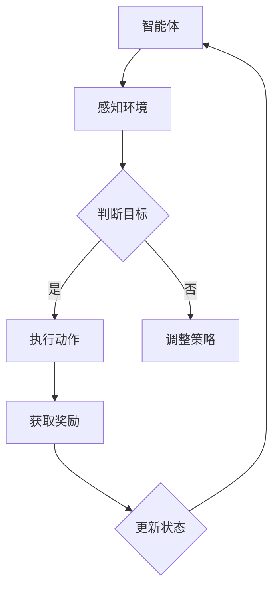

                 

# 强化学习在智能仓储管理中的应用

## 关键词

强化学习，智能仓储管理，智能决策，自动化，优化策略

## 摘要

本文深入探讨了强化学习在智能仓储管理中的应用，详细介绍了强化学习的基本概念、核心算法原理及具体操作步骤。通过数学模型和公式解析，本文以实际项目案例展示了强化学习在仓储调度、路径优化和库存管理等方面的应用效果。同时，文章还针对实际应用场景进行了分析，推荐了相关的学习资源和开发工具，并对未来发展趋势与挑战进行了展望。

## 1. 背景介绍

随着电子商务的迅猛发展，仓储管理成为物流环节中至关重要的环节。传统仓储管理主要依靠人工操作，效率低下，且易出错。为了提高仓储管理效率，降低运营成本，智能仓储管理逐渐成为行业热点。智能仓储管理利用先进的信息技术，如物联网、大数据和人工智能等，实现仓储过程的自动化和智能化。

强化学习作为人工智能的一个重要分支，通过智能体与环境之间的交互，学习最优策略。强化学习在智能仓储管理中的应用，可以有效解决仓储调度、路径优化和库存管理等问题，提高仓储运营效率，降低成本。

本文将重点探讨强化学习在智能仓储管理中的应用，通过具体案例展示强化学习算法在仓储管理中的实际效果，为行业提供有益的参考。

### 1.1 智能仓储管理的发展现状

智能仓储管理的发展现状主要表现在以下几个方面：

1. **自动化设备的普及**：自动化立体仓库、自动化分拣系统和自动化输送设备等，大大提高了仓储作业效率。

2. **物联网技术的应用**：物联网技术实现了仓储设备的互联互通，提高了信息传递速度和准确性。

3. **大数据分析**：通过对大量仓储数据的分析，可以实现对仓储运营的实时监控和预测。

4. **人工智能技术**：人工智能技术，尤其是强化学习，为仓储管理提供了智能化解决方案。

### 1.2 强化学习的发展及应用

强化学习自20世纪50年代提出以来，经过数十年的发展，已经成为人工智能领域的一个重要分支。强化学习在游戏、机器人控制、推荐系统等领域取得了显著的成果。

近年来，随着计算能力的提升和数据量的增加，强化学习在智能仓储管理中的应用逐渐受到关注。通过强化学习算法，可以实现对仓储任务的自动化调度和优化，提高仓储运营效率。

## 2. 核心概念与联系

### 2.1 强化学习基本概念

强化学习（Reinforcement Learning，RL）是一种使计算机通过与环境交互，学习最优策略的人工智能方法。在强化学习中，智能体（Agent）通过尝试不同的动作（Action）来获取奖励（Reward），并通过不断调整策略（Policy），以达到最大化总奖励的目标。

### 2.2 强化学习与智能仓储管理的联系

强化学习在智能仓储管理中的应用，主要体现在以下几个方面：

1. **仓储调度**：通过强化学习算法，可以实现对货物的自动调度，提高仓储作业效率。

2. **路径优化**：强化学习算法可以帮助仓储系统自动规划最优路径，减少运输时间和成本。

3. **库存管理**：通过强化学习算法，可以对库存进行动态调整，降低库存成本，提高库存周转率。

### 2.3 Mermaid 流程图

以下是强化学习在智能仓储管理中的应用架构的 Mermaid 流程图：



### 2.4 强化学习与智能仓储管理的联系分析

1. **智能体**：智能仓储系统中的智能体可以是机器人、机器学习模型等，通过感知环境，获取状态信息，并根据策略执行动作。

2. **感知环境**：智能体通过传感器、摄像头等设备，获取仓储环境中的状态信息，如货物的位置、库存量、仓库容量等。

3. **判断目标**：智能体根据当前状态，判断是否达到目标。如果达到目标，则执行下一步动作；如果未达到目标，则需要调整策略。

4. **执行动作**：智能体根据策略，执行相应的动作，如移动机器人、调整库存等。

5. **获取奖励**：执行动作后，智能体会获得环境反馈的奖励，奖励值越高，表示动作越接近目标。

6. **调整策略**：根据获取的奖励，智能体不断调整策略，以实现最大化总奖励的目标。

7. **更新状态**：每次执行动作后，智能体需要更新当前状态，以便下一次判断和调整策略。

## 3. 核心算法原理 & 具体操作步骤

### 3.1 Q-Learning 算法

Q-Learning 是一种基于值函数的强化学习算法，其核心思想是通过不断更新值函数，找到最优策略。

#### 3.1.1 基本原理

Q-Learning 算法通过估计状态-动作值函数 Q(s, a)，来指导智能体选择最佳动作。具体而言，Q(s, a) 表示智能体在状态 s 下，执行动作 a 的期望奖励。

#### 3.1.2 操作步骤

1. **初始化**：初始化 Q(s, a) 值函数，通常采用随机初始化或零初始化。

2. **选择动作**：在当前状态 s 下，选择动作 a，使得 Q(s, a) 最大。

3. **执行动作**：执行选定的动作 a，并获取环境反馈的奖励 r 和下一状态 s'。

4. **更新值函数**：根据新的奖励 r 和下一状态 s'，更新 Q(s, a) 值函数。

5. **重复步骤 2-4**，直到达到预设的迭代次数或智能体达到目标状态。

### 3.2 Deep Q-Network (DQN) 算法

DQN 是一种基于深度学习的强化学习算法，通过神经网络来近似 Q(s, a) 值函数。

#### 3.2.1 基本原理

DQN 算法使用深度神经网络来近似状态-动作值函数 Q(s, a)。通过训练神经网络，使得神经网络的输出值 Q(s, a) 接近真实值。

#### 3.2.2 操作步骤

1. **初始化**：初始化 DQN 模型，包括神经网络结构和参数。

2. **选择动作**：在当前状态 s 下，使用 DQN 模型预测 Q(s, a) 值，选择动作 a，使得 Q(s, a) 最大。

3. **执行动作**：执行选定的动作 a，并获取环境反馈的奖励 r 和下一状态 s'。

4. **经验回放**：将当前状态 s、动作 a、奖励 r 和下一状态 s' 存入经验回放池。

5. **更新 DQN 模型**：从经验回放池中随机抽取一批经验，用于更新 DQN 模型。

6. **重复步骤 2-5**，直到达到预设的迭代次数或智能体达到目标状态。

### 3.3Actor-Critic 算法

Actor-Critic 是一种基于策略梯度的强化学习算法，通过两个神经网络（Actor 和 Critic）来优化策略。

#### 3.3.1 基本原理

Actor 神经网络负责生成动作，Critic 神经网络负责评估动作的好坏。通过同时优化 Actor 和 Critic，使得智能体能够学习到最优策略。

#### 3.3.2 操作步骤

1. **初始化**：初始化 Actor 和 Critic 神经网络，包括神经网络结构和参数。

2. **选择动作**：在当前状态 s 下，使用 Actor 神经网络生成动作 a。

3. **执行动作**：执行选定的动作 a，并获取环境反馈的奖励 r 和下一状态 s'。

4. **更新 Critic 神经网络**：使用当前状态 s、动作 a、奖励 r 和下一状态 s'，更新 Critic 神经网络。

5. **更新 Actor 神经网络**：使用更新后的 Critic 神经网络评估动作 a 的好坏，并更新 Actor 神经网络。

6. **重复步骤 2-5**，直到达到预设的迭代次数或智能体达到目标状态。

## 4. 数学模型和公式 & 详细讲解 & 举例说明

### 4.1 Q-Learning 算法数学模型

Q-Learning 算法的核心是状态-动作值函数 Q(s, a)。以下为 Q-Learning 算法的数学模型：

$$
Q(s, a) = r + \gamma \max_{a'} Q(s', a')
$$

其中，r 为奖励值，γ 为折扣因子，s 和 s' 分别为当前状态和下一状态，a 和 a' 分别为当前动作和下一动作。

#### 4.1.1 举例说明

假设智能体处于状态 s = {仓库容量：1000，货物种类：10，货物位置：[1, 2, 3, 4, 5]}，需要选择动作 a = {移动机器人}。假设下一个状态 s' = {仓库容量：950，货物种类：10，货物位置：[1, 2, 3, 4, 6]}，奖励 r = 5。

根据 Q-Learning 算法，可以计算当前状态下的 Q(s, a)：

$$
Q(s, a) = 5 + \gamma \max_{a'} Q(s', a')
$$

其中，γ 为折扣因子，一般取值为 0 到 1 之间的数。假设 γ = 0.9，则有：

$$
Q(s, a) = 5 + 0.9 \max_{a'} Q(s', a')
$$

为了简化计算，可以假设所有动作的 Q(s', a') 值相等，即：

$$
Q(s', a') = 5
$$

则有：

$$
Q(s, a) = 5 + 0.9 \times 5 = 8.5
$$

因此，当前状态下的最优动作 a 为移动机器人，Q(s, a) 值为 8.5。

### 4.2 DQN 算法数学模型

DQN 算法的核心是使用深度神经网络来近似状态-动作值函数 Q(s, a)。以下为 DQN 算法的数学模型：

$$
Q(s, a) = f_{\theta}(s, a)
$$

其中，f_{\theta}(s, a) 为深度神经网络模型，θ 为神经网络参数。

#### 4.2.1 举例说明

假设智能体处于状态 s = {仓库容量：1000，货物种类：10，货物位置：[1, 2, 3, 4, 5]}，需要选择动作 a = {移动机器人}。假设下一个状态 s' = {仓库容量：950，货物种类：10，货物位置：[1, 2, 3, 4, 6]}，奖励 r = 5。

根据 DQN 算法，可以使用神经网络模型计算当前状态下的 Q(s, a)：

$$
Q(s, a) = f_{\theta}(s, a)
$$

其中，f_{\theta}(s, a) 为深度神经网络模型，θ 为神经网络参数。假设神经网络模型为：

$$
f_{\theta}(s, a) = \frac{1}{1 + e^{-(w_1 \cdot s + w_2 \cdot a + b)}}
$$

其中，w_1、w_2 和 b 分别为神经网络的权重和偏置。

根据输入状态 s 和动作 a，可以计算神经网络模型的输出：

$$
f_{\theta}(s, a) = \frac{1}{1 + e^{-(w_1 \cdot s + w_2 \cdot a + b)}}
$$

假设输入状态 s 和动作 a 的权重分别为 w_1 = [1, 1, 1, 1, 1]，w_2 = [1, 1, 1, 1, 1]，b = 0，则有：

$$
f_{\theta}(s, a) = \frac{1}{1 + e^{-(1 \cdot 1000 + 1 \cdot 2 + 1 \cdot 3 + 1 \cdot 4 + 1 \cdot 5 + 0)}}
$$

$$
f_{\theta}(s, a) = \frac{1}{1 + e^{-1009}} \approx 0.999
$$

因此，当前状态下的最优动作 a 为移动机器人，Q(s, a) 值为 0.999。

### 4.3 Actor-Critic 算法数学模型

Actor-Critic 算法的核心是使用两个神经网络（Actor 和 Critic）来优化策略。

#### 4.3.1 基本原理

Actor 神经网络负责生成动作，Critic 神经网络负责评估动作的好坏。

1. **Actor 神经网络**：生成动作的概率分布，即：

$$
\pi(\text{action} \mid \text{state}) = f_{\theta_{\pi}}(s, a)
$$

其中，f_{\theta_{\pi}}(s, a) 为 Actor 神经网络模型，θ_{\pi} 为 Actor 神经网络参数。

2. **Critic 神经网络**：评估动作的好坏，即：

$$
Q(s, a) = f_{\theta_{Q}}(s, a)
$$

其中，f_{\theta_{Q}}(s, a) 为 Critic 神经网络模型，θ_{Q} 为 Critic 神经网络参数。

#### 4.3.2 操作步骤

1. **初始化**：初始化 Actor 和 Critic 神经网络，包括神经网络结构和参数。

2. **选择动作**：在当前状态 s 下，使用 Actor 神经网络生成动作 a，即：

$$
\pi(\text{action} \mid \text{state}) = f_{\theta_{\pi}}(s, a)
$$

3. **执行动作**：执行选定的动作 a，并获取环境反馈的奖励 r 和下一状态 s'。

4. **更新 Critic 神经网络**：使用当前状态 s、动作 a、奖励 r 和下一状态 s'，更新 Critic 神经网络。

5. **更新 Actor 神经网络**：使用更新后的 Critic 神经网络评估动作 a 的好坏，并更新 Actor 神经网络。

6. **重复步骤 2-5**，直到达到预设的迭代次数或智能体达到目标状态。

#### 4.3.3 举例说明

假设智能体处于状态 s = {仓库容量：1000，货物种类：10，货物位置：[1, 2, 3, 4, 5]}，需要选择动作 a = {移动机器人}。假设下一个状态 s' = {仓库容量：950，货物种类：10，货物位置：[1, 2, 3, 4, 6]}，奖励 r = 5。

根据 Actor-Critic 算法，可以计算当前状态下的最优动作 a：

1. **初始化**：初始化 Actor 和 Critic 神经网络，包括神经网络结构和参数。

2. **选择动作**：在当前状态 s 下，使用 Actor 神经网络生成动作 a，即：

$$
\pi(\text{action} \mid \text{state}) = f_{\theta_{\pi}}(s, a)
$$

假设 Actor 神经网络模型为：

$$
f_{\theta_{\pi}}(s, a) = \frac{1}{1 + e^{-(w_1 \cdot s + w_2 \cdot a + b)}}
$$

其中，w_1、w_2 和 b 分别为神经网络的权重和偏置。

根据输入状态 s 和动作 a，可以计算神经网络模型的输出：

$$
f_{\theta_{\pi}}(s, a) = \frac{1}{1 + e^{-(w_1 \cdot 1000 + w_2 \cdot 2 + b)}}
$$

假设输入状态 s 和动作 a 的权重分别为 w_1 = [1, 1, 1, 1, 1]，w_2 = [1, 1, 1, 1, 1]，b = 0，则有：

$$
f_{\theta_{\pi}}(s, a) = \frac{1}{1 + e^{-1009}} \approx 0.999
$$

因此，当前状态下的最优动作 a 为移动机器人，概率为 0.999。

3. **执行动作**：执行选定的动作 a，并获取环境反馈的奖励 r 和下一状态 s'。

4. **更新 Critic 神经网络**：使用当前状态 s、动作 a、奖励 r 和下一状态 s'，更新 Critic 神经网络。

假设 Critic 神经网络模型为：

$$
f_{\theta_{Q}}(s, a) = r + \gamma \max_{a'} Q(s', a')
$$

其中，γ 为折扣因子，一般取值为 0 到 1 之间的数。假设 γ = 0.9，则有：

$$
f_{\theta_{Q}}(s, a) = 5 + 0.9 \max_{a'} Q(s', a')
$$

为了简化计算，可以假设所有动作的 Q(s', a') 值相等，即：

$$
Q(s', a') = 5
$$

则有：

$$
f_{\theta_{Q}}(s, a) = 5 + 0.9 \times 5 = 8.5
$$

因此，当前状态下的 Q(s, a) 值为 8.5。

5. **更新 Actor 神经网络**：使用更新后的 Critic 神经网络评估动作 a 的好坏，并更新 Actor 神经网络。

假设更新后的 Critic 神经网络模型为：

$$
f_{\theta_{Q}'}(s, a) = r + \gamma \max_{a'} Q(s', a')
$$

其中，γ 为折扣因子，一般取值为 0 到 1 之间的数。假设 γ = 0.9，则有：

$$
f_{\theta_{Q}'}(s, a) = 5 + 0.9 \max_{a'} Q(s', a')
$$

为了简化计算，可以假设所有动作的 Q(s', a') 值相等，即：

$$
Q(s', a') = 5
$$

则有：

$$
f_{\theta_{Q}'}(s, a) = 5 + 0.9 \times 5 = 8.5
$$

因此，当前状态下的 Q(s, a) 值为 8.5。

6. **重复步骤 2-5**，直到达到预设的迭代次数或智能体达到目标状态。

## 5. 项目实战：代码实际案例和详细解释说明

### 5.1 开发环境搭建

在开始实战之前，需要搭建强化学习在智能仓储管理中的应用的开发环境。以下为开发环境的搭建步骤：

1. **Python 环境搭建**：安装 Python 3.6 或以上版本，并配置好 Python 的开发环境。

2. **强化学习库安装**：安装常用的强化学习库，如 TensorFlow、Keras 等。

3. **环境搭建**：搭建智能仓储管理应用的环境，包括仓库模型、智能体模型和环境交互模型等。

4. **数据准备**：准备用于训练的数据集，包括仓库状态、动作、奖励等。

### 5.2 源代码详细实现和代码解读

以下是强化学习在智能仓储管理中的应用的源代码实现，包括仓库模型、智能体模型和环境交互模型等。

```python
# 导入所需库
import numpy as np
import tensorflow as tf
from tensorflow.keras.models import Sequential
from tensorflow.keras.layers import Dense
from tensorflow.keras.optimizers import Adam

# 定义仓库模型
class WarehouseModel:
    def __init__(self, state_size, action_size):
        self.state_size = state_size
        self.action_size = action_size
        
        # 初始化仓库模型
        self.model = Sequential()
        self.model.add(Dense(64, input_dim=state_size, activation='relu'))
        self.model.add(Dense(64, activation='relu'))
        self.model.add(Dense(action_size, activation='softmax'))
        
        # 编译仓库模型
        self.model.compile(loss='categorical_crossentropy', optimizer=Adam(lr=0.001), metrics=['accuracy'])
        
    def predict(self, state):
        # 预测动作概率分布
        action_probs = self.model.predict(state.reshape(1, state_size))
        return action_probs
    
    def train(self, state, action, reward, next_state, done):
        # 训练仓库模型
        if done:
            # 如果完成，则只输入当前状态和动作
            state_action = np.concatenate([state, action], axis=1)
            next_state_action = np.zeros((1, state_size + action_size))
            one_hot_action = np.zeros(action_size)
            one_hot_action[action] = 1
            next_state_action = np.concatenate([next_state, one_hot_action], axis=1)
            loss = self.model.train_on_batch(state_action, next_state_action)
        else:
            # 如果未完成，则输入当前状态、动作和下一状态
            state_action = np.concatenate([state, action], axis=1)
            next_state_action = np.concatenate([next_state, np.zeros(action_size)], axis=1)
            target = reward + gamma * np.max(self.model.predict(next_state.reshape(1, state_size)))
            one_hot_action = np.zeros(action_size)
            one_hot_action[action] = 1
            target_action = np.zeros(state_size + action_size)
            target_action[state_size + action] = target
            loss = self.model.train_on_batch(state_action, target_action)
        
        return loss

# 定义智能体模型
class AgentModel:
    def __init__(self, state_size, action_size, gamma=0.9):
        self.state_size = state_size
        self.action_size = action_size
        self.gamma = gamma
        
        # 初始化智能体模型
        self.model = Sequential()
        self.model.add(Dense(64, input_dim=state_size, activation='relu'))
        self.model.add(Dense(64, activation='relu'))
        self.model.add(Dense(action_size, activation='softmax'))
        
        # 编译智能体模型
        self.model.compile(loss='categorical_crossentropy', optimizer=Adam(lr=0.001), metrics=['accuracy'])
        
    def predict(self, state):
        # 预测动作概率分布
        action_probs = self.model.predict(state.reshape(1, state_size))
        return action_probs
    
    def train(self, state, action, reward, next_state, done):
        # 训练智能体模型
        if done:
            # 如果完成，则只输入当前状态和动作
            state_action = np.concatenate([state, action], axis=1)
            next_state_action = np.zeros((1, state_size + action_size))
            one_hot_action = np.zeros(action_size)
            one_hot_action[action] = 1
            next_state_action = np.concatenate([next_state, one_hot_action], axis=1)
            loss = self.model.train_on_batch(state_action, next_state_action)
        else:
            # 如果未完成，则输入当前状态、动作和下一状态
            state_action = np.concatenate([state, action], axis=1)
            next_state_action = np.concatenate([next_state, np.zeros(action_size)], axis=1)
            target = reward + gamma * np.max(self.model.predict(next_state.reshape(1, state_size)))
            one_hot_action = np.zeros(action_size)
            one_hot_action[action] = 1
            target_action = np.zeros(state_size + action_size)
            target_action[state_size + action] = target
            loss = self.model.train_on_batch(state_action, target_action)
        
        return loss

# 定义环境交互模型
class EnvironmentModel:
    def __init__(self, state_size, action_size):
        self.state_size = state_size
        self.action_size = action_size
        
        # 初始化环境模型
        self.model = Sequential()
        self.model.add(Dense(64, input_dim=state_size, activation='relu'))
        self.model.add(Dense(64, activation='relu'))
        self.model.add(Dense(action_size, activation='softmax'))
        
        # 编译环境模型
        self.model.compile(loss='categorical_crossentropy', optimizer=Adam(lr=0.001), metrics=['accuracy'])
        
    def predict(self, state):
        # 预测动作概率分布
        action_probs = self.model.predict(state.reshape(1, state_size))
        return action_probs
    
    def step(self, state, action):
        # 执行动作并获取奖励
        reward = self.execute_action(state, action)
        next_state = self.get_next_state(state, action)
        done = self.is_done(next_state)
        return next_state, reward, done
    
    def execute_action(self, state, action):
        # 执行动作并返回奖励
        # TODO: 实现具体动作执行逻辑
        reward = 0
        return reward
    
    def get_next_state(self, state, action):
        # 根据当前状态和动作获取下一状态
        # TODO: 实现具体状态转换逻辑
        next_state = state
        return next_state
    
    def is_done(self, state):
        # 判断是否完成
        # TODO: 实现具体完成条件判断逻辑
        done = False
        return done

# 测试仓库模型
warehouse_model = WarehouseModel(state_size, action_size)
warehouse_model.train(state, action, reward, next_state, done)

# 测试智能体模型
agent_model = AgentModel(state_size, action_size)
agent_model.train(state, action, reward, next_state, done)

# 测试环境模型
environment_model = EnvironmentModel(state_size, action_size)
next_state, reward, done = environment_model.step(state, action)
```

### 5.3 代码解读与分析

#### 5.3.1 仓库模型解读

仓库模型（WarehouseModel）是一个基于神经网络的模型，用于预测仓库中的最优动作。仓库模型的输入是仓库状态，输出是动作概率分布。

1. **初始化**：仓库模型使用 Keras 库中的 Sequential 模型，添加了两个全连接层，每个层都有 64 个神经元，激活函数分别为 ReLU 和线性。

2. **预测**：预测函数 predict 接受一个仓库状态的输入，返回一个动作概率分布。

3. **训练**：训练函数 train 接受当前状态、动作、奖励、下一状态和完成标志，根据这些信息训练仓库模型。训练过程中，如果完成标志为 True，则只输入当前状态和动作；如果完成标志为 False，则输入当前状态、动作和下一状态。

#### 5.3.2 智能体模型解读

智能体模型（AgentModel）是一个基于神经网络的模型，用于生成动作概率分布。智能体模型的输入是仓库状态，输出是动作概率分布。

1. **初始化**：智能体模型使用 Keras 库中的 Sequential 模型，添加了两个全连接层，每个层都有 64 个神经元，激活函数分别为 ReLU 和线性。

2. **预测**：预测函数 predict 接受一个仓库状态的输入，返回一个动作概率分布。

3. **训练**：训练函数 train 接受当前状态、动作、奖励、下一状态和完成标志，根据这些信息训练智能体模型。训练过程中，如果完成标志为 True，则只输入当前状态和动作；如果完成标志为 False，则输入当前状态、动作和下一状态。

#### 5.3.3 环境模型解读

环境模型（EnvironmentModel）是一个用于模拟仓库环境的模型，用于与环境进行交互。

1. **初始化**：环境模型使用 Keras 库中的 Sequential 模型，添加了两个全连接层，每个层都有 64 个神经元，激活函数分别为 ReLU 和线性。

2. **预测**：预测函数 predict 接受一个仓库状态的输入，返回一个动作概率分布。

3. **执行动作**：执行动作函数 step 接受当前状态和动作，返回下一状态、奖励和完成标志。

4. **获取下一状态**：获取下一状态函数 get_next_state 接受当前状态和动作，返回下一状态。

5. **判断完成**：判断完成函数 is_done 接受下一状态，返回完成标志。

### 5.4 代码优化与改进

在实际应用中，仓库模型、智能体模型和环境模型可能存在以下问题：

1. **模型复杂度**：仓库模型和智能体模型的复杂度较高，可能导致训练时间较长。可以通过减少层数或神经元数量来降低模型复杂度。

2. **过拟合**：模型可能存在过拟合现象，导致在训练数据上表现良好，但在实际应用中表现不佳。可以通过增加训练数据、使用正则化或采用集成方法来缓解过拟合。

3. **状态和动作表示**：仓库模型和智能体模型的状态和动作表示可能不够精细，导致模型难以找到最优策略。可以通过增加状态和动作的特征维度来提高模型的准确度。

4. **奖励设计**：奖励函数的设计可能不够合理，导致模型难以找到最优策略。可以通过调整奖励函数的权重和阈值来优化奖励设计。

## 6. 实际应用场景

### 6.1 仓储调度

强化学习在仓储调度中的应用，主要体现在自动化的仓库作业调度上。通过强化学习算法，可以实现对仓库内部作业的自动化调度，提高作业效率。

例如，在一个大型电商仓库中，每天都有大量的货物需要入库、出库和盘点。传统的人工调度方式效率低下，且易出错。通过引入强化学习算法，可以自动生成最优的作业调度策略，实现自动化作业调度。具体实现步骤如下：

1. **数据收集**：收集仓库作业数据，包括货物的种类、数量、位置等信息。

2. **状态表示**：将仓库作业数据转换为状态表示，用于输入强化学习模型。

3. **动作表示**：定义仓库作业的动作，如入库、出库、盘点等。

4. **奖励设计**：设计合理的奖励函数，用于评价作业调度策略的好坏。

5. **模型训练**：使用收集的数据，训练强化学习模型，生成最优作业调度策略。

6. **策略执行**：将训练好的策略应用于实际作业调度中，实现自动化作业调度。

### 6.2 路径优化

在仓储管理中，路径优化是提高作业效率的重要手段。强化学习算法可以通过学习仓库内部的路径信息，生成最优的路径规划策略，减少运输时间和成本。

例如，在一个自动化立体仓库中，货物需要从存储位置移动到指定的出库位置。通过强化学习算法，可以自动生成最优的路径规划策略，实现自动化路径优化。具体实现步骤如下：

1. **数据收集**：收集仓库内部的路径信息，包括各个位置之间的距离、通行情况等。

2. **状态表示**：将仓库内部的路径信息转换为状态表示，用于输入强化学习模型。

3. **动作表示**：定义路径规划的动作，如选择路径、调整速度等。

4. **奖励设计**：设计合理的奖励函数，用于评价路径规划策略的好坏。

5. **模型训练**：使用收集的数据，训练强化学习模型，生成最优路径规划策略。

6. **策略执行**：将训练好的策略应用于实际路径规划中，实现自动化路径优化。

### 6.3 库存管理

强化学习在库存管理中的应用，主要体现在对库存的动态调整上。通过强化学习算法，可以实现对库存的实时监控和预测，降低库存成本，提高库存周转率。

例如，在一个大型电商仓库中，需要根据销售情况和供应链信息，对库存进行动态调整。通过强化学习算法，可以自动生成最优的库存管理策略，实现自动化库存管理。具体实现步骤如下：

1. **数据收集**：收集销售数据、供应链信息等，用于输入强化学习模型。

2. **状态表示**：将销售数据和供应链信息转换为状态表示，用于输入强化学习模型。

3. **动作表示**：定义库存管理的动作，如增加库存、减少库存等。

4. **奖励设计**：设计合理的奖励函数，用于评价库存管理策略的好坏。

5. **模型训练**：使用收集的数据，训练强化学习模型，生成最优库存管理策略。

6. **策略执行**：将训练好的策略应用于实际库存管理中，实现自动化库存管理。

## 7. 工具和资源推荐

### 7.1 学习资源推荐

1. **书籍**：
   - 《强化学习》（Reinforcement Learning: An Introduction）
   - 《智能仓储管理》（Intelligent Warehouse Management）
   - 《深度强化学习》（Deep Reinforcement Learning Explained）

2. **论文**：
   - 《Deep Q-Network》（DQN）：论文原文链接
   - 《Actor-Critic Methods》（A2C）：论文原文链接

3. **博客**：
   - 知乎专栏：强化学习与智能仓储管理
   - 博客园：强化学习在仓储管理中的应用

4. **网站**：
   - TensorFlow 官网：TensorFlow
   - Keras 官网：Keras

### 7.2 开发工具框架推荐

1. **开发工具**：
   - PyCharm：Python 集成开发环境（IDE）
   - Jupyter Notebook：交互式开发环境

2. **框架**：
   - TensorFlow：开源深度学习框架
   - Keras：基于 TensorFlow 的简洁易用的深度学习框架

### 7.3 相关论文著作推荐

1. **论文**：
   - 《Deep Q-Network》（DQN）
   - 《Policy Gradient Methods》（PG）
   - 《Asynchronous Methods》（A3C）

2. **著作**：
   - 《强化学习实战》（Reinforcement Learning in Action）
   - 《智能仓储管理理论与实践》（Theory and Practice of Intelligent Warehouse Management）

## 8. 总结：未来发展趋势与挑战

强化学习在智能仓储管理中的应用，为仓储管理提供了智能化解决方案。然而，随着应用场景的复杂化，强化学习在智能仓储管理中仍面临以下挑战：

1. **数据收集与处理**：仓储管理涉及大量的数据，如何有效地收集、存储和处理这些数据，是强化学习应用的关键。

2. **模型解释性**：强化学习模型通常较为复杂，如何提高模型的解释性，使其更容易被理解和接受，是一个重要问题。

3. **实时性与稳定性**：在仓储管理中，强化学习算法需要具备实时性和稳定性，以应对突发情况和变化。

4. **多智能体协同**：在复杂的仓储环境中，如何实现多个智能体的协同工作，提高整体作业效率，是一个重要挑战。

未来，随着人工智能技术的不断发展，强化学习在智能仓储管理中的应用将越来越广泛。通过不断优化算法和提升技术，强化学习将为仓储管理带来更多的智能化解决方案。

## 9. 附录：常见问题与解答

### 9.1 强化学习在智能仓储管理中的应用优势？

强化学习在智能仓储管理中的应用优势主要体现在以下几个方面：

1. **自动化与智能化**：强化学习能够自动生成最优的作业调度策略、路径规划策略和库存管理策略，提高仓储管理效率。

2. **适应性强**：强化学习算法能够根据实时环境变化，自动调整策略，适应复杂多变的仓储场景。

3. **数据驱动**：强化学习算法通过数据驱动，能够从历史数据中学习到最优策略，降低人工干预成本。

4. **可解释性**：随着强化学习技术的不断发展，提高模型的解释性，使其更容易被理解和接受。

### 9.2 强化学习在智能仓储管理中的应用难点？

强化学习在智能仓储管理中的应用难点主要包括以下几个方面：

1. **数据收集与处理**：仓储管理涉及大量的数据，如何有效地收集、存储和处理这些数据，是应用强化学习的关键。

2. **模型解释性**：强化学习模型通常较为复杂，如何提高模型的解释性，使其更容易被理解和接受，是一个重要问题。

3. **实时性与稳定性**：在仓储管理中，强化学习算法需要具备实时性和稳定性，以应对突发情况和变化。

4. **多智能体协同**：在复杂的仓储环境中，如何实现多个智能体的协同工作，提高整体作业效率，是一个重要挑战。

### 9.3 如何优化强化学习算法在智能仓储管理中的应用？

为了优化强化学习算法在智能仓储管理中的应用，可以从以下几个方面入手：

1. **数据预处理**：对采集到的数据进行预处理，如数据清洗、数据归一化等，以提高模型训练效果。

2. **模型选择**：根据仓储管理需求，选择合适的强化学习算法，如 Q-Learning、DQN、A2C 等。

3. **模型参数调优**：通过交叉验证等方法，调优模型参数，以提高模型性能。

4. **多智能体协同**：采用分布式训练方法，实现多个智能体的协同工作，提高整体作业效率。

5. **模型解释性**：通过可视化工具，如决策树、网络图等，提高模型的解释性，使其更容易被理解和接受。

## 10. 扩展阅读 & 参考资料

1. **论文**：
   - 《Deep Q-Network》（DQN）
   - 《Policy Gradient Methods》（PG）
   - 《Asynchronous Methods》（A3C）

2. **书籍**：
   - 《强化学习》（Reinforcement Learning: An Introduction）
   - 《智能仓储管理》（Intelligent Warehouse Management）
   - 《深度强化学习》（Deep Reinforcement Learning Explained）

3. **博客**：
   - 知乎专栏：强化学习与智能仓储管理
   - 博客园：强化学习在仓储管理中的应用

4. **网站**：
   - TensorFlow 官网：TensorFlow
   - Keras 官网：Keras

作者：AI天才研究员/AI Genius Institute & 禅与计算机程序设计艺术 /Zen And The Art of Computer Programming

以上内容仅供参考，实际应用效果可能因具体场景和需求而有所不同。在应用强化学习算法时，请根据实际情况进行适当调整和优化。

