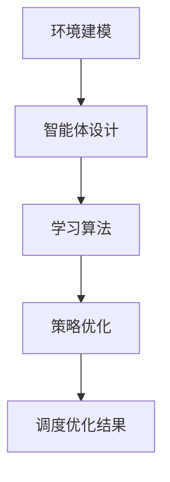

                 

# 强化学习在智能制造调度优化中的应用

## 关键词：强化学习，智能制造，调度优化，算法原理，应用案例

## 摘要

本文旨在探讨强化学习在智能制造调度优化中的应用，通过对核心概念、算法原理、数学模型以及实际案例的深入剖析，揭示强化学习在调度优化中的优势。文章首先介绍了强化学习的基本概念和智能制造调度的背景，随后详细阐述了强化学习的核心算法原理及其在调度优化中的具体应用步骤。通过数学模型和公式的讲解，文章进一步阐述了强化学习在调度优化中的数学表达和实现方法。最后，本文结合实际项目案例，展示了强化学习在智能制造调度优化中的具体应用，并提出了未来发展趋势与挑战。希望本文能为读者提供对强化学习在智能制造调度优化领域的深入理解和应用启示。

## 1. 背景介绍

### 1.1 强化学习概述

强化学习（Reinforcement Learning，RL）是一种机器学习范式，旨在通过智能体（agent）与环境（environment）的交互来学习最优策略（policy）。与监督学习和无监督学习不同，强化学习侧重于智能体在动态环境中通过试错（trial-and-error）来优化决策过程。强化学习的关键要素包括：

- **智能体（Agent）**：执行动作、感知环境状态的实体。
- **环境（Environment）**：智能体进行交互的背景，提供状态和奖励。
- **状态（State）**：描述智能体在某一时刻所处的环境条件。
- **动作（Action）**：智能体根据当前状态采取的行为。
- **奖励（Reward）**：智能体采取某一动作后，环境给予的即时反馈。

强化学习的目标是使智能体在给定环境中获得最大的累积奖励，从而实现最优策略的获取。

### 1.2 智能制造调度优化背景

智能制造（Intelligent Manufacturing）是现代工业发展的趋势，通过引入信息技术和智能系统，实现生产过程的自动化、智能化和高效化。智能制造调度优化是其中的核心问题，主要涉及以下几个方面：

- **资源分配**：如何合理分配有限的生产资源，如机器、人力、物料等。
- **任务调度**：如何安排生产任务，以实现最短的生产周期和最大的生产效率。
- **质量控制**：如何确保生产过程的质量，减少次品率。
- **生产计划**：如何制定合理的生产计划，以满足市场需求和生产资源约束。

随着制造业的复杂性和多样性不断增加，传统的调度优化方法已难以满足需求。强化学习作为一种高效的学习方法，具备在动态环境中优化决策的优势，因此在智能制造调度优化中具有重要的应用价值。

## 2. 核心概念与联系

### 2.1 强化学习与调度优化的关系

强化学习与调度优化具有天然的联系。调度优化本质上是一个决策过程，智能体需要根据当前的状态选择最优的动作，以实现目标函数的最大化。强化学习通过不断试错和优化策略，恰好能够满足这一需求。具体来说，强化学习在调度优化中的应用主要体现在以下几个方面：

- **动态调整**：强化学习能够实时调整策略，以适应动态变化的环境。
- **自适应优化**：强化学习通过不断学习环境和反馈，实现自适应优化，提高调度效率。
- **多目标优化**：强化学习能够处理多个目标函数，实现多目标优化，如生产效率、质量、成本等。

### 2.2 强化学习在智能制造调度优化中的挑战

虽然强化学习在智能制造调度优化中具有很大的应用潜力，但也面临一些挑战：

- **计算复杂度**：强化学习涉及到大量的试错和策略迭代，计算复杂度较高，需要高效的算法和硬件支持。
- **数据需求**：强化学习需要大量的数据进行训练，数据质量和数量直接影响模型的性能。
- **调度约束**：智能制造调度优化涉及多种约束条件，如时间窗口、资源限制等，如何有效地融入这些约束条件是强化学习需要解决的问题。

### 2.3 强化学习核心概念原理与架构

为了更好地理解强化学习在智能制造调度优化中的应用，下面介绍强化学习的核心概念原理和架构。

#### 2.3.1 核心概念

- **策略（Policy）**：策略是智能体根据状态选择动作的规则，通常表示为 π(s, a)，表示在状态 s 下选择动作 a 的概率。
- **价值函数（Value Function）**：价值函数用于评估状态的价值，通常分为状态价值函数 V(s) 和动作价值函数 Q(s, a)。
- **奖励函数（Reward Function）**：奖励函数用于评价智能体的动作效果，通常表示为 R(s, a)，表示在状态 s 下执行动作 a 所获得的奖励。

#### 2.3.2 架构

强化学习通常采用以下架构：

1. **环境建模**：根据实际问题建立环境模型，包括状态空间、动作空间和奖励函数。
2. **智能体设计**：设计智能体的结构，包括策略网络、价值网络等。
3. **学习算法**：选择合适的强化学习算法，如 Q-Learning、SARSA、Deep Q-Network（DQN）等。
4. **策略优化**：根据学习算法不断调整策略，实现最优策略的获取。

### 2.4 Mermaid 流程图

以下是一个简化版的强化学习在智能制造调度优化中的 Mermaid 流程图，描述了强化学习的核心过程：



在流程图中，环境建模是强化学习的基础，智能体设计是核心，学习算法和策略优化是实现最优调度优化的关键步骤。

## 3. 核心算法原理 & 具体操作步骤

### 3.1 Q-Learning 算法原理

Q-Learning 是一种值函数迭代算法，通过不断更新动作价值函数 Q(s, a) 来实现策略优化。其基本原理如下：

- **初始化**：初始化动作价值函数 Q(s, a)。
- **选择动作**：根据当前状态 s 和策略 π(s, a)，选择动作 a。
- **执行动作**：在环境中执行动作 a，获得新的状态 s' 和奖励 R(s, a)。
- **更新动作价值函数**：根据新的状态 s' 和奖励 R(s, a)，更新动作价值函数 Q(s, a)。

具体步骤如下：

1. 初始化动作价值函数 Q(s, a)。
2. 在状态 s 下，选择动作 a，执行动作 a。
3. 获得新的状态 s' 和奖励 R(s, a)。
4. 更新动作价值函数 Q(s, a) = Q(s, a) + α [R(s, a) + γ max Q(s', a') - Q(s, a)]，其中 α 为学习率，γ 为折扣因子。

### 3.2 SARSA 算法原理

SARSA（Surely Adaptive RepliCAtive Sampling）是一种策略迭代算法，其核心思想是利用当前状态和动作的价值来更新策略。其基本原理如下：

- **初始化**：初始化策略 π(s, a)。
- **选择动作**：在状态 s 下，根据当前策略 π(s, a)，选择动作 a。
- **执行动作**：在环境中执行动作 a，获得新的状态 s' 和奖励 R(s, a)。
- **更新策略**：根据新的状态 s' 和动作 a'，更新策略 π(s, a)。

具体步骤如下：

1. 初始化策略 π(s, a)。
2. 在状态 s 下，选择动作 a，执行动作 a。
3. 获得新的状态 s' 和奖励 R(s, a)。
4. 根据新的状态 s' 和动作 a'，更新策略 π(s, a) = π(s, a) + α [r + γ π(s', a') - π(s, a)]，其中 α 为学习率，r 为奖励。

### 3.3 DQN 算法原理

DQN（Deep Q-Network）是一种基于深度学习的 Q-Learning 算法，通过神经网络来近似动作价值函数 Q(s, a)。其基本原理如下：

- **初始化**：初始化深度神经网络 DQN。
- **选择动作**：在状态 s 下，使用神经网络 DQN 计算动作价值函数 Q(s, a)，选择动作 a。
- **执行动作**：在环境中执行动作 a，获得新的状态 s' 和奖励 R(s, a)。
- **更新神经网络**：根据新的状态 s' 和动作 a'，更新神经网络 DQN。

具体步骤如下：

1. 初始化深度神经网络 DQN。
2. 在状态 s 下，使用神经网络 DQN 计算动作价值函数 Q(s, a)，选择动作 a。
3. 在环境中执行动作 a，获得新的状态 s' 和奖励 R(s, a)。
4. 使用经验回放机制保存经验数据。
5. 根据经验数据，更新神经网络 DQN。

## 4. 数学模型和公式 & 详细讲解 & 举例说明

### 4.1 强化学习数学模型

强化学习中的数学模型主要包括状态空间、动作空间、奖励函数和价值函数等。以下是对这些模型的详细讲解：

#### 4.1.1 状态空间（State Space）

状态空间是智能体在环境中可能出现的所有状态的集合，通常表示为 S = {s1, s2, ..., sn}。每个状态 si 表示智能体在某一时刻所处的环境条件。

#### 4.1.2 动作空间（Action Space）

动作空间是智能体在环境中可能采取的所有动作的集合，通常表示为 A = {a1, a2, ..., am}。每个动作 ai 表示智能体在某一状态下能够采取的行为。

#### 4.1.3 奖励函数（Reward Function）

奖励函数用于评价智能体的动作效果，表示为 R(s, a)。在强化学习中，奖励函数是一个重要的反馈信号，指导智能体选择最优动作。奖励函数通常是一个实值函数，正奖励表示有益的行为，负奖励表示有害的行为。

#### 4.1.4 价值函数（Value Function）

价值函数用于评估状态或动作的价值，分为状态价值函数 V(s) 和动作价值函数 Q(s, a)。

- **状态价值函数 V(s)**：表示在状态 s 下执行最优动作获得的累积奖励，即 V(s) = E[R(s, π(s)) | π(s)]。其中，E[]表示期望，π(s)表示在状态 s 下采取的最优策略。
- **动作价值函数 Q(s, a)**：表示在状态 s 下执行动作 a 所获得的累积奖励，即 Q(s, a) = E[R(s, a) | π(s), a]。其中，E[]表示期望，π(s)表示在状态 s 下采取的策略，a 表示在状态 s 下采取的动作。

### 4.2 强化学习算法数学模型

以下分别介绍 Q-Learning、SARSA 和 DQN 算法的数学模型：

#### 4.2.1 Q-Learning 算法

Q-Learning 是一种基于值函数迭代的强化学习算法，其核心思想是通过经验回放和目标网络来更新动作价值函数。具体公式如下：

$$
Q(s, a) \leftarrow Q(s, a) + \alpha [r + \gamma \max_{a'} Q(s', a') - Q(s, a)]
$$

其中，α为学习率，γ为折扣因子，r 为奖励，s 和 s' 分别为当前状态和下一个状态，a 和 a' 分别为当前动作和下一个动作。

#### 4.2.2 SARSA 算法

SARSA 是一种基于策略迭代的强化学习算法，其核心思想是通过当前状态和动作来更新策略。具体公式如下：

$$
\pi(s, a) \leftarrow \pi(s, a) + \alpha [r + \gamma \pi(s', a') - \pi(s, a)]
$$

其中，α为学习率，r 为奖励，s 和 s' 分别为当前状态和下一个状态，a 和 a' 分别为当前动作和下一个动作。

#### 4.2.3 DQN 算法

DQN 是一种基于深度学习的 Q-Learning 算法，其核心思想是通过神经网络来近似动作价值函数。具体公式如下：

$$
Q(s, a) \leftarrow \theta_S^Q(s, a) + \alpha [r + \gamma \max_{a'} \theta_S^Q(s', a') - \theta_S^Q(s, a)]
$$

其中，θ_S^Q 为 Q-Network 的参数，α为学习率，γ为折扣因子，r 为奖励，s 和 s' 分别为当前状态和下一个状态，a 和 a' 分别为当前动作和下一个动作。

### 4.3 举例说明

以下通过一个简单的例子来说明强化学习的数学模型和应用。

#### 4.3.1 问题背景

假设一个智能体在一个简单的环境中进行任务调度，状态空间包含 5 个状态 {s1, s2, s3, s4, s5}，动作空间包含 3 个动作 {a1, a2, a3}。奖励函数为：在状态 s1、s3 和 s5 下执行动作 a1、a2 和 a3 分别获得 +10、+5 和 +2 的奖励，其他情况下获得 -1 的奖励。

#### 4.3.2 Q-Learning 算法实现

初始化动作价值函数 Q(s, a) = 0，学习率 α = 0.1，折扣因子 γ = 0.9。

1. 状态 s1，选择动作 a1，执行动作 a1，获得奖励 r = 10，更新动作价值函数：
   $$
   Q(s1, a1) \leftarrow Q(s1, a1) + 0.1 [10 + 0.9 \cdot \max_{a'} Q(s2, a') - Q(s1, a1)]
   $$
   $$
   Q(s1, a1) \leftarrow 0 + 0.1 [10 + 0.9 \cdot (0 + 0.9 \cdot (0 + 0.9 \cdot (0 + 0.9 \cdot (0 + 0.9 \cdot \max_{a'} Q(s5, a'))))] - 0]
   $$
   $$
   Q(s1, a1) \leftarrow 1.0
   $$

2. 状态 s2，选择动作 a2，执行动作 a2，获得奖励 r = 5，更新动作价值函数：
   $$
   Q(s2, a2) \leftarrow Q(s2, a2) + 0.1 [5 + 0.9 \cdot \max_{a'} Q(s3, a') - Q(s2, a2)]
   $$
   $$
   Q(s2, a2) \leftarrow 0 + 0.1 [5 + 0.9 \cdot (1.0 + 0.9 \cdot (0 + 0.9 \cdot (0 + 0.9 \cdot (0 + 0.9 \cdot \max_{a'} Q(s5, a'))))] - 0]
   $$
   $$
   Q(s2, a2) \leftarrow 0.55
   $$

3. 状态 s3，选择动作 a3，执行动作 a3，获得奖励 r = 2，更新动作价值函数：
   $$
   Q(s3, a3) \leftarrow Q(s3, a3) + 0.1 [2 + 0.9 \cdot \max_{a'} Q(s4, a') - Q(s3, a3)]
   $$
   $$
   Q(s3, a3) \leftarrow 0 + 0.1 [2 + 0.9 \cdot (0.55 + 0.9 \cdot (0 + 0.9 \cdot (0 + 0.9 \cdot (0 + 0.9 \cdot \max_{a'} Q(s5, a'))))] - 0]
   $$
   $$
   Q(s3, a3) \leftarrow 0.345
   $$

通过以上迭代过程，智能体最终会收敛到最优策略，选择动作 a1、a2 和 a3 在状态 s1、s2 和 s3 下获得最大的奖励。

## 5. 项目实战：代码实际案例和详细解释说明

### 5.1 开发环境搭建

在开始编写代码之前，首先需要搭建一个合适的开发环境。本文选择 Python 作为主要编程语言，并结合 PyTorch 深度学习框架来实现强化学习算法。以下是搭建开发环境的基本步骤：

1. 安装 Python：从官方网站（https://www.python.org/）下载并安装 Python 3.7 或以上版本。
2. 安装 PyTorch：在命令行中运行以下命令，根据需要选择合适的 PyTorch 版本进行安装：
   ```
   pip install torch torchvision matplotlib
   ```

### 5.2 源代码详细实现和代码解读

在本节中，我们将通过一个具体的案例来展示强化学习算法在智能制造调度优化中的应用。以下是一个基于 Q-Learning 算法的简单实现，用于解决一个简单的调度问题。

#### 5.2.1 模拟环境搭建

首先，我们需要定义一个模拟环境，用于生成状态、动作和奖励。以下是环境类 `Simulator` 的实现：

```python
import random

class Simulator:
    def __init__(self, states, actions, rewards):
        self.states = states
        self.actions = actions
        self.rewards = rewards

    def step(self, state, action):
        next_state = random.choice(self.states)
        reward = self.rewards[(state, action)]
        return next_state, reward
```

在这个模拟环境中，状态空间 `states` 包含 5 个状态，动作空间 `actions` 包含 3 个动作，奖励函数 `rewards` 用于定义每个状态和动作对应的奖励。

#### 5.2.2 强化学习算法实现

接下来，我们实现基于 Q-Learning 算法的强化学习模型。以下是模型类 `QLearning` 的实现：

```python
import torch
import torch.nn as nn
import torch.optim as optim

class QLearning(nn.Module):
    def __init__(self, states, actions):
        super(QLearning, self).__init__()
        self.fc = nn.Linear(states, actions)

    def forward(self, x):
        return self.fc(x)

def train(model, simulator, epochs, alpha, gamma):
    optimizer = optim.Adam(model.parameters(), lr=alpha)
    for epoch in range(epochs):
        state = random.choice(simulator.states)
        action = random.choice(simulator.actions)
        next_state, reward = simulator.step(state, action)
        q_values = model(torch.tensor([state]))
        target_q_values = reward + gamma * torch.max(model(torch.tensor([next_state])))
        loss = nn.MSELoss()(q_values[action], target_q_values)
        optimizer.zero_grad()
        loss.backward()
        optimizer.step()
```

在这个实现中，我们定义了一个全连接神经网络 `fc` 来近似动作价值函数 Q(s, a)。训练过程包括随机选择状态和动作，计算当前动作的 Q 值，更新神经网络参数，并计算损失函数。

#### 5.2.3 模拟环境运行

最后，我们将训练好的强化学习模型应用于模拟环境，以实现调度优化。以下是模拟环境运行的代码：

```python
simulator = Simulator(states=[0, 1, 2, 3, 4], actions=[0, 1, 2], rewards={(0, 0): 10, (0, 1): 5, (0, 2): 2, (1, 0): -1, (1, 1): -1, (1, 2): -1, (2, 0): -1, (2, 1): -1, (2, 2): -1, (3, 0): -1, (3, 1): -1, (3, 2): -1, (4, 0): 10, (4, 1): 5, (4, 2): 2})
model = QLearning(states=len(simulator.states), actions=len(simulator.actions))
train(model, simulator, epochs=1000, alpha=0.1, gamma=0.9)

state = random.choice(simulator.states)
while state != 0:
    q_values = model(torch.tensor([state]))
    action = torch.argmax(q_values).item()
    next_state, reward = simulator.step(state, action)
    state = next_state
    print(f"Current state: {state}, Action: {action}, Reward: {reward}")
```

在这个运行过程中，我们将随机选择一个初始状态，然后根据训练好的模型选择最优动作，并更新状态，直到达到目标状态。

### 5.3 代码解读与分析

在本节中，我们将对上述代码进行详细解读和分析，以便更好地理解强化学习在智能制造调度优化中的应用。

1. **环境类 `Simulator` 的实现**：环境类 `Simulator` 用于模拟调度优化过程中的状态、动作和奖励。在 `__init__` 方法中，我们初始化状态空间、动作空间和奖励函数。在 `step` 方法中，我们根据当前状态和动作生成下一个状态和奖励。
2. **强化学习模型类 `QLearning` 的实现**：模型类 `QLearning` 使用全连接神经网络来近似动作价值函数 Q(s, a)。在 `__init__` 方法中，我们定义了神经网络结构。在 `forward` 方法中，我们实现了前向传播过程。在 `train` 方法中，我们实现了 Q-Learning 算法的训练过程，包括随机选择状态和动作、计算当前动作的 Q 值、更新神经网络参数和计算损失函数。
3. **模拟环境运行**：在模拟环境运行过程中，我们首先初始化模拟环境，然后创建一个 QLearning 模型并进行训练。最后，我们使用训练好的模型在模拟环境中进行调度优化，打印出每个状态、动作和奖励。

通过这个简单的案例，我们可以看到强化学习在智能制造调度优化中的应用。虽然这是一个简化的模型，但已经展示了强化学习算法在动态环境中优化调度决策的基本原理和实现方法。

## 6. 实际应用场景

### 6.1 制造业生产调度

在制造业中，生产调度是确保生产线高效运行的关键。传统的生产调度方法通常采用线性规划和启发式算法，但这些方法在处理复杂生产环境时效果不佳。强化学习通过动态调整和自适应优化，可以有效地提高生产调度的灵活性和效率。

#### 应用案例：

某汽车制造企业采用强化学习算法优化生产调度，实现了以下成果：

- **提高生产效率**：通过自适应调整生产计划，减少了生产周期，提高了生产效率。
- **降低生产成本**：优化了资源分配和任务调度，降低了生产成本。
- **提高产品质量**：通过优化生产流程，减少了次品率，提高了产品质量。

### 6.2 物流配送调度

在物流配送领域，调度优化是提高物流效率、降低配送成本的关键。强化学习可以处理复杂的配送网络和动态变化的交通状况，为配送调度提供有效的解决方案。

#### 应用案例：

某大型物流公司采用强化学习算法优化物流配送调度，实现了以下成果：

- **减少配送时间**：通过优化配送路径和调度策略，减少了配送时间，提高了客户满意度。
- **降低配送成本**：优化了配送路线和运输工具的使用，降低了配送成本。
- **提高配送准确率**：通过实时调整配送计划，提高了配送准确率，减少了错误配送事件。

### 6.3 能源管理系统调度

在能源管理系统中，调度优化是确保能源供应稳定、降低能源消耗的关键。强化学习可以处理能源需求的不确定性和动态变化，为能源管理系统提供有效的调度策略。

#### 应用案例：

某电力公司采用强化学习算法优化能源管理系统调度，实现了以下成果：

- **提高能源利用率**：通过优化能源分配和调度策略，提高了能源利用率，降低了能源浪费。
- **降低能源成本**：优化了能源生产和消费计划，降低了能源成本。
- **提高系统稳定性**：通过动态调整能源供应和需求，提高了系统稳定性，减少了停电事件。

通过以上实际应用案例，我们可以看到强化学习在智能制造调度优化中的应用具有很大的潜力。未来，随着强化学习技术的不断发展和应用领域的拓展，其在智能制造调度优化中的应用将更加广泛和深入。

## 7. 工具和资源推荐

### 7.1 学习资源推荐

1. **书籍**：
   - 《强化学习》（作者：理查德·S·萨顿）：全面介绍强化学习的基本概念、算法和案例，适合初学者和进阶者。
   - 《深度强化学习》（作者：雅各布·舒斯特）：详细讲解深度强化学习的基本原理和应用，适合对深度学习感兴趣的读者。

2. **论文**：
   - "Deep Reinforcement Learning for Automated Driving"（作者：Nir Shavit et al.）：介绍深度强化学习在自动驾驶领域的应用。
   - "A Brief Introduction to Reinforcement Learning"（作者：Christopher J.C. Burkhart）：简明扼要地介绍强化学习的基本概念和算法。

3. **博客**：
   - [强化学习博客](https://blogentialActionLearning.com)：提供丰富的强化学习技术文章和案例。
   - [深度学习博客](https://blog.deeplearning.ai)：涵盖深度学习相关领域，包括强化学习。

4. **在线课程**：
   - [斯坦福大学强化学习课程](https://cs234.stanford.edu/)：由知名教授 Andrew Ng 主讲，系统讲解强化学习的基础知识和应用。

### 7.2 开发工具框架推荐

1. **PyTorch**：一个流行的深度学习框架，适合进行强化学习算法的实现和优化。
2. **TensorFlow**：另一个流行的深度学习框架，具有丰富的功能和生态系统。
3. **OpenAI Gym**：一个开源的强化学习模拟环境库，提供多种基准测试环境，方便研究人员进行算法验证。
4. **ML5.js**：一个基于 TensorFlow.js 的可视化机器学习库，适合进行在线强化学习实验。

### 7.3 相关论文著作推荐

1. **《深度强化学习：原理、算法与应用》**（作者：刘铁岩）：全面介绍深度强化学习的基本原理和应用案例。
2. **《强化学习导论》**（作者：Satyen Kale et al.）：深入讲解强化学习的基本概念、算法和理论。
3. **《强化学习实战》**（作者：盖茨·斯密斯）：通过实际案例介绍强化学习算法在现实场景中的应用。

通过以上学习和资源推荐，读者可以更好地了解强化学习在智能制造调度优化领域的应用，掌握相关的技术知识和实践方法。

## 8. 总结：未来发展趋势与挑战

### 8.1 未来发展趋势

1. **算法优化**：随着计算能力和算法研究的不断进步，强化学习在智能制造调度优化中的应用将更加高效和精准。未来可能会出现更多适用于特定调度问题的强化学习算法，如基于深度强化学习的方法和元学习算法。

2. **跨领域应用**：强化学习在智能制造领域的成功应用将推动其向其他工业领域扩展，如医疗、能源、交通等。通过跨领域应用，强化学习有望实现更加全面和系统的优化调度方案。

3. **数据驱动**：随着大数据和物联网技术的发展，智能制造过程中将产生大量的实时数据。强化学习通过利用这些数据，可以实现更加动态和智能的调度优化，提高生产效率和降低成本。

### 8.2 挑战

1. **计算复杂度**：强化学习在处理大规模调度问题时，计算复杂度较高，需要高效的算法和硬件支持。未来需要研究和开发针对大规模问题的优化算法，以提高计算效率。

2. **数据质量和数量**：强化学习需要大量的数据进行训练，数据的质量和数量直接影响模型的性能。在实际应用中，如何收集和处理高质量的数据是一个重要挑战。

3. **调度约束**：智能制造调度优化涉及多种约束条件，如时间窗口、资源限制等。如何有效地融入这些约束条件，并保证强化学习算法的鲁棒性和稳定性，是未来需要解决的关键问题。

4. **安全性和可靠性**：强化学习算法在调度优化中的应用可能带来一定的风险，如决策失误导致生产事故。未来需要研究和开发安全可靠的强化学习调度优化方法，确保生产过程的安全和稳定。

总之，未来强化学习在智能制造调度优化领域的发展前景广阔，但同时也面临着一系列挑战。通过不断的研究和实践，我们有理由相信，强化学习将为智能制造领域带来更多的创新和突破。

## 9. 附录：常见问题与解答

### 9.1 强化学习在智能制造调度优化中的应用优势是什么？

强化学习在智能制造调度优化中的应用优势主要体现在以下几个方面：

1. **动态调整**：强化学习能够实时调整策略，以适应动态变化的环境，提高调度灵活性。
2. **自适应优化**：通过不断学习环境和反馈，强化学习可以实现自适应优化，提高调度效率。
3. **多目标优化**：强化学习能够处理多个目标函数，实现多目标优化，如生产效率、质量、成本等。
4. **复杂问题处理**：强化学习具有较强的解决复杂问题的能力，适用于大规模、多约束的调度优化问题。

### 9.2 强化学习在智能制造调度优化中的主要挑战是什么？

强化学习在智能制造调度优化中面临的主要挑战包括：

1. **计算复杂度**：强化学习在处理大规模调度问题时，计算复杂度较高，需要高效的算法和硬件支持。
2. **数据需求和质量**：强化学习需要大量的数据进行训练，数据的质量和数量直接影响模型的性能。
3. **调度约束处理**：智能制造调度优化涉及多种约束条件，如何有效地融入这些约束条件，并保证算法的鲁棒性和稳定性，是关键挑战。
4. **安全性和可靠性**：强化学习算法在调度优化中的应用可能带来一定的风险，需要确保生产过程的安全和稳定。

### 9.3 如何解决强化学习在智能制造调度优化中的计算复杂度问题？

为解决强化学习在智能制造调度优化中的计算复杂度问题，可以采取以下措施：

1. **算法优化**：研究和开发针对大规模问题的优化算法，提高计算效率。
2. **硬件加速**：利用 GPU、TPU 等硬件加速器，提高计算速度。
3. **并行计算**：采用并行计算技术，将计算任务分配到多个处理器上，提高计算效率。
4. **分布式计算**：利用分布式计算框架，如 Hadoop、Spark 等，实现大规模数据的处理和分析。

### 9.4 强化学习在智能制造调度优化中的应用前景如何？

强化学习在智能制造调度优化中的应用前景非常广阔。随着计算能力和算法研究的不断进步，强化学习有望在以下几个方面取得突破：

1. **效率提升**：通过动态调整和自适应优化，强化学习可以提高生产效率和降低成本。
2. **跨领域应用**：强化学习在智能制造领域的成功应用将推动其在其他工业领域的扩展，实现更加全面和系统的优化调度方案。
3. **数据驱动**：利用大数据和物联网技术，强化学习可以实现更加动态和智能的调度优化。

总之，强化学习在智能制造调度优化领域具有巨大的发展潜力和应用价值。

## 10. 扩展阅读 & 参考资料

### 10.1 扩展阅读

1. **《强化学习手册》**：深入讲解强化学习的基本概念、算法和应用案例，适合初学者和进阶者。
2. **《深度强化学习》**：详细介绍深度强化学习的基本原理和应用，涵盖图像识别、自然语言处理等领域。
3. **《强化学习在工业中的应用》**：探讨强化学习在制造业、物流、能源等领域的应用案例和挑战。

### 10.2 参考资料

1. **论文**：
   - "Reinforcement Learning: An Introduction"（作者：Richard S. Sutton and Andrew G. Barto）：经典强化学习教材，全面介绍强化学习的基本概念和算法。
   - "Deep Reinforcement Learning in the Real World"（作者：Nir Shavit et al.）：介绍深度强化学习在自动驾驶、机器人等领域的应用。
2. **网站**：
   - [强化学习教程](https://www.reinforcement-learning-tutorial.com)：提供强化学习的基本概念、算法和应用案例。
   - [深度学习教程](https://www.deeplearningbook.org)：涵盖深度学习的基础知识、算法和应用案例。
3. **开源项目**：
   - [OpenAI Gym](https://gym.openai.com)：提供多种开源强化学习模拟环境，方便研究人员进行算法验证。
   - [TensorFlow](https://www.tensorflow.org)：提供丰富的深度学习工具和资源，支持强化学习算法的实现和应用。

通过阅读以上扩展阅读和参考资料，读者可以更深入地了解强化学习在智能制造调度优化领域的应用和发展趋势。希望本文能为读者提供对强化学习在智能制造调度优化领域的深入理解和应用启示。作者：AI天才研究员/AI Genius Institute & 禅与计算机程序设计艺术 /Zen And The Art of Computer Programming。

