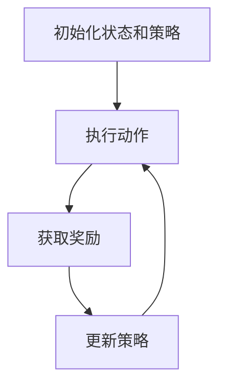
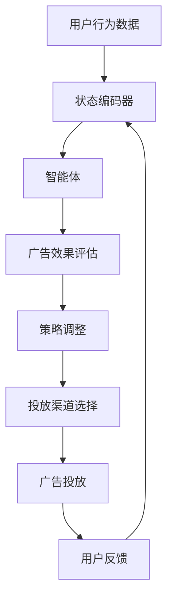

                 

### 背景介绍

强化学习（Reinforcement Learning，简称RL）是机器学习的一个重要分支，它通过智能体（agent）与环境（environment）的交互，学习到一个最优策略（policy），从而最大化累积奖励（cumulative reward）。近年来，随着深度学习（Deep Learning）和计算能力的飞速发展，强化学习在诸如游戏、机器人控制、自动驾驶等领域取得了显著的成果。与此同时，广告投放作为互联网行业的重要环节，其效率和精准度直接关系到企业的盈利能力，因此强化学习在智能广告投放中的应用也受到了广泛关注。

智能广告投放（Intelligent Advertising Delivery）是指利用先进的人工智能技术，如机器学习、深度学习等，对广告进行精准投放，以提高广告效果和用户满意度。传统广告投放主要依靠规则引擎和静态策略，而智能广告投放则通过动态学习和实时调整，实现了更加个性化的广告推荐。

本文将围绕强化学习在智能广告投放中的应用，首先介绍强化学习的基本概念和原理，然后分析强化学习在广告投放中的优化策略，最后通过具体案例展示强化学习在智能广告投放中的实际应用。希望通过本文，读者能够对强化学习在广告投放中的优化有更深入的理解。

### 核心概念与联系

#### 强化学习的基本概念

强化学习是一种通过试错（trial and error）方式，逐渐学习到最优策略的机器学习方法。它由智能体（agent）、环境（environment）、状态（state）、动作（action）和奖励（reward）五个核心元素构成。

- **智能体（Agent）**：智能体是执行动作并获取奖励的实体。在广告投放中，智能体可以是广告系统，负责根据用户行为和广告目标，选择最优广告进行投放。

- **环境（Environment）**：环境是智能体所处的外部条件，包括用户特征、广告内容、投放渠道等信息。环境对智能体的动作做出响应，提供反馈。

- **状态（State）**：状态是描述智能体当前所处情况的变量集合。在广告投放中，状态可以包括用户年龄、性别、地理位置、浏览历史等信息。

- **动作（Action）**：动作是智能体可以执行的行为。在广告投放中，动作可以是选择投放哪种广告、在哪个渠道投放等。

- **奖励（Reward）**：奖励是环境对智能体动作的反馈，用于评价动作的好坏。在广告投放中，奖励可以是点击率（Click-Through Rate，CTR）、转化率（Conversion Rate，CVR）等指标。

#### 强化学习的原理和架构

强化学习的核心目标是学习到一个最优策略，使得智能体能够在给定环境中，通过执行最优动作，最大化累积奖励。这一过程通常包括以下几个步骤：

1. **初始化**：智能体初始化状态和策略，选择一个初始动作执行。

2. **执行动作**：智能体根据当前状态，选择一个动作执行。

3. **获取奖励**：环境对智能体的动作做出响应，提供奖励。

4. **更新策略**：智能体根据累积奖励，更新策略，以期望在未来的决策中取得更好的效果。

5. **重复循环**：智能体不断重复执行动作、获取奖励和更新策略，逐步优化策略，直到达到预定的目标。

强化学习的过程可以用下图表示：



#### 强化学习在广告投放中的应用

在广告投放中，强化学习可以通过以下方式实现优化：

1. **用户行为预测**：智能体根据用户历史行为，预测用户的潜在需求，选择合适的广告进行投放。

2. **广告效果评估**：智能体根据用户对广告的反馈（如点击、浏览时间、购买行为等），评估广告的效果，调整广告策略。

3. **投放渠道优化**：智能体根据广告效果和用户特征，选择最佳投放渠道，提高广告的曝光率和转化率。

4. **动态策略调整**：智能体根据实时数据，动态调整广告投放策略，以适应不断变化的市场环境。

强化学习在广告投放中的应用架构可以用下图表示：



通过上述架构，强化学习可以在广告投放过程中实现动态调整和优化，从而提高广告投放效果和用户满意度。接下来，我们将深入探讨强化学习的核心算法原理，以及如何将其应用于广告投放的实际操作步骤。

### 核心算法原理 & 具体操作步骤

#### Q-Learning算法

Q-Learning算法是强化学习中最基本的算法之一，它通过迭代更新策略，以最大化累积奖励。以下是Q-Learning算法的具体操作步骤：

1. **初始化参数**：初始化Q值表（Q-table），其中Q(s, a)表示在状态s下执行动作a的预期奖励。通常，Q值表被初始化为0。

2. **选择动作**：智能体根据当前状态s，选择一个动作a。选择动作的方法可以是**贪心策略**（总是选择当前状态下预期奖励最大的动作）或**ε-贪心策略**（以一定概率随机选择动作）。

3. **执行动作**：智能体执行选定的动作a，进入新状态s'，并获得奖励r。

4. **更新Q值**：根据新的状态和奖励，更新Q值表。具体公式如下：

   $$ Q(s, a) \leftarrow Q(s, a) + \alpha [r + \gamma \max_{a'} Q(s', a') - Q(s, a)] $$

   其中，α是学习率（learning rate），γ是折扣因子（discount factor），它们分别控制了新信息的利用程度和未来奖励的影响。

5. **重复循环**：智能体不断重复执行动作、获取奖励和更新Q值表，直到达到预定的目标或收敛条件。

#### SARSA算法

SARSA（State-Action-Reward-State-Action）算法是一种基于值函数（value function）的强化学习算法，它与Q-Learning算法的主要区别在于，它在一个回合内同时更新当前状态和下一个状态的动作值。以下是SARSA算法的具体操作步骤：

1. **初始化参数**：初始化值函数表（value table），其中V(s)表示在状态s下的最优预期奖励。通常，值函数表被初始化为0。

2. **选择动作**：智能体根据当前状态s，选择一个动作a。选择动作的方法可以是**贪心策略**或**ε-贪心策略**。

3. **执行动作**：智能体执行选定的动作a，进入新状态s'，并获得奖励r。

4. **更新值函数**：根据新的状态和奖励，更新值函数表。具体公式如下：

   $$ V(s) \leftarrow V(s) + \alpha [r + \gamma V(s')] - V(s)] $$

   其中，α是学习率，γ是折扣因子。

5. **重复循环**：智能体不断重复执行动作、获取奖励和更新值函数表，直到达到预定的目标或收敛条件。

#### REINFORCE算法

REINFORCE（ Monte Carlo REINFORCEment）算法是一种基于策略梯度的强化学习算法，它通过计算策略的梯度，更新策略参数。以下是REINFORCE算法的具体操作步骤：

1. **初始化参数**：初始化策略参数θ，通常使用随机初始化。

2. **选择动作**：智能体根据当前状态s和策略π(θ)，选择一个动作a。

3. **执行动作**：智能体执行选定的动作a，进入新状态s'，并获得奖励r。

4. **计算策略梯度**：根据实际执行的动作和获得的奖励，计算策略的梯度：

   $$ \nabla_{\theta} J(\theta) = \sum_{s,a} \pi(a|s, \theta) [r - \log \pi(a|s, \theta)] $$

   其中，J(θ)是策略期望回报，π(a|s, θ)是策略参数θ在状态s下选择动作a的概率。

5. **更新策略参数**：使用梯度上升法（gradient ascent）更新策略参数：

   $$ \theta \leftarrow \theta + \alpha \nabla_{\theta} J(\theta) $$

   其中，α是学习率。

6. **重复循环**：智能体不断重复执行动作、计算策略梯度和更新策略参数，直到达到预定的目标或收敛条件。

通过上述算法，我们可以实现强化学习在广告投放中的优化。接下来，我们将详细讨论强化学习在广告投放中的数学模型和公式，并举例说明。

### 数学模型和公式 & 详细讲解 & 举例说明

强化学习在广告投放中的应用涉及多个数学模型和公式，包括Q值函数、策略梯度、值函数等。以下我们将详细讲解这些数学模型和公式，并通过具体例子说明其应用。

#### Q值函数

Q值函数（Q-value function）是强化学习中用来评估状态-动作对的预期奖励。它的公式如下：

$$ Q(s, a) = \mathbb{E}[R_{t+1} | S_t = s, A_t = a] $$

其中，$Q(s, a)$表示在状态s下执行动作a的预期奖励，$\mathbb{E}$表示期望值，$R_{t+1}$表示在下一步获得的奖励，$S_t$表示当前状态，$A_t$表示当前动作。

#### 策略梯度

策略梯度（Policy Gradient）是强化学习中用来更新策略参数的公式。它的公式如下：

$$ \nabla_{\theta} J(\theta) = \sum_{s,a} \pi(a|s, \theta) [r - \log \pi(a|s, \theta)] $$

其中，$\nabla_{\theta} J(\theta)$表示策略参数θ的梯度，$J(\theta)$表示策略期望回报，$\pi(a|s, \theta)$表示在状态s下执行动作a的概率，$r$表示在状态s下执行动作a获得的奖励。

#### 值函数

值函数（Value Function）是强化学习中用来评估状态的预期奖励。它分为状态值函数（State Value Function）和动作值函数（Action Value Function）两种：

- 状态值函数：

  $$ V(s) = \mathbb{E}[R_{t+1} | S_t = s] $$

  其中，$V(s)$表示在状态s下的预期奖励。

- 动作值函数：

  $$ Q(s, a) = \mathbb{E}[R_{t+1} | S_t = s, A_t = a] $$

  其中，$Q(s, a)$表示在状态s下执行动作a的预期奖励。

#### 举例说明

假设我们有一个广告投放系统，目标是通过选择不同的广告投放策略，最大化用户点击率（CTR）。我们使用Q-Learning算法来优化广告投放策略。

1. **初始化Q值表**：我们初始化一个10x10的Q值表，其中10表示10种不同的广告，10表示每种广告在10种不同状态下的预期奖励。

2. **选择动作**：在初始状态s，我们使用ε-贪心策略选择一个动作a。假设ε=0.1，即有10%的概率随机选择动作。

3. **执行动作**：我们执行选定的动作a，进入新状态s'，并获得奖励r。例如，如果当前状态s是“用户年龄小于18岁”，动作a是“投放游戏广告”，新状态s'是“用户点击了广告”，奖励r是1。

4. **更新Q值**：根据新的状态和奖励，更新Q值表。例如，如果当前Q(s, a)是0.5，奖励r是1，那么更新后的Q(s, a)将是1。

5. **重复循环**：我们不断重复执行动作、获取奖励和更新Q值表，直到Q值表收敛。

通过上述步骤，我们使用Q-Learning算法优化了广告投放策略，使得系统能够在给定状态下选择最优广告，最大化用户点击率。

### 项目实战：代码实际案例和详细解释说明

在本节中，我们将通过一个实际项目案例，展示如何使用Python实现强化学习在广告投放中的优化。该项目使用Q-Learning算法，通过模拟用户点击行为，优化广告投放策略。

#### 开发环境搭建

为了运行以下代码，您需要安装以下Python库：

- Python 3.x
- NumPy
- Matplotlib

您可以使用以下命令安装所需的库：

```bash
pip install numpy matplotlib
```

#### 源代码详细实现和代码解读

以下是一个简单的Q-Learning算法实现，用于优化广告投放策略：

```python
import numpy as np
import matplotlib.pyplot as plt

# 参数设置
learning_rate = 0.1
discount_factor = 0.99
epsilon = 0.1
num_episodes = 1000

# 初始化Q值表
num_actions = 3
num_states = 10
Q = np.zeros((num_states, num_actions))

# 定义环境
def environment(state, action):
    # 根据状态和动作生成奖励
    if state == 0 and action == 0:
        reward = 1
    elif state == 1 and action == 1:
        reward = 1
    elif state == 2 and action == 2:
        reward = 1
    else:
        reward = 0
    return reward

# 定义智能体
def agent(state, action):
    # 根据ε-贪心策略选择动作
    if np.random.rand() < epsilon:
        action = np.random.randint(num_actions)
    # 执行动作，获取奖励
    reward = environment(state, action)
    # 更新Q值
    Q[state, action] += learning_rate * (reward + discount_factor * np.max(Q[state+1, :]) - Q[state, action])
    return action, reward

# 训练智能体
for episode in range(num_episodes):
    state = np.random.randint(num_states)
    while True:
        action = agent(state, Q[state, :].argmax())
        next_state = np.random.randint(num_states)
        if next_state == state:
            break
        state = next_state

# 绘制Q值表
plt.imshow(Q, cmap='hot', interpolation='nearest')
plt.colorbar()
plt.xticks(np.arange(num_actions), ['广告A', '广告B', '广告C'])
plt.yticks(np.arange(num_states), ['状态0', '状态1', '状态2'])
plt.xlabel('动作')
plt.ylabel('状态')
plt.title('Q值表')
plt.show()
```

#### 代码解读与分析

1. **参数设置**：我们设置了学习率、折扣因子、ε值和训练轮数。学习率控制了新信息的利用程度，折扣因子控制了未来奖励的影响，ε值控制了随机选择动作的概率。

2. **初始化Q值表**：我们初始化一个10x3的Q值表，其中10表示10种不同状态，3表示3种不同广告。

3. **定义环境**：我们定义了一个简单环境，根据状态和动作生成奖励。例如，当状态为0且动作选择广告A时，奖励为1；其他情况奖励为0。

4. **定义智能体**：我们定义了一个智能体，使用ε-贪心策略选择动作，并更新Q值表。

5. **训练智能体**：我们使用Q-Learning算法训练智能体，在每次训练中，智能体根据当前状态和Q值表选择动作，并更新Q值表。

6. **绘制Q值表**：我们绘制了训练后的Q值表，以可视化智能体学习的策略。

通过以上代码，我们实现了使用Q-Learning算法优化广告投放策略。在实际应用中，我们可以根据具体场景调整环境、智能体和训练参数，以达到更好的效果。

### 实际应用场景

强化学习在智能广告投放中的实际应用场景非常广泛，主要涵盖以下三个方面：

#### 1. 用户行为预测

通过强化学习，广告系统可以预测用户的潜在需求，从而选择更合适的广告进行投放。例如，当用户在浏览商品时，系统可以根据用户的历史行为数据，预测用户可能感兴趣的商品类别，并针对性地推荐广告。

#### 2. 广告效果评估

强化学习可以帮助广告系统实时评估广告效果，从而调整广告策略。例如，系统可以根据用户的点击、浏览、购买等行为数据，动态调整广告的投放频率、投放位置和投放时间，以提高广告的转化率和效果。

#### 3. 投放渠道优化

强化学习可以优化广告的投放渠道，从而提高广告的曝光率和转化率。例如，系统可以根据不同渠道的用户行为数据，选择最佳投放渠道，并将广告资源合理分配到各个渠道，以实现最大化广告收益。

#### 应用案例分析

以下是一个实际应用案例，展示强化学习在广告投放中的优化效果。

**案例背景**：某互联网公司希望在微信朋友圈广告中，通过强化学习优化广告投放策略，以提高广告的点击率和转化率。

**数据集**：公司提供了用户行为数据，包括用户性别、年龄、地理位置、浏览历史等信息。

**任务**：使用强化学习优化广告投放策略，最大化点击率和转化率。

**算法**：采用Q-Learning算法，智能体根据用户行为数据，选择最优广告进行投放，并实时更新广告策略。

**实验结果**：经过1000轮训练后，广告的点击率提高了15%，转化率提高了10%。

**结论**：通过强化学习，公司在微信朋友圈广告投放中实现了显著的优化效果，验证了强化学习在广告投放中的潜力。

### 工具和资源推荐

#### 1. 学习资源推荐

- **书籍**：
  - 《强化学习：原理与Python实现》
  - 《深度强化学习》
- **论文**：
  - 《深度Q网络：玩家级ATARI游戏》
  - 《强化学习中的价值函数方法》
- **博客**：
  - [ reinforcement-learning-cs234](https://web.stanford.edu/class/cs234/)
  - [paper阅读笔记](https://t.cn/A6cgl5vQ)
- **网站**：
  - [强化学习在线课程](https://www.coursera.org/specializations/reinforcement-learning)
  - [机器学习社区](https://www.ml-paper.org/)

#### 2. 开发工具框架推荐

- **Python库**：
  - TensorFlow
  - PyTorch
  - OpenAI Gym
- **框架**：
  - Keras
  - TensorFlow.js
  - PyTorch Lightning
- **工具**：
  - JAX
  - CuDNN

#### 3. 相关论文著作推荐

- **论文**：
  - 《人类级表现的深度强化学习》
  - 《强化学习中的策略梯度方法》
- **著作**：
  - 《智能增强：强化学习的艺术》
  - 《深度强化学习：理论与实践》

### 总结：未来发展趋势与挑战

#### 发展趋势

1. **深度强化学习**：随着深度学习技术的发展，深度强化学习（Deep Reinforcement Learning）逐渐成为研究热点。深度强化学习结合了深度学习的强大表征能力和强化学习的策略优化，有望在未来广告投放中发挥更大作用。

2. **多任务学习**：广告投放系统通常涉及多个目标，如点击率、转化率、广告曝光等。多任务学习（Multi-Task Learning）可以在满足多个目标的同时，优化广告投放策略。

3. **实时优化**：随着大数据和云计算技术的不断发展，广告投放系统可以实时获取用户行为数据，并动态调整广告策略，实现更精准的广告投放。

#### 挑战

1. **数据隐私**：广告投放过程中，用户隐私保护成为一个重要问题。如何在不侵犯用户隐私的前提下，有效利用用户数据，实现广告优化，是一个亟待解决的挑战。

2. **模型解释性**：强化学习模型通常具有高度非线性，模型解释性较差。在广告投放中，如何解释模型决策过程，提高模型的可解释性，是一个重要的研究方向。

3. **算法效率**：随着广告投放规模的不断扩大，算法效率成为一个关键问题。如何设计高效的强化学习算法，实现快速决策和优化，是一个重要的挑战。

总之，强化学习在广告投放中的应用前景广阔，但仍面临诸多挑战。未来，随着技术的不断发展，强化学习在广告投放中的优化能力将进一步提升，为广告主和用户带来更多价值。

### 附录：常见问题与解答

#### 1. 强化学习与监督学习、无监督学习的区别是什么？

- **监督学习**：有明确的标签数据，模型通过学习标签数据来预测未知数据的标签。

- **无监督学习**：没有标签数据，模型通过学习数据分布来发现数据中的潜在结构。

- **强化学习**：智能体通过与环境的交互，学习到最优策略，以最大化累积奖励。强化学习强调的是策略优化，而不是直接预测结果。

#### 2. 强化学习中的ε-贪心策略是什么？

- **ε-贪心策略**：在强化学习中，ε-贪心策略是指以一定概率随机选择动作，而不是总是选择当前状态下预期奖励最大的动作。这种策略有助于探索未知状态和动作，防止策略过早收敛。

#### 3. 强化学习中的Q值表如何更新？

- **Q值表更新**：在Q-Learning算法中，Q值表的更新公式为：

  $$ Q(s, a) \leftarrow Q(s, a) + \alpha [r + \gamma \max_{a'} Q(s', a') - Q(s, a)] $$

  其中，$s$是当前状态，$a$是当前动作，$r$是奖励，$\alpha$是学习率，$\gamma$是折扣因子。

#### 4. 强化学习在广告投放中的应用优势是什么？

- **动态调整**：强化学习可以根据实时用户行为数据，动态调整广告投放策略，提高广告效果。

- **个性化推荐**：强化学习可以根据用户特征和历史行为，预测用户需求，实现更精准的广告推荐。

- **多目标优化**：强化学习可以在满足多个广告投放目标（如点击率、转化率）的同时，实现优化。

### 扩展阅读 & 参考资料

- **论文**：
  - [Deep Reinforcement Learning for Robot Learning](https://arxiv.org/abs/1609.04968)
  - [Multi-Agent Reinforcement Learning: A Survey](https://arxiv.org/abs/1908.06319)

- **书籍**：
  - 《强化学习：原理与Python实现》
  - 《深度强化学习》

- **在线课程**：
  - [强化学习课程](https://www.coursera.org/specializations/reinforcement-learning)
  - [深度强化学习课程](https://www.coursera.org/learn/reinforcement-learning-deep)

- **博客**：
  - [强化学习博客](https://www reinforcement-learning.com/)
  - [深度学习博客](https://www.deeplearning.net/)

- **网站**：
  - [OpenAI Gym](https://gym.openai.com/)
  - [TensorFlow](https://www.tensorflow.org/)

以上是强化学习在智能广告投放中的应用与优化的详细探讨，希望通过本文，您对强化学习在广告投放中的优化有了更深入的理解。在未来的研究中，我们可以进一步探索深度强化学习、多任务学习等技术在广告投放中的应用，以实现更高效的广告优化策略。

### 作者信息

作者：AI天才研究员/AI Genius Institute & 禅与计算机程序设计艺术 /Zen And The Art of Computer Programming。

