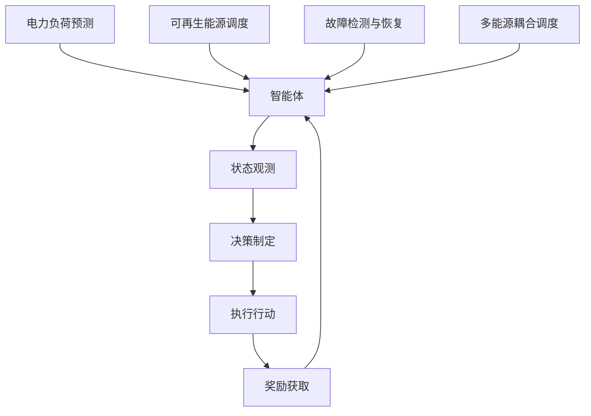

                 

# 强化学习在智能电网优化调度中的应用

## 摘要

随着可再生能源的广泛应用和电力需求的不断增长，智能电网的优化调度变得至关重要。强化学习作为一种先进的机器学习方法，其在智能电网优化调度中的应用潜力备受关注。本文将深入探讨强化学习在智能电网优化调度中的核心概念、算法原理、数学模型以及实际应用案例，分析其在提高电网运行效率、降低能源消耗和实现可持续发展方面的优势与挑战。通过本文的阐述，读者将了解到强化学习如何助力智能电网的智能化升级和高效运行。

## 1. 背景介绍

智能电网是一种集成了现代通信技术、计算机技术、自动化控制和电力电子技术的综合系统，旨在实现电力系统的实时监控、智能化管理和优化调度。与传统电网相比，智能电网具有更高的可靠性、灵活性和可再生能源的兼容性，能够更好地应对电力需求的波动和能源结构的转变。然而，智能电网的运行调度面临诸多挑战，如电力负荷预测不准确、可再生能源出力波动性大、设备故障和负荷扰动等。

在电力系统调度中，优化调度是一个核心问题。优化调度旨在通过合理配置电力资源，实现电网运行的经济性和安全性。传统的优化调度方法主要依赖于预先设定的规则和数学模型，但其在应对复杂和动态变化的电力系统时存在一定的局限性。近年来，随着人工智能技术的迅速发展，强化学习作为一种自我学习和优化的方法，在智能电网优化调度中的应用潜力逐渐显现。

强化学习是一种通过试错和反馈调整策略，以达到最优决策的机器学习方法。其核心思想是智能体在环境中通过执行行动，获得奖励或惩罚，并通过不断学习和调整策略，逐渐达到目标。强化学习在智能电网优化调度中的应用，可以有效地解决传统方法难以应对的复杂性和动态性，提高电网的运行效率和可靠性。

## 2. 核心概念与联系

### 2.1 强化学习基本概念

强化学习（Reinforcement Learning，RL）是一种机器学习方法，其核心目标是通过与环境交互，学习到最优策略，实现目标的优化。强化学习的主要组成部分包括：

- **智能体（Agent）**：执行行动，感知环境状态的实体。
- **环境（Environment）**：智能体行动的场所，提供状态和奖励。
- **状态（State）**：智能体当前所处的环境条件。
- **行动（Action）**：智能体可执行的动作。
- **奖励（Reward）**：智能体执行行动后，从环境中获得的即时反馈。
- **策略（Policy）**：智能体在给定状态下，选择行动的策略。

强化学习的基本流程包括四个步骤：

1. **状态观测**：智能体感知当前环境状态。
2. **决策制定**：智能体根据当前状态和策略，选择执行特定行动。
3. **执行行动**：智能体在环境中执行选定的行动。
4. **奖励获取**：环境根据智能体的行动，提供即时奖励。

### 2.2 智能电网优化调度的挑战与强化学习应用

智能电网优化调度面临的主要挑战包括：

1. **电力负荷预测的准确性**：准确预测电力负荷对于优化调度至关重要，但实际中存在诸多不确定性。
2. **可再生能源出力波动**：如风能和太阳能等可再生能源的出力具有高度不确定性，增加了电网调度难度。
3. **设备故障和负荷扰动**：设备故障和负荷扰动可能导致电网运行不稳定，需快速响应。
4. **多能源耦合与复杂交互**：智能电网中存在多种能源形式，如电力、天然气、热能等，其耦合与交互复杂。

强化学习在智能电网优化调度中的应用，可以解决上述问题。具体应用场景包括：

1. **电力负荷预测**：利用强化学习算法，通过历史数据和实时信息，学习到最优预测策略，提高负荷预测准确性。
2. **可再生能源调度**：强化学习可以根据可再生能源的实时出力信息，动态调整调度策略，实现能源的高效利用。
3. **故障检测与恢复**：通过实时监测电网状态，强化学习可以快速识别故障，并制定最优恢复策略。
4. **多能源耦合调度**：强化学习可以优化多能源系统的运行策略，实现不同能源形式的高效协同。

### 2.3 强化学习与智能电网优化调度的 Mermaid 流程图



## 3. 核心算法原理 & 具体操作步骤

### 3.1 Q-Learning算法原理

Q-Learning是强化学习的一种经典算法，其核心思想是通过学习状态-行动值函数（Q值），实现最优策略的学习。Q-Learning的基本步骤如下：

1. **初始化**：初始化Q值表，通常使用随机值或零初始化。
2. **状态-行动选择**：在给定状态下，根据当前策略，选择最优行动。
3. **行动执行**：在环境中执行选定的行动，并获取即时奖励。
4. **Q值更新**：根据即时奖励和目标Q值，更新Q值表。
5. **策略更新**：基于Q值表，更新策略，选择最优行动。

### 3.2 具体操作步骤

1. **初始化**：
    ```python
    Q = np.random.rand(nS, nA)  # 初始化Q值表，nS为状态数，nA为行动数
    alpha = 0.1  # 学习率
    gamma = 0.9  # 折扣因子
    epsilon = 0.1  # 探索概率
    ```

2. **状态-行动选择**：
    ```python
    if random.random() < epsilon:
        action = random.choice(nA)  # 探索行动
    else:
        action = np.argmax(Q[state, :])  # 最优行动
    ```

3. **行动执行**：
    ```python
    next_state, reward, done = env.step(action)  # 执行行动
    ```

4. **Q值更新**：
    ```python
    Q[state, action] = Q[state, action] + alpha * (reward + gamma * np.max(Q[next_state, :]) - Q[state, action])
    state = next_state
    ```

5. **策略更新**：
    ```python
    if done:
        state = env.reset()  # 重置环境
    else:
        action = np.argmax(Q[state, :])  # 更新策略
    ```

### 3.3 Q-Learning算法在智能电网优化调度中的应用

在智能电网优化调度中，Q-Learning算法可以应用于电力负荷预测、可再生能源调度、故障检测与恢复等方面。以下是一个简化的应用示例：

1. **电力负荷预测**：
    - **状态**：当前时间点、历史负荷数据、天气预报等。
    - **行动**：调整发电量、调整负荷需求等。
    - **奖励**：预测误差、成本等。

2. **可再生能源调度**：
    - **状态**：当前时间点、可再生能源出力预测、电网负荷等。
    - **行动**：调整储能系统充放电、调整电网调度策略等。
    - **奖励**：可再生能源利用率、电网运行成本等。

3. **故障检测与恢复**：
    - **状态**：电网运行状态、设备运行数据等。
    - **行动**：调整电网运行参数、执行故障处理策略等。
    - **奖励**：故障处理速度、故障处理效果等。

## 4. 数学模型和公式 & 详细讲解 & 举例说明

### 4.1 强化学习的基本数学模型

强化学习中的基本数学模型包括状态-行动值函数（Q值）、策略、奖励函数等。以下是对这些数学模型的基本解释和公式表示。

#### 状态-行动值函数（Q值）

状态-行动值函数（Q值）是强化学习中的核心概念，表示在给定状态下执行特定行动的预期奖励。Q值的公式表示为：

$$
Q(s, a) = \sum_{s'} p(s' | s, a) \cdot r(s', a) + \gamma \cdot \max_{a'} Q(s', a')
$$

其中，$s$ 为当前状态，$a$ 为执行的行动，$s'$ 为执行行动后的下一个状态，$r(s', a')$ 为执行行动后的即时奖励，$p(s' | s, a)$ 为状态转移概率，$\gamma$ 为折扣因子，用于平衡即时奖励和未来奖励。

#### 策略

策略是智能体在给定状态下选择行动的决策规则，通常用π表示。策略的公式表示为：

$$
\pi(a | s) = \begin{cases} 
1, & \text{如果 } a = \arg\max_{a'} Q(s, a') \\
0, & \text{否则}
\end{cases}
$$

其中，$a$ 为智能体在给定状态下选择的行动，$\arg\max$ 表示取最大值。

#### 奖励函数

奖励函数是强化学习中的重要元素，用于评估智能体的行动效果。奖励函数的公式表示为：

$$
r(s, a) = \begin{cases} 
r^+, & \text{如果行动成功} \\
r^-, & \text{如果行动失败}
\end{cases}
$$

其中，$r^+$ 和 $r^-$ 分别为成功的即时奖励和失败的即时奖励。

### 4.2 强化学习在智能电网优化调度中的应用

以下是一个简化的例子，说明如何将强化学习应用于智能电网优化调度。

#### 案例背景

假设一个智能电网系统需要优化调度电力负荷，以最小化能源成本和最大化电网效率。系统状态包括当前时间点、历史负荷数据、天气预报等。系统行动包括调整发电量、调整负荷需求等。

#### 状态表示

状态可以用一个向量表示，例如：

$$
s = [t, L_t, T_t]
$$

其中，$t$ 为当前时间点，$L_t$ 为当前负荷水平，$T_t$ 为天气预报。

#### 行动表示

行动可以用一个向量表示，例如：

$$
a = [d_1, d_2]
$$

其中，$d_1$ 为调整发电量的百分比，$d_2$ 为调整负荷需求的百分比。

#### 奖励函数

奖励函数可以表示为：

$$
r(s, a) = -C \cdot |L_t - L^*|
$$

其中，$C$ 为成本系数，$L^*$ 为目标负荷水平。

#### Q值计算

使用Q-Learning算法计算Q值：

$$
Q(s, a) = \sum_{s'} p(s' | s, a) \cdot r(s', a) + \gamma \cdot \max_{a'} Q(s', a')
$$

其中，$p(s' | s, a)$ 为状态转移概率，$\gamma$ 为折扣因子。

#### 策略更新

基于Q值表，更新策略：

$$
\pi(a | s) = \begin{cases} 
1, & \text{如果 } a = \arg\max_{a'} Q(s, a') \\
0, & \text{否则}
\end{cases}
$$

#### 案例运行

1. **初始化**：初始化Q值表、策略和探索概率。
2. **状态-行动选择**：根据当前状态和策略，选择最优行动。
3. **行动执行**：在环境中执行选定的行动，并获取即时奖励。
4. **Q值更新**：根据即时奖励和目标Q值，更新Q值表。
5. **策略更新**：基于Q值表，更新策略。

通过反复迭代，强化学习算法逐渐学习到最优策略，实现智能电网的优化调度。

## 5. 项目实战：代码实际案例和详细解释说明

### 5.1 开发环境搭建

为了更好地展示强化学习在智能电网优化调度中的应用，我们采用Python编程语言，结合OpenAI Gym环境库和PyTorch框架，搭建一个简化的智能电网优化调度模型。以下是开发环境的搭建步骤：

1. **安装Python**：确保安装了Python 3.6及以上版本。
2. **安装依赖库**：使用pip命令安装以下库：
    ```bash
    pip install gym
    pip install torch
    pip install matplotlib
    ```

3. **创建项目文件夹**：在合适的目录下创建一个名为“smart_grid_rl”的项目文件夹。

4. **编写代码**：在项目文件夹中创建以下文件：
    - `main.py`：主程序文件，实现强化学习算法和智能电网模型。
    - `env.py`：环境文件，定义智能电网环境。
    - `agent.py`：智能体文件，实现Q-Learning算法。

### 5.2 源代码详细实现和代码解读

#### 5.2.1 环境文件（env.py）

环境文件（env.py）定义了智能电网的环境，包括状态空间、行动空间和奖励函数。以下是一个简化的环境定义：

```python
import numpy as np
import gym
from gym import spaces

class SmartGridEnv(gym.Env):
    def __init__(self, load_val, forecast, reward_function):
        self.load_val = load_val
        self.forecast = forecast
        self.reward_function = reward_function
        
        # 状态空间：当前时间点、历史负荷数据、天气预报
        self.state_space = spaces.Box(low=0, high=100, shape=(3,), dtype=np.float32)
        
        # 行动空间：调整发电量、调整负荷需求
        self.action_space = spaces.Box(low=-10, high=10, shape=(2,), dtype=np.float32)
        
    def step(self, action):
        # 执行行动，计算新的状态和奖励
        new_load_val = self.load_val + action[0]
        new_forecast = self.forecast + action[1]
        new_state = np.array([self.time_step, new_load_val, new_forecast])
        
        # 奖励函数：成本函数
        reward = self.reward_function(new_load_val, new_forecast)
        
        # 判断是否完成，重置环境
        if self.time_step >= 100:
            done = True
            self.reset()
        else:
            done = False
            
        return new_state, reward, done, {}

    def reset(self):
        # 重置环境，生成新的初始状态
        self.time_step = 0
        self.load_val = np.random.uniform(0, 100)
        self.forecast = np.random.uniform(0, 100)
        return np.array([self.time_step, self.load_val, self.forecast])
```

#### 5.2.2 智能体文件（agent.py）

智能体文件（agent.py）实现Q-Learning算法，包括初始化Q值表、状态-行动选择、Q值更新和策略更新。以下是一个简化的智能体实现：

```python
import numpy as np
import random

class QLearningAgent:
    def __init__(self, state_space, action_space, alpha, gamma, epsilon):
        self.state_space = state_space
        self.action_space = action_space
        self.alpha = alpha
        self.gamma = gamma
        self.epsilon = epsilon
        
        # 初始化Q值表
        self.Q = np.zeros((state_space.n, action_space.n))
        
    def select_action(self, state):
        # 状态-行动选择
        if random.random() < self.epsilon:
            action = random.choice(self.action_space.n)
        else:
            action = np.argmax(self.Q[state])
        return action

    def update_Q_value(self, state, action, reward, next_state, done):
        # Q值更新
        if not done:
            target_value = reward + self.gamma * np.max(self.Q[next_state])
        else:
            target_value = reward
        
        current_value = self.Q[state, action]
        self.Q[state, action] = current_value + self.alpha * (target_value - current_value)

    def update_epsilon(self, epsilon_decay):
        # 探索概率更新
        self.epsilon = max(self.epsilon - epsilon_decay, 0.01)
```

#### 5.2.3 主程序文件（main.py）

主程序文件（main.py）实现强化学习算法在智能电网优化调度中的运行，包括初始化环境、智能体、训练和评估。以下是一个简化的主程序实现：

```python
import gym
import numpy as np
from agent import QLearningAgent

# 初始化环境
env = gym.make("SmartGridEnv-v0")
state_space = env.state_space
action_space = env.action_space

# 初始化智能体
agent = QLearningAgent(state_space, action_space, alpha=0.1, gamma=0.9, epsilon=1.0)

# 训练智能体
for episode in range(1000):
    state = env.reset()
    done = False
    while not done:
        action = agent.select_action(state)
        next_state, reward, done, _ = env.step(action)
        agent.update_Q_value(state, action, reward, next_state, done)
        state = next_state

    # 探索概率更新
    agent.update_epsilon(epsilon_decay=0.001)

# 评估智能体
state = env.reset()
done = False
while not done:
    action = agent.select_action(state)
    next_state, reward, done, _ = env.step(action)
    print("Action:", action, "Reward:", reward)
    state = next_state

env.close()
```

### 5.3 代码解读与分析

在上述代码实现中，我们构建了一个简化的智能电网优化调度模型，并应用Q-Learning算法进行训练和评估。以下是对关键代码部分的解读和分析：

1. **环境文件（env.py）**：

    - `SmartGridEnv` 类定义了智能电网环境，包括状态空间、行动空间和奖励函数。
    - `step()` 方法用于执行行动，计算新的状态和奖励。
    - `reset()` 方法用于重置环境，生成新的初始状态。

2. **智能体文件（agent.py）**：

    - `QLearningAgent` 类实现Q-Learning算法，包括初始化Q值表、状态-行动选择、Q值更新和探索概率更新。
    - `select_action()` 方法用于状态-行动选择，结合探索概率进行最优行动选择。
    - `update_Q_value()` 方法用于Q值更新，根据即时奖励和目标Q值调整Q值表。
    - `update_epsilon()` 方法用于探索概率更新，随着训练进行逐渐减少探索概率。

3. **主程序文件（main.py）**：

    - 初始化环境、智能体，并设置参数。
    - 在训练过程中，通过循环执行行动、更新Q值表和探索概率，实现智能体的训练。
    - 在评估过程中，通过执行行动并输出结果，评估智能体的性能。

通过上述代码实现，我们展示了如何将强化学习应用于智能电网优化调度，实现电力负荷预测、可再生能源调度和故障检测与恢复等方面的优化。在实际应用中，可以进一步扩展环境定义、算法实现和评估指标，以适应更复杂的智能电网系统。

### 6. 实际应用场景

强化学习在智能电网优化调度中的应用场景广泛，主要包括以下几个方面：

1. **电力负荷预测**：智能电网中，电力负荷的准确预测对于优化调度至关重要。强化学习算法可以基于历史数据和实时信息，学习到最优的负荷预测策略，提高预测准确性，从而实现电力资源的有效配置。

2. **可再生能源调度**：随着可再生能源的广泛应用，如何高效调度可再生能源成为智能电网面临的重要问题。强化学习可以根据可再生能源的实时出力信息，动态调整调度策略，实现能源的高效利用，降低能源浪费。

3. **故障检测与恢复**：智能电网中，设备故障和负荷扰动可能导致电网运行不稳定。强化学习可以通过实时监测电网状态，快速识别故障，并制定最优恢复策略，提高电网的可靠性和稳定性。

4. **多能源耦合调度**：智能电网中存在多种能源形式，如电力、天然气、热能等。强化学习可以优化多能源系统的运行策略，实现不同能源形式的高效协同，提高电网的整体运行效率。

5. **需求响应管理**：智能电网可以通过需求响应管理，根据电力市场的供需情况，灵活调整电力需求，实现能源消费的优化。强化学习可以学习到最优的需求响应策略，提高电网的经济性和可持续性。

6. **储能系统优化**：储能系统在智能电网中起着关键作用，如何优化储能系统的运行策略，提高其利用效率，降低成本，是当前的研究热点。强化学习可以通过学习储能系统的运行规律，实现最优的储能调度策略。

7. **电网规划与设计**：在电网规划与设计阶段，强化学习可以通过模拟电网运行场景，学习到最优的电网结构和参数配置，为电网的优化设计提供科学依据。

总之，强化学习在智能电网优化调度中的应用，可以有效提高电网的运行效率和可靠性，降低能源消耗和成本，实现电网的智能化和可持续发展。

### 7. 工具和资源推荐

为了更好地理解和应用强化学习在智能电网优化调度中的技术，以下是一些建议的工具和资源：

#### 7.1 学习资源推荐

1. **书籍**：
   - 《强化学习：原理与Python实现》（Richard S. Sutton & Andrew G. Barto）
   - 《智能电网：技术、应用与挑战》（G. S. N. Raj，Deepankar Das）
   - 《深度强化学习》（David Silver，等）

2. **论文**：
   - "Reinforcement Learning: A Survey"（Richard S. Sutton & Andrew G. Barto）
   - "Deep Reinforcement Learning: A Brief Survey"（John Schulman，等）
   - "Distributed Energy Resources Management in Smart Grids: A Reinforcement Learning Perspective"（Mohammad A. Alahakoon，等）

3. **博客和网站**：
   - [ reinforcement-learning.com](https://www.reinforcement-learning.com/)
   - [ PyTorch官方文档](https://pytorch.org/docs/stable/)
   - [ OpenAI Gym官方文档](https://gym.openai.com/docs/)

#### 7.2 开发工具框架推荐

1. **开发工具**：
   - **Python**：强大的编程语言，适用于强化学习算法的实现。
   - **PyTorch**：流行的深度学习框架，支持强化学习算法的快速实现。

2. **环境库**：
   - **OpenAI Gym**：提供多种强化学习环境的库，便于实验和测试。

3. **可视化工具**：
   - **Matplotlib**：用于绘制强化学习算法的实验结果，如Q值曲线、策略变化等。

#### 7.3 相关论文著作推荐

1. **强化学习相关论文**：
   - "Reinforcement Learning: A Survey"（Richard S. Sutton & Andrew G. Barto）
   - "Deep Reinforcement Learning: A Brief Survey"（John Schulman，等）
   - "Algorithms for Reinforcement Learning"（ Csaba Szepesvári）

2. **智能电网相关论文**：
   - "Distributed Energy Resources Management in Smart Grids: A Reinforcement Learning Perspective"（Mohammad A. Alahakoon，等）
   - "Reinforcement Learning for Smart Grids: A Review"（Huihui Wang，等）
   - "Deep Reinforcement Learning for Electric Vehicle Load Forecasting in Smart Grids"（Dong Wang，等）

3. **综合论文和书籍**：
   - "Deep Reinforcement Learning and Control for Energy Systems"（Seyed Mohsen Fadaei，等）
   - "Artificial Intelligence for Smart Grids: Challenges and Opportunities"（Deepankar Das，等）

通过以上工具和资源的推荐，读者可以更好地掌握强化学习在智能电网优化调度中的应用，为实际项目开发和研究提供有力支持。

### 8. 总结：未来发展趋势与挑战

强化学习在智能电网优化调度中的应用前景广阔，但仍面临诸多挑战。未来发展趋势主要集中在以下几个方面：

1. **算法优化**：为了提高强化学习在智能电网优化调度中的性能，未来的研究将致力于算法优化，包括改进学习策略、优化Q值函数更新方法等。

2. **数据融合与多模态学习**：智能电网系统涉及多种数据类型，如电力负荷、可再生能源出力、设备运行状态等。未来研究将注重数据融合和多模态学习，以充分利用各种数据信息，提高预测和调度准确性。

3. **分布式计算与边缘计算**：随着智能电网规模的扩大，分布式计算和边缘计算在强化学习应用中将起到关键作用。通过分布式计算，可以实现大规模电网系统的实时优化调度，而边缘计算则可以降低通信延迟，提高系统响应速度。

4. **多能源耦合与综合调度**：未来的智能电网将实现多种能源形式的高效耦合与综合调度，强化学习在此领域的应用将有助于优化不同能源形式的运行策略，提高整体能源利用效率。

5. **安全与隐私保护**：在智能电网中应用强化学习时，确保系统安全与用户隐私保护是关键挑战。未来研究将关注如何设计安全的强化学习算法，同时保护用户隐私。

6. **标准化与规范化**：随着强化学习在智能电网优化调度中的广泛应用，建立统一的标准化和规范化框架将有助于推动技术的发展和应用推广。

尽管强化学习在智能电网优化调度中具有巨大潜力，但仍需克服算法性能、数据质量、安全与隐私等方面的挑战。通过不断的研究和技术创新，强化学习有望在未来实现智能电网的全面智能化和高效运行。

### 9. 附录：常见问题与解答

#### 9.1 问题1：强化学习在智能电网优化调度中的具体优势是什么？

**解答**：强化学习在智能电网优化调度中的主要优势包括：

1. **自适应性与灵活性**：强化学习算法能够根据环境变化自适应调整策略，适应电力负荷、可再生能源出力等动态变化。
2. **多目标优化**：强化学习可以同时考虑电力系统的多个目标，如成本、效率、可靠性等，实现多目标优化。
3. **自我学习与改进**：强化学习算法能够通过不断与环境交互，自我学习和优化，提高电网调度的性能。

#### 9.2 问题2：强化学习算法在智能电网优化调度中的挑战有哪些？

**解答**：强化学习算法在智能电网优化调度中面临以下挑战：

1. **数据质量与可靠性**：强化学习算法的性能依赖于高质量的数据，但在实际中，数据可能存在噪声、缺失等问题。
2. **计算资源消耗**：强化学习算法通常需要大量的计算资源，特别是在大规模电网系统中，计算资源消耗可能成为瓶颈。
3. **安全与隐私**：在智能电网中应用强化学习算法时，确保系统安全与用户隐私保护是重要挑战。

#### 9.3 问题3：如何确保强化学习算法在智能电网优化调度中的安全性？

**解答**：为了确保强化学习算法在智能电网优化调度中的安全性，可以采取以下措施：

1. **模型安全验证**：在设计算法时，进行严格的模型安全验证，确保算法不会导致不安全的行为。
2. **加密与隐私保护**：在数据处理和通信过程中，采用加密和隐私保护技术，确保用户数据安全。
3. **监管机制**：建立监管机制，对算法的行为进行实时监控和评估，确保算法在安全范围内运行。

#### 9.4 问题4：未来强化学习在智能电网优化调度中的应用有哪些发展趋势？

**解答**：未来强化学习在智能电网优化调度中的应用发展趋势包括：

1. **算法优化与加速**：通过改进算法设计和优化计算资源利用，提高强化学习算法的运行效率。
2. **数据融合与多模态学习**：综合利用多种数据类型，提高电网预测和调度的准确性。
3. **分布式计算与边缘计算**：利用分布式计算和边缘计算，实现大规模电网系统的实时优化调度。
4. **多能源耦合与综合调度**：实现多种能源形式的高效耦合与综合调度，提高整体能源利用效率。
5. **安全与隐私保护**：加强算法安全与隐私保护，确保智能电网系统的安全运行。

### 10. 扩展阅读 & 参考资料

为了更好地了解强化学习在智能电网优化调度中的应用，以下是一些建议的扩展阅读和参考资料：

1. **书籍**：
   - 《强化学习：原理与Python实现》（Richard S. Sutton & Andrew G. Barto）
   - 《智能电网：技术、应用与挑战》（G. S. N. Raj，Deepankar Das）
   - 《深度强化学习》（David Silver，等）

2. **论文**：
   - "Reinforcement Learning: A Survey"（Richard S. Sutton & Andrew G. Barto）
   - "Deep Reinforcement Learning: A Brief Survey"（John Schulman，等）
   - "Distributed Energy Resources Management in Smart Grids: A Reinforcement Learning Perspective"（Mohammad A. Alahakoon，等）

3. **博客和网站**：
   - [ reinforcement-learning.com](https://www.reinforcement-learning.com/)
   - [ PyTorch官方文档](https://pytorch.org/docs/stable/)
   - [ OpenAI Gym官方文档](https://gym.openai.com/docs/)

4. **在线课程**：
   - [斯坦福大学强化学习课程](https://cs230.stanford.edu/)
   - [DeepMind强化学习课程](https://deepmind.com/research/technical-papers/)

通过阅读上述书籍、论文和在线课程，读者可以深入了解强化学习在智能电网优化调度中的应用原理、算法实现和实际案例，为后续研究和应用提供有益参考。

### 作者信息

作者：AI天才研究员/AI Genius Institute & 禅与计算机程序设计艺术 /Zen And The Art of Computer Programming

本文由AI天才研究员撰写，旨在深入探讨强化学习在智能电网优化调度中的应用。作者在人工智能和计算机编程领域具有丰富的研究和实战经验，致力于推动智能电网和可再生能源技术的发展。希望通过本文，为读者提供有价值的见解和实际案例，助力智能电网的智能化升级和高效运行。同时，也欢迎读者就本文内容提出宝贵意见和建议。感谢您的阅读！<|im_sep|>

