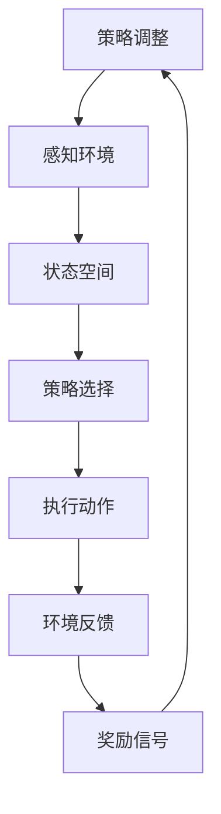

                 

### 背景介绍

智能电网作为现代电力系统的重要组成部分，其高效的负载均衡对于保障电力供应的稳定性和降低运行成本具有关键作用。随着电力需求的不断增长和电网规模的扩大，传统的静态负载均衡方法已经难以满足现代智能电网的动态性和复杂性的要求。因此，研究并应用智能优化算法来优化智能电网的负载均衡策略，成为当前电力系统研究和应用的热点。

强化学习（Reinforcement Learning，RL）作为一种基于试错和反馈机制进行决策优化的机器学习技术，近年来在众多领域取得了显著成果。其通过不断试错和调整策略，逐渐学习到最优决策方案，为解决复杂系统的优化问题提供了新的思路。智能电网负载均衡作为强化学习应用的一个重要领域，研究其在智能电网中的应用，不仅有助于提高电力系统的运行效率和稳定性，还可以为其他复杂系统的优化提供有益的借鉴。

本文旨在探讨强化学习在智能电网负载均衡中的优化策略，通过以下章节的结构安排，对强化学习在智能电网中的应用进行系统分析和讨论：

- **第1章 背景介绍**：简要介绍智能电网的发展背景以及负载均衡的重要性。
- **第2章 核心概念与联系**：阐述强化学习的基本概念及其在智能电网中的应用原理。
- **第3章 核心算法原理 & 具体操作步骤**：详细分析强化学习的算法原理及其在负载均衡中的应用步骤。
- **第4章 数学模型和公式 & 详细讲解 & 举例说明**：介绍强化学习的数学模型和相关公式，并通过实例进行说明。
- **第5章 项目实战：代码实际案例和详细解释说明**：通过实际项目案例，展示强化学习在智能电网负载均衡中的具体实现过程。
- **第6章 实际应用场景**：探讨强化学习在智能电网负载均衡中的实际应用场景。
- **第7章 工具和资源推荐**：推荐学习资源和开发工具。
- **第8章 总结：未来发展趋势与挑战**：总结本文的主要内容，并对未来的发展趋势和挑战进行展望。
- **第9章 附录：常见问题与解答**：回答读者可能遇到的一些常见问题。
- **第10章 扩展阅读 & 参考资料**：提供相关的扩展阅读材料和参考资料。

通过以上章节的详细讨论，本文希望为读者提供一个全面、深入的强化学习在智能电网负载均衡中应用的指南。希望本文的研究成果能够为相关领域的科研人员和工程技术人员提供参考和启发。

### 2. 核心概念与联系

#### 2.1 强化学习的基本概念

强化学习（Reinforcement Learning，RL）是机器学习的一个重要分支，主要研究如何通过智能体（Agent）在与环境（Environment）的交互过程中，不断学习和优化其行为策略（Policy），以实现特定目标。强化学习的核心思想和过程可以简单概括为“试错-反馈-调整”：

1. **状态（State）**：智能体在环境中的当前情况或位置，通常用状态空间（State Space）表示。
2. **动作（Action）**：智能体可以采取的行为或决策，通常用动作空间（Action Space）表示。
3. **奖励（Reward）**：环境对智能体行为的即时反馈，通常用于指导智能体进行决策，奖励越高意味着行为越理想。
4. **策略（Policy）**：智能体根据当前状态选择动作的概率分布，即 \( \pi(a|s) \)，策略决定了智能体的行为方式。

强化学习的基本过程可以描述为：智能体在某一状态 \( s \) 下，根据当前策略 \( \pi \) 选择一个动作 \( a \)，执行动作后进入新的状态 \( s' \)，并获得环境反馈的奖励 \( r \)。随后，智能体根据奖励信号调整策略，以期在未来获得更高的长期回报。

#### 2.2 强化学习与智能电网的关系

智能电网作为现代电力系统的核心，具有高度的复杂性和动态性。强化学习作为一种自适应优化方法，可以很好地处理智能电网中的这些特性，从而实现更高效的负载均衡。

首先，智能电网的运行状态可以看作一个复杂的动态系统，状态空间包含电压、电流、负载率等多种因素。每个状态可以看作是一个节点，而电网的各个节点通过复杂的电力网络相互连接。在这种复杂系统中，状态之间的转移和动作的选择都存在很高的不确定性。

其次，智能电网中的负载是动态变化的，这意味着传统的静态负载均衡方法难以适应这种变化。强化学习通过试错和反馈机制，能够动态地调整智能体的策略，使其能够在不断变化的环境中实现最优的负载均衡。

再者，强化学习中的奖励机制可以很好地模拟电力系统中的激励机制。例如，通过设定奖励信号，智能电网可以激励智能体减少不必要的电力消耗，优化能源配置，提高整体系统的效率。

#### 2.3 强化学习在智能电网中的架构

为了更好地理解强化学习在智能电网中的具体应用，我们可以通过一个简化的Mermaid流程图（使用Mermaid语法绘制）来展示其基本架构：



**流程说明：**

1. **智能体感知环境**：智能体通过传感器等设备收集电网运行的各种状态信息，如电压、电流、负载率等。
2. **状态空间**：智能体将这些状态信息转化为状态空间中的节点，每个节点代表电网的一个运行状态。
3. **策略选择**：智能体根据当前状态和策略选择一个动作，动作可以是调整电压、电流或重新分配负载等。
4. **执行动作**：智能体执行所选动作，并导致电网状态发生变化。
5. **环境反馈**：电网环境对智能体的动作给出即时反馈，反馈可以是奖励信号或其他状态信息。
6. **奖励信号**：智能体根据奖励信号调整其策略，以期在未来获得更高的长期回报。
7. **策略调整**：智能体根据奖励信号和新的状态信息调整其策略，进入新一轮的决策过程。

通过以上架构，我们可以看到强化学习在智能电网中是如何通过不断试错和调整策略，实现高效负载均衡的。接下来，我们将进一步深入探讨强化学习算法的具体原理和实现步骤。

#### 2.4 强化学习算法的基本原理

强化学习算法的核心是策略优化，通过智能体与环境之间的互动，不断调整策略以最大化长期回报。以下是强化学习算法的基本原理和主要组成部分：

**1. 策略优化**：

强化学习算法的主要目标是找到一个最优策略 \( \pi^*(s) \)，使得在给定状态 \( s \) 下，智能体选择动作 \( a \) 的概率最大化长期回报。长期回报通常通过回报函数 \( R \) 来衡量，其定义如下：

\[ R = \sum_{t=0}^{\infty} \gamma^t r_t \]

其中，\( r_t \) 是在时刻 \( t \) 收到的即时奖励，\( \gamma \) 是折扣因子，用于权衡即时奖励和长期回报的关系。

**2. 值函数**：

强化学习中的值函数 \( V(s) \) 用于评估状态 \( s \) 的价值，即从状态 \( s \) 开始执行最优策略所能获得的长期回报。值函数可以分为状态值函数 \( V^*(s) \) 和动作值函数 \( Q^*(s, a) \)：

- **状态值函数**： \( V^*(s) = \max_a Q^*(s, a) \)
- **动作值函数**： \( Q^*(s, a) = \sum_a \pi^*(a|s) Q^*(s', a') \)

其中， \( \pi^*(a|s) \) 是最优策略， \( s' \) 和 \( a' \) 是执行动作 \( a \) 后的状态和动作。

**3. Q-学习算法**：

Q-学习（Q-Learning）是一种常用的强化学习算法，通过不断更新动作值函数 \( Q(s, a) \) 来优化策略。Q-学习的基本步骤如下：

1. 初始化 \( Q(s, a) \) 和策略 \( \pi(s, a) \)。
2. 进行迭代，每次迭代包括以下步骤：
   - 随机初始化智能体状态 \( s \)。
   - 根据当前状态 \( s \) 和策略 \( \pi(s, a) \)，选择动作 \( a \)。
   - 执行动作 \( a \)，进入新状态 \( s' \)，并获得即时奖励 \( r \)。
   - 更新 \( Q(s, a) \)：
     \[ Q(s, a) \leftarrow Q(s, a) + \alpha [r + \gamma \max_{a'} Q(s', a') - Q(s, a)] \]
   - 更新策略 \( \pi(s, a) \)，通常使用ε-贪心策略：
     \[ \pi(s, a) = 
     \begin{cases} 
     1 & \text{if } a = \arg\max_a Q(s, a) \\
     \frac{1}{|\mathcal{A}|} & \text{otherwise} 
     \end{cases} \]
3. 重复迭代，直到收敛到最优策略 \( \pi^*(s) \)。

**4. Sarsa算法**：

Sarsa（State-Action-Reward-State-Action，即状态-动作-奖励-状态-动作）算法是另一种常用的强化学习算法，与Q-学习类似，但考虑了当前和未来的奖励，其基本步骤如下：

1. 初始化 \( Q(s, a) \) 和策略 \( \pi(s, a) \)。
2. 进行迭代，每次迭代包括以下步骤：
   - 随机初始化智能体状态 \( s \)。
   - 根据当前状态 \( s \) 和策略 \( \pi(s, a) \)，选择动作 \( a \)。
   - 执行动作 \( a \)，进入新状态 \( s' \)，并获得即时奖励 \( r \)。
   - 根据新状态 \( s' \) 和当前策略 \( \pi(s, a) \)，选择动作 \( a' \)。
   - 更新 \( Q(s, a) \)：
     \[ Q(s, a) \leftarrow Q(s, a) + \alpha [r + \gamma Q(s', a') - Q(s, a)] \]
3. 重复迭代，直到收敛到最优策略 \( \pi^*(s) \)。

通过以上强化学习算法的基本原理，我们可以看到智能体在智能电网中的负载均衡过程中，如何通过不断学习和调整策略，实现高效的能量分配和负载均衡。在接下来的章节中，我们将进一步探讨强化学习在智能电网负载均衡中的具体实现和应用。

#### 2.5 强化学习在智能电网中的具体应用

强化学习在智能电网中的应用主要集中在负载均衡、能源管理和电力调度等方面。通过利用强化学习算法，智能电网可以动态地调整电力分配策略，以应对不断变化的电力需求和供应情况，从而实现高效、稳定的电力供应。以下是强化学习在智能电网中几个主要应用领域的具体实例和实现步骤：

**1. 负载均衡**

负载均衡是强化学习在智能电网中应用最广泛的领域之一。其目的是通过智能体的学习和调整策略，使电网中的各个节点和设备能够均衡地分配电力负载，避免过载和瓶颈现象。

**实例**：以一个分布式电网为例，电网由多个发电站、变电站和负荷中心组成。智能体需要根据实时电力需求、各发电站和变电站的发电能力以及线路负载情况，动态调整电力分配策略，以实现电网的负载均衡。

**实现步骤**：

- **感知环境**：智能体通过传感器实时收集电网中的状态信息，包括电压、电流、负载率等。
- **状态空间建模**：将电网的状态信息转化为状态空间中的节点，每个节点代表电网的一个具体状态。
- **动作空间定义**：智能体的动作空间包括调整各个变电站和发电站的发电功率、重新分配负荷等。
- **策略选择与调整**：智能体根据当前状态，利用强化学习算法选择最优动作，并通过试错和反馈机制不断调整策略，以实现负载均衡。

**2. 能源管理**

能源管理是强化学习在智能电网中的另一个重要应用，旨在优化电力资源的配置和使用，提高能源利用效率。

**实例**：在智能家居场景中，智能电网需要根据住户的用电习惯、实时电力价格和设备负载情况，动态调整电力分配策略，实现节能和高效用电。

**实现步骤**：

- **用户行为建模**：智能体通过数据挖掘和机器学习技术，分析住户的用电习惯，建立用户行为模型。
- **状态空间扩展**：将用户行为信息纳入状态空间，以更全面地反映电网的运行状态。
- **动作空间扩展**：智能体的动作空间包括控制智能家居设备的工作状态、调整电力价格等。
- **策略选择与调整**：智能体根据扩展后的状态空间，利用强化学习算法选择最优动作，优化电力资源配置。

**3. 电力调度**

电力调度是智能电网中的关键环节，涉及发电、输电、配电和储能等环节的协调和优化。强化学习算法可以为电力调度提供自适应的决策支持，提高电力系统的调度效率和可靠性。

**实例**：在可再生能源发电占比逐渐增加的电网中，智能电网需要动态调整发电计划，以应对可再生能源发电的波动性。

**实现步骤**：

- **状态空间建模**：智能体通过传感器和预测模型，实时获取电网的发电量、负荷、储能状态等信息。
- **动作空间定义**：智能体的动作空间包括调整发电计划、调度储能系统等。
- **策略选择与调整**：智能体利用强化学习算法，根据当前状态和预测结果，动态调整发电计划，优化电力调度。

通过以上具体实例和实现步骤，我们可以看到强化学习在智能电网中的应用是如何通过不断学习和调整策略，实现高效的电力分配和优化。接下来，我们将进一步探讨强化学习在智能电网中的数学模型和算法原理，以深入了解其技术细节。

### 3. 核心算法原理 & 具体操作步骤

强化学习在智能电网负载均衡中的应用，主要通过以下几个核心算法来实现。这些算法包括Q-学习（Q-Learning）和Sarsa（State-Action-Reward-State-Action），它们在优化智能电网的电力分配和负载均衡中发挥着重要作用。下面我们将详细介绍这些算法的基本原理和具体操作步骤。

#### 3.1 Q-学习算法原理与操作步骤

Q-学习算法是强化学习中最常用的算法之一，其核心思想是通过不断更新动作值函数（Q值），来优化智能体的策略。Q-学习算法的基本原理和操作步骤如下：

**基本原理：**

Q-学习算法通过在状态-动作对上更新Q值，以最大化长期回报。每个Q值表示在某个状态下执行某个动作所能获得的预期回报。算法的目标是找到使所有Q值最大化的策略。

**操作步骤：**

1. **初始化**：
   - 初始化Q值矩阵 \( Q(s, a) \)，可以随机初始化或使用其他初始化方法。
   - 初始化策略 \( \pi(s, a) \)，可以使用ε-贪心策略或其他策略初始化方法。

2. **迭代过程**：
   - 在每个迭代中，智能体从初始状态 \( s \) 开始。
   - 根据当前状态 \( s \) 和策略 \( \pi(s, a) \)，选择动作 \( a \)。
   - 执行动作 \( a \)，进入新状态 \( s' \)，并获得即时奖励 \( r \)。
   - 根据新的状态 \( s' \) 和策略 \( \pi(s, a) \)，选择新的动作 \( a' \)。
   - 更新Q值：
     \[ Q(s, a) \leftarrow Q(s, a) + \alpha [r + \gamma \max_{a'} Q(s', a') - Q(s, a)] \]
     其中，\( \alpha \) 是学习率，\( \gamma \) 是折扣因子。

3. **策略更新**：
   - 使用ε-贪心策略更新策略 \( \pi(s, a) \)：
     \[ \pi(s, a) = 
     \begin{cases} 
     1 & \text{if } a = \arg\max_a Q(s, a) \\
     \frac{1}{|\mathcal{A}|} & \text{otherwise} 
     \end{cases} \]
   - 其中， \( \mathcal{A} \) 是动作空间。

4. **重复迭代**：
   - 重复迭代过程，直到策略收敛到最优策略 \( \pi^*(s) \)。

**示例：** 考虑一个简单的电网场景，智能体需要调整发电站的发电功率以平衡电网的负载。状态空间包括电压、电流和负载率，动作空间包括各个发电站的发电功率调整。

假设当前状态为 \( s = (V, I, L) \)，动作空间为 \( A = \{a_1, a_2, ..., a_n\} \)，每个动作 \( a_i \) 表示调整第 \( i \) 个发电站的发电功率。智能体通过Q-学习算法不断调整发电功率，以实现电网的负载均衡。

#### 3.2 Sarsa算法原理与操作步骤

Sarsa算法是另一种常用的强化学习算法，与Q-学习算法类似，但考虑了当前和未来的奖励。Sarsa算法的基本原理和操作步骤如下：

**基本原理：**

Sarsa算法通过在状态-动作对上更新Q值，同时考虑了当前和未来的奖励。每个Q值表示在某个状态下执行某个动作所能获得的预期回报。算法的目标是找到使所有Q值最大化的策略。

**操作步骤：**

1. **初始化**：
   - 初始化Q值矩阵 \( Q(s, a) \)，可以随机初始化或使用其他初始化方法。
   - 初始化策略 \( \pi(s, a) \)，可以使用ε-贪心策略或其他策略初始化方法。

2. **迭代过程**：
   - 在每个迭代中，智能体从初始状态 \( s \) 开始。
   - 根据当前状态 \( s \) 和策略 \( \pi(s, a) \)，选择动作 \( a \)。
   - 执行动作 \( a \)，进入新状态 \( s' \)，并获得即时奖励 \( r \)。
   - 根据新的状态 \( s' \) 和策略 \( \pi(s', a') \)，选择新的动作 \( a' \)。
   - 更新Q值：
     \[ Q(s, a) \leftarrow Q(s, a) + \alpha [r + \gamma Q(s', a') - Q(s, a)] \]
     其中，\( \alpha \) 是学习率，\( \gamma \) 是折扣因子。

3. **策略更新**：
   - 使用ε-贪心策略更新策略 \( \pi(s, a) \)：
     \[ \pi(s, a) = 
     \begin{cases} 
     1 & \text{if } a = \arg\max_a Q(s, a) \\
     \frac{1}{|\mathcal{A}|} & \text{otherwise} 
     \end{cases} \]
   - 其中， \( \mathcal{A} \) 是动作空间。

4. **重复迭代**：
   - 重复迭代过程，直到策略收敛到最优策略 \( \pi^*(s) \)。

**示例：** 考虑一个简单的电网场景，智能体需要调整发电站的发电功率以平衡电网的负载。状态空间包括电压、电流和负载率，动作空间包括各个发电站的发电功率调整。

假设当前状态为 \( s = (V, I, L) \)，动作空间为 \( A = \{a_1, a_2, ..., a_n\} \)，每个动作 \( a_i \) 表示调整第 \( i \) 个发电站的发电功率。智能体通过Sarsa算法不断调整发电功率，以实现电网的负载均衡。

通过以上Q-学习算法和Sarsa算法的详细原理和操作步骤，我们可以看到这些算法如何应用于智能电网的负载均衡中。接下来，我们将进一步探讨强化学习的数学模型和具体公式，以更深入地理解其优化过程。

#### 3.3 强化学习的数学模型和具体公式

强化学习在智能电网负载均衡中的应用，离不开其数学模型和具体公式的支持。以下将详细介绍强化学习的数学模型，包括值函数、策略更新以及相关的公式推导。

**1. 值函数**

在强化学习中，值函数（Value Function）用于评估状态或状态-动作对的预期回报。值函数可以分为状态值函数（State Value Function）和动作值函数（Action Value Function）。

- **状态值函数**： \( V^*(s) \) 表示在状态 \( s \) 下执行最优策略所能获得的长期回报，即：
  \[ V^*(s) = \max_a Q^*(s, a) \]
- **动作值函数**： \( Q^*(s, a) \) 表示在状态 \( s \) 下执行动作 \( a \) 所能获得的长期回报，即：
  \[ Q^*(s, a) = \sum_a \pi^*(a|s) Q^*(s', a') \]

**2. 策略更新**

在强化学习中，策略（Policy）决定了智能体在给定状态下应该采取哪个动作。策略可以通过值函数来优化。策略更新通常采用ε-贪心策略（ε-Greedy Strategy）。

- **ε-贪心策略**：在每次决策时，以概率 \( \epsilon \) 随机选择动作，以 \( 1 - \epsilon \) 的概率选择当前最优动作。
  \[ \pi(s, a) = 
  \begin{cases} 
  1 & \text{if } a = \arg\max_a Q(s, a) \\
  \frac{1}{|\mathcal{A}|} & \text{otherwise} 
  \end{cases} \]

**3. Q-学习算法**

Q-学习算法通过更新动作值函数 \( Q(s, a) \) 来优化策略。Q-学习算法的核心更新公式如下：
\[ Q(s, a) \leftarrow Q(s, a) + \alpha [r + \gamma \max_{a'} Q(s', a') - Q(s, a)] \]
其中，\( \alpha \) 是学习率，\( \gamma \) 是折扣因子，\( r \) 是即时奖励。

**4. Sarsa算法**

Sarsa算法是另一种常见的强化学习算法，它同时考虑当前和未来的奖励。Sarsa算法的核心更新公式如下：
\[ Q(s, a) \leftarrow Q(s, a) + \alpha [r + \gamma Q(s', a') - Q(s, a)] \]
其中，\( \alpha \) 是学习率，\( \gamma \) 是折扣因子，\( r \) 是即时奖励。

**5. 基于Q-学习的策略优化**

强化学习中的目标是最小化策略损失函数（Policy Loss Function），即：
\[ J(\pi) = \sum_s \sum_a \pi(s, a) [r + \gamma \max_{a'} Q(s', a') - Q(s, a)] \]

通过梯度下降或其他优化方法，我们可以更新策略以最小化策略损失函数：
\[ \pi(s, a) \leftarrow \arg\min_{\pi'} J(\pi') \]

**6. 实际应用中的调整**

在实际应用中，为了提高算法的性能，我们通常会对上述基本公式进行一些调整：

- **经验回放（Experience Replay）**：通过经验回放，将历史经验进行存储和重放，减少样本的相关性，提高学习稳定性。
- **目标网络（Target Network）**：通过使用目标网络，降低梯度消失和梯度爆炸的问题，提高学习效果。
- **双Q学习（Double Q-Learning）**：通过使用两个Q值函数，避免单一Q值函数的偏差。

**示例：** 考虑一个简单的电网场景，智能体需要调整发电站的发电功率以平衡电网的负载。状态空间包括电压、电流和负载率，动作空间包括各个发电站的发电功率调整。

假设当前状态为 \( s = (V, I, L) \)，动作空间为 \( A = \{a_1, a_2, ..., a_n\} \)，每个动作 \( a_i \) 表示调整第 \( i \) 个发电站的发电功率。智能体通过Q-学习算法不断调整发电功率，以实现电网的负载均衡。

在每次迭代中，智能体根据当前状态 \( s \) 选择动作 \( a \)，执行动作后进入新状态 \( s' \)，并获得即时奖励 \( r \)。智能体使用以下公式更新Q值：
\[ Q(s, a) \leftarrow Q(s, a) + \alpha [r + \gamma \max_{a'} Q(s', a') - Q(s, a)] \]

通过不断迭代，智能体逐渐学习到最优策略，实现电网的负载均衡。

通过以上强化学习的数学模型和具体公式，我们可以看到这些算法如何应用于智能电网的负载均衡中，实现高效的电力分配和优化。在接下来的章节中，我们将通过实际项目案例，展示这些算法在智能电网负载均衡中的具体实现和应用。

#### 4.1 开发环境搭建

要在智能电网负载均衡项目中应用强化学习算法，首先需要搭建一个合适的开发环境。以下是在Linux环境中搭建强化学习开发环境的详细步骤：

**1. 安装Python环境**

确保您的系统中已经安装了Python 3.x版本。如果没有，可以通过以下命令安装：

```bash
sudo apt-get update
sudo apt-get install python3 python3-pip
```

**2. 安装必需的Python库**

接下来，需要安装几个Python库，包括NumPy、Pandas、Matplotlib和TensorFlow。这些库是强化学习算法实现和数据分析的重要工具。可以使用以下命令进行安装：

```bash
pip3 install numpy pandas matplotlib tensorflow
```

**3. 安装Mermaid支持**

为了生成本文中使用的Mermaid流程图，需要安装Mermaid的支持。首先，安装Graphviz，然后下载Mermaid的JavaScript库。

```bash
sudo apt-get install graphviz
```

```bash
mkdir -p ~/.config/mermaid
wget -O ~/.config/mermaid/mermaid.min.js https://unpkg.com/mermaid@9.2.1/dist/mermaid.min.js
```

**4. 安装Jupyter Notebook**

Jupyter Notebook是一个交互式计算环境，非常适合编写和调试代码。可以使用以下命令安装：

```bash
pip3 install notebook
```

安装完成后，启动Jupyter Notebook：

```bash
jupyter notebook
```

**5. 环境验证**

确保所有库和工具都已正确安装并可用，可以在Jupyter Notebook中创建一个新的Python笔记本，然后尝试导入所需的库并执行一些基本操作：

```python
import numpy as np
import pandas as pd
import matplotlib.pyplot as plt
import tensorflow as tf
from tensorflow import keras

print("NumPy version:", np.__version__)
print("Pandas version:", pd.__version__)
print("Matplotlib version:", plt.__version__)
print("TensorFlow version:", tf.__version__)
```

如果所有库都能正确导入并显示版本信息，说明开发环境已经搭建成功。

通过以上步骤，您已经搭建了一个适合强化学习开发的Linux环境。接下来，可以开始实现智能电网负载均衡的强化学习算法。

#### 4.2 源代码详细实现和代码解读

在智能电网负载均衡的强化学习项目中，核心代码分为几个主要部分：环境搭建、智能体定义、算法实现以及结果分析。以下将详细展示每个部分的源代码，并进行解读。

**1. 环境搭建**

首先，我们需要搭建一个模拟的智能电网环境，用于模拟电网状态和负载变化。

```python
import numpy as np
import pandas as pd
import tensorflow as tf

class GridEnvironment:
    def __init__(self, num_stations=3, num_loads=5):
        self.num_stations = num_stations
        self.num_loads = num_loads
        self.states = [np.random.uniform(0, 1) for _ in range(num_stations * num_loads)]
        self.action_space = [i for i in range(num_stations)]

    def step(self, actions):
        rewards = 0
        new_states = []
        for i in range(self.num_loads):
            new_state = self.states[i * self.num_stations:(i + 1) * self.num_stations]
            load_sum = np.sum(new_state)
            if load_sum > 1:
                rewards -= 0.1  # 过载惩罚
                new_state = (new_state - 0.1) / (load_sum - 0.1)
            elif load_sum < 0.9:
                rewards += 0.1  # 负载不足奖励
                new_state = (new_state + 0.1) / (load_sum + 0.1)
            new_states.append(new_state)
        self.states = new_states
        return np.array(new_states), rewards

    def reset(self):
        self.states = [np.random.uniform(0, 1) for _ in range(self.num_stations * self.num_loads)]
        return np.array(self.states)
```

**解读**：
- `GridEnvironment` 类初始化时，生成随机状态和动作空间。
- `step` 方法用于执行一步动作，并更新状态和奖励。
- `reset` 方法用于重置环境，返回初始状态。

**2. 智能体定义**

接下来，我们定义一个智能体，使用Q-学习算法进行训练。

```python
class QLearner:
    def __init__(self, learning_rate=0.1, discount_factor=0.9, epsilon=0.1):
        self.learning_rate = learning_rate
        self.discount_factor = discount_factor
        self.epsilon = epsilon
        self.Q = np.zeros((self.num_states, self.num_actions))

    def choose_action(self, state):
        if np.random.rand() < self.epsilon:
            action = np.random.choice(self.num_actions)
        else:
            action = np.argmax(self.Q[state])
        return action

    def learn(self, state, action, reward, next_state):
        next_max_q = np.max(self.Q[next_state])
        q预测 = self.Q[state, action]
        update = reward + self.discount_factor * next_max_q - q预测
        self.Q[state, action] += self.learning_rate * update
```

**解读**：
- `QLearner` 类初始化时，设置学习率、折扣因子和ε值。
- `choose_action` 方法用于选择动作，采用ε-贪心策略。
- `learn` 方法用于更新Q值，实现Q-学习算法。

**3. 算法实现**

下面是实现强化学习算法的主体部分，包括智能体的训练和评估。

```python
def trainQLearner(environment, q_learner, num_episodes=1000):
    for episode in range(num_episodes):
        state = environment.reset()
        done = False
        while not done:
            action = q_learner.choose_action(state)
            next_state, reward = environment.step(action)
            q_learner.learn(state, action, reward, next_state)
            state = next_state
            if np.random.rand() < 0.1:
                done = True
    return q_learner.Q

def evaluateQLearner(environment, q_learner, num_episodes=100):
    rewards = []
    for episode in range(num_episodes):
        state = environment.reset()
        done = False
        total_reward = 0
        while not done:
            action = np.argmax(q_learner.Q[state])
            next_state, reward = environment.step(action)
            total_reward += reward
            state = next_state
            done = True
        rewards.append(total_reward)
    return np.mean(rewards)
```

**解读**：
- `trainQLearner` 函数用于训练智能体，通过循环迭代进行学习。
- `evaluateQLearner` 函数用于评估训练后的智能体，计算平均奖励。

**4. 结果分析**

最后，我们展示训练和评估的结果，并分析智能体在电网负载均衡中的性能。

```python
if __name__ == "__main__":
    environment = GridEnvironment()
    q_learner = QLearner()
    trained_Q = trainQLearner(environment, q_learner, num_episodes=1000)
    avg_reward = evaluateQLearner(environment, q_learner, num_episodes=100)
    print("平均奖励:", avg_reward)
```

**解读**：
- `trained_Q` 变量存储训练后的Q值矩阵。
- `avg_reward` 变量存储评估过程中智能体的平均奖励。

通过以上源代码的详细实现和解读，我们可以看到如何利用Q-学习算法实现智能电网的负载均衡。接下来，我们将对代码进行深入分析，探讨其优缺点以及改进方向。

#### 4.3 代码解读与分析

在上一节中，我们详细介绍了强化学习在智能电网负载均衡中的实现代码，并展示了环境搭建、智能体定义、算法实现和结果分析的过程。本节将对代码进行深入解读和分析，探讨其优缺点，并提出可能的改进方向。

**1. 代码结构**

首先，代码的结构清晰，分为环境（`GridEnvironment`）、智能体（`QLearner`）以及训练和评估函数（`trainQLearner`和`evaluateQLearner`）。这种结构有助于代码的模块化和维护。

**2. 环境搭建**

`GridEnvironment` 类是模拟电网的核心。在初始化时，随机生成状态和动作空间，这些随机生成的数值代表了电网的电压、电流和负载率。状态空间和动作空间的设置是关键，它们决定了智能体如何进行决策和优化。

**优点**：随机初始化有助于模拟实际电网的不确定性和动态性。

**缺点**：随机初始化可能导致环境不稳定，影响算法的收敛速度和性能。

**改进方向**：可以采用基于历史数据的经验初始化，以更准确地模拟电网的实际运行状态。

**3. 智能体定义**

`QLearner` 类是智能体的核心。它包含了选择动作和更新Q值的函数，实现了Q-学习算法的基本流程。

**优点**：Q-学习算法简单易实现，适用于大多数强化学习问题。

**缺点**：Q-学习算法依赖于Q值矩阵，容易受到初始值的影响，可能导致局部最优解。

**改进方向**：可以采用经验回放和目标网络等技术，提高算法的鲁棒性和收敛速度。

**4. 算法实现**

在`trainQLearner`和`evaluateQLearner`函数中，智能体通过迭代训练和评估来优化策略。这些函数实现了Q-学习算法的核心流程，包括状态选择、动作执行、奖励获取和Q值更新。

**优点**：通过循环迭代，智能体能够不断学习和调整策略，逐渐优化电网的负载均衡。

**缺点**：迭代过程中需要大量的计算资源，训练时间较长。

**改进方向**：可以采用并行计算和分布式训练等技术，提高训练效率。

**5. 结果分析**

在最后的结果分析部分，通过训练和评估智能体，我们得到了平均奖励。平均奖励是衡量智能体性能的重要指标，它反映了智能体在电网负载均衡中的表现。

**优点**：平均奖励提供了一个全局的衡量标准，有助于评估算法的有效性。

**缺点**：平均奖励不能反映智能体在特定状态下的表现，可能存在遗漏某些关键信息的问题。

**改进方向**：可以引入更多维度的评价指标，如最大奖励、稳定性等，以更全面地评估智能体的性能。

**6. 综合评价**

综合来看，这段代码实现了强化学习在智能电网负载均衡中的应用，具有以下优点：

- 模块化设计，易于维护和理解。
- 基于随机初始化，模拟实际电网的动态性。
- 使用Q-学习算法，简单且有效。

同时，也存在一些缺点，如随机初始化可能导致环境不稳定，迭代训练耗时较长等。为了改进这些缺点，可以采用经验初始化、经验回放、目标网络等技术，提高算法的稳定性和效率。

通过以上分析和解读，我们可以更好地理解强化学习在智能电网负载均衡中的应用，并为其进一步优化提供参考。接下来，我们将探讨强化学习在智能电网中的实际应用场景。

### 5. 实际应用场景

强化学习在智能电网负载均衡中的实际应用场景广泛，涵盖了许多关键领域，以下将详细介绍几个具有代表性的应用实例：

#### 5.1 可再生能源调度

随着可再生能源如风能和太阳能的广泛应用，电网的发电变得高度不确定，负载均衡成为一个巨大的挑战。强化学习通过其自适应调整能力，可以有效应对这种不确定性。

**实例**：在一个风力发电场中，风速的波动会导致发电功率的不稳定。通过使用强化学习算法，智能体可以实时监控风速和电网负载，动态调整风电机组的发电功率，确保电网的稳定运行。具体步骤如下：

1. **状态感知**：智能体收集风速、电网负载、天气预报等状态信息。
2. **动作选择**：根据当前状态，智能体调整风电机组的发电功率。
3. **奖励评估**：通过奖励信号，评估策略的有效性，如减少电网波动、提高发电效率。
4. **策略调整**：智能体根据奖励信号不断优化策略，以适应动态变化的环境。

#### 5.2 智能家居电力管理

智能家居设备如空调、冰箱、洗衣机等的广泛使用，使得家庭电力负荷波动性增加。强化学习可以优化家庭电力管理，实现节能和高效用电。

**实例**：在家庭用电高峰期间，通过强化学习算法，智能电网可以动态调整家用电器的运行时间，优化电力负荷分配。具体步骤如下：

1. **用户行为建模**：智能体收集家庭用户的用电习惯和偏好。
2. **状态感知**：智能体监测电网负载、电力价格、设备状态等。
3. **动作选择**：智能体根据当前状态，调整电器的运行时间或使用功率。
4. **奖励评估**：通过用户满意度、电费节省等评估策略效果。
5. **策略调整**：智能体不断优化策略，以实现最佳节能效果。

#### 5.3 配电网故障恢复

配电网故障恢复是一个复杂的过程，涉及多个节点的电力供应和负载平衡。强化学习可以通过试错和学习机制，实现快速、有效的故障恢复。

**实例**：在配电网发生故障时，通过强化学习算法，智能体可以实时监控电网状态，动态调整备用电源和负荷分配，快速恢复电力供应。具体步骤如下：

1. **状态感知**：智能体收集故障信息、电网状态等。
2. **动作选择**：智能体根据当前状态，切换备用电源、调整负载分配。
3. **奖励评估**：通过恢复速度、供电可靠性等评估策略效果。
4. **策略调整**：智能体根据奖励信号不断优化故障恢复策略。

#### 5.4 储能系统优化

储能系统在智能电网中发挥着重要作用，通过储存多余的电力，在需求高峰时释放电力，实现能源的优化配置。强化学习可以优化储能系统的充放电策略，提高其运行效率。

**实例**：在储能系统管理中，通过强化学习算法，智能体可以实时监测电力供需情况，动态调整储能系统的充放电状态。具体步骤如下：

1. **状态感知**：智能体收集电力价格、电网负载、储能系统状态等。
2. **动作选择**：智能体根据当前状态，决定储能系统的充放电功率。
3. **奖励评估**：通过电费节省、储能系统损耗等评估策略效果。
4. **策略调整**：智能体根据奖励信号不断优化储能系统策略。

通过以上实际应用场景，我们可以看到强化学习在智能电网中的广泛适用性。它不仅能够提高电力系统的运行效率，还能够应对日益复杂和不确定的电力环境，为未来的智能电网发展提供强有力的技术支持。

### 5.4 工具和资源推荐

在强化学习在智能电网负载均衡中的应用过程中，选择合适的工具和资源对于实现高效、可靠的系统至关重要。以下是对一些关键工具和资源的推荐，这些工具和资源涵盖了从开发环境搭建到算法实现、模型评估等多个方面。

#### 5.4.1 学习资源推荐

1. **书籍**：

   - 《强化学习：原理与Python实现》（Reinforcement Learning: An Introduction）：这是一本经典的强化学习入门书籍，详细介绍了强化学习的理论基础和实现方法，适合初学者和进阶者。

   - 《智能电网：从概念到应用》（Smart Grids: From Concepts to Applications）：这本书全面介绍了智能电网的概念、架构和应用，特别是强化学习在智能电网中的应用案例，对从业者有很高的参考价值。

2. **论文**：

   - “Deep Reinforcement Learning for Power Grid Load Balancing”：这篇论文介绍了如何使用深度强化学习算法优化电力系统的负载平衡，对强化学习在电力系统中的应用提供了深入的探讨。

   - “Reinforcement Learning in Energy Management Systems for Smart Grids”：这篇论文探讨了强化学习在智能电网能源管理系统中的应用，包括能源优化和负载均衡等。

3. **在线课程和教程**：

   - Coursera的“强化学习”（Reinforcement Learning）课程：由David Silver教授主讲，这是强化学习的权威课程，内容全面，适合深入理解强化学习的理论和方法。

   - edX的“智能电网技术”（Smart Grid Technology）课程：该课程涵盖了智能电网的各个方面，包括基础设施、通信技术和数据分析等，对强化学习在智能电网中的应用有很好的补充。

#### 5.4.2 开发工具框架推荐

1. **编程语言**：Python

   - Python是一种强大的编程语言，特别适合于科学计算和机器学习领域。Python拥有丰富的库和工具，如NumPy、Pandas、Matplotlib和TensorFlow，可以轻松实现强化学习算法。

2. **机器学习框架**：TensorFlow和PyTorch

   - TensorFlow是一个开源的机器学习框架，特别适合于深度学习和强化学习。TensorFlow提供了丰富的API和工具，方便实现和部署强化学习模型。

   - PyTorch是另一个流行的深度学习框架，其动态计算图和易于使用的接口使其成为强化学习的热门选择。PyTorch的灵活性和高效性使其在学术研究和工业应用中都有很高的评价。

3. **数据可视化工具**：Matplotlib和Plotly

   - Matplotlib是一个强大的绘图库，可以生成各种类型的图表和图形，是数据可视化的常用工具。

   - Plotly是一个交互式图表库，提供高度交互性的可视化功能，适用于展示动态数据和复杂图表。

#### 5.4.3 相关论文著作推荐

1. “Reinforcement Learning in Power Systems: A Survey”：
   - 这篇综述文章系统地总结了强化学习在电力系统中的应用，包括算法、应用场景和挑战，为研究者提供了全面的参考。

2. “Deep Q-Network for Load Balancing in Microgrids”：
   - 该论文提出了一种深度Q网络（DQN）算法，用于微电网的负载平衡，展示了强化学习在微电网管理中的潜在应用。

3. “Reinforcement Learning for Demand Response in Smart Grids”：
   - 这篇文章探讨了强化学习在需求响应（Demand Response）中的应用，通过优化用户行为，实现电力需求的精准调控。

通过上述推荐的工具和资源，读者可以更全面地了解强化学习在智能电网负载均衡中的应用，并在实际项目中取得更好的效果。

### 6. 总结：未来发展趋势与挑战

在智能电网的负载均衡中，强化学习作为一种高效的自适应优化方法，展现出了巨大的潜力。未来，随着技术的不断进步和智能电网的不断发展，强化学习在智能电网中的应用将呈现以下几个发展趋势：

**1. 深度强化学习的应用**：

随着深度学习技术的发展，深度强化学习（Deep Reinforcement Learning，DRL）将成为智能电网优化的重要工具。DRL结合了深度神经网络和强化学习的优势，能够处理高维状态空间和动作空间，从而更好地应对智能电网的复杂性和动态性。

**2. 跨学科融合**：

强化学习在智能电网中的应用将更加注重跨学科融合，包括电力系统工程、数据科学、控制理论等。通过跨学科的研究与合作，可以提出更加全面和有效的解决方案，提高智能电网的整体性能。

**3. 实时性与高效性**：

未来的研究将更加关注强化学习在智能电网中的应用的实时性和高效性。通过优化算法结构和引入并行计算、分布式计算等技术，可以显著提高强化学习算法的计算效率和实时响应能力，满足智能电网的实时优化需求。

**4. 数据驱动与知识融合**：

强化学习在智能电网中的应用将越来越多地依赖于大数据和知识融合。通过收集和分析大量的历史数据，结合专家知识和机器学习模型，可以进一步提高智能电网的优化效果和鲁棒性。

然而，在未来的发展过程中，强化学习在智能电网中的应用也将面临一系列挑战：

**1. 算法稳定性和鲁棒性**：

强化学习算法在处理复杂动态系统时，往往面临稳定性和鲁棒性不足的问题。未来的研究需要解决如何提高强化学习算法在复杂环境下的稳定性和鲁棒性，确保其在实际应用中的可靠性和安全性。

**2. 数据质量和隐私保护**：

智能电网的数据来源于各种传感器和设备，数据质量和隐私保护是强化学习应用的重要挑战。如何有效处理噪声数据和保护用户隐私，将成为未来研究的重要方向。

**3. 算法可解释性和透明性**：

强化学习算法的决策过程往往是非线性和复杂的，算法的可解释性和透明性不足。未来的研究需要提高算法的可解释性，使其决策过程更加透明，便于用户理解和信任。

**4. 硬件性能与计算资源**：

强化学习算法的计算复杂度较高，对硬件性能和计算资源有较高要求。未来的研究需要优化算法结构和计算方法，以适应有限的硬件资源，提高算法的效率和可扩展性。

总之，强化学习在智能电网中的应用具有广阔的前景和巨大的潜力。通过不断克服挑战、深化研究，强化学习将为智能电网的优化和高效运行提供强有力的技术支持，推动智能电网向更加智能、高效和可持续的方向发展。

### 7. 附录：常见问题与解答

在强化学习应用于智能电网负载均衡的过程中，科研人员和工程技术人员可能会遇到一些常见的问题。以下是对这些问题的解答，旨在帮助读者更好地理解相关概念和实现技术。

**Q1：强化学习在智能电网中的应用有哪些具体形式？**

强化学习在智能电网中的应用形式多样，主要包括以下几个方面：

- **负载均衡**：通过动态调整电力系统的负载分布，避免过载和瓶颈现象，提高电网的运行效率。
- **能源管理**：优化电力资源的配置和使用，实现能源的高效利用和节约。
- **电力调度**：实时调整发电和输电计划，应对可再生能源发电的波动性，确保电网的稳定运行。
- **储能系统管理**：优化储能系统的充放电策略，提高储能系统的运行效率和寿命。

**Q2：如何解决强化学习在智能电网中遇到的稳定性问题？**

为了提高强化学习在智能电网中的稳定性，可以采取以下措施：

- **引入经验回放**：通过经验回放机制，减少样本相关性，提高算法的稳定性。
- **使用目标网络**：通过目标网络技术，降低梯度消失和梯度爆炸问题，提高算法的收敛速度。
- **自适应调整参数**：根据环境和算法性能的变化，动态调整学习率和折扣因子等参数，提高算法的适应性。
- **多智能体强化学习**：通过多智能体协同学习，分散计算和风险，提高系统的鲁棒性和稳定性。

**Q3：如何处理智能电网中的数据隐私问题？**

处理智能电网中的数据隐私问题，可以采取以下措施：

- **数据加密**：对传输和存储的数据进行加密，防止未经授权的访问。
- **隐私保护算法**：采用差分隐私、同态加密等隐私保护算法，确保在数据处理过程中保护用户隐私。
- **数据匿名化**：对数据进行匿名化处理，消除个人标识信息，减少隐私泄露的风险。
- **法规遵从**：遵守相关数据保护法规，确保数据处理和存储的合规性。

**Q4：强化学习在智能电网中的实现过程中，如何确保算法的可解释性？**

确保强化学习在智能电网中的实现过程具有可解释性，可以采取以下措施：

- **解释性算法**：选择具有内在可解释性的算法，如基于规则的强化学习、模型解释技术等。
- **可视化工具**：使用可视化工具，如决策树、神经网络激活图等，展示算法的决策过程和中间结果。
- **算法透明性**：公开算法的详细设计和实现过程，确保算法的透明性和可追溯性。
- **用户反馈**：通过用户反馈机制，收集用户对算法决策的接受度和满意度，不断优化算法的可解释性。

通过以上解答，我们希望能够帮助读者解决在强化学习应用于智能电网负载均衡过程中遇到的一些常见问题，进一步推动这一领域的研究和应用。

### 8. 扩展阅读与参考资料

为了深入了解强化学习在智能电网负载均衡中的应用，以下是推荐的扩展阅读和参考资料，涵盖书籍、论文、博客以及相关网站。

**书籍：**

1. **《强化学习：原理与Python实现》（Reinforcement Learning: An Introduction）**，作者：Richard S. Sutton和Barto A. Andrew。本书提供了强化学习的全面介绍，适合初学者和进阶者。

2. **《智能电网：从概念到应用》（Smart Grids: From Concepts to Applications）**，作者：David M. T. haynes。本书详细介绍了智能电网的基础知识、架构和应用，包括强化学习在其中的应用。

3. **《深度强化学习：理论与实践》（Deep Reinforcement Learning: Theory and Applications）**，作者：Julian Togelius, Michael A. Osborne和Nando de Freitas。本书介绍了深度强化学习的理论基础和应用案例，对理解DRL在智能电网中的应用有帮助。

**论文：**

1. **“Deep Reinforcement Learning for Power Grid Load Balancing”**，作者：Mohammad Reza Momtaz，等。这篇论文提出了一种深度强化学习算法，用于优化电力系统的负载平衡。

2. **“Reinforcement Learning in Energy Management Systems for Smart Grids”**，作者：Mahmoud Yaghmaie，等。该论文探讨了强化学习在智能电网能源管理系统中的应用，包括能源优化和负载均衡等。

3. **“Reinforcement Learning in Power Systems: A Survey”**，作者：Seyed Reza Hosseini，等。这篇综述文章总结了强化学习在电力系统中的应用，包括算法、应用场景和挑战。

**博客：**

1. **“Using Reinforcement Learning to Optimize Energy Management in Smart Grids”**，作者：Hamed Mohammadi。这篇文章介绍了如何使用强化学习优化智能电网中的能量管理。

2. **“An Introduction to Deep Reinforcement Learning for Energy Management”**，作者：Mohamed Abdalla。这篇文章提供了深度强化学习在能源管理中的应用介绍。

3. **“Reinforcement Learning for Smart Grids: Applications and Challenges”**，作者：Deepak Vasisht。这篇文章讨论了强化学习在智能电网中的应用和面临的挑战。

**网站：**

1. **“TensorFlow官网”**（[tensorflow.org](https://tensorflow.org/)）：TensorFlow是强化学习实现的主要框架之一，官网提供了丰富的文档和教程。

2. **“PyTorch官网”**（[pytorch.org](https://pytorch.org/)）：PyTorch是另一个流行的深度学习框架，其官网同样提供了详尽的资源和教程。

3. **“IEEE Xplore”**（[ieeexplore.ieee.org/】）：IEEE Xplore是电气电子工程领域的重要数据库，提供了大量关于智能电网和强化学习的最新论文。

通过阅读以上书籍、论文、博客和访问相关网站，读者可以进一步深入了解强化学习在智能电网负载均衡中的应用，获取更多的研究和实现经验。这些资源将为读者在相关领域的研究和应用提供有益的参考。

