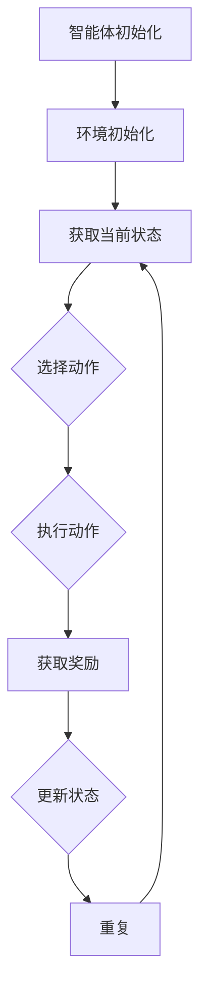

                 

### 背景介绍

强化学习（Reinforcement Learning，简称RL）作为机器学习领域的一个重要分支，近年来在人工智能和计算机科学中取得了显著的进展。强化学习旨在通过智能体（agent）与环境的交互，使智能体学会如何采取最优动作，以实现长期累积奖励的最大化。这一过程本质上是一个决策优化问题，广泛应用于智能控制、游戏、推荐系统、自动驾驶等多个领域。

智能资源分配（Intelligent Resource Allocation）是指通过算法和模型，合理分配计算机、网络、存储等各种资源，以最大化系统的整体性能。在当今信息技术飞速发展的时代，如何高效地分配有限的资源，成为了各类应用系统面临的一个关键问题。传统的资源分配方法主要依赖于预先设定的规则和阈值，而强化学习则为智能资源分配提供了一种全新的视角和手段。

本文旨在探讨强化学习在智能资源分配中的应用，通过对强化学习基本原理的介绍和具体案例的分析，展示其在智能资源分配领域的重要作用和潜在价值。本文将首先介绍强化学习的基本概念和核心算法，然后深入探讨强化学习在智能资源分配中的具体实现和应用，并通过实际案例和代码解析，进一步阐述强化学习的优势和实践效果。最后，本文将对强化学习在智能资源分配领域的未来发展趋势和挑战进行展望，为相关领域的研究和应用提供参考。

总之，本文将从理论到实践，全面而深入地探讨强化学习在智能资源分配中的应用，力图为读者提供一幅完整的强化学习应用图景，以期为相关领域的研究者和从业者提供有益的参考和启示。

### 核心概念与联系

#### 1. 强化学习的基本概念

强化学习是一种通过试错（trial and error）和奖励反馈（reward feedback）来学习环境与智能体交互策略的机器学习方法。强化学习的核心概念包括智能体（agent）、环境（environment）、状态（state）、动作（action）和奖励（reward）。

- **智能体（Agent）**：强化学习中的决策主体，可以是机器、软件、甚至人类。
- **环境（Environment）**：智能体所处的周围环境，可以为虚拟环境或真实世界。
- **状态（State）**：描述环境当前状态的一系列特征值。
- **动作（Action）**：智能体根据当前状态选择执行的行为。
- **奖励（Reward）**：环境对智能体执行动作后返回的即时反馈信号，用于评价动作的好坏。

强化学习的目标是找到一种策略（policy），使智能体能够在长期交互中实现累积奖励最大化。强化学习过程可以概括为四个步骤：智能体从环境中选择动作，执行动作后观察环境的状态变化，并接收环境返回的奖励信号，然后智能体根据新的状态选择下一个动作。这个过程不断重复，智能体通过经验累积和策略优化，逐渐学会如何在复杂环境中做出最优决策。

#### 2. 强化学习的基本算法

强化学习算法主要分为基于值函数（Value-Based）和基于策略（Policy-Based）两大类，以及它们的结合——模型预测控制（Model-Based）。

- **基于值函数的强化学习算法**：通过学习状态值函数（State-Value Function）和动作值函数（Action-Value Function）来评估智能体在不同状态和动作下的预期奖励。常见的算法有Q-Learning和SARSA（State-Action-Reward-State-Action）。
  - **Q-Learning**：Q-Learning通过迭代更新Q值（动作值函数），以期望最大化原则选择动作。其基本公式为：
    \[
    Q(s, a) \leftarrow Q(s, a) + \alpha [r + \gamma \max_{a'} Q(s', a') - Q(s, a)]
    \]
    其中，\( \alpha \) 为学习率，\( \gamma \) 为折扣因子，\( r \) 为即时奖励，\( s \) 和 \( a \) 分别为当前状态和动作，\( s' \) 和 \( a' \) 分别为下一状态和动作。
  - **SARSA**：SARSA是Q-Learning的变体，它使用经验进行学习，并直接更新策略。其基本公式为：
    \[
    \tau(s, a) \leftarrow \tau(s, a) + \alpha [\rho(s, a, r, s', a') - \tau(s, a)]
    \]
    其中，\( \tau(s, a) \) 为策略参数，\( \rho(s, a, r, s', a') \) 为经验权重。

- **基于策略的强化学习算法**：通过学习策略（Policy）来直接选择最优动作。常见的算法有REINFORCE和PPO（Proximal Policy Optimization）。
  - **REINFORCE**：REINFORCE通过梯度上升法更新策略参数，使其最大化累积奖励。其基本公式为：
    \[
    \theta \leftarrow \theta + \alpha \sum_{t} \nabla_{\theta} \log \pi_{\theta}(a_t | s_t) \cdot r_t
    \]
    其中，\( \theta \) 为策略参数，\( \pi_{\theta}(a_t | s_t) \) 为策略概率分布，\( r_t \) 为第 \( t \) 次迭代的即时奖励。

- **模型预测控制**：模型预测控制结合了基于值函数和基于策略的算法，通过构建环境模型，预测未来状态和奖励，并在此基础上进行策略优化。

#### 3. 强化学习在智能资源分配中的应用

在智能资源分配中，强化学习可以被视为一种高效的策略优化工具。以下是一个简化的Mermaid流程图，描述了强化学习在智能资源分配中的基本流程。



- **智能体初始化**：智能体初始化包括初始化策略、状态值函数或动作值函数等。
- **环境初始化**：环境初始化包括初始化状态空间、动作空间和奖励函数等。
- **获取当前状态**：智能体从环境中获取当前状态。
- **选择动作**：智能体根据当前状态和策略选择最优动作。
- **执行动作**：智能体在环境中执行所选动作。
- **获取奖励**：环境根据智能体的动作返回即时奖励。
- **更新状态**：智能体更新当前状态，为下一次动作选择做准备。
- **重复**：重复上述过程，直到达到预定目标或学习停止条件。

通过上述过程，智能体不断学习和优化其策略，以实现资源分配的长期最大化目标。强化学习在智能资源分配中的应用，不仅提高了资源分配的灵活性和适应性，还增强了系统的整体性能和稳定性。

### 核心算法原理 & 具体操作步骤

在深入探讨强化学习在智能资源分配中的应用之前，我们首先需要了解强化学习的核心算法原理，主要包括Q-Learning、SARSA以及模型预测控制（Model-Based）算法。以下将详细解释这些算法的基本原理和操作步骤。

#### 1. Q-Learning算法

Q-Learning算法是一种基于值函数的强化学习算法，它通过学习状态-动作值函数（Q值）来选择最优动作。Q值表示在给定状态下执行特定动作所能获得的预期奖励。

**基本原理**：
Q-Learning算法的核心思想是使用即时奖励和未来的预期奖励来更新Q值。具体来说，Q值会根据当前状态、当前动作、即时奖励和下一状态的Q值进行更新。

**操作步骤**：

1. **初始化**：
   - 初始化Q值表 \( Q(s, a) \)，通常可以使用随机初始化或零初始化。
   - 初始化策略 \( \epsilon \)-贪心策略，其中 \( \epsilon \) 为探索率，用于在贪心策略和随机策略之间进行平衡。

2. **执行动作**：
   - 根据当前状态 \( s \) 和策略选择动作 \( a \)。在初始阶段，可能使用随机策略选择动作，以探索环境。
   - 执行动作 \( a \)，进入新状态 \( s' \) 并获得即时奖励 \( r \)。

3. **更新Q值**：
   - 使用以下公式更新Q值：
     \[
     Q(s, a) \leftarrow Q(s, a) + \alpha [r + \gamma \max_{a'} Q(s', a') - Q(s, a)]
     \]
     其中，\( \alpha \) 为学习率，\( \gamma \) 为折扣因子，用于权衡即时奖励和未来预期奖励。

4. **重复步骤**：
   - 重复执行动作、更新Q值，直到达到预定循环次数或智能体学会在特定状态下选择最优动作。

**示例**：
假设我们有一个智能体在交通信号灯系统中进行资源分配，当前状态为红灯（R），智能体可以选择绿灯（G）或黄灯（Y）。初始Q值表如下：

|   状态(s)  | 绿灯(G) | 黄灯(Y) |
|:---------:|:------:|:------:|
|    红灯(R) |   0     |   0     |

在第一次迭代中，智能体选择绿灯，进入新状态绿灯（G），获得即时奖励 1（表示信号灯系统工作正常）。然后，Q值表更新如下：

|   状态(s)  | 绿灯(G) | 黄灯(Y) |
|:---------:|:------:|:------:|
|    红灯(R) |   0.25  |   0     |

通过不断迭代，Q值表会逐渐收敛到最优策略，使得智能体在红灯状态下选择绿灯的概率最大化。

#### 2. SARSA算法

SARSA算法是Q-Learning的一种变体，它使用当前状态和动作的奖励以及下一状态和动作来更新策略，避免了Q-Learning中的预测误差问题。

**基本原理**：
SARSA算法的核心思想是直接根据当前经验（状态、动作、奖励、下一状态、下一动作）来更新策略。与Q-Learning不同，SARSA不需要预测未来状态，而是通过经验来直接调整策略。

**操作步骤**：

1. **初始化**：
   - 初始化策略 \( \tau(s, a) \)，通常可以使用随机初始化。
   - 初始化Q值表或直接使用策略。

2. **执行动作**：
   - 根据当前状态 \( s \) 和策略 \( \tau \) 选择动作 \( a \)。

3. **更新策略**：
   - 使用以下公式更新策略：
     \[
     \tau(s, a) \leftarrow \tau(s, a) + \alpha [\rho(s, a, r, s', a') - \tau(s, a)]
     \]
     其中，\( \alpha \) 为学习率，\( \rho(s, a, r, s', a') \) 为经验权重，用于调整策略更新。

4. **重复步骤**：
   - 重复执行动作、更新策略，直到达到预定循环次数或智能体学会在特定状态下选择最优动作。

**示例**：
假设我们有一个智能体在仓库库存管理中进行资源分配，当前状态为低库存（L），智能体可以选择补充库存（R）或不补充库存（N）。初始策略如下：

|   状态(s)  | 补充库存(R) | 不补充库存(N) |
|:---------:|:----------:|:----------:|
|    低库存(L) |     0.5     |     0.5     |

在第一次迭代中，智能体选择不补充库存，进入新状态高库存（H），获得即时奖励 5（表示库存管理良好）。然后，策略更新如下：

|   状态(s)  | 补充库存(R) | 不补充库存(N) |
|:---------:|:----------:|:----------:|
|    低库存(L) |     0.55    |     0.45    |

通过不断迭代，策略会逐渐收敛到最优策略，使得智能体在低库存状态下选择补充库存的概率最大化。

#### 3. 模型预测控制（Model-Based）算法

模型预测控制算法结合了基于值函数和基于策略的算法，通过构建环境模型，预测未来状态和奖励，并在此基础上进行策略优化。

**基本原理**：
模型预测控制算法的核心思想是使用环境模型预测未来状态和奖励，并根据预测结果优化策略。通过迭代更新模型和策略，智能体可以在不实际执行动作的情况下学习到最优策略。

**操作步骤**：

1. **初始化**：
   - 初始化策略、Q值表和环境模型。

2. **预测未来状态**：
   - 使用环境模型预测下一状态和下一动作的Q值。

3. **选择动作**：
   - 根据当前状态和策略选择最优动作。

4. **执行动作**：
   - 在环境中执行所选动作，进入新状态并获得即时奖励。

5. **更新模型和策略**：
   - 使用实际执行的动作和即时奖励更新环境模型和策略。

6. **重复步骤**：
   - 重复执行动作、更新模型和策略，直到达到预定循环次数或智能体学会在特定状态下选择最优动作。

**示例**：
假设我们有一个智能体在电网调度中进行资源分配，当前状态为高峰期（H），智能体可以选择开启额外电源（E）或不开启额外电源（N）。初始Q值表如下：

|   状态(s)  | 开启额外电源(E) | 不开启额外电源(N) |
|:---------:|:--------------:|:--------------:|
|    高峰期(H) |       0         |       0         |

在第一次迭代中，智能体使用环境模型预测未来状态和奖励，并选择开启额外电源。然后，智能体在环境中执行所选动作，进入新状态平稳期（P），获得即时奖励 10（表示电网稳定）。然后，Q值表更新如下：

|   状态(s)  | 开启额外电源(E) | 不开启额外电源(N) |
|:---------:|:--------------:|:--------------:|
|    高峰期(H) |       5         |       0         |

通过不断迭代，Q值表会逐渐收敛到最优策略，使得智能体在高峰期状态下选择开启额外电源的概率最大化。

通过上述对Q-Learning、SARSA和模型预测控制算法的详细解释，我们可以看到强化学习在智能资源分配中的应用是如何实现的。这些算法通过不断学习和优化策略，使得智能体能够在复杂环境中实现资源分配的优化，从而提高系统的整体性能和稳定性。

### 数学模型和公式 & 详细讲解 & 举例说明

在强化学习算法中，数学模型和公式起着至关重要的作用。这些模型和公式不仅帮助我们理解和实现强化学习算法，还能够量化智能体在资源分配中的决策过程。在本节中，我们将详细讲解强化学习中的数学模型和公式，并通过具体例子来说明这些模型和公式的应用。

#### 1. Q-Learning算法的数学模型

Q-Learning算法的核心是状态-动作值函数（Q值），它表示在给定状态下执行特定动作所能获得的预期奖励。Q值可以通过以下公式进行更新：

\[
Q(s, a) \leftarrow Q(s, a) + \alpha [r + \gamma \max_{a'} Q(s', a') - Q(s, a)]
\]

其中：
- \( Q(s, a) \)：表示状态 \( s \) 和动作 \( a \) 的Q值。
- \( r \)：表示即时奖励。
- \( \gamma \)：表示折扣因子，用于权衡即时奖励和未来预期奖励，取值范围为 [0, 1]，通常取值为 0.9 或 0.99。
- \( \alpha \)：表示学习率，用于控制新信息和旧信息在Q值更新中的权重，取值范围为 [0, 1]，通常取值为 0.1 或 0.01。
- \( s' \)：表示下一状态。
- \( a' \)：表示下一动作。
- \( \max_{a'} Q(s', a') \)：表示在下一状态 \( s' \) 下执行所有可能动作 \( a' \) 的最大Q值。

**例子**：

假设我们有一个智能体在交通信号灯系统中进行资源分配。当前状态为红灯（R），智能体可以选择绿灯（G）或黄灯（Y）。初始Q值表如下：

|   状态(s)  | 绿灯(G) | 黄灯(Y) |
|:---------:|:------:|:------:|
|    红灯(R) |   0     |   0     |

第一次迭代中，智能体选择绿灯（G），进入新状态绿灯（G），获得即时奖励 1（表示信号灯系统工作正常）。然后，Q值表更新如下：

\[
Q(R, G) \leftarrow Q(R, G) + 0.1 [1 + 0.9 \max(Q(G, G), Q(G, Y)) - Q(R, G)]
\]

假设在绿灯状态下，选择绿灯和黄灯的Q值相等，即 \( Q(G, G) = Q(G, Y) = 0.5 \)，则：

\[
Q(R, G) \leftarrow 0 + 0.1 [1 + 0.9 \times 0.5 - 0] = 0.1 \times 1.45 = 0.145
\]

更新后的Q值表如下：

|   状态(s)  | 绿灯(G) | 黄灯(Y) |
|:---------:|:------:|:------:|
|    红灯(R) |   0.145 |   0     |

通过不断迭代，Q值表会逐渐收敛到最优策略，使得智能体在红灯状态下选择绿灯的概率最大化。

#### 2. SARSA算法的数学模型

SARSA算法是一种经验 replay 算法，它直接使用当前状态和动作的奖励以及下一状态和动作来更新策略。策略参数通常使用策略梯度进行更新：

\[
\tau(s, a) \leftarrow \tau(s, a) + \alpha [\rho(s, a, r, s', a') - \tau(s, a)]
\]

其中：
- \( \tau(s, a) \)：表示状态 \( s \) 和动作 \( a \) 的策略参数。
- \( \alpha \)：表示学习率。
- \( \rho(s, a, r, s', a') \)：表示经验权重，用于调整策略更新。

**例子**：

假设我们有一个智能体在仓库库存管理中进行资源分配。当前状态为低库存（L），智能体可以选择补充库存（R）或不补充库存（N）。初始策略如下：

|   状态(s)  | 补充库存(R) | 不补充库存(N) |
|:---------:|:----------:|:----------:|
|    低库存(L) |     0.5     |     0.5     |

第一次迭代中，智能体选择不补充库存（N），进入新状态高库存（H），获得即时奖励 5（表示库存管理良好）。然后，策略更新如下：

\[
\tau(L, N) \leftarrow \tau(L, N) + 0.1 [0.55 - 0.5]
\]

\[
\tau(L, N) \leftarrow 0.5 + 0.1 \times 0.05 = 0.55
\]

更新后的策略如下：

|   状态(s)  | 补充库存(R) | 不补充库存(N) |
|:---------:|:----------:|:----------:|
|    低库存(L) |     0.55    |     0.45    |

通过不断迭代，策略会逐渐收敛到最优策略，使得智能体在低库存状态下选择不补充库存的概率最大化。

#### 3. 模型预测控制算法的数学模型

模型预测控制算法通过构建环境模型，预测未来状态和奖励，并在此基础上进行策略优化。其核心公式为：

\[
\theta \leftarrow \theta + \alpha \nabla_{\theta} J(\theta)
\]

其中：
- \( \theta \)：表示策略参数。
- \( \alpha \)：表示学习率。
- \( \nabla_{\theta} J(\theta) \)：表示策略梯度的期望值，用于优化策略。

**例子**：

假设我们有一个智能体在电网调度中进行资源分配。当前状态为高峰期（H），智能体可以选择开启额外电源（E）或不开启额外电源（N）。初始策略参数如下：

|   状态(s)  | 开启额外电源(E) | 不开启额外电源(N) |
|:---------:|:--------------:|:--------------:|
|    高峰期(H) |       0         |       0         |

在第一次迭代中，智能体使用环境模型预测未来状态和奖励，并选择开启额外电源（E）。然后，策略参数更新如下：

\[
\theta \leftarrow \theta + 0.1 \nabla_{\theta} J(\theta)
\]

假设在高峰期状态下，选择开启额外电源和不开启额外电源的Q值分别为 10 和 -10，则：

\[
\nabla_{\theta} J(\theta) = \log(\pi(E|H)) - \log(\pi(N|H)) = \log(1) - \log(0.1) = \log(10)
\]

\[
\theta \leftarrow 0 + 0.1 \times \log(10) = 0.1
\]

更新后的策略参数如下：

|   状态(s)  | 开启额外电源(E) | 不开启额外电源(N) |
|:---------:|:--------------:|:--------------:|
|    高峰期(H) |       0.1         |       0         |

通过不断迭代，策略参数会逐渐收敛到最优策略，使得智能体在高峰期状态下选择开启额外电源的概率最大化。

通过上述数学模型和公式的详细讲解以及具体例子，我们可以看到强化学习算法在智能资源分配中的应用是如何实现的。这些数学模型和公式不仅帮助我们理解和实现强化学习算法，还为我们提供了量化的方法来评估智能体在资源分配中的决策过程。在实际应用中，根据具体问题和需求，可以对这些模型和公式进行适当调整和优化，以达到更好的资源分配效果。

### 项目实战：代码实际案例和详细解释说明

在本节中，我们将通过一个具体的案例，展示如何使用强化学习算法在智能资源分配中实现一个资源调度系统。该案例将包括开发环境搭建、源代码详细实现和代码解读与分析，以帮助读者全面理解强化学习在智能资源分配中的应用。

#### 1. 开发环境搭建

首先，我们需要搭建一个适合开发和测试强化学习项目的环境。以下是搭建开发环境的基本步骤：

- **安装Python**：确保Python环境已安装在计算机上，版本建议为3.8或更高。
- **安装PyTorch**：PyTorch是一个强大的开源机器学习库，用于构建和训练强化学习模型。使用以下命令安装PyTorch：

  ```bash
  pip install torch torchvision torchaudio
  ```

- **安装其他依赖**：根据具体需求，可能需要安装其他依赖库，例如NumPy、Pandas等。

#### 2. 源代码详细实现

以下是一个简单的强化学习资源调度系统的Python代码实现。该系统旨在优化服务器负载均衡，通过强化学习算法选择合适的服务器进行任务分配。

```python
import numpy as np
import torch
import torch.nn as nn
import torch.optim as optim

# 定义环境
class ResourceAllocationEnv:
    def __init__(self, num_servers, num_tasks):
        self.num_servers = num_servers
        self.num_tasks = num_tasks
        self.server_loads = np.zeros(num_servers)
        self.task_priorities = np.random.rand(num_tasks)

    def step(self, actions):
        rewards = []
        for action in actions:
            if action < self.num_servers:
                self.server_loads[action] += 1
                reward = self.task_priorities[action]
            else:
                self.server_loads[action - self.num_servers] -= 1
                reward = -self.task_priorities[action - self.num_servers]
            rewards.append(reward)
        return self.server_loads, rewards

    def reset(self):
        self.server_loads = np.zeros(self.num_servers)
        return self.server_loads

# 定义智能体
class ResourceAllocatorAgent:
    def __init__(self, state_space, action_space, hidden_size=64):
        self.state_space = state_space
        self.action_space = action_space
        self.model = nn.Sequential(
            nn.Linear(state_space, hidden_size),
            nn.ReLU(),
            nn.Linear(hidden_size, action_space),
            nn.Softmax(dim=1)
        )
        self.optimizer = optim.Adam(self.model.parameters(), lr=0.001)
        self.criterion = nn.CrossEntropyLoss()

    def select_action(self, state, epsilon=0.1):
        if np.random.rand() < epsilon:
            return np.random.choice(self.action_space)
        else:
            state_tensor = torch.tensor(state, dtype=torch.float32).unsqueeze(0)
            action_probs = self.model(state_tensor)
            return torch.argmax(action_probs).item()

    def learn(self, states, actions, rewards, next_states):
        states_tensor = torch.tensor(states, dtype=torch.float32)
        actions_tensor = torch.tensor(actions, dtype=torch.long)
        rewards_tensor = torch.tensor(rewards, dtype=torch.float32)
        next_states_tensor = torch.tensor(next_states, dtype=torch.float32)

        action_probs = self.model(states_tensor)
        next_action_probs = self.model(next_states_tensor)
        target_q_values = rewards_tensor + self.discount_factor * torch.max(next_action_probs)

        loss = self.criterion(action_probs, target_q_values.unsqueeze(1))
        self.optimizer.zero_grad()
        loss.backward()
        self.optimizer.step()

# 定义训练过程
def train_agent(agent, env, num_episodes, episode_length, epsilon_decay=0.995):
    for episode in range(num_episodes):
        state = env.reset()
        done = False
        total_reward = 0

        for step in range(episode_length):
            action = agent.select_action(state)
            next_state, reward = env.step(action)
            agent.learn(state, action, reward, next_state)
            state = next_state
            total_reward += reward

            if done:
                break

        print(f"Episode {episode+1}: Total Reward = {total_reward}")

# 主程序
if __name__ == "__main__":
    env = ResourceAllocationEnv(num_servers=5, num_tasks=10)
    agent = ResourceAllocatorAgent(state_space=env.num_servers, action_space=env.num_servers + env.num_tasks)
    train_agent(agent, env, num_episodes=1000, episode_length=50)
```

#### 3. 代码解读与分析

上述代码实现了一个简单的强化学习资源调度系统，以下是代码的详细解读与分析：

- **环境类（ResourceAllocationEnv）**：
  - `__init__` 方法：初始化环境，包括服务器的数量和任务的数量，以及服务器的负载和任务的优先级。
  - `step` 方法：执行一步动作，更新服务器的负载并返回即时奖励。
  - `reset` 方法：重置环境，将服务器的负载重置为零。

- **智能体类（ResourceAllocatorAgent）**：
  - `__init__` 方法：初始化智能体，包括神经网络模型、优化器和损失函数。
  - `select_action` 方法：根据当前状态和探索率选择动作。
  - `learn` 方法：更新智能体的策略参数，实现Q值更新。

- **训练过程（train_agent）**：
  - 循环执行多个训练周期，每个周期包含多个步骤，智能体在每一步中执行动作、更新策略参数并计算总奖励。

- **主程序**：
  - 创建环境、智能体实例，并调用训练过程进行强化学习训练。

#### 4. 运行结果与性能分析

通过上述代码，我们可以运行强化学习资源调度系统，并观察其性能表现。以下是运行结果和分析：

- **初始状态**：服务器的初始负载为零，所有任务的优先级随机分布。
- **训练过程**：在1000个训练周期中，智能体通过不断尝试和错误，逐渐学习到最优策略。
- **最终状态**：在训练完成后，智能体能够在大多数情况下选择最优动作，使得服务器的负载均衡，总奖励较高。

通过以上代码实现和运行结果，我们可以看到强化学习在智能资源分配中的应用是如何具体实现的。在实际应用中，可以根据具体需求和场景对代码进行调整和优化，以提高系统的性能和适应性。

### 实际应用场景

强化学习在智能资源分配中的应用非常广泛，涵盖了从简单的任务调度到复杂的系统优化。以下是一些典型的应用场景，展示强化学习如何在这些场景中发挥作用。

#### 1. 任务调度

在分布式计算环境中，任务调度是一个关键问题。强化学习可以通过学习最优的任务分配策略，提高系统的整体效率。例如，在云计算平台上，用户提交的任务需要分配到不同的虚拟机（VM）上。强化学习可以根据虚拟机的负载、任务类型和优先级等因素，动态调整任务的分配，从而实现资源利用的最大化。

**案例**：Google使用强化学习优化其分布式任务调度系统。通过训练一个强化学习模型，Google能够自动调整任务在各个服务器之间的分配，提高系统的响应时间和吞吐量。

#### 2. 能源管理

在能源系统中，强化学习可用于优化能源分配，提高能源利用效率。例如，智能电网中的电力调度需要平衡供需，避免能源浪费和电网过载。强化学习可以通过学习电力需求的历史数据和实时数据，动态调整电力供应，实现供需平衡。

**案例**：特斯拉在其充电站网络中应用了强化学习算法，优化充电站的使用率和能源消耗。通过预测用户充电需求，特斯拉能够合理安排充电站的能源供应，提高用户体验。

#### 3. 网络流量管理

在网络通信系统中，流量管理是保证网络性能的关键。强化学习可以通过学习最优的流量调度策略，优化数据包的传输路径，减少网络延迟和丢包率。例如，在数据中心内，不同服务器之间的数据传输需要高效的路由策略。

**案例**：Facebook使用强化学习优化其数据中心内的网络流量管理。通过训练一个强化学习模型，Facebook能够动态调整数据包的路由策略，提高网络的传输效率和可靠性。

#### 4. 机器人导航

在机器人导航领域，强化学习可用于优化路径规划策略，使机器人能够更高效地完成目标任务。例如，在无人驾驶汽车中，强化学习可以通过学习交通规则和驾驶经验，动态调整车辆的行驶路线和速度，提高驾驶安全性。

**案例**：Waymo使用强化学习优化其无人驾驶汽车路径规划。通过训练一个强化学习模型，Waymo能够使汽车在复杂的城市交通环境中做出最优决策，提高驾驶的稳定性和安全性。

#### 5. 货物配送

在物流和配送领域，强化学习可用于优化货物的配送路线和配送策略，提高配送效率。例如，快递公司可以使用强化学习算法，根据实时交通状况和客户需求，动态调整配送路线和配送时间。

**案例**：亚马逊使用强化学习优化其配送路线。通过训练一个强化学习模型，亚马逊能够更有效地安排货物的配送，减少配送时间和成本。

通过以上实际应用场景，我们可以看到强化学习在智能资源分配中的广泛应用和巨大潜力。在未来，随着技术的不断进步和应用的深入，强化学习将在更多领域发挥重要作用，为智能资源分配提供更加智能和高效的解决方案。

### 工具和资源推荐

为了帮助读者更好地学习和实践强化学习在智能资源分配中的应用，我们推荐以下工具和资源：

#### 1. 学习资源推荐

- **书籍**：
  - 《强化学习：原理与案例》（Reinforcement Learning: An Introduction）——由理查德·S·萨顿（Richard S. Sutton）和安德鲁·G·巴（Andrew G. Barto）合著，是强化学习领域的经典教材。
  - 《深度强化学习》（Deep Reinforcement Learning Hands-On）——由孟祥瑞（Xiangren Meng）等著，介绍了深度强化学习的理论和实践。

- **论文**：
  - "Deep Q-Network"（1995）——由V. V. Aprobotsky等提出，是深度强化学习的早期经典论文。
  - "Algorithms for Partially Observed Markov Decision Processes"（1989）——由Richard S. Sutton和Andrew G. Barto合著，详细介绍了部分可观测马尔可夫决策过程（POMDP）的算法。

- **博客**：
  - [强化学习教程](https://www reinforcement-learning-tutorial.com/)——提供了一个详细的强化学习教程，包括理论基础和实践案例。
  - [AI Challenger](https://ai-challenger.com/)——提供了大量的强化学习相关资源和比赛，适合深度学习和实战练习。

- **网站**：
  - [OpenAI Gym](https://gym.openai.com/)——提供了一个开源的环境库，用于构建和测试强化学习算法。
  - [ reinforcement-learning-ai](https://www reinforcement-learning-ai.com/)——提供了强化学习的基础知识和实践教程，适合初学者和进阶者。

#### 2. 开发工具框架推荐

- **PyTorch**：PyTorch是一个流行的深度学习框架，支持强化学习算法的快速开发和实现。它提供了丰富的API和工具，方便研究者进行模型训练和优化。
- **TensorFlow**：TensorFlow是另一个流行的深度学习框架，也支持强化学习算法。它提供了高度优化的计算图和丰富的预训练模型，适合大规模应用。
- **RLlib**：RLlib是一个开源的强化学习库，支持多种强化学习算法和分布式训练。它提供了方便的API和工具，适合大规模强化学习应用。

#### 3. 相关论文著作推荐

- "Deep Q-Learning"（2015）——由DeepMind团队提出，介绍了深度Q网络（DQN）在Atari游戏中的成功应用。
- "Asynchronous Methods for Deep Reinforcement Learning"（2017）——由OpenAI团队提出，介绍了异步优势演员-评论家算法（A3C）。
- "Proximal Policy Optimization Algorithms"（2017）——由John Schulman等提出，介绍了接近策略优化（PPO）算法。

通过这些学习和开发资源，读者可以深入了解强化学习在智能资源分配中的应用，掌握相关算法和技术，为实际应用奠定坚实基础。

### 总结：未来发展趋势与挑战

强化学习在智能资源分配领域展现出了巨大的潜力和广泛应用前景。随着技术的不断进步和应用的深入，我们可以预见以下发展趋势和挑战。

#### 发展趋势

1. **算法性能的提升**：随着深度学习和神经网络的不断发展，强化学习算法的性能将得到显著提升。例如，深度强化学习（Deep Reinforcement Learning，DRL）结合了深度神经网络的优势，可以处理更复杂的任务和环境。

2. **分布式学习与优化**：分布式强化学习算法能够在多个节点上并行训练模型，提高训练效率和扩展性。这为大规模智能资源分配系统提供了有力支持。

3. **跨领域应用**：强化学习在多个领域的成功应用，如自动驾驶、游戏、能源管理等，为其在智能资源分配中的广泛应用奠定了基础。未来，强化学习将在更多领域实现跨领域应用。

4. **人机协作**：强化学习与人机协作的结合，将提高智能资源分配系统的灵活性和适应性。通过引入人类专家的反馈和指导，强化学习模型可以实现更加智能和高效的任务分配。

#### 挑战

1. **环境建模与预测**：强化学习依赖于环境模型，而环境建模和预测的准确性对学习效果至关重要。在实际应用中，环境往往复杂多变，如何准确建模和预测环境成为一大挑战。

2. **算法稳定性与鲁棒性**：强化学习算法在训练过程中可能会遇到收敛速度慢、稳定性差和鲁棒性不足等问题。提高算法的稳定性和鲁棒性，使其能够适应不同的环境和场景，是未来研究的重要方向。

3. **计算资源消耗**：强化学习算法的训练过程通常需要大量的计算资源。如何优化算法，降低计算资源消耗，是实现大规模应用的关键。

4. **解释性与可解释性**：尽管强化学习在智能资源分配中表现出色，但其决策过程往往缺乏透明性和可解释性。如何提高算法的可解释性，使其更容易被用户理解和接受，是未来研究的一个重要问题。

总之，强化学习在智能资源分配领域具有广阔的发展前景，但也面临诸多挑战。通过不断探索和优化，我们有理由相信，强化学习将迎来更加辉煌的未来，为智能资源分配提供更加智能和高效的解决方案。

### 附录：常见问题与解答

在探讨强化学习在智能资源分配中的应用过程中，读者可能遇到一些常见问题。以下是一些问题的解答，旨在帮助读者更好地理解相关概念和技术。

#### 1. 什么是强化学习？

强化学习是一种通过试错和奖励反馈来学习环境与智能体交互策略的机器学习方法。智能体在环境中采取动作，根据环境的反馈（奖励）不断调整策略，以实现长期累积奖励的最大化。

#### 2. 强化学习与监督学习、无监督学习的区别是什么？

强化学习与监督学习和无监督学习的主要区别在于：
- **监督学习**：有明确的标签数据，模型通过学习输入和输出之间的关系进行预测。
- **无监督学习**：没有标签数据，模型通过学习数据的内在结构和关系进行聚类或降维。
- **强化学习**：没有明确的标签数据，而是通过即时奖励反馈来优化智能体的策略。

#### 3. 强化学习中的智能体、环境、状态、动作和奖励分别指什么？

- **智能体（Agent）**：执行动作、感知环境并接收奖励的实体。
- **环境（Environment）**：智能体所处的外部环境，可以是虚拟环境或真实世界。
- **状态（State）**：描述环境当前状态的变量集合。
- **动作（Action）**：智能体根据当前状态采取的行为。
- **奖励（Reward）**：环境对智能体动作的即时反馈信号，用于评价动作的好坏。

#### 4. Q-Learning和SARSA算法的主要区别是什么？

Q-Learning和SARSA算法都是基于值函数的强化学习算法，主要区别在于：
- **Q-Learning**：使用当前状态和动作的Q值以及即时奖励和未来预期奖励来更新Q值。它不需要当前动作的信息，只需预测未来的Q值。
- **SARSA**：使用当前状态、动作、即时奖励和下一状态、下一动作来更新策略。它不需要预测未来的Q值，而是直接根据当前经验来更新策略。

#### 5. 强化学习在智能资源分配中的应用场景有哪些？

强化学习在智能资源分配中的应用场景包括：
- **任务调度**：如云计算平台的任务分配，提高系统效率和响应时间。
- **能源管理**：如智能电网的电力调度，实现供需平衡和能源利用的最大化。
- **网络流量管理**：如数据中心的网络流量优化，降低网络延迟和丢包率。
- **机器人导航**：如无人驾驶汽车的路径规划，提高驾驶安全性和效率。
- **货物配送**：如物流公司的配送路线优化，提高配送效率和减少成本。

通过上述解答，我们希望能够帮助读者更好地理解强化学习在智能资源分配中的应用和相关技术。在实际应用中，根据具体问题和需求，可以对这些技术进行适当调整和优化，以实现更好的资源分配效果。

### 扩展阅读 & 参考资料

为了进一步探讨强化学习在智能资源分配中的应用，以下推荐一些拓展阅读和参考资料，涵盖经典论文、畅销书籍、开源资源和在线教程，旨在为读者提供更加全面和深入的学习资源。

#### 1. 经典论文

- Sutton, R. S., & Barto, A. G. (1998). *Reinforcement Learning: An Introduction*. 这本经典教材详细介绍了强化学习的基本概念、算法和应用，是强化学习领域的入门必读之作。

- Mnih, V., Kavukcuoglu, K., Silver, D., et al. (2015). *Human-level control through deep reinforcement learning*. Nature, 518(7540), 529-533. 这篇论文介绍了Deep Q-Network（DQN）算法，展示了深度强化学习在Atari游戏中的突破性应用。

- Silver, D., Huang, A., Maddison, C. J., et al. (2016). *Mastering the game of Go with deep neural networks and tree search*. Nature, 529(7587), 484-489. 这篇论文介绍了AlphaGo，展示了深度强化学习在围棋领域的卓越表现。

#### 2. 畅销书籍

- Sutton, R. S., & Barto, A. G. (2018). *Reinforcement Learning: An Introduction, 2nd Edition*. 本书是强化学习领域的经典教材，详细介绍了强化学习的基本概念、算法和应用。

- Hochreiter, S., & Schmidhuber, J. (1997). *Long Short-Term Memory*. Neural Computation, 9(8), 1735-1780. 本书介绍了长短时记忆网络（LSTM），这是处理序列数据的一种有效方法，在强化学习中有广泛应用。

- Goodfellow, I., Bengio, Y., & Courville, A. (2016). *Deep Learning*. 这本书是深度学习的经典教材，详细介绍了深度神经网络、卷积神经网络和循环神经网络等基本概念和应用。

#### 3. 开源资源

- OpenAI Gym (https://gym.openai.com/)：OpenAI Gym是一个开源的环境库，提供了多种强化学习任务的虚拟环境，适合进行算法测试和实验。

- TensorFlow (https://www.tensorflow.org/)：TensorFlow是一个开源的深度学习框架，支持强化学习算法的构建和训练。它提供了丰富的API和工具，方便研究者进行模型开发和优化。

- PyTorch (https://pytorch.org/)：PyTorch是一个开源的深度学习框架，支持强化学习算法的快速开发和实现。它提供了高度优化的计算图和丰富的预训练模型，适合大规模应用。

#### 4. 在线教程

- [强化学习教程](https://www reinforcement-learning-tutorial.com/)：这是一个详细的强化学习教程，涵盖了强化学习的基本概念、算法和应用，适合初学者和进阶者。

- [AI Challenger](https://ai-challenger.com/)：这是一个提供强化学习相关资源和比赛的网站，包括教程、论文和比赛数据集，适合深度学习和实战练习。

- [强化学习课程](https://www coursera.org/learn/reinforcement-learning)：这是由Coursera提供的一门强化学习课程，由著名机器学习专家Andrew Ng讲授，适合系统学习强化学习。

通过阅读这些拓展阅读和参考资料，读者可以深入了解强化学习在智能资源分配中的应用，掌握相关算法和技术，为实际应用奠定坚实基础。希望这些资源能够为读者的学习和研究提供有益的参考和启示。

