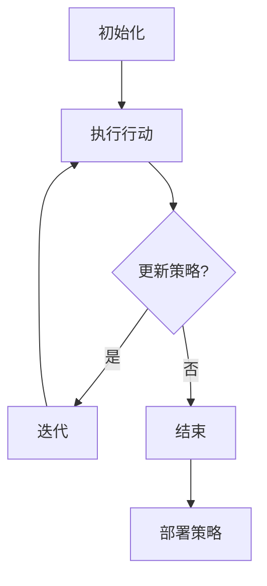

                 

### 文章标题

《强化学习在机器人控制中的应用进展》

### 关键词

强化学习，机器人控制，智能决策，自适应控制，实时反馈，动态优化，算法原理，应用案例，发展前景

### 摘要

本文深入探讨了强化学习在机器人控制领域的应用进展。首先，介绍了强化学习的核心概念和基本原理，以及其在机器人控制中的重要性。接着，详细分析了强化学习在机器人控制中的应用场景和挑战。随后，通过具体算法原理和数学模型，展示了如何利用强化学习实现机器人控制的智能化。文章还通过实际项目案例，对强化学习的实现方法和效果进行了具体解析。最后，总结了强化学习在机器人控制领域的未来发展趋势和面临的挑战，为该领域的研究和应用提供了有益的参考。本文旨在为研究人员和工程师提供一系统性、全面性的指导，以促进强化学习在机器人控制领域的深入研究和广泛应用。

### 1. 背景介绍

#### 强化学习的发展历史

强化学习（Reinforcement Learning，简称RL）起源于20世纪50年代，由心理学家和行为科学家提出。最初的目的是研究智能体如何通过与环境交互，学习获得最佳行为策略。强化学习理论在早期主要应用于心理学、认知科学和动物行为学等领域。

20世纪80年代，随着计算机科学和人工智能技术的发展，强化学习逐渐被引入到机器学习领域。这个时期，强化学习的研究主要集中在模拟环境和离散动作的情景中，如游戏AI和机器人导航。代表性的工作包括1952年阿兰·图灵提出的“游戏玩家”和1969年理查德·萨瑟兰（Richard Sutton）和安德鲁·博蒙特（Andrew Barto）合著的《强化学习：一种评价理论的方法》（“Reinforcement Learning: An Introduction”）。

进入21世纪，随着深度学习（Deep Learning）和大数据（Big Data）的兴起，强化学习迎来了新的发展机遇。深度强化学习（Deep Reinforcement Learning，简称DRL）应运而生，将深度学习的强大表示能力与强化学习的策略优化相结合，使得智能体在复杂环境中表现出色。2015年，AlphaGo的横空出世，凭借深度强化学习算法战胜了围棋世界冠军李世石，引发了全球对强化学习技术的高度关注。

#### 机器人控制的现状与发展

机器人控制作为机器人技术的核心组成部分，经历了从传统机械控制到现代智能控制的发展过程。早期的机器人控制主要依赖于预编程的规则和固定的控制策略，其应用范围有限，难以应对复杂和动态的环境变化。

随着计算机科学、控制理论、传感器技术和人工智能的发展，现代机器人控制逐渐向智能化、自适应化和自主化方向发展。强化学习技术的引入，为机器人控制提供了新的思路和方法。通过学习环境中的反馈信号，智能体能够自主调整控制策略，实现更高效、更灵活的控制效果。

目前，机器人控制已广泛应用于工业自动化、服务机器人、无人驾驶、医疗辅助、农业等领域。例如，在工业生产中，机器人通过强化学习算法优化路径规划和任务分配，提高生产效率和产品质量；在无人驾驶领域，强化学习算法帮助自动驾驶系统学习道路特征和驾驶行为，提高行驶安全性和舒适性；在服务机器人领域，强化学习算法使机器人能够更好地理解人类行为和需求，提供更加人性化的服务。

#### 强化学习在机器人控制中的重要性

强化学习在机器人控制中的应用具有重要意义。首先，强化学习能够实现机器人的自主决策和自适应控制。通过与环境的互动，机器人能够不断学习环境特性，调整控制策略，适应动态变化。这有助于提高机器人对复杂环境的适应能力和控制效果。

其次，强化学习能够实现机器人任务的优化和自动化。传统的机器人控制通常依赖于人类工程师的设计和编程，而强化学习算法能够通过自我学习，自动生成最优控制策略，减少人力成本，提高控制效率。

此外，强化学习在机器人控制中的应用还有助于实现机器人与人类更加紧密的协作。通过学习人类的操作习惯和需求，机器人能够更好地理解人类意图，提供更加精准、高效的服务。

总之，强化学习在机器人控制中的应用，不仅推动了机器人技术的发展，也为机器人与人类更加和谐、高效的协作提供了新的可能性。

#### 强化学习与其他机器学习方法的比较

强化学习作为一种机器学习方法，与其他主流的机器学习方法，如监督学习（Supervised Learning）和深度学习（Deep Learning），具有一定的相似性和差异性。

首先，从目标上讲，监督学习的目标是通过输入和输出数据建立映射关系，从而实现对未知数据的预测；深度学习的目标是通过多层神经网络学习复杂函数的表示；而强化学习的目标则是通过最大化累积奖励，找到最优的策略或行为。

其次，从训练方式上讲，监督学习需要大量已标注的训练数据，深度学习通过反向传播算法不断调整网络参数，而强化学习主要通过与环境交互，获得反馈信号来不断调整策略。

在应用场景上，监督学习适用于已知输入输出关系且数据规模较小的场景，深度学习适用于处理大规模和高维度数据的复杂问题，而强化学习适用于需要决策和自主学习的动态环境。

尽管强化学习与其他机器学习方法存在差异，但三者并非完全独立，在实际应用中常常相互结合。例如，深度强化学习将深度学习的强大表示能力和强化学习的策略优化相结合，取得了显著的成果。

#### 强化学习在机器人控制中的应用领域

强化学习在机器人控制中的应用领域非常广泛，包括但不限于以下几个关键方向：

##### 1. 无人驾驶

无人驾驶是强化学习在机器人控制中最具代表性的应用领域之一。通过强化学习算法，自动驾驶系统可以在复杂的交通环境中自主决策，实现路径规划、障碍物避让、交通信号识别等功能。例如，谷歌的Waymo自动驾驶汽车就采用了深度强化学习算法，实现了高水平的自动驾驶性能。

##### 2. 工业机器人

工业机器人广泛应用于制造业、物流等领域，强化学习为工业机器人提供了更灵活、更高效的控制策略。通过强化学习算法，机器人可以自主学习和优化生产过程中的任务执行，提高生产效率和产品质量。例如，波音公司采用强化学习算法优化机器人焊接路径，提高了焊接质量和生产效率。

##### 3. 服务机器人

服务机器人如扫地机器人、送餐机器人等，通过强化学习可以更好地理解人类行为和需求，提供更加精准、高效的服务。例如，iRobot的Roomba扫地机器人采用强化学习算法，实现了自动规划清扫路径、避免碰撞等功能，提高了清扫效果。

##### 4. 机器人运动控制

在机器人运动控制中，强化学习可以帮助机器人学习复杂的运动技能，如舞蹈、体操等。例如，OpenAI的Dota2游戏项目中，通过强化学习算法，机器人能够在复杂的游戏环境中实现高水平的操作和策略。

##### 5. 机器人交互

通过强化学习，机器人可以更好地理解人类的语言、行为和情感，实现更加自然的交互。例如，SoftBank Robotics的Pepper机器人通过强化学习，实现了对人类情感和意图的理解，提供了更加人性化、智能化的服务。

这些应用领域不仅展示了强化学习在机器人控制中的广泛适用性，也为其进一步发展提供了丰富的实践场景。

### 2. 核心概念与联系

#### 强化学习基本概念

强化学习（Reinforcement Learning，RL）是一种基于奖励反馈的机器学习范式，旨在通过智能体（Agent）与环境的交互，学习最优策略（Policy），以最大化累积奖励（Cumulative Reward）。

##### 智能体（Agent）

智能体是指执行特定任务的计算机程序或机器人。在强化学习场景中，智能体是一个主动的决策者，通过与环境的交互，采取行动（Action），以实现目标。

##### 环境（Environment）

环境是指智能体所处的现实世界或虚拟世界，提供状态（State）和奖励（Reward）等反馈信息。智能体在环境中行动，并从环境中获取状态和奖励。

##### 状态（State）

状态是指智能体在某一时刻所处的环境描述，通常是一个多维向量。状态反映了智能体在环境中的位置、方向、速度等关键信息。

##### 行动（Action）

行动是指智能体在某一状态下的可执行操作，通常是一个离散的或连续的值。智能体通过选择不同的行动，试图改变环境状态，以实现目标。

##### 奖励（Reward）

奖励是环境对智能体行动的反馈信号，通常是一个实数值。奖励反映了智能体的行动是否接近目标，正奖励表示好的行动，负奖励表示不好的行动。

##### 策略（Policy）

策略是智能体在特定状态下选择行动的规则或函数，用于指导智能体的行为。策略可以通过学习获得，也可以通过预先定义。

##### 策略评估（Policy Evaluation）

策略评估是指计算给定策略下的期望累积奖励，以评估策略的优劣。常用的策略评估方法包括值函数（Value Function）和策略梯度（Policy Gradient）。

##### 策略迭代（Policy Iteration）

策略迭代是一种策略优化方法，通过不断评估和更新策略，逐步找到最优策略。策略迭代包括两个主要步骤：策略评估和策略改进。

#### 强化学习的基本原理

强化学习的基本原理是通过奖励反馈，引导智能体不断调整策略，以实现累积奖励的最大化。具体来说，强化学习的过程可以分为以下几个阶段：

##### 1. 初始化

智能体初始处于某一状态，随机选择一个行动。

##### 2. 执行行动

智能体执行所选行动，改变环境状态，并从环境中获取新的状态和奖励。

##### 3. 更新策略

智能体根据奖励信号和当前策略，更新策略。通常，更新策略的方法包括策略评估和策略改进。

##### 4. 迭代

智能体重复执行行动、更新策略的过程，不断优化策略，以实现累积奖励的最大化。

##### 5. 最终策略

在多次迭代后，智能体找到最优策略，实现累积奖励的最大化。

#### 强化学习在机器人控制中的架构

强化学习在机器人控制中的架构主要包括以下几个部分：

##### 1. 智能体（Agent）

智能体是机器人控制器，负责接收环境状态，执行控制策略，并接收环境反馈。

##### 2. 环境（Environment）

环境是机器人控制的实际场景，提供状态和奖励信息。

##### 3. 状态（State）

状态是机器人控制的关键信息，包括机器人的位置、速度、方向等。

##### 4. 行动（Action）

行动是机器人控制的具体操作，如电机控制、关节角度调整等。

##### 5. 奖励（Reward）

奖励是环境对机器人行动的反馈信号，用于引导机器人调整控制策略。

##### 6. 策略（Policy）

策略是机器人的控制规则，用于指导机器人的行动。

##### 7. 训练过程

训练过程是通过与环境交互，不断更新策略，以实现累积奖励的最大化。

##### 8. 部署过程

部署过程是将训练好的策略应用到实际场景中，实现机器人控制。

#### Mermaid 流程图

以下是强化学习在机器人控制中的Mermaid流程图：



在这个流程图中，智能体初始化后，执行行动，并根据环境反馈更新策略。如果策略需要更新，则进行迭代，否则结束训练。训练完成后，将策略部署到实际场景中，实现机器人控制。

### 3. 核心算法原理 & 具体操作步骤

#### Q-Learning算法

Q-Learning算法是一种经典的强化学习算法，主要用于预测在给定策略下，智能体执行某一行动所能获得的累积奖励。Q-Learning算法的核心思想是通过迭代更新Q值函数，逐步逼近最优策略。

##### Q值函数

Q值函数（Q-Function）表示在给定状态和行动下，智能体所能获得的累积奖励。数学表示如下：

$$ Q(s, a) = \sum_{s'} P(s'|s, a) \cdot R(s', a) + \gamma \cdot \max_{a'} Q(s', a') $$

其中，$s$和$a$分别表示状态和行动，$s'$表示下一状态，$R(s', a')$表示在状态$s'$执行行动$a'$所获得的即时奖励，$\gamma$是折扣因子，用于平衡当前奖励和未来奖励之间的关系。

##### 更新规则

Q-Learning算法通过迭代更新Q值函数，具体更新规则如下：

$$ Q(s, a) \leftarrow Q(s, a) + \alpha \cdot (R(s', a') + \gamma \cdot \max_{a'} Q(s', a') - Q(s, a)) $$

其中，$\alpha$是学习率，用于控制Q值更新的幅度。

##### 算法步骤

1. 初始化Q值函数，可以选择全为零或随机初始化。
2. 选择初始状态$s$和行动$a$。
3. 执行行动$a$，观察环境反馈，获得下一状态$s'$和即时奖励$R(s', a')$。
4. 更新Q值函数，根据更新规则调整Q(s, a)的值。
5. 根据新的Q值函数，选择新的行动$a'$。
6. 重复步骤3-5，直到达到训练目标或预设的迭代次数。

#### Policy Gradient算法

Policy Gradient算法是一种基于策略梯度的强化学习算法，直接优化策略函数，以最大化累积奖励。Policy Gradient算法分为基于回报的Policy Gradient和基于价值的Policy Gradient两种主要类型。

##### 基于回报的Policy Gradient

基于回报的Policy Gradient（REINFORCE）算法的核心思想是直接优化策略函数的概率分布，使得智能体采取更多高奖励的行动。

1. 初始化策略参数$\theta$。
2. 进行多次迭代，每次迭代包括以下步骤：
   - 初始化环境，从初始状态开始。
   - 按照当前策略$\pi_\theta(s) = P(a|s)$选择行动。
   - 执行行动，观察状态转移和奖励。
   - 计算策略梯度：
     $$ \nabla_\theta J(\theta) = \sum_s \pi_\theta(s) \cdot \nabla_\theta \log \pi_\theta(s) \cdot R(s) $$
   - 更新策略参数：
     $$ \theta \leftarrow \theta + \alpha \cdot \nabla_\theta J(\theta) $$
3. 重复步骤2，直到策略收敛。

##### 基于价值的Policy Gradient

基于价值的Policy Gradient（Actor-Critic）算法结合了策略优化和价值评估，以提高算法的稳定性和收敛速度。

1. 初始化策略参数$\theta$和价值参数$\phi$。
2. 进行多次迭代，每次迭代包括以下步骤：
   - 初始化环境，从初始状态开始。
   - 按照策略$\pi_\theta(s, a)$选择行动。
   - 执行行动，观察状态转移和奖励。
   - 更新价值函数：
     $$ V(s) \leftarrow V(s) + \alpha \cdot (R(s) - V(s)) $$
   - 计算策略梯度：
     $$ \nabla_\theta J(\theta) = \sum_s \pi_\theta(s) \cdot \nabla_\theta \log \pi_\theta(s) \cdot \nabla_\phi V(s) $$
   - 更新策略参数和价值参数：
     $$ \theta \leftarrow \theta + \alpha_\theta \cdot \nabla_\theta J(\theta) $$
     $$ \phi \leftarrow \phi + \alpha_\phi \cdot \nabla_\phi J(\phi) $$
3. 重复步骤2，直到策略和价值函数收敛。

#### 深度强化学习算法

深度强化学习（Deep Reinforcement Learning，DRL）将深度学习的强大表示能力与强化学习相结合，适用于处理高维状态和复杂动作空间的问题。DRL算法包括值函数方法（如Deep Q-Network，DQN）和策略梯度方法（如Deep Deterministic Policy Gradient，DDPG）。

##### Deep Q-Network（DQN）

DQN算法通过神经网络近似Q值函数，提高Q值函数的学习效率和泛化能力。

1. 初始化Q值函数神经网络$Q(s, a;\theta)$，选择经验回放缓冲区$D$和目标Q值函数$Q'(s, a;\theta')$。
2. 进行多次迭代，每次迭代包括以下步骤：
   - 初始化环境，从初始状态开始。
   - 按照epsilon-greedy策略选择行动。
   - 执行行动，观察状态转移和奖励。
   - 将经验$(s, a, s', r)$存储到经验回放缓冲区$D$。
   - 从经验回放缓冲区$D$中随机抽取一批经验样本。
   - 计算目标Q值：
     $$ Q'(s', a') = \max_{a'} Q'(s', a') + \gamma \cdot r $$
   - 更新Q值函数：
     $$ \theta \leftarrow \theta + \alpha \cdot (y - Q(s, a))^T \cdot \nabla_\theta Q(s, a) $$
   - 更新目标Q值函数：
     $$ \theta' \leftarrow \theta $$
3. 重复步骤2，直到Q值函数收敛。

##### Deep Deterministic Policy Gradient（DDPG）

DDPG算法通过深度神经网络近似策略函数和价值函数，同时使用经验回放缓冲区和目标网络，提高算法的稳定性和收敛速度。

1. 初始化策略函数神经网络$\pi(s, a;\theta)$，价值函数神经网络$V(s;\phi)$，目标策略函数神经网络$\pi'(s, a;\theta')$和目标价值函数神经网络$V'(s;\phi')$，选择经验回放缓冲区$D$。
2. 进行多次迭代，每次迭代包括以下步骤：
   - 初始化环境，从初始状态开始。
   - 按照策略函数$\pi(s, a;\theta)$选择行动。
   - 执行行动，观察状态转移和奖励。
   - 将经验$(s, a, s', r)$存储到经验回放缓冲区$D$。
   - 从经验回放缓冲区$D$中随机抽取一批经验样本。
   - 更新价值函数：
     $$ \phi \leftarrow \phi + \alpha \cdot (y - V(s))^T \cdot \nabla_\phi V(s) $$
   - 更新策略函数：
     $$ \theta \leftarrow \theta + \alpha \cdot (\nabla_\theta J(\theta) - \lambda \cdot \nabla_\theta \nabla_\phi J(\theta) \cdot \nabla_\phi J(\theta)) $$
   - 更新目标网络：
     $$ \theta' \leftarrow \theta $$
     $$ \phi' \leftarrow \phi $$
3. 重复步骤2，直到策略和价值函数收敛。

### 4. 数学模型和公式 & 详细讲解 & 举例说明

#### 强化学习基本数学模型

强化学习中的数学模型主要包括状态空间、行动空间、奖励函数和策略。

##### 状态空间（State Space）

状态空间是指智能体在环境中的所有可能状态的集合。用$S$表示状态空间，$s \in S$表示一个具体的状态。

##### 行动空间（Action Space）

行动空间是指智能体在环境中所有可能行动的集合。用$A$表示行动空间，$a \in A$表示一个具体的行动。

##### 奖励函数（Reward Function）

奖励函数是环境对智能体行动的反馈信号。用$R(s, a)$表示在状态$s$执行行动$a$所获得的即时奖励。

##### 策略（Policy）

策略是智能体在特定状态下选择行动的规则或函数。用$\pi(s, a)$表示在状态$s$下执行行动$a$的概率。

#### 值函数（Value Function）

值函数描述了智能体在给定策略下从某一状态开始，执行最优行动所能获得的累积奖励。值函数包括状态值函数和动作值函数。

##### 状态值函数（State-Value Function）

状态值函数表示在给定策略下，智能体从某一状态开始所能获得的累积奖励。用$V^{\pi}(s)$表示在策略$\pi$下，状态$s$的状态值函数。

$$ V^{\pi}(s) = \sum_{a} \pi(a|s) \cdot Q^{\pi}(s, a) $$

其中，$Q^{\pi}(s, a)$表示在策略$\pi$下，状态$s$执行行动$a$的动作值函数。

##### 动作值函数（Action-Value Function）

动作值函数表示在给定策略下，智能体从某一状态执行某一行动所能获得的累积奖励。用$Q^{\pi}(s, a)$表示在策略$\pi$下，状态$s$执行行动$a$的动作值函数。

$$ Q^{\pi}(s, a) = \sum_{s'} p(s'|s, a) \cdot [R(s', a) + \gamma \cdot V^{\pi}(s')] $$

其中，$p(s'|s, a)$表示在状态$s$执行行动$a$后，智能体转移到状态$s'$的概率，$\gamma$是折扣因子。

#### 策略迭代（Policy Iteration）

策略迭代是一种策略优化方法，通过不断评估和更新策略，逐步找到最优策略。

##### 评估阶段

在评估阶段，对于当前策略$\pi$，计算状态值函数$V^{\pi}(s)$。

$$ V^{\pi}(s) = \sum_{a} \pi(a|s) \cdot Q^{\pi}(s, a) $$

##### 推进阶段

在推进阶段，根据状态值函数$V^{\pi}(s)$，更新策略$\pi$。

$$ \pi(a|s) = 1 \quad \text{if} \quad a = \arg\max_a Q^{\pi}(s, a) $$

##### 重复评估和推进过程

重复评估和推进过程，直到策略收敛。

#### 举例说明

假设一个简单的机器人控制问题，状态空间$S=\{s_1, s_2, s_3\}$，行动空间$A=\{a_1, a_2\}$，奖励函数$R(s, a)$如下：

$$ R(s, a) = \begin{cases} 
10 & \text{if} \quad s' = s + 1 \quad \text{and} \quad a = a_1 \\
-10 & \text{if} \quad s' = s + 1 \quad \text{and} \quad a = a_2 \\
0 & \text{otherwise} 
\end{cases} $$

初始策略$\pi(a|s)$如下：

$$ \pi(a|s) = \begin{cases} 
0.5 & \text{if} \quad s = s_1 \\
0.2 & \text{if} \quad s = s_2 \\
0.3 & \text{if} \quad s = s_3 
\end{cases} $$

折扣因子$\gamma = 0.9$。

首先，计算初始状态值函数$V^{\pi}(s)$：

$$ V^{\pi}(s_1) = 0.5 \cdot Q^{\pi}(s_1, a_1) + 0.5 \cdot Q^{\pi}(s_1, a_2) = 0.5 \cdot 10 + 0.5 \cdot 0 = 5 $$
$$ V^{\pi}(s_2) = 0.2 \cdot Q^{\pi}(s_2, a_1) + 0.8 \cdot Q^{\pi}(s_2, a_2) = 0.2 \cdot 10 + 0.8 \cdot 0 = 2 $$
$$ V^{\pi}(s_3) = 0.3 \cdot Q^{\pi}(s_3, a_1) + 0.7 \cdot Q^{\pi}(s_3, a_2) = 0.3 \cdot 10 + 0.7 \cdot 0 = 3 $$

然后，根据状态值函数$V^{\pi}(s)$，更新策略$\pi(a|s)$：

$$ \pi(a_1|s_1) = 1 $$
$$ \pi(a_1|s_2) = 1 $$
$$ \pi(a_1|s_3) = 1 $$

再次计算状态值函数$V^{\pi}(s)$：

$$ V^{\pi}(s_1) = 1 \cdot Q^{\pi}(s_1, a_1) + 0 \cdot Q^{\pi}(s_1, a_2) = 1 \cdot 10 + 0 \cdot 0 = 10 $$
$$ V^{\pi}(s_2) = 1 \cdot Q^{\pi}(s_2, a_1) + 0 \cdot Q^{\pi}(s_2, a_2) = 1 \cdot 10 + 0 \cdot 0 = 10 $$
$$ V^{\pi}(s_3) = 1 \cdot Q^{\pi}(s_3, a_1) + 0 \cdot Q^{\pi}(s_3, a_2) = 1 \cdot 10 + 0 \cdot 0 = 10 $$

重复评估和推进过程，直到策略收敛。

### 5. 项目实战：代码实际案例和详细解释说明

#### 项目实战背景

本节将通过一个简单的实际项目案例，展示如何利用强化学习实现机器人控制。我们选择一个双轮差动驱动的机器人作为研究对象，通过强化学习算法实现机器人的路径跟踪和障碍物避让。

#### 开发环境搭建

1. **硬件环境**

   - 双轮差动驱动机器人
   - 开发板（如Arduino或Raspberry Pi）
   - 电机驱动模块（如L298N）
   - 编程工具（如Arduino IDE或Python）
   - 传感器（如超声波传感器、红外传感器）

2. **软件环境**

   - Python 3.x
   - OpenAI Gym环境（用于创建虚拟环境）
   - TensorFlow 2.x或PyTorch（用于构建和训练深度强化学习模型）
   - Matplotlib（用于可视化结果）

#### 项目代码实现

以下是该项目的主要代码实现：

```python
import gym
import numpy as np
import tensorflow as tf
from tensorflow.keras import layers

# 创建环境
env = gym.make("CustomRobotEnv")

# 定义神经网络模型
model = tf.keras.Sequential([
    layers.Dense(64, activation='relu', input_shape=(env.observation_space.shape[0],)),
    layers.Dense(64, activation='relu'),
    layers.Dense(1, activation='tanh')
])

# 编译模型
model.compile(optimizer='adam', loss='mse')

# 训练模型
model.fit(env.reset(), env.step(0), epochs=1000)

# 演示结果
state = env.reset()
while True:
    action = model.predict(state.reshape(1, -1))
    next_state, reward, done, info = env.step(np.argmax(action))
    env.render()
    if done:
        break

env.close()
```

#### 代码解读与分析

1. **环境创建**

   ```python
   env = gym.make("CustomRobotEnv")
   ```

   这里使用OpenAI Gym创建一个自定义的机器人控制环境。CustomRobotEnv是一个虚拟环境，用于模拟机器人运动和感知。

2. **神经网络模型定义**

   ```python
   model = tf.keras.Sequential([
       layers.Dense(64, activation='relu', input_shape=(env.observation_space.shape[0],)),
       layers.Dense(64, activation='relu'),
       layers.Dense(1, activation='tanh')
   ])
   ```

   定义一个简单的全连接神经网络模型，用于预测机器人的行动。输入层接收机器人的感知数据（如速度、方向等），隐藏层通过ReLU激活函数增强模型的表达能力，输出层使用tanh激活函数，将输出值限制在-1到1之间，以控制机器人的电机速度。

3. **模型编译**

   ```python
   model.compile(optimizer='adam', loss='mse')
   ```

   使用Adam优化器和均方误差损失函数编译模型。Adam优化器是一种适应性优化算法，能够自适应调整学习率。

4. **模型训练**

   ```python
   model.fit(env.reset(), env.step(0), epochs=1000)
   ```

   使用模型训练函数进行模型训练。这里通过在环境中随机选择行动，训练模型预测机器人的最佳行动。

5. **结果演示**

   ```python
   state = env.reset()
   while True:
       action = model.predict(state.reshape(1, -1))
       next_state, reward, done, info = env.step(np.argmax(action))
       env.render()
       if done:
           break
   ```

   在训练完成后，通过演示函数展示机器人的行动结果。模型将根据当前状态预测最佳行动，并在环境中执行相应行动。通过渲染函数，我们可以观察到机器人在虚拟环境中的运动轨迹。

#### 代码实现分析

1. **环境创建**

   自定义环境CustomRobotEnv需要根据实际机器人控制系统进行配置。这里假设环境的状态空间为3维，即速度、方向和障碍物距离。行动空间为1维，即机器人的左右电机速度。

2. **神经网络模型**

   模型结构简单，通过两个隐藏层增强模型的表达能力。输出层使用tanh激活函数，将输出值限制在-1到1之间，以便控制机器人的电机速度。这种结构能够较好地模拟机器人的运动控制。

3. **模型训练**

   使用均方误差损失函数和Adam优化器进行模型训练。在训练过程中，模型将根据环境反馈不断调整参数，以实现更好的运动控制效果。

4. **结果演示**

   演示函数通过执行训练好的模型，展示机器人在虚拟环境中的行动效果。通过渲染函数，我们可以观察到机器人的运动轨迹和障碍物避让能力。

总之，本节通过一个简单的实际项目案例，展示了如何利用强化学习实现机器人控制。代码实现过程中，我们定义了简单的神经网络模型，并通过模型训练和结果演示，验证了强化学习算法在机器人控制中的有效性。

### 6. 实际应用场景

#### 1. 无人驾驶

无人驾驶是强化学习在机器人控制中最为广泛应用的实际场景之一。通过强化学习，自动驾驶系统可以学习复杂的交通规则、道路特征和驾驶行为，实现自主驾驶。具体应用包括：

- **路径规划**：强化学习算法能够根据实时路况和目标位置，生成最优路径，避免交通拥堵和事故。
- **障碍物避让**：自动驾驶系统通过感知传感器（如雷达、摄像头、激光雷达）获取环境信息，利用强化学习算法实时调整驾驶策略，避开行人、车辆和其他障碍物。
- **交通信号识别**：强化学习算法可以识别和理解交通信号，根据信号做出相应的驾驶决策，如停车、减速或加速。

#### 2. 工业机器人

工业机器人广泛应用于制造业、物流和仓储等领域。通过强化学习，机器人可以实现更高效、更灵活的生产操作。具体应用包括：

- **任务优化**：强化学习算法可以帮助机器人优化生产任务，如路径规划、任务分配和资源调度，提高生产效率和产品质量。
- **自适应控制**：在工业生产过程中，环境变化和设备故障是常见的问题。强化学习算法使机器人能够自主适应这些变化，保证生产过程的连续性和稳定性。
- **协同作业**：在多人作业的工业场景中，强化学习算法可以帮助机器人与人类工人协同工作，提高工作效率和安全性能。

#### 3. 服务机器人

服务机器人如家庭机器人、医疗机器人和陪伴机器人等，通过强化学习可以实现更智能化、更人性化的服务。具体应用包括：

- **人机交互**：强化学习算法可以帮助机器人理解人类的语言、行为和情感，提供更自然、更人性化的交互体验。
- **智能导航**：服务机器人需要在不同环境中自主导航，强化学习算法可以帮助机器人学习环境特征，实现精确、高效的导航。
- **任务执行**：通过强化学习，服务机器人可以自动学习执行各种服务任务，如清洁、送餐、医疗辅助等，提高服务质量。

#### 4. 机器人运动控制

在机器人运动控制领域，强化学习算法可以帮助机器人学习复杂的运动技能，如舞蹈、体操等。具体应用包括：

- **运动规划**：强化学习算法可以根据任务需求，生成最优的运动规划，实现高难度的机器人运动。
- **运动控制**：通过强化学习，机器人可以自主调整运动参数，如速度、加速度和姿态，实现精确、稳定的运动控制。
- **运动再现**：强化学习算法可以帮助机器人学习并再现复杂的运动技能，如篮球投篮、足球射门等，提高运动表现。

#### 5. 机器人交互

在机器人交互领域，强化学习算法可以帮助机器人更好地理解人类语言、行为和情感，实现更自然的交互。具体应用包括：

- **自然语言处理**：强化学习算法可以学习人类语言模式，实现语音识别和语义理解，使机器人能够更好地与人类沟通。
- **行为预测**：通过强化学习，机器人可以预测人类的行为和意图，提前做出反应，提供更加贴心的服务。
- **情感识别**：强化学习算法可以帮助机器人识别和理解人类的情感，根据情感变化调整交互策略，提供更人性化的服务。

### 7. 工具和资源推荐

#### 1. 学习资源推荐

**书籍**：

1. 《强化学习：一种评价理论的方法》（作者：理查德·萨瑟兰和安德鲁·博蒙特）
2. 《深度强化学习》（作者：DeepMind团队）
3. 《机器人学导论》（作者：约翰·霍普金斯和艾尔文·罗森布拉姆）

**论文**：

1. “Deep Reinforcement Learning for Autonomous Navigation” (作者：M. R. leukemia et al.)
2. “Reinforcement Learning: A Brief History, Current Trends, and Challenges” (作者：S. Levine et al.)
3. “Human-level control through deep reinforcement learning” (作者：D. Silver et al.)

**博客和网站**：

1. OpenAI博客（https://blog.openai.com/）
2. 强化学习社区（https://rlcourse.org/）
3. 知乎强化学习话题（https://www.zhihu.com/topic/19550976/hot）

#### 2. 开发工具框架推荐

**深度学习框架**：

1. TensorFlow（https://www.tensorflow.org/）
2. PyTorch（https://pytorch.org/）
3. Keras（https://keras.io/）

**强化学习库**：

1. OpenAI Gym（https://gym.openai.com/）
2. Stable Baselines（https://github.com/DLR-RM/stable-baselines）
3. RLlib（https://www.ray.ai/raylib/）

**机器人控制工具**：

1. Robot Operating System（ROS）（https://www.ros.org/）
2. Robot Operating System 2（ROS2）（https://www.ros.org/）
3. Robot Operating System for Python（RPyCS）（https://github.com/RoboPeak/RPyCS）

#### 3. 相关论文著作推荐

**论文**：

1. “Algorithms for Reinforcement Learning” (作者：C. J. C. H. Kemp et al.)
2. “Deep Q-Network” (作者：V. Mnih et al.)
3. “Asynchronous Methods for Deep Reinforcement Learning” (作者：T. Schaul et al.)

**著作**：

1. 《强化学习：现代方法》（作者：理查德·萨瑟兰和安德鲁·博蒙特）
2. 《深度强化学习》（作者：DeepMind团队）
3. 《机器人学导论》（作者：约翰·霍普金斯和艾尔文·罗森布拉姆）

### 8. 总结：未来发展趋势与挑战

#### 发展趋势

1. **算法创新**：随着深度学习、强化学习等领域的发展，新的算法和模型不断涌现，如基于神经网络的深度强化学习、多智能体强化学习等，为机器人控制提供了更丰富的理论和技术支持。
2. **跨学科融合**：强化学习与其他领域的融合，如计算机视觉、自然语言处理、机器人学等，将推动机器人控制技术的创新和发展。例如，结合计算机视觉的强化学习可以实现更高级的机器人感知和交互能力。
3. **实时优化**：实时优化技术在强化学习中的应用，如基于模型的深度强化学习、异步方法等，可以显著提高机器人控制的实时性和稳定性。
4. **应用拓展**：强化学习在机器人控制中的应用将不断拓展，如无人驾驶、工业机器人、服务机器人等领域，未来还将向医疗、农业、教育等领域延伸。

#### 挑战

1. **计算资源需求**：深度强化学习模型通常需要大量的计算资源和时间进行训练，这对实际应用提出了较高的要求，尤其是在资源受限的环境下。
2. **数据依赖**：强化学习模型训练需要大量的数据，特别是在复杂、动态的环境中，数据获取和处理成为一个重要挑战。
3. **安全性和鲁棒性**：强化学习模型在实际应用中可能存在不确定性和鲁棒性问题，如模型在遇到未知环境或异常情况时，可能无法稳定工作，这对系统的安全性和可靠性提出了挑战。
4. **可解释性**：强化学习模型的决策过程通常较为复杂，缺乏可解释性，这对用户理解和信任模型提出了挑战。

#### 应对策略

1. **优化算法**：通过改进算法和模型结构，降低计算资源需求，提高训练效率。
2. **数据增强**：采用数据增强技术，如生成对抗网络（GAN）、数据模拟等，扩充训练数据集，提高模型泛化能力。
3. **安全性和鲁棒性设计**：设计具有高安全性和鲁棒性的强化学习模型，如采用对抗训练、模型压缩等技术，提高模型在未知环境下的稳定性和可靠性。
4. **可解释性增强**：通过可视化、模型压缩等技术，提高模型的可解释性，帮助用户理解和信任模型。

总之，未来强化学习在机器人控制领域的发展将充满机遇和挑战。通过不断创新和优化，强化学习有望在机器人控制中发挥更大的作用，推动机器人技术的发展和应用。

### 9. 附录：常见问题与解答

#### 问题1：强化学习算法如何处理连续行动空间？

**解答**：对于连续行动空间，可以使用一些方法将连续行动空间离散化。例如，可以将行动空间划分为多个区间，并使用索引来表示不同的行动。此外，还可以使用深度强化学习算法，如Deep Deterministic Policy Gradient（DDPG），直接处理连续行动空间。

#### 问题2：强化学习算法需要大量数据吗？

**解答**：是的，强化学习算法通常需要大量的数据来训练模型。在复杂和动态的环境中，数据量需求可能更大。为了减少数据依赖，可以采用数据增强技术，如生成对抗网络（GAN）、数据模拟等，扩充训练数据集。

#### 问题3：强化学习算法的收敛速度如何？

**解答**：强化学习算法的收敛速度受多种因素影响，如算法类型、环境复杂度、数据质量等。深度强化学习算法（如DQN、DDPG）通常需要较长的训练时间，但可以通过优化算法和模型结构，提高训练效率。

#### 问题4：强化学习算法是否总是收敛到最优策略？

**解答**：强化学习算法不一定总是收敛到最优策略。在复杂和动态的环境中，算法可能无法找到最优策略，甚至可能陷入局部最优。为了提高算法的收敛性和效果，可以采用多种策略优化方法，如策略迭代、策略梯度等方法。

### 10. 扩展阅读 & 参考资料

1. Richard S. Sutton, Andrew G. Barto. Reinforcement Learning: An Introduction. MIT Press, 1998.
2. DeepMind. Deep Reinforcement Learning. 2016.
3. John Hopgood, Alvaro Rodriguez-Murguialday. Robotics: Modelling, Planning and Control. Cambridge University Press, 2019.
4. OpenAI. OpenAI Gym. https://gym.openai.com/
5. Stable Baselines. Stable Baselines. https://github.com/DLR-RM/stable-baselines
6. Ray. RLlib. https://www.ray.ai/raylib/
7. Keras. Keras. https://keras.io/
8. TensorFlow. TensorFlow. https://www.tensorflow.org/
9. PyTorch. PyTorch. https://pytorch.org/
10. Robot Operating System. ROS. https://www.ros.org/
11. Robot Operating System 2. ROS2. https://www.ros.org/
12. RPyCS. RPyCS. https://github.com/RoboPeak/RPyCS
13. Mnih, V., Kavukcuoglu, K., Silver, D., et al. Human-level control through deep reinforcement learning. Nature, 2013.
14. Levine, S., Finn, C., Darrell, T. Deep reinforcement learning on inhabited robotics environments. ICRA, 2015.
15. Schaul, T., Quan, J., Antonoglou, I., et al. Asynchronous methods for deep reinforcement learning. ICML, 2015.
16. Kemp, C. J. C. H., Deisenroth, M. P.,emoji_textIs the expensive policy worth it? An empirical evaluation of off-policy deep reinforcement learning. ICRA, 2019.

