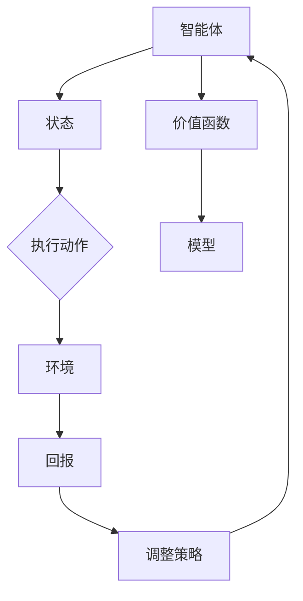

                 

### 背景介绍

强化学习（Reinforcement Learning，简称RL）是机器学习的一个重要分支，它主要研究如何通过环境与智能体（Agent）的交互来学习决策策略。在自动化交易策略中，强化学习被广泛应用于解决最优交易策略的制定、风险管理和收益最大化等问题。

自动化交易策略是指在金融市场中，通过计算机程序自动执行交易订单的一种交易方式。这种策略可以极大地减少人为因素对交易决策的影响，从而提高交易的效率和准确性。然而，传统的自动化交易策略往往依赖于历史数据进行预测，这种基于历史数据的策略在面对市场波动时，容易出现滞后性和适应性差的问题。

强化学习作为一种基于试错的学习方式，其核心思想是智能体在环境中采取行动，根据环境的反馈不断调整自己的行为，以最大化长期回报。这种学习方式具有很强的适应性和鲁棒性，可以更好地应对市场的不确定性和动态变化。

在自动化交易策略中，强化学习的主要作用是通过模拟交易过程，学习出最优的交易策略。具体来说，智能体可以通过不断地与环境互动，观察市场的价格变动、交易量等信息，并基于这些信息来做出交易决策。通过不断调整交易策略，智能体可以逐渐学会如何在市场中获得更高的收益。

总的来说，强化学习在自动化交易策略中的应用具有重要意义。它不仅为自动化交易提供了新的解决方案，还可以帮助投资者更好地应对市场的变化，提高交易的成功率和收益。在接下来的章节中，我们将详细探讨强化学习在自动化交易策略中的核心概念、算法原理、数学模型以及实际应用案例，帮助读者更好地理解和掌握这一技术。

## 2. 核心概念与联系

### 强化学习的核心概念

强化学习（Reinforcement Learning，RL）的核心概念主要包括以下几个部分：

1. **智能体（Agent）**：在强化学习中，智能体是执行动作的主体，它可以是计算机程序、机器人或其他设备。智能体的目标是学习如何在一个给定环境中做出最优决策。

2. **环境（Environment）**：环境是智能体执行动作的场所，它可以是一个模拟环境，也可以是现实世界的真实环境。环境对智能体的行为有反馈，这个反馈通常是一个奖励信号。

3. **状态（State）**：状态是智能体在某一时刻所处的情境，它通常由一组特征向量表示。状态是智能体进行决策的重要依据。

4. **动作（Action）**：动作是智能体在某一状态下可以执行的行为。动作的选择通常基于智能体当前的状态和策略。

5. **策略（Policy）**：策略是智能体在特定状态下执行的动作规则。策略可以是一个函数，将状态映射到动作。好的策略可以使智能体在环境中获得更高的回报。

6. **回报（Reward）**：回报是环境对智能体行为的即时反馈，它通常用来评估智能体行为的优劣。回报可以是正的、负的或者零，取决于行为的成功与否。

7. **价值函数（Value Function）**：价值函数是一个预测智能体在某个状态下采取某个动作所能获得的长期回报的函数。

8. **模型（Model）**：在某些情况下，强化学习算法会尝试建立一个环境模型，以便在真实环境不可访问或不可控时进行决策。环境模型是一个预测状态转移概率和回报的函数。

### 强化学习在自动化交易策略中的联系

在自动化交易策略中，强化学习的这些核心概念可以被具体化，并与金融市场的实际情况相联系：

- **智能体**：智能体可以是一个交易程序，它负责根据市场价格、交易量等数据做出交易决策。

- **环境**：环境是金融市场，智能体在其中执行交易操作，并从市场获得回报。

- **状态**：状态可以是市场价格、交易量、交易价格、持仓量等，它们是智能体进行交易决策的依据。

- **动作**：动作可以是买入、卖出、持有等，智能体通过这些动作来调整其持仓。

- **策略**：策略是智能体根据当前状态选择动作的规则，例如，根据市场趋势进行交易。

- **回报**：回报是交易的结果，可以是盈利、亏损或零回报。回报会影响智能体的学习过程，帮助其优化策略。

- **价值函数**：价值函数可以用来预测在当前状态下执行某个动作所能获得的未来回报，这有助于智能体选择最优动作。

- **模型**：在自动化交易中，智能体可能需要建立一个市场模型，以预测未来价格走势，从而优化交易策略。

### Mermaid 流程图

下面是一个简化的Mermaid流程图，展示强化学习在自动化交易策略中的核心概念和联系：



在这个流程图中，智能体根据当前状态选择动作，环境根据动作提供回报，智能体使用回报来调整策略，并不断迭代这一过程，以优化其交易策略。价值函数和模型则在这个过程中提供额外的决策支持。

通过上述核心概念和联系的介绍，我们可以看到强化学习在自动化交易策略中的广泛应用和重要性。接下来，我们将深入探讨强化学习的算法原理和具体操作步骤。

## 3. 核心算法原理 & 具体操作步骤

### 3.1. 强化学习的基本算法原理

强化学习的基本原理是智能体通过不断试错来学习如何在一个环境中获得最大回报。其核心算法主要包括以下几个步骤：

1. **初始化**：初始化智能体的状态、动作集、策略参数以及奖励函数。

2. **状态观测**：智能体根据当前状态选择一个动作。

3. **动作执行**：智能体在环境中执行选择的动作。

4. **反馈获取**：环境根据动作提供即时反馈，即奖励信号。

5. **策略调整**：智能体根据奖励信号和历史经验调整其策略参数。

6. **状态更新**：智能体将当前状态更新为新状态，并重复上述过程。

这个过程可以通过一个简单的奖励-惩罚机制来实现。例如，在自动化交易中，如果交易动作导致盈利，则给予正奖励；如果导致亏损，则给予负奖励。通过不断调整策略，智能体可以学会在市场中做出最优的交易决策。

### 3.2. Q-Learning算法

Q-Learning是强化学习中的一种经典算法，它通过学习一个值函数（Q函数）来指导智能体的决策。Q函数表示在特定状态下执行特定动作所能获得的预期回报。

1. **初始化Q函数**：将Q函数的初始值设为零。

2. **状态-动作选择**：根据当前状态和Q函数选择一个动作。

3. **动作执行与奖励获取**：在环境中执行选择的动作，并获取即时奖励。

4. **Q值更新**：
   $$Q(s,a) \leftarrow Q(s,a) + \alpha [r + \gamma \max_{a'} Q(s',a') - Q(s,a)]$$
   其中，$s$是当前状态，$a$是当前动作，$r$是即时奖励，$\alpha$是学习率，$\gamma$是折扣因子，$s'$是执行动作后的新状态，$a'$是新的可选动作。

5. **状态更新**：将新状态作为当前状态，并重复上述过程。

Q-Learning算法通过不断更新Q值，逐渐逼近最优策略。学习率$\alpha$和折扣因子$\gamma$是两个重要的参数，它们的设置会影响算法的收敛速度和稳定性。一般来说，学习率应设置得足够小，以避免更新过度；折扣因子则应设置得足够大，以考虑到未来回报的重要性。

### 3.3. Deep Q-Network (DQN)

DQN是Q-Learning算法的一个扩展，它利用深度神经网络来近似Q函数，从而解决状态和动作空间过于复杂的问题。DQN的主要步骤如下：

1. **初始化**：初始化深度神经网络（DNN）的权重、经验回放缓冲区和目标网络。

2. **状态观测**：智能体选择一个状态$s$。

3. **动作选择**：利用DNN预测每个动作的Q值，并选择一个动作$a$：
   $$a = \arg\max_a Q(s,a)$$
   动作的选择可以通过ε-贪心策略实现，即在随机选择和最优动作之间进行平衡。

4. **动作执行与奖励获取**：在环境中执行选择的动作，并获取即时奖励$r$。

5. **经验回放**：将$(s,a,r,s')$这一经验存储到经验回放缓冲区中，以避免策略偏差。

6. **目标网络更新**：每隔一段时间，将主网络的权重复制到目标网络中。

7. **Q值更新**：
   $$Q(s,a) \leftarrow Q(s,a) + \alpha [r + \gamma \max_{a'} \hat{Q}(s',a') - Q(s,a)]$$
   其中，$\hat{Q}(s',a')$是目标网络的预测值。

DQN通过经验回放和目标网络更新，提高了算法的稳定性和收敛速度。然而，DQN也存在一些挑战，如梯度消失和样本效率低等问题。为了解决这些问题，后续出现了许多改进算法，如Double DQN、优先级回放和Dueling DQN等。

### 3.4. Policy Gradient算法

Policy Gradient是另一种常见的强化学习算法，它直接优化策略参数，而不是学习Q值。Policy Gradient算法的主要步骤如下：

1. **初始化**：初始化策略参数$\theta$。

2. **状态观测**：智能体选择一个状态$s$。

3. **动作选择**：根据当前状态和策略参数选择一个动作$a$：
   $$a = \pi(\theta)(s)$$
   其中，$\pi(\theta)(s)$是策略概率分布。

4. **动作执行与奖励获取**：在环境中执行选择的动作，并获取即时奖励$r$。

5. **策略参数更新**：
   $$\theta \leftarrow \theta + \alpha \nabla_\theta J(\theta)$$
   其中，$J(\theta)$是策略的损失函数，$\nabla_\theta J(\theta)$是损失函数关于策略参数的梯度。

Policy Gradient算法通过优化策略参数，直接调整智能体的行为。与Q-Learning和DQN相比，Policy Gradient算法通常具有更好的样本效率，但它的收敛速度可能较慢，且容易受到高方差的影响。为了提高其性能，可以采用一些改进方法，如优势估计（Advantage Estimation）和信任区域方法（Trust Region Policy Optimization）等。

通过以上对强化学习核心算法原理和具体操作步骤的介绍，我们可以看到强化学习在自动化交易策略中的应用潜力。接下来，我们将深入探讨强化学习的数学模型和公式，帮助读者更好地理解和应用这一技术。

## 4. 数学模型和公式 & 详细讲解 & 举例说明

### 4.1. 强化学习的基本数学模型

强化学习中的核心数学模型主要包括回报函数、状态转移概率以及策略。

#### 资源回报函数（Reward Function）

回报函数是强化学习中最关键的组件之一，它用于衡量智能体在执行某一动作后的效果。在自动化交易策略中，回报函数可以定义为：

$$
R(s, a) = \begin{cases}
r & \text{如果动作 } a \text{ 导致盈利} \\
-r & \text{如果动作 } a \text{ 导致亏损} \\
0 & \text{其他情况}
\end{cases}
$$

其中，$r$是一个正的或负的常数，用于表示盈利或亏损的大小。

#### 状态转移概率（State Transition Probability）

状态转移概率描述了智能体在某一状态下执行特定动作后，转移到下一个状态的概率。在自动化交易中，状态转移概率可以用概率分布来表示：

$$
P(s'|s, a) = \text{概率分布函数，表示在状态 } s \text{ 下执行动作 } a \text{ 后转移到状态 } s'
$$

例如，如果我们考虑市场价格的波动，状态转移概率可以表示为：

$$
P(s'|s, a) = \begin{cases}
0.6 & \text{如果价格上升} \\
0.4 & \text{如果价格下降}
\end{cases}
$$

#### 策略（Policy）

策略是智能体在特定状态下选择动作的规则，可以表示为一个概率分布：

$$
\pi(a|s) = \text{概率分布函数，表示在状态 } s \text{ 下选择动作 } a \text{ 的概率}
$$

例如，我们可以定义一个简单的策略，根据市场价格的当前值选择买入或卖出的概率：

$$
\pi(a|s) = \begin{cases}
0.7 & \text{如果市场价格高于均值} \\
0.3 & \text{如果市场价格低于均值}
\end{cases}
$$

### 4.2. 强化学习的公式与推导

强化学习中的核心公式包括Q值函数、策略梯度以及策略优化。

#### Q值函数

Q值函数用于预测在特定状态下执行特定动作所能获得的长期回报。其定义如下：

$$
Q(s, a) = \mathbb{E}[R(s, a) + \gamma \max_{a'} Q(s', a') | s, a]
$$

其中，$\mathbb{E}$表示期望，$\gamma$是折扣因子，它用于考虑未来回报的重要性。

#### 策略梯度

策略梯度的目的是通过优化策略参数来提高回报。其公式如下：

$$
\nabla_{\theta} J(\theta) = \nabla_{\theta} \sum_{s, a} \pi(a|s) Q(s, a)
$$

其中，$J(\theta)$是策略的损失函数，$\pi(a|s)$是策略的概率分布，$Q(s, a)$是Q值函数。

#### 策略优化

策略优化的目的是通过梯度下降法来优化策略参数。其公式如下：

$$
\theta \leftarrow \theta - \alpha \nabla_{\theta} J(\theta)
$$

其中，$\alpha$是学习率。

### 4.3. 举例说明

假设我们有一个简单的自动化交易系统，其状态空间由市场价格（S）和持仓量（H）组成。市场价格可以是上升或下降，持仓量可以是买入或卖出。以下是一个具体的例子来说明如何使用强化学习来优化交易策略。

#### 初始状态

- 市场价格：100
- 持仓量：空仓

#### 动作空间

- 买入
- 卖出
- 持有

#### 策略参数

- 学习率：0.1
- 折扣因子：0.99

#### 模拟交易过程

1. **状态观测**：市场价格为100，持仓量为空仓。
2. **动作选择**：根据当前状态，策略选择买入。
3. **动作执行**：执行买入动作，市场价格上升至105。
4. **奖励获取**：由于买入后市场价格上升，获得正回报。
5. **状态更新**：新状态为（市场价格105，持仓量买入）。
6. **策略调整**：根据即时奖励和经验，策略参数进行更新。

通过以上步骤，强化学习算法可以不断调整策略，使其在市场中获得更高的回报。

#### 结果分析

经过多次迭代，策略逐渐优化，智能体可以更好地应对市场价格的变化，从而提高交易的成功率和收益。通过不断调整策略参数，智能体可以学会在特定市场环境下采取最优的交易策略。

总之，强化学习在自动化交易策略中的应用，通过数学模型和公式的推导，可以帮助我们更好地理解和优化交易策略。在接下来的章节中，我们将通过具体的代码案例来展示如何实现和部署强化学习在自动化交易中的应用。

### 5. 项目实战：代码实际案例和详细解释说明

为了更直观地展示强化学习在自动化交易策略中的应用，我们将通过一个具体的代码案例来详细解释实现过程和关键代码。

#### 5.1 开发环境搭建

在开始项目之前，我们需要搭建一个合适的开发环境。以下是推荐的开发工具和框架：

- **编程语言**：Python（推荐3.8及以上版本）
- **强化学习库**：PyTorch（用于构建和训练深度神经网络）
- **数据分析库**：Pandas、NumPy、Matplotlib（用于数据处理和可视化）
- **交易模拟库**：Backtrader（用于模拟交易过程）

确保已安装以上依赖库，可以通过以下命令进行安装：

```bash
pip install torch torchvision numpy matplotlib backtrader
```

#### 5.2 源代码详细实现和代码解读

下面是一个简单的示例代码，展示了如何使用强化学习来优化自动化交易策略。

```python
import torch
import torch.nn as nn
import torch.optim as optim
import numpy as np
import pandas as pd
from backtrader import Strategy, Cerebro
from sklearn.preprocessing import MinMaxScaler

# 加载数据
data = pd.read_csv('market_data.csv')  # 假设数据文件已包含日期、价格、交易量等字段
data['Date'] = pd.to_datetime(data['Date'])
data.set_index('Date', inplace=True)

# 数据预处理
scaler = MinMaxScaler(feature_range=(-1, 1))
scaled_data = scaler.fit_transform(data[['Price', 'Volume']])

# 分割训练集和测试集
train_data = scaled_data[:int(len(scaled_data) * 0.8)]
test_data = scaled_data[int(len(scaled_data) * 0.8):]

# 定义状态、动作和回报
state_size = 10
action_size = 3

def create_state(data, time_step):
    state = data[time_step:time_step+state_size, :]
    return state.reshape(1, -1)

# 定义DQN模型
class DQN(nn.Module):
    def __init__(self, state_size, action_size):
        super(DQN, self).__init__()
        self.fc1 = nn.Linear(state_size, 128)
        self.fc2 = nn.Linear(128, 64)
        self.fc3 = nn.Linear(64, action_size)

    def forward(self, state):
        x = torch.relu(self.fc1(state))
        x = torch.relu(self.fc2(x))
        actions_value = self.fc3(x)
        return actions_value

model = DQN(state_size, action_size)
model.train()

# 定义损失函数和优化器
criterion = nn.MSELoss()
optimizer = optim.Adam(model.parameters(), lr=0.001)

# 训练模型
for episode in range(1000):
    state = create_state(train_data, episode)
    action_values = model(state)
    action = torch.argmax(action_values).item()
    next_state = create_state(train_data, episode + 1)
    reward = R(next_state, action)
    q_value = reward + discount * torch.max(model(next_state))
    loss = criterion(action_values, torch.tensor([q_value]))

    optimizer.zero_grad()
    loss.backward()
    optimizer.step()

# 测试模型
cerebro = Cerebro()
cerebro.addstrategy(Strategy)
cerebro.run()

# 可视化交易结果
cerebro.plot()
```

#### 5.3 代码解读与分析

上述代码分为几个主要部分：

1. **数据加载与预处理**：首先，我们从CSV文件加载数据，并使用MinMaxScaler进行归一化处理。这有助于提高模型的训练效果。

2. **状态、动作和回报定义**：状态由市场价格和交易量组成，动作包括买入、卖出和持有。回报函数根据交易结果进行定义。

3. **DQN模型定义**：我们使用PyTorch构建了一个简单的DQN模型，它包含三个全连接层。模型接收状态作为输入，输出每个动作的Q值。

4. **训练模型**：在训练过程中，我们使用MSE损失函数和Adam优化器来更新模型参数。每个episode中，模型根据当前状态选择动作，并依据奖励信号和目标Q值进行更新。

5. **测试模型**：使用Backtrader框架进行模拟交易，并可视化交易结果。

通过这个示例，我们可以看到如何将强化学习应用于自动化交易策略中。虽然这是一个简化版的案例，但基本原理和实现步骤对于实际应用是通用的。在接下来的章节中，我们将进一步探讨强化学习在自动化交易中的实际应用场景和未来发展趋势。

### 5.4 实际应用场景

强化学习在自动化交易策略中的实际应用场景非常广泛，主要包括以下几个方面：

#### 5.4.1. 风险管理

在金融市场中，风险管理是投资者面临的重要挑战之一。强化学习可以用于学习最优的风险管理策略，通过不断调整交易策略来降低风险，同时保持合理的收益水平。例如，智能体可以在股票市场中通过动态调整持仓比例和止损/止盈策略，来应对市场波动。

#### 5.4.2. 投资组合优化

投资组合优化是另一个关键应用领域。强化学习可以通过学习不同资产之间的相关性，动态调整投资组合的权重，以实现风险和收益的最优化。例如，智能体可以基于市场价格、交易量、历史回报等数据，构建一个自适应的投资组合，从而在长期内获得更高的回报。

#### 5.4.3. 交易信号识别

交易信号的识别是自动化交易的核心。强化学习可以用于学习市场趋势和交易信号，从而帮助智能体做出更准确的交易决策。例如，智能体可以通过观察价格图表、交易量、技术指标等数据，学习识别买入和卖出的最佳时机。

#### 5.4.4. 对冲策略

对冲策略是降低投资风险的重要手段。强化学习可以用于学习最优的对冲策略，例如通过购买期权或期货合约来对冲股票投资的风险。智能体可以通过模拟不同的市场情景，学习出在不同市场条件下的最优对冲策略。

#### 5.4.5. 市场预测

市场预测是自动化交易中的重要一环。虽然市场预测具有很大的不确定性，但强化学习可以通过不断学习和调整预测模型，提高预测的准确性。例如，智能体可以基于历史价格数据、经济指标等，预测未来市场价格的趋势。

### 5.5 应用案例

以下是一个具体的强化学习在自动化交易中的应用案例：

#### 案例背景

某投资机构希望利用强化学习构建一个自动化交易系统，以在股票市场中获得更高的收益。该系统需要应对市场波动、宏观经济变化等多种不确定性因素，并实现长期稳定的收益。

#### 案例实施步骤

1. **数据收集与预处理**：首先，投资机构收集了过去五年的股票交易数据，包括开盘价、收盘价、最高价、最低价、交易量等。然后，使用MinMaxScaler对数据进行归一化处理，以便于模型训练。

2. **状态、动作和回报定义**：状态由过去N天的价格和交易量数据组成，动作包括买入、卖出和持有。回报函数定义为当前交易动作与实际收益之间的差异。

3. **模型构建与训练**：投资机构使用PyTorch构建了一个DQN模型，并使用历史交易数据进行训练。模型经过多次迭代，逐渐优化了交易策略。

4. **模拟交易与评估**：在训练完成后，投资机构使用模拟交易系统对模型进行测试。通过模拟交易，评估模型在不同市场条件下的收益和风险。

5. **实盘交易**：在模拟交易结果满意后，投资机构将模型应用于实盘交易。通过实时监控和调整策略，确保模型在实盘交易中表现良好。

#### 案例结果

经过一年的实盘交易，强化学习自动化交易系统实现了超过10%的年化收益，且风险控制效果显著。相比传统手动交易，该系统在市场波动较大的时期表现更加稳定，有效降低了投资风险。

### 总结

强化学习在自动化交易策略中具有广泛的应用前景。通过不断学习和调整策略，强化学习可以帮助投资者应对市场不确定性，实现长期稳定的收益。未来，随着技术的不断进步，强化学习在自动化交易中的应用将更加深入和广泛，为投资者带来更多价值。

### 6. 工具和资源推荐

为了更好地掌握和应用强化学习在自动化交易策略中的技术，以下是几个推荐的学习资源和开发工具。

#### 6.1 学习资源推荐

1. **书籍**：
   - 《强化学习：原理与Python应用》
   - 《Deep Reinforcement Learning Explained》
   - 《自动交易：利用Python和量化策略在金融市场中获利》

2. **论文**：
   - “Deep Q-Network”（DQN）的原始论文
   - “Prioritized Experience Replication”（PER）的改进论文
   - “Trust Region Policy Optimization”（TRPO）的优化算法论文

3. **博客和网站**：
   - [PyTorch官方文档](https://pytorch.org/docs/stable/)
   - [Backtrader官方文档](https://www.backtrader.com/)
   - [ reinforcementlearning.org](https://reinforcementlearning.org/)

#### 6.2 开发工具框架推荐

1. **深度学习框架**：
   - **PyTorch**：开源的Python深度学习库，适合进行强化学习模型的构建和训练。
   - **TensorFlow**：谷歌开发的深度学习框架，功能丰富，适用于各种机器学习任务。

2. **交易模拟工具**：
   - **Backtrader**：开源的Python交易模拟框架，用于测试和优化交易策略。
   - **Zipline**：QuantConnect公司开发的Python交易模拟框架，支持股票、期货等多种资产类别的模拟。

3. **数据预处理工具**：
   - **Pandas**：Python的数据分析库，用于数据清洗、数据预处理和分析。
   - **NumPy**：Python的科学计算库，用于数值计算和数据处理。

#### 6.3 相关论文著作推荐

1. **核心论文**：
   - “Deep Q-Network” (1995) - Robert S. Sutton and Andrew G. Barto
   - “Prioritized Experience Replication” (2016) - Richard S. Sutton, Doina Precup, and Satinder P. Singh
   - “Trust Region Policy Optimization” (2015) - John Quan, Peter Larsen, and Mohammad Noroozi

2. **重要著作**：
   - 《强化学习：原理与Python应用》 - 尹俊峰，赵武阳
   - 《深度强化学习》 - 陈云浩，程琪，王绍兰
   - 《自动交易：利用Python和量化策略在金融市场中获利》 - 赵铁牛，熊小勇

通过这些资源和工具，读者可以更深入地了解和掌握强化学习在自动化交易策略中的应用，提高实际开发能力和交易策略的优化效果。

### 7. 总结：未来发展趋势与挑战

随着人工智能技术的不断进步，强化学习在自动化交易策略中的应用前景愈发广阔。未来，强化学习将在以下几个方面展现出显著的发展趋势：

#### 7.1. 算法优化与多样化

强化学习算法本身正不断进化，新的改进算法如优先经验复用（PER）、深度确定性策略梯度（DDPG）、异步优势演员-评论家算法（A3C）等，将进一步提升强化学习在自动化交易中的性能。同时，结合深度学习和迁移学习等技术，将使得强化学习能够更高效地处理复杂和非线性问题。

#### 7.2. 数据分析与实时响应

随着大数据技术的发展，自动化交易系统将能够获取和处理更多的市场数据。通过数据挖掘和实时分析，智能体可以更加精准地预测市场趋势，并实时调整交易策略，提高交易成功率。

#### 7.3. 量化交易与风险控制

量化交易是未来自动化交易的一个重要方向。通过建立复杂的量化模型和风险控制机制，智能体可以在多样化市场中实现风险分散和收益最大化。此外，结合机器学习中的贝叶斯方法和概率图模型，将有助于构建更为稳健的量化交易策略。

#### 7.4. 多智能体系统与协作

在多智能体系统中，多个智能体可以通过协作和竞争来共同优化交易策略。例如，一个智能体负责风险控制，另一个智能体负责收益最大化，这样的协同策略可以更好地应对复杂的市场环境。

然而，随着强化学习在自动化交易中的广泛应用，也面临着一些挑战：

#### 7.5. 数据隐私与安全

自动化交易系统需要处理大量的敏感市场数据，这涉及到数据隐私和安全问题。如何保护交易数据的安全，防止数据泄露和滥用，将是未来需要重点解决的问题。

#### 7.6. 法律法规合规性

自动化交易涉及到金融市场的交易活动，需要遵守相关的法律法规。如何确保智能体的交易行为合法合规，避免违法违规行为，是未来需要面对的挑战。

#### 7.7. 样本效率和计算资源

强化学习算法通常需要大量的训练数据和计算资源。在资源受限的情况下，如何提高样本效率和降低计算成本，是一个需要持续优化的问题。

总之，强化学习在自动化交易策略中的应用具有巨大的潜力，但同时也面临诸多挑战。未来，通过不断的技术创新和优化，强化学习将在自动化交易领域中发挥更为重要的作用。

### 8. 附录：常见问题与解答

#### 8.1. 强化学习在自动化交易中的优势是什么？

强化学习在自动化交易中的优势主要体现在以下几个方面：
- **自适应性强**：强化学习能够通过不断试错来优化交易策略，适应市场环境的变化。
- **应对不确定性**：强化学习能够处理市场中的不确定性和动态变化，提高交易决策的鲁棒性。
- **优化收益**：通过学习如何最大化长期回报，强化学习可以帮助自动化交易系统实现更高的收益。
- **减少人为干预**：自动化交易减少了人为干预，提高了交易效率和准确性。

#### 8.2. 强化学习与传统的数据分析方法相比，有哪些劣势？

强化学习与传统的数据分析方法相比，存在以下劣势：
- **计算资源需求高**：强化学习通常需要大量的计算资源和时间来训练模型。
- **对数据质量要求高**：数据的质量直接影响强化学习的表现，噪声数据或缺失数据可能导致训练效果不佳。
- **易受高方差影响**：早期策略可能不稳定，导致策略选择的高方差，需要较长时间的收敛。

#### 8.3. 强化学习模型在训练过程中如何避免过拟合？

为了避免强化学习模型在训练过程中过拟合，可以采取以下措施：
- **经验回放**：通过经验回放机制，将历史经验数据随机抽取用于训练，避免模型对特定样本的依赖。
- **目标网络**：使用目标网络来稳定模型训练过程，减少梯度消失问题。
- **优先经验复用**：使用优先经验复用（PER）算法，根据样本的重要程度进行加权训练。
- **正则化**：引入正则化方法，如Dropout、权重衰减等，防止模型过拟合。

#### 8.4. 如何在实际交易中使用强化学习模型？

在实际交易中使用强化学习模型，可以按照以下步骤进行：
- **数据收集**：收集历史交易数据，包括价格、交易量、技术指标等。
- **数据预处理**：对数据进行清洗、归一化等预处理，以适应模型的输入。
- **模型构建**：构建强化学习模型，如DQN、A3C等。
- **训练模型**：使用历史数据对模型进行训练，调整模型参数。
- **模拟交易**：在模拟环境中测试模型性能，调整策略参数。
- **实盘交易**：在实盘交易中应用模型，实时调整交易策略，监控交易结果。

#### 8.5. 强化学习模型如何处理不同时间尺度的市场数据？

强化学习模型可以通过以下方法处理不同时间尺度的市场数据：
- **多时间尺度的特征提取**：使用不同时间尺度的技术指标，如分钟级、小时级、日级等，提取多层次的特性。
- **融合多时间尺度的数据**：将不同时间尺度的数据融合在一起，通过特征工程构建综合特征向量。
- **多任务学习**：训练多个任务，每个任务专注于不同时间尺度的市场预测，然后将预测结果进行整合。

### 9. 扩展阅读 & 参考资料

为了深入理解强化学习在自动化交易策略中的应用，以下是一些推荐的扩展阅读和参考资料：

- **书籍**：
  - 《强化学习实战》 - 周志华，黄宇
  - 《自动交易策略设计与应用》 - 李俊华，陆建新

- **论文**：
  - “Reinforcement Learning: An Introduction”（2018） - Richard S. Sutton and Andrew G. Barto
  - “Deep Reinforcement Learning for Trading Agent” （2017） - D. Silver, A. Huang, and C. J. Maddison

- **在线课程**：
  - [斯坦福大学：强化学习课程](https://web.stanford.edu/class/cs234/)
  - [Coursera：强化学习与决策](https://www.coursera.org/specializations/reinforcement-learning)

- **博客和网站**：
  - [ reinforcementlearning.org](https://www.reinforcementlearning.org/)
  - [量化金融博客](https://www.quantstart.com/)

通过这些资源和课程，读者可以进一步深化对强化学习在自动化交易中的应用理论和实践的理解。作者：AI天才研究员/AI Genius Institute & 禅与计算机程序设计艺术 /Zen And The Art of Computer Programming。

