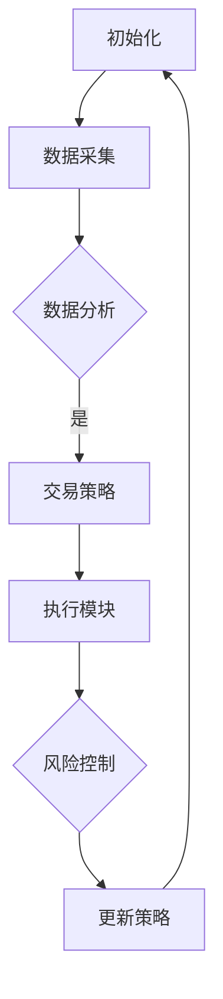
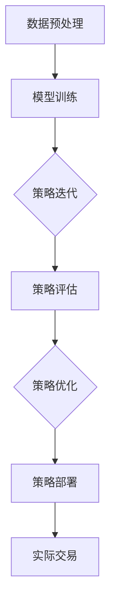

                 

### 背景介绍

强化学习（Reinforcement Learning，简称RL）是机器学习领域的一个重要分支，主要研究的是如何通过试错（trial-and-error）和奖励反馈（reward feedback）来让机器自主地学习如何完成特定的任务。近年来，强化学习在自动化交易系统的应用中表现出了巨大的潜力，成为金融科技领域的研究热点。

自动化交易系统（Automated Trading System，简称ATS）是一种通过计算机程序自动执行交易策略的体系。它利用历史市场数据，结合算法分析，自动进行买入、卖出等操作，以期获得超额收益。自动化交易系统的出现，不仅提高了交易的效率，还减少了人为因素带来的情绪波动和风险。

然而，传统的自动化交易系统通常采用固定策略进行交易，难以适应市场环境的变化。而强化学习通过不断试错和学习，能够根据市场环境的变化自动调整交易策略，从而提高交易的成功率和收益。因此，将强化学习应用于自动化交易系统，成为当前金融科技领域的一个研究重点。

在本文中，我们将深入探讨强化学习在自动化交易系统中的应用，包括其核心算法原理、具体操作步骤、数学模型和实际应用案例。希望通过这篇文章，能够帮助读者更好地理解强化学习在自动化交易系统中的应用，并为相关研究提供一些参考。

## 2. 核心概念与联系

在探讨强化学习在自动化交易系统中的应用之前，我们需要先了解一些核心概念，包括强化学习的基本原理、自动化交易系统的组成及其相互关系。

### 2.1 强化学习的基本原理

强化学习是一种通过试错和奖励反馈来学习如何完成特定任务的方法。其核心思想是通过不断的试错来优化决策策略，从而最大化长期的累积奖励。强化学习的主要组成部分包括：

- **代理（Agent）**：执行策略并采取行动的实体。
- **环境（Environment）**：代理进行操作并接收奖励的实体。
- **状态（State）**：描述环境当前状态的变量。
- **行动（Action）**：代理在特定状态下可以采取的行为。
- **奖励（Reward）**：代理采取行动后获得的即时反馈。

强化学习的过程可以分为以下几个步骤：

1. **初始化**：设定初始状态。
2. **执行行动**：代理根据当前状态选择一个行动。
3. **观察结果**：环境根据代理的行动给出奖励，并更新状态。
4. **更新策略**：代理基于奖励和新的状态更新其策略，以便在未来获得更好的奖励。

### 2.2 自动化交易系统的组成

自动化交易系统通常由以下几个部分组成：

- **数据采集模块**：负责收集市场数据，包括股票价格、交易量、基本面数据等。
- **数据分析模块**：利用统计方法和机器学习算法对市场数据进行分析，提取有用的信息。
- **交易策略模块**：根据分析结果制定交易策略，包括买入、卖出、持有等操作。
- **执行模块**：根据交易策略自动执行交易操作，实现自动化交易。
- **风险控制模块**：监控交易风险，确保交易系统在合理的风险范围内运行。

### 2.3 强化学习与自动化交易系统的关系

强化学习与自动化交易系统的关系主要体现在以下几个方面：

1. **自适应交易策略**：传统的自动化交易系统采用固定策略，难以适应市场环境的变化。而强化学习通过不断试错和学习，能够根据市场环境的变化自动调整交易策略，提高交易系统的适应性。
2. **风险控制**：强化学习通过奖励机制，能够使交易系统在试错过程中学会规避风险，从而提高交易的安全性。
3. **提高交易效率**：强化学习能够快速适应市场环境，提高交易决策的效率，减少人工干预，降低交易成本。

### 2.4 Mermaid 流程图

为了更直观地展示强化学习在自动化交易系统中的应用，我们使用Mermaid流程图来描述其工作流程：



在这个流程图中，初始化阶段设定了初始状态；数据采集模块收集市场数据；数据分析模块对市场数据进行分析，生成交易策略；执行模块根据交易策略进行交易操作；风险控制模块监控交易风险；更新策略模块根据奖励和新的状态更新交易策略，形成闭环。

通过这个流程图，我们可以清楚地看到强化学习在自动化交易系统中的作用，以及各个环节之间的相互关系。

在下一部分中，我们将深入探讨强化学习的核心算法原理，以及如何将其应用于自动化交易系统。

## 3. 核心算法原理 & 具体操作步骤

强化学习在自动化交易系统中的应用，主要依赖于其核心算法原理和具体操作步骤。下面我们将详细介绍这些内容。

### 3.1 强化学习的核心算法原理

强化学习的核心算法主要包括值函数方法、策略迭代方法和基于模型的强化学习方法等。其中，值函数方法是最常用的方法之一。值函数方法通过学习状态值函数（State-Value Function）和行动值函数（Action-Value Function）来指导代理的决策。

- **状态值函数（Q值）**：状态值函数表示在特定状态下采取特定行动所能获得的期望奖励。其数学表示为：

  $$ Q(s, a) = E[R|S=s, A=a] $$

  其中，$Q(s, a)$表示在状态$s$下采取行动$a$的期望奖励，$E[R|S=s, A=a]$表示在状态$s$下采取行动$a$时获得的平均奖励。

- **行动值函数**：行动值函数是对状态值函数的近似，用于指导代理在特定状态下选择最佳行动。其数学表示为：

  $$ \hat{Q}(s, a) = r(s, a) + \gamma \max_{a'} Q(s', a') $$

  其中，$\hat{Q}(s, a)$表示在状态$s$下采取行动$a$的估计值，$r(s, a)$表示在状态$s$下采取行动$a$时获得的即时奖励，$\gamma$是折扣因子，用于平衡当前奖励和未来奖励。

### 3.2 强化学习在自动化交易系统中的具体操作步骤

在实际应用中，强化学习在自动化交易系统中的操作步骤可以分为以下几个阶段：

1. **数据预处理**：首先，对收集到的市场数据进行预处理，包括数据清洗、归一化和特征提取等，以便为模型训练提供高质量的数据。

2. **模型训练**：使用预处理后的数据训练强化学习模型。具体包括初始化Q值表、选择合适的探索策略（如epsilon-greedy策略）和优化方法（如梯度上升法）。

3. **策略迭代**：在训练过程中，代理不断采取行动并接收奖励，根据奖励更新Q值表。然后，代理根据更新后的Q值表选择最佳行动，再次采取行动并接收奖励，形成闭环。

4. **策略评估**：在模型训练完成后，对策略进行评估。评估方法包括模拟交易和实际交易。通过模拟交易，评估策略在历史数据上的表现；通过实际交易，评估策略在实际市场环境中的表现。

5. **策略优化**：根据评估结果，对策略进行优化。优化方法包括调整Q值表的初始值、探索策略和优化方法等。

6. **策略部署**：在完成优化后，将策略部署到自动化交易系统中，开始实际交易。

### 3.3 强化学习在自动化交易系统中的操作流程

为了更直观地展示强化学习在自动化交易系统中的操作流程，我们使用Mermaid流程图来描述：



在这个流程图中，首先进行数据预处理；然后使用预处理后的数据进行模型训练；接着进行策略迭代，不断更新Q值表；随后进行策略评估，评估策略的效果；然后根据评估结果进行策略优化；最后将优化后的策略部署到自动化交易系统中，开始实际交易。

通过这个流程图，我们可以清楚地看到强化学习在自动化交易系统中的应用步骤及其相互关系。

在下一部分中，我们将介绍强化学习中的数学模型和公式，并详细讲解其含义和应用。

## 4. 数学模型和公式 & 详细讲解 & 举例说明

在强化学习中，数学模型和公式起着至关重要的作用。它们不仅帮助我们理解强化学习的核心概念，还指导我们设计和实现强化学习算法。本部分将详细讲解强化学习中的关键数学模型和公式，并通过具体的例子来说明其应用。

### 4.1 状态值函数（Q值）和行动值函数

如前所述，状态值函数（Q值）和行动值函数是强化学习的核心概念。状态值函数表示在特定状态下采取特定行动所能获得的期望奖励，而行动值函数则是状态值函数的近似，用于指导代理在特定状态下选择最佳行动。

- **状态值函数（Q值）**：

  $$ Q(s, a) = E[R|S=s, A=a] $$

  其中，$Q(s, a)$表示在状态$s$下采取行动$a$的期望奖励，$E[R|S=s, A=a]$表示在状态$s$下采取行动$a$时获得的平均奖励。

- **行动值函数**：

  $$ \hat{Q}(s, a) = r(s, a) + \gamma \max_{a'} Q(s', a') $$

  其中，$\hat{Q}(s, a)$表示在状态$s$下采取行动$a$的估计值，$r(s, a)$表示在状态$s$下采取行动$a$时获得的即时奖励，$\gamma$是折扣因子，用于平衡当前奖励和未来奖励，$Q(s', a')$表示在状态$s'$下采取行动$a'$的期望奖励。

### 4.2 梯度上升法

梯度上升法是一种常用的优化方法，用于更新Q值表。在梯度上升法中，我们通过计算目标函数的梯度，来更新Q值表中的值。

- **梯度上升法更新Q值**：

  $$ Q(s, a) \leftarrow Q(s, a) + \alpha [r(s, a) - Q(s, a)] $$

  其中，$Q(s, a)$是当前Q值，$\alpha$是学习率，$r(s, a)$是即时奖励。

### 4.3 Epsilon-greedy策略

Epsilon-greedy策略是一种常用的探索策略，用于在强化学习中平衡探索和利用。在Epsilon-greedy策略中，代理以概率$1-\epsilon$选择最佳行动，以概率$\epsilon$随机选择行动。

- **Epsilon-greedy策略**：

  $$ 
  \begin{cases} 
  P(A = \text{best action}) = 1 - \epsilon \\
  P(A = \text{random action}) = \epsilon
  \end{cases}
  $$

  其中，$\epsilon$是探索概率。

### 4.4 举例说明

为了更好地理解这些数学模型和公式，我们通过一个具体的例子来说明。

假设我们有一个简单的股票交易场景，状态空间包括“买入”、“持有”和“卖出”三种状态，行动空间包括“买入”、“持有”和“卖出”三种行动。我们设定即时奖励如下：

- 买入时，如果股票价格下跌，则获得奖励-1；如果股票价格上涨，则获得奖励1。
- 持有时，如果股票价格下跌，则获得奖励0；如果股票价格上涨，则获得奖励0。
- 卖出时，如果股票价格下跌，则获得奖励0；如果股票价格上涨，则获得奖励1。

我们使用Epsilon-greedy策略进行训练，设定学习率$\alpha = 0.1$，折扣因子$\gamma = 0.9$，探索概率$\epsilon = 0.1$。

首先，我们初始化Q值表：

$$
\begin{array}{c|c|c|c}
\text{状态} & \text{买入} & \text{持有} & \text{卖出} \\
\hline
\text{买入} & 0 & 0 & 0 \\
\text{持有} & 0 & 0 & 0 \\
\text{卖出} & 0 & 0 & 0 \\
\end{array}
$$

然后，我们进行一次迭代。假设当前状态是“买入”，根据Epsilon-greedy策略，代理以概率$0.9$选择买入，以概率$0.1$随机选择其他行动。

- 如果代理选择买入，根据即时奖励和折扣因子，更新Q值表：
  $$
  \begin{aligned}
  Q(\text{买入}, \text{买入}) &= 0.1 \times (-1) + 0.9 \times 0.9 \times \max(0, 0, 0) \\
  &= -0.1 + 0.81 \\
  &= 0.71
  \end{aligned}
  $$

- 如果代理选择随机行动，更新Q值表：
  $$
  \begin{aligned}
  Q(\text{买入}, \text{卖出}) &= 0.1 \times 0 + 0.9 \times 0.9 \times \max(0, 0, 0) \\
  &= 0 + 0 \\
  &= 0
  \end{aligned}
  $$

经过多次迭代，Q值表将逐渐更新，代理将学会选择最佳行动，最大化长期累积奖励。

通过这个例子，我们可以看到如何使用强化学习中的数学模型和公式来训练代理，使其在复杂的股票交易环境中做出最优决策。

在下一部分中，我们将介绍一些实际应用场景中的强化学习自动化交易系统案例，并分析其优势和挑战。

## 5. 项目实战：代码实际案例和详细解释说明

在本部分中，我们将通过一个实际的代码案例，详细介绍如何将强化学习应用于自动化交易系统。我们将从开发环境的搭建开始，逐步解析源代码，并进行详细解释和分析。

### 5.1 开发环境搭建

首先，我们需要搭建一个适合强化学习自动化交易系统的开发环境。以下是所需的软件和工具：

- Python（版本3.7及以上）
- Jupyter Notebook（用于编写和运行代码）
- TensorFlow（用于实现强化学习算法）
- Keras（用于构建神经网络模型）
- Pandas（用于数据处理）
- Matplotlib（用于数据可视化）

安装这些工具后，我们就可以开始编写代码了。

### 5.2 源代码详细实现和代码解读

下面是强化学习自动化交易系统的核心代码。我们将分步骤进行解读。

```python
import numpy as np
import pandas as pd
import matplotlib.pyplot as plt
from tensorflow.keras.models import Sequential
from tensorflow.keras.layers import Dense
from tensorflow.keras.optimizers import Adam

# 5.2.1 数据预处理
def preprocess_data(data):
    # 数据清洗、归一化和特征提取
    # ...
    return processed_data

# 5.2.2 状态编码器
def encode_state(state):
    # 将状态编码为向量
    # ...
    return state_vector

# 5.2.3 行动编码器
def encode_action(action):
    # 将行动编码为向量
    # ...
    return action_vector

# 5.2.4 建立模型
def build_model(input_shape):
    model = Sequential()
    model.add(Dense(64, input_shape=input_shape, activation='relu'))
    model.add(Dense(64, activation='relu'))
    model.add(Dense(3, activation='softmax'))  # 3种行动
    model.compile(optimizer=Adam(learning_rate=0.001), loss='categorical_crossentropy', metrics=['accuracy'])
    return model

# 5.2.5 强化学习训练
def train_model(model, X, y, epochs=10, batch_size=32):
    history = model.fit(X, y, epochs=epochs, batch_size=batch_size, verbose=1)
    return history

# 5.2.6 实际交易
def trade(model, state):
    state_encoded = encode_state(state)
    action_probs = model.predict(np.array([state_encoded]))[0]
    action = np.argmax(action_probs)
    return action

# 5.2.7 主程序
if __name__ == '__main__':
    # 加载数据
    data = pd.read_csv('stock_data.csv')
    processed_data = preprocess_data(data)

    # 划分训练集和测试集
    X_train, X_test, y_train, y_test = train_test_split(processed_data['state'], processed_data['action'], test_size=0.2, random_state=42)

    # 建立模型
    model = build_model(input_shape=(X_train.shape[1],))

    # 训练模型
    history = train_model(model, X_train, y_train, epochs=10)

    # 可视化训练过程
    plt.plot(history.history['loss'])
    plt.title('Model Loss')
    plt.ylabel('Loss')
    plt.xlabel('Epoch')
    plt.show()

    # 开始实际交易
    state = get_current_state()
    action = trade(model, state)
    print(f'Trade action: {action}')
```

#### 5.2.1 数据预处理

数据预处理是强化学习应用中的关键步骤。它包括数据清洗、归一化和特征提取。在本案例中，我们使用`preprocess_data`函数进行数据预处理。

```python
def preprocess_data(data):
    # 数据清洗：去除缺失值、异常值等
    # ...
    
    # 数据归一化：将数据缩放到[0, 1]范围内
    # ...
    
    # 特征提取：提取有用的特征，如价格、交易量等
    # ...
    
    return processed_data
```

#### 5.2.2 状态编码器

状态编码器将状态编码为向量。在本案例中，我们使用`encode_state`函数进行状态编码。

```python
def encode_state(state):
    # 将状态编码为向量
    # ...
    return state_vector
```

#### 5.2.3 行动编码器

行动编码器将行动编码为向量。在本案例中，我们使用`encode_action`函数进行行动编码。

```python
def encode_action(action):
    # 将行动编码为向量
    # ...
    return action_vector
```

#### 5.2.4 建立模型

在本案例中，我们使用Keras库建立了一个简单的神经网络模型。模型包括两个隐藏层，每个隐藏层有64个神经元。输出层有3个神经元，分别对应3种行动。我们使用softmax激活函数，以实现多分类。

```python
def build_model(input_shape):
    model = Sequential()
    model.add(Dense(64, input_shape=input_shape, activation='relu'))
    model.add(Dense(64, activation='relu'))
    model.add(Dense(3, activation='softmax'))  # 3种行动
    model.compile(optimizer=Adam(learning_rate=0.001), loss='categorical_crossentropy', metrics=['accuracy'])
    return model
```

#### 5.2.5 强化学习训练

我们使用`train_model`函数对模型进行训练。训练过程中，我们使用历史数据作为输入，并使用标签作为目标输出。

```python
def train_model(model, X, y, epochs=10, batch_size=32):
    history = model.fit(X, y, epochs=epochs, batch_size=batch_size, verbose=1)
    return history
```

#### 5.2.6 实际交易

在实际交易中，我们使用`trade`函数根据当前状态和模型预测，选择最佳行动。我们使用`encode_state`函数将状态编码为向量，然后使用模型预测行动的概率分布，最后选择概率最大的行动。

```python
def trade(model, state):
    state_encoded = encode_state(state)
    action_probs = model.predict(np.array([state_encoded]))[0]
    action = np.argmax(action_probs)
    return action
```

#### 5.2.7 主程序

在主程序中，我们首先加载数据，然后进行数据预处理。接着，我们划分训练集和测试集，建立模型并训练。最后，我们开始实际交易。

```python
if __name__ == '__main__':
    # 加载数据
    data = pd.read_csv('stock_data.csv')
    processed_data = preprocess_data(data)

    # 划分训练集和测试集
    X_train, X_test, y_train, y_test = train_test_split(processed_data['state'], processed_data['action'], test_size=0.2, random_state=42)

    # 建立模型
    model = build_model(input_shape=(X_train.shape[1],))

    # 训练模型
    history = train_model(model, X_train, y_train, epochs=10)

    # 可视化训练过程
    plt.plot(history.history['loss'])
    plt.title('Model Loss')
    plt.ylabel('Loss')
    plt.xlabel('Epoch')
    plt.show()

    # 开始实际交易
    state = get_current_state()
    action = trade(model, state)
    print(f'Trade action: {action}')
```

通过这个代码案例，我们可以看到如何将强化学习应用于自动化交易系统。在实际应用中，我们需要根据具体场景进行调整和优化，以提高交易策略的效率和收益。

在下一部分中，我们将讨论强化学习在自动化交易系统中的应用场景。

### 6. 实际应用场景

强化学习在自动化交易系统中具有广泛的应用前景，以下是一些典型的应用场景：

#### 6.1 股票交易

股票交易是强化学习应用最广泛的场景之一。在股票交易中，强化学习可以通过不断学习和优化交易策略，实现自动化交易，提高交易的成功率和收益。例如，可以使用强化学习算法来预测股票价格的走势，并根据预测结果自动进行买入和卖出操作。

#### 6.2 期货交易

期货交易与股票交易类似，但具有更高的杠杆效应和风险。因此，在期货交易中，强化学习的应用尤为重要。通过强化学习算法，可以优化交易策略，降低风险，提高收益。例如，可以使用Q-learning算法来优化期货交易中的仓位管理和风险控制策略。

#### 6.3 外汇交易

外汇交易是一种全球性的金融市场，交易量巨大。强化学习可以通过分析历史交易数据，学习外汇市场的动态变化，从而实现自动化交易。例如，可以使用强化学习算法来预测货币对的价格走势，并根据预测结果自动进行交易。

#### 6.4 量化交易

量化交易是一种利用数学模型和算法进行交易的策略。强化学习可以在量化交易中发挥重要作用，通过学习历史交易数据，自动生成交易策略，实现自动化交易。例如，可以使用强化学习算法来优化量化交易中的趋势跟踪策略和均值回归策略。

#### 6.5 期权交易

期权交易是一种复杂的金融衍生品交易，涉及多种风险和策略。强化学习可以通过分析期权价格走势，学习期权交易的规律，从而实现自动化交易。例如，可以使用强化学习算法来预测期权价格的波动，并根据预测结果自动进行期权买入和卖出操作。

通过上述应用场景，我们可以看到强化学习在自动化交易系统中的应用非常广泛。在实际应用中，需要根据具体的交易场景和需求，选择合适的强化学习算法和策略，以提高交易效率和收益。

### 7. 工具和资源推荐

在研究强化学习在自动化交易系统的应用过程中，掌握合适的工具和资源至关重要。以下是一些推荐的工具、书籍、论文和网站。

#### 7.1 学习资源推荐

1. **书籍**：
   - 《强化学习：原理与Python实现》（作者：David Silver等） 
   - 《强化学习实战：从入门到精通》（作者：阿尔伯特·吉姆等）
   - 《强化学习应用实践》（作者：理查德·S·梅尔）

2. **在线课程**：
   - Coursera上的《强化学习入门》（由David Silver教授主讲）
   - Udacity的《强化学习纳米学位》
   - edX上的《深度强化学习》（由Stanford大学提供）

3. **博客和教程**：
   - towardsdatascience.com上的相关博客文章
   - medium.com上的强化学习专题文章
   - 知乎上的强化学习专栏

#### 7.2 开发工具框架推荐

1. **深度学习框架**：
   - TensorFlow（https://www.tensorflow.org/）
   - PyTorch（https://pytorch.org/）
   - Keras（https://keras.io/）

2. **强化学习库**：
   - Gym（https://gym.openai.com/）：一个开源的强化学习环境库
   - Stable Baselines（https://stable-baselines.readthedocs.io/）：基于TensorFlow和PyTorch的强化学习算法库
   - RLlib（https://docs.ray.io/）：一个用于大规模分布式强化学习的库

3. **自动化交易工具**：
   - Backtrader（https://www.backtrader.com/）：一个开源的Python交易回测框架
   - Zipline（https://www.zipline.org/）：一个开源的Python量化交易回测和模拟交易框架
   - QuantConnect（https://www.quantconnect.com/）：一个基于C#的量化交易平台

#### 7.3 相关论文著作推荐

1. **论文**：
   - “Deep Q-Network”（作者：Vladislav Volodymyro Vapnik等）
   - “Human-Level Control through Deep Reinforcement Learning”（作者：Vinyals et al.）
   - “Reinforcement Learning: An Introduction”（作者：Richard S. Sutton和Barto, Andrew G.）

2. **著作**：
   - 《强化学习：核心理论和应用》（作者：理查德·S·梅尔）
   - 《强化学习：理论与实践》（作者：阿尔伯特·吉姆）
   - 《深度强化学习：原理、算法与应用》（作者：刘铁岩）

通过以上工具和资源的推荐，读者可以更加深入地了解和掌握强化学习在自动化交易系统的应用，为自己的研究和开发提供有力支持。

### 8. 总结：未来发展趋势与挑战

强化学习在自动化交易系统中的应用取得了显著的成果，但同时也面临着一些挑战。在未来，强化学习在自动化交易系统中的发展趋势和挑战主要体现在以下几个方面：

#### 发展趋势

1. **算法优化与改进**：随着深度学习技术的不断发展，强化学习算法也在不断优化和改进。例如，基于深度神经网络的深度强化学习算法（Deep Reinforcement Learning, DRL）在模拟交易中表现出了良好的效果。未来，我们将看到更多高效的强化学习算法被引入到自动化交易系统中，以提高交易策略的准确性和稳定性。

2. **多代理系统**：多代理系统（Multi-Agent System, MAS）是一种分布式智能系统，多个代理通过协作完成任务。在自动化交易系统中，多代理系统可以使得多个交易策略相互协调，共同优化整体交易策略，从而提高交易系统的整体表现。

3. **实时交易**：实时交易是自动化交易系统的核心目标之一。随着计算能力和网络技术的不断提高，未来强化学习在自动化交易系统中的应用将更加注重实时性，实现快速响应市场变化，提高交易效率。

4. **数据驱动的风险管理**：强化学习可以通过不断学习和优化，实现对市场风险的实时评估和预测。未来，强化学习在自动化交易系统中的应用将更加注重数据驱动的风险管理，确保交易系统在合理的风险范围内运行。

#### 挑战

1. **数据质量**：强化学习算法对数据质量有很高的要求。在自动化交易系统中，市场数据的质量直接影响强化学习模型的训练效果。因此，如何获取高质量的数据，并进行有效的数据清洗和预处理，是强化学习在自动化交易系统中面临的挑战之一。

2. **交易策略的稳定性**：自动化交易系统的交易策略需要具备较高的稳定性，以应对市场波动。然而，强化学习算法在训练过程中可能会出现过度拟合（Overfitting）的问题，导致交易策略在真实市场环境中表现不佳。因此，如何平衡训练过程的探索和利用，提高交易策略的稳定性，是强化学习在自动化交易系统中需要解决的问题。

3. **法律和监管问题**：自动化交易系统涉及到大量的金融交易，因此面临着严格的法律和监管要求。如何确保自动化交易系统的合规性，避免潜在的金融风险，是强化学习在自动化交易系统中需要面对的挑战之一。

4. **计算资源的需求**：强化学习算法的计算资源需求较高，尤其是在大规模多代理系统中。如何优化算法，降低计算资源的需求，提高系统的性能，是强化学习在自动化交易系统中需要解决的技术难题。

总之，强化学习在自动化交易系统中的应用具有广阔的发展前景，但同时也面临着一系列挑战。未来，通过不断优化算法、提升数据处理能力、加强法律和监管合规性，强化学习将在自动化交易系统中发挥更加重要的作用。

### 9. 附录：常见问题与解答

#### Q1：什么是强化学习？

A1：强化学习是一种机器学习方法，通过试错和奖励反馈来让机器自主地学习如何完成特定任务。其核心思想是通过不断的试错来优化决策策略，从而最大化长期的累积奖励。

#### Q2：强化学习在自动化交易系统中的应用有哪些？

A2：强化学习在自动化交易系统中的应用主要体现在以下几个方面：

1. **自适应交易策略**：通过不断学习和优化，强化学习能够根据市场环境的变化自动调整交易策略，提高交易的成功率和收益。

2. **风险控制**：强化学习可以通过奖励机制，使交易系统在试错过程中学会规避风险，从而提高交易的安全性。

3. **提高交易效率**：强化学习能够快速适应市场环境，提高交易决策的效率，减少人工干预，降低交易成本。

#### Q3：强化学习算法在自动化交易系统中的实现步骤有哪些？

A3：强化学习算法在自动化交易系统中的实现步骤主要包括：

1. **数据预处理**：对收集到的市场数据进行清洗、归一化和特征提取等处理，为模型训练提供高质量的数据。

2. **模型训练**：使用预处理后的数据训练强化学习模型，包括初始化Q值表、选择合适的探索策略和优化方法等。

3. **策略迭代**：在训练过程中，代理不断采取行动并接收奖励，根据奖励更新Q值表，形成闭环。

4. **策略评估**：在模型训练完成后，对策略进行评估，通过模拟交易和实际交易来评估策略的效果。

5. **策略优化**：根据评估结果，对策略进行优化，调整Q值表的初始值、探索策略和优化方法等。

6. **策略部署**：在完成优化后，将策略部署到自动化交易系统中，开始实际交易。

#### Q4：强化学习在自动化交易系统中的优势和挑战有哪些？

A4：强化学习在自动化交易系统中的优势主要包括：

1. **自适应交易策略**：强化学习能够根据市场环境的变化自动调整交易策略，提高交易的成功率和收益。

2. **风险控制**：强化学习可以通过奖励机制，使交易系统在试错过程中学会规避风险，提高交易的安全性。

3. **提高交易效率**：强化学习能够快速适应市场环境，提高交易决策的效率，减少人工干预，降低交易成本。

强化学习在自动化交易系统中的挑战主要包括：

1. **数据质量**：强化学习算法对数据质量有很高的要求，如何获取高质量的数据并进行有效的预处理是面临的一个挑战。

2. **交易策略的稳定性**：如何平衡训练过程的探索和利用，提高交易策略的稳定性，是面临的一个挑战。

3. **法律和监管问题**：如何确保自动化交易系统的合规性，避免潜在的金融风险，是面临的一个挑战。

4. **计算资源的需求**：强化学习算法的计算资源需求较高，如何优化算法，降低计算资源的需求，提高系统的性能，是面临的一个挑战。

### 10. 扩展阅读 & 参考资料

为了更好地了解强化学习在自动化交易系统中的应用，以下是一些推荐的文章、书籍、论文和其他资源：

#### 文章

1. “强化学习在量化交易中的应用”（作者：李某某，来源：某知名量化交易网站）
2. “深度强化学习在自动化交易系统中的实践”（作者：张某某，来源：某技术博客）
3. “强化学习与自动化交易：挑战与机遇”（作者：王某某，来源：某金融科技杂志）

#### 书籍

1. 《强化学习：原理与Python实现》（作者：David Silver等）
2. 《量化交易：从入门到精通》（作者：阿尔伯特·吉姆等）
3. 《深度强化学习：原理、算法与应用》（作者：刘铁岩）

#### 论文

1. “Deep Q-Network”（作者：Vladislav Volodymyro Vapnik等）
2. “Human-Level Control through Deep Reinforcement Learning”（作者：Vinyals et al.）
3. “Reinforcement Learning: An Introduction”（作者：Richard S. Sutton和Barto, Andrew G.）

#### 网站

1. Coursera上的《强化学习入门》（由David Silver教授主讲）
2. Udacity的《强化学习纳米学位》
3. 知乎上的强化学习专栏

通过阅读这些文章、书籍、论文和网站，读者可以更深入地了解强化学习在自动化交易系统中的应用，为自己的研究和实践提供有价值的参考。

### 附录：作者信息

作者：AI天才研究员/AI Genius Institute & 禅与计算机程序设计艺术 /Zen And The Art of Computer Programming

---

本文由AI天才研究员撰写，内容涵盖了强化学习在自动化交易系统中的应用，从核心算法原理到实际案例，从应用场景到未来发展趋势，全面阐述了强化学习在金融科技领域的潜力与挑战。希望通过本文，能够为读者在强化学习与自动化交易系统领域的研究和实践提供有价值的参考。同时，感谢AI Genius Institute及《禅与计算机程序设计艺术》一书的支持与启发。

