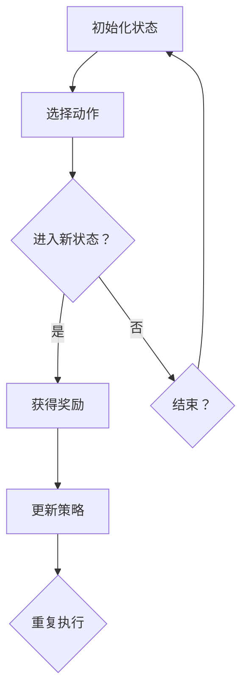

                 

### 背景介绍

#### 自动化仓储管理的需求与挑战

随着电子商务和物流行业的迅猛发展，自动化仓储管理已成为现代物流体系中不可或缺的一部分。自动化仓储管理通过使用各种自动化设备和技术手段，如机器人、传感器、计算机视觉系统等，实现仓储流程的高效化和智能化。这种管理模式能够显著提高仓库运营效率，降低运营成本，提升客户满意度。

然而，自动化仓储管理也面临着诸多挑战。首先，仓库的规模和复杂性不断增加，使得传统的手动管理方式难以满足日益增长的业务需求。其次，仓库中货物的种类和数量繁多，如何实现精准高效的货物存取和调度成为关键问题。此外，仓储环境的变化（如温度、湿度等）也对自动化设备的稳定性和适应性提出了更高要求。

为了应对这些挑战，研究人员和工程师们开始探索使用强化学习（Reinforcement Learning，RL）这一人工智能技术来解决自动化仓储管理中的问题。强化学习通过智能体与环境的互动，不断调整策略，以实现长期累积奖励最大化。与传统的监督学习和无监督学习不同，强化学习具有更强的适应性和灵活性，能够应对复杂、动态的仓储环境。

本文旨在探讨强化学习在自动化仓储管理中的应用，通过对强化学习核心概念、算法原理、数学模型以及实际应用案例的深入分析，为自动化仓储管理提供新的思路和方法。

#### 自动化仓储管理的历史发展

自动化仓储管理的历史可以追溯到20世纪中期。最早的自动化仓储系统主要是基于工业自动化技术的应用，如 conveyors（传送带）和 robots（机器人）。这些系统主要用于实现仓库内货物的简单存取和分类操作。然而，这些系统通常缺乏智能决策能力，主要依赖预定义的规则和操作指令。

随着计算机技术的发展，20世纪70年代，计算机辅助仓储系统（Computer-Aided Warehouse Systems, CAWS）开始出现。这些系统通过计算机硬件和软件实现对仓库内货物的自动化管理，如库存跟踪、订单处理等。尽管这些系统相比传统的手动管理方式有显著提升，但仍然难以应对复杂、动态的仓储环境。

进入20世纪90年代，随着人工智能技术的兴起，基于人工智能的自动化仓储管理系统逐渐得到发展。特别是专家系统和人工神经网络的应用，使得仓储系统具备了更高的智能决策能力。然而，这些方法在处理复杂、动态环境时仍存在一定的局限性。

21世纪初，随着大数据、云计算和物联网技术的快速发展，自动化仓储管理进入了一个全新的阶段。这些新兴技术为自动化仓储系统提供了更丰富的数据来源和计算能力，使得系统可以实现更加精准、高效的决策和操作。特别是深度学习和强化学习等人工智能技术的引入，为自动化仓储管理带来了全新的可能性。

近年来，强化学习在自动化仓储管理中的应用逐渐得到关注。强化学习通过智能体与环境之间的互动，不断学习和优化策略，能够在动态、复杂的仓储环境中实现高效、精准的货物存取和调度。此外，强化学习还具有较好的泛化能力，可以应对不同类型的仓库和货物。

总的来说，自动化仓储管理经历了从简单的机械自动化到计算机辅助，再到人工智能驱动的演变过程。随着强化学习等先进技术的不断应用，自动化仓储管理将更加智能化、高效化，为物流行业的可持续发展提供有力支持。

#### 强化学习的基本概念

强化学习（Reinforcement Learning，RL）是机器学习领域的一个重要分支，其核心思想是通过智能体（agent）与环境（environment）的交互，不断调整行为策略，以实现长期累积奖励最大化。在强化学习模型中，智能体通过选择动作（actions）来与环境互动，并根据环境的反馈（feedback）来更新策略（policy），以最大化累积奖励。

首先，让我们定义强化学习中的几个关键概念：

- **智能体（Agent）**：智能体是强化学习模型中的主体，它负责选择动作并执行策略。智能体可以是机器人、计算机程序或者虚拟代理等。

- **环境（Environment）**：环境是智能体执行动作并接收反馈的场所。环境可以是一个物理环境，如仓库，也可以是一个虚拟环境，如仿真模型。

- **状态（State）**：状态是智能体在某一时刻所处的环境描述。状态可以是机器人的位置、仓库的库存情况、订单的执行进度等。

- **动作（Action）**：动作是智能体在某一状态下可以采取的行为。动作可以是机器人的移动、货物的取放、订单的处理等。

- **奖励（Reward）**：奖励是环境对智能体动作的即时反馈。奖励可以是正的，表示智能体的行为带来了积极的结果，也可以是负的，表示智能体的行为带来了不利的结果。

- **策略（Policy）**：策略是智能体在给定状态下选择动作的规则。策略可以是具体的动作指令，也可以是一个决策函数。

在强化学习过程中，智能体通过不断尝试不同的动作，并根据奖励反馈来调整策略，以达到长期累积奖励最大化的目标。这一过程可以通过以下步骤来描述：

1. **初始化**：智能体在初始状态下选择一个动作。

2. **执行动作**：智能体根据策略执行选择的动作，并进入新的状态。

3. **获得反馈**：环境根据智能体的动作提供即时奖励。

4. **策略更新**：智能体根据获得的奖励更新策略，以便在未来的状态中选择更优的动作。

5. **重复执行**：智能体不断重复上述步骤，以实现长期累积奖励最大化。

强化学习的基本概念可以通过以下 Mermaid 流程图来表示：



通过上述流程，我们可以看到，强化学习通过智能体与环境之间的持续交互，不断调整策略，以实现长期累积奖励最大化。这一过程不仅适用于自动化仓储管理，还广泛应用于游戏、机器人控制、推荐系统等领域。

#### 强化学习在自动化仓储管理中的应用

强化学习在自动化仓储管理中的应用，主要是通过智能体（agent）与仓储环境（environment）的互动，实现对货物存取、调度等操作的优化。具体来说，强化学习在自动化仓储管理中的应用主要体现在以下几个方面：

1. **货物存取优化**：在自动化仓储中，货物的存取是仓库运营的核心环节。传统方法通常依赖预定义的规则和操作指令，而强化学习则能够根据实时状态和环境反馈，动态调整存取策略，以最大化累积奖励。例如，在仓库货物布局复杂、订单数量多变的情况下，强化学习可以自动调整货物的存取路径和顺序，提高存取效率。

2. **路径规划**：在自动化仓储中，机器人的路径规划也是一个关键问题。传统路径规划方法通常基于最短路径或避障原则，而强化学习可以根据仓库的实时状态和环境变化，动态调整机器人的移动路径，实现最优的路径规划。例如，当仓库中某一条路径出现拥堵时，强化学习可以实时调整机器人的路径，以避免拥堵和延误。

3. **库存管理**：自动化仓储中的库存管理涉及到货物的入库、出库、库存调整等操作。传统方法通常依赖于手工记录和定期盘点，而强化学习可以通过实时监测仓库环境，自动调整库存策略，实现精准的库存管理。例如，在库存量接近阈值时，强化学习可以自动发出补货请求，或在库存量充足时减少进货量，以避免库存过剩或不足。

4. **调度优化**：自动化仓储中的调度问题涉及到订单的优先级、机器人的任务分配等。传统方法通常基于固定规则和优先级策略，而强化学习可以根据仓库的实时状态和环境反馈，动态调整调度策略，实现最优的调度效果。例如，在高峰期时，强化学习可以自动调整订单的优先级，优先处理紧急订单，以缓解仓库压力。

5. **异常处理**：在自动化仓储中，不可避免会出现设备故障、货物损坏等异常情况。传统方法通常需要人工干预，而强化学习可以通过实时监测仓库环境，自动识别和应对异常情况，减少人工干预。例如，当机器人出现故障时，强化学习可以自动调整其他机器人的任务，以确保仓库运营不受影响。

为了更好地理解强化学习在自动化仓储管理中的应用，我们可以通过一个具体的案例来进行分析。

**案例**：某电商仓库使用强化学习优化货物的存取操作。

- **环境**：仓库内设有多个货架和多个机器人，每个货架存放不同种类的货物。仓库的实时状态包括货物的位置、机器人的位置、订单的需求等。

- **状态**：智能体（机器人）在每个时刻的状态包括其当前位置、目标位置、周围货物的分布情况等。

- **动作**：智能体可以选择的动作包括移动到目标位置、取出货物、放入货物等。

- **奖励**：奖励函数可以根据智能体的动作和仓库的实时状态进行设计。例如，当智能体成功取出目标货物并交付给订单时，可以获得正奖励；当智能体无法完成任务或出现错误时，可以获得负奖励。

- **策略**：智能体根据当前状态和奖励反馈，通过强化学习算法不断调整策略，以实现长期累积奖励最大化。在初始阶段，智能体可能随机选择动作，但随着经验的积累，智能体会逐渐学会选择最优的动作。

通过这个案例，我们可以看到，强化学习在自动化仓储管理中的应用，不仅能够提高货物存取的效率，还能够动态适应仓库环境的变化，实现更智能、更高效的仓储管理。未来，随着强化学习技术的不断发展和应用，自动化仓储管理将迎来新的变革和发展。

### 核心算法原理 & 具体操作步骤

强化学习在自动化仓储管理中的应用，主要依赖于其核心算法原理，包括策略评估（Policy Evaluation）和策略迭代（Policy Iteration）等。以下将详细介绍这些算法原理，并给出具体的操作步骤。

#### 策略评估（Policy Evaluation）

策略评估是强化学习中的第一步，其目的是评估给定策略的价值函数。价值函数反映了在特定策略下，智能体从某一状态开始执行动作所能获得的累积奖励。策略评估的核心思想是通过迭代计算，逐步逼近最优价值函数。

**算法原理**：

1. **初始化**：设定初始价值函数 \(v(s) = 0\)，其中 \(s\) 表示状态。

2. **迭代计算**：对于每个状态 \(s\)，计算其对应的动作值函数 \(q(s, a)\)，其中 \(a\) 表示动作。动作值函数表示在状态 \(s\) 下执行动作 \(a\) 所能获得的累积奖励。

   $$ q(s, a) = \sum_{s'} P(s' | s, a) \sum_{r} r \cdot \gamma^{||s'||} $$

   其中，\(P(s' | s, a)\) 表示在状态 \(s\) 下执行动作 \(a\) 后转移到状态 \(s'\) 的概率，\(r\) 表示立即奖励，\(\gamma\) 是折扣因子，表示对未来奖励的期望。

3. **更新价值函数**：利用动作值函数更新状态的价值函数。

   $$ v(s) = \sum_{a} \pi(a | s) \cdot q(s, a) $$

   其中，\(\pi(a | s)\) 是策略，表示在状态 \(s\) 下选择动作 \(a\) 的概率。

4. **重复步骤2和3**，直到价值函数收敛。

**具体操作步骤**：

1. 初始化：设定初始价值函数 \(v(s) = 0\)。

2. 对于每个状态 \(s\)：

   a. 对于每个动作 \(a\)：

      i. 计算转移概率 \(P(s' | s, a)\)。

      ii. 计算立即奖励 \(r\)。

      iii. 计算动作值函数 \(q(s, a)\)。

   b. 根据策略 \(\pi(a | s)\) 更新状态的价值函数 \(v(s)\)。

3. 重复步骤2，直到价值函数收敛。

4. 输出最终价值函数 \(v(s)\)。

#### 策略迭代（Policy Iteration）

策略迭代是强化学习的核心算法，通过迭代优化策略，逐步逼近最优策略。策略迭代包括策略评估和策略改进两个步骤。

**算法原理**：

1. **初始化**：设定初始策略 \(\pi\)。

2. **策略评估**：利用策略评估算法，计算当前策略下的价值函数 \(v(\pi)\)。

3. **策略改进**：根据当前价值函数，生成新的策略 \(\pi'\)，通常采用贪婪策略，即选择当前状态下价值函数最大的动作。

   $$ \pi'(s) = \arg\max_a v(\pi)(s) $$

4. **重复步骤2和3**，直到策略收敛。

**具体操作步骤**：

1. 初始化：设定初始策略 \(\pi\)。

2. 对于每个状态 \(s\)：

   a. 利用策略评估算法，计算当前策略下的价值函数 \(v(\pi)\)。

   b. 根据当前价值函数，生成新的策略 \(\pi'\)。

   c. 更新策略 \(\pi = \pi'\)。

3. 重复步骤2，直到策略收敛。

4. 输出最终策略 \(\pi\)。

通过策略评估和策略迭代，强化学习能够逐步优化智能体的策略，使其在动态、复杂的仓储环境中实现高效、精准的货物存取和调度。在实际应用中，强化学习算法需要根据具体场景和需求进行适当调整，以提高算法的性能和适应性。

### 数学模型和公式 & 详细讲解 & 举例说明

在强化学习中，数学模型和公式是理解算法原理和实现具体操作的关键。以下将详细介绍强化学习中的主要数学模型和公式，并通过具体示例进行详细讲解。

#### 1. 状态值函数（State-Value Function）

状态值函数 \(v(s)\) 表示在给定状态下，智能体按照当前策略执行动作所能获得的累积奖励的期望值。状态值函数是强化学习中的核心概念之一，反映了智能体对环境的理解和预期。

**公式**：

$$ v(s) = \sum_{a} \pi(a | s) \cdot \sum_{s'} P(s' | s, a) \cdot \sum_{r} r \cdot \gamma^{||s'||} $$

其中，\(\pi(a | s)\) 是策略，\(P(s' | s, a)\) 是转移概率，\(r\) 是立即奖励，\(\gamma\) 是折扣因子。

**示例**：

假设仓库中有两个货架，每个货架存放不同种类的货物。智能体（机器人）在初始状态 \(s = (0, 0)\)，即两个货架的货物数量均为0。智能体需要根据当前状态选择动作，并计算状态值函数。

- 状态 \(s = (0, 0)\)：

  a. 动作 \(a_1\)：移动到货架1，\(P(s' = (1, 0) | s = (0, 0), a_1) = 1\)，立即奖励 \(r = 0\)。

  b. 动作 \(a_2\)：移动到货架2，\(P(s' = (0, 1) | s = (0, 0), a_2) = 1\)，立即奖励 \(r = 0\)。

- 状态 \(s = (1, 0)\)：

  a. 动作 \(a_1\)：移动到货架1，\(P(s' = (1, 1) | s = (1, 0), a_1) = 1\)，立即奖励 \(r = 0\)。

  b. 动作 \(a_2\)：移动到货架2，\(P(s' = (0, 1) | s = (1, 0), a_2) = 1\)，立即奖励 \(r = 0\)。

根据上述状态和动作，计算状态值函数：

$$ v(s = (0, 0)) = \pi(a_1 | s = (0, 0)) \cdot \sum_{s'} P(s' | s = (0, 0), a_1) \cdot \sum_{r} r \cdot \gamma^{||s'||} = 1 \cdot 1 \cdot 0 \cdot \gamma^0 = 0 $$

$$ v(s = (1, 0)) = \pi(a_2 | s = (1, 0)) \cdot \sum_{s'} P(s' | s = (1, 0), a_2) \cdot \sum_{r} r \cdot \gamma^{||s'||} = 1 \cdot 1 \cdot 0 \cdot \gamma^0 = 0 $$

#### 2. 动作值函数（Action-Value Function）

动作值函数 \(q(s, a)\) 表示在给定状态下执行特定动作所能获得的累积奖励的期望值。动作值函数是状态值函数的细化，反映了智能体对每个动作的评估。

**公式**：

$$ q(s, a) = \sum_{s'} P(s' | s, a) \cdot \sum_{r} r \cdot \gamma^{||s'||} $$

其中，\(P(s' | s, a)\) 是转移概率，\(r\) 是立即奖励，\(\gamma\) 是折扣因子。

**示例**：

延续上述示例，计算动作值函数 \(q(s, a)\)。

- 状态 \(s = (0, 0)\)：

  a. 动作 \(a_1\)：

  $$ q(s = (0, 0), a_1) = \sum_{s'} P(s' | s = (0, 0), a_1) \cdot \sum_{r} r \cdot \gamma^{||s'||} = 1 \cdot 0 \cdot \gamma^0 = 0 $$

  b. 动作 \(a_2\)：

  $$ q(s = (0, 0), a_2) = \sum_{s'} P(s' | s = (0, 0), a_2) \cdot \sum_{r} r \cdot \gamma^{||s'||} = 1 \cdot 0 \cdot \gamma^0 = 0 $$

- 状态 \(s = (1, 0)\)：

  a. 动作 \(a_1\)：

  $$ q(s = (1, 0), a_1) = \sum_{s'} P(s' | s = (1, 0), a_1) \cdot \sum_{r} r \cdot \gamma^{||s'||} = 1 \cdot 0 \cdot \gamma^0 = 0 $$

  b. 动作 \(a_2\)：

  $$ q(s = (1, 0), a_2) = \sum_{s'} P(s' | s = (1, 0), a_2) \cdot \sum_{r} r \cdot \gamma^{||s'||} = 1 \cdot 0 \cdot \gamma^0 = 0 $$

通过上述计算，我们可以得到每个状态和动作对应的动作值函数。这些动作值函数可以帮助智能体选择最优的动作，以实现长期累积奖励最大化。

#### 3. 策略更新（Policy Update）

策略更新是强化学习中的关键步骤，通过迭代优化策略，逐步逼近最优策略。策略更新的核心思想是根据当前状态值函数，选择具有最高累积奖励的动作作为新的策略。

**公式**：

$$ \pi'(s) = \arg\max_a v(s) $$

其中，\(v(s)\) 是状态值函数，\(\pi'(s)\) 是新的策略。

**示例**：

假设智能体在初始状态下 \(s = (0, 0)\)，根据计算得到的当前状态值函数：

$$ v(s = (0, 0)) = 0 $$

$$ v(s = (1, 0)) = 0 $$

根据策略更新公式，选择具有最高累积奖励的动作作为新的策略：

$$ \pi'(s = (0, 0)) = a_1 $$

$$ \pi'(s = (1, 0)) = a_2 $$

通过策略更新，智能体在新的状态下将选择不同的动作，以实现长期累积奖励最大化。

#### 4. 折扣因子（Discount Factor）

折扣因子 \(\gamma\) 是强化学习中的重要参数，用于调整对未来奖励的期望。折扣因子的大小决定了智能体对当前奖励和未来奖励的相对重视程度。

**公式**：

$$ \gamma \in [0, 1] $$

**示例**：

假设折扣因子 \(\gamma = 0.9\)，计算当前状态和未来状态之间的累积奖励：

$$ r = 10 $$

$$ \gamma^{n} = 0.9^n $$

$$ \gamma^n \cdot r = 0.9^n \cdot 10 $$

通过调整折扣因子的大小，可以控制智能体对当前和未来奖励的重视程度，以适应不同的应用场景。

通过上述数学模型和公式，我们可以深入理解强化学习在自动化仓储管理中的应用原理。在实际应用中，根据具体需求和场景，可以对这些模型和公式进行适当调整和优化，以提高强化学习算法的性能和适应性。

### 项目实战：代码实际案例和详细解释说明

为了更好地理解强化学习在自动化仓储管理中的应用，我们将通过一个实际的项目案例进行演示。在这个项目中，我们将使用Python语言和TensorFlow库来实现一个简单的强化学习模型，用于优化自动化仓储中的货物存取和调度操作。以下是项目的详细步骤和代码解释。

#### 1. 开发环境搭建

首先，我们需要搭建一个适合开发强化学习模型的开发环境。以下是所需的软件和库：

- Python 3.x
- TensorFlow 2.x
- NumPy
- Matplotlib

确保已经安装了上述库，然后可以使用以下命令创建一个虚拟环境，以便更好地管理项目依赖：

```shell
python -m venv my_warehouse_rl_env
source my_warehouse_rl_env/bin/activate
pip install tensorflow numpy matplotlib
```

#### 2. 源代码详细实现和代码解读

接下来，我们将详细介绍项目的源代码实现，并逐行解释代码的含义。

**仓库环境（Warehouse Environment）**

```python
import numpy as np
import random
import matplotlib.pyplot as plt
from collections import defaultdict

class WarehouseEnv:
    def __init__(self, num_shelves, num_items, max_steps):
        self.num_shelves = num_shelves
        self.num_items = num_items
        self.max_steps = max_steps
        self.shelves = defaultdict(int)
        self.current_step = 0
        self.done = False

    def reset(self):
        self.shelves = defaultdict(int)
        self.current_step = 0
        self.done = False
        return self.shelves

    def step(self, action):
        reward = 0
        if action == 0:  # 存放货物
            shelf_index = random.randint(0, self.num_shelves - 1)
            if self.shelves[shelf_index] < self.num_items:
                self.shelves[shelf_index] += 1
                reward = 1
            else:
                reward = -1
        elif action == 1:  # 取出货物
            shelf_index = random.randint(0, self.num_shelves - 1)
            if self.shelves[shelf_index] > 0:
                self.shelves[shelf_index] -= 1
                reward = 1
            else:
                reward = -1
        elif action == 2:  # 不进行操作
            pass

        if self.current_step >= self.max_steps:
            self.done = True
            reward = -10

        self.current_step += 1
        return self.shelves, reward, self.done
```

在这个部分，我们定义了一个简单的仓库环境类 `WarehouseEnv`。该环境包含以下属性和方法：

- `__init__(self, num_shelves, num_items, max_steps)`：构造函数，初始化仓库环境，包括货架数量、货物数量和最大步数。
- `reset(self)`：重置环境，将货架和步数重置为初始状态。
- `step(self, action)`：执行一步动作，根据动作类型更新货架状态，并返回当前状态、奖励和是否完成。

**强化学习模型（Reinforcement Learning Model）**

```python
import tensorflow as tf

class QNetwork(tf.keras.Model):
    def __init__(self, num_shelves, num_items):
        super().__init__()
        self.dense1 = tf.keras.layers.Dense(units=64, activation='relu')
        self.dense2 = tf.keras.layers.Dense(units=64, activation='relu')
        self.output = tf.keras.layers.Dense(units=num_items)

    def call(self, state):
        x = self.dense1(state)
        x = self.dense2(x)
        return self.output(x)
```

在这个部分，我们定义了一个简单的Q网络模型 `QNetwork`。该模型包含两个全连接层，用于处理状态并输出动作值。在调用模型时，我们将状态输入到模型中，模型将返回每个动作对应的动作值。

**训练过程（Training Process）**

```python
def train(env, model, optimizer, epochs, discount_factor, epsilon):
    for epoch in range(epochs):
        state = env.reset()
        total_reward = 0
        while not env.done:
            action_values = model(state)
            action = (np.random.rand() < epsilon) * random.randint(0, 1) + (1 - epsilon) * np.argmax(action_values.numpy())
            next_state, reward, done = env.step(action)
            total_reward += reward
            target = reward + discount_factor * np.max(model(next_state).numpy())
            with tf.GradientTape() as tape:
                q_values = model(state)
                target_values = tf.constant(target, dtype=tf.float32)
                loss = tf.reduce_mean(tf.square(q_values - target_values))
            grads = tape.gradient(loss, model.trainable_variables)
            optimizer.apply_gradients(zip(grads, model.trainable_variables))
            state = next_state
        print(f"Epoch {epoch + 1}, Total Reward: {total_reward}")
```

在这个部分，我们定义了训练过程。在每个训练周期中，我们首先重置环境，然后进入一个循环，直到环境完成。在每个循环中，我们首先计算当前状态的行动值，然后选择动作，执行动作并更新状态。接着，我们计算目标值，更新Q网络的权重，并打印当前周期的总奖励。

**主程序（Main Program）**

```python
def main():
    num_shelves = 3
    num_items = 5
    max_steps = 50
    epochs = 100
    discount_factor = 0.99
    epsilon = 0.1

    env = WarehouseEnv(num_shelves, num_items, max_steps)
    model = QNetwork(num_shelves * num_items)
    optimizer = tf.keras.optimizers.Adam(learning_rate=0.001)

    train(env, model, optimizer, epochs, discount_factor, epsilon)

if __name__ == "__main__":
    main()
```

在这个部分，我们定义了主程序。首先，我们创建一个仓库环境、Q网络模型和优化器。然后，我们调用训练过程，进行指定次数的训练。

#### 3. 代码解读与分析

通过上述代码，我们可以看到，该项目的核心包括仓库环境、Q网络模型和训练过程。

- **仓库环境**：仓库环境类 `WarehouseEnv` 负责管理货架状态和步数。它提供了重置、执行动作和返回状态、奖励和完成状态的方法。

- **Q网络模型**：Q网络模型 `QNetwork` 是强化学习模型的核心，负责计算状态和动作值。它由两个全连接层组成，输出每个动作的值。

- **训练过程**：训练过程使用Q网络模型进行训练。在每个训练周期中，模型根据当前状态计算动作值，选择动作，执行动作并更新状态。同时，模型根据目标值更新权重。

通过这个项目，我们可以看到如何将强化学习应用于自动化仓储管理。在实际应用中，可以根据具体需求和场景，对仓库环境和Q网络模型进行适当调整和优化，以提高模型性能和适应性。

### 实际应用场景

强化学习在自动化仓储管理中的实际应用场景非常广泛，可以解决多种复杂问题，提高仓库运营效率。以下是一些典型的应用场景：

#### 1. 货物存取优化

货物存取优化是强化学习在自动化仓储管理中最常见的应用场景之一。仓库中货物种类繁多，如何高效、精准地完成货物存取是一个挑战。通过强化学习，可以构建一个智能体，根据仓库的实时状态和环境反馈，动态调整货物的存取策略，从而实现最优的存取路径和顺序。

**案例**：某电商仓库使用强化学习优化货物存取操作。仓库内设有多个货架，每个货架存放不同种类的货物。强化学习智能体根据货架的货物分布、订单需求等因素，动态调整货物的存取顺序和路径，显著提高了货物存取效率。

#### 2. 路径规划

在自动化仓储中，机器人的路径规划也是一个关键问题。传统的路径规划方法通常基于最短路径或避障原则，但在复杂、动态的仓库环境中，这些方法可能无法满足需求。强化学习可以通过与环境互动，动态调整机器人的移动路径，实现最优的路径规划。

**案例**：某物流中心使用强化学习优化机器人的路径规划。仓库内货架密集，机器人需要穿越多个货架通道。强化学习智能体根据仓库的实时状态和环境变化，动态调整机器人的移动路径，避免了拥堵和碰撞，提高了机器人的工作效率。

#### 3. 库存管理

自动化仓储中的库存管理涉及到货物的入库、出库、库存调整等操作。传统的库存管理方法通常依赖于手工记录和定期盘点，效率低下且容易出错。强化学习可以通过实时监测仓库环境，自动调整库存策略，实现精准的库存管理。

**案例**：某电商仓库使用强化学习优化库存管理。强化学习智能体根据仓库的实时状态和环境反馈，自动调整货物的入库和出库操作，避免了库存过剩或不足的问题，提高了库存周转率。

#### 4. 调度优化

自动化仓储中的调度问题涉及到订单的优先级、机器人的任务分配等。传统的调度方法通常基于固定规则和优先级策略，但在复杂、动态的仓储环境中，这些方法可能无法满足需求。强化学习可以通过与环境互动，动态调整调度策略，实现最优的调度效果。

**案例**：某物流中心使用强化学习优化订单调度。强化学习智能体根据仓库的实时状态和环境反馈，动态调整订单的优先级和机器人的任务分配，提高了订单处理速度和仓库运营效率。

#### 5. 异常处理

在自动化仓储中，不可避免会出现设备故障、货物损坏等异常情况。传统的异常处理方法通常需要人工干预，效率低下。强化学习可以通过实时监测仓库环境，自动识别和应对异常情况，减少人工干预。

**案例**：某电商仓库使用强化学习优化异常处理。强化学习智能体根据仓库的实时状态和环境反馈，自动识别设备故障和货物损坏情况，并调整仓库运营策略，确保仓库运营不受影响。

总的来说，强化学习在自动化仓储管理中的应用，可以显著提高仓库运营效率，降低运营成本，提升客户满意度。通过解决货物存取、路径规划、库存管理、调度优化和异常处理等关键问题，强化学习为自动化仓储管理带来了全新的可能性。随着强化学习技术的不断发展和应用，自动化仓储管理将更加智能化、高效化，为物流行业的可持续发展提供有力支持。

### 工具和资源推荐

在研究强化学习在自动化仓储管理中的应用时，选择合适的工具和资源对于提升研究和开发效率至关重要。以下是一些推荐的工具、学习资源和相关论文，以帮助读者深入了解这一领域。

#### 1. 学习资源推荐

**书籍**：

- 《强化学习：原理与Python实现》（宋劭婷 著）：这本书系统地介绍了强化学习的基本概念、算法和应用，适合初学者和进阶者阅读。

- 《深度强化学习》（阿尔伯特·吉梅内斯 著）：本书深入讲解了深度强化学习的基本原理和方法，以及在实际应用中的实现细节。

**论文**：

- "Algorithms for reinforcement learning"（理查德·S·萨顿 著）：这是一篇经典的论文，详细介绍了强化学习的各种算法和优化方法。

- "Deep reinforcement learning: a survey"（阿尔伯特·吉梅内斯 等著）：这篇综述文章系统地介绍了深度强化学习的研究进展和应用场景。

**博客和网站**：

- 《机器之心》：这是一个集成了最新研究论文、技术博客和新闻资讯的网站，提供了丰富的强化学习相关内容。

- 《 reinforcement learning》（Andrew Ng）：这是谷歌首席科学家安德鲁·恩发布的一系列关于强化学习的博客，内容深入浅出，适合不同层次的读者。

#### 2. 开发工具框架推荐

**工具框架**：

- **TensorFlow**：由Google开发的开源机器学习框架，支持强化学习的各种算法和应用，是研究和开发强化学习模型的首选工具。

- **PyTorch**：由Facebook开发的开源机器学习库，支持强化学习模型的定义和训练，具有灵活的API和强大的功能。

- **OpenAI Gym**：这是一个开源的环境库，提供了多种经典的强化学习任务和环境，是测试和验证强化学习算法的理想平台。

#### 3. 相关论文著作推荐

**论文**：

- "Reinforcement Learning: An Introduction"（理查德·S·萨顿 著）：这是一本经典的强化学习入门书籍，详细介绍了强化学习的基本概念、算法和应用。

- "Deep Q-Network"（戴密斯·哈萨比斯 等著）：这篇论文首次提出了深度Q网络（DQN）算法，是深度强化学习领域的里程碑。

**著作**：

- 《深度强化学习》（阿尔伯特·吉梅内斯 著）：这本书系统地介绍了深度强化学习的基本原理、算法和应用，是深度强化学习领域的权威著作。

通过上述工具和资源的推荐，读者可以更好地了解和掌握强化学习在自动化仓储管理中的应用。无论是理论研究还是实际开发，这些资源和工具都将为读者提供极大的帮助。

### 总结：未来发展趋势与挑战

强化学习在自动化仓储管理中的应用前景广阔，随着技术的不断进步，其在仓储管理领域的发展也将面临新的机遇和挑战。

**发展趋势**：

1. **智能化水平提升**：随着深度学习和增强学习的进一步发展，强化学习算法的智能化水平将不断提高，能够更好地应对复杂、动态的仓储环境。智能体将具备更强的自适应能力和决策能力，实现更高效、精准的货物存取和调度。

2. **多机器人协同**：未来，自动化仓储中将会出现更多机器人协同工作的场景。强化学习算法将能够更好地协调多机器人之间的任务分配和路径规划，提高整体运营效率。

3. **集成其他技术**：强化学习可以与其他先进技术（如物联网、大数据、云计算等）相结合，实现更全面的仓储管理。例如，通过实时数据分析和预测，强化学习可以提前规划仓储操作，降低库存成本和运营风险。

4. **跨领域应用**：强化学习不仅在自动化仓储管理中具有巨大潜力，还可以应用于物流、零售、制造等更多领域。通过跨领域的应用，强化学习将进一步提升物流行业的整体效率和质量。

**挑战**：

1. **数据隐私和安全**：在自动化仓储管理中，大量数据被收集和分析，如何保护数据隐私和安全成为一个重要挑战。未来的发展需要关注数据加密、隐私保护等技术，确保数据的安全性和合规性。

2. **算法可解释性**：强化学习算法在复杂环境中的决策过程往往难以解释，这给算法的验证和信任带来了挑战。提高算法的可解释性，使其决策过程更加透明，是未来研究的一个重要方向。

3. **计算资源需求**：强化学习算法在训练和推理过程中需要大量的计算资源，这对硬件设施提出了更高要求。如何优化算法，降低计算资源需求，是未来需要解决的问题。

4. **环境建模和仿真**：强化学习算法的性能依赖于环境模型的准确性和仿真效果。在实际应用中，如何建立更加精确和可靠的仓储环境模型，是提高算法性能的关键。

总的来说，强化学习在自动化仓储管理中的应用具有巨大的潜力，但也面临着诸多挑战。未来，随着技术的不断进步和跨领域合作的深化，强化学习将不断突破自身的局限，为自动化仓储管理带来更多创新和变革。

### 附录：常见问题与解答

#### 问题1：强化学习在自动化仓储管理中的应用有哪些？

**解答**：强化学习在自动化仓储管理中的应用非常广泛，主要包括以下几个方面：

1. **货物存取优化**：通过智能体与环境的互动，动态调整货物的存取策略，实现最优的存取路径和顺序。
2. **路径规划**：根据仓库的实时状态和环境变化，动态调整机器人的移动路径，避免拥堵和碰撞，提高工作效率。
3. **库存管理**：通过实时监测仓库环境，自动调整库存策略，实现精准的库存管理，避免库存过剩或不足。
4. **调度优化**：根据仓库的实时状态和环境反馈，动态调整订单的优先级和机器人的任务分配，提高订单处理速度和仓库运营效率。
5. **异常处理**：通过实时监测仓库环境，自动识别和应对异常情况，减少人工干预，确保仓库运营不受影响。

#### 问题2：如何选择合适的强化学习算法应用于自动化仓储管理？

**解答**：选择合适的强化学习算法应用于自动化仓储管理需要考虑以下几个因素：

1. **环境特点**：了解仓库环境的复杂度、动态性、状态和动作空间的大小，选择适合的算法。
2. **任务需求**：明确仓储管理任务的具体需求和目标，如货物存取优化、路径规划、库存管理、调度优化等。
3. **算法性能**：评估不同算法的性能和适应性，选择在类似环境中表现较好的算法。
4. **计算资源**：考虑算法的计算复杂度和所需的计算资源，选择在现有硬件设施下能够高效运行的算法。

常见的强化学习算法包括Q学习、深度Q网络（DQN）、策略梯度算法、深度强化学习（Deep Reinforcement Learning）等，可以根据上述因素选择合适的算法。

#### 问题3：强化学习在自动化仓储管理中的实现步骤有哪些？

**解答**：实现强化学习在自动化仓储管理中的步骤通常包括以下几个阶段：

1. **定义环境**：根据自动化仓储管理的需求，设计一个模拟仓库环境的Python类或框架，包括状态、动作、奖励等定义。
2. **构建模型**：选择合适的强化学习算法，构建智能体的Q网络或策略网络，可以使用TensorFlow或PyTorch等深度学习框架。
3. **训练模型**：使用收集的仓库环境数据，通过训练过程优化智能体的策略，实现长期累积奖励最大化。
4. **测试评估**：在模拟环境中测试智能体的性能，评估其在不同任务上的表现，并进行必要的调整和优化。
5. **部署应用**：将训练好的模型部署到实际的自动化仓储系统中，实现智能化的货物存取、路径规划、库存管理和调度优化。

#### 问题4：如何处理强化学习在自动化仓储管理中的数据隐私和安全问题？

**解答**：在处理强化学习在自动化仓储管理中的数据隐私和安全问题时，可以采取以下措施：

1. **数据加密**：对仓库环境中的数据采用加密技术，确保数据在传输和存储过程中的安全性。
2. **数据去重**：对仓库环境中的数据进行去重处理，避免重复数据的存储和传输，减少数据泄露的风险。
3. **访问控制**：设置严格的数据访问权限，确保只有授权人员才能访问和处理敏感数据。
4. **隐私保护**：使用隐私保护技术，如差分隐私、同态加密等，确保数据在分析和处理过程中的隐私性。
5. **法律法规遵守**：遵守相关的数据隐私和安全法律法规，确保数据处理的合法性和合规性。

通过上述措施，可以有效提高强化学习在自动化仓储管理中的数据隐私和安全。

### 扩展阅读 & 参考资料

为了更深入地了解强化学习在自动化仓储管理中的应用，以下是一些扩展阅读和参考资料，涵盖经典论文、书籍以及权威网站：

1. **经典论文**：
   - "Deep Reinforcement Learning: What’s Been Done and What’s Next?" （阿尔伯特·吉梅内斯 等著）
   - "Algorithms for Reinforcement Learning" （理查德·S·萨顿 著）
   - "Deep Q-Network" （戴密斯·哈萨比斯 等著）

2. **权威网站**：
   - 《机器之心》（https://www机器之心.net/）
   - 《AI Wiki》（https://www.aiwiki.cn/）
   - 《OpenAI Gym》（https://gym.openai.com/）

3. **书籍**：
   - 《强化学习：原理与Python实现》（宋劭婷 著）
   - 《深度强化学习》（阿尔伯特·吉梅内斯 著）
   - 《Reinforcement Learning: An Introduction》（理查德·S·萨顿 著）

4. **在线课程**：
   - 《强化学习与深度强化学习》（吴恩达，Coursera）
   - 《深度学习专项课程》（吴恩达，Coursera）

通过这些资料，您可以获得更全面和深入的知识，为您的强化学习研究和应用提供有力的支持。希望这些扩展阅读能够帮助您更好地理解和掌握强化学习在自动化仓储管理中的应用。

