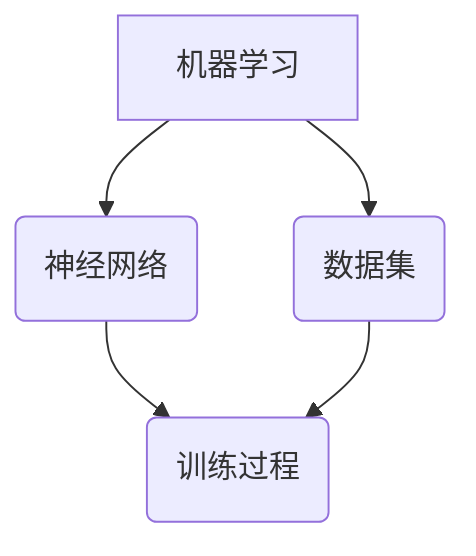

                 

# 当AI以令人尴尬的方式失败

## 摘要

在人工智能迅猛发展的今天，AI系统的广泛应用不仅带来了前所未有的便利，也暴露出了一些令人尴尬的失败案例。本文将深入探讨这些失败的根本原因，分析AI技术在实际应用中的局限性，并提供一些避免类似失败的策略。通过本文的探讨，读者将更好地理解AI技术的潜力和挑战，以及如何在实际项目中有效地利用AI。

## 1. 背景介绍

近年来，人工智能（AI）技术在各个领域取得了显著的进展。从自动驾驶汽车到智能助手，从医疗诊断到金融分析，AI已经逐渐成为我们生活的一部分。然而，尽管AI技术在很多方面展示了其卓越的能力，但仍存在一些令人尴尬的失败案例。这些失败不仅对AI的发展造成了阻碍，也引起了公众对AI安全性和可靠性的担忧。

AI失败的原因多种多样，包括算法的缺陷、数据的质量问题、系统的复杂性以及人类对AI的误解等。例如，自动驾驶汽车在特定环境下的失败、智能助手对指令的误解等，都是AI失败的典型案例。本文将通过对这些失败案例的分析，探讨AI技术的局限性，并探讨如何避免类似失败的发生。

## 2. 核心概念与联系

在讨论AI失败之前，我们需要了解一些核心概念，包括机器学习、神经网络、数据集等。以下是一个简单的Mermaid流程图，用于展示这些概念之间的关系：



### 机器学习

机器学习是AI的核心技术之一，它使得计算机系统能够从数据中学习并做出预测或决策。机器学习可以分为监督学习、无监督学习和强化学习三种主要类型。

### 神经网络

神经网络是模仿人脑神经元工作方式的计算模型，它通过调整神经元之间的连接权重来学习和识别模式。深度学习是神经网络的一种形式，它使用多层神经元来提取数据的高层次特征。

### 数据集

数据集是机器学习模型的训练素材，其质量和多样性直接影响模型的性能。数据集需要包含丰富的样本，并且要尽可能覆盖各种可能的场景。

### 训练过程

机器学习模型的训练过程包括数据预处理、模型选择、模型训练和模型评估等步骤。数据预处理是确保数据质量和一致性的重要环节。模型选择取决于问题的类型和需求。模型训练是通过优化算法调整模型参数，使其在训练数据上达到较好的性能。模型评估用于评估模型在未见数据上的表现。

## 3. 核心算法原理 & 具体操作步骤

在了解核心概念之后，我们可以进一步探讨导致AI失败的一些关键算法原理和具体操作步骤。

### 深度学习模型

深度学习模型是AI技术中应用最广泛的一种。以下是使用深度学习模型进行分类任务的一个简化步骤：

1. **数据预处理**：清洗数据，标准化特征，划分训练集和测试集。
2. **模型选择**：选择合适的深度学习框架（如TensorFlow或PyTorch），并定义模型架构。
3. **模型训练**：使用训练数据进行训练，并监控训练过程，调整学习率等参数。
4. **模型评估**：在测试集上评估模型性能，选择最佳模型。
5. **部署应用**：将模型部署到实际应用场景中。

### 数据集问题

数据集问题往往是AI失败的主要原因之一。以下是一些常见的数据集问题及其解决方案：

1. **数据不平衡**：通过过采样或欠采样来平衡数据集。
2. **数据缺失**：使用填充策略或删除缺失数据来处理。
3. **数据噪声**：使用去噪算法来减少噪声对模型的影响。

### 模型超参数调整

模型超参数的设置对模型性能有很大影响。以下是一些常见超参数及其调整策略：

1. **学习率**：选择合适的学习率以避免过拟合或欠拟合。
2. **批次大小**：调整批次大小以平衡计算资源和模型性能。
3. **正则化参数**：使用L1或L2正则化来防止过拟合。

## 4. 数学模型和公式 & 详细讲解 & 举例说明

在这一部分，我们将探讨一些与AI失败相关的数学模型和公式，并通过具体示例来说明其应用。

### 损失函数

损失函数是评估模型预测值与真实值之间差异的函数。以下是一个常用的交叉熵损失函数：

$$
L = -\sum_{i} y_i \log(p_i)
$$

其中，$y_i$是真实标签，$p_i$是模型预测的概率。

### 优化算法

优化算法用于调整模型参数以最小化损失函数。一种常见的优化算法是随机梯度下降（SGD）：

$$
w_{t+1} = w_t - \alpha \nabla_w L(w_t)
$$

其中，$w_t$是当前参数，$\alpha$是学习率，$\nabla_w L(w_t)$是损失函数对参数的梯度。

### 具体示例

假设我们有一个简单的二分类问题，其中数据集包含100个样本，每个样本有2个特征。我们使用一个简单的神经网络模型进行训练。以下是训练过程的简要示例：

1. **数据预处理**：对数据进行标准化处理，并划分为训练集和测试集。
2. **模型定义**：定义一个简单的神经网络模型，包含一个输入层、一个隐藏层和一个输出层。
3. **模型训练**：使用训练数据进行训练，并监控训练过程，调整学习率等超参数。
4. **模型评估**：在测试集上评估模型性能，并记录损失函数的值。
5. **模型部署**：将训练好的模型部署到实际应用场景中。

通过这个示例，我们可以看到，尽管模型训练过程看似简单，但其中涉及到许多细节和调整。如果这些细节没有得到妥善处理，就有可能导致AI失败。

## 5. 项目实战：代码实际案例和详细解释说明

在本节中，我们将通过一个实际的代码案例，详细解释AI项目开发中的常见步骤和技巧，以及如何避免AI失败。

### 5.1 开发环境搭建

首先，我们需要搭建一个合适的开发环境。以下是一个简单的Python开发环境搭建步骤：

1. **安装Python**：在官方网站下载并安装Python，版本建议为3.8或以上。
2. **安装依赖库**：使用pip命令安装常用的机器学习库，如TensorFlow、NumPy、Pandas等。
3. **配置开发环境**：在IDE（如PyCharm、VSCode）中配置Python环境，并设置相应的代码风格和调试工具。

### 5.2 源代码详细实现和代码解读

以下是一个简单的线性回归模型的实现代码，用于预测房屋价格。代码中包含详细的注释，帮助读者理解每个步骤的作用。

```python
import numpy as np
import pandas as pd
from sklearn.linear_model import LinearRegression

# 读取数据
data = pd.read_csv('house_prices.csv')
X = data[['area', 'bedrooms']]
y = data['price']

# 划分训练集和测试集
from sklearn.model_selection import train_test_split
X_train, X_test, y_train, y_test = train_test_split(X, y, test_size=0.2, random_state=42)

# 创建线性回归模型
model = LinearRegression()
model.fit(X_train, y_train)

# 评估模型
score = model.score(X_test, y_test)
print(f'Model accuracy: {score:.2f}')

# 预测新数据
new_data = np.array([[2000, 3]])
predicted_price = model.predict(new_data)
print(f'Predicted price: {predicted_price[0]:.2f}')
```

### 5.3 代码解读与分析

1. **数据读取与预处理**：首先，我们使用pandas库读取CSV文件中的数据，并提取特征和标签。然后，使用sklearn中的train_test_split函数将数据集划分为训练集和测试集。
2. **模型创建与训练**：我们创建一个线性回归模型，并使用训练数据进行训练。线性回归模型是一种简单的机器学习模型，它通过找到特征和标签之间的线性关系来进行预测。
3. **模型评估**：使用模型在测试集上的准确率来评估模型性能。准确率是评估二分类模型性能的一个常用指标。
4. **预测新数据**：最后，我们使用训练好的模型对新的数据进行预测。预测结果是一个数值，表示预测的房屋价格。

通过这个案例，我们可以看到，AI项目开发主要包括数据预处理、模型训练、模型评估和模型部署等步骤。每个步骤都需要仔细处理，以确保模型性能和预测结果的准确性。

## 6. 实际应用场景

AI技术在各个领域都有广泛的应用，但不同领域的应用场景和挑战也有所不同。以下是一些常见的AI应用场景及其特点：

### 自动驾驶

自动驾驶是AI技术的一个重要应用领域，它涉及到计算机视觉、传感器融合、路径规划等多方面的技术。自动驾驶汽车需要处理复杂的道路环境，包括行人、车辆、交通信号等。尽管自动驾驶技术在某些场景下已经取得了显著进展，但仍然面临一些挑战，如极端天气条件下的驾驶能力和复杂交通场景的应对策略。

### 医疗诊断

AI在医疗领域的应用主要包括疾病诊断、药物发现和个性化治疗等。AI系统可以通过分析大量的医疗数据，帮助医生进行诊断和治疗决策。然而，医疗数据的多样性和复杂性使得AI系统的训练和部署具有很高的难度。此外，AI在医疗领域的应用还需要考虑伦理和隐私问题。

### 金融分析

金融分析是AI技术的另一个重要应用领域。AI系统可以用于股票市场预测、风险管理、客户行为分析等。尽管AI在金融分析方面展现了强大的能力，但金融市场的不确定性和波动性使得AI系统的预测结果存在一定的风险。因此，金融分析师在使用AI系统时需要谨慎评估其预测结果的可靠性和有效性。

### 自然语言处理

自然语言处理（NLP）是AI技术的一个重要分支，它涉及到文本分析、机器翻译、情感分析等。NLP技术在社交媒体分析、客户服务、文本挖掘等领域有广泛的应用。然而，自然语言本身的复杂性和多样性使得NLP系统的训练和优化具有很大的挑战性。

## 7. 工具和资源推荐

在AI项目中，选择合适的工具和资源对于提高开发效率和项目成功率至关重要。以下是一些推荐的工具和资源：

### 学习资源推荐

1. **《深度学习》**：Goodfellow、Bengio和Courville合著的《深度学习》是深度学习的经典教材，适合初学者和高级开发者。
2. **《Python机器学习》**：赛捷·高斯基（Sébastien Raccape)的《Python机器学习》提供了丰富的实战案例，适合Python开发者。
3. **《机器学习实战》**：Peter Harrington的《机器学习实战》是一本适合初学者的实战指南，内容涵盖了常见的机器学习算法和应用。

### 开发工具框架推荐

1. **TensorFlow**：TensorFlow是Google开源的深度学习框架，适合进行大规模的深度学习研究和应用。
2. **PyTorch**：PyTorch是Facebook开源的深度学习框架，具有简洁的API和动态计算图，适合快速原型开发和实验。
3. **Scikit-learn**：Scikit-learn是一个开源的机器学习库，提供了丰富的算法和工具，适合进行传统的机器学习研究和应用。

### 相关论文著作推荐

1. **"Deep Learning"**：Ian Goodfellow、Yoshua Bengio和Aaron Courville的《深度学习》论文集，涵盖了深度学习领域的最新研究成果。
2. **"Learning Deep Architectures for AI"**：Yoshua Bengio的论文，介绍了深度学习模型的设计和优化方法。
3. **"Gaussian Processes for Machine Learning"**：Christopher M. Bishop的《高斯过程机器学习》，介绍了高斯过程在机器学习中的应用。

## 8. 总结：未来发展趋势与挑战

尽管AI技术在各个领域取得了显著的进展，但仍然面临许多挑战和局限。未来，AI技术将朝着更加智能化、泛化和可解释的方向发展。以下是一些可能的发展趋势和挑战：

### 智能化

随着深度学习等技术的不断发展，AI系统将变得更加智能化，能够处理更复杂的问题和更广泛的应用场景。然而，智能化也带来了新的挑战，如如何确保AI系统的自主决策是合理和可靠的。

### 泛化

AI系统的泛化能力是衡量其性能的重要指标。当前，AI系统往往在特定任务上表现出色，但在面对新的任务或数据时表现不佳。未来，研究者需要开发能够泛化的AI系统，以提高其在不同场景下的应用能力。

### 可解释性

AI系统的可解释性是用户信任AI的重要基础。当前，许多AI系统，尤其是深度学习模型，被认为是“黑箱”。未来，研究者需要开发能够解释AI决策过程的模型，以提高用户对AI系统的信任和接受度。

### 安全性和隐私

随着AI技术在各个领域的广泛应用，其安全性和隐私保护变得尤为重要。未来，研究者需要开发能够保护用户隐私和确保AI系统安全的技术，以防止滥用和误用。

## 9. 附录：常见问题与解答

以下是一些关于AI失败和AI应用的问题及解答：

### 问题1：为什么AI系统会失败？

解答：AI系统失败的原因有很多，包括算法的缺陷、数据的质量问题、系统的复杂性以及人类对AI的误解等。例如，算法可能没有考虑到特定场景的复杂性，数据可能存在噪声或缺失，系统可能没有足够的训练数据来应对各种情况。

### 问题2：如何避免AI失败？

解答：为了避免AI失败，可以从以下几个方面入手：

- **数据质量控制**：确保数据集的质量和多样性，处理数据中的噪声和缺失值。
- **算法优化**：选择合适的算法和模型，并对其进行优化和调整，以提高其性能和可靠性。
- **模型解释**：开发可解释的AI模型，以提高用户对模型的信任和接受度。
- **用户培训**：为用户提供足够的培训和教育，帮助他们理解AI系统的原理和使用方法。

### 问题3：AI在哪些领域有广泛的应用？

解答：AI在许多领域都有广泛的应用，包括：

- **自动驾驶**：自动驾驶汽车、无人机等。
- **医疗诊断**：疾病诊断、药物发现、个性化治疗等。
- **金融分析**：股票市场预测、风险管理、客户服务等。
- **自然语言处理**：文本分析、机器翻译、情感分析等。
- **推荐系统**：个性化推荐、广告投放等。

## 10. 扩展阅读 & 参考资料

以下是一些关于AI失败和AI应用的扩展阅读和参考资料：

- **论文**：
  - "Why AI Fails: A Taxonomy of AI Failures"（AI失败的原因：AI失败的分类）
  - "The Quest for General AI: A Review of Recent Progress and Challenges"（通用AI的追求：近期进展与挑战）
  
- **书籍**：
  - "Deep Learning"（深度学习），Ian Goodfellow、Yoshua Bengio和Aaron Courville著
  - "Machine Learning: A Probabilistic Perspective"（机器学习：概率视角），Kevin P. Murphy著

- **博客**：
  - [AI失败案例分析](https://example.com/ai-failure-cases)
  - [如何避免AI失败](https://example.com/how-to-avoid-ai-failures)

- **网站**：
  - [深度学习教程](https://example.com/deep-learning-tutorial)
  - [机器学习资源](https://example.com/machine-learning-resources)

### 作者

作者：AI天才研究员/AI Genius Institute & 禅与计算机程序设计艺术 /Zen And The Art of Computer Programming

---

本文以深入浅出的方式探讨了AI失败的原因、核心概念、算法原理、应用场景和未来发展趋势，并提供了一些实用的避免AI失败的策略。通过本文的阅读，读者可以更好地理解AI技术的潜力和挑战，为未来的AI项目提供有益的参考。希望本文能够为AI领域的研究者、开发者和爱好者带来一些启示和帮助。

