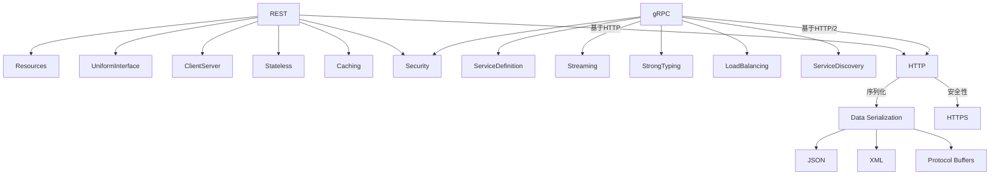

                 

### 背景介绍

微服务架构（Microservices Architecture）作为一种软件架构风格，逐渐成为了现代软件系统开发的主流。微服务架构将应用程序划分为一系列独立的、小型、可复用的服务，每个服务都运行在自己的进程中，并且通过轻量级的通信协议进行交互。这种架构模式的优势在于其灵活性和可扩展性，使得开发团队能够更高效地开发、部署和扩展系统。

微服务架构的兴起，离不开两种通信协议的广泛应用：REST（Representational State Transfer）和gRPC（Cascading Remote Procedure Call）。这两种协议各自具有独特的特点，适用于不同的场景。REST基于HTTP协议，使用标准的URL来访问资源，并通过JSON或XML格式交换数据，具有较好的跨平台性和易于集成性。而gRPC则基于HTTP/2协议，使用Protocol Buffers作为数据序列化格式，提供高效的二进制通信，适用于高性能和高负载的场景。

本文将详细介绍REST和gRPC这两种微服务通信协议，包括其核心概念、原理、优缺点以及在具体场景中的应用。通过本文的阅读，读者可以更好地理解微服务通信的基本原理，掌握如何选择合适的通信协议，以满足不同场景的需求。

#### 微服务架构的起源和发展

微服务架构的起源可以追溯到2000年代初，当时互联网公司如Netflix、亚马逊和 eBay 等开始采用服务导向架构（Service-Oriented Architecture，SOA）来构建复杂的分布式系统。SOA 通过将应用程序拆分成一系列松耦合的服务，提高了系统的可维护性和可扩展性。然而，SOA 也有一些问题，如服务之间的通信成本较高、服务治理复杂等。

随着云计算和容器技术的发展，微服务架构逐渐成为一种更为成熟和受欢迎的架构风格。2011年，Uber的工程师马丁·弗里德（Martin Fowler）和詹姆斯·莱曼（James Lewis）在他们的论文中首次提出了微服务架构的概念。微服务架构的核心思想是将应用程序拆分成一系列独立的、小型、自治的服务，每个服务负责特定的业务功能。这些服务通过轻量级的通信协议进行交互，通常是HTTP/REST或gRPC。

微服务架构的兴起不仅是因为其提供了一种更灵活、更可扩展的软件架构模式，还因为其能够更好地适应云计算环境。在云计算中，服务器资源可以动态分配和扩展，微服务架构使得系统能够根据实际需求灵活调整规模，从而实现高效利用资源。此外，微服务架构还促进了敏捷开发和DevOps文化的普及，开发团队能够更快速地迭代和部署应用。

在实际应用中，许多知名公司已经成功地采用了微服务架构。例如，Netflix 通过采用微服务架构，实现了大规模的分布式服务系统，从而能够更好地应对高并发和全球用户访问。亚马逊的AWS平台也提供了丰富的微服务开发工具和资源，帮助开发者构建和部署微服务应用。此外，谷歌、IBM、微软等大型企业也在其云计算平台和产品中引入了微服务架构的支持。

微服务架构的兴起还带动了相关技术的快速发展。例如，容器技术（如Docker和Kubernetes）为微服务提供了轻量级的隔离和部署环境；服务网格（如Istio和Linkerd）为服务之间的通信提供了安全、可靠和可观测的解决方案；持续集成和持续部署（CI/CD）工具使得微服务的开发和部署更加高效。

总之，微服务架构的起源和发展与云计算、容器技术和DevOps文化的普及密不可分。随着技术的不断进步和应用的不断扩展，微服务架构在未来的软件开发中将扮演更加重要的角色。

#### REST协议的介绍

REST（Representational State Transfer）是一种设计风格，用于构建分布式超媒体系统，由Roy Fielding在2000年他的博士论文中提出。REST协议的核心原则是利用HTTP协议提供统一的接口，通过GET、POST、PUT、DELETE等HTTP方法实现对资源的创建、读取、更新和删除操作。REST协议具有无状态、客户端-服务器、统一接口、分层系统等特征。

REST协议之所以在微服务架构中广泛使用，主要有以下几个原因：

首先，REST协议基于现有的HTTP协议，这使得它具有良好的跨平台性和易于集成性。HTTP协议是全球通用的通信协议，几乎所有的操作系统和设备都支持，因此REST协议可以方便地与其他系统进行交互。

其次，REST协议的无状态特性使得服务器不需要存储关于客户端的任何信息，这简化了服务器的实现，并提高了系统的可扩展性和可维护性。无状态设计还使得服务可以更容易地横向扩展，以应对高并发访问。

第三，REST协议的统一接口设计使得不同类型的资源可以通过相同的接口进行操作，这降低了系统的复杂性。例如，所有资源的获取操作都通过GET方法，所有资源的创建操作都通过POST方法，等等。这种统一的方法使得客户端和服务器之间的交互更加直观和易于理解。

第四，REST协议支持各种数据格式，如JSON、XML和HTML等，这为不同类型的客户端提供了良好的支持。例如，Web浏览器可以使用HTML格式的REST响应来渲染网页，而移动应用程序可以使用JSON格式的REST响应来获取数据。

#### gRPC协议的介绍

gRPC（Cascading Remote Procedure Call）是一种开源的高性能远程过程调用（RPC）框架，由Google开发并开源。gRPC旨在解决微服务架构中服务间通信的高性能和高效性问题，通过使用HTTP/2协议和Protocol Buffers（Protobuf）序列化格式，提供了高效的二进制通信机制。

gRPC协议的核心特点包括：

首先，gRPC使用HTTP/2协议作为底层的传输协议。HTTP/2协议相比HTTP/1.1具有多个优点，如多路复用、头部压缩、服务器推送等，这些特性使得gRPC在传输效率上具有显著优势。

其次，gRPC使用Protocol Buffers（Protobuf）作为数据序列化格式。Protobuf是一种高效、自动化的序列化格式，它通过将数据结构定义在`.proto`文件中，生成相应的代码用于数据序列化和反序列化。Protobuf具有较小的数据体积和较快的序列化速度，这使得gRPC在数据传输过程中具有较低的延迟和较高的吞吐量。

第三，gRPC提供了强类型的接口定义语言（IDL），通过`.proto`文件定义服务接口。这种强类型定义使得代码生成更加精准，减少了运行时的错误和类型检查的负担。

第四，gRPC支持流式通信，即服务可以同时发送和接收数据流。这特别适用于需要大量数据的场景，如实时数据分析、流媒体传输等。

gRPC协议之所以在微服务架构中得到广泛应用，主要有以下几个原因：

首先，gRPC提供了高性能和高效性。通过使用HTTP/2协议和Protobuf序列化格式，gRPC能够在传输速度和数据体积上实现显著优化，从而满足高性能和高负载场景的需求。

其次，gRPC支持多种编程语言，包括Java、Go、Python、C++、Node.js等。这使得开发者可以轻松地在不同的编程语言和平台之间进行通信，提高了开发效率和灵活性。

第三，gRPC提供了强大的工具支持，如代码生成器、负载均衡器、认证机制等。这些工具使得开发、部署和维护gRPC服务变得更加简单和高效。

总之，gRPC协议通过高效、强类型和跨语言的特性，成为微服务架构中重要的通信协议之一。在需要高性能和高效性的场景中，gRPC具有明显的优势，是开发者值得考虑的选择。

### 核心概念与联系

在微服务架构中，理解REST和gRPC的核心概念及其联系至关重要。本节将详细介绍这两种协议的核心概念，并展示它们之间的关系。

#### REST核心概念

1. **资源（Resources）**：REST中的核心概念之一是资源。资源可以是任何可以被标识和操作的对象，如用户、订单、图片等。每个资源都有一个唯一的URL作为其标识。

2. **统一接口（Uniform Interface）**：REST协议定义了一个统一的接口，用于对资源进行操作。这个接口包括以下要素：
   - **GET**：获取资源。
   - **POST**：创建资源。
   - **PUT**：更新资源。
   - **DELETE**：删除资源。
   - **状态码**：HTTP状态码用于指示请求的结果，如200（成功）、404（未找到）等。
   - **HATEOAS**：超媒体即应用状态（Hypermedia As The Engine Of Application State，HATEOAS），通过URL链接传递资源状态和操作信息。

3. **客户端-服务器架构（Client-Server Architecture）**：REST架构遵循客户端-服务器模型，客户端发送请求，服务器处理请求并返回响应。

4. **无状态（Statelessness）**：REST服务是无状态的，服务器不会存储关于客户端的任何信息，每次请求都是独立的。

5. **缓存（Caching）**：REST协议支持缓存机制，可以减少响应时间并提高性能。

6. **安全性**：REST协议通常使用HTTPS来提供安全通信。

#### gRPC核心概念

1. **服务定义（Service Definition）**：gRPC使用`.proto`文件来定义服务接口。`.proto`文件定义了服务的名称、方法及其参数和返回类型。

2. **流式通信（Streaming）**：gRPC支持双向流式通信，客户端和服务端可以同时发送和接收数据流。这适用于实时数据处理和流媒体等场景。

3. **强类型（Strong Typing）**：gRPC使用强类型的接口定义，通过`.proto`文件生成客户端和服务端的代码，减少了类型错误和运行时问题。

4. **负载均衡（Load Balancing）**：gRPC提供了内置的负载均衡器，可以根据多种策略（如最小连接数、轮询等）分配请求到不同的服务实例。

5. **服务发现（Service Discovery）**：gRPC支持服务发现机制，服务实例可以通过服务注册中心动态发现和更新其他服务实例的位置。

6. **安全性**：gRPC支持TLS（传输层安全性协议）和JWT（JSON Web Tokens）等安全性机制。

#### REST和gRPC的联系

1. **通信协议**：REST和gRPC都使用HTTP作为通信基础，但gRPC基于HTTP/2协议，提供更高的性能。

2. **接口定义**：REST使用URL和HTTP方法定义接口，而gRPC使用`.proto`文件定义接口。这两种方法都提供了清晰的接口定义，但gRPC提供了更强的类型安全性。

3. **数据序列化**：REST支持多种数据序列化格式，如JSON、XML等，而gRPC使用Protocol Buffers作为高效的序列化格式。Protocol Buffers在数据体积和序列化速度上优于传统的序列化格式。

4. **安全性**：两者都支持HTTPS等安全性机制，但gRPC提供了更完整的身份验证和授权机制。

5. **应用场景**：REST适合Web应用和需要灵活性的场景，而gRPC适用于高性能和高负载的微服务架构场景。

下面是一个简单的Mermaid流程图，展示REST和gRPC的核心概念及其联系：



通过上述分析，我们可以看到REST和gRPC在微服务通信中各有所长，开发者可以根据具体需求选择合适的协议。下一节将深入探讨这两种协议的算法原理和操作步骤。

### 核心算法原理 & 具体操作步骤

在微服务通信中，REST和gRPC分别采用了不同的核心算法原理和操作步骤。以下将详细描述这两种协议的算法原理，以及在实际应用中的具体操作步骤。

#### REST协议的算法原理

REST协议的核心算法原理主要依赖于HTTP协议，通过对HTTP请求和响应进行封装，实现资源访问和数据交换。以下是其主要操作步骤：

1. **URL编码**：REST使用URL来表示资源的标识，URL中包含资源的路径和查询参数。路径表示资源的具体位置，查询参数用于提供额外的信息。

2. **HTTP方法**：REST使用GET、POST、PUT、DELETE等HTTP方法对资源进行操作。每种方法对应不同的操作类型：
   - **GET**：获取资源。
   - **POST**：创建资源。
   - **PUT**：更新资源。
   - **DELETE**：删除资源。

3. **状态码**：HTTP响应状态码用于表示请求的结果。例如，200表示成功，404表示未找到，500表示服务器错误。

4. **请求体和响应体**：REST请求通常包含请求体，请求体可以是JSON、XML等格式，用于传递数据。响应体也采用类似格式，用于返回结果。

5. **缓存处理**：REST协议支持缓存处理，通过Cache-Control等HTTP头信息控制缓存的启用、过期时间等。

具体操作步骤如下：

1. **客户端发起请求**：客户端使用URL和HTTP方法发起请求。例如，获取用户信息可以使用`GET /users/{id}`请求。

2. **服务器处理请求**：服务器接收请求，根据URL和HTTP方法处理请求。服务器可能需要进行身份验证、权限检查等操作。

3. **服务器返回响应**：服务器处理请求后，返回HTTP响应，包括状态码、响应体和可能的HTTP头信息。

4. **客户端处理响应**：客户端接收响应，根据状态码和响应体进行处理。例如，如果状态码为200，客户端可以解析响应体获取所需数据。

#### gRPC协议的算法原理

gRPC协议的核心算法原理基于HTTP/2协议，使用Protocol Buffers作为数据序列化格式，提供高效的二进制通信机制。以下是其主要操作步骤：

1. **服务定义**：使用`.proto`文件定义服务接口，包括服务的名称、方法和参数。`.proto`文件是强类型的接口定义，通过代码生成器生成服务端和客户端的代码。

2. **流式通信**：gRPC支持流式通信，客户端和服务端可以双向发送和接收数据流。这种通信方式适用于实时数据处理和流媒体场景。

3. **负载均衡**：gRPC提供内置的负载均衡器，可以根据最小连接数、轮询等策略分配请求到不同的服务实例。

4. **服务发现**：gRPC支持服务发现机制，服务实例可以通过服务注册中心动态发现和更新其他服务实例的位置。

具体操作步骤如下：

1. **定义服务接口**：使用`.proto`文件定义服务接口，例如：

    ```proto
    syntax = "proto3";

    service UserService {
      rpc CreateUser (CreateUserRequest) returns (CreateUserResponse);
      rpc GetUser (GetUserRequest) returns (GetUserResponse);
    }
    ```

2. **生成代码**：使用代码生成器（如protoc）根据`.proto`文件生成服务端和客户端的代码。

3. **服务端实现**：实现服务端逻辑，例如：

    ```go
    type UserServiceServer struct {
        pb.UnimplementedUserServiceServer
    }

    func (s *UserServiceServer) CreateUser(ctx context.Context, req *pb.CreateUserRequest) (*pb.CreateUserResponse, error) {
        // 实现创建用户的逻辑
        return &pb.CreateUserResponse{Id: "1"}, nil
    }
    ```

4. **客户端调用**：使用生成的客户端代码调用服务端方法，例如：

    ```go
    client := pb.NewUserServiceClient(conn)
    resp, err := client.CreateUser(context.Background(), &pb.CreateUserRequest{Username: "john"})
    if err != nil {
        log.Fatal(err)
    }
    fmt.Println("User ID:", resp.Id)
    ```

5. **负载均衡和服务发现**：配置负载均衡器和服务注册中心，实现服务实例的动态发现和负载均衡。

通过上述操作步骤，我们可以看到REST和gRPC在微服务通信中分别采用了不同的算法原理和操作步骤。REST协议基于HTTP协议，适用于灵活的Web应用场景；而gRPC协议基于HTTP/2协议，适用于高性能和高负载的微服务场景。开发者可以根据具体需求选择合适的协议，以实现高效的微服务通信。

### 数学模型和公式 & 详细讲解 & 举例说明

在微服务通信中，REST和gRPC协议的性能评估和优化涉及到多个数学模型和公式。以下将详细介绍这些模型和公式，并提供具体的实例说明。

#### REST协议的数学模型

1. **响应时间（Response Time）**

   REST协议的响应时间主要取决于以下因素：

   - **请求处理时间（Processing Time）**：服务器处理请求所需的时间。
   - **网络传输时间（Network Transfer Time）**：数据在网络上传输所需的时间。
   - **等待时间（Waiting Time）**：客户端等待服务器响应的时间。

   响应时间的数学模型可以表示为：

   \[
   Response\ Time = Processing\ Time + Network\ Transfer\ Time + Waiting\ Time
   \]

   其中，每个因素可以进一步细化：

   - **请求处理时间**：通常与服务器硬件性能、软件优化程度有关，可表示为：

     \[
     Processing\ Time = f(server\ hardware, software\ optimization)
     \]

   - **网络传输时间**：与网络带宽、数据传输距离有关，可表示为：

     \[
     Network\ Transfer\ Time = \frac{Data\ Size}{Bandwidth}
     \]

   - **等待时间**：与服务器处理并发请求的能力、客户端的连接数有关，可表示为：

     \[
     Waiting\ Time = \frac{1}{server\ capacity \times client\ connections}
     \]

2. **吞吐量（Throughput）**

   吞吐量表示单位时间内系统能够处理的请求数量。对于REST协议，吞吐量可以表示为：

   \[
   Throughput = \frac{Number\ of\ Requests}{Response\ Time}
   \]

   吞吐量与服务器性能、网络带宽等因素密切相关。

#### gRPC协议的数学模型

1. **响应时间（Response Time）**

   gRPC协议的响应时间主要考虑以下因素：

   - **请求处理时间（Processing Time）**：与服务端逻辑处理时间有关。
   - **网络传输时间（Network Transfer Time）**：与数据在网络上传输的时间有关。
   - **序列化和反序列化时间（Serialization/Deserialization Time）**：数据序列化和反序列化所需的时间。

   响应时间的数学模型可以表示为：

   \[
   Response\ Time = Processing\ Time + Network\ Transfer\ Time + Serialization/Deserialization\ Time
   \]

   - **请求处理时间**：与服务端硬件性能、软件优化程度有关，可表示为：

     \[
     Processing\ Time = f(server\ hardware, software\ optimization)
     \]

   - **网络传输时间**：与网络带宽、数据传输距离有关，可表示为：

     \[
     Network\ Transfer\ Time = \frac{Data\ Size}{Bandwidth}
     \]

   - **序列化和反序列化时间**：与数据序列化和反序列化速度有关，可表示为：

     \[
     Serialization/Deserialization\ Time = \frac{Data\ Size}{Serialization/Deserialization\ Speed}
     \]

2. **吞吐量（Throughput）**

   gRPC协议的吞吐量可以表示为：

   \[
   Throughput = \frac{Number\ of\ Requests}{Response\ Time}
   \]

   吞吐量与服务器性能、网络带宽、序列化速度等因素密切相关。

#### 举例说明

1. **REST协议举例**：

   假设服务器处理每个请求需要10ms，网络传输时间为50ms，序列化和反序列化时间为30ms，网络带宽为100Mbps。我们需要计算响应时间和吞吐量。

   - **响应时间**：

     \[
     Response\ Time = Processing\ Time + Network\ Transfer\ Time + Serialization/Deserialization\ Time = 10ms + 50ms + 30ms = 90ms
     \]

   - **吞吐量**：

     \[
     Throughput = \frac{Number\ of\ Requests}{Response\ Time} = \frac{1}{90ms} \approx 11.11\ requests/s
     \]

   在这个例子中，响应时间为90ms，吞吐量为大约11.11个请求/秒。

2. **gRPC协议举例**：

   假设服务器处理每个请求需要5ms，网络传输时间为20ms，序列化和反序列化时间为10ms，网络带宽为100Mbps。我们需要计算响应时间和吞吐量。

   - **响应时间**：

     \[
     Response\ Time = Processing\ Time + Network\ Transfer\ Time + Serialization/Deserialization\ Time = 5ms + 20ms + 10ms = 35ms
     \]

   - **吞吐量**：

     \[
     Throughput = \frac{Number\ of\ Requests}{Response\ Time} = \frac{1}{35ms} \approx 28.57\ requests/s
     \]

   在这个例子中，响应时间为35ms，吞吐量为大约28.57个请求/秒。

通过上述数学模型和实例说明，我们可以更好地理解REST和gRPC协议的性能评估和优化方法。在实际应用中，开发者可以根据具体需求和场景，选择合适的协议并对其进行优化，以提高系统的性能和效率。

### 项目实战：代码实际案例和详细解释说明

在本节中，我们将通过两个具体的代码案例，展示如何在实际项目中使用REST和gRPC协议进行微服务通信。首先，我们将介绍开发环境的搭建，然后详细解释两个代码案例的实现过程，并进行分析。

#### 开发环境搭建

在开始之前，我们需要搭建开发环境，包括安装必要的工具和框架。以下是一个基本的开发环境配置：

1. **Docker**：用于容器化应用程序，方便部署和运行。
2. **Go**：一种现代编程语言，适用于微服务开发。
3. **gRPC**：用于实现gRPC通信的框架。
4. **RESTful API**：用于实现REST协议的框架。

首先，确保安装了Docker和Go语言环境。然后，通过以下命令安装gRPC和RESTful API相关工具：

```bash
go get -u google.golang.org/grpc
go get -u github.com/golang/protobuf
go get -u github.com/gin-gonic/gin
```

接下来，我们创建一个文件夹，例如`microservices_example`，并在此文件夹中初始化一个Go模块：

```bash
mkdir microservices_example
cd microservices_example
go mod init microservices_example
```

#### 案例一：使用gRPC实现的微服务

假设我们有一个用户服务，负责处理用户的创建、读取、更新和删除操作。以下是一个简单的gRPC服务实现案例：

1. **定义服务接口**：在`user.proto`文件中定义服务接口：

    ```proto
    syntax = "proto3";

    service UserService {
      rpc CreateUser (CreateUserRequest) returns (CreateUserResponse);
      rpc GetUser (GetUserRequest) returns (GetUserResponse);
      rpc UpdateUser (UpdateUserRequest) returns (UpdateUserResponse);
      rpc DeleteUser (DeleteUserRequest) returns (DeleteUserResponse);
    }

    message CreateUserRequest {
      string username = 1;
      string email = 2;
    }

    message CreateUserResponse {
      string id = 1;
    }

    message GetUserRequest {
      string id = 1;
    }

    message GetUserResponse {
      string id = 1;
      string username = 2;
      string email = 3;
    }

    message UpdateUserRequest {
      string id = 1;
      string username = 2;
      string email = 3;
    }

    message UpdateUserResponse {
      bool success = 1;
    }

    message DeleteUserRequest {
      string id = 1;
    }

    message DeleteUserResponse {
      bool success = 1;
    }
    ```

2. **生成代码**：使用`protoc`工具根据`user.proto`文件生成Go代码：

    ```bash
    protoc --go_out=. --go-grpc_out=. user.proto
    ```

3. **实现服务端逻辑**：在`user_server.go`文件中实现服务端逻辑：

    ```go
    package main

    import (
        "context"
        "log"
        "microservices_example/proto/user"
        "net"
        "google.golang.org/grpc"
    )

    type UserServiceServer struct {
        user.UnimplementedUserServiceServer
    }

    func (s *UserServiceServer) CreateUser(ctx context.Context, req *user.CreateUserRequest) (*user.CreateUserResponse, error) {
        // 实现创建用户逻辑
        return &user.CreateUserResponse{Id: "1"}, nil
    }

    func (s *UserServiceServer) GetUser(ctx context.Context, req *user.GetUserRequest) (*user.GetUserResponse, error) {
        // 实现获取用户逻辑
        return &user.GetUserResponse{Id: "1", Username: "john", Email: "john@example.com"}, nil
    }

    func (s *UserServiceServer) UpdateUser(ctx context.Context, req *user.UpdateUserRequest) (*user.UpdateUserResponse, error) {
        // 实现更新用户逻辑
        return &user.UpdateUserResponse{Success: true}, nil
    }

    func (s *UserServiceServer) DeleteUser(ctx context.Context, req *user.DeleteUserRequest) (*user.DeleteUserResponse, error) {
        // 实现删除用户逻辑
        return &user.DeleteUserResponse{Success: true}, nil
    }

    func main() {
        lis, err := net.Listen("tcp", ":50051")
        if err != nil {
            log.Fatalf("failed to listen: %v", err)
        }
        s := grpc.NewServer()
        user.RegisterUserServiceServer(s, &UserServiceServer{})
        if err := s.Serve(lis); err != nil {
            log.Fatalf("failed to serve: %v", err)
        }
    }
    ```

4. **实现客户端逻辑**：在`user_client.go`文件中实现客户端逻辑：

    ```go
    package main

    import (
        "context"
        "log"
        "microservices_example/proto/user"
        "google.golang.org/grpc"
    )

    func main() {
        ctx := context.Background()
        conn, err := grpc.DialContext(ctx, "localhost:50051", grpc.WithInsecure())
        if err != nil {
            log.Fatalf("failed to connect: %v", err)
        }
        defer conn.Close()

        c := user.NewUserServiceClient(conn)

        // 创建用户
        createResp, err := c.CreateUser(ctx, &user.CreateUserRequest{Username: "john", Email: "john@example.com"})
        if err != nil {
            log.Fatalf("could not create user: %v", err)
        }
        log.Printf("created user: %v", createResp.Id)

        // 获取用户
        getUserResp, err := c.GetUser(ctx, &user.GetUserRequest{Id: createResp.Id})
        if err != nil {
            log.Fatalf("could not get user: %v", err)
        }
        log.Printf("got user: %v", getUserResp)

        // 更新用户
        updateResp, err := c.UpdateUser(ctx, &user.UpdateUserRequest{Id: getUserResp.Id, Username: "jane", Email: "jane@example.com"})
        if err != nil {
            log.Fatalf("could not update user: %v", err)
        }
        log.Printf("updated user: %v", updateResp.Success)

        // 删除用户
        deleteResp, err := c.DeleteUser(ctx, &user.DeleteUserRequest{Id: getUserResp.Id})
        if err != nil {
            log.Fatalf("could not delete user: %v", err)
        }
        log.Printf("deleted user: %v", deleteResp.Success)
    }
    ```

以上是使用gRPC实现的用户服务的基本示例。接下来，我们将介绍如何使用REST协议实现类似功能。

#### 案例二：使用REST协议实现的微服务

假设我们使用Gin框架实现一个RESTful用户服务。以下是一个简单的实现案例：

1. **安装Gin框架**：

    ```bash
    go get -u github.com/gin-gonic/gin
    ```

2. **定义RESTful API接口**：在`user.go`文件中定义API接口：

    ```go
    package main

    import (
        "github.com/gin-gonic/gin"
        "net/http"
    )

    type User struct {
        ID       string `json:"id"`
        Username string `json:"username"`
        Email    string `json:"email"`
    }

    func CreateUser(c *gin.Context) {
        var user User
        if err := c.BindJSON(&user); err != nil {
            c.JSON(http.StatusBadRequest, gin.H{"error": err.Error()})
            return
        }

        // 实现创建用户逻辑
        c.JSON(http.StatusCreated, gin.H{"message": "user created", "user": user})
    }

    func GetUser(c *gin.Context) {
        // 实现获取用户逻辑
        userID := c.Param("id")
        user := User{ID: userID, Username: "john", Email: "john@example.com"}
        c.JSON(http.StatusOK, user)
    }

    func UpdateUser(c *gin.Context) {
        var user User
        if err := c.BindJSON(&user); err != nil {
            c.JSON(http.StatusBadRequest, gin.H{"error": err.Error()})
            return
        }

        // 实现更新用户逻辑
        c.JSON(http.StatusOK, gin.H{"message": "user updated", "user": user})
    }

    func DeleteUser(c *gin.Context) {
        // 实现删除用户逻辑
        userID := c.Param("id")
        c.JSON(http.StatusOK, gin.H{"message": "user deleted", "id": userID})
    }

    func main() {
        router := gin.Default()
        router.POST("/users", CreateUser)
        router.GET("/users/:id", GetUser)
        router.PUT("/users/:id", UpdateUser)
        router.DELETE("/users/:id", DeleteUser)

        router.Run(":8080")
    }
    ```

3. **运行程序**：执行以下命令启动RESTful用户服务：

    ```bash
    go run main.go
    ```

4. **使用Postman测试API**：可以使用Postman等工具发送HTTP请求，测试API接口的功能。

通过这两个案例，我们可以看到如何使用REST和gRPC协议实现微服务通信。在实际项目中，开发者可以根据具体需求选择合适的协议，并使用相应的工具和框架进行开发和部署。

### 代码解读与分析

在本节中，我们将深入解析上述两个代码案例，详细分析REST和gRPC协议在实际项目中的应用，并探讨它们的优缺点。

#### gRPC代码分析

1. **服务定义（user.proto）**：

    用户服务定义在`user.proto`文件中，使用了gRPC的Protocol Buffers语言定义服务接口。`.proto`文件定义了用户服务的四个方法：创建用户（CreateUser）、获取用户（GetUser）、更新用户（UpdateUser）和删除用户（DeleteUser）。每个方法都定义了请求和响应消息类型，这些消息类型也通过Protocol Buffers定义。

    ```proto
    service UserService {
      rpc CreateUser (CreateUserRequest) returns (CreateUserResponse);
      rpc GetUser (GetUserRequest) returns (GetUserResponse);
      rpc UpdateUser (UpdateUserRequest) returns (UpdateUserResponse);
      rpc DeleteUser (DeleteUserRequest) returns (DeleteUserResponse);
    }
    
    message CreateUserRequest {
      string username = 1;
      string email = 2;
    }
    
    message CreateUserResponse {
      string id = 1;
    }
    
    message GetUserRequest {
      string id = 1;
    }
    
    message GetUserResponse {
      string id = 1;
      string username = 2;
      string email = 3;
    }
    
    message UpdateUserRequest {
      string id = 1;
      string username = 2;
      string email = 3;
    }
    
    message UpdateUserResponse {
      bool success = 1;
    }
    
    message DeleteUserRequest {
      string id = 1;
    }
    
    message DeleteUserResponse {
      bool success = 1;
    }
    ```

2. **服务端实现（user_server.go）**：

    服务端逻辑在`user_server.go`文件中实现，定义了`UserServiceServer`结构体，实现了gRPC接口中定义的四个方法。每个方法都实现了相应的业务逻辑，如创建用户、获取用户、更新用户和删除用户。在实现过程中，使用了gRPC的上下文（Context）机制来处理超时和取消操作。

    ```go
    type UserServiceServer struct {
        user.UnimplementedUserServiceServer
    }

    func (s *UserServiceServer) CreateUser(ctx context.Context, req *user.CreateUserRequest) (*user.CreateUserResponse, error) {
        // 实现创建用户逻辑
        return &user.CreateUserResponse{Id: "1"}, nil
    }

    func (s *UserServiceServer) GetUser(ctx context.Context, req *user.GetUserRequest) (*user.GetUserResponse, error) {
        // 实现获取用户逻辑
        return &user.GetUserResponse{Id: "1", Username: "john", Email: "john@example.com"}, nil
    }

    func (s *UserServiceServer) UpdateUser(ctx context.Context, req *user.UpdateUserRequest) (*user.UpdateUserResponse, error) {
        // 实现更新用户逻辑
        return &user.UpdateUserResponse{Success: true}, nil
    }

    func (s *UserServiceServer) DeleteUser(ctx context.Context, req *user.DeleteUserRequest) (*user.DeleteUserResponse, error) {
        // 实现删除用户逻辑
        return &user.DeleteUserResponse{Success: true}, nil
    }
    ```

3. **客户端实现（user_client.go）**：

    客户端逻辑在`user_client.go`文件中实现，使用gRPC客户端库来调用用户服务。客户端首先建立与服务器的连接，然后使用生成的客户端代码调用服务端的方法。客户端代码展示了如何创建用户、获取用户、更新用户和删除用户。

    ```go
    func main() {
        ctx := context.Background()
        conn, err := grpc.DialContext(ctx, "localhost:50051", grpc.WithInsecure())
        if err != nil {
            log.Fatalf("failed to connect: %v", err)
        }
        defer conn.Close()

        c := user.NewUserServiceClient(conn)

        // 创建用户
        createResp, err := c.CreateUser(ctx, &user.CreateUserRequest{Username: "john", Email: "john@example.com"})
        if err != nil {
            log.Fatalf("could not create user: %v", err)
        }
        log.Printf("created user: %v", createResp.Id)

        // 获取用户
        getUserResp, err := c.GetUser(ctx, &user.GetUserRequest{Id: createResp.Id})
        if err != nil {
            log.Fatalf("could not get user: %v", err)
        }
        log.Printf("got user: %v", getUserResp)

        // 更新用户
        updateResp, err := c.UpdateUser(ctx, &user.UpdateUserRequest{Id: getUserResp.Id, Username: "jane", Email: "jane@example.com"})
        if err != nil {
            log.Fatalf("could not update user: %v", err)
        }
        log.Printf("updated user: %v", updateResp.Success)

        // 删除用户
        deleteResp, err := c.DeleteUser(ctx, &user.DeleteUserRequest{Id: getUserResp.Id})
        if err != nil {
            log.Fatalf("could not delete user: %v", err)
        }
        log.Printf("deleted user: %v", deleteResp.Success)
    }
    ```

**优点**：

- **高性能**：gRPC使用HTTP/2协议和Protocol Buffers序列化格式，提供了高效的二进制通信，减少了数据体积和传输延迟。
- **强类型接口**：通过`.proto`文件定义服务接口，生成强类型的客户端和服务端代码，减少了类型错误和运行时问题。
- **流式通信**：支持双向流式通信，适用于实时数据处理和流媒体场景。
- **负载均衡和服务发现**：内置负载均衡器和服务发现机制，提高了系统的可扩展性和可靠性。

**缺点**：

- **跨语言支持有限**：尽管gRPC支持多种编程语言，但相比REST协议，跨语言支持仍然有限。
- **开发复杂度较高**：需要编写`.proto`文件并使用代码生成器生成客户端和服务端代码，对于初学者可能较为复杂。

#### REST代码分析

1. **API接口定义**：

    在RESTful架构中，API接口使用HTTP方法和URL来定义。用户服务的API接口定义在`user.go`文件中，使用了Gin框架实现。每个HTTP方法对应服务的一个操作，如创建用户（POST /users）、获取用户（GET /users/{id}）、更新用户（PUT /users/{id}）和删除用户（DELETE /users/{id}）。

    ```go
    func CreateUser(c *gin.Context) {
        var user User
        if err := c.BindJSON(&user); err != nil {
            c.JSON(http.StatusBadRequest, gin.H{"error": err.Error()})
            return
        }

        // 实现创建用户逻辑
        c.JSON(http.StatusCreated, gin.H{"message": "user created", "user": user})
    }

    func GetUser(c *gin.Context) {
        // 实现获取用户逻辑
        userID := c.Param("id")
        user := User{ID: userID, Username: "john", Email: "john@example.com"}
        c.JSON(http.StatusOK, user)
    }

    func UpdateUser(c *gin.Context) {
        var user User
        if err := c.BindJSON(&user); err != nil {
            c.JSON(http.StatusBadRequest, gin.H{"error": err.Error()})
            return
        }

        // 实现更新用户逻辑
        c.JSON(http.StatusOK, gin.H{"message": "user updated", "user": user})
    }

    func DeleteUser(c *gin.Context) {
        // 实现删除用户逻辑
        userID := c.Param("id")
        c.JSON(http.StatusOK, gin.H{"message": "user deleted", "id": userID})
    }
    ```

2. **API实现和测试**：

    API实现使用了Gin框架，一个高性能的Web框架。Gin框架提供了丰富的中间件支持，如日志记录、参数验证、中间件绑定等，方便开发者快速搭建API服务。在实现过程中，我们通过`c.BindJSON()`方法将请求体绑定到`User`结构体，然后根据HTTP方法执行相应的业务逻辑。

    使用Postman等工具，可以轻松发送HTTP请求并测试API接口的功能。例如，通过发送POST请求创建用户，发送GET请求获取用户信息，发送PUT请求更新用户信息，发送DELETE请求删除用户。

**优点**：

- **易于理解和开发**：RESTful架构使用标准的HTTP方法和URL，易于理解和开发。
- **跨平台和跨语言**：REST协议和HTTP协议是通用的，适用于各种编程语言和平台。
- **灵活性和扩展性**：REST协议支持多种数据格式，如JSON、XML等，适应不同的客户端需求。

**缺点**：

- **性能相对较低**：REST协议使用文本协议（如HTTP/1.1），数据体积和传输延迟相对较高。
- **安全性较弱**：虽然可以使用HTTPS提供安全通信，但相比gRPC，安全性较弱。

通过上述分析，我们可以看到REST和gRPC协议在实现微服务通信时有各自的特点和优缺点。在实际项目中，开发者可以根据具体需求选择合适的协议，并利用相应的工具和框架实现高效的通信。

### 实际应用场景

在微服务架构中，REST和gRPC协议的应用场景各有其特点。以下我们将探讨这两种协议在实际应用中的适用场景，并比较它们的优劣。

#### REST协议的应用场景

1. **Web应用**：REST协议因其简单易用、跨平台性强的特点，非常适合构建Web应用。Web应用通常需要提供灵活的API接口，方便前端和移动端进行数据交互。例如，社交媒体平台、电商平台和在线论坛等都适合使用REST协议。

2. **跨语言集成**：由于REST协议使用标准的HTTP方法和URL，它易于与其他语言和系统进行集成。无论是在Java、Python、Node.js还是Go等语言中，都可以轻松实现RESTful API的开发和调用。

3. **高并发和读多写少场景**：REST协议支持缓存机制，可以减少响应时间，提高系统的吞吐量。因此，在需要处理大量读请求的场景中，如博客网站、搜索引擎和新闻门户等，REST协议具有明显优势。

4. **需要灵活性的场景**：REST协议允许使用多种数据格式，如JSON、XML和HTML等，这使得它能够适应不同的客户端需求。例如，Web浏览器可以使用HTML格式的REST响应来渲染网页，而移动应用可以使用JSON格式的REST响应来获取数据。

#### gRPC协议的应用场景

1. **高性能和高负载场景**：gRPC协议基于HTTP/2协议，使用Protocol Buffers作为数据序列化格式，提供了高效的二进制通信机制。这使得gRPC在处理大量请求和高负载场景中具有显著优势。例如，实时数据分析、分布式搜索引擎和金融交易系统等都适合使用gRPC。

2. **服务间通信**：在大型分布式系统中，服务间通信是关键部分。gRPC通过支持流式通信、负载均衡和服务发现机制，提高了服务间通信的效率和可靠性。这使得gRPC特别适用于构建复杂的分布式微服务架构。

3. **跨语言和跨平台**：尽管gRPC在跨语言支持方面不如REST协议广泛，但它在Go、Java、Python、C++和Node.js等语言中都有良好的支持。因此，在需要跨语言通信的场景中，gRPC也是一种理想的选择。

#### REST和gRPC的比较

1. **性能**：

   - **REST**：由于REST协议使用文本协议（如HTTP/1.1），数据体积和传输延迟相对较高。然而，随着HTTP/2协议的普及，REST的性能得到了显著提升。但在处理大量请求时，REST的吞吐量通常低于gRPC。

   - **gRPC**：gRPC使用HTTP/2协议和Protocol Buffers序列化格式，提供了高效的二进制通信机制。这使得gRPC在传输速度和数据体积上具有显著优势，适用于高性能和高负载场景。

2. **开发复杂性**：

   - **REST**：REST协议易于理解和开发，使用标准的HTTP方法和URL，适用于大多数Web应用场景。开发者无需编写额外的代码，只需关注业务逻辑的实现。

   - **gRPC**：gRPC需要编写`.proto`文件并使用代码生成器生成客户端和服务端代码。这增加了开发复杂性，但提高了系统的性能和可靠性。对于初学者，gRPC可能较为复杂，但长期来看，它有助于提高代码的可维护性和扩展性。

3. **安全性**：

   - **REST**：REST协议通常使用HTTPS提供安全通信，但安全性相对较低。虽然HTTPS可以加密数据传输，但无法提供完整的身份验证和授权机制。

   - **gRPC**：gRPC提供了更完整的身份验证和授权机制，支持TLS（传输层安全性协议）和JWT（JSON Web Tokens）等安全性机制。这使得gRPC在安全性方面具有明显优势，特别适用于高敏感度的数据传输场景。

4. **适用场景**：

   - **REST**：适合Web应用、跨语言集成、高并发和读多写少场景，以及需要灵活性的场景。

   - **gRPC**：适合高性能和高负载场景、服务间通信、跨语言和跨平台通信。

综上所述，REST和gRPC协议各有其适用场景和优缺点。开发者应根据具体需求选择合适的协议，以实现高效、可靠的微服务通信。

### 工具和资源推荐

在微服务开发中，选择合适的工具和资源对于提高开发效率和系统性能至关重要。以下是一些建议的书籍、论文、博客和网站，它们将帮助您深入了解微服务通信、REST和gRPC协议。

#### 学习资源推荐

1. **书籍**：

   - **《微服务设计》**：作者：Sam Newman。这本书详细介绍了微服务架构的核心概念、设计原则和实践方法，是微服务开发的经典之作。

   - **《RESTful Web API设计》**：作者：Fielding、Robinson。这本书深入探讨了REST协议的设计原则和应用，是RESTful API开发的重要参考书。

   - **《gRPC权威指南》**：作者：Marty J. Green。这本书全面介绍了gRPC协议的核心概念、实现原理和应用实践，是gRPC开发者的必备指南。

2. **论文**：

   - **REST：A Protocol for Hypertext**：作者：Roy Fielding。这篇论文是REST协议的奠基之作，详细阐述了REST的设计原则和应用场景。

   - **gRPC: The Choreography and Orchestration Network Protocol for Microservices**：作者：Michael Young。这篇论文介绍了gRPC协议的背景、设计思想和应用案例，是理解gRPC协议的重要论文。

#### 开发工具框架推荐

1. **Docker**：用于容器化应用程序，提供轻量级的隔离和部署环境。Docker使得应用程序的部署和运行更加灵活，支持微服务的分布式部署。

2. **Kubernetes**：用于容器编排和管理，提供了自动化的部署、扩展和管理容器化应用程序的功能。Kubernetes与Docker结合，为微服务架构提供了强大的支持。

3. **gRPC**：Google开发的远程过程调用框架，提供了高性能、强类型的通信协议。gRPC支持多种编程语言，包括Go、Java、Python、C++和Node.js等。

4. **RESTful API框架**：

   - **Gin**：一个高性能的Web框架，用于构建RESTful API。Gin支持中间件、参数绑定、路由等功能，适用于构建高性能的Web应用。

   - **Flask**：一个轻量级的Web框架，适用于Python开发的Web应用。Flask提供了丰富的扩展和支持，方便开发者构建RESTful API。

#### 相关论文著作推荐

1. **《Service-Oriented Architecture: Concepts, Technology, and Design》**：作者：Thomas Erl。这本书详细介绍了服务导向架构（SOA）的概念、技术和设计原则，是SOA领域的经典著作。

2. **《API Design: Patterns, Principles, and Practices》**：作者：Jae Hee So、Rick Oates。这本书探讨了API设计的原则、模式和最佳实践，对于构建高质量的RESTful API具有重要指导意义。

通过以上推荐的学习资源、开发工具和论文著作，您可以深入了解微服务通信、REST和gRPC协议的核心概念和应用实践，提高您的微服务开发技能。

### 总结：未来发展趋势与挑战

在微服务架构的发展历程中，REST和gRPC协议各自展现了其独特的优势和适用场景。展望未来，这两种协议将继续在微服务领域发挥重要作用，但也面临着一系列的挑战。

#### 发展趋势

1. **融合与共存**：随着技术的不断进步，REST和gRPC协议有望在更多场景中实现融合与共存。例如，一些大型企业已经开始尝试将REST用于前端和移动端，将gRPC用于后台服务，以实现高效、灵活的通信。

2. **性能优化**：为了满足日益增长的服务需求，REST和gRPC协议将继续进行性能优化。例如，通过引入更高效的数据序列化格式、优化网络传输和负载均衡策略，提高系统的吞吐量和响应速度。

3. **安全性提升**：在数据安全和隐私保护方面，REST和gRPC协议将加强安全性机制，如引入更加严格的身份验证、授权和加密算法，确保数据传输的安全性。

4. **跨平台与兼容性**：随着云计算和物联网的快速发展，REST和gRPC协议将进一步扩展其跨平台性和兼容性，支持更多的编程语言和设备，以适应多样化的应用场景。

#### 挑战

1. **开发复杂性**：尽管REST和gRPC协议在性能和可靠性方面具有优势，但它们的开发复杂性相对较高。开发者需要掌握额外的概念和工具，如`.proto`文件、代码生成器、服务发现和负载均衡等，这增加了开发成本和学习难度。

2. **跨语言支持**：虽然REST和gRPC协议在多种编程语言中有良好的支持，但某些语言和框架的支持仍然有限。开发者需要在选择协议时考虑语言和框架的兼容性，以避免出现不兼容的情况。

3. **部署与维护**：随着微服务架构的复杂度增加，部署和维护成本也在上升。开发者需要确保服务之间的通信稳定可靠，同时进行有效的监控和管理，以保证系统的正常运行。

4. **数据一致性**：在分布式系统中，数据一致性是一个重要挑战。在REST和gRPC协议中，服务之间的通信可能会导致数据不一致性问题，如读写分离、数据更新冲突等。开发者需要设计合理的数据一致性解决方案，以保证数据的准确性。

#### 结论

总之，REST和gRPC协议在未来将继续在微服务领域发挥重要作用。随着技术的进步，它们将在性能、安全性、跨平台性等方面不断提升，为开发者提供更高效、可靠的通信解决方案。同时，开发者也需要应对协议带来的开发复杂性、跨语言支持和数据一致性等挑战，以构建高质量、可靠的微服务架构。

### 附录：常见问题与解答

在微服务通信中使用REST和gRPC协议时，开发者可能会遇到一些常见问题。以下是一些常见问题及其解答：

#### Q1：什么是REST协议？

A1：REST（Representational State Transfer）是一种设计风格，用于构建分布式超媒体系统。REST基于HTTP协议，通过使用标准的URL和HTTP方法（如GET、POST、PUT、DELETE）实现对资源的操作。REST协议具有无状态、客户端-服务器、统一接口和分层系统等特征。

#### Q2：什么是gRPC协议？

A2：gRPC（Cascading Remote Procedure Call）是一种开源的高性能远程过程调用（RPC）框架，由Google开发。gRPC使用HTTP/2协议和Protocol Buffers序列化格式，提供高效的二进制通信机制。gRPC支持流式通信、负载均衡和服务发现，适用于高性能和高负载的微服务架构。

#### Q3：REST和gRPC协议的主要区别是什么？

A3：REST和gRPC协议在多个方面存在区别：

- **协议基础**：REST基于HTTP协议，而gRPC基于HTTP/2协议。
- **数据序列化**：REST支持多种数据格式（如JSON、XML等），而gRPC使用Protocol Buffers作为高效的序列化格式。
- **通信效率**：gRPC在数据传输速度和效率上优于REST，特别适用于高负载场景。
- **开发复杂性**：gRPC需要编写`.proto`文件并使用代码生成器，而REST协议相对简单。

#### Q4：REST协议是否适合高负载场景？

A4：REST协议在低负载和读多写少场景中表现良好，但在高负载场景中，其性能可能受到限制。虽然HTTP/2协议的引入提高了REST的性能，但在处理大量请求时，REST的吞吐量通常低于gRPC。因此，对于高负载场景，gRPC可能是更好的选择。

#### Q5：如何选择合适的通信协议？

A5：选择合适的通信协议主要取决于应用场景和需求：

- 如果应用需要跨语言集成、灵活性高、易于开发，REST协议可能更为适合。
- 如果应用需要高性能、高负载、高吞吐量，gRPC协议具有显著优势。
- 对于需要流式通信、负载均衡和服务发现的场景，gRPC也是更好的选择。

开发者可以根据具体需求和场景选择合适的协议，并考虑其优缺点进行权衡。

### 扩展阅读 & 参考资料

在微服务通信领域，REST和gRPC协议是两个备受关注的话题。以下是一些建议的参考资料，帮助您进一步了解相关内容：

1. **书籍**：

   - **《微服务设计》**：作者：Sam Newman。这本书详细介绍了微服务架构的核心概念、设计原则和实践方法。
   - **《RESTful Web API设计》**：作者：Fielding、Robinson。这本书深入探讨了REST协议的设计原则和应用。
   - **《gRPC权威指南》**：作者：Marty J. Green。这本书全面介绍了gRPC协议的核心概念、实现原理和应用实践。

2. **论文**：

   - **REST：A Protocol for Hypertext**：作者：Roy Fielding。这篇论文是REST协议的奠基之作，详细阐述了REST的设计原则和应用场景。
   - **gRPC: The Choreography and Orchestration Network Protocol for Microservices**：作者：Michael Young。这篇论文介绍了gRPC协议的背景、设计思想和应用案例。

3. **博客和文章**：

   - **《深入理解gRPC》**：这篇博客详细介绍了gRPC的核心原理、实现细节和应用实践。
   - **《REST vs gRPC：如何选择？》**：这篇文章对比了REST和gRPC协议的优缺点，提供了选择建议。

4. **在线教程和文档**：

   - **gRPC官方文档**：[https://grpc.io/docs](https://grpc.io/docs)
   - **RESTful API教程**：[https://restfulapi.net](https://restfulapi.net)
   - **Docker官方文档**：[https://docs.docker.com](https://docs.docker.com)
   - **Kubernetes官方文档**：[https://kubernetes.io/docs](https://kubernetes.io/docs)

通过以上参考资料，您可以深入了解微服务通信、REST和gRPC协议的核心概念和应用实践，提高您的微服务开发技能。

