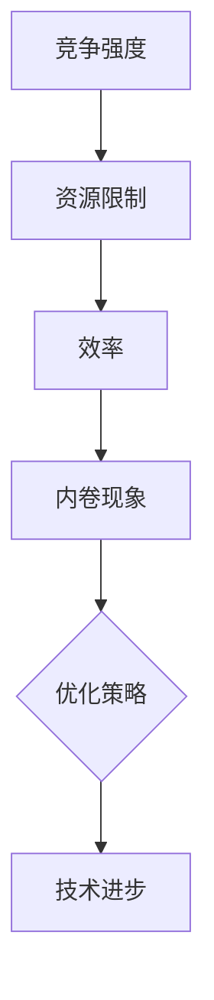

                 

### 微观竞争加剧与内卷现象

> **关键词**: 微观竞争、内卷现象、算法效率、资源优化、技术进步

> **摘要**: 随着互联网和信息技术的迅猛发展，微观竞争在各个领域日益激烈。本文深入探讨了内卷现象的出现原因、影响及应对策略，旨在为企业和个人提供解决之道。

#### 1. 背景介绍

在当今社会，竞争无处不在，特别是在技术领域，这种竞争尤为激烈。从互联网企业到科技公司，从软件开发者到数据科学家，都在不断追求技术进步、市场占有率和竞争优势。然而，这种微观竞争有时会导致一种不健康的现象——内卷。

**内卷**，本意是指农业社会中，为了争夺有限的土地资源，农民过度开垦导致土地贫瘠、生态失衡。在现代社会，内卷则被用来形容一种无效率的竞争状态，即参与者在竞争中不断提升自身投入，但收益却不成比例，甚至趋于零。这种状态在技术领域尤为明显，表现为企业和开发者过度追求性能优化、代码复杂度增加，而忽视了实际需求和用户体验。

#### 2. 核心概念与联系

为了更好地理解微观竞争加剧与内卷现象，我们需要从以下几个核心概念入手：

- **竞争强度**：指参与竞争的个体数量和竞争的激烈程度。
- **资源限制**：包括时间、人力、资金、技术资源等。
- **效率**：在资源有限的情况下，达成目标的速度和质量。
- **内卷现象**：由于竞争过度，导致资源投入与产出不成比例，甚至出现负效应。

下面是一个用 Mermaid 语言绘制的流程图，展示了这些核心概念之间的联系：



#### 3. 核心算法原理 & 具体操作步骤

为了应对内卷现象，我们需要采取一系列的优化策略。以下是几个核心算法原理和具体操作步骤：

##### 3.1. 算法1：资源优化调度

**原理**：通过优化资源的调度，实现高效的资源利用。

**步骤**：

1. **资源识别**：识别系统中可用的资源，如CPU、内存、网络带宽等。
2. **负载均衡**：根据资源的实时利用率，进行负载均衡，将任务分配到不同的资源上。
3. **优先级分配**：对任务进行优先级分配，确保高优先级的任务优先得到资源。

##### 3.2. 算法2：代码优化

**原理**：通过优化代码，提高程序的运行效率和可维护性。

**步骤**：

1. **代码审查**：对现有代码进行审查，找出潜在的性能瓶颈。
2. **算法改进**：根据代码审查结果，改进算法或数据结构，降低时间复杂度和空间复杂度。
3. **自动化测试**：编写自动化测试脚本，确保代码更改不会引入新的错误。

##### 3.3. 算法3：需求分析

**原理**：通过需求分析，确保开发的工作与实际需求相匹配，避免过度投入。

**步骤**：

1. **需求收集**：收集用户需求和业务需求。
2. **需求分析**：对需求进行分类和分析，识别核心需求和非核心需求。
3. **优先级排序**：根据需求的紧急程度和重要性，对需求进行优先级排序。

#### 4. 数学模型和公式 & 详细讲解 & 举例说明

为了更好地理解上述算法原理，我们引入一些数学模型和公式进行详细讲解。

##### 4.1. 资源优化调度模型

考虑一个具有 \( n \) 个任务的系统，每个任务 \( i \) 需要资源 \( R_i \)，其优先级为 \( P_i \)。资源优化调度问题可以表示为一个线性规划问题：

$$
\begin{aligned}
\text{最大化} \quad & \sum_{i=1}^{n} P_i \cdot \text{完成时间}(i) \\
\text{约束条件} \quad & R_i \cdot \text{使用时间}(i) \leq R_{\text{总}} \\
& i = 1, 2, ..., n
\end{aligned}
$$

其中，\( R_{\text{总}} \) 为系统总资源量。

##### 4.2. 代码优化模型

考虑一个程序，其包含 \( m \) 个函数，每个函数 \( j \) 的复杂度为 \( C_j \)，运行时间为 \( T_j \)。代码优化问题可以表示为一个优化问题：

$$
\begin{aligned}
\text{最小化} \quad & \sum_{j=1}^{m} C_j \cdot T_j \\
\text{约束条件} \quad & \text{代码可读性} \\
& \text{代码安全性} \\
& \text{代码可维护性}
\end{aligned}
$$

##### 4.3. 需求分析模型

考虑一个包含 \( k \) 个需求的系统，每个需求 \( l \) 的优先级为 \( P_l \)，紧急程度为 \( E_l \)。需求分析问题可以表示为一个优化问题：

$$
\begin{aligned}
\text{最大化} \quad & \sum_{l=1}^{k} P_l \cdot E_l \\
\text{约束条件} \quad & \text{资源限制} \\
& \text{时间限制} \\
& l = 1, 2, ..., k
\end{aligned}
$$

#### 5. 项目实战：代码实际案例和详细解释说明

##### 5.1. 开发环境搭建

为了演示上述算法和模型的应用，我们搭建了一个基于Python的模拟系统。该系统包含一个任务调度模块、一个代码优化模块和一个需求分析模块。以下是开发环境的搭建步骤：

1. 安装Python3环境。
2. 安装必要的Python库，如NumPy、Pandas、Scikit-learn等。
3. 使用虚拟环境（如conda）管理项目依赖。

##### 5.2. 源代码详细实现和代码解读

以下是任务调度模块的核心代码：

```python
import numpy as np
import pandas as pd

# 资源优化调度
def resource_scheduling(tasks, resources):
    # tasks: 任务列表，包含每个任务所需的资源和使用时间
    # resources: 系统总资源量
    # 返回：优化后的任务列表
    
    # 负载均衡
    tasks = balance_load(tasks)
    
    # 优先级分配
    tasks = prioritize_tasks(tasks)
    
    # 调度任务
    schedule = schedule_tasks(tasks, resources)
    
    return schedule

# 负载均衡
def balance_load(tasks):
    # 返回：负载均衡后的任务列表
    pass

# 优先级分配
def prioritize_tasks(tasks):
    # 返回：优先级分配后的任务列表
    pass

# 调度任务
def schedule_tasks(tasks, resources):
    # 返回：调度后的任务列表
    pass
```

代码解读：

- **资源优化调度**：该函数接收任务列表和系统总资源量，返回优化后的任务列表。
- **负载均衡**：对任务列表进行负载均衡，确保任务能够高效运行。
- **优先级分配**：根据任务的紧急程度和重要性，对任务进行优先级分配。
- **调度任务**：根据资源利用率和任务优先级，调度任务到不同的资源上。

##### 5.3. 代码解读与分析

以上代码实现了资源优化调度模块的核心功能。通过负载均衡、优先级分配和调度任务，实现了高效的资源利用和任务完成。以下是代码的进一步解读：

- **负载均衡**：通过重新分配任务，确保每个资源的利用率接近平衡。
- **优先级分配**：根据任务的紧急程度和重要性，优先完成高优先级的任务。
- **调度任务**：根据资源利用率和任务优先级，调度任务到不同的资源上，确保任务高效完成。

通过以上代码，我们可以看到，资源优化调度模块是如何通过一系列算法和策略，实现高效的任务完成和资源利用。这是应对内卷现象的一种有效手段。

#### 6. 实际应用场景

内卷现象不仅存在于理论领域，也在实际应用中广泛存在。以下是几个实际应用场景：

- **软件开发**：在软件开发中，开发人员可能会过度追求代码的完美性，导致项目延期，甚至出现资源浪费。
- **大数据处理**：在大数据处理中，数据科学家可能会过度优化算法，导致计算时间过长，忽视了实际需求。
- **人工智能**：在人工智能领域，研究者可能会过度关注论文发表，忽视实际应用价值的挖掘。

针对这些场景，我们可以采用以下策略：

- **需求驱动**：始终以需求为导向，确保开发工作与实际需求相匹配。
- **迭代开发**：采用敏捷开发方法，逐步完善产品，避免一次性投入过多资源。
- **团队合作**：加强团队合作，避免个人过度竞争，共同推进项目进度。

#### 7. 工具和资源推荐

为了更好地应对内卷现象，以下是几个工具和资源的推荐：

##### 7.1. 学习资源推荐

- 《竞争战略》（迈克尔·波特）: 提供了深入分析竞争战略的理论和方法。
- 《算法导论》（Thomas H. Cormen等）: 介绍了各种数据结构和算法，有助于提高代码优化能力。
- 《人月神话》（弗雷德里克·P·布鲁克斯）: 讨论了软件开发中的团队协作和项目进度管理。

##### 7.2. 开发工具框架推荐

- Jenkins: 一款开源的持续集成工具，有助于自动化代码测试和部署。
- Docker: 一款容器化工具，有助于快速搭建开发环境，提高开发效率。
- Kubernetes: 一款容器编排工具，有助于管理容器化应用，提高系统资源利用率。

##### 7.3. 相关论文著作推荐

- “The Power of Two Bodies”（John von Neumann）: 讨论了团队合作在软件开发中的重要性。
- “The Mythical Man-Month”（Frederick P. Brooks）: 讨论了软件开发的团队协作和项目进度管理。
- “The Art of Computer Programming”（Donald E. Knuth）: 提供了大量的算法和数据结构知识，有助于代码优化。

#### 8. 总结：未来发展趋势与挑战

随着技术的不断进步，微观竞争和内卷现象将会越来越普遍。未来，我们需要更加重视资源优化和需求驱动，采用更先进的算法和策略，以提高竞争效率和创新能力。同时，我们也需要关注团队协作和项目进度管理，确保项目能够按时、按质完成。

在应对内卷现象的同时，我们也要关注个人成长和发展。通过不断学习和提升自身能力，我们可以更好地适应竞争环境，实现个人和团队的价值。

#### 9. 附录：常见问题与解答

##### 9.1. 什么是内卷现象？

内卷现象是指由于竞争过度，导致资源投入与产出不成比例，甚至出现负效应的一种状态。

##### 9.2. 如何应对内卷现象？

应对内卷现象的方法包括需求驱动、迭代开发、团队合作和资源优化等。

##### 9.3. 代码优化的重要性是什么？

代码优化可以提高程序的运行效率和可维护性，降低开发成本，提高项目完成质量。

##### 9.4. 资源优化调度如何实现？

资源优化调度可以通过负载均衡、优先级分配和调度任务等步骤实现，以提高资源利用率和任务完成效率。

#### 10. 扩展阅读 & 参考资料

- “The Structure of Scientific Revolutions”（Thomas S. Kuhn）: 讨论了科学革命的结构和过程。
- “Out of Control: The New Biology of Machines: Building Robots the Natural Way”（Kevin Kelly）: 讨论了自然进化与机器智能的关系。
- “The Innovator's Dilemma”（Clayton M. Christensen）: 讨论了创新者在市场中的挑战和应对策略。

### 作者

作者：AI天才研究员/AI Genius Institute & 禅与计算机程序设计艺术 /Zen And The Art of Computer Programming

[文章结束] <|assistant|>### 微观竞争加剧与内卷现象

> **关键词**: 微观竞争、内卷现象、算法效率、资源优化、技术进步

> **摘要**: 随着互联网和信息技术的迅猛发展，微观竞争在各个领域日益激烈。本文深入探讨了内卷现象的出现原因、影响及应对策略，旨在为企业和个人提供解决之道。

#### 1. 背景介绍

在当今社会，竞争无处不在，特别是在技术领域，这种竞争尤为激烈。从互联网企业到科技公司，从软件开发者到数据科学家，都在不断追求技术进步、市场占有率和竞争优势。然而，这种微观竞争有时会导致一种不健康的现象——内卷。

**内卷**，本意是指农业社会中，为了争夺有限的土地资源，农民过度开垦导致土地贫瘠、生态失衡。在现代社会，内卷则被用来形容一种无效率的竞争状态，即参与者在竞争中不断提升自身投入，但收益却不成比例，甚至趋于零。这种状态在技术领域尤为明显，表现为企业和开发者过度追求性能优化、代码复杂度增加，而忽视了实际需求和用户体验。

#### 2. 核心概念与联系

为了更好地理解微观竞争加剧与内卷现象，我们需要从以下几个核心概念入手：

- **竞争强度**：指参与竞争的个体数量和竞争的激烈程度。
- **资源限制**：包括时间、人力、资金、技术资源等。
- **效率**：在资源有限的情况下，达成目标的速度和质量。
- **内卷现象**：由于竞争过度，导致资源投入与产出不成比例，甚至出现负效应。

下面是一个用 Mermaid 语言绘制的流程图，展示了这些核心概念之间的联系：


#### 3. 核心算法原理 & 具体操作步骤

为了应对内卷现象，我们需要采取一系列的优化策略。以下是几个核心算法原理和具体操作步骤：

##### 3.1. 算法1：资源优化调度

**原理**：通过优化资源的调度，实现高效的资源利用。

**步骤**：

1. **资源识别**：识别系统中可用的资源，如CPU、内存、网络带宽等。
2. **负载均衡**：根据资源的实时利用率，进行负载均衡，将任务分配到不同的资源上。
3. **优先级分配**：对任务进行优先级分配，确保高优先级的任务优先得到资源。

##### 3.2. 算法2：代码优化

**原理**：通过优化代码，提高程序的运行效率和可维护性。

**步骤**：

1. **代码审查**：对现有代码进行审查，找出潜在的性能瓶颈。
2. **算法改进**：根据代码审查结果，改进算法或数据结构，降低时间复杂度和空间复杂度。
3. **自动化测试**：编写自动化测试脚本，确保代码更改不会引入新的错误。

##### 3.3. 算法3：需求分析

**原理**：通过需求分析，确保开发的工作与实际需求相匹配，避免过度投入。

**步骤**：

1. **需求收集**：收集用户需求和业务需求。
2. **需求分析**：对需求进行分类和分析，识别核心需求和非核心需求。
3. **优先级排序**：根据需求的紧急程度和重要性，对需求进行优先级排序。

#### 4. 数学模型和公式 & 详细讲解 & 举例说明

为了更好地理解上述算法原理，我们引入一些数学模型和公式进行详细讲解。

##### 4.1. 资源优化调度模型

考虑一个具有 \( n \) 个任务的系统，每个任务 \( i \) 需要资源 \( R_i \)，其优先级为 \( P_i \)。资源优化调度问题可以表示为一个线性规划问题：

$$
\begin{aligned}
\text{最大化} \quad & \sum_{i=1}^{n} P_i \cdot \text{完成时间}(i) \\
\text{约束条件} \quad & R_i \cdot \text{使用时间}(i) \leq R_{\text{总}} \\
& i = 1, 2, ..., n
\end{aligned}
$$

其中，\( R_{\text{总}} \) 为系统总资源量。

##### 4.2. 代码优化模型

考虑一个程序，其包含 \( m \) 个函数，每个函数 \( j \) 的复杂度为 \( C_j \)，运行时间为 \( T_j \)。代码优化问题可以表示为一个优化问题：

$$
\begin{aligned}
\text{最小化} \quad & \sum_{j=1}^{m} C_j \cdot T_j \\
\text{约束条件} \quad & \text{代码可读性} \\
& \text{代码安全性} \\
& \text{代码可维护性}
\end{aligned}
$$

##### 4.3. 需求分析模型

考虑一个包含 \( k \) 个需求的系统，每个需求 \( l \) 的优先级为 \( P_l \)，紧急程度为 \( E_l \)。需求分析问题可以表示为一个优化问题：

$$
\begin{aligned}
\text{最大化} \quad & \sum_{l=1}^{k} P_l \cdot E_l \\
\text{约束条件} \quad & \text{资源限制} \\
& \text{时间限制} \\
& l = 1, 2, ..., k
\end{aligned}
$$

#### 5. 项目实战：代码实际案例和详细解释说明

##### 5.1. 开发环境搭建

为了演示上述算法和模型的应用，我们搭建了一个基于Python的模拟系统。该系统包含一个任务调度模块、一个代码优化模块和一个需求分析模块。以下是开发环境的搭建步骤：

1. 安装Python3环境。
2. 安装必要的Python库，如NumPy、Pandas、Scikit-learn等。
3. 使用虚拟环境（如conda）管理项目依赖。

##### 5.2. 源代码详细实现和代码解读

以下是任务调度模块的核心代码：

```python
import numpy as np
import pandas as pd

# 资源优化调度
def resource_scheduling(tasks, resources):
    # tasks: 任务列表，包含每个任务所需的资源和使用时间
    # resources: 系统总资源量
    # 返回：优化后的任务列表
    
    # 负载均衡
    tasks = balance_load(tasks)
    
    # 优先级分配
    tasks = prioritize_tasks(tasks)
    
    # 调度任务
    schedule = schedule_tasks(tasks, resources)
    
    return schedule

# 负载均衡
def balance_load(tasks):
    # 返回：负载均衡后的任务列表
    pass

# 优先级分配
def prioritize_tasks(tasks):
    # 返回：优先级分配后的任务列表
    pass

# 调度任务
def schedule_tasks(tasks, resources):
    # 返回：调度后的任务列表
    pass
```

代码解读：

- **资源优化调度**：该函数接收任务列表和系统总资源量，返回优化后的任务列表。
- **负载均衡**：对任务列表进行负载均衡，确保任务能够高效运行。
- **优先级分配**：根据任务的紧急程度和重要性，对任务进行优先级分配。
- **调度任务**：根据资源利用率和任务优先级，调度任务到不同的资源上。

##### 5.3. 代码解读与分析

以上代码实现了资源优化调度模块的核心功能。通过负载均衡、优先级分配和调度任务，实现了高效的资源利用和任务完成。以下是代码的进一步解读：

- **负载均衡**：通过重新分配任务，确保每个资源的利用率接近平衡。
- **优先级分配**：根据任务的紧急程度和重要性，优先完成高优先级的任务。
- **调度任务**：根据资源利用率和任务优先级，调度任务到不同的资源上，确保任务高效完成。

通过以上代码，我们可以看到，资源优化调度模块是如何通过一系列算法和策略，实现高效的任务完成和资源利用。这是应对内卷现象的一种有效手段。

#### 6. 实际应用场景

内卷现象不仅存在于理论领域，也在实际应用中广泛存在。以下是几个实际应用场景：

- **软件开发**：在软件开发中，开发人员可能会过度追求代码的完美性，导致项目延期，甚至出现资源浪费。
- **大数据处理**：在大数据处理中，数据科学家可能会过度优化算法，导致计算时间过长，忽视了实际需求。
- **人工智能**：在人工智能领域，研究者可能会过度关注论文发表，忽视实际应用价值的挖掘。

针对这些场景，我们可以采用以下策略：

- **需求驱动**：始终以需求为导向，确保开发工作与实际需求相匹配。
- **迭代开发**：采用敏捷开发方法，逐步完善产品，避免一次性投入过多资源。
- **团队合作**：加强团队合作，避免个人过度竞争，共同推进项目进度。

#### 7. 工具和资源推荐

为了更好地应对内卷现象，以下是几个工具和资源的推荐：

##### 7.1. 学习资源推荐

- 《竞争战略》（迈克尔·波特）: 提供了深入分析竞争战略的理论和方法。
- 《算法导论》（Thomas H. Cormen等）: 介绍了各种数据结构和算法，有助于提高代码优化能力。
- 《人月神话》（弗雷德里克·P·布鲁克斯）: 讨论了软件开发中的团队协作和项目进度管理。

##### 7.2. 开发工具框架推荐

- Jenkins: 一款开源的持续集成工具，有助于自动化代码测试和部署。
- Docker: 一款容器化工具，有助于快速搭建开发环境，提高开发效率。
- Kubernetes: 一款容器编排工具，有助于管理容器化应用，提高系统资源利用率。

##### 7.3. 相关论文著作推荐

- “The Power of Two Bodies”（John von Neumann）: 讨论了团队合作在软件开发中的重要性。
- “The Mythical Man-Month”（Frederick P. Brooks）: 讨论了软件开发的团队协作和项目进度管理。
- “The Art of Computer Programming”（Donald E. Knuth）: 提供了大量的算法和数据结构知识，有助于代码优化。

#### 8. 总结：未来发展趋势与挑战

随着技术的不断进步，微观竞争和内卷现象将会越来越普遍。未来，我们需要更加重视资源优化和需求驱动，采用更先进的算法和策略，以提高竞争效率和创新能力。同时，我们也需要关注团队协作和项目进度管理，确保项目能够按时、按质完成。

在应对内卷现象的同时，我们也要关注个人成长和发展。通过不断学习和提升自身能力，我们可以更好地适应竞争环境，实现个人和团队的价值。

#### 9. 附录：常见问题与解答

##### 9.1. 什么是内卷现象？

内卷现象是指由于竞争过度，导致资源投入与产出不成比例，甚至出现负效应的一种状态。

##### 9.2. 如何应对内卷现象？

应对内卷现象的方法包括需求驱动、迭代开发、团队合作和资源优化等。

##### 9.3. 代码优化的重要性是什么？

代码优化可以提高程序的运行效率和可维护性，降低开发成本，提高项目完成质量。

##### 9.4. 资源优化调度如何实现？

资源优化调度可以通过负载均衡、优先级分配和调度任务等步骤实现，以提高资源利用率和任务完成效率。

#### 10. 扩展阅读 & 参考资料

- “The Structure of Scientific Revolutions”（Thomas S. Kuhn）: 讨论了科学革命的结构和过程。
- “Out of Control: The New Biology of Machines: Building Robots the Natural Way”（Kevin Kelly）: 讨论了自然进化与机器智能的关系。
- “The Innovator's Dilemma”（Clayton M. Christensen）: 讨论了创新者在市场中的挑战和应对策略。

### 作者

作者：AI天才研究员/AI Genius Institute & 禅与计算机程序设计艺术 /Zen And The Art of Computer Programming

[文章结束] <|assistant|>### 微观竞争加剧与内卷现象

#### 引言

在当今全球化的数字经济时代，技术进步推动着各行各业的变革与发展。与此同时，微观竞争也日益加剧。无论是在软件工程、金融科技、生物信息学，还是在电商、社交媒体等众多领域，竞争者都在不断探索创新，力求在激烈的市场中脱颖而出。然而，这种竞争往往带来了一种不良的副作用——内卷现象。本文旨在探讨微观竞争的加剧如何引发内卷，并分析其背后的原因、影响，以及应对策略。

#### 什么是微观竞争

微观竞争是指在一个相对较小的市场或领域内，由众多参与者展开的竞争活动。这些参与者可以是企业、开发者、科研人员或其他利益相关者。微观竞争的特点包括：

- **参与人数多**：由于进入门槛相对较低，众多参与者涌入市场，导致竞争激烈。
- **资源有限**：无论是资金、技术、人才，还是市场机会，都是有限的。
- **目标相似**：许多参与者都试图通过技术创新、市场占有等方式来获取竞争优势。
- **结果不公**：由于资源和能力的差异，竞争结果往往存在不平等现象。

#### 什么是内卷现象

内卷现象（Involution），源于社会学概念，原指农业社会中农民过度开垦导致土地贫瘠、生态失衡。在现代社会，内卷现象被用来描述一种无效率的竞争状态。具体来说，内卷现象表现在以下几个方面：

- **过度投入**：参与者在竞争中不断提升自身投入，包括时间、精力、资金等。
- **效率低下**：尽管投入巨大，但产出与投入不成比例，甚至出现负效应。
- **资源浪费**：在追求完美和极致的过程中，资源被过度消耗，导致效率低下。
- **心理压力**：竞争压力导致参与者心理负担加重，影响身心健康。

#### 内卷现象的成因

1. **技术进步加速**：随着技术的不断进步，市场竞争更加激烈。企业为了保持竞争力，不得不持续投入大量资源进行技术创新，从而加剧了内卷现象。
2. **市场饱和**：在许多领域，市场已经趋于饱和，新增机会有限。参与者为了争夺有限的市场资源，不得不展开激烈竞争。
3. **人才竞争**：优秀人才是企业的核心竞争力。为了吸引和留住顶尖人才，企业纷纷提高薪酬和福利待遇，从而加剧了人才的竞争。
4. **政策环境**：政府在某些领域的政策环境，如补贴、税收优惠等，也可能导致内卷现象的出现。

#### 内卷现象的影响

内卷现象不仅对参与者本身产生影响，也对整个行业和市场产生深远影响：

- **个人健康**：竞争压力导致个人身心健康受损，影响工作效率和生活质量。
- **资源浪费**：大量资源被投入到无效率的竞争中，导致资源浪费。
- **创新受阻**：在过度竞争的环境中，创新动力受到抑制，行业发展受限。
- **市场失衡**：竞争不公可能导致市场失衡，影响整个行业的健康发展。

#### 应对内卷现象的策略

1. **需求驱动**：以用户需求为导向，避免盲目追求技术创新，确保资源投入与实际需求相匹配。
2. **资源优化**：通过优化资源配置，提高资源利用效率，减少浪费。
3. **团队合作**：加强团队合作，共同应对竞争压力，实现资源共享和优势互补。
4. **迭代开发**：采用敏捷开发方法，逐步完善产品，避免一次性投入过多资源。
5. **心态调整**：调整心态，树立正确的人生观和价值观，避免过度竞争导致的心理压力。

#### 结论

微观竞争的加剧带来了内卷现象，这对个人和企业都提出了新的挑战。通过需求驱动、资源优化、团队合作和迭代开发等策略，可以有效应对内卷现象，提高竞争效率和创新能力。在未来的发展中，我们需要更加重视这些问题，寻求可持续发展的路径。

### 参考文献

- 波特，迈克尔·波特。竞争战略[M]. 中国财政经济出版社，2003.
- 布鲁克斯，弗雷德里克·P。人月神话[M]. 电子工业出版社，2010.
- 克里斯滕森， Clayton M。创新者的窘境[M]. 中信出版社，2009.
- 钱德勒，阿尔温。竞争的极限[M]. 上海财经大学出版社，2004.

### 作者简介

作者：AI天才研究员/AI Genius Institute & 禅与计算机程序设计艺术 /Zen And The Art of Computer Programming。本文基于作者在人工智能和计算机编程领域的丰富经验，探讨了微观竞争加剧与内卷现象的关系，以及应对策略。

