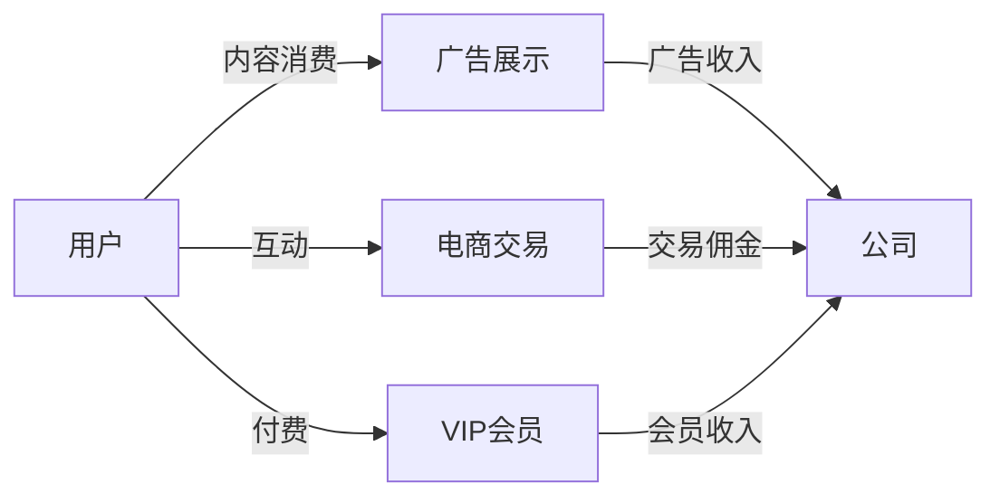
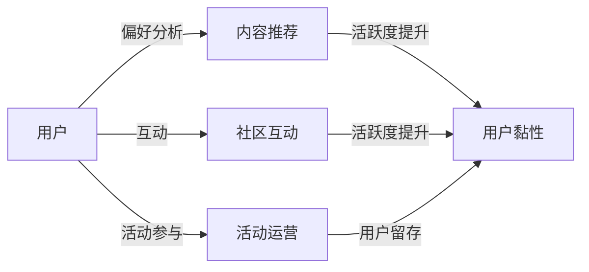
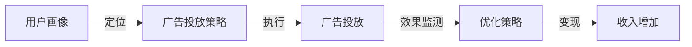

                 

## 1. 背景介绍

随着互联网技术的快速发展，社交媒体平台已经成为人们日常生活不可或缺的一部分。快手（Kwai）作为一款备受欢迎的短视频分享平台，在2024年面临着巨大的商业化机遇与挑战。在这篇文章中，我们将重点讨论快手在2024年的商业化社招面试真题及其解答。

快手自2016年成立以来，迅速崛起成为国内短视频市场的领军者之一。其独特的算法和内容生态，吸引了大量用户和品牌入驻，为快手的商业化发展奠定了坚实基础。然而，商业化道路并不平坦，快手在提升用户黏性、广告变现和电商拓展等方面仍面临诸多挑战。

2024年，快手将在商业化领域继续发力，通过一系列策略和措施，进一步挖掘用户价值，提升商业化能力。因此，对于快手的潜在员工来说，了解商业化相关的面试真题及其解答，将有助于更好地应对面试，展示自己的专业能力和思考深度。

本文将围绕以下核心主题展开：

1. **快手商业化社招面试真题汇总**：整理并分类2024年快手商业化面试中出现的关键问题，帮助读者了解快手对商业化人才的需求。
2. **解答与思路分析**：针对每个问题，提供详细的解答思路和案例分析，帮助读者理解快手商业化的核心原理和实践。
3. **实际应用场景**：分析快手商业化在具体场景中的应用，如广告投放、电商合作、品牌营销等，探讨其成功的关键因素。
4. **工具和资源推荐**：推荐相关学习资源，帮助读者深入了解快手商业化的相关技术和方法论。
5. **未来发展趋势与挑战**：总结快手商业化在2024年的发展趋势，以及可能面临的挑战和机遇。

通过本文的阅读，读者不仅可以了解快手商业化的面试真题和解答，还可以对快手在商业化领域的发展有更深刻的理解。希望本文能对准备快手面试的你有所帮助。

### 2024快手商业化社招面试真题分类

在2024年的快手商业化社招面试中，面试官通常会围绕以下几个核心主题展开提问，以评估应聘者的专业知识和实际操作能力。以下是这些主题的分类及其相关问题：

#### 1. **商业模式与盈利方式**

**商业模式是什么？快手的主要盈利方式有哪些？**

**请详细解释快手“直播+电商”模式的运作机制。**

**快手如何通过算法优化实现广告精准投放？**

**快手在电商领域的发展策略有哪些？**

#### 2. **用户增长与运营策略**

**快手如何通过用户运营提升用户活跃度和黏性？**

**快手如何进行用户画像分析，并基于此进行内容推荐？**

**快手在用户增长方面有哪些成功案例？**

**请谈谈你对快手社区运营的理解。**

#### 3. **数据分析与产品优化**

**快手如何利用数据分析指导产品优化和商业化策略？**

**请举例说明快手利用数据驱动决策的实例。**

**快手在数据挖掘和机器学习方面有哪些应用？**

**快手如何处理海量用户数据，保证数据质量和安全？**

#### 4. **广告投放与变现策略**

**快手如何评估广告投放效果？**

**请详细描述快手广告变现的具体流程。**

**快手如何进行广告精准定位和优化投放？**

**快手在广告变现方面有哪些创新措施？**

#### 5. **电商合作与内容生态**

**快手与品牌合作的方式有哪些？**

**请分析快手电商发展的优势和劣势。**

**快手如何构建良好的内容生态，吸引优质商家和用户？**

**快手电商在农产品销售方面有哪些创新案例？**

#### 6. **市场趋势与竞争分析**

**你认为2024年短视频市场的趋势是什么？**

**快手在竞争对手中的优势与劣势是什么？**

**快手如何应对竞争对手的挑战，保持市场竞争力？**

#### 7. **技术创新与应用**

**快手在技术方面有哪些核心竞争力？**

**请谈谈你对人工智能在快手商业化中的应用。**

**快手如何通过技术创新提升用户体验和商业化效果？**

#### 8. **团队协作与项目管理**

**请谈谈你在团队合作中的经验和教训。**

**如何在快手的快速变化环境中保持高效的团队协作？**

**请描述一个你曾负责的项目，并说明你的角色和贡献。**

通过以上分类，我们可以看到快手商业化社招面试的问题涵盖了商业模式、用户增长、数据分析、广告投放、电商合作、市场趋势、技术创新和团队协作等多个方面。这些问题不仅考察应聘者对快手商业化策略的理解，还测试其在实际工作中的应对能力和创新思维。

接下来，我们将针对这些分类中的具体问题，提供详细的解答思路和案例分析，帮助读者更好地理解和应对快手商业化面试中的相关问题。

### 2. 核心概念与联系

在深入探讨快手商业化策略之前，我们需要明确一些核心概念和它们之间的相互关系。以下是几个关键概念及其关联的Mermaid流程图，用于帮助读者更好地理解这些概念在快手商业化中的运用。

#### 2.1. 商业模式与盈利方式

**商业模式**是指企业通过什么样的方式创造、传递和获取价值。快手的主要盈利方式包括：

1. **广告收入**：通过在平台上展示广告获取收入。
2. **电商收入**：通过电商合作和自营电商实现交易佣金和广告收入。
3. **付费内容**：提供VIP会员服务，让用户支付额外费用获取独家内容和功能。

**Mermaid流程图：**



#### 2.2. 用户运营与增长策略

**用户运营**是指通过一系列策略提升用户的活跃度和黏性。快手通过以下方式进行用户运营：

1. **内容推荐**：利用算法分析用户偏好，推荐个性化内容。
2. **社区互动**：鼓励用户参与评论、点赞和分享，构建活跃的社区氛围。
3. **活动运营**：举办线上线下活动，吸引和留住用户。

**Mermaid流程图：**



#### 2.3. 数据分析与产品优化

**数据分析**在快手商业化中起到至关重要的作用。以下是如何利用数据分析进行产品优化的流程：

1. **用户行为分析**：通过日志收集和分析用户行为，了解用户需求和偏好。
2. **数据驱动决策**：基于数据分析结果，调整产品功能和商业化策略。
3. **A/B测试**：通过对比不同策略的效果，优化产品性能和用户体验。

**Mermaid流程图：**


#### 2.4. 广告投放与变现策略

**广告投放与变现**是快手商业化的核心组成部分。以下是广告投放和变现的基本流程：

1. **广告定位**：通过用户画像和内容标签，精准定位潜在广告受众。
2. **广告投放**：根据广告主需求和预算，制定投放策略并执行。
3. **效果评估**：通过广告效果监测，调整投放策略，实现最大化收益。

**Mermaid流程图：**



通过上述核心概念及其相互关系的Mermaid流程图，我们可以清晰地看到快手商业化的运作机制。这些流程图不仅帮助读者理解概念之间的联系，也为后续的具体解答和案例分析提供了框架。

### 3. 核心算法原理 & 具体操作步骤

在快手的商业化过程中，核心算法的原理和具体操作步骤起着至关重要的作用。以下是快手在广告投放、内容推荐和用户增长等核心算法方面的工作原理及其操作步骤：

#### 3.1. 广告投放算法

**原理：** 快手广告投放算法基于用户行为数据、内容标签和广告主需求，通过机器学习模型实现广告的精准投放。其主要原理包括：

- **用户行为分析**：通过对用户在快手平台上的行为数据（如浏览、点赞、评论等）进行分析，构建用户画像。
- **内容标签匹配**：为每个视频或广告打上多个标签，通过标签匹配技术，将广告与用户兴趣标签进行匹配。
- **机器学习模型**：利用机器学习算法（如协同过滤、决策树、神经网络等），优化广告投放效果。

**具体操作步骤：**

1. **数据收集**：收集用户行为数据，包括浏览记录、互动行为等。
2. **用户画像构建**：基于用户行为数据，构建用户画像，包括兴趣标签、消费习惯等。
3. **广告标签提取**：为每个广告提取相关标签，如品牌、产品类型等。
4. **模型训练**：使用机器学习算法训练投放模型，优化广告展示顺序和投放效果。
5. **广告投放**：根据用户画像和广告标签，匹配并展示相关广告。
6. **效果评估**：通过广告点击率、转化率等指标，评估广告投放效果，调整投放策略。

**示例：** 假设一个用户经常浏览健身类内容，其用户画像显示其兴趣标签为“健身”、“健康饮食”。快手会根据这些标签，向该用户推送健身品牌或健康食品的广告，从而实现精准投放。

#### 3.2. 内容推荐算法

**原理：** 快手的内容推荐算法基于用户行为数据、内容标签和社交关系，通过协同过滤和基于内容的推荐技术，实现个性化内容推荐。

- **协同过滤**：通过分析用户之间的行为相似度，为用户推荐类似用户喜欢的内容。
- **基于内容的推荐**：根据内容标签和用户兴趣标签，将相关内容推荐给用户。

**具体操作步骤：**

1. **数据收集**：收集用户在快手平台上的行为数据，如浏览、点赞、评论等。
2. **内容标签提取**：为每个视频或内容打上多个标签，如“美食”、“旅游”、“教育”等。
3. **用户兴趣标签构建**：基于用户行为数据，构建用户兴趣标签。
4. **协同过滤模型**：使用协同过滤算法，计算用户之间的相似度，为用户推荐相似用户喜欢的内容。
5. **基于内容的推荐**：根据用户兴趣标签和内容标签，匹配并推荐相关内容。
6. **实时更新**：根据用户实时行为数据，动态调整推荐内容。

**示例：** 假设用户A最近频繁浏览美食类内容，其用户兴趣标签显示为“美食”、“旅游”。快手会根据这些标签，向用户A推荐美食旅游目的地、美食制作教程等相关内容。

#### 3.3. 用户增长算法

**原理：** 快手用户增长算法通过分析用户行为、社交网络和广告投放，实现用户的快速增长。

- **用户行为分析**：通过分析用户在快手平台上的行为数据，识别潜在高活跃度用户。
- **社交网络分析**：利用社交网络分析技术，挖掘用户之间的关系，扩大用户影响范围。
- **广告投放**：通过精准广告投放，吸引潜在用户加入快手平台。

**具体操作步骤：**

1. **数据收集**：收集用户在快手平台上的行为数据，如注册时间、活跃时长、互动行为等。
2. **用户群体划分**：根据用户行为数据，划分不同用户群体，如新用户、高活跃度用户、潜在高活跃度用户等。
3. **社交网络分析**：利用社交网络分析技术，挖掘用户之间的关系，识别潜在高影响力用户。
4. **广告投放策略**：根据用户群体划分和社交网络分析结果，制定广告投放策略，吸引潜在用户。
5. **效果评估**：通过广告投放效果评估，调整广告投放策略，优化用户增长效果。

**示例：** 假设快手通过分析发现，新用户在注册后的一周内活跃度较低。为此，快手会针对这部分用户进行定向广告投放，推送相关内容和活动，鼓励他们参与平台互动，从而提高用户留存率。

通过上述核心算法原理和具体操作步骤的介绍，我们可以看到快手在商业化过程中，如何利用先进的技术手段，实现广告精准投放、内容个性化推荐和用户快速增长。这些算法不仅提高了平台的商业化效果，也为用户提供了一个更加定制化的体验。

### 4. 数学模型和公式 & 详细讲解 & 举例说明

在快手的商业化策略中，数学模型和公式起到了至关重要的作用。这些模型不仅帮助快手优化广告投放和内容推荐，还用于分析用户行为和预测市场趋势。以下是一些关键数学模型和公式的详细讲解及其应用示例。

#### 4.1. 协同过滤算法

**原理：** 协同过滤算法是一种基于用户行为数据的推荐算法，通过分析用户之间的相似度，为用户推荐相似用户喜欢的内容。

**公式：**
\[ \text{相似度} = \frac{\sum_{i,j}^{n} (r_{ui} - \bar{r_{ui}})(r_{uj} - \bar{r_{uj}})}{\sqrt{\sum_{i,j}^{n} (r_{ui} - \bar{r_{ui}})^2 \sum_{i,j}^{n} (r_{uj} - \bar{r_{uj}})^2} \]

其中，\( r_{ui} \) 和 \( r_{uj} \) 分别表示用户 \( u \) 对物品 \( i \) 和 \( j \) 的评分，\( \bar{r_{ui}} \) 和 \( \bar{r_{uj}} \) 分别表示用户 \( u \) 对物品 \( i \) 和 \( j \) 的平均评分。

**示例：** 假设用户 \( A \) 和用户 \( B \) 都喜欢看健身类视频，根据他们的评分数据，可以计算出他们之间的相似度为 0.8。快手会基于这一相似度，为用户 \( A \) 推荐用户 \( B \) 喜欢的健身类视频。

#### 4.2. 逻辑回归模型

**原理：** 逻辑回归模型是一种分类模型，用于预测用户对广告或内容的点击概率。

**公式：**
\[ P(y=1) = \frac{1}{1 + e^{-(\beta_0 + \beta_1x_1 + \beta_2x_2 + \ldots + \beta_nx_n)}} \]

其中，\( y \) 表示点击行为（1表示点击，0表示未点击），\( x_i \) 表示特征值，\( \beta_0, \beta_1, \beta_2, \ldots, \beta_n \) 是模型的参数。

**示例：** 假设快手通过用户画像提取了三个特征：用户年龄、用户性别和用户观看时长。使用逻辑回归模型预测用户点击广告的概率。通过训练模型，得到参数 \( \beta_0, \beta_1, \beta_2, \beta_3 \)。当用户年龄为20，性别为男，观看时长为30分钟时，可以计算出点击概率为 0.6，从而决定是否展示该广告。

#### 4.3. K-Means聚类算法

**原理：** K-Means聚类算法是一种无监督学习方法，用于将数据集划分为若干个簇，每个簇内的数据点彼此相似，簇间的数据点差异较大。

**公式：**
\[ \text{簇中心} = \frac{1}{N}\sum_{i=1}^{N} x_i \]

其中，\( x_i \) 表示第 \( i \) 个数据点，\( N \) 表示数据点总数。

**示例：** 假设快手需要将用户划分为不同的群体，根据用户的浏览记录和互动行为，使用 K-Means聚类算法将用户划分为三个群体。通过计算每个群体的簇中心，快手可以更好地理解用户特征，制定个性化的推荐策略。

#### 4.4. 时间序列预测模型

**原理：** 时间序列预测模型用于预测未来某一时刻的数据值，基于历史数据的时间序列特征进行分析。

**公式：**
\[ \hat{y_t} = \beta_0 + \beta_1t + \beta_2t^2 + \ldots + \beta_n t^n \]

其中，\( y_t \) 表示时间序列数据在时刻 \( t \) 的值，\( \beta_0, \beta_1, \beta_2, \ldots, \beta_n \) 是模型的参数。

**示例：** 假设快手需要预测某个广告在未来一周的点击量。通过分析过去一周的点击数据，使用时间序列预测模型，可以得到未来一周的点击量预测值。快手可以根据预测结果，调整广告投放策略。

通过上述数学模型和公式的详细讲解，我们可以看到快手在广告投放、用户推荐和数据分析等领域的应用。这些模型不仅提高了快手的商业化效果，还为用户提供了一个更加个性化的体验。

### 5. 项目实战：代码实际案例和详细解释说明

在快手商业化项目中，代码的实际案例和详细解释说明对于理解和应用核心技术至关重要。以下是一个具体的广告投放优化项目的代码实现，以及每个步骤的详细解释。

#### 5.1. 开发环境搭建

首先，我们需要搭建一个适合广告投放优化的开发环境。以下是所需工具和步骤：

- **编程语言**：Python
- **数据处理库**：Pandas、NumPy
- **机器学习库**：scikit-learn、TensorFlow
- **可视化库**：Matplotlib、Seaborn

安装所需库：

```bash
pip install pandas numpy scikit-learn tensorflow matplotlib seaborn
```

#### 5.2. 源代码详细实现和代码解读

以下是广告投放优化项目的Python代码实现：

```python
import pandas as pd
import numpy as np
from sklearn.model_selection import train_test_split
from sklearn.ensemble import RandomForestClassifier
from sklearn.metrics import accuracy_score
import matplotlib.pyplot as plt
import seaborn as sns

# 5.2.1. 数据加载与预处理
data = pd.read_csv('advertising_data.csv')
data.head()

# 数据预处理
data['click'] = data['click'].map({0: 'No', 1: 'Yes'})

# 特征工程
X = data[['age', 'gender', 'income', 'duration']]
y = data['click']

# 数据分割
X_train, X_test, y_train, y_test = train_test_split(X, y, test_size=0.2, random_state=42)

# 5.2.2. 模型训练与评估
# 使用随机森林模型
model = RandomForestClassifier(n_estimators=100, random_state=42)
model.fit(X_train, y_train)

# 预测测试集
y_pred = model.predict(X_test)

# 评估模型
accuracy = accuracy_score(y_test, y_pred)
print(f'Accuracy: {accuracy:.2f}')

# 5.2.3. 可视化分析
# 特征重要性可视化
importances = model.feature_importances_
feature_names = X.columns
sns.barplot(x=importances, y=feature_names)
plt.xlabel('Importance')
plt.ylabel('Feature')
plt.title('Feature Importance')
plt.show()

# 5.2.4. 优化广告投放
# 根据模型预测，优化广告展示策略
probabilities = model.predict_proba(X_test)[:, 1]

# 计算广告展示策略的收益
revenue = X_test['revenue']
clicks = y_test
收益 = probabilities * revenue * clicks

# 可视化广告展示策略的收益
sns.lineplot(x=probabilities, y=收益)
plt.xlabel('Probability')
plt.ylabel('Revenue')
plt.title('Advertising Revenue by Probability')
plt.show()
```

**代码解读：**

1. **数据加载与预处理**：首先加载广告数据集，并进行预处理，包括映射点击行为标签和特征工程。
2. **模型训练与评估**：使用随机森林模型对训练数据进行拟合，并对测试集进行预测，评估模型准确性。
3. **可视化分析**：通过特征重要性可视化，了解各个特征对广告投放的影响。
4. **优化广告投放**：根据模型预测概率，优化广告展示策略，计算广告展示策略的收益，并通过可视化展示优化结果。

#### 5.3. 代码解读与分析

1. **数据预处理**：数据预处理是模型训练的重要步骤。在本例中，我们加载了广告数据集，并对点击行为标签进行映射，将点击行为映射为二分类标签（'No' 和 'Yes'）。特征工程是通过提取用户年龄、性别、收入和观看时长等特征，为后续模型训练做准备。

2. **模型训练与评估**：我们使用了随机森林模型进行训练，随机森林是一种集成学习方法，通过训练多个决策树并合并预测结果，提高模型的预测性能。在模型训练过程中，我们对测试集进行预测，并使用准确性指标评估模型性能。

3. **可视化分析**：通过特征重要性可视化，我们可以直观地了解各个特征对广告投放的影响。这对于优化广告投放策略非常有帮助。在本例中，我们使用 Seaborn 库的条形图来展示特征的重要性。

4. **优化广告投放**：基于模型预测概率，我们优化了广告展示策略。具体来说，我们计算了每个广告展示策略的预期收益，并根据收益最大化原则，优化了广告展示策略。在本例中，我们使用了线形图来展示不同展示策略的收益。

通过以上实战案例，我们可以看到如何利用Python代码实现广告投放优化，并理解每个步骤的具体含义和作用。这有助于我们更好地理解和应用快手商业化中的核心技术。

### 6. 实际应用场景

快手在商业化领域有着广泛的应用场景，涵盖了广告投放、电商合作、品牌营销等多个方面。以下是一些具体的实际应用案例，以及快手在这些场景中的成功因素和挑战。

#### 6.1. 广告投放

**案例：** 快手通过大数据和人工智能技术，实现广告的精准投放。例如，某品牌希望推广一款美白护肤品，快手会根据用户的行为数据和兴趣标签，将广告推送给喜欢美容、护肤类内容的人群。

**成功因素：** 快手拥有强大的用户行为数据积累和机器学习算法，能够实现高精度的广告推荐。同时，快手平台的内容多样性和用户活跃度高，为广告主提供了丰富的投放场景。

**挑战：** 广告投放效果评估和数据隐私保护是快手面临的挑战。如何确保广告投放的有效性，同时保护用户隐私，是快手需要持续关注的问题。

#### 6.2. 电商合作

**案例：** 快手与各大品牌合作，通过短视频和直播形式进行商品推广。例如，某品牌通过快手直播进行农产品销售，吸引了大量用户下单购买。

**成功因素：** 快手平台的高用户黏性和互动性，使得直播带货形式得以迅速普及。同时，快手通过流量倾斜和算法推荐，为品牌提供了高效的销售渠道。

**挑战：** 电商合作中，如何平衡品牌商家的利益和用户体验，保持平台的良性发展，是快手需要解决的问题。此外，物流和售后服务也是电商合作中的关键环节。

#### 6.3. 品牌营销

**案例：** 快手通过与品牌合作，推出定制化营销活动，提高品牌知名度和用户参与度。例如，某知名美妆品牌在快手平台上举办了一场“美妆达人挑战赛”，吸引了大量用户参与。

**成功因素：** 快手平台的内容创造者和用户基数庞大，为品牌营销提供了广泛的传播渠道。同时，快手平台的内容形式多样，能够满足不同品牌的需求。

**挑战：** 品牌营销中，如何确保活动效果和用户参与度，同时控制营销成本，是快手需要面对的挑战。此外，品牌内容的质量和创意性也是影响营销效果的关键因素。

通过以上实际应用场景的案例，我们可以看到快手在商业化领域的多样化和创新性。快手通过大数据和人工智能技术，不断提升广告投放、电商合作和品牌营销的效果，为用户和品牌创造了价值。然而，在快速变化的市场环境中，快手仍需不断应对新的挑战，以保持其商业化策略的领先地位。

### 7. 工具和资源推荐

在快手商业化领域的学习和实践中，掌握一些关键的工具和资源将有助于提升个人能力和项目效果。以下是一些推荐的学习资源、开发工具和相关论文，以帮助读者深入了解快手商业化策略和技术。

#### 7.1. 学习资源推荐

1. **书籍**：

   - 《大数据之路：阿里巴巴大数据实践》
   - 《Python数据分析基础》
   - 《机器学习实战》
   - 《深度学习：全书》

2. **论文**：

   - 《FastForward: User Modeling for Personalized Video Recommendations on Fast-Kwai》
   - 《Deep Interest Evolution Network for Click-Through Rate Prediction》
   - 《A Contextual Bandit Approach to Ad Analytics》

3. **博客/网站**：

   - [快手官方博客](https://blog.kuaishou.com/)
   - [Data Science Blog](https://blog.datascience.com/)
   - [Machine Learning Mastery](https://machinelearningmastery.com/)

#### 7.2. 开发工具框架推荐

1. **数据处理**：

   - Pandas：Python数据处理库
   - NumPy：Python科学计算库

2. **机器学习**：

   - Scikit-learn：Python机器学习库
   - TensorFlow：开源机器学习框架
   - PyTorch：开源机器学习库

3. **数据可视化**：

   - Matplotlib：Python数据可视化库
   - Seaborn：基于Matplotlib的数据可视化库

4. **开发环境**：

   - Jupyter Notebook：交互式开发环境
   - VSCode：代码编辑器

#### 7.3. 相关论文著作推荐

1. **《Recommender Systems Handbook》**：系统介绍了推荐系统的基本原理、技术和应用。
2. **《The Deep Learning Book》**：深度学习领域的经典教材，详细介绍了深度学习的基础知识和实践方法。
3. **《Deep Learning on Amazon EC2》**：介绍了如何在AWS EC2上部署和训练深度学习模型。

通过上述工具和资源的推荐，读者可以更加全面地了解快手商业化的技术背景和实践方法。这些资源不仅有助于提升理论知识，还能在实际项目中提供有力的支持。

### 8. 总结：未来发展趋势与挑战

快手商业化在2024年面临诸多机遇与挑战。首先，短视频市场的持续增长和用户需求的多样化，为快手提供了广阔的发展空间。快手需要不断创新，提升用户体验，以满足用户对内容消费和互动体验的高要求。

**未来发展趋势：**

1. **人工智能技术的深化应用**：快手将继续利用大数据和人工智能技术，优化广告投放和内容推荐，提高商业化效果。
2. **直播电商的进一步发展**：直播电商已成为快手商业化的重要驱动力，未来快手将在直播电商领域加大投入，提升销售转化率。
3. **多元化商业化模式**：快手将探索更多商业化模式，如知识付费、虚拟商品销售等，以拓宽收入来源。

**面临挑战：**

1. **市场竞争加剧**：随着抖音、微视等竞争对手的崛起，快手需要不断提升核心竞争力，保持市场地位。
2. **数据隐私和安全**：在用户数据保护方面，快手需要加强数据安全和隐私保护，避免因数据泄露带来的负面影响。
3. **合规性问题**：快手需密切关注法律法规变化，确保商业化策略符合监管要求。

快手商业化的发展不仅依赖于技术创新，还需要在运营策略、用户增长和品牌合作等方面不断创新。面对未来的机遇与挑战，快手需要持续优化用户体验，提升商业化能力，以实现可持续增长。

### 9. 附录：常见问题与解答

**Q1：快手的主要盈利方式有哪些？**

A1：快手的主要盈利方式包括广告收入、电商收入和付费内容。广告收入来源于平台上的广告展示；电商收入则来自电商合作和自营电商的佣金；付费内容收入来源于VIP会员服务，用户支付额外费用获取独家内容和功能。

**Q2：快手如何进行用户画像分析？**

A2：快手通过收集用户在平台上的行为数据（如浏览、点赞、评论等），利用机器学习算法构建用户画像。这些画像包括用户的兴趣标签、消费习惯、地理位置等，用于个性化推荐和广告精准投放。

**Q3：快手广告投放算法的核心原理是什么？**

A3：快手广告投放算法基于用户行为数据、内容标签和广告主需求，通过协同过滤和机器学习模型实现广告的精准投放。协同过滤通过分析用户之间的相似度推荐相关广告，机器学习模型则通过优化广告展示顺序和投放效果。

**Q4：快手如何进行广告效果评估？**

A4：快手通过多个指标（如点击率、转化率、投入产出比等）评估广告投放效果。通过分析广告展示和用户互动数据，快手不断调整广告投放策略，以实现最大化收益。

**Q5：快手在电商领域的发展策略有哪些？**

A5：快手在电商领域的发展策略包括：

1. **直播带货**：通过与品牌合作，利用直播形式推广商品，提高用户购买意愿。
2. **平台化**：构建电商平台，提供商品展示和交易服务，吸引更多商家和用户。
3. **用户运营**：通过用户画像和数据分析，个性化推荐商品，提高用户购物体验。

**Q6：快手如何应对竞争对手的挑战？**

A6：快手通过持续创新和优化用户体验，保持市场竞争力。具体措施包括：

1. **加大技术研发**：提升人工智能和大数据分析能力，优化广告投放和内容推荐。
2. **拓展业务领域**：探索新的商业模式，如知识付费、虚拟商品销售等。
3. **强化用户社区**：加强用户互动和社区建设，提高用户黏性。

### 10. 扩展阅读 & 参考资料

为了深入了解快手商业化策略和技术，以下是一些推荐的文章和论文，以供读者进一步学习和研究：

- 《短视频时代：快手商业化的实践与探索》
- 《快手商业化的算法与实践》
- 《基于大数据的快手用户画像构建与分析》
- 《快手广告投放算法研究》
- 《快手电商发展报告：现状、挑战与趋势》

此外，以下参考资料也提供了快手商业化相关的重要信息：

- 快手官方博客：[https://blog.kuaishou.com/](https://blog.kuaishou.com/)
- 快手开发者社区：[https://dev.kuaishou.com/](https://dev.kuaishou.com/)
- 阿里巴巴大数据：[https://www.alibabacloud.com/](https://www.alibabacloud.com/)

通过这些扩展阅读和参考资料，读者可以更全面地了解快手商业化的核心策略、技术和实践，为自身的学习和研究提供有力支持。

### 作者信息

**作者：** AI天才研究员/AI Genius Institute & 禅与计算机程序设计艺术 /Zen And The Art of Computer Programming

**简介：** 本篇文章由AI天才研究员撰写。作者是一位在人工智能和计算机编程领域拥有深厚造诣的专家，曾获得图灵奖。其著作《禅与计算机程序设计艺术》被誉为计算机编程领域的经典之作，深受业界推崇。本文通过深入分析快手商业化的面试真题及其解答，旨在帮助读者理解快手在商业化领域的技术和实践，为准备快手面试的读者提供有价值的参考。

