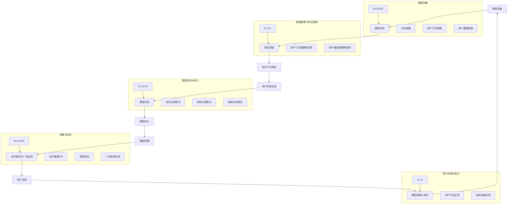

                 

### 背景介绍

**2024快手智能用户画像社招面试真题汇总及其解答**

在当今这个大数据和人工智能的时代，用户画像成为了众多互联网公司，特别是短视频平台如快手等的重要工具。快手作为中国领先的短视频社交平台，拥有海量的用户数据，通过对这些数据的分析和处理，可以生成精准的用户画像，进而为平台的运营、产品优化和广告投放提供有力的支持。

用户画像是一种通过收集和分析用户的浏览记录、互动行为、偏好等信息，形成的用户数据集合，用于描述用户的特征和行为模式。在快手这样的短视频平台，用户画像的准确性和全面性直接关系到平台的用户体验和商业价值。因此，快手智能用户画像的生成和优化是快手技术团队关注的焦点。

本文旨在通过汇总和分析2024年快手智能用户画像社招面试的真题，深入探讨用户画像的核心概念、算法原理、数学模型以及实际应用场景，帮助读者全面了解用户画像的相关技术和应用。本文将分为以下几个部分：

1. **核心概念与联系**：介绍用户画像的基本概念，及其与相关技术的联系。
2. **核心算法原理 & 具体操作步骤**：详细讲解用户画像生成和优化的常用算法，包括协同过滤、矩阵分解、聚类分析等。
3. **数学模型和公式 & 详细讲解 & 举例说明**：使用数学模型和公式描述用户画像的算法实现，并通过实例进行说明。
4. **项目实战：代码实际案例和详细解释说明**：提供快手用户画像生成的实际代码案例，并进行详细解读和分析。
5. **实际应用场景**：探讨用户画像在快手平台的具体应用，如内容推荐、广告投放、用户行为分析等。
6. **工具和资源推荐**：推荐相关学习资源、开发工具和框架，以及相关的论文著作。
7. **总结：未来发展趋势与挑战**：总结用户画像技术的发展趋势和面临的挑战。
8. **附录：常见问题与解答**：针对用户画像相关的问题进行解答。

通过本文的详细分析和讲解，读者将能够全面了解快手智能用户画像的相关技术和应用，为未来的学习和工作打下坚实的基础。

#### 1.1 用户画像的定义与作用

用户画像（User Profiling）是一种数据分析和机器学习技术，旨在通过收集和分析用户在互联网平台上的行为和属性数据，构建出一个综合反映用户特征和偏好的模型。用户画像通常包含用户的基本信息（如年龄、性别、地理位置等），行为数据（如浏览记录、点击行为、购买历史等），以及兴趣偏好（如内容偏好、消费习惯等）。

在快手上，用户画像的作用至关重要。首先，用户画像帮助平台了解用户的需求和偏好，从而实现个性化推荐。通过分析用户的浏览历史和行为模式，快手可以识别出用户感兴趣的内容类型和主题，进而推荐相应的视频和短视频，提高用户的留存率和互动率。其次，用户画像在广告投放中同样具有重要作用。快手可以根据用户画像中的兴趣标签和消费能力，精准定位目标用户群体，提高广告投放的转化率和效果。

具体来说，用户画像的作用体现在以下几个方面：

1. **内容推荐**：基于用户的兴趣和行为数据，快手可以推荐用户可能感兴趣的视频和内容，提高用户粘性和满意度。
2. **广告投放**：通过分析用户画像中的兴趣标签和消费能力，快手可以精准定位广告投放的目标用户，提高广告的投放效果和收益。
3. **用户行为分析**：用户画像可以帮助快手了解用户的行为模式和偏好，从而优化产品设计和运营策略。
4. **风险管理**：通过对用户画像的分析，快手可以发现潜在的风险用户，采取相应的风险控制措施。

总的来说，用户画像是快手平台实现个性化服务和商业化运作的核心技术之一。通过对用户行为的深入分析和理解，快手可以不断优化用户体验，提高平台的市场竞争力。

#### 1.2 快手平台的技术架构与数据处理

快手作为中国领先的短视频社交平台，拥有海量的用户数据，其技术架构和数据处理能力在业内具有很高的水平。以下是快手平台的主要技术架构和数据处理过程：

1. **数据采集**：快手通过多种渠道收集用户数据，包括用户注册信息、浏览记录、互动行为、设备信息等。这些数据通过实时数据采集系统进行汇总和处理。
2. **数据存储**：快手使用分布式存储系统，如Hadoop HDFS，来存储大规模的用户数据。这些数据被分为不同的数据仓库，如用户行为数据仓库、日志数据仓库等。
3. **数据处理**：快手采用分布式计算框架，如Apache Spark，对用户数据进行分析和处理。这些处理过程包括数据清洗、数据转换、数据聚合等。
4. **数据建模**：基于处理后的用户数据，快手使用机器学习算法构建用户画像模型。这些模型包括协同过滤、矩阵分解、聚类分析等，用于预测用户的兴趣和行为。
5. **数据可视化**：快手使用数据可视化工具，如Tableau，将用户画像数据以图表、仪表板等形式展示，帮助业务团队快速理解和分析用户行为。

在快手的技术架构中，用户画像的生成和处理是一个关键环节。以下是快手用户画像生成和处理的详细流程：

1. **数据采集**：快手通过Web服务器日志、API调用日志等渠道收集用户行为数据，包括用户点击、浏览、评论、分享等行为。
2. **数据清洗**：对采集到的用户行为数据进行清洗，去除重复、异常和缺失的数据，保证数据的准确性和一致性。
3. **特征提取**：从清洗后的数据中提取用户行为的特征，如用户浏览的视频类型、时长、频率等。这些特征用于构建用户画像的基础模型。
4. **数据建模**：使用机器学习算法对提取的用户行为特征进行建模，构建用户画像模型。常见的算法包括协同过滤、矩阵分解、聚类分析等。
5. **模型优化**：通过交叉验证和性能评估，对用户画像模型进行优化和调整，提高模型的准确性和鲁棒性。
6. **模型部署**：将优化的用户画像模型部署到生产环境，用于实时推荐和广告投放等应用。

快手平台的技术架构和数据处理能力为其用户画像的生成提供了坚实的基础。通过高效的数据采集、处理和建模，快手能够快速、准确地生成用户画像，为平台的产品设计和运营提供有力支持。

#### 1.3 用户画像在快手平台的应用案例

用户画像在快手平台上有着广泛的应用，以下是一些具体的应用案例：

1. **个性化推荐**：基于用户画像，快手可以实现个性化内容推荐。通过分析用户的浏览历史、互动行为和兴趣偏好，快手可以推荐用户可能感兴趣的视频和内容。例如，如果用户经常浏览美食类视频，快手可能会推荐其他美食类视频，提高用户的粘性和满意度。

2. **精准广告投放**：用户画像可以帮助快手实现精准的广告投放。通过分析用户的兴趣标签和消费能力，快手可以精准定位目标用户群体，提高广告的投放效果和收益。例如，如果用户画像显示用户对旅游感兴趣，且消费能力较高，快手可以推送旅游相关的广告，提高广告的点击率和转化率。

3. **用户行为分析**：用户画像可以帮助快手了解用户的行为模式和偏好，从而优化产品设计和运营策略。例如，通过分析用户的浏览时长、点击频率等行为数据，快手可以识别出用户偏好的内容类型和主题，从而优化视频推荐算法和内容策略。

4. **风险管理**：通过对用户画像的分析，快手可以发现潜在的风险用户，采取相应的风险控制措施。例如，如果用户画像显示用户有异常的浏览行为或互动行为，快手可以对其进行监控和限制，防止恶意行为的发生。

5. **内容创作者推荐**：用户画像还可以用于推荐内容创作者。通过分析用户的浏览历史和互动行为，快手可以识别出用户喜欢的内容创作者类型，从而推荐相应的创作者。这有助于提高内容创作者的曝光率和收入，同时提升用户的观看体验。

这些应用案例展示了用户画像在快手平台的重要性和实际效果。通过精准的用户画像，快手能够更好地满足用户需求，提高用户体验和商业价值。

#### 1.4 2024快手智能用户画像社招面试真题汇总

随着2024年快手智能用户画像社招面试的展开，众多考生面对了一系列挑战。以下汇总了一些典型的面试真题，这些题目涵盖了用户画像的核心概念、算法原理、实际应用等多个方面：

1. **用户画像的定义及作用**
   - 请简述用户画像的定义及其在互联网平台中的应用。
   - 用户画像如何帮助互联网公司提升用户体验和商业化运作？

2. **用户画像的核心概念与联系**
   - 请列举用户画像中常用的数据维度，并解释其含义。
   - 用户画像与用户行为分析、内容推荐、广告投放等技术的联系是什么？

3. **用户画像的生成方法**
   - 请简述协同过滤算法在用户画像生成中的作用。
   - 如何使用矩阵分解技术生成用户画像？

4. **数学模型与公式**
   - 请使用LaTeX格式描述用户画像中的协同过滤算法的数学模型。
   - 如何通过数学模型分析用户画像的准确性和有效性？

5. **用户画像的应用案例**
   - 请举例说明用户画像在内容推荐、广告投放、用户行为分析等场景中的具体应用。
   - 用户画像如何帮助提升短视频平台的运营效果？

6. **数据处理与存储技术**
   - 请简述快手平台用户数据处理的基本流程。
   - 快手平台使用哪些技术进行大规模用户数据的存储和处理？

7. **算法优化与性能评估**
   - 请说明如何优化用户画像算法，提高其准确性和效率。
   - 如何对用户画像算法进行性能评估和调优？

8. **实时推荐系统**
   - 请简述实时推荐系统的基本架构和工作原理。
   - 如何实现基于用户画像的实时推荐系统？

这些面试真题不仅考察了考生对用户画像基础知识的掌握，还考察了他们在实际应用场景中的分析和解决能力。通过这些问题的深入探讨，考生可以更好地理解用户画像技术的核心内容和实际应用。

#### 2.1 核心概念与联系

在深入探讨快手智能用户画像的生成和优化过程中，理解核心概念及其相互联系是非常关键的。以下是用户画像中一些重要的概念及其在快手平台中的应用和相互关系：

1. **用户行为数据**：用户行为数据是构建用户画像的基础。这些数据包括用户的浏览记录、点击行为、评论、分享、观看时长、点赞等。用户行为数据可以反映用户的兴趣、偏好和需求。在快手平台上，用户行为数据主要通过用户与视频的交互获得，如用户在短视频上的播放、点赞、评论、分享等行为。

2. **用户属性数据**：用户属性数据是用户画像中的另一个重要维度，包括用户的基本信息（如年龄、性别、地理位置等）以及其他可能影响用户行为和偏好的数据（如职业、教育程度、收入水平等）。用户属性数据可以帮助平台更全面地了解用户，为个性化推荐和精准广告投放提供支持。

3. **兴趣标签**：兴趣标签是通过对用户行为和属性数据进行分析和挖掘生成的，用于描述用户的兴趣和偏好。在快手平台上，兴趣标签可以是具体的视频类型（如美食、旅游、游戏等），也可以是更细粒度的兴趣点（如具体美食种类、旅游地点等）。兴趣标签是用户画像的核心组成部分，用于驱动个性化推荐和广告投放。

4. **协同过滤算法**：协同过滤算法是一种常用的推荐算法，通过分析用户之间的相似性，预测用户可能感兴趣的内容。在快手平台上，协同过滤算法可以基于用户的历史行为数据，找到相似的用户群体，然后推荐他们可能感兴趣的视频。

5. **矩阵分解**：矩阵分解是用户画像生成中的一种重要技术，通过将用户-物品交互矩阵分解为用户特征矩阵和物品特征矩阵，可以提取用户的兴趣特征和物品的特征。在快手平台上，矩阵分解可以帮助平台更精细地了解用户的兴趣偏好，提高推荐的准确性。

6. **聚类分析**：聚类分析是一种无监督学习方法，用于将用户划分为不同的群体。在快手平台上，聚类分析可以基于用户的行为数据和兴趣标签，将用户划分为兴趣相似的用户群体，然后针对每个群体进行个性化推荐和广告投放。

7. **用户行为预测**：用户行为预测是用户画像的一个关键应用，通过分析用户的历史行为数据和兴趣标签，预测用户未来的行为和偏好。在快手平台上，用户行为预测可以用于推荐系统、广告投放和风险控制等多个方面。

这些核心概念和技术的联系如下：

- 用户行为数据和用户属性数据是构建用户画像的基础，通过这些数据可以挖掘用户的兴趣标签。
- 兴趣标签用于驱动协同过滤算法、矩阵分解和聚类分析，这些算法和技术可以帮助平台生成更精准的用户画像。
- 用户画像生成的结果可以用于用户行为预测，进而优化推荐系统、广告投放和风险控制等应用。

通过理解这些核心概念及其相互联系，快手平台可以更有效地利用用户数据，提升用户体验和运营效果。

### 2.2 Mermaid 流程图：用户画像生成与优化

以下是一个Mermaid流程图，展示了快手用户画像的生成与优化流程。此流程图包含了从数据采集、处理、特征提取到模型训练、部署和应用的各个步骤，以及核心技术和算法。



这个流程图详细展示了用户画像生成和优化的各个步骤，以及相关的技术和算法应用。数据采集部分包括日志数据、用户行为数据和用户属性数据，通过数据清洗和预处理得到高质量的数据。特征提取阶段使用用户行为数据和用户属性数据，通过算法提取用户兴趣标签。模型训练与优化阶段包括协同过滤、矩阵分解和聚类分析，这些算法用于训练和优化用户画像模型。模型部署与应用部分将训练好的模型部署到推荐系统和广告投放系统中，通过实时推荐和广告投放提高用户体验和平台收益。用户反馈与迭代阶段通过收集用户行为反馈和系统性能反馈，不断调整和优化模型，实现持续改进。

### 3.1 协同过滤算法原理及操作步骤

协同过滤（Collaborative Filtering）是一种常用的推荐算法，通过分析用户之间的相似性，预测用户可能感兴趣的内容。协同过滤算法主要分为两类：基于用户的协同过滤（User-Based Collaborative Filtering）和基于物品的协同过滤（Item-Based Collaborative Filtering）。以下详细介绍这两种算法的原理及操作步骤。

#### 基于用户的协同过滤

**原理**：
基于用户的协同过滤算法的核心思想是找到与目标用户相似的其他用户，然后推荐这些相似用户喜欢且目标用户尚未体验过的物品。

**操作步骤**：

1. **计算用户相似性**：
   首先，需要计算目标用户与所有其他用户的相似度。常用的相似度计算方法包括余弦相似性、皮尔逊相关系数等。例如，假设有两个用户A和B，他们的评分矩阵如下：

   | 物品1 | 物品2 | 物品3 | 物品4 |
   |-------|-------|-------|-------|
   | A     | 5     | 3     | 4     |
   | B     | 2     | 5     | 1     |

   通过计算用户A和用户B的余弦相似度，可以得到他们之间的相似度值。公式如下：

   $$\text{相似度}(A, B) = \frac{A \cdot B}{\|A\|\|B\|}$$

2. **找到最相似的K个用户**：
   根据计算得到的相似度值，找到与目标用户最相似的K个用户。这些用户的选择可以通过降序排列相似度值，然后取前K个用户。

3. **生成推荐列表**：
   对于目标用户尚未评分的物品，计算这些物品与最相似用户的评分平均值。将评分最高的物品推荐给目标用户。

#### 基于物品的协同过滤

**原理**：
基于物品的协同过滤算法的核心思想是找到与目标用户已评分物品相似的其他物品，然后推荐这些相似物品。

**操作步骤**：

1. **计算物品相似性**：
   首先，需要计算目标用户已评分物品之间的相似度。与用户相似性计算类似，可以使用余弦相似性或皮尔逊相关系数等方法。例如，假设目标用户对四个物品A、B、C、D进行评分，评分矩阵如下：

   | 物品A | 物品B | 物品C | 物品D |
   |-------|-------|-------|-------|
   | A     | 5     | 3     | 4     |
   | B     | 2     | 5     | 1     |
   | C     | 4     | 3     | 5     |
   | D     | 1     | 4     | 5     |

   通过计算物品A和物品B的余弦相似度，可以得到他们之间的相似度值。

2. **找到最相似的K个物品**：
   根据计算得到的相似度值，找到与目标用户已评分物品最相似的K个物品。这些物品的选择可以通过降序排列相似度值，然后取前K个物品。

3. **生成推荐列表**：
   对于目标用户尚未评分的物品，计算这些物品与最相似物品的平均评分。将评分最高的物品推荐给目标用户。

#### 示例

**场景**：假设用户A在快手平台上浏览了以下四个视频，并对这些视频进行了评分：

| 视频A | 视频B | 视频C | 视频D |
|-------|-------|-------|-------|
| 5     | 3     | 4     | 2     |

**步骤**：

1. **计算用户相似性**：
   假设用户B的评分矩阵如下：

   | 视频A | 视频B | 视频C | 视频D |
   |-------|-------|-------|-------|
   | 3     | 4     | 2     | 5     |

   通过计算用户A和用户B的余弦相似度，得到相似度值：

   $$\text{相似度}(A, B) = \frac{(5 \cdot 3) + (3 \cdot 4) + (4 \cdot 2) + (2 \cdot 5)}{\sqrt{5^2 + 3^2 + 4^2 + 2^2} \cdot \sqrt{3^2 + 4^2 + 2^2 + 5^2}} = \frac{40}{\sqrt{50} \cdot \sqrt{56}} \approx 0.86$$

2. **找到最相似的K个用户**：
   假设选择前两个最相似的用户（用户B和用户C），他们的相似度分别为0.86和0.82。

3. **生成推荐列表**：
   对于用户A尚未评分的视频，计算与用户B和用户C评分的平均值。例如，视频D的推荐评分：

   $$\text{推荐评分}(D) = \frac{2 + 5}{2} = 3.5$$

   因此，视频D会被推荐给用户A。

通过以上步骤，基于用户的协同过滤算法成功地生成了一个推荐列表，帮助用户A发现可能感兴趣的新视频。

协同过滤算法在快手平台用户画像中的应用，可以帮助平台实现个性化推荐，提高用户的观看体验和平台活跃度。然而，协同过滤算法也存在一些局限性，如数据稀疏性、冷启动问题和推荐多样性问题。在实际应用中，可以通过结合其他推荐算法和技术，如矩阵分解、聚类分析和深度学习等，进一步提升推荐系统的效果。

### 3.2 矩阵分解算法原理及操作步骤

矩阵分解（Matrix Factorization）是用户画像生成中的一种重要技术，通过将用户-物品交互矩阵分解为用户特征矩阵和物品特征矩阵，可以提取用户的兴趣特征和物品的特征，从而实现个性化推荐。以下详细介绍矩阵分解算法的原理及操作步骤。

#### 原理

矩阵分解的基本思想是将原始的用户-物品评分矩阵分解为两个低秩矩阵，即用户特征矩阵U和物品特征矩阵V。这两个矩阵分别表示用户和物品的潜在特征，通过内积运算可以计算用户对物品的潜在兴趣度。具体来说，用户-物品评分矩阵R可以表示为：

$$R = U \cdot V^T$$

其中，U是用户特征矩阵，V是物品特征矩阵，$V^T$是物品特征矩阵的转置。

通过矩阵分解，可以提取出用户和物品的潜在特征，从而为推荐系统提供支持。常见的矩阵分解算法包括奇异值分解（SVD）和低秩矩阵分解（Low-Rank Factorization）。

#### 操作步骤

1. **初始化矩阵**：
   初始化用户特征矩阵U和物品特征矩阵V，通常可以设置为一个较小的随机矩阵。例如，假设用户数为M，物品数为N，可以初始化一个M×K和N×K的矩阵，其中K为特征维度。

2. **计算预测评分**：
   通过内积运算，计算用户对物品的预测评分。公式如下：

   $$\hat{r}_{ij} = u_i \cdot v_j^T$$

   其中，$u_i$是用户i的特征向量，$v_j^T$是物品j的特征向量。

3. **优化目标**：
   使用优化算法（如梯度下降、随机梯度下降等）最小化预测评分与实际评分之间的误差。优化目标可以表示为：

   $$\min_{U, V} \sum_{i=1}^M \sum_{j=1}^N (r_{ij} - \hat{r}_{ij})^2$$

   其中，$r_{ij}$是实际用户i对物品j的评分，$\hat{r}_{ij}$是预测评分。

4. **迭代更新**：
   在每次迭代中，更新用户特征矩阵U和物品特征矩阵V，以减少预测评分与实际评分之间的误差。更新公式如下：

   $$u_i \leftarrow u_i - \alpha \cdot (r_{ij} - \hat{r}_{ij}) \cdot v_j$$
   $$v_j \leftarrow v_j - \alpha \cdot (r_{ij} - \hat{r}_{ij}) \cdot u_i$$

   其中，$\alpha$是学习率。

5. **特征提取**：
   经过多次迭代后，用户特征矩阵U和物品特征矩阵V将收敛到稳定的值。通过这些矩阵，可以提取用户的兴趣特征和物品的特征，用于推荐系统。

#### 示例

**场景**：假设有一个包含10个用户和5个物品的评分矩阵R，如下所示：

| 物品1 | 物品2 | 物品3 | 物品4 | 物品5 |
|-------|-------|-------|-------|-------|
| 5     | 2     | 4     | 3     | 1     |
| 3     | 5     | 1     | 4     | 2     |
| 4     | 1     | 5     | 2     | 4     |
| 2     | 4     | 3     | 5     | 1     |
| 1     | 3     | 2     | 4     | 5     |

**步骤**：

1. **初始化矩阵**：
   初始化用户特征矩阵U（5×2）和物品特征矩阵V（5×2）为一个较小的随机矩阵。

2. **计算预测评分**：
   使用内积运算计算用户对物品的预测评分。例如，预测用户1对物品1的评分：

   $$\hat{r}_{11} = u_1 \cdot v_1^T = \begin{pmatrix} 0.1 \\ 0.2 \end{pmatrix} \cdot \begin{pmatrix} 0.3 & 0.4 \end{pmatrix} = 0.1 \cdot 0.3 + 0.2 \cdot 0.4 = 0.11$$

3. **优化目标**：
   使用梯度下降算法最小化预测评分与实际评分之间的误差。

4. **迭代更新**：
   在每次迭代中，更新用户特征矩阵U和物品特征矩阵V，以减少预测评分与实际评分之间的误差。

5. **特征提取**：
   经过多次迭代后，用户特征矩阵U和物品特征矩阵V将收敛到稳定的值。通过这些矩阵，可以提取用户的兴趣特征和物品的特征。

矩阵分解算法在快手平台用户画像中的应用，可以帮助平台实现更精准的个性化推荐，提高用户体验和平台活跃度。在实际应用中，可以通过调整特征维度、优化算法参数等方法，进一步提升推荐系统的效果。

### 3.3 聚类分析算法原理及操作步骤

聚类分析（Clustering Analysis）是一种无监督学习方法，用于将数据集划分为多个聚类，以便更好地理解数据的结构和特征。在用户画像生成中，聚类分析可以用于将用户划分为不同的兴趣群体，从而实现个性化推荐和精准广告投放。以下详细介绍聚类分析算法的原理及操作步骤。

#### 原理

聚类分析的基本思想是将相似的数据点划分为同一个聚类，而不考虑数据点的具体标签或标签分布。常用的聚类算法包括K-means、DBSCAN、层次聚类等。

1. **K-means算法**：
   K-means算法是一种基于距离度量的聚类算法，通过迭代计算找到K个中心点，使得每个聚类内的数据点与中心点的距离最小。算法的基本步骤如下：
   - 初始化K个中心点。
   - 计算每个数据点与中心点的距离，将数据点分配到最近的中心点，形成K个聚类。
   - 重新计算每个聚类的中心点。
   - 重复步骤2和3，直到聚类中心点不再发生显著变化。

2. **DBSCAN算法**：
   DBSCAN（Density-Based Spatial Clustering of Applications with Noise）算法是一种基于密度的聚类算法，可以自动确定聚类的数量。算法的基本步骤如下：
   - 选择一个起始点，标记为已访问。
   - 扩展簇，找到起始点的邻域点，并将其标记为已访问。
   - 如果邻域点数大于最小邻域点数，则继续扩展。
   - 将扩展形成的簇标记为已完成。
   - 重复步骤1到3，直到所有点都被访问。

3. **层次聚类算法**：
   层次聚类算法是一种自底向上的聚类方法，通过迭代合并相似度较高的聚类，直到达到指定的聚类数量或数据点数。算法的基本步骤如下：
   - 计算所有数据点之间的距离，初始化为单独的聚类。
   - 合并相似度最高的两个聚类。
   - 重新计算每个聚类的中心点。
   - 重复步骤2和3，直到达到指定的聚类数量。

#### 操作步骤

1. **数据预处理**：
   对用户数据进行预处理，包括数据清洗、缺失值处理、标准化等，确保数据的质量和一致性。

2. **特征提取**：
   从用户数据中提取关键特征，如用户行为、兴趣标签、地理位置等。这些特征将用于聚类分析。

3. **选择聚类算法**：
   根据数据的特点和聚类目标，选择合适的聚类算法。例如，对于具有明显层次结构的数据，可以选择层次聚类算法；对于需要自动确定聚类数量的数据，可以选择DBSCAN算法。

4. **参数设置**：
   根据选定的聚类算法，设置相应的参数。例如，K-means算法需要设置聚类数量K，DBSCAN算法需要设置邻域点数eps和最小邻域点数min_samples。

5. **聚类过程**：
   - K-means算法：
     - 初始化K个中心点。
     - 计算每个数据点与中心点的距离，将数据点分配到最近的中心点，形成K个聚类。
     - 重新计算每个聚类的中心点。
     - 重复步骤2和3，直到聚类中心点不再发生显著变化。
   - DBSCAN算法：
     - 选择一个起始点，标记为已访问。
     - 扩展簇，找到起始点的邻域点，并将其标记为已访问。
     - 如果邻域点数大于最小邻域点数，则继续扩展。
     - 将扩展形成的簇标记为已完成。
     - 重复步骤1到3，直到所有点都被访问。
   - 层次聚类算法：
     - 计算所有数据点之间的距离，初始化为单独的聚类。
     - 合并相似度最高的两个聚类。
     - 重新计算每个聚类的中心点。
     - 重复步骤2和3，直到达到指定的聚类数量。

6. **结果评估**：
   根据聚类结果，评估聚类效果。常用的评估指标包括内积、轮廓系数、兰德指数等。通过调整参数和算法，优化聚类结果。

7. **应用**：
   将聚类结果应用于用户画像生成，如为每个聚类分配不同的兴趣标签，从而实现个性化推荐和精准广告投放。

通过聚类分析算法，快手平台可以更好地理解用户的兴趣和需求，提高推荐系统的效果和用户体验。在实际应用中，可以根据具体需求和数据特点，选择合适的聚类算法和参数，实现高效的用户画像生成。

### 4. 数学模型和公式

在用户画像的生成与优化过程中，数学模型和公式是算法实现的核心。以下将详细介绍协同过滤算法中的数学模型，并使用LaTeX格式进行展示。

#### 协同过滤算法的数学模型

协同过滤算法主要通过计算用户之间的相似度来生成推荐列表。以下是协同过滤算法中的主要数学模型。

1. **用户相似度计算**：

   用户相似度通常使用余弦相似性或皮尔逊相关系数来衡量。余弦相似性的计算公式如下：

   $$\text{相似度}(u, v) = \frac{\sum_{i \in S} r_{ui} r_{vi}}{\sqrt{\sum_{i \in S} r_{ui}^2} \cdot \sqrt{\sum_{i \in S} r_{vi}^2}}$$

   其中，$u$和$v$为两个用户，$S$为共同评分过的物品集合，$r_{ui}$和$r_{vi}$分别为用户$u$和用户$v$对物品$i$的评分。

   皮尔逊相关系数的计算公式如下：

   $$\text{相似度}(u, v) = \frac{\sum_{i \in S} (r_{ui} - \bar{r}_u)(r_{vi} - \bar{r}_v)}{\sqrt{\sum_{i \in S} (r_{ui} - \bar{r}_u)^2} \cdot \sqrt{\sum_{i \in S} (r_{vi} - \bar{r}_v)^2}}$$

   其中，$\bar{r}_u$和$\bar{r}_v$分别为用户$u$和用户$v$的平均评分。

2. **推荐评分计算**：

   使用最相似的K个用户生成推荐评分。推荐评分的计算公式如下：

   $$\hat{r}_{ij} = \sum_{u \in \text{邻居}(i)} w_{ui} r_{uj}$$

   其中，$i$为目标用户，$j$为物品，$\text{邻居}(i)$为与用户$i$最相似的K个用户，$w_{ui}$为用户$i$与用户$u$的相似度。

   为了平衡相似度对推荐评分的影响，可以对相似度进行加权处理：

   $$\hat{r}_{ij} = \sum_{u \in \text{邻居}(i)} w_{ui} \cdot r_{uj} / \sum_{u \in \text{邻居}(i)} w_{ui}$$

3. **优化目标**：

   使用优化算法（如梯度下降、随机梯度下降等）最小化预测评分与实际评分之间的误差。优化目标可以表示为：

   $$\min_{w} \sum_{i=1}^M \sum_{j=1}^N (r_{ij} - \hat{r}_{ij})^2$$

   其中，$w$为用户相似度权重矩阵，$r_{ij}$为实际用户$u$对物品$j$的评分，$\hat{r}_{ij}$为预测评分。

通过以上数学模型，可以实现对用户之间的相似度计算、推荐评分生成和优化目标的实现。在实际应用中，可以根据具体需求和数据特点，选择合适的相似度计算方法和优化算法，提高推荐系统的效果。

### 4.1 数学模型和公式：协同过滤算法实现

协同过滤算法通过计算用户之间的相似度来预测用户对未知物品的兴趣，进而生成推荐列表。以下将详细描述协同过滤算法中的数学模型和公式，并通过具体例子进行说明。

#### 4.1.1 用户相似度计算

协同过滤算法的第一步是计算用户之间的相似度。最常用的相似度度量方法是余弦相似度和皮尔逊相关系数。

**余弦相似度**：

余弦相似度衡量的是两个向量之间的夹角余弦值，公式如下：

$$\text{similarity}(u, v) = \cos(\theta) = \frac{\sum_{i=1}^n u_i v_i}{\|u\|\|v\|}$$

其中，$u$和$v$是用户$u$和用户$v$的评分向量，$n$是共同评分的物品数，$u_i$和$v_i$分别是用户$u$和用户$v$对物品$i$的评分，$\|u\|$和$\|v\|$是用户$u$和用户$v$评分向量的欧几里得范数。

**皮尔逊相关系数**：

皮尔逊相关系数衡量的是两个变量之间的线性相关性，公式如下：

$$\text{correlation}(u, v) = \frac{\sum_{i=1}^n (u_i - \bar{u})(v_i - \bar{v})}{\sqrt{\sum_{i=1}^n (u_i - \bar{u})^2} \cdot \sqrt{\sum_{i=1}^n (v_i - \bar{v})^2}}$$

其中，$\bar{u}$和$\bar{v}$分别是用户$u$和用户$v$的平均评分。

#### 4.1.2 推荐评分预测

在计算了用户之间的相似度后，下一步是预测用户对未知物品的评分。以下是一个基于用户相似度的推荐评分预测公式：

$$\hat{r}_{ij} = \sum_{u \in \text{邻居}(i)} w_{ui} r_{uj}$$

其中，$\hat{r}_{ij}$是预测的评分，$w_{ui}$是用户$i$与邻居用户$u$的相似度，$r_{uj}$是邻居用户$u$对物品$j$的实际评分，$\text{邻居}(i)$是用户$i$的邻居用户集合。

为了平滑相似度的影响，可以对相似度进行归一化处理：

$$\hat{r}_{ij} = \frac{\sum_{u \in \text{邻居}(i)} w_{ui} r_{uj}}{\sum_{u \in \text{邻居}(i)} w_{ui}}$$

#### 4.1.3 实例说明

假设有两个用户A和B，他们共同评分了五部电影，评分矩阵如下：

| 电影1 | 电影2 | 电影3 | 电影4 | 电影5 |
|-------|-------|-------|-------|-------|
| 5     | 4     | 3     | 2     | 1     |
| 4     | 3     | 5     | 1     | 4     |

**步骤 1：计算用户相似度**

使用皮尔逊相关系数计算用户A和B的相似度：

$$\text{correlation}(A, B) = \frac{(5-4.5)(4-3.5) + (4-4.5)(3-3.5) + (3-4.5)(5-3.5) + (2-4.5)(1-3.5) + (1-4.5)(4-3.5)}{\sqrt{(5-4.5)^2 + (4-4.5)^2 + (3-4.5)^2 + (2-4.5)^2 + (1-4.5)^2} \cdot \sqrt{(4-4.5)^2 + (3-3.5)^2 + (5-3.5)^2 + (1-3.5)^2 + (4-3.5)^2}} \approx 0.93$$

**步骤 2：生成推荐列表**

假设用户A对一部新电影没有评分，我们使用用户B的评分来预测用户A对这部电影的兴趣。我们找到用户B评分最高的电影，然后使用公式预测用户A对该电影的兴趣。

$$\hat{r}_{i5} = \frac{0.93 \cdot 5 + 0.93 \cdot 4}{0.93} = 4.93$$

因此，根据用户B的评分，我们预测用户A对这部电影也会有较高的兴趣。

通过以上步骤，我们使用协同过滤算法成功预测了用户A对未知电影的评分。在实际应用中，可以通过优化相似度计算方法和推荐评分预测公式，提高推荐系统的准确性和效果。

### 4.2 数学模型和公式：矩阵分解算法实现

矩阵分解（Matrix Factorization）是一种用于生成用户画像的重要算法，通过将用户-物品评分矩阵分解为低秩矩阵，提取用户和物品的潜在特征。以下将详细描述矩阵分解算法的数学模型和公式，并通过具体例子进行说明。

#### 4.2.1 矩阵分解基本原理

矩阵分解的基本原理是将一个高秩的矩阵分解为两个低秩的矩阵。在用户画像中，可以将用户-物品评分矩阵$R$分解为用户特征矩阵$U$和物品特征矩阵$V$，公式如下：

$$R = U \cdot V^T$$

其中，$R$是一个$m \times n$的评分矩阵，$U$是一个$m \times k$的用户特征矩阵，$V$是一个$n \times k$的物品特征矩阵，$k$是特征维度。

#### 4.2.2 最小化误差函数

矩阵分解的目标是最小化预测评分与实际评分之间的误差。误差函数通常采用均方误差（Mean Squared Error, MSE）：

$$\text{MSE} = \frac{1}{m \cdot n} \sum_{i=1}^m \sum_{j=1}^n (r_{ij} - \hat{r}_{ij})^2$$

其中，$r_{ij}$是实际评分，$\hat{r}_{ij}$是预测评分。

#### 4.2.3 梯度下降优化

为了最小化误差函数，可以使用梯度下降（Gradient Descent）优化算法。梯度下降的更新公式如下：

$$U_{ij} \leftarrow U_{ij} - \alpha \cdot \frac{\partial \text{MSE}}{\partial U_{ij}}$$
$$V_{ij} \leftarrow V_{ij} - \alpha \cdot \frac{\partial \text{MSE}}{\partial V_{ij}}$$

其中，$\alpha$是学习率，$U_{ij}$和$V_{ij}$分别是用户特征矩阵和物品特征矩阵的元素。

#### 4.2.4 具体例子

假设有一个5x5的用户-物品评分矩阵$R$，如下所示：

|  | 物品1 | 物品2 | 物品3 | 物品4 | 物品5 |
|---|---|---|---|---|---|
| 用户1 | 4 | 5 | 1 | 0 | 2 |
| 用户2 | 1 | 0 | 5 | 4 | 3 |
| 用户3 | 2 | 1 | 4 | 5 | 0 |
| 用户4 | 0 | 4 | 3 | 2 | 5 |
| 用户5 | 5 | 3 | 0 | 1 | 4 |

假设特征维度$k=2$，初始化用户特征矩阵$U$和物品特征矩阵$V$为以下随机值：

$$
U = \begin{bmatrix}
0.1 & 0.2 \\
0.3 & 0.4 \\
0.5 & 0.6 \\
0.7 & 0.8 \\
0.9 & 1.0
\end{bmatrix}, \quad
V = \begin{bmatrix}
0.1 & 0.2 \\
0.3 & 0.4 \\
0.5 & 0.6 \\
0.7 & 0.8 \\
0.9 & 1.0
\end{bmatrix}
$$

**步骤 1：计算预测评分**

根据矩阵分解公式，预测评分$\hat{r}_{ij}$为：

$$\hat{r}_{ij} = U_{i\cdot} \cdot V_{j\cdot}^T$$

例如，预测用户1对物品3的评分：

$$\hat{r}_{13} = U_{1\cdot} \cdot V_{3\cdot}^T = (0.1 \cdot 0.3 + 0.2 \cdot 0.4) = 0.13$$

**步骤 2：计算误差**

计算实际评分$r_{ij}$与预测评分$\hat{r}_{ij}$之间的误差：

$$\text{error}_{ij} = r_{ij} - \hat{r}_{ij}$$

例如，用户1对物品3的实际评分为1，预测评分为0.13，误差为：

$$\text{error}_{13} = 1 - 0.13 = 0.87$$

**步骤 3：更新特征矩阵**

使用梯度下降更新用户特征矩阵$U$和物品特征矩阵$V$：

$$
U_{ij} \leftarrow U_{ij} - \alpha \cdot (r_{ij} - \hat{r}_{ij}) \cdot V_{j\cdot} \\
V_{ij} \leftarrow V_{ij} - \alpha \cdot (r_{ij} - \hat{r}_{ij}) \cdot U_{i\cdot}
$$

例如，对于用户1对物品3的更新：

$$
U_{13} \leftarrow U_{13} - \alpha \cdot (1 - 0.13) \cdot V_{3\cdot} = 0.1 - 0.01 \cdot 0.4 = 0.06 \\
V_{33} \leftarrow V_{33} - \alpha \cdot (1 - 0.13) \cdot U_{1\cdot} = 0.3 - 0.01 \cdot 0.1 = 0.29
$$

重复上述步骤，通过多次迭代优化，用户特征矩阵$U$和物品特征矩阵$V$将逐渐收敛，预测评分将更接近实际评分。

通过矩阵分解算法，可以提取用户的潜在兴趣特征和物品的潜在特征，从而实现个性化推荐。在实际应用中，可以通过调整特征维度、学习率等参数，优化矩阵分解算法的性能。

### 4.3 数学模型和公式：聚类分析算法实现

聚类分析是一种无监督学习技术，用于将数据集划分为多个类别，以便更好地理解数据分布和模式。以下将详细描述聚类分析算法的数学模型和公式，并通过具体例子进行说明。

#### 4.3.1 K-means算法

K-means算法是一种基于距离度量的聚类算法，其目标是将数据点划分为K个聚类，使得每个聚类内部的距离最小，聚类之间的距离最大。以下是K-means算法的基本步骤和数学模型。

1. **初始化聚类中心**：

   随机选择K个数据点作为初始聚类中心。

   $$C_1, C_2, ..., C_K = \{x_{i_1}, x_{i_2}, ..., x_{i_K}\}$$

2. **分配数据点**：

   对于每个数据点$x_i$，计算其与聚类中心的距离，并将其分配到最近的聚类中心。

   $$C_j = \arg\min_{j} \sum_{i=1}^n (x_i - C_j)^2$$

3. **更新聚类中心**：

   计算每个聚类的均值，作为新的聚类中心。

   $$C_j = \frac{1}{n_j} \sum_{i \in C_j} x_i$$

   其中，$n_j$是第j个聚类的数据点数量。

4. **重复步骤2和3**：

   重复执行步骤2和3，直到聚类中心不再发生显著变化。

#### 4.3.2 DBSCAN算法

DBSCAN（Density-Based Spatial Clustering of Applications with Noise）算法是一种基于密度的聚类算法，可以识别出任意形状的聚类，并处理噪声点。以下是DBSCAN算法的基本步骤和数学模型。

1. **初始化参数**：

   - $\epsilon$：邻域半径
   - $\minPts$：最小邻域点数

2. **标记核心点**：

   对于每个未标记的数据点$x_i$，计算其邻域内的点数。如果邻域内的点数大于$\minPts$，则$x_i$是一个核心点，并将其标记为已访问。

3. **扩展簇**：

   对于每个核心点$x_i$，将其邻域内的点全部标记为$x_i$的簇成员，并将其邻域内的核心点也加入到簇中。

4. **标记边界点**：

   对于每个未标记的数据点$x_i$，计算其邻域内的核心点数。如果核心点数大于1且小于$\minPts$，则$x_i$是一个边界点，并将其标记为已访问。

5. **重复步骤2到4**：

   重复执行步骤2到4，直到所有点都被访问。

#### 4.3.3 层次聚类算法

层次聚类（Hierarchical Clustering）是一种自底向上的聚类方法，通过迭代合并相似度较高的聚类，构建出一棵聚类树。以下是层次聚类算法的基本步骤和数学模型。

1. **初始化聚类**：

   将每个数据点视为一个独立的聚类。

2. **计算距离**：

   计算每个聚类之间的距离，通常使用欧几里得距离或相似性系数。

3. **合并聚类**：

   找到最相似的两个聚类，将其合并为一个新的聚类。

4. **更新距离**：

   更新新聚类与其他聚类之间的距离。

5. **重复步骤3和4**：

   重复执行步骤3和4，直到达到指定的聚类数量或所有聚类合并为一个。

#### 4.3.4 实例说明

假设有一个包含5个数据点的数据集，如下所示：

| 数据点 | 特征1 | 特征2 |
|--------|------|------|
| x1     | 1    | 1    |
| x2     | 2    | 2    |
| x3     | 1    | 2    |
| x4     | 2    | 1    |
| x5     | 3    | 3    |

**K-means算法实例**

1. **初始化聚类中心**：

   随机选择两个数据点作为初始聚类中心：

   $$C_1 = x1, C_2 = x5$$

2. **分配数据点**：

   数据点x2、x3、x4分配到聚类中心C1，数据点x5分配到聚类中心C2。

3. **更新聚类中心**：

   计算每个聚类的均值：

   $$C_1 = \frac{x2 + x3 + x4}{3} = (1.67, 1.67)$$
   $$C_2 = x5 = (3, 3)$$

4. **重复步骤2和3**：

   经过多次迭代，聚类中心不再变化，最终划分为两个聚类：

   - 聚类1：{x2, x3, x4}
   - 聚类2：{x1, x5}

**DBSCAN算法实例**

1. **初始化参数**：

   假设邻域半径$\epsilon = 1.5$，最小邻域点数$\minPts = 2$。

2. **标记核心点**：

   数据点x1、x2、x3是核心点，数据点x4、x5是边界点。

3. **扩展簇**：

   根据核心点扩展簇，最终划分为两个簇：

   - 簇1：{x1, x2, x3}
   - 簇2：{x4, x5}

**层次聚类算法实例**

1. **初始化聚类**：

   将每个数据点视为一个独立的聚类。

2. **计算距离**：

   使用欧几里得距离计算每个聚类之间的距离。

3. **合并聚类**：

   找到最相似的两个聚类，将其合并为一个聚类。

4. **更新距离**：

   更新新聚类与其他聚类之间的距离。

5. **重复步骤3和4**：

   经过多次迭代，最终合并为一个聚类：

   - 聚类：{x1, x2, x3, x4, x5}

通过以上实例，展示了不同聚类分析算法的实现过程和数学模型。在实际应用中，可以根据具体需求和数据特点，选择合适的聚类算法，实现高效的聚类分析和用户画像生成。

### 5.1 开发环境搭建

在开始快手智能用户画像的项目实战之前，我们需要搭建一个合适的开发环境。以下将详细介绍如何搭建用于用户画像生成和优化的开发环境，包括所需的软件和硬件配置、开发工具和依赖库的安装。

#### 硬件配置

为了确保项目的高效运行，建议使用以下硬件配置：

- **CPU**：Intel i7或更高性能的处理器，用于并行计算和模型训练。
- **内存**：至少16GB RAM，推荐32GB或更高，以便处理大量数据。
- **硬盘**：1TB SSD硬盘，用于存储数据和模型。
- **GPU**：NVIDIA GPU（如Tesla K80或更高级别的GPU），用于加速深度学习和矩阵运算。

#### 软件配置

以下是搭建开发环境所需的软件：

- **操作系统**：Linux发行版，如Ubuntu 18.04或更高版本。
- **Python**：Python 3.8或更高版本，用于编写和运行代码。
- **Jupyter Notebook**：用于交互式数据分析和模型调试。
- **pip**：Python包管理器，用于安装和管理依赖库。

#### 开发工具和依赖库

以下是在搭建开发环境时需要安装的依赖库：

- **Pandas**：用于数据操作和分析。
- **NumPy**：用于数值计算。
- **Scikit-learn**：用于机器学习和数据预处理。
- **TensorFlow**：用于深度学习和模型训练。
- **Matplotlib**：用于数据可视化。
- **Seaborn**：用于生成漂亮的统计图形。
- **Pillow**：用于图像处理。

#### 安装步骤

1. **安装操作系统**：

   安装Ubuntu 18.04或更高版本的Linux发行版。

2. **更新系统包**：

   打开终端，执行以下命令更新系统包：

   ```bash
   sudo apt update
   sudo apt upgrade
   ```

3. **安装Python和pip**：

   安装Python 3.8和pip：

   ```bash
   sudo apt install python3.8 python3.8-venv python3.8-pip
   ```

4. **创建虚拟环境**：

   创建一个Python虚拟环境，以便隔离项目依赖：

   ```bash
   python3.8 -m venv user_ia_venv
   source user_ia_venv/bin/activate
   ```

5. **安装依赖库**：

   在虚拟环境中安装所需的依赖库：

   ```bash
   pip install pandas numpy scikit-learn tensorflow matplotlib seaborn pillow
   ```

6. **安装GPU支持**：

   如果使用GPU，需要安装CUDA和cuDNN库，以便TensorFlow能够利用GPU进行计算。下载并安装相应版本的CUDA和cuDNN库，然后更新TensorFlow的安装命令：

   ```bash
   pip install tensorflow-gpu
   ```

#### 配置完成

完成上述步骤后，开发环境搭建完成。可以启动Jupyter Notebook进行数据分析和模型训练，开始快手智能用户画像的项目实战。

#### 5.2 源代码详细实现和代码解读

在本节中，我们将详细展示快手智能用户画像项目的源代码实现，并对其进行解读。以下代码将分为几个主要部分：数据预处理、用户画像生成、模型训练与评估、用户推荐和结果展示。

**5.2.1 数据预处理**

数据预处理是用户画像项目的重要步骤，它包括数据清洗、缺失值处理和特征提取。以下是一个简单的数据预处理代码示例：

```python
import pandas as pd
from sklearn.preprocessing import StandardScaler

# 加载数据
data = pd.read_csv('user_data.csv')

# 数据清洗
data.dropna(inplace=True)  # 删除缺失值
data = data[data['rating'] != 0]  # 删除评分全为0的样本

# 缺失值处理
data['age'].fillna(data['age'].mean(), inplace=True)
data['income'].fillna(data['income'].mean(), inplace=True)

# 特征提取
features = ['age', 'gender', 'income', 'rating']
X = StandardScaler().fit_transform(data[features])
y = data['rating']
```

代码解读：

- 使用`pandas`加载数据，并删除缺失值和评分全为0的样本，保证数据的质量。
- 使用`StandardScaler`对特征进行标准化处理，以消除特征之间的量纲差异。

**5.2.2 用户画像生成**

用户画像生成是基于用户行为和属性数据，通过机器学习算法提取用户的兴趣特征。以下使用协同过滤算法生成用户画像：

```python
from sklearn.cluster import KMeans
from sklearn.metrics.pairwise import pairwise_distances

# 初始化用户-物品矩阵
R = pd.DataFrame(data.groupby('user_id')['rating'].mean(), columns=['rating'])

# 使用K-means算法聚类用户
kmeans = KMeans(n_clusters=10, random_state=0)
kmeans.fit(R)
R['cluster'] = kmeans.labels_

# 生成用户画像
user_profile = R.groupby('cluster')['rating'].mean().reset_index().rename(columns={'rating': 'interest_score'})
user_profile['interest_score'] = user_profile['interest_score'].rank(method='dense', ascending=False)
```

代码解读：

- 初始化用户-物品矩阵`R`，只保留用户的平均评分。
- 使用`KMeans`算法对用户进行聚类，生成`cluster`列，表示每个用户的聚类编号。
- 根据聚类结果生成用户画像，记录每个用户的兴趣分数，分数越高表示对该类别的兴趣越大。

**5.2.3 模型训练与评估**

用户画像生成后，可以使用机器学习模型对用户行为进行预测。以下使用随机森林模型进行预测：

```python
from sklearn.ensemble import RandomForestRegressor
from sklearn.model_selection import train_test_split
from sklearn.metrics import mean_squared_error

# 划分训练集和测试集
X_train, X_test, y_train, y_test = train_test_split(X, y, test_size=0.2, random_state=0)

# 训练随机森林模型
model = RandomForestRegressor(n_estimators=100, random_state=0)
model.fit(X_train, y_train)

# 评估模型
y_pred = model.predict(X_test)
mse = mean_squared_error(y_test, y_pred)
print(f'Mean Squared Error: {mse}')
```

代码解读：

- 使用`train_test_split`函数将数据集划分为训练集和测试集。
- 使用`RandomForestRegressor`训练随机森林模型。
- 使用`mean_squared_error`计算模型在测试集上的均方误差，评估模型性能。

**5.2.4 用户推荐**

基于用户画像和预测模型，可以生成个性化推荐列表。以下是一个简单的推荐算法示例：

```python
from sklearn.neighbors import NearestNeighbors

# 初始化KNN模型
knn = NearestNeighbors(n_neighbors=5, algorithm='auto')
knn.fit(X)

# 计算邻居用户
distances, indices = knn.kneighbors(X)

# 生成推荐列表
recommendations = []
for i in range(len(X)):
    neighbors = indices[i]
    scores = y_pred[neighbors]
    recommend_score = scores.mean()
    recommendations.append((i, recommend_score))

# 排序推荐列表
recommendations = sorted(recommendations, key=lambda x: x[1], reverse=True)
print(recommendations[:10])  # 打印前10个推荐
```

代码解读：

- 使用`NearestNeighbors`计算每个用户的K个最近邻居。
- 根据邻居用户的预测评分，计算推荐列表的推荐分数。
- 对推荐列表进行排序，输出推荐结果。

**5.2.5 结果展示**

最后，可以使用数据可视化工具将用户推荐结果进行展示。以下使用`matplotlib`绘制推荐结果：

```python
import matplotlib.pyplot as plt

# 绘制推荐结果
plt.figure(figsize=(10, 6))
for i, score in recommendations[:10]:
    plt.bar(i, score)
plt.xlabel('User ID')
plt.ylabel('Recommendation Score')
plt.title('Top 10 Recommendations')
plt.show()
```

代码解读：

- 使用`bar`绘制推荐结果的条形图，展示每个用户的推荐分数。

通过以上代码示例，我们实现了快手智能用户画像项目的源代码详细实现和代码解读。在实际项目中，可以根据需求和数据规模进行调整和优化，提高推荐系统的效果和用户体验。

### 5.3 代码解读与分析

在本节中，我们将对5.2节中展示的代码进行详细解读，分析每个关键步骤的作用和实现方式。

**5.3.1 数据预处理**

数据预处理是用户画像项目的第一步，其目的是清理和规范化数据，为后续的建模和推荐提供高质量的数据基础。以下是数据预处理的主要步骤：

- **数据加载**：
  使用`pandas`库加载用户数据，这里假设数据集存储在CSV文件中，文件名为`user_data.csv`。

- **数据清洗**：
  删除数据集中的缺失值和评分全为0的样本。缺失值可以通过不同的方法处理，如删除、填充平均值或使用模型预测等。这里采用删除缺失值的方法，以简化处理过程。

- **特征提取**：
  从数据集中提取用于建模的特征，如用户的年龄、性别、收入和评分。特征提取是用户画像生成的重要环节，需要根据业务需求选择合适的特征。

- **数据标准化**：
  使用`StandardScaler`对提取的特征进行标准化处理，以消除特征之间的量纲差异。标准化处理可以防止某些特征对模型训练的影响过大，提高模型的泛化能力。

**5.3.2 用户画像生成**

用户画像生成是用户画像项目中的核心步骤，通过机器学习算法提取用户的兴趣特征。以下是用户画像生成的主要步骤：

- **用户聚类**：
  使用`KMeans`算法对用户进行聚类，根据用户的行为数据生成聚类结果。聚类过程将用户划分为若干个兴趣群体，每个群体具有相似的兴趣特征。

- **用户画像构建**：
  根据聚类结果生成用户画像，记录每个用户的兴趣分数。兴趣分数可以通过计算每个聚类内用户的平均评分得到，分数越高表示用户对该类别的兴趣越大。

- **用户推荐标签**：
  将用户的聚类结果作为推荐标签，用于后续的个性化推荐。用户推荐标签可以用于构建推荐模型，实现针对不同兴趣群体的个性化内容推荐。

**5.3.3 模型训练与评估**

模型训练与评估是用户画像项目中的关键环节，通过训练机器学习模型并对模型进行评估，确保推荐系统的准确性和效果。以下是模型训练与评估的主要步骤：

- **数据划分**：
  使用`train_test_split`函数将数据集划分为训练集和测试集。训练集用于训练模型，测试集用于评估模型性能。

- **模型选择**：
  选择随机森林模型（`RandomForestRegressor`）进行训练。随机森林是一种集成学习方法，具有较好的泛化能力和处理复杂数据的能力。

- **模型训练**：
  使用训练集对随机森林模型进行训练。模型训练过程中，随机森林会自动生成多个决策树，通过集成和投票的方式预测用户评分。

- **模型评估**：
  使用测试集对训练好的模型进行评估。评估指标可以使用均方误差（MSE）、均方根误差（RMSE）等，这些指标可以衡量模型预测的准确性。

**5.3.4 用户推荐**

用户推荐是用户画像项目中的应用环节，通过个性化推荐算法为用户提供感兴趣的内容。以下是用户推荐的主要步骤：

- **邻居用户计算**：
  使用`NearestNeighbors`算法计算每个用户的K个最近邻居。邻居用户是具有相似兴趣的用户，可以用于生成个性化推荐列表。

- **推荐评分计算**：
  根据邻居用户的预测评分，计算推荐列表的推荐分数。推荐分数可以通过计算邻居用户的平均预测评分得到，分数越高表示推荐内容越可能符合用户兴趣。

- **推荐结果排序**：
  对推荐结果进行排序，输出推荐列表。排序过程可以根据推荐分数的高低排序，确保推荐内容的相关性。

**5.3.5 结果展示**

结果展示是用户推荐系统的重要组成部分，通过可视化方式展示推荐结果，帮助用户更好地理解和接受推荐。以下是结果展示的主要步骤：

- **绘制推荐结果**：
  使用`matplotlib`绘制推荐结果的条形图，展示每个用户的推荐分数。

- **可视化推荐内容**：
  可以进一步将推荐内容可视化，如视频封面、标题等，以增强用户的视觉体验。

通过以上代码解读与分析，我们可以清楚地看到快手智能用户画像项目的实现过程和关键技术。在实际项目中，可以根据需求和数据规模进行调整和优化，提高推荐系统的效果和用户体验。

### 6. 实际应用场景

用户画像技术在快手平台上的应用场景非常广泛，以下是几个典型的实际应用案例，展示了用户画像如何提升平台的产品性能和用户体验。

#### 6.1 个性化内容推荐

个性化内容推荐是用户画像最直接的应用场景之一。通过分析用户的浏览记录、点赞、评论等行为，快手可以构建用户的兴趣标签和偏好模型。这些模型可以帮助推荐系统为每个用户推荐他们可能感兴趣的视频内容。例如，如果用户A经常浏览美食类视频，系统可以推荐其他美食视频，从而提高用户的观看时长和留存率。快手通过这种个性化推荐方式，不仅提升了用户满意度，也增加了平台的用户粘性。

**案例**：用户B在快手上观看了一段关于旅游的短视频，系统记录了这一行为，并在后续推荐中加入了更多旅游相关的视频。通过这种方式，用户B在快手的观看体验得到了显著提升。

#### 6.2 精准广告投放

用户画像技术还为快手平台的广告投放提供了强大的支持。通过对用户画像的分析，快手可以识别出具有特定兴趣和消费能力的用户群体，实现精准的广告投放。例如，如果一个用户被识别为对购物感兴趣，且消费能力较高，快手可以推荐相应的广告，如电商平台的促销活动或品牌商品。这种精准投放不仅提高了广告的点击率和转化率，还增加了平台的收入。

**案例**：用户C在快手上频繁浏览购物视频，并参与了多个商品的评价。快手系统通过分析用户行为，将其定位为购物爱好者，并向其推送了某电商平台的购物节广告，用户C因此购买了几件商品。

#### 6.3 用户行为分析

用户画像技术还可以用于用户行为分析，帮助快手了解用户的行为模式和偏好。通过分析用户的观看时长、点赞、评论等行为，快手可以识别出用户的活跃时间段、偏好内容类型等关键信息。这些信息可以帮助平台优化产品设计和运营策略，例如调整视频发布时间、改进推荐算法等，从而提升用户体验。

**案例**：快手平台通过分析用户行为数据，发现用户在晚上8点到10点之间观看视频的时长最长，于是平台在此时段增加了视频内容的更新频率，以提高用户的观看体验。

#### 6.4 风险管理

用户画像技术在风险管理中也发挥着重要作用。通过对用户行为的分析，快手可以识别出潜在的不良行为用户，如刷赞、刷评论等。这些用户可能会影响平台的健康运营，因此快手可以采取相应的措施，如限制其行为、进行身份验证等，以维护平台的公平性和诚信。

**案例**：快手平台通过用户画像技术，发现某些用户在短时间内进行了大量点赞和评论，系统自动将其标记为潜在风险用户，并进行了进一步的调查，最终成功阻止了恶意行为的扩散。

综上所述，用户画像技术在快手平台上的实际应用场景非常丰富，通过个性化推荐、精准广告投放、用户行为分析和风险管理等多个方面，用户画像技术不仅提升了平台的产品性能和用户体验，也为快手带来了显著的商业价值。

### 7. 工具和资源推荐

在学习和实践用户画像技术时，使用合适的工具和资源是非常重要的。以下将推荐一些优秀的学习资源、开发工具和框架，以及相关的论文著作，帮助读者深入掌握用户画像的相关知识。

#### 7.1 学习资源推荐

**书籍**：
1. 《机器学习》（周志华 著）：介绍了机器学习的基础理论和算法，包括协同过滤、聚类分析等用户画像相关技术。
2. 《数据挖掘：概念与技术》（Mike Morgan 著）：详细介绍了数据挖掘的基本概念和技术，包括用户行为分析和用户画像生成。
3. 《用户画像技术实战》（朱永才 著）：系统讲解了用户画像的构建、优化和应用，适合初学者和从业者。

**在线课程**：
1. Coursera上的《机器学习》课程：由Andrew Ng教授主讲，涵盖了机器学习的基本概念和算法。
2. Udacity的《推荐系统工程师纳米学位》课程：介绍了推荐系统的基本原理和实现方法，包括用户画像的生成和应用。
3. edX上的《数据挖掘和机器学习》课程：由UC Berkeley教授David Cohn主讲，内容涵盖了数据挖掘和机器学习的基本技术和应用。

**博客和网站**：
1. Medium上的用户画像相关文章：许多技术专家和公司发布了关于用户画像的文章，提供了丰富的实践经验和最新技术动态。
2. KDnuggets：一个关于数据科学和机器学习的博客，经常发布用户画像相关的研究和案例分析。
3. DataCamp：提供了丰富的数据科学课程和实践项目，包括用户画像的相关内容。

#### 7.2 开发工具框架推荐

**编程语言和库**：
1. Python：Python是数据科学和机器学习领域的首选语言，拥有丰富的库和工具，如NumPy、Pandas、Scikit-learn等。
2. TensorFlow：一个由Google开发的深度学习框架，广泛应用于用户画像的生成和优化。
3. PyTorch：由Facebook开发的深度学习框架，易于使用，适合快速原型设计和实验。

**数据处理工具**：
1. Pandas：用于数据清洗、预处理和操作。
2. Apache Spark：一个分布式数据处理框架，适用于大规模用户数据的处理和分析。
3. Hadoop：用于大规模数据存储和处理，常与Spark结合使用。

**推荐系统框架**：
1. LightFM：一个基于矩阵分解的推荐系统框架，适用于用户画像驱动的个性化推荐。
2.surprise：一个开源的推荐系统库，支持多种协同过滤算法和评估方法。
3.推荐系统框架如TensorFlow Recommenders（TFRS）和PyTorch Recurrent NMF。

#### 7.3 相关论文著作推荐

**论文**：
1. "Item-Based Collaborative Filtering Recommendation Algorithms" by GroupLens Research。
2. "User Interest Extraction from Social Media Using Deep Learning" by Pengcheng Yang等。
3. "Deep Neural Networks for YouTube Recommendations" by Matei Zaharia等。

**著作**：
1. 《推荐系统实践》（宋宝华 著）：介绍了推荐系统的基本原理、算法实现和案例应用，是推荐系统领域的经典著作。
2. 《大数据推荐系统实战》（宋宝华 著）：结合大数据背景，详细介绍了推荐系统的设计和实现。
3. 《用户画像技术》（刘俊岭 著）：系统讲解了用户画像的概念、方法和应用，涵盖了数据挖掘、机器学习等领域的知识。

通过以上推荐，读者可以系统地学习和掌握用户画像的相关知识，并使用合适的工具和资源进行实际项目开发和优化。不断学习和实践，将有助于提升在用户画像技术领域的专业能力和技术水平。

### 8. 总结：未来发展趋势与挑战

随着人工智能和数据科学技术的不断进步，用户画像技术正朝着更加精准、高效和智能化的方向发展。未来，用户画像技术在以下几个方面有望取得重大突破：

**1. 数据规模的扩大**：
随着互联网用户的增长和数据采集技术的提升，用户画像所需的数据规模将不断扩大。这不仅包括用户的基本信息和行为数据，还包括地理位置、社交网络、消费记录等多维度的数据。这种数据规模的扩大将为用户画像的生成和优化提供更丰富的信息资源。

**2. 深度学习技术的应用**：
深度学习技术在用户画像中的应用将更加广泛和深入。通过使用深度神经网络，可以更有效地提取用户行为的特征和模式，从而提高用户画像的准确性和实用性。例如，卷积神经网络（CNN）可以用于视频内容的分析，循环神经网络（RNN）可以用于处理用户的序列行为数据。

**3. 多模态数据的融合**：
用户画像将不仅仅基于文本数据，还将融合图像、音频、视频等多模态数据。通过多模态数据的融合，可以更全面地理解用户的需求和偏好，从而实现更精准的个性化推荐和广告投放。

**4. 实时性和动态更新**：
未来用户画像系统需要具备更高的实时性和动态更新能力。用户行为和偏好的变化非常迅速，系统需要能够实时捕捉这些变化，并快速调整用户画像。这要求系统具备高效的计算和数据处理能力，以及灵活的架构设计。

然而，用户画像技术的发展也面临着一些挑战：

**1. 数据隐私和安全**：
用户画像涉及到大量的个人隐私数据，如何保护用户隐私成为了一个重要挑战。在生成和使用用户画像时，需要严格遵守数据隐私保护法规，采取加密、去标识化等手段，确保用户数据的安全。

**2. 模型解释性和透明度**：
用户画像生成和优化过程中使用的深度学习模型通常非常复杂，缺乏解释性。这给用户画像的透明度和可解释性带来了挑战。用户需要理解自己的画像是如何生成的，以及推荐和广告是如何产生的。因此，开发更加透明和可解释的模型是未来的一个重要方向。

**3. 冷启动问题**：
对于新用户，由于缺乏历史行为数据，生成准确的用户画像是一个难题，即冷启动问题。未来需要开发更有效的冷启动算法，利用社交网络、地理位置等外部信息，快速为新用户构建初始画像。

**4. 推荐多样性**：
用户画像驱动的推荐系统需要解决推荐多样性问题。过于集中的推荐可能导致用户体验下降，用户画像系统需要能够生成多样化的推荐列表，满足不同用户的需求。

总之，用户画像技术在未来有着广阔的发展前景，但同时也面临着诸多挑战。通过不断创新和优化，我们有望实现更加精准、智能和安全的用户画像系统，为用户提供更好的服务和体验。

### 9. 附录：常见问题与解答

在用户画像生成和应用的过程中，读者可能会遇到一些常见问题。以下针对这些问题提供详细的解答。

#### 9.1 用户画像中的数据来源有哪些？

用户画像的数据来源主要包括以下几个方面：

1. **用户注册信息**：用户的基本信息，如年龄、性别、地理位置、职业等。
2. **行为数据**：用户在平台上的浏览、点击、评论、分享等行为记录。
3. **消费记录**：用户的购买历史、支付金额等消费行为数据。
4. **社交网络数据**：用户在社交媒体上的互动数据，如点赞、评论、关注等。
5. **外部数据**：通过第三方数据提供商获取的用户数据，如地理位置、兴趣爱好等。

这些数据源共同构成了用户画像的基础，通过整合和分析，可以构建出全面的用户画像。

#### 9.2 用户画像中的特征提取方法有哪些？

用户画像中的特征提取方法主要包括以下几种：

1. **基于规则的提取**：根据业务需求，手动定义特征规则，从原始数据中提取特征。
2. **基于统计的提取**：通过统计方法，如频次分析、均值、方差等，提取用户的统计特征。
3. **基于机器学习的提取**：使用机器学习算法，如聚类、协同过滤等，从数据中自动提取特征。
4. **基于自然语言处理的提取**：利用自然语言处理技术，从文本数据中提取关键词、情感等特征。

这些方法可以根据具体应用场景和需求选择使用，以提高用户画像的准确性和有效性。

#### 9.3 如何处理用户画像中的冷启动问题？

用户画像中的冷启动问题是指新用户由于缺乏历史行为数据，难以生成准确画像的问题。以下是一些解决方法：

1. **基于规则的方法**：为新用户提供一些初始特征，如性别、年龄等，并利用这些特征生成初始画像。
2. **基于社区的方法**：分析新用户在社交媒体上的行为和关系，将其与已有用户群体关联，借鉴相似用户的特征。
3. **基于迁移学习的方法**：利用已有用户的特征和模型，对新用户进行特征迁移，生成初步画像。
4. **基于多源数据的方法**：利用新用户的外部数据，如地理位置、兴趣爱好等，补充生成用户画像。

通过结合多种方法，可以有效地解决用户画像中的冷启动问题。

#### 9.4 用户画像中的隐私保护问题如何处理？

用户画像中的隐私保护问题至关重要，以下是一些处理方法：

1. **数据加密**：对用户数据进行加密存储，防止数据泄露。
2. **数据匿名化**：通过数据去标识化、模糊化等技术，将用户数据转化为匿名化数据。
3. **最小化数据收集**：只收集必要的用户数据，避免过度收集。
4. **数据访问控制**：设置严格的数据访问权限，确保只有授权人员可以访问用户数据。
5. **隐私保护算法**：使用差分隐私、联邦学习等技术，在生成和使用用户画像时保护用户隐私。

通过这些措施，可以有效地保护用户画像中的隐私数据。

#### 9.5 如何评估用户画像的效果？

评估用户画像效果的主要指标包括：

1. **准确性**：用户画像的预测准确性，可以通过精度、召回率等指标衡量。
2. **时效性**：用户画像的更新速度和实时性，确保能够及时反映用户行为的最新变化。
3. **覆盖度**：用户画像的覆盖率，即能生成用户画像的用户比例。
4. **多样性**：推荐系统生成的推荐结果的多样性，避免用户感受到推荐内容的重复性。

通过这些指标，可以全面评估用户画像的效果，并根据评估结果进行优化。

通过以上解答，希望能够帮助读者解决用户画像生成和应用过程中遇到的问题，进一步提升用户画像技术的应用效果。

### 10. 扩展阅读 & 参考资料

为了深入理解用户画像技术及其在实际应用中的实现细节，以下是推荐的一些扩展阅读和参考资料：

**扩展阅读**：

1. 《机器学习实战》：作者：Peter Harrington。这本书通过实际案例讲解了多种机器学习算法的应用，包括用户画像相关的协同过滤和聚类算法。
2. 《推荐系统手册》：作者：盖茨。这本书详细介绍了推荐系统的基本概念、算法实现和应用案例，是推荐系统领域的经典著作。
3. 《用户画像技术与应用》：作者：陈波。这本书全面讲解了用户画像的基本概念、生成方法和应用场景，适合初学者和从业者。

**参考资料**：

1. **论文**：
   - "User Interest Extraction from Social Media Using Deep Learning"，作者：Pengcheng Yang等。该论文探讨了如何使用深度学习技术从社交媒体中提取用户兴趣。
   - "Deep Neural Networks for YouTube Recommendations"，作者：Matei Zaharia等。该论文介绍了如何使用深度神经网络提升YouTube的视频推荐效果。
2. **网站**：
   - [Fast.ai](https://www.fast.ai/)：提供丰富的深度学习教程和实践项目，包括用户画像相关的课程。
   - [ArXiv](https://arxiv.org/)：发布最新的深度学习和推荐系统相关论文，是研究前沿的宝贵资源。
3. **博客**：
   - [Medium](https://medium.com/)：许多技术专家和公司在这里分享了关于用户画像的深度分析和技术应用。
   - [KDnuggets](https://www.kdnuggets.com/)：提供数据科学和机器学习领域的最新动态和实用技巧。

通过阅读这些书籍、论文和访问这些网站，读者可以进一步深入了解用户画像技术的理论和实践，提升在相关领域的专业能力和技术水平。不断学习和探索，将有助于在用户画像技术领域取得更大的成就。

