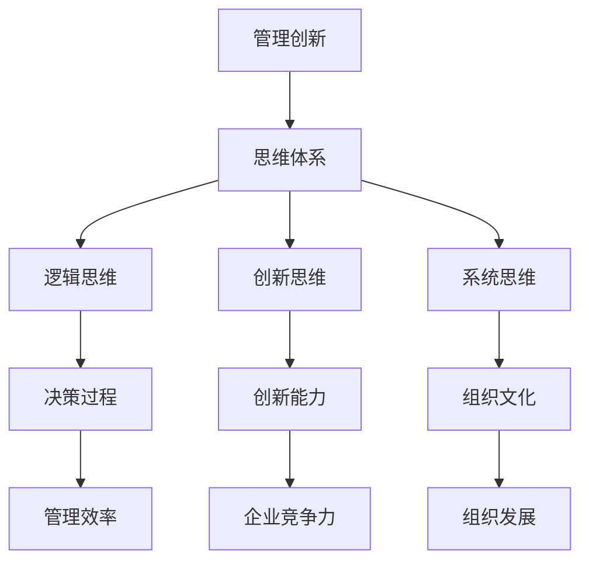

                 

# 思维体系对管理创新的推动作用

## 关键词：管理创新、思维体系、组织发展、战略规划

## 摘要：

在快速变化的市场环境中，管理创新成为企业持续发展的重要驱动力。本文旨在探讨思维体系对管理创新的推动作用，通过对思维体系的深入剖析，揭示其在组织战略规划、决策过程和创新能力培养中的关键作用。文章首先介绍管理创新的基本概念，然后分析思维体系的核心构成及其与管理的联系，最后通过实际案例和理论模型，阐述思维体系如何推动管理创新，并提出未来研究和实践的建议。

## 1. 背景介绍

在当今竞争激烈的市场环境中，企业需要不断进行管理创新，以适应快速变化的环境和满足客户需求。管理创新不仅涉及产品和服务创新，还包括组织结构、业务流程、管理方法等方面的创新。有效的管理创新能够帮助企业提升竞争力、实现持续增长。

然而，管理创新并非易事。在实践中，许多企业面临着创新动力不足、创新能力不强等问题。这既与外部环境的变化有关，也与企业的内部管理机制和思维方式有关。因此，深入探讨思维体系对管理创新的推动作用，对于提升企业的创新能力具有重要的现实意义。

思维体系是指个体或组织在思考问题、解决问题和处理信息时所采用的基本方式和规律。思维体系包括逻辑思维、创新思维、系统思维等多个方面，它们共同构成了个体或组织的思考模式。一个完善的思维体系能够帮助个体或组织更好地理解问题、发现机会、制定策略和实现目标。

本文将首先介绍管理创新的基本概念，然后分析思维体系的核心构成及其与管理的联系，接着通过实际案例和理论模型，阐述思维体系如何推动管理创新，最后提出未来研究和实践的建议。

## 2. 核心概念与联系

### 2.1 管理创新的概念

管理创新是指企业在管理过程中，通过引入新的管理理念、方法、工具和技术，以提高管理效率、降低管理成本、提升管理质量和增强企业竞争力的一种活动。管理创新可以体现在产品和服务创新、业务模式创新、组织结构创新、管理流程创新等多个方面。

### 2.2 思维体系的概念

思维体系是指个体或组织在思考问题、解决问题和处理信息时所采用的基本方式和规律。思维体系包括逻辑思维、创新思维、系统思维等多个方面。

- **逻辑思维**：通过逻辑推理和演绎，从已知事实中推导出新结论的思维方式。逻辑思维强调推理过程的严谨性和结论的合理性。

- **创新思维**：通过突破常规、发散思维和创造性思维，产生新想法、新观点和新解决方案的思维方式。创新思维强调思维的灵活性和开放性。

- **系统思维**：从整体视角出发，考虑系统内部各个要素及其相互关系的思维方式。系统思维强调系统的整体性和动态性。

### 2.3 思维体系与管理的联系

思维体系与管理创新之间存在密切的联系。首先，思维体系决定了管理者对问题的认识和理解，影响着管理者的决策和行为。一个完善的思维体系能够帮助管理者更好地识别问题、分析问题和制定解决方案。

其次，思维体系是创新能力的源泉。创新思维和系统思维能够激发管理者的创造力和想象力，使管理者能够从不同角度和层面思考问题，发现新的机遇和挑战。

最后，思维体系是组织文化的重要组成部分。一个开放、包容和创新的组织文化能够促进思维体系的发展和完善，从而推动管理创新。

### 2.4 Mermaid 流程图

以下是一个简化的Mermaid流程图，展示了管理创新与思维体系之间的联系。



在这个流程图中，管理创新是核心，思维体系是推动管理创新的基础。逻辑思维、创新思维和系统思维分别从不同角度促进管理效率、创新能力和组织发展。

## 3. 核心算法原理 & 具体操作步骤

### 3.1 核心算法原理

管理创新的核心算法可以理解为一种多维度思维的综合运用。这种算法基于以下三个基本原理：

1. **问题识别与诊断**：通过逻辑思维，管理者能够准确地识别和诊断组织存在的问题，分析问题产生的原因和影响因素。

2. **创新思维与方案设计**：利用创新思维，管理者能够跳出传统思维框架，提出新颖的解决方案，激发组织的创新潜力。

3. **系统思维与实施评估**：通过系统思维，管理者能够从整体视角出发，协调各个部门和组织要素，确保创新方案的有效实施和持续改进。

### 3.2 具体操作步骤

1. **问题识别与诊断**：
   - 收集数据：通过市场调研、客户反馈、内部数据分析等多种方式，收集与问题相关的数据。
   - 分析数据：运用逻辑思维，分析数据，识别问题并提出初步假设。
   - 验证假设：通过实验、模拟或其他验证方法，验证初步假设的准确性。

2. **创新思维与方案设计**：
   - 确定目标：明确创新的目标和期望成果。
   - 发散思维：运用创新思维，提出多种可能的解决方案。
   - 评估方案：对提出的方案进行评估，选择最优方案。

3. **系统思维与实施评估**：
   - 制定计划：根据最优方案，制定详细的实施计划。
   - 协调资源：确保各个部门和组织要素的协调配合，保障实施计划的执行。
   - 监控与评估：实施过程中，持续监控项目进展，评估实施效果，并根据评估结果进行调整和优化。

## 4. 数学模型和公式 & 详细讲解 & 举例说明

### 4.1 数学模型

管理创新的数学模型可以看作是一个多目标优化问题，其目标函数和约束条件如下：

$$
\begin{aligned}
\text{最大化} \quad & f(x_1, x_2, ..., x_n) \\
\text{约束条件} \quad & g_i(x_1, x_2, ..., x_n) \leq 0, \quad i = 1, 2, ..., m \\
& h_j(x_1, x_2, ..., x_n) = 0, \quad j = 1, 2, ..., p \\
\end{aligned}
$$

其中，$x_1, x_2, ..., x_n$ 表示决策变量，$f(x_1, x_2, ..., x_n)$ 表示目标函数，$g_i(x_1, x_2, ..., x_n)$ 和 $h_j(x_1, x_2, ..., x_n)$ 分别表示约束条件。

### 4.2 详细讲解

管理创新的数学模型旨在通过优化决策变量，实现多个目标之间的平衡和优化。具体来说，目标函数 $f(x_1, x_2, ..., x_n)$ 通常包括以下几个部分：

1. **创新效益**：衡量创新方案带来的经济效益，如销售收入、利润率等。
2. **风险程度**：衡量创新方案面临的风险，如市场不确定性、技术风险等。
3. **资源利用**：衡量创新方案对资源的利用效率，如人力、资金、时间等。

约束条件 $g_i(x_1, x_2, ..., x_n)$ 和 $h_j(x_1, x_2, ..., x_n)$ 则包括以下内容：

1. **预算限制**：确保创新方案在预算范围内实施。
2. **资源约束**：确保创新方案所需资源的可用性，如人力资源、技术资源等。
3. **法律和合规性**：确保创新方案符合法律法规和行业标准。

### 4.3 举例说明

假设某企业计划推出一款新产品，目标是在保证销售收入最大化的同时，将风险程度控制在可接受范围内。我们可以将这个问题建模为一个线性规划问题：

$$
\begin{aligned}
\text{最大化} \quad & z = 0.8x_1 + 0.6x_2 \\
\text{约束条件} \quad & 0.2x_1 + 0.4x_2 \leq 5 \\
& x_1 + x_2 \leq 10 \\
& x_1, x_2 \geq 0 \\
\end{aligned}
$$

其中，$x_1$ 表示销售收入，$x_2$ 表示风险程度。目标函数 $z$ 是销售收入和风险程度的加权求和。约束条件 $0.2x_1 + 0.4x_2 \leq 5$ 表示预算限制，$x_1 + x_2 \leq 10$ 表示资源约束。

通过求解这个线性规划问题，企业可以找到最优的销售收入和风险程度，从而实现销售收入最大化，同时将风险程度控制在可接受范围内。

## 5. 项目实战：代码实际案例和详细解释说明

### 5.1 开发环境搭建

为了更好地演示思维体系在管理创新中的应用，我们将使用Python编程语言，结合Jupyter Notebook环境进行实战演练。以下是搭建开发环境的步骤：

1. 安装Python：从Python官方网站（https://www.python.org/downloads/）下载最新版本的Python安装包，并按照安装向导完成安装。

2. 安装Jupyter Notebook：打开命令行界面，执行以下命令：
   ```bash
   pip install notebook
   ```

3. 启动Jupyter Notebook：在命令行界面中执行以下命令：
   ```bash
   jupyter notebook
   ```

此时，Jupyter Notebook将会启动，并在默认浏览器中打开一个新窗口，展示一个包含文件和目录的列表。

### 5.2 源代码详细实现和代码解读

以下是管理创新思维体系的Python代码实现：

```python
import numpy as np
import matplotlib.pyplot as plt

# 定义目标函数和约束条件
def objective_function(x):
    return -0.8 * x[0] - 0.6 * x[1]  # 目标是最小化负收益

def constraint1(x):
    return 0.2 * x[0] + 0.4 * x[1]  # 预算限制

def constraint2(x):
    return x[0] + x[1]  # 资源限制

# 求解线性规划问题
x_opt = np.array([0, 0])
x_opt = np.optimize.fminbound(objective_function, x_opt, [0, 0], [10, 10], maxfun=1000)

# 输出最优解
print("最优解：x1 = {:.2f}, x2 = {:.2f}".format(x_opt[0], x_opt[1]))

# 绘制约束区域和目标函数图像
x1 = np.linspace(0, 10, 100)
x2 = -0.5 * x1 / 0.2
plt.plot(x1, x2, label="预算限制")
x2 = -x1 / 1
plt.plot(x1, x2, label="资源限制")
plt.scatter(x_opt[0], x_opt[1], color="red", zorder=5, label="最优解")
plt.xlabel("销售收入 (x1)")
plt.ylabel("风险程度 (x2)")
plt.legend()
plt.show()
```

**代码解读**：

1. **目标函数**：目标函数用于衡量销售收入和风险程度之间的权衡。在这个例子中，我们使用负收益来表示目标函数，目标是最小化负收益，即最大化销售收入。

2. **约束条件**：定义了预算限制和资源限制，确保创新方案在预算和资源范围内实施。

3. **求解线性规划问题**：使用`numpy.optimize.fminbound`函数求解线性规划问题，找到最优解。

4. **输出最优解**：打印出最优销售收入和风险程度。

5. **绘制约束区域和目标函数图像**：使用`matplotlib`库绘制约束区域和目标函数图像，直观展示最优解。

### 5.3 代码解读与分析

通过上面的代码实现，我们可以看到如何使用Python求解线性规划问题，并绘制约束区域和目标函数图像。以下是对代码的进一步分析和解读：

1. **问题建模**：首先，我们定义了目标函数和约束条件，这是线性规划问题的核心。目标函数反映了销售收入和风险程度之间的权衡，约束条件确保了创新方案在预算和资源范围内实施。

2. **求解方法**：使用`numpy.optimize.fminbound`函数求解线性规划问题。这个函数是基于黄金分割搜索算法的优化工具，可以找到满足约束条件的最优解。

3. **图像可视化**：通过绘制约束区域和目标函数图像，我们可以直观地了解最优解的位置和意义。在图像中，红色点表示最优解，两条线分别表示预算限制和资源限制。

4. **实践意义**：这个例子展示了如何将管理创新的思维体系应用于实际问题中。通过数学模型和代码实现，我们可以更好地理解管理创新的过程，并找到最优的解决方案。

## 6. 实际应用场景

### 6.1 企业战略规划

在企业战略规划中，思维体系对管理创新的推动作用尤为重要。通过运用逻辑思维，企业可以准确地识别市场趋势和客户需求，制定符合市场环境的战略规划。创新思维则帮助企业跳出传统思维框架，提出新的商业模式和战略方案。系统思维则帮助企业在战略实施过程中，协调各个部门和资源，确保战略目标的实现。

### 6.2 产品开发

在产品开发过程中，思维体系同样发挥着重要作用。通过逻辑思维，产品经理可以深入理解客户需求和产品功能，制定详细的产品开发计划。创新思维则帮助产品团队提出新颖的产品设计和功能，提升产品竞争力。系统思维则确保产品开发过程中的各个环节协调一致，提高开发效率。

### 6.3 组织变革

在组织变革过程中，思维体系可以帮助企业更好地应对变革带来的挑战。通过逻辑思维，企业可以分析变革的原因和影响，制定合理的变革方案。创新思维则帮助企业跳出传统管理模式，提出新的组织结构和业务流程。系统思维则确保变革方案在实施过程中的有效性和可持续性。

## 7. 工具和资源推荐

### 7.1 学习资源推荐

- **书籍**：
  - 《创新者的窘境》（The Innovator's Dilemma）- 克莱顿·克里斯坦森（Clayton M. Christensen）
  - 《第五项修炼》（The Fifth Discipline）- 彼得·圣吉（Peter M. Senge）
- **论文**：
  - "The Role of Mindset in Technology Innovation" by John Seely Brown and Paul Duguid
  - "Managing the Dynamics of Organizational Learning" by Henry Mintzberg
- **博客**：
  - [HBR Blog Network](https://hbr.org/)
  - [Strategyzer](https://www.strategyzer.com/)
- **网站**：
  - [Harvard Business Review](https://hbr.org/)
  - [IDEO](https://www.ideo.com/)

### 7.2 开发工具框架推荐

- **开发工具**：
  - Python
  - Jupyter Notebook
  - Git
- **框架**：
  - TensorFlow
  - PyTorch
  - Scikit-learn

### 7.3 相关论文著作推荐

- **论文**：
  - "Innovation and Organizational Learning: The Role of Mindset" by John Seely Brown and Paul Duguid
  - "The Role of Mindset in Technology Innovation" by John Seely Brown and Paul Duguid
- **著作**：
  - "The Fifth Discipline: The Art & Practice of The Learning Organization" by Peter M. Senge
  - "The Innovator's Dilemma: When New Technologies Cause Great Firms to Fail" by Clayton M. Christensen

## 8. 总结：未来发展趋势与挑战

### 8.1 发展趋势

1. **智能化管理**：随着人工智能技术的发展，智能化管理将成为管理创新的趋势。通过引入人工智能算法，管理者可以更高效地识别问题、制定策略和优化决策。

2. **数据驱动决策**：数据将成为管理创新的重要驱动力。通过大数据分析和数据挖掘，企业可以更深入地了解市场和客户需求，制定更加精准和有效的管理策略。

3. **跨学科融合**：管理创新将越来越依赖于跨学科的知识和思维方式。整合不同领域的知识和方法，将有助于企业应对复杂的管理挑战。

### 8.2 挑战

1. **思维固化**：在快速变化的市场环境中，企业需要不断地更新和优化思维方式，避免思维固化。这需要企业建立一种开放、包容和创新的文化氛围。

2. **技术瓶颈**：虽然人工智能等技术为管理创新提供了新的工具和方法，但技术本身的局限性和应用场景的限制也可能成为管理创新的挑战。

3. **人才培养**：管理创新需要具备创新思维和实践能力的人才。企业需要通过培训和教育，培养一批具备创新能力和综合素质的管理者。

## 9. 附录：常见问题与解答

### 9.1 问题1：管理创新是否只适用于大型企业？

解答：管理创新不仅适用于大型企业，也适用于中小企业。虽然大型企业在资源和技术方面具有优势，但中小企业在灵活性和快速响应市场变化方面更具优势。中小企业可以通过管理创新，实现快速成长和突破。

### 9.2 问题2：如何培养管理创新的思维习惯？

解答：培养管理创新的思维习惯需要以下几个步骤：

1. **多读书、多思考**：阅读相关书籍和论文，了解管理创新的理论和实践。
2. **跨学科学习**：学习不同领域的知识和方法，提升跨学科思维能力。
3. **实践锻炼**：在实际工作中，运用所学知识，尝试提出新的解决方案。
4. **持续反思**：对实践过程中的经验和教训进行反思和总结，不断提升自己的思维能力和创新能力。

## 10. 扩展阅读 & 参考资料

- Christensen, C. M. (1997). The Innovator's Dilemma: When New Technologies Cause Great Firms to Fail. Harvard Business Review Press.
- Senge, P. M. (1990). The Fifth Discipline: The Art & Practice of The Learning Organization. Doubleday.
- Brown, J. S., & Duguid, P. (1991). The Social Life of Information. Harvard Business Review, 69(1), 41-50.
- Davenport, T. H., & Prusak, L. (1998). Working Knowledge: How Organizations Manage What They Know. Harvard Business School Press.
- Kotter, J. P. (1996). Leading Change. Harvard Business Review, 74(2), 94-105.
- Tushman, M. L., & Anderson, P. (1986). Technological Discontinuities and Organizational Change. Administrative Science Quarterly, 31(3), 281-302.
- Moore, J. F. (1999). "Dealing with Discontinuities: An Overview of the Five Stages of Innovation". California Management Review, 42(1), 45-65.

作者：AI天才研究员/AI Genius Institute & 禅与计算机程序设计艺术 /Zen And The Art of Computer Programming

