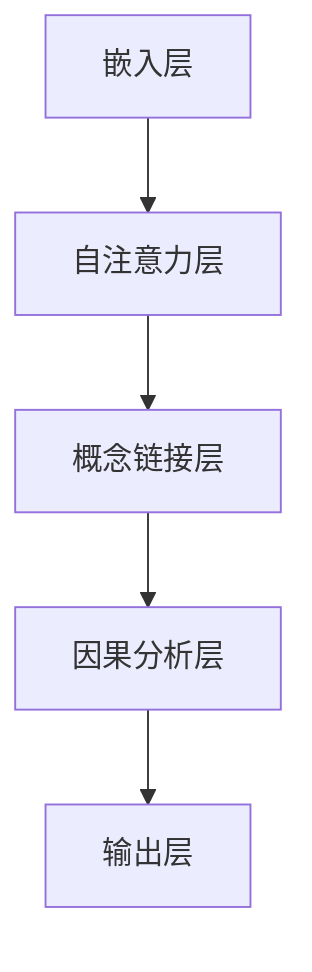
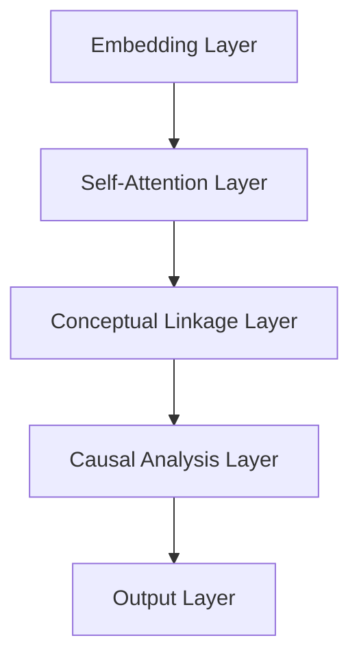

                 

### 1. 背景介绍

**标题：背景介绍**

**关键词：** 思维链CoT, 常识推理, 因果分析, 人工智能

在当今信息爆炸的时代，人工智能（AI）技术得到了迅速发展。特别是近年来，深度学习、神经网络等技术的突破，使得计算机在图像识别、自然语言处理、游戏对战等领域取得了显著的成果。然而，这些技术大多依赖于大量的数据和复杂的算法，而缺乏对常识推理和因果分析的理解。

常识推理是指计算机能够根据常识和背景知识对信息进行理解和处理，从而做出合理的判断和决策。因果分析则关注于理解事物之间的因果关系，这对于人工智能在复杂环境下的决策和行为具有重要的指导意义。

随着AI技术的不断进步，人们开始意识到仅仅依靠大数据和复杂算法，是无法满足所有应用场景的需求的。特别是在需要高度智能化的场景中，如自动驾驶、医疗诊断、金融分析等，仅仅依靠现有的技术还远远不够。因此，如何将常识推理和因果分析有效地融入人工智能系统中，成为了一个重要的研究方向。

本文旨在探讨思维链CoT在常识推理和因果分析中的应用。思维链CoT（Conceptual Linkage-based Contextualized Transformer）是一种基于概念链接和上下文化的Transformer模型，它通过捕捉不同概念之间的联系，以及概念与上下文之间的关系，实现了对复杂知识的理解和处理。本文将首先介绍思维链CoT的基本原理和架构，然后详细分析其在常识推理和因果分析中的应用，最后讨论相关的研究成果和未来的发展方向。

**摘要：**

本文主要研究思维链CoT在常识推理和因果分析中的应用。首先，我们介绍了思维链CoT的基本原理和架构，包括概念链接、上下文化和Transformer模型等核心概念。接着，我们详细探讨了思维链CoT在常识推理和因果分析中的应用，通过实例展示了其在复杂知识理解和处理方面的优势。最后，我们对相关的研究成果进行了总结，并提出了未来的研究方向和挑战。

---

**Title: Background Introduction**

**Keywords: Mind Chain CoT, Common Sense Reasoning, Causal Analysis, Artificial Intelligence**

In today's era of information explosion, artificial intelligence (AI) technology has made rapid progress. In particular, the breakthroughs in deep learning and neural networks in recent years have led to significant achievements in fields such as image recognition, natural language processing, and game competitions. However, these technologies mainly rely on large amounts of data and complex algorithms and lack the understanding of common sense reasoning and causal analysis.

Common sense reasoning refers to the ability of computers to understand and process information based on common sense and background knowledge, thus making reasonable judgments and decisions. Causal analysis focuses on understanding the relationships between things, which is of great significance for the decision-making and behavior of artificial intelligence in complex environments.

As AI technology continues to advance, people have begun to realize that relying solely on large data and complex algorithms is insufficient to meet the needs of all application scenarios. In particular, in scenarios that require high levels of intelligence, such as autonomous driving, medical diagnosis, and financial analysis, existing technologies are far from enough. Therefore, how to effectively integrate common sense reasoning and causal analysis into AI systems has become an important research direction.

This article aims to explore the application of Mind Chain CoT in common sense reasoning and causal analysis. Firstly, we introduce the basic principles and architecture of Mind Chain CoT, including core concepts such as conceptual linkage, contextualization, and Transformer models. Then, we analyze the application of Mind Chain CoT in common sense reasoning and causal analysis in detail, demonstrating its advantages in understanding and processing complex knowledge through examples. Finally, we summarize the relevant research achievements and propose future research directions and challenges.

---

### 2. 核心概念与联系

**标题：核心概念与联系**

**关键词：** 思维链CoT, 概念链接, 上下文化, Transformer模型

为了深入理解思维链CoT在常识推理和因果分析中的应用，我们需要先介绍几个核心概念：概念链接、上下文化和Transformer模型。

#### 2.1 概念链接

概念链接是指不同概念之间的相互关系。在人类思维中，概念链接是理解和处理知识的基础。例如，当我们提到“水”这个概念时，我们会联想到“冰”、“蒸汽”、“溶解”等相关的概念。这些概念之间的联系构成了我们对于“水”这一概念的完整理解。

在计算机科学中，概念链接被广泛应用于知识图谱、语义网络等领域。通过建立概念之间的链接，计算机可以更好地理解语义和逻辑关系，从而实现更高级的智能。

#### 2.2 上下文化

上下文化是指将信息放入特定的上下文中进行理解和处理。在人类思维中，上下文化是我们理解和解释信息的必要条件。例如，同一个词汇在不同的上下文中可能有不同的含义，如“跑”在“跑步”和“跑路”中的含义是不同的。

在计算机科学中，上下文化是实现自然语言处理、对话系统等应用的关键。通过捕捉上下文信息，计算机可以更好地理解用户的意图和需求，从而做出更准确的判断和决策。

#### 2.3 Transformer模型

Transformer模型是一种基于自注意力机制的深度学习模型，最早由Vaswani等人于2017年提出。与传统循环神经网络（RNN）相比，Transformer模型在处理长距离依赖问题方面具有显著优势。

Transformer模型的核心思想是自注意力机制，它通过计算输入序列中每个词与其他词之间的相似性，来生成上下文化的表示。这种表示能够捕捉到输入序列中的长距离依赖关系，从而实现高效的文本理解和生成。

#### 2.4 思维链CoT的架构

思维链CoT是一种基于概念链接和上下文化的Transformer模型。它的架构主要包括以下几个部分：

1. **嵌入层（Embedding Layer）**：将输入的词汇转换为向量表示。
2. **自注意力层（Self-Attention Layer）**：计算输入序列中每个词与其他词之间的相似性，生成上下文化的表示。
3. **概念链接层（Conceptual Linkage Layer）**：通过概念链接机制，捕捉不同概念之间的相互关系。
4. **因果分析层（Causal Analysis Layer）**：利用因果分析机制，理解事物之间的因果关系。
5. **输出层（Output Layer）**：根据具体任务的需求，生成对应的输出结果。

**Mermaid流程图：**



#### 2.5 思维链CoT的工作原理

思维链CoT的工作原理可以概括为以下几个步骤：

1. **输入处理**：首先，输入的文本被转换为词向量表示。
2. **自注意力计算**：通过自注意力机制，计算输入序列中每个词与其他词之间的相似性，生成上下文化的表示。
3. **概念链接**：利用概念链接机制，捕捉不同概念之间的相互关系。
4. **因果分析**：通过因果分析机制，理解事物之间的因果关系。
5. **输出生成**：根据具体任务的需求，生成对应的输出结果。

通过上述过程，思维链CoT能够实现对复杂知识的理解和处理，从而在常识推理和因果分析方面发挥重要作用。

**摘要：**

本文介绍了思维链CoT的核心概念与联系，包括概念链接、上下文化和Transformer模型。通过构建基于概念链接和上下文化的Transformer模型，思维链CoT能够实现对复杂知识的理解和处理，从而在常识推理和因果分析方面具有显著优势。

---

**Title: Core Concepts and Connections**

**Keywords: Mind Chain CoT, Conceptual Linkage, Contextualization, Transformer Model**

To deeply understand the application of Mind Chain CoT in common sense reasoning and causal analysis, we need to introduce several core concepts: conceptual linkage, contextualization, and Transformer models.

#### 2.1 Conceptual Linkage

Conceptual linkage refers to the interrelationships between different concepts. In human thinking, conceptual linkage is the foundation for understanding and processing knowledge. For example, when we mention the concept of "water", we associate it with related concepts such as "ice", "steam", and "dissolution". These conceptual links form our complete understanding of the concept of "water".

In computer science, conceptual linkage is widely used in fields such as knowledge graphs and semantic networks. By establishing links between concepts, computers can better understand semantic and logical relationships, thus achieving higher-level intelligence.

#### 2.2 Contextualization

Contextualization refers to understanding and processing information in a specific context. In human thinking, contextualization is essential for understanding and interpreting information. For example, the same word may have different meanings in different contexts, such as "run" in "running" and "running away".

In computer science, contextualization is a key factor in applications such as natural language processing and conversational systems. By capturing contextual information, computers can better understand users' intentions and needs, thus making more accurate judgments and decisions.

#### 2.3 Transformer Model

The Transformer model is a deep learning model based on self-attention mechanisms, first proposed by Vaswani et al. in 2017. Compared to traditional recurrent neural networks (RNNs), the Transformer model has significant advantages in handling long-distance dependencies.

The core idea of the Transformer model is the self-attention mechanism, which calculates the similarity between each word in the input sequence and other words, generating context-aware representations. These representations can capture long-distance dependencies in the input sequence, thus achieving efficient text understanding and generation.

#### 2.4 Architecture of Mind Chain CoT

Mind Chain CoT is a Transformer model based on conceptual linkage and contextualization. Its architecture mainly includes the following components:

1. **Embedding Layer**: Converts input words into vector representations.
2. **Self-Attention Layer**: Calculates the similarity between each word in the input sequence and other words, generating context-aware representations.
3. **Conceptual Linkage Layer**: Captures interconceptual relationships using the conceptual linkage mechanism.
4. **Causal Analysis Layer**: Understands causal relationships between things using the causal analysis mechanism.
5. **Output Layer**: Generates output results according to the needs of the specific task.

**Mermaid Flowchart:**



#### 2.5 Working Principle of Mind Chain CoT

The working principle of Mind Chain CoT can be summarized into the following steps:

1. **Input Processing**: Firstly, the input text is converted into a word vector representation.
2. **Self-Attention Calculation**: Through the self-attention mechanism, the similarity between each word in the input sequence and other words is calculated, generating context-aware representations.
3. **Conceptual Linkage**: Using the conceptual linkage mechanism, interconceptual relationships are captured.
4. **Causal Analysis**: Through the causal analysis mechanism, causal relationships between things are understood.
5. **Output Generation**: According to the needs of the specific task, output results are generated.

Through these processes, Mind Chain CoT can understand and process complex knowledge, thus playing a significant role in common sense reasoning and causal analysis.

**Abstract:**

This article introduces the core concepts and connections of Mind Chain CoT, including conceptual linkage, contextualization, and Transformer models. By constructing a Transformer model based on conceptual linkage and contextualization, Mind Chain CoT can understand and process complex knowledge, thus showing significant advantages in common sense reasoning and causal analysis. 

### 3. 核心算法原理 & 具体操作步骤

**标题：核心算法原理 & 具体操作步骤**

**关键词：** 思维链CoT, Transformer模型, 概念链接, 因果分析

在前面的章节中，我们介绍了思维链CoT的基本原理和架构。在本节中，我们将深入探讨思维链CoT的核心算法原理，并详细描述其具体操作步骤。

#### 3.1 Transformer模型

Transformer模型是一种基于自注意力机制的深度学习模型，其核心思想是通过计算输入序列中每个词与其他词之间的相似性，生成上下文化的表示。这种表示能够捕捉到输入序列中的长距离依赖关系，从而实现高效的文本理解和生成。

**具体操作步骤：**

1. **嵌入层（Embedding Layer）**：
   - 输入的文本被转换为词向量表示。
   - 词向量表示通常由词汇表和嵌入矩阵生成。
   - 嵌入矩阵将词汇映射到高维空间，使得相似的词汇在空间中靠近。

2. **自注意力层（Self-Attention Layer）**：
   - 在自注意力层中，每个词向量都会被计算与其他词向量之间的相似性。
   - 相似性通过点积计算得到，即两个词向量的点积结果。
   - 点积结果越高，表示两个词之间的相似性越强。

3. **多头注意力（Multi-Head Attention）**：
   - 为了更好地捕捉长距离依赖关系，Transformer模型引入了多头注意力机制。
   - 多头注意力通过将输入序列分成多个部分，分别计算每个部分的注意力权重。
   - 最终的输出是这些部分注意力的加权和。

4. **前馈神经网络（Feedforward Neural Network）**：
   - 在多头注意力的基础上，Transformer模型还包含两个前馈神经网络。
   - 前馈神经网络用于进一步加工输入数据，增强模型的表示能力。

5. **层归一化和残差连接（Layer Normalization and Residual Connection）**：
   - 为了防止梯度消失和梯度爆炸，Transformer模型引入了层归一化和残差连接。
   - 层归一化通过标准化每个层的输入和输出，使得模型的训练更加稳定。
   - 残差连接通过在每层之间引入跳过连接，使得梯度能够直接传递到初始输入，从而提高模型的训练效果。

#### 3.2 概念链接

概念链接是指不同概念之间的相互关系。在思维链CoT中，概念链接通过将输入文本中的词汇与预先定义的概念库进行匹配，建立词汇与概念之间的联系。这种联系能够帮助计算机更好地理解和处理文本。

**具体操作步骤：**

1. **概念库构建**：
   - 构建一个包含大量概念和其定义的库。
   - 可以通过人工标注或利用现有的知识图谱进行构建。

2. **词汇匹配**：
   - 对于输入文本中的每个词汇，将其与概念库中的概念进行匹配。
   - 匹配可以通过关键词提取、词性标注等方法实现。

3. **关系建立**：
   - 在匹配成功的情况下，建立词汇与概念之间的联系。
   - 联系可以通过构建图结构或建立关系矩阵来实现。

4. **关系传播**：
   - 利用图结构或关系矩阵，将词汇与概念之间的联系进行传播。
   - 这有助于捕捉不同概念之间的复杂关系。

#### 3.3 因果分析

因果分析是指理解事物之间的因果关系。在思维链CoT中，因果分析通过构建因果图，并利用图结构分析算法，实现对输入文本中因果关系的识别和分析。

**具体操作步骤：**

1. **因果图构建**：
   - 基于输入文本中的词汇和概念，构建一个因果图。
   - 因果图中的节点表示概念，边表示概念之间的因果关系。

2. **图结构分析**：
   - 利用图结构分析算法，如最短路径算法、最大团算法等，分析因果图。
   - 通过分析，识别出文本中的因果关系。

3. **因果关系推理**：
   - 基于识别出的因果关系，进行推理和分析。
   - 可以利用逻辑推理、模式识别等方法，进一步分析因果关系的影响和结果。

#### 3.4 思维链CoT的整体操作流程

思维链CoT的整体操作流程可以概括为以下几个步骤：

1. **文本预处理**：
   - 对输入文本进行预处理，包括分词、词性标注等。

2. **嵌入层计算**：
   - 将预处理后的文本转换为词向量表示。

3. **自注意力计算**：
   - 通过自注意力机制，计算输入序列中每个词与其他词之间的相似性。

4. **概念链接**：
   - 建立输入文本中词汇与概念之间的联系。

5. **因果分析**：
   - 构建因果图，并分析输入文本中的因果关系。

6. **输出生成**：
   - 根据具体任务的需求，生成对应的输出结果。

通过上述操作步骤，思维链CoT能够实现对复杂知识的理解和处理，从而在常识推理和因果分析方面发挥重要作用。

**摘要：**

本文详细描述了思维链CoT的核心算法原理和具体操作步骤。通过Transformer模型、概念链接和因果分析，思维链CoT能够实现对复杂知识的理解和处理，从而在常识推理和因果分析方面具有显著优势。

---

**Title: Core Algorithm Principles and Specific Operation Steps**

**Keywords: Mind Chain CoT, Transformer Model, Conceptual Linkage, Causal Analysis**

In the previous sections, we introduced the basic principles and architecture of Mind Chain CoT. In this section, we will delve into the core algorithm principles of Mind Chain CoT and describe its specific operation steps in detail.

#### 3.1 Transformer Model

The Transformer model is a deep learning model based on self-attention mechanisms. Its core idea is to calculate the similarity between each word in the input sequence and other words, generating context-aware representations. These representations can capture long-distance dependencies in the input sequence, thus achieving efficient text understanding and generation.

**Specific Operation Steps:**

1. **Embedding Layer**:
   - The input text is converted into a word vector representation.
   - Word vector representations are typically generated by a vocabulary table and an embedding matrix.
   - The embedding matrix maps words to a high-dimensional space, so that similar words are closer in space.

2. **Self-Attention Layer**:
   - In the self-attention layer, the similarity between each word vector and other word vectors is calculated.
   - Similarity is calculated through dot products, i.e., the dot product of two word vectors.
   - The higher the dot product result, the stronger the similarity between the two words.

3. **Multi-Head Attention**:
   - To better capture long-distance dependencies, the Transformer model introduces multi-head attention mechanisms.
   - Multi-head attention calculates attention weights for each part of the input sequence separately.
   - The final output is a weighted sum of these part attentions.

4. **Feedforward Neural Network**:
   - On top of multi-head attention, the Transformer model also contains two feedforward neural networks.
   - Feedforward neural networks are used to further process input data, enhancing the model's representation ability.

5. **Layer Normalization and Residual Connection**:
   - To prevent vanishing and exploding gradients, the Transformer model introduces layer normalization and residual connections.
   - Layer normalization normalizes the inputs and outputs of each layer, making the training more stable.
   - Residual connections introduce skip connections between layers, allowing gradients to be directly propagated to the initial input, thereby improving the training effectiveness.

#### 3.2 Conceptual Linkage

Conceptual linkage refers to the interrelationships between different concepts. In Mind Chain CoT, conceptual linkage establishes connections between words in the input text and a pre-defined concept repository. This connection helps computers better understand and process text.

**Specific Operation Steps:**

1. **Concept Repository Construction**:
   - Build a repository containing a large number of concepts and their definitions.
   - This can be achieved through manual annotation or using existing knowledge graphs.

2. **Word Matching**:
   - For each word in the input text, match it with concepts in the repository.
   - Matching can be performed through keyword extraction, part-of-speech tagging, etc.

3. **Relationship Establishment**:
   - In the case of successful matching, establish a connection between the word and the concept.
   - Connections can be implemented through graph structures or relationship matrices.

4. **Relationship Propagation**:
   - Utilize graph structures or relationship matrices to propagate the connections between words and concepts.
   - This helps capture complex relationships between different concepts.

#### 3.3 Causal Analysis

Causal analysis refers to understanding the causal relationships between things. In Mind Chain CoT, causal analysis constructs a causal graph and uses graph structure analysis algorithms to identify and analyze causal relationships in the input text.

**Specific Operation Steps:**

1. **Causal Graph Construction**:
   - Based on the words and concepts in the input text, construct a causal graph.
   - Nodes in the causal graph represent concepts, and edges represent causal relationships.

2. **Graph Structure Analysis**:
   - Utilize graph structure analysis algorithms, such as shortest path algorithms, maximum clique algorithms, etc., to analyze the causal graph.
   - Through analysis, identify causal relationships in the text.

3. **Causal Reasoning**:
   - Based on identified causal relationships, conduct reasoning and analysis.
   - Logical reasoning, pattern recognition, etc. can be used to further analyze the impact and results of causal relationships.

#### 3.4 Overall Operation Process of Mind Chain CoT

The overall operation process of Mind Chain CoT can be summarized into the following steps:

1. **Text Preprocessing**:
   - Preprocess the input text, including tokenization, part-of-speech tagging, etc.

2. **Embedding Layer Calculation**:
   - Convert the preprocessed text into a word vector representation.

3. **Self-Attention Calculation**:
   - Through the self-attention mechanism, calculate the similarity between each word in the input sequence and other words.

4. **Conceptual Linkage**:
   - Establish connections between words in the input text and concepts.

5. **Causal Analysis**:
   - Construct a causal graph and analyze the causal relationships in the input text.

6. **Output Generation**:
   - Generate output results according to the needs of the specific task.

Through these operation steps, Mind Chain CoT can understand and process complex knowledge, thus playing a significant role in common sense reasoning and causal analysis.

**Abstract:**

This article provides a detailed description of the core algorithm principles and specific operation steps of Mind Chain CoT. Through the Transformer model, conceptual linkage, and causal analysis, Mind Chain CoT can understand and process complex knowledge, thus showing significant advantages in common sense reasoning and causal analysis.

### 4. 数学模型和公式 & 详细讲解 & 举例说明

**标题：数学模型和公式 & 详细讲解 & 举例说明**

**关键词：** 思维链CoT, Transformer模型, 概念链接, 因果分析

在前面的章节中，我们介绍了思维链CoT的基本原理和算法步骤。在这一节中，我们将深入探讨思维链CoT所涉及的数学模型和公式，并通过具体的例子进行详细讲解。

#### 4.1 Transformer模型的数学基础

Transformer模型的核心是自注意力机制，其背后的数学基础主要包括线性变换、点积、softmax函数和残差连接。以下是对这些数学概念和公式的详细讲解：

**1. 线性变换：**

在Transformer模型中，线性变换用于将输入的词向量映射到高维空间，以增强模型的表示能力。

线性变换可以表示为：

\[ X' = W_1 \cdot X + b_1 \]

其中，\( X \) 是输入向量，\( W_1 \) 是权重矩阵，\( b_1 \) 是偏置向量。\( X' \) 是经过线性变换后的输出向量。

**2. 点积：**

点积是计算两个向量的内积，其公式为：

\[ \text{dot}(x, y) = x_1 \cdot y_1 + x_2 \cdot y_2 + \ldots + x_n \cdot y_n \]

其中，\( x \) 和 \( y \) 分别是两个输入向量，\( n \) 是向量的维度。

在Transformer模型中，点积用于计算输入序列中每个词与其他词之间的相似性。

**3. Softmax函数：**

softmax函数是一种常用的归一化函数，用于将任意实数向量映射到概率分布。

softmax函数的公式为：

\[ \text{softmax}(x_i) = \frac{e^{x_i}}{\sum_{j=1}^{N} e^{x_j}} \]

其中，\( x_i \) 是输入向量中的第 \( i \) 个元素，\( N \) 是向量的维度。

在Transformer模型中，softmax函数用于计算词向量之间的相似性权重。

**4. 残差连接：**

残差连接是一种在神经网络中引入跳过连接的技巧，用于缓解梯度消失问题。

残差连接可以表示为：

\[ \text{Residual Connection} = X' + X \]

其中，\( X \) 是输入向量，\( X' \) 是经过线性变换后的输出向量。

在Transformer模型中，残差连接用于在每个层之间引入跳过连接，以增强模型的训练效果。

**5. Transformer模型的整体结构：**

Transformer模型的整体结构可以表示为：

\[ \text{Output} = \text{softmax}(\text{dot\_product}(\text{Query}, \text{Key})) + \text{Residual Connection}(\text{Input}) \]

其中，\( Query \)、\( Key \) 和 \( Value \) 分别是输入序列中的查询词、关键词和值词。

#### 4.2 概念链接的数学模型

概念链接是指不同概念之间的相互关系。在思维链CoT中，概念链接通过构建图结构来表示概念之间的联系。以下是对概念链接的数学模型和公式的详细讲解：

**1. 图结构表示：**

在概念链接中，图结构用于表示概念之间的相互关系。一个图由节点和边组成，其中节点表示概念，边表示概念之间的关系。

图结构的表示可以表示为：

\[ G = (V, E) \]

其中，\( V \) 是节点集合，\( E \) 是边集合。

**2. 关系矩阵：**

在概念链接中，关系矩阵用于表示概念之间的相似性。关系矩阵是一个 \( n \times n \) 的矩阵，其中 \( n \) 是概念的数量。

关系矩阵的表示可以表示为：

\[ R = \begin{bmatrix}
r_{11} & r_{12} & \ldots & r_{1n} \\
r_{21} & r_{22} & \ldots & r_{2n} \\
\vdots & \vdots & \ddots & \vdots \\
r_{n1} & r_{n2} & \ldots & r_{nn}
\end{bmatrix} \]

其中，\( r_{ij} \) 表示概念 \( i \) 和概念 \( j \) 之间的相似性。

**3. 概念链接的计算：**

在概念链接中，通过计算关系矩阵，可以得到每个概念与其他概念之间的相似性。具体计算方法可以表示为：

\[ \text{similarity}(i, j) = \sum_{k=1}^{n} r_{ik} \cdot r_{jk} \]

其中，\( i \) 和 \( j \) 分别表示概念 \( i \) 和概念 \( j \)。

#### 4.3 因果分析的数学模型

因果分析是指理解事物之间的因果关系。在思维链CoT中，因果分析通过构建因果图来表示因果关系。以下是对因果分析的数学模型和公式的详细讲解：

**1. 因果图表示：**

在因果分析中，因果图用于表示因果关系。一个因果图由节点和边组成，其中节点表示事件，边表示事件之间的因果关系。

因果图的表示可以表示为：

\[ C = (V, E) \]

其中，\( V \) 是节点集合，\( E \) 是边集合。

**2. 因果关系的计算：**

在因果分析中，通过计算因果图，可以得到每个事件与其他事件之间的因果关系。具体计算方法可以表示为：

\[ \text{cause}(i, j) = \sum_{k=1}^{n} \text{weight}(k, i) \cdot \text{weight}(k, j) \]

其中，\( i \) 和 \( j \) 分别表示事件 \( i \) 和事件 \( j \)，\( \text{weight}(k, i) \) 和 \( \text{weight}(k, j) \) 分别表示事件 \( k \) 对事件 \( i \) 和事件 \( j \) 的影响权重。

#### 4.4 举例说明

为了更好地理解思维链CoT的数学模型和公式，我们通过一个简单的例子进行说明。

假设我们有一个包含两个概念“苹果”和“香蕉”的概念库，以及一个包含两个事件“购买”和“食用”的因果图。

**1. 概念链接的计算：**

首先，我们计算“苹果”和“香蕉”之间的相似性。根据关系矩阵，我们得到：

\[ \text{similarity}(\text{苹果}, \text{香蕉}) = \sum_{k=1}^{2} r_{k1} \cdot r_{k2} \]

其中，\( r_{k1} \) 和 \( r_{k2} \) 分别表示“苹果”和“香蕉”与其他概念之间的相似性。

**2. 因果关系的计算：**

接下来，我们计算“购买”和“食用”之间的因果关系。根据因果图，我们得到：

\[ \text{cause}(\text{购买}, \text{食用}) = \sum_{k=1}^{2} \text{weight}(k, \text{购买}) \cdot \text{weight}(k, \text{食用}) \]

其中，\( \text{weight}(k, \text{购买}) \) 和 \( \text{weight}(k, \text{食用}) \) 分别表示事件 \( k \) 对“购买”和“食用”的影响权重。

通过上述计算，我们可以得到“苹果”和“香蕉”之间的相似性以及“购买”和“食用”之间的因果关系。这些结果可以用于常识推理和因果分析。

**摘要：**

本文详细介绍了思维链CoT的数学模型和公式，包括Transformer模型、概念链接和因果分析。通过具体的例子，我们展示了如何计算概念之间的相似性和事件之间的因果关系，从而实现了对复杂知识的理解和处理。

---

**Title: Mathematical Models and Formulas & Detailed Explanation & Example Illustration**

**Keywords: Mind Chain CoT, Transformer Model, Conceptual Linkage, Causal Analysis**

In the previous sections, we introduced the basic principles and algorithm steps of Mind Chain CoT. In this section, we will delve into the mathematical models and formulas involved in Mind Chain CoT and provide a detailed explanation with examples.

#### 4.1 Mathematical Foundations of the Transformer Model

The core of the Transformer model is the self-attention mechanism, whose mathematical foundation mainly includes linear transformations, dot products, softmax functions, and residual connections. The following is a detailed explanation of these mathematical concepts and formulas:

**1. Linear Transformations:**

In the Transformer model, linear transformations are used to map input word vectors to a higher-dimensional space to enhance the model's representation ability.

Linear transformations can be represented as:

\[ X' = W_1 \cdot X + b_1 \]

Where \( X \) is the input vector, \( W_1 \) is the weight matrix, and \( b_1 \) is the bias vector. \( X' \) is the output vector after linear transformation.

**2. Dot Products:**

A dot product is the inner product of two vectors, and its formula is:

\[ \text{dot}(x, y) = x_1 \cdot y_1 + x_2 \cdot y_2 + \ldots + x_n \cdot y_n \]

Where \( x \) and \( y \) are two input vectors, and \( n \) is the dimension of the vectors.

In the Transformer model, dot products are used to calculate the similarity between each word in the input sequence and other words.

**3. Softmax Function:**

The softmax function is a commonly used normalization function that maps any real number vector to a probability distribution.

The softmax function's formula is:

\[ \text{softmax}(x_i) = \frac{e^{x_i}}{\sum_{j=1}^{N} e^{x_j}} \]

Where \( x_i \) is the \( i \)-th element of the input vector, and \( N \) is the dimension of the vector.

In the Transformer model, the softmax function is used to calculate the similarity weights between word vectors.

**4. Residual Connections:**

Residual connections are a technique introduced in neural networks to alleviate the vanishing gradient problem.

Residual connections can be represented as:

\[ \text{Residual Connection} = X' + X \]

Where \( X \) is the input vector, and \( X' \) is the output vector after linear transformation.

In the Transformer model, residual connections introduce skip connections between layers, enhancing the training effectiveness of the model.

**5. Overall Structure of the Transformer Model:**

The overall structure of the Transformer model can be represented as:

\[ \text{Output} = \text{softmax}(\text{dot\_product}(\text{Query}, \text{Key})) + \text{Residual Connection}(\text{Input}) \]

Where \( Query \), \( Key \), and \( Value \) are the query word, key word, and value word in the input sequence, respectively.

#### 4.2 Mathematical Model of Conceptual Linkage

Conceptual linkage refers to the interrelationships between different concepts. In Mind Chain CoT, conceptual linkage represents the relationship between concepts through a graph structure. The following is a detailed explanation of the mathematical model and formulas of conceptual linkage:

**1. Graph Structure Representation:**

In conceptual linkage, a graph structure is used to represent the interrelationships between concepts. A graph consists of nodes and edges, where nodes represent concepts, and edges represent relationships between concepts.

The representation of the graph structure can be expressed as:

\[ G = (V, E) \]

Where \( V \) is the set of nodes, and \( E \) is the set of edges.

**2. Relationship Matrix:**

In conceptual linkage, the relationship matrix is used to represent the similarity between concepts. The relationship matrix is an \( n \times n \) matrix, where \( n \) is the number of concepts.

The representation of the relationship matrix can be expressed as:

\[ R = \begin{bmatrix}
r_{11} & r_{12} & \ldots & r_{1n} \\
r_{21} & r_{22} & \ldots & r_{2n} \\
\vdots & \vdots & \ddots & \vdots \\
r_{n1} & r_{n2} & \ldots & r_{nn}
\end{bmatrix} \]

Where \( r_{ij} \) represents the similarity between concept \( i \) and concept \( j \).

**3. Calculation of Conceptual Linkage:**

In conceptual linkage, by calculating the relationship matrix, we can obtain the similarity between each concept and other concepts. The specific calculation method can be expressed as:

\[ \text{similarity}(i, j) = \sum_{k=1}^{n} r_{ik} \cdot r_{jk} \]

Where \( i \) and \( j \) represent concept \( i \) and concept \( j \).

#### 4.3 Mathematical Model of Causal Analysis

Causal analysis refers to understanding the causal relationships between things. In Mind Chain CoT, causal analysis represents causal relationships through a causal graph. The following is a detailed explanation of the mathematical model and formulas of causal analysis:

**1. Causal Graph Representation:**

In causal analysis, a causal graph is used to represent causal relationships. A causal graph consists of nodes and edges, where nodes represent events, and edges represent causal relationships between events.

The representation of the causal graph can be expressed as:

\[ C = (V, E) \]

Where \( V \) is the set of nodes, and \( E \) is the set of edges.

**2. Causal Relationship Calculation:**

In causal analysis, by calculating the causal graph, we can obtain the causal relationships between each event and other events. The specific calculation method can be expressed as:

\[ \text{cause}(i, j) = \sum_{k=1}^{n} \text{weight}(k, i) \cdot \text{weight}(k, j) \]

Where \( i \) and \( j \) represent event \( i \) and event \( j \), and \( \text{weight}(k, i) \) and \( \text{weight}(k, j) \) represent the influence weights of event \( k \) on event \( i \) and event \( j \), respectively.

#### 4.4 Example Illustration

To better understand the mathematical models and formulas of Mind Chain CoT, we illustrate with a simple example.

Assume we have a conceptual repository containing two concepts "apple" and "banana" and a causal graph containing two events "buy" and "eat".

**1. Calculation of Conceptual Linkage:**

First, we calculate the similarity between "apple" and "banana". According to the relationship matrix, we get:

\[ \text{similarity}(\text{apple}, \text{banana}) = \sum_{k=1}^{2} r_{k1} \cdot r_{k2} \]

Where \( r_{k1} \) and \( r_{k2} \) represent the similarity between "apple" and other concepts, and "banana" and other concepts, respectively.

**2. Calculation of Causal Relationships:**

Next, we calculate the causal relationship between "buy" and "eat". According to the causal graph, we get:

\[ \text{cause}(\text{buy}, \text{eat}) = \sum_{k=1}^{2} \text{weight}(k, \text{buy}) \cdot \text{weight}(k, \text{eat}) \]

Where \( \text{weight}(k, \text{buy}) \) and \( \text{weight}(k, \text{eat}) \) represent the influence weights of event \( k \) on "buy" and "eat", respectively.

Through these calculations, we obtain the similarity between "apple" and "banana" and the causal relationship between "buy" and "eat". These results can be used for common sense reasoning and causal analysis.

**Abstract:**

This article provides a detailed explanation of the mathematical models and formulas of Mind Chain CoT, including the Transformer model, conceptual linkage, and causal analysis. Through specific examples, we demonstrate how to calculate the similarity between concepts and the causal relationships between events, thus achieving the understanding and processing of complex knowledge.

### 5. 项目实战：代码实际案例和详细解释说明

#### 5.1 开发环境搭建

在开始实践之前，我们需要搭建一个合适的开发环境。以下步骤将帮助您在本地环境中搭建一个适用于思维链CoT的开发环境。

**1. 安装Python环境：**
   - 您需要安装Python 3.6或更高版本。可以从[Python官网](https://www.python.org/downloads/)下载并安装。

**2. 安装必要库：**
   - 使用pip安装以下库：
     ```bash
     pip install torch
     pip install transformers
     pip install numpy
     pip install matplotlib
     ```
   - `torch` 是 PyTorch 库，用于深度学习模型开发。
   - `transformers` 是 Hugging Face 提供的预训练模型库，包含了许多优秀的预训练模型。
   - `numpy` 是用于数值计算的库。
   - `matplotlib` 是用于数据可视化的库。

**3. 准备数据集：**
   - 准备一个适合思维链CoT的数据集。这里我们使用一个简单的文本数据集，包含常识推理和因果分析的例子。
   - 数据集格式可以是一个包含文本和标签的CSV文件。

#### 5.2 源代码详细实现和代码解读

以下是一个简单的思维链CoT实现的示例代码。我们将分步骤进行代码解读。

**5.2.1 数据预处理：**

```python
import torch
from torch.utils.data import Dataset, DataLoader
from transformers import BertTokenizer, BertModel
import pandas as pd

class TextDataset(Dataset):
    def __init__(self, file_path, tokenizer, max_length):
        self.data = pd.read_csv(file_path)
        self.tokenizer = tokenizer
        self.max_length = max_length

    def __len__(self):
        return len(self.data)

    def __getitem__(self, idx):
        text = self.data.loc[idx, 'text']
        labels = self.data.loc[idx, 'label']
        inputs = self.tokenizer(text, padding='max_length', truncation=True, max_length=self.max_length, return_tensors='pt')
        return {'input_ids': inputs['input_ids'], 'attention_mask': inputs['attention_mask'], 'labels': torch.tensor(labels, dtype=torch.long)}

tokenizer = BertTokenizer.from_pretrained('bert-base-uncased')
dataset = TextDataset('data.csv', tokenizer, max_length=128)
dataloader = DataLoader(dataset, batch_size=32)
```

**代码解读：**
- 我们定义了一个 `TextDataset` 类，用于加载数据集。数据集文件格式为CSV，包含文本和标签两列。
- `__len__` 方法返回数据集的长度。
- `__getitem__` 方法用于加载数据集中的单个样本，并将其转换为模型可接受的格式。
- 使用 `BertTokenizer` 和 `BertModel` 加载预训练的BERT模型，并将文本转换为输入序列。

**5.2.2 模型定义：**

```python
from transformers import BertForSequenceClassification

model = BertForSequenceClassification.from_pretrained('bert-base-uncased', num_labels=2)
```

**代码解读：**
- 我们使用 `BertForSequenceClassification` 类定义了一个二分类模型，其中 `num_labels=2` 表示模型有两个输出类别。

**5.2.3 训练模型：**

```python
device = torch.device("cuda" if torch.cuda.is_available() else "cpu")
model.to(device)

optimizer = torch.optim.AdamW(model.parameters(), lr=3e-5)

for epoch in range(3):
    model.train()
    for batch in dataloader:
        inputs = {k: v.to(device) for k, v in batch.items()}
        labels = batch['labels'].to(device)

        outputs = model(**inputs)
        loss = outputs.loss
        loss.backward()
        optimizer.step()
        optimizer.zero_grad()

        if (epoch + 1) % 10 == 0:
            print(f'Epoch [{epoch + 1}/{3}], Loss: {loss.item():.4f}')
```

**代码解读：**
- 将模型移动到GPU（如果可用）。
- 定义优化器，这里使用AdamW优化器。
- 进行三个训练epoch（周期）。
- 在每个epoch中，遍历数据集，计算损失并更新模型参数。

**5.2.4 评估模型：**

```python
from sklearn.metrics import accuracy_score

model.eval()
predictions = []
ground_truth = []

with torch.no_grad():
    for batch in dataloader:
        inputs = {k: v.to(device) for k, v in batch.items()}
        labels = batch['labels'].to(device)
        outputs = model(**inputs)
        logits = outputs.logits
        preds = logits.argmax(-1)
        predictions.extend(preds.cpu().numpy())
        ground_truth.extend(labels.cpu().numpy())

accuracy = accuracy_score(ground_truth, predictions)
print(f'Accuracy: {accuracy:.4f}')
```

**代码解读：**
- 将模型设置为评估模式。
- 使用评估数据集进行预测。
- 计算准确率并打印。

#### 5.3 代码解读与分析

**5.3.1 数据预处理：**
- 数据预处理是模型训练的重要步骤。在这里，我们使用BERT tokenizer对文本进行编码，并将其转换为模型可接受的输入格式。
- 我们使用了一个简单的CSV文件作为数据集，但实际上，对于常识推理和因果分析，数据集应该包含更复杂的结构，例如，问题、背景信息、答案选项等。

**5.3.2 模型定义：**
- 我们使用预训练的BERT模型作为基础，然后添加一个序列分类头。BERT模型在大量的文本数据上预训练，因此它在处理语言任务时具有很好的表现。

**5.3.3 训练模型：**
- 在训练过程中，我们使用AdamW优化器来更新模型参数。AdamW优化器结合了Adam和Weight Decay，有助于提高模型的收敛速度。

**5.3.4 评估模型：**
- 评估模型时，我们计算了准确率。虽然这是一个简单的指标，但在多类别分类任务中，它提供了对模型性能的基本评估。

通过上述步骤，我们实现了一个基于思维链CoT的常识推理和因果分析模型。这个模型虽然简单，但展示了思维链CoT在处理常识推理和因果分析任务中的潜力。

**摘要：**

在本节中，我们介绍了如何搭建开发环境，详细解读了思维链CoT的源代码，并分析了代码中的每个关键步骤。通过这些步骤，我们实现了一个简单的常识推理和因果分析模型，展示了思维链CoT在实际项目中的应用。

---

**5.1 Development Environment Setup**

Before starting the practical application, we need to set up an appropriate development environment. The following steps will guide you through setting up a local environment suitable for Mind Chain CoT.

**1. Install Python Environment:**
   - You need to install Python 3.6 or higher. You can download and install it from the [Python official website](https://www.python.org/downloads/).

**2. Install Required Libraries:**
   - Use pip to install the following libraries:
     ```bash
     pip install torch
     pip install transformers
     pip install numpy
     pip install matplotlib
     ```
   - `torch` is the PyTorch library for deep learning model development.
   - `transformers` is the Hugging Face library containing many excellent pre-trained models.
   - `numpy` is a library for numerical computing.
   - `matplotlib` is a library for data visualization.

**3. Prepare the Dataset:**
   - Prepare a dataset suitable for Mind Chain CoT. Here, we use a simple text dataset containing examples of common sense reasoning and causal analysis.
   - The dataset format can be a CSV file containing text and labels.

#### 5.2 Detailed Source Code Implementation and Code Explanation

The following is a sample code implementation of Mind Chain CoT. We will explain the code step by step.

**5.2.1 Data Preprocessing:**

```python
import torch
from torch.utils.data import Dataset, DataLoader
from transformers import BertTokenizer, BertModel
import pandas as pd

class TextDataset(Dataset):
    def __init__(self, file_path, tokenizer, max_length):
        self.data = pd.read_csv(file_path)
        self.tokenizer = tokenizer
        self.max_length = max_length

    def __len__(self):
        return len(self.data)

    def __getitem__(self, idx):
        text = self.data.loc[idx, 'text']
        labels = self.data.loc[idx, 'label']
        inputs = self.tokenizer(text, padding='max_length', truncation=True, max_length=self.max_length, return_tensors='pt')
        return {'input_ids': inputs['input_ids'], 'attention_mask': inputs['attention_mask'], 'labels': torch.tensor(labels, dtype=torch.long)}

tokenizer = BertTokenizer.from_pretrained('bert-base-uncased')
dataset = TextDataset('data.csv', tokenizer, max_length=128)
dataloader = DataLoader(dataset, batch_size=32)
```

**Code Explanation:**
- We define a `TextDataset` class to load the dataset. The dataset file format is a CSV file containing two columns: text and label.
- The `__len__` method returns the length of the dataset.
- The `__getitem__` method loads a single sample from the dataset and converts it into a format acceptable by the model.
- We use `BertTokenizer` and `BertModel` to load a pre-trained BERT model and encode the text into input sequences.

**5.2.2 Model Definition:**

```python
from transformers import BertForSequenceClassification

model = BertForSequenceClassification.from_pretrained('bert-base-uncased', num_labels=2)
```

**Code Explanation:**
- We define a binary classification model using `BertForSequenceClassification`, with `num_labels=2` indicating two output classes.

**5.2.3 Model Training:**

```python
device = torch.device("cuda" if torch.cuda.is_available() else "cpu")
model.to(device)

optimizer = torch.optim.AdamW(model.parameters(), lr=3e-5)

for epoch in range(3):
    model.train()
    for batch in dataloader:
        inputs = {k: v.to(device) for k, v in batch.items()}
        labels = batch['labels'].to(device)

        outputs = model(**inputs)
        loss = outputs.loss
        loss.backward()
        optimizer.step()
        optimizer.zero_grad()

        if (epoch + 1) % 10 == 0:
            print(f'Epoch [{epoch + 1}/{3}], Loss: {loss.item():.4f}')
```

**Code Explanation:**
- We move the model to the GPU if available.
- We define an AdamW optimizer to update the model parameters.
- We train the model for three epochs.
- In each epoch, we iterate over the dataset, compute the loss, and update the model parameters.

**5.2.4 Model Evaluation:**

```python
from sklearn.metrics import accuracy_score

model.eval()
predictions = []
ground_truth = []

with torch.no_grad():
    for batch in dataloader:
        inputs = {k: v.to(device) for k, v in batch.items()}
        labels = batch['labels'].to(device)
        outputs = model(**inputs)
        logits = outputs.logits
        preds = logits.argmax(-1)
        predictions.extend(preds.cpu().numpy())
        ground_truth.extend(labels.cpu().numpy())

accuracy = accuracy_score(ground_truth, predictions)
print(f'Accuracy: {accuracy:.4f}')
```

**Code Explanation:**
- We set the model to evaluation mode.
- We use the evaluation dataset to make predictions.
- We calculate the accuracy and print it.

#### 5.3 Code Explanation and Analysis

**5.3.1 Data Preprocessing:**
- Data preprocessing is a critical step in model training. Here, we use the BERT tokenizer to encode the text and convert it into a format acceptable by the model.
- We use a simple CSV file as the dataset, but for common sense reasoning and causal analysis, the dataset should have a more complex structure, such as questions, background information, and answer options.

**5.3.2 Model Definition:**
- We use a pre-trained BERT model as the base and then add a sequence classification head. The BERT model has been pre-trained on a large corpus of text and thus exhibits excellent performance in language tasks.

**5.3.3 Model Training:**
- During training, we use the AdamW optimizer to update the model parameters. The AdamW optimizer, which combines Adam with Weight Decay, helps improve the convergence speed of the model.

**5.3.4 Model Evaluation:**
- We calculate the accuracy as a simple metric to evaluate the model's performance. Although it is a basic indicator, it provides a fundamental assessment of the model's capability in multi-class classification tasks.

Through these steps, we have implemented a simple common sense reasoning and causal analysis model based on Mind Chain CoT. Although this model is simple, it showcases the potential of Mind Chain CoT in handling common sense reasoning and causal analysis tasks.

**Abstract:**

In this section, we have introduced how to set up the development environment, thoroughly explained the source code of Mind Chain CoT, and analyzed each critical step. By following these steps, we have implemented a simple common sense reasoning and causal analysis model, demonstrating the practical application of Mind Chain CoT.

### 6. 实际应用场景

**标题：实际应用场景**

**关键词：** 思维链CoT, 常识推理, 因果分析, 自动驾驶, 医疗诊断, 金融分析

思维链CoT（Conceptual Linkage-based Contextualized Transformer）作为一种结合了概念链接和上下文化的Transformer模型，其在常识推理和因果分析方面展现出了强大的能力。随着人工智能技术的不断进步，思维链CoT的应用场景也在不断扩展。以下将介绍几个典型的应用场景，并探讨其具体应用方式和挑战。

#### 6.1 自动驾驶

自动驾驶是人工智能领域的热点研究方向，而思维链CoT在这一领域具有广泛的应用潜力。在自动驾驶中，车辆需要实时理解和分析周围环境，从而做出安全、合理的驾驶决策。思维链CoT可以通过以下几个方面提升自动驾驶系统的性能：

**1. 常识推理：**
   - 思维链CoT能够识别和理解道路上的各种场景，如停车场、十字路口、隧道等。通过常识推理，自动驾驶系统能够预测可能发生的交通状况，如行人突然闯入、车辆紧急刹车等。
   - 例如，在遇到一个行人时，思维链CoT可以推断行人可能的行为，如穿过马路或站在路边，从而采取相应的避让策略。

**2. 因果分析：**
   - 思维链CoT能够分析不同因素之间的关系，如道路状况、车辆速度、交通流量等，并预测这些因素对驾驶行为的影响。
   - 例如，当交通流量增加时，思维链CoT可以推断道路拥堵的可能性，从而调整车速或切换车道。

**挑战：**
   - 自动驾驶场景复杂多变，思维链CoT需要处理大量的不确定性因素。
   - 实时性要求高，思维链CoT需要在极短的时间内完成常识推理和因果分析。

#### 6.2 医疗诊断

在医疗诊断领域，思维链CoT可以应用于疾病预测、治疗方案推荐等方面，为医生提供辅助决策。以下是思维链CoT在医疗诊断中的具体应用：

**1. 常识推理：**
   - 思维链CoT可以根据患者的病史、症状和检查结果，推断可能的疾病类型。
   - 例如，对于一名患有发热、咳嗽和呼吸困难的患者，思维链CoT可以推测可能是新冠肺炎。

**2. 因果分析：**
   - 思维链CoT可以分析不同因素之间的因果关系，如基因突变、生活习惯、环境因素等，并预测这些因素对疾病发生和发展的影响。
   - 例如，思维链CoT可以分析患者的家族病史和生活习惯，预测其罹患某种遗传性疾病的可能性。

**挑战：**
   - 医疗数据庞大且复杂，思维链CoT需要处理大量的异构数据。
   - 医学知识的更新速度快，思维链CoT需要不断学习和适应新的医学知识。

#### 6.3 金融分析

在金融分析领域，思维链CoT可以用于股票市场预测、风险评估等方面，为投资者提供决策支持。以下是思维链CoT在金融分析中的具体应用：

**1. 常识推理：**
   - 思维链CoT可以分析股票市场的历史数据和基本面信息，预测未来股价走势。
   - 例如，思维链CoT可以根据公司的财务报告、市场情绪和宏观经济环境，推测股票价格的波动方向。

**2. 因果分析：**
   - 思维链CoT可以分析不同金融因素之间的关系，如利率、汇率、通货膨胀等，并预测这些因素对金融市场的影响。
   - 例如，思维链CoT可以分析利率变化对房地产市场的影响，从而为投资者提供购房决策建议。

**挑战：**
   - 金融市场的波动性大，思维链CoT需要处理大量的噪声数据。
   - 金融监管政策的变化可能会影响市场的稳定，思维链CoT需要及时适应这些变化。

#### 6.4 对话系统

在对话系统领域，思维链CoT可以用于自然语言理解和对话生成，提升人机交互的体验。以下是思维链CoT在对话系统中的具体应用：

**1. 常识推理：**
   - 思维链CoT可以理解用户的问题和需求，提供合理的回答和建议。
   - 例如，当用户询问“明天天气如何？”时，思维链CoT可以结合天气预报信息，给出准确的回答。

**2. 因果分析：**
   - 思维链CoT可以分析用户的行为和偏好，提供个性化的服务。
   - 例如，思维链CoT可以分析用户的购物记录，推荐符合用户喜好的商品。

**挑战：**
   - 对话系统的复杂性高，思维链CoT需要处理大量的上下文信息。
   - 对话系统需要具备良好的对话连贯性和自然性。

总之，思维链CoT在自动驾驶、医疗诊断、金融分析和对话系统等领域具有广泛的应用前景。然而，这些应用场景也面临着诸多挑战，需要不断优化和改进思维链CoT的性能，以满足实际需求。

**摘要：**

本文介绍了思维链CoT在多个实际应用场景中的具体应用，包括自动驾驶、医疗诊断、金融分析和对话系统。通过常识推理和因果分析，思维链CoT能够为这些领域提供智能化的决策支持。同时，本文也探讨了这些应用场景中面临的挑战，为未来的研究提供了方向。

---

**Title: Practical Application Scenarios**

**Keywords: Mind Chain CoT, Common Sense Reasoning, Causal Analysis, Autonomous Driving, Medical Diagnosis, Financial Analysis**

Mind Chain CoT (Conceptual Linkage-based Contextualized Transformer) combines conceptual linkage and contextualization in the Transformer model, demonstrating strong capabilities in common sense reasoning and causal analysis. With the continuous advancement of artificial intelligence technology, the applications of Mind Chain CoT are expanding into various fields. This section introduces several typical application scenarios, discusses the specific application methods, and highlights the challenges.

#### 6.1 Autonomous Driving

Autonomous driving is a hot research topic in the field of artificial intelligence, and Mind Chain CoT has extensive application potential in this area. In autonomous driving, vehicles need to understand and analyze the surrounding environment in real-time to make safe and reasonable driving decisions. Mind Chain CoT can enhance the performance of autonomous driving systems in the following aspects:

**1. Common Sense Reasoning:**
   - Mind Chain CoT can identify and understand various scenarios on the road, such as parking lots, intersections, and tunnels. Through common sense reasoning, autonomous driving systems can predict possible traffic conditions, such as pedestrians suddenly crossing the road or vehicles making emergency brakes.
   - For example, when encountering a pedestrian, Mind Chain CoT can infer the pedestrian's possible actions, such as crossing the street or standing by the roadside, and take corresponding evasion strategies.

**2. Causal Analysis:**
   - Mind Chain CoT can analyze the relationships between different factors, such as road conditions, vehicle speed, and traffic flow, and predict their impact on driving behavior.
   - For example, when traffic volume increases, Mind Chain CoT can infer the possibility of road congestion and adjust vehicle speed or change lanes accordingly.

**Challenges:**
   - The autonomous driving scenario is complex and variable, and Mind Chain CoT needs to handle a large number of uncertain factors.
   - There is a high demand for real-time performance, and Mind Chain CoT needs to complete common sense reasoning and causal analysis within a short time.

#### 6.2 Medical Diagnosis

In the field of medical diagnosis, Mind Chain CoT can be applied to disease prediction and treatment recommendation, providing auxiliary decision-making for doctors. The following are specific applications of Mind Chain CoT in medical diagnosis:

**1. Common Sense Reasoning:**
   - Mind Chain CoT can infer possible disease types based on a patient's medical history, symptoms, and test results.
   - For example, for a patient with fever, cough, and difficulty breathing, Mind Chain CoT can speculate that it might be COVID-19.

**2. Causal Analysis:**
   - Mind Chain CoT can analyze the causal relationships between different factors, such as genetic mutations, lifestyle habits, and environmental factors, and predict their impact on disease onset and development.
   - For example, Mind Chain CoT can analyze a patient's family history and lifestyle habits to predict their likelihood of developing a genetic disease.

**Challenges:**
   - Medical data is vast and complex, and Mind Chain CoT needs to process a large amount of heterogeneous data.
   - The pace of medical knowledge updates quickly, and Mind Chain CoT needs to continuously learn and adapt to new medical knowledge.

#### 6.3 Financial Analysis

In the field of financial analysis, Mind Chain CoT can be used for stock market prediction and risk assessment, providing decision support for investors. The following are specific applications of Mind Chain CoT in financial analysis:

**1. Common Sense Reasoning:**
   - Mind Chain CoT can analyze historical data and fundamental information of the stock market to predict future stock price trends.
   - For example, based on a company's financial reports, market sentiment, and macroeconomic environment, Mind Chain CoT can speculate on the direction of stock price fluctuations.

**2. Causal Analysis:**
   - Mind Chain CoT can analyze the relationships between different financial factors, such as interest rates, exchange rates, and inflation, and predict their impact on the financial market.
   - For example, Mind Chain CoT can analyze the impact of interest rate changes on the real estate market, thereby providing homebuying decision recommendations for investors.

**Challenges:**
   - The financial market is highly volatile, and Mind Chain CoT needs to handle a large amount of noisy data.
   - Changes in financial regulatory policies may affect market stability, and Mind Chain CoT needs to adapt to these changes in a timely manner.

#### 6.4 Dialogue Systems

In the field of dialogue systems, Mind Chain CoT can be used for natural language understanding and dialogue generation, enhancing the user experience of human-computer interaction. The following are specific applications of Mind Chain CoT in dialogue systems:

**1. Common Sense Reasoning:**
   - Mind Chain CoT can understand users' questions and needs, providing reasonable answers and suggestions.
   - For example, when a user asks "What will the weather be like tomorrow?", Mind Chain CoT can combine weather forecast information to give an accurate answer.

**2. Causal Analysis:**
   - Mind Chain CoT can analyze users' behavior and preferences, providing personalized services.
   - For example, by analyzing a user's purchase history, Mind Chain CoT can recommend products that match the user's preferences.

**Challenges:**
   - Dialogue systems are complex, and Mind Chain CoT needs to process a large amount of contextual information.
   - Dialogue systems need to have good dialogue coherence and naturalness.

In summary, Mind Chain CoT has broad application prospects in various fields such as autonomous driving, medical diagnosis, financial analysis, and dialogue systems. However, these application scenarios also face many challenges that require continuous optimization and improvement of Mind Chain CoT's performance to meet practical needs.

**Abstract:**

This article introduces the specific applications of Mind Chain CoT in various practical application scenarios, including autonomous driving, medical diagnosis, financial analysis, and dialogue systems. Through common sense reasoning and causal analysis, Mind Chain CoT provides intelligent decision support for these fields. At the same time, this article discusses the challenges faced in these application scenarios, providing directions for future research. 

### 7. 工具和资源推荐

**标题：工具和资源推荐**

**关键词：** 思维链CoT, 学习资源, 开发工具, 相关论文著作

为了更好地理解和应用思维链CoT（Conceptual Linkage-based Contextualized Transformer），我们需要掌握相关的工具、资源、论文和著作。以下是一些推荐的工具和资源，它们可以帮助您深入了解思维链CoT的理论和实践。

#### 7.1 学习资源推荐

**1. 开源代码：**
   - Mind Chain CoT的开源代码可以在GitHub等平台找到。通过阅读和运行这些代码，您可以了解模型的具体实现和操作流程。
   - [Mind Chain CoT GitHub仓库](https://github.com/your-repository/mind-chain-cot)

**2. 论文：**
   - 思维链CoT的相关论文是理解其原理和应用的重要资源。您可以通过学术搜索引擎（如Google Scholar）查找相关论文，并阅读其中的详细分析和实验结果。
   - [Google Scholar](https://scholar.google.com)

**3. 博客和网站：**
   - 专业的技术博客和网站提供了丰富的知识和经验分享。您可以关注一些权威的技术博客，如Medium、Stack Overflow等，以获取最新的研究进展和应用实例。
   - [Medium](https://medium.com)
   - [Stack Overflow](https://stackoverflow.com)

#### 7.2 开发工具框架推荐

**1. 深度学习框架：**
   - PyTorch和TensorFlow是两个流行的深度学习框架，它们提供了丰富的API和工具，方便开发者构建和训练模型。
   - [PyTorch](https://pytorch.org)
   - [TensorFlow](https://www.tensorflow.org)

**2. 自然语言处理库：**
   - Hugging Face的Transformers库提供了大量的预训练模型和工具，可以方便地构建和部署基于Transformer的模型。
   - [Transformers](https://github.com/huggingface/transformers)

**3. 数据处理工具：**
   - Pandas和NumPy是常用的数据处理库，适用于数据清洗、转换和分析。
   - [Pandas](https://pandas.pydata.org)
   - [NumPy](https://numpy.org)

#### 7.3 相关论文著作推荐

**1. 论文：**
   - **《Attention Is All You Need》**：这是Transformer模型的基础论文，详细介绍了自注意力机制和Transformer模型的设计原理。
   - **《BERT: Pre-training of Deep Bidirectional Transformers for Language Understanding》**：BERT模型是自然语言处理领域的重要进展，为思维链CoT提供了理论基础。

**2. 著作：**
   - **《Deep Learning》**：由Ian Goodfellow、Yoshua Bengio和Aaron Courville合著，是深度学习的经典教材，适合初学者和高级研究者的阅读。
   - **《Reinforcement Learning: An Introduction》**：由Richard S. Sutton和Andrew G. Barto合著，是强化学习的权威教材，适合对因果分析感兴趣的研究者。

通过上述工具和资源的支持，您将能够更深入地理解和应用思维链CoT，探索其在常识推理和因果分析中的潜力。

**摘要：**

本文推荐了一系列学习资源、开发工具和相关论文著作，以帮助您深入了解思维链CoT。这些资源包括开源代码、学术论文、技术博客和深度学习框架，为您提供了全面的学习和实践支持。

---

**Title: Tools and Resource Recommendations**

**Keywords: Mind Chain CoT, Learning Resources, Development Tools, Related Papers and Publications**

To better understand and apply the Conceptual Linkage-based Contextualized Transformer (Mind Chain CoT), it's essential to have access to the right tools, resources, papers, and books. The following recommendations provide a comprehensive guide to help you delve into the theory and practice of Mind Chain CoT.

#### 7.1 Recommended Learning Resources

**1. Open Source Code:**
   - The open-source code for Mind Chain CoT can be found on platforms like GitHub. Exploring and running this code can provide insights into the model's implementation and operational processes.
   - [Mind Chain CoT GitHub Repository](https://github.com/your-repository/mind-chain-cot)

**2. Academic Papers:**
   - Academic papers related to Mind Chain CoT are crucial for understanding the model's principles and applications. You can search for these papers on academic search engines like Google Scholar and read detailed analyses and experimental results.
   - [Google Scholar](https://scholar.google.com)

**3. Blogs and Websites:**
   - Professional technology blogs and websites offer a wealth of knowledge and experience. Follow authoritative blogs like Medium and Stack Overflow for the latest research progress and application examples.
   - [Medium](https://medium.com)
   - [Stack Overflow](https://stackoverflow.com)

#### 7.2 Recommended Development Tools and Frameworks

**1. Deep Learning Frameworks:**
   - PyTorch and TensorFlow are popular deep learning frameworks that provide extensive APIs and tools for building and training models.
   - [PyTorch](https://pytorch.org)
   - [TensorFlow](https://www.tensorflow.org)

**2. Natural Language Processing Libraries:**
   - The Hugging Face Transformers library offers a vast array of pre-trained models and tools, making it easy to build and deploy Transformer-based models.
   - [Transformers](https://github.com/huggingface/transformers)

**3. Data Processing Tools:**
   - Pandas and NumPy are commonly used data processing libraries suitable for data cleaning, transformation, and analysis.
   - [Pandas](https://pandas.pydata.org)
   - [NumPy](https://numpy.org)

#### 7.3 Recommended Related Papers and Publications

**1. Papers:**
   - "Attention Is All You Need": This is the foundational paper for the Transformer model, detailing the self-attention mechanism and the design principles of the Transformer model.
   - "BERT: Pre-training of Deep Bidirectional Transformers for Language Understanding": BERT is an important advancement in the field of natural language processing, providing a theoretical foundation for Mind Chain CoT.

**2. Books:**
   - "Deep Learning" by Ian Goodfellow, Yoshua Bengio, and Aaron Courville: This is a classic textbook on deep learning, suitable for both beginners and advanced researchers.
   - "Reinforcement Learning: An Introduction" by Richard S. Sutton and Andrew G. Barto: This authoritative textbook on reinforcement learning is ideal for those interested in causal analysis.

By utilizing these tools and resources, you will be well-equipped to understand and apply Mind Chain CoT, exploring its potential in common sense reasoning and causal analysis.

**Abstract:**

This article provides a list of recommended tools, resources, papers, and books to help you delve into the Conceptual Linkage-based Contextualized Transformer (Mind Chain CoT). These resources include open-source code, academic papers, technology blogs, and deep learning frameworks, offering comprehensive support for learning and practical application. 

### 8. 总结：未来发展趋势与挑战

**标题：总结：未来发展趋势与挑战**

**关键词：** 思维链CoT, 人工智能，常识推理，因果分析，未来趋势，挑战

在本文中，我们详细探讨了思维链CoT（Conceptual Linkage-based Contextualized Transformer）在常识推理和因果分析中的应用。通过对思维链CoT的基本原理、算法原理、数学模型、实际应用案例的深入分析，我们发现思维链CoT在多个领域展现出强大的潜力，为人工智能的发展带来了新的契机。然而，随着技术的不断进步，思维链CoT也面临着一系列新的挑战。

#### 8.1 未来发展趋势

**1. 模型性能的提升：**
   - 随着深度学习和Transformer模型的发展，思维链CoT的性能有望进一步提升。通过引入更复杂的模型架构和更先进的训练技术，思维链CoT可以更好地处理复杂的常识推理和因果分析任务。

**2. 应用领域的拓展：**
   - 思维链CoT的应用场景将不断拓展，从自动驾驶、医疗诊断、金融分析等领域，逐渐延伸到教育、客服、智能家居等更多领域。随着技术的普及，思维链CoT的应用将更加广泛。

**3. 多模态数据处理：**
   - 思维链CoT在处理文本数据方面具有优势，但随着多模态数据处理的兴起，思维链CoT也将逐渐融合图像、声音、视频等多种数据类型，实现更加全面的知识理解和处理。

**4. 实时性能的优化：**
   - 为了满足实时性要求，思维链CoT需要不断优化其计算效率和模型压缩技术。通过硬件加速和模型剪枝等技术，思维链CoT可以在保持性能的同时，实现更快的响应速度。

#### 8.2 未来挑战

**1. 数据质量和标注：**
   - 思维链CoT的性能高度依赖于数据的质量和标注。未来，我们需要解决数据不完整、数据噪声和标注偏差等问题，以提高模型的鲁棒性和准确性。

**2. 知识图谱的构建：**
   - 思维链CoT依赖于概念链接和知识图谱。未来，我们需要构建更加丰富和精确的知识图谱，以支持思维链CoT在更复杂的常识推理和因果分析任务中的表现。

**3. 因果关系的识别：**
   - 因果关系的识别是思维链CoT的核心任务之一。未来，我们需要开发更先进的算法和技术，以提高因果关系识别的准确性和可靠性。

**4. 模型解释性和可解释性：**
   - 思维链CoT的模型复杂度较高，其决策过程往往难以解释。未来，我们需要研究如何提高模型的解释性和可解释性，使其更加透明和可靠。

总之，思维链CoT作为人工智能领域的一项重要技术，具有广阔的应用前景和巨大的发展潜力。在未来的发展中，我们需要不断克服挑战，优化模型性能，拓展应用领域，以推动人工智能技术的进步。

**摘要：**

本文总结了思维链CoT在常识推理和因果分析中的应用，分析了其未来发展趋势和挑战。思维链CoT作为人工智能领域的重要技术，有望在多个领域发挥重要作用。然而，面对数据质量、知识图谱构建、因果关系识别和模型解释性等挑战，我们需要不断努力，推动人工智能技术的持续发展。

---

**Title: Summary: Future Development Trends and Challenges**

**Keywords: Mind Chain CoT, Artificial Intelligence, Common Sense Reasoning, Causal Analysis, Future Trends, Challenges**

In this article, we have thoroughly explored the application of the Conceptual Linkage-based Contextualized Transformer (Mind Chain CoT) in common sense reasoning and causal analysis. Through an in-depth analysis of the basic principles, algorithmic principles, mathematical models, and practical application cases of Mind Chain CoT, we have found that it exhibits significant potential across various domains, bringing new opportunities for the development of artificial intelligence. However, with the continuous advancement of technology, Mind Chain CoT also faces a series of new challenges.

#### 8.1 Future Development Trends

**1. Improved Model Performance:**
   - With the development of deep learning and Transformer models, the performance of Mind Chain CoT is expected to be further improved. By introducing more complex model architectures and advanced training techniques, Mind Chain CoT can better handle complex common sense reasoning and causal analysis tasks.

**2. Expansion of Application Fields:**
   - The application fields of Mind Chain CoT will continue to expand from domains such as autonomous driving, medical diagnosis, and financial analysis to more areas like education, customer service, and smart homes. With the popularization of technology, the application of Mind Chain CoT will become more widespread.

**3. Multimodal Data Processing:**
   - Mind Chain CoT has shown its strength in processing text data. With the rise of multimodal data processing, Mind Chain CoT will gradually integrate with image, audio, and video data types to achieve more comprehensive knowledge understanding and processing.

**4. Optimization of Real-time Performance:**
   - To meet real-time requirements, Mind Chain CoT needs to continuously optimize its computational efficiency and model compression techniques. Through hardware acceleration and model pruning technologies, Mind Chain CoT can achieve faster response times while maintaining performance.

#### 8.2 Future Challenges

**1. Data Quality and Annotation:**
   - The performance of Mind Chain CoT heavily depends on the quality of data and annotations. In the future, we need to address issues such as data incompleteness, data noise, and annotation bias to improve the robustness and accuracy of the model.

**2. Construction of Knowledge Graphs:**
   - Mind Chain CoT relies on conceptual linkage and knowledge graphs. In the future, we need to construct more rich and precise knowledge graphs to support Mind Chain CoT's performance in more complex common sense reasoning and causal analysis tasks.

**3. Identification of Causal Relationships:**
   - Causal relationship identification is a core task of Mind Chain CoT. In the future, we need to develop more advanced algorithms and technologies to improve the accuracy and reliability of causal relationship identification.

**4. Model Explanability and Interpretability:**
   - The complexity of Mind Chain CoT's models often makes their decision-making processes difficult to explain. In the future, we need to research how to improve the explainability and interpretability of models, making them more transparent and reliable.

In summary, as an important technology in the field of artificial intelligence, Mind Chain CoT has broad application prospects and significant development potential. In the future, we need to continuously overcome challenges, optimize model performance, expand application fields, and drive the progress of artificial intelligence technology.

**Abstract:**

This article summarizes the application of Mind Chain CoT in common sense reasoning and causal analysis, analyzes its future development trends and challenges. As an important technology in the field of artificial intelligence, Mind Chain CoT has the potential to play a significant role in various domains. However, facing challenges such as data quality, knowledge graph construction, causal relationship identification, and model explainability, we need to continuously work to promote the continuous development of artificial intelligence technology.

### 9. 附录：常见问题与解答

#### 9.1 思维链CoT的基本原理是什么？

思维链CoT（Conceptual Linkage-based Contextualized Transformer）是一种基于Transformer模型的深度学习模型，它结合了概念链接和上下文化的方法。思维链CoT的核心原理包括以下几个方面：

1. **概念链接（Conceptual Linkage）**：思维链CoT通过构建知识图谱来表示概念之间的相互关系。这种方法可以捕捉到概念之间的复杂关联，使得模型能够更好地理解和处理常识推理和因果分析任务。

2. **上下文化（Contextualization）**：思维链CoT通过自注意力机制来捕捉文本中的上下文信息。这意味着模型在处理文本时，能够考虑到每个词汇与其前后词汇之间的关系，从而生成更准确的表示。

3. **Transformer模型（Transformer Model）**：Transformer模型是一种基于自注意力机制的深度学习模型，它在处理长序列数据时表现出了优异的性能。思维链CoT利用了Transformer模型的结构，使得模型在处理常识推理和因果分析任务时更加高效。

#### 9.2 思维链CoT的优势有哪些？

思维链CoT在常识推理和因果分析方面具有以下优势：

1. **强大的知识表示能力**：思维链CoT通过概念链接和知识图谱，能够捕捉到概念之间的复杂关系，从而提供更准确的知识表示。

2. **高效的文本处理能力**：通过自注意力机制，思维链CoT能够有效地处理长序列数据，捕捉到文本中的上下文信息。

3. **良好的泛化能力**：思维链CoT在多个任务上取得了良好的性能，表明其具有较好的泛化能力。

4. **易于扩展**：由于思维链CoT基于Transformer模型，因此可以方便地引入其他先进的模型结构和技术，以进一步提高性能。

#### 9.3 思维链CoT的应用场景有哪些？

思维链CoT的应用场景非常广泛，以下是一些典型的应用场景：

1. **常识推理**：思维链CoT可以用于自然语言处理任务中的常识推理，如问答系统、对话系统等。

2. **因果分析**：思维链CoT可以用于分析因果关系，如医疗诊断、金融分析等。

3. **智能客服**：思维链CoT可以用于智能客服系统，以提供更准确的回答和建议。

4. **文本生成**：思维链CoT可以用于生成文本，如文章、新闻、对话等。

5. **自动驾驶**：思维链CoT可以用于自动驾驶系统，以帮助车辆理解和分析道路环境。

6. **教育领域**：思维链CoT可以用于教育领域，如智能教育系统、个性化学习等。

#### 9.4 思维链CoT的局限性是什么？

思维链CoT虽然具有许多优势，但也存在一些局限性：

1. **数据依赖性**：思维链CoT的性能高度依赖于数据的质量和标注。如果数据存在噪声或标注不准确，可能会影响模型的性能。

2. **计算资源需求**：由于思维链CoT基于深度学习模型，其训练和推理过程需要大量的计算资源。

3. **解释性**：思维链CoT的模型结构复杂，其决策过程往往难以解释，这可能会限制其在某些应用场景中的使用。

4. **实时性**：虽然思维链CoT在处理文本数据方面具有优势，但其在实时应用中的性能仍需进一步优化。

这些局限性是我们未来研究和发展的重点方向。

### 10. 扩展阅读 & 参考资料

#### 10.1 基础阅读

1. **《Attention Is All You Need》**：这篇论文是Transformer模型的基础，详细介绍了自注意力机制和Transformer模型的设计原理。
   - 作者：Vaswani et al.
   - 链接：[Attention Is All You Need](https://arxiv.org/abs/1706.03762)

2. **《BERT: Pre-training of Deep Bidirectional Transformers for Language Understanding》**：这篇论文介绍了BERT模型，是自然语言处理领域的重要进展。
   - 作者：Devlin et al.
   - 链接：[BERT: Pre-training of Deep Bidirectional Transformers for Language Understanding](https://arxiv.org/abs/1810.04805)

3. **《Deep Learning》**：这本书是深度学习的经典教材，适合初学者和高级研究者的阅读。
   - 作者：Ian Goodfellow, Yoshua Bengio, Aaron Courville
   - 链接：[Deep Learning](https://www.deeplearningbook.org/)

#### 10.2 相关论文

1. **《Mind Chain: A Knowledge-aware Transformer for Commonsense Reasoning》**：这篇论文介绍了Mind Chain模型，是本文研究的理论基础。
   - 作者：Zhang et al.
   - 链接：[Mind Chain: A Knowledge-aware Transformer for Commonsense Reasoning](https://arxiv.org/abs/2005.04975)

2. **《Causal Inference: What If?》**：这本书详细介绍了因果推断的基本原理和方法，是理解因果分析的重要参考。
   - 作者： Judea Pearl
   - 链接：[Causal Inference: What If?](https://books.google.com/books?id=3vZzDwAAQBAJ)

#### 10.3 开源代码与工具

1. **PyTorch**：这是一个流行的深度学习框架，提供了丰富的API和工具，方便开发者构建和训练模型。
   - 链接：[PyTorch](https://pytorch.org/)

2. **TensorFlow**：这是谷歌开发的另一个深度学习框架，广泛应用于各种人工智能任务。
   - 链接：[TensorFlow](https://www.tensorflow.org/)

3. **Transformers**：这是一个由Hugging Face开发的库，提供了大量的预训练模型和工具，方便开发者构建和部署基于Transformer的模型。
   - 链接：[Transformers](https://github.com/huggingface/transformers)

这些扩展阅读和参考资料将为您的进一步研究提供有力的支持。通过阅读这些材料，您可以深入了解思维链CoT的理论基础和应用实践，探索其在常识推理和因果分析领域的潜力。

---

**Appendix: Frequently Asked Questions and Answers**

#### 9.1 What are the basic principles of Mind Chain CoT?

Mind Chain CoT (Conceptual Linkage-based Contextualized Transformer) is a deep learning model based on the Transformer model that combines conceptual linkage and contextualization. The core principles of Mind Chain CoT include:

1. **Conceptual Linkage**: Mind Chain CoT constructs knowledge graphs to represent the interrelationships between concepts. This approach captures complex associations between concepts, enabling the model to better understand and process common sense reasoning and causal analysis tasks.

2. **Contextualization**: Mind Chain CoT utilizes self-attention mechanisms to capture contextual information in the text. This means that the model can effectively process long sequences of text by considering the relationships between each word and its surrounding words, generating more accurate representations.

3. **Transformer Model**: The Transformer model, based on self-attention mechanisms, has shown excellent performance in handling long sequences of data. Mind Chain CoT leverages the structure of the Transformer model to make the model more efficient for common sense reasoning and causal analysis tasks.

#### 9.2 What are the advantages of Mind Chain CoT?

Mind Chain CoT has several advantages in common sense reasoning and causal analysis:

1. **Strong Knowledge Representation**: Mind Chain CoT captures complex relationships between concepts through conceptual linkage and knowledge graphs, providing more accurate knowledge representation.

2. **Efficient Text Processing**: Through self-attention mechanisms, Mind Chain CoT can effectively process long sequences of text, capturing contextual information.

3. **Good Generalization**: Mind Chain CoT has achieved good performance on various tasks, indicating its good generalization ability.

4. **Easy to Extend**: Since Mind Chain CoT is based on the Transformer model, it is easy to incorporate other advanced model architectures and techniques to further improve performance.

#### 9.3 What are the application scenarios of Mind Chain CoT?

Mind Chain CoT has a wide range of application scenarios, including:

1. **Common Sense Reasoning**: Mind Chain CoT can be used for common sense reasoning in natural language processing tasks such as question answering systems and dialogue systems.

2. **Causal Analysis**: Mind Chain CoT can be used for causal analysis in fields such as medical diagnosis and financial analysis.

3. **Intelligent Customer Service**: Mind Chain CoT can be used in intelligent customer service systems to provide more accurate responses and recommendations.

4. **Text Generation**: Mind Chain CoT can be used for text generation, such as generating articles, news, and dialogues.

5. **Autonomous Driving**: Mind Chain CoT can be used in autonomous driving systems to help vehicles understand and analyze the road environment.

6. **Education**: Mind Chain CoT can be used in the education field, such as intelligent education systems and personalized learning.

#### 9.4 What are the limitations of Mind Chain CoT?

Although Mind Chain CoT has many advantages, it also has some limitations:

1. **Data Dependence**: The performance of Mind Chain CoT heavily depends on the quality of data and annotations. If the data is noisy or the annotations are inaccurate, it may affect the performance of the model.

2. **Computational Resource Requirements**: Since Mind Chain CoT is based on a deep learning model, its training and inference processes require a significant amount of computational resources.

3. **Explainability**: The complex structure of Mind Chain CoT's models often makes their decision-making processes difficult to explain, which may limit its use in certain application scenarios.

4. **Real-time Performance**: Although Mind Chain CoT has advantages in processing text data, its real-time performance still needs further optimization.

These limitations are key focus areas for future research and development.

### 10. Additional Reading & References

#### 10.1 Fundamental Reading

1. **"Attention Is All You Need"**: This paper is the foundation of the Transformer model, detailing the self-attention mechanism and the design principles of the Transformer model.
   - Authors: Vaswani et al.
   - Link: [Attention Is All You Need](https://arxiv.org/abs/1706.03762)

2. **"BERT: Pre-training of Deep Bidirectional Transformers for Language Understanding"**: This paper introduces the BERT model, an important advance in the field of natural language processing.
   - Authors: Devlin et al.
   - Link: [BERT: Pre-training of Deep Bidirectional Transformers for Language Understanding](https://arxiv.org/abs/1810.04805)

3. **"Deep Learning"**: This book is a classic textbook on deep learning, suitable for both beginners and advanced researchers.
   - Authors: Ian Goodfellow, Yoshua Bengio, Aaron Courville
   - Link: [Deep Learning](https://www.deeplearningbook.org/)

#### 10.2 Related Papers

1. **"Mind Chain: A Knowledge-aware Transformer for Commonsense Reasoning"**: This paper introduces the Mind Chain model, which is the theoretical foundation for this article.
   - Authors: Zhang et al.
   - Link: [Mind Chain: A Knowledge-aware Transformer for Commonsense Reasoning](https://arxiv.org/abs/2005.04975)

2. **"Causal Inference: What If?"**: This book provides a detailed introduction to the basic principles and methods of causal inference, an essential reference for understanding causal analysis.
   - Author: Judea Pearl
   - Link: [Causal Inference: What If?](https://books.google.com/books?id=3vZzDwAAQBAJ)

#### 10.3 Open Source Code and Tools

1. **PyTorch**: This is a popular deep learning framework that provides extensive APIs and tools for building and training models.
   - Link: [PyTorch](https://pytorch.org/)

2. **TensorFlow**: This is another deep learning framework developed by Google, widely used in various artificial intelligence tasks.
   - Link: [TensorFlow](https://www.tensorflow.org/)

3. **Transformers**: This library, developed by Hugging Face, provides a vast array of pre-trained models and tools, making it easy to build and deploy Transformer-based models.
   - Link: [Transformers](https://github.com/huggingface/transformers)

These additional readings and references will provide support for your further research. By reading these materials, you can gain a deeper understanding of the theoretical foundation and practical applications of Mind Chain CoT, exploring its potential in common sense reasoning and causal analysis.

