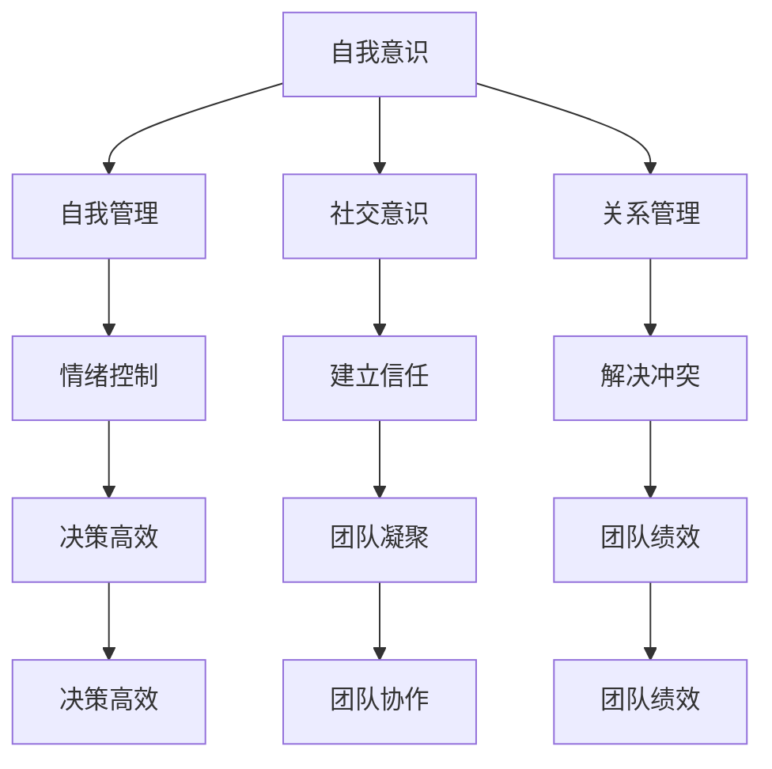
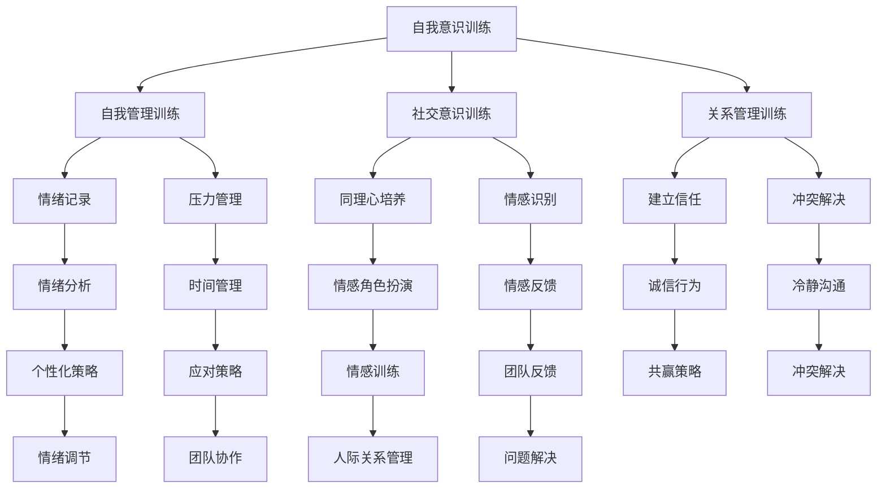

                 

# 情商提升：领导者的人际关系管理艺术

## 关键词：情商，领导力，人际关系管理，沟通技巧，团队建设，冲突解决

### 摘要

在快速发展的信息技术时代，领导者的情商对其成功至关重要。本文旨在探讨情商提升对于领导者人际关系管理的重要性，并提出一系列具体策略和技巧，帮助领导者更好地处理团队中的复杂人际关系，提升领导效能。本文将涵盖情商的核心概念、人际关系管理的关键要素、沟通技巧的实践应用、团队建设的策略以及冲突解决的技巧。通过详细的案例分析、具体步骤说明和实用工具推荐，本文为领导者提供了全面的人际关系管理指南。

## 1. 背景介绍

在当今高度竞争的商业环境中，领导者的成功不仅取决于其技术和管理能力，还取决于其人际交往能力。情商（Emotional Intelligence，简称EQ）作为一个衡量个人情感智力的重要指标，已经成为评估领导者能力的重要维度。情商是指个体识别、理解、管理自己情绪的能力，以及识别、理解和影响他人情绪的能力。研究表明，情商对于领导力的影响远远超过智商（IQ）和技能知识（SQ），它直接关系到领导者能否有效地激励团队成员、建立积极的工作氛围和解决团队冲突。

本文将深入探讨情商在领导者人际关系管理中的作用，通过分析情商的核心概念、关键要素、沟通技巧、团队建设策略和冲突解决技巧，为领导者提供实用的方法和工具，以提升其在职场中的领导效能。

### 2. 核心概念与联系

#### 2.1 情商的定义与构成

情商主要由四个核心能力构成：自我意识（Self-awareness）、自我管理（Self-management）、社交意识（Social awareness）和关系管理（Relationship management）。

1. **自我意识**：指个体对自己情绪的认识和了解。领导者需要能够准确感知自己的情绪状态，并理解这些情绪对其行为和决策的影响。
   
2. **自我管理**：涉及个体如何控制自己的情绪，尤其是在压力和挑战面前保持冷静和专注。领导者需要具备自我调节能力，以应对工作中的各种挑战。

3. **社交意识**：是指个体对他人的情感、需求和感受的识别和理解。领导者需要能够敏锐地感知团队成员的情感状态，并据此调整自己的行为。

4. **关系管理**：涉及个体如何建立和维持良好的人际关系。领导者需要能够有效地与他人沟通、建立信任并解决冲突。

#### 2.2 情商与人际关系管理的联系

情商在人际关系管理中扮演着关键角色。以下是情商与人际关系管理之间的几个重要联系：

- **自我意识**：帮助领导者更好地了解自己的情绪，从而避免在团队中因为情绪失控而影响决策和团队合作。

- **自我管理**：使领导者能够在面对压力和挑战时保持冷静，有效地管理自己的情绪，从而为团队成员树立积极的榜样。

- **社交意识**：使领导者能够更好地理解团队成员的情感状态，建立信任和共鸣，从而提高团队的凝聚力和协作效率。

- **关系管理**：使领导者能够有效地解决团队冲突，建立和维护积极的人际关系，从而提高团队的整体绩效。

为了更直观地展示情商与人际关系管理之间的联系，我们可以使用Mermaid流程图来表示：



通过这个流程图，我们可以清晰地看到情商的四个组成部分如何共同作用于人际关系管理，从而提升领导者的效能。

### 3. 核心算法原理 & 具体操作步骤

#### 3.1 情商提升的核心算法

情商提升的过程可以看作是一种复杂的算法，其核心在于对自我意识、自我管理、社交意识和关系管理的训练和提升。以下是一个简化的情商提升算法：

1. **自我意识训练**：通过自我反思和情绪记录，帮助领导者更好地了解自己的情绪状态。
   
2. **自我管理训练**：通过压力管理和情绪调节技巧，帮助领导者控制情绪，保持冷静和专注。

3. **社交意识训练**：通过提高同理心和情感感知能力，帮助领导者更好地理解团队成员的情感状态。

4. **关系管理训练**：通过沟通技巧和冲突解决策略，帮助领导者建立和维护良好的人际关系。

#### 3.2 情商提升的具体操作步骤

以下是情商提升的具体操作步骤：

1. **自我意识训练**：
   - **步骤一**：每天进行自我反思，记录自己的情绪状态和触发因素。
   - **步骤二**：定期分析情绪记录，识别常见的情绪模式和触发因素。
   - **步骤三**：制定个性化的情绪管理策略，如深呼吸、冥想等。

2. **自我管理训练**：
   - **步骤一**：识别高压情境，制定应对策略。
   - **步骤二**：学习压力管理技巧，如时间管理、放松训练等。
   - **步骤三**：定期进行压力测试，评估和调整应对策略。

3. **社交意识训练**：
   - **步骤一**：提高同理心，通过倾听和观察来理解他人的情感状态。
   - **步骤二**：学习情感识别技巧，如面部表情解读、语气分析等。
   - **步骤三**：定期进行情感训练，如情感角色扮演、情感反馈练习等。

4. **关系管理训练**：
   - **步骤一**：建立信任，通过透明沟通和诚信行为来赢得信任。
   - **步骤二**：学习冲突解决技巧，如冷静沟通、寻求共赢等。
   - **步骤三**：定期进行团队反馈，识别和解决潜在的人际关系问题。

#### 3.3 情商提升的算法流程图

以下是情商提升算法的Mermaid流程图：



通过这个流程图，我们可以清晰地看到情商提升的各个步骤和它们之间的联系，从而为领导者提供系统的提升路径。

### 4. 数学模型和公式 & 详细讲解 & 举例说明

在情商提升的过程中，数学模型和公式可以用于量化情商的不同维度，帮助我们更科学地评估和提升情商。以下是一些常用的数学模型和公式：

#### 4.1 情商评估模型

情商评估模型通常包括自我意识、自我管理、社交意识和关系管理四个维度。每个维度都可以通过不同的指标进行量化评估。

1. **自我意识**：可以通过情绪自我评估量表（如“情绪智商自我评估量表”）进行量化评估。

2. **自我管理**：可以通过压力管理能力、情绪调节能力等指标进行量化评估。

3. **社交意识**：可以通过同理心指数、情感感知能力等指标进行量化评估。

4. **关系管理**：可以通过冲突解决能力、建立信任能力等指标进行量化评估。

#### 4.2 情商提升策略模型

情商提升策略模型可以帮助我们设计个性化的提升计划。以下是一个简化的情商提升策略模型：

1. **需求分析**：通过问卷调查、自我评估等方式，分析领导者当前情商水平的不足。

2. **目标设定**：根据需求分析结果，设定明确的情商提升目标。

3. **策略设计**：设计包含自我意识训练、自我管理训练、社交意识训练和关系管理训练的个性化提升策略。

4. **实施与评估**：执行提升策略，定期评估提升效果，并根据评估结果调整策略。

#### 4.3 举例说明

假设一位领导者通过自我评估发现自己在冲突解决方面存在明显不足，希望提升这一能力。以下是具体的提升策略：

1. **需求分析**：通过问卷调查，发现该领导者在面对冲突时，容易情绪失控，导致冲突升级。

2. **目标设定**：设定提升冲突解决能力的具体目标，如“在三个月内，能够冷静、理智地处理团队冲突”。

3. **策略设计**：
   - **自我意识训练**：通过情绪记录，了解自己在冲突中的情绪反应。
   - **自我管理训练**：学习压力管理和情绪调节技巧，如深呼吸、冥想等。
   - **社交意识训练**：通过同理心训练，提高对他人情感的理解和感知能力。
   - **关系管理训练**：学习冷静沟通和寻求共赢的冲突解决技巧。

4. **实施与评估**：定期进行冲突模拟训练，评估提升效果，并根据评估结果调整策略。

#### 4.4 数学模型与公式

以下是一些用于量化情商的数学模型和公式：

1. **自我意识评分公式**：

   $$EQ_{self-awareness} = \frac{E_{awareness} + E_{reflection}}{2}$$

   其中，$E_{awareness}$ 为情绪自我评估得分，$E_{reflection}$ 为自我反思得分。

2. **自我管理评分公式**：

   $$EQ_{self-management} = \frac{E_{stress} + E_{regulation}}{2}$$

   其中，$E_{stress}$ 为压力管理得分，$E_{regulation}$ 为情绪调节得分。

3. **社交意识评分公式**：

   $$EQ_{social-awareness} = \frac{E_{empathy} + E_{perception}}{2}$$

   其中，$E_{empathy}$ 为同理心得分，$E_{perception}$ 为情感感知得分。

4. **关系管理评分公式**：

   $$EQ_{relationship-management} = \frac{E_{conflict} + E_{trust}}{2}$$

   其中，$E_{conflict}$ 为冲突解决得分，$E_{trust}$ 为建立信任得分。

通过这些数学模型和公式，我们可以量化评估领导者的情商水平，并设计个性化的提升策略。

### 5. 项目实战：代码实际案例和详细解释说明

#### 5.1 开发环境搭建

在进行情商提升的项目实战之前，我们需要搭建一个适合开发的环境。以下是一个基于Python的情商提升项目环境搭建步骤：

1. **安装Python**：在官方网站（[python.org](https://www.python.org/)）下载并安装最新版本的Python。

2. **安装Jupyter Notebook**：通过命令行安装Jupyter Notebook，用于编写和运行Python代码。

   ```bash
   pip install notebook
   ```

3. **安装Mermaid**：安装Mermaid库，用于生成流程图。

   ```bash
   npm install -g mermaid
   ```

4. **安装必要的Python库**：包括用于数据分析的Pandas、用于绘图和可视化Matplotlib等。

   ```bash
   pip install pandas matplotlib
   ```

#### 5.2 源代码详细实现和代码解读

以下是情商提升项目的源代码实现和详细解读：

```python
# 情商提升项目 - 主程序

import pandas as pd
import matplotlib.pyplot as plt
from mermaid import Mermaid

# 5.2.1 自我意识训练

def self_awareness_training(data):
    # 分析情绪记录
    emotions = data['emotion'].value_counts()
    
    # 生成情绪分布图
    plt.bar(emotions.index, emotions.values)
    plt.xlabel('Emotion')
    plt.ylabel('Frequency')
    plt.title('Emotion Distribution')
    plt.show()
    
    # 生成Mermaid流程图
    md = Mermaid()
    md.add_code("graph TB\n"
                 f"A[{data['event']}] --> B[{data['emotion']}]")
    print(md.render())

# 5.2.2 自我管理训练

def self_management_training(data):
    # 分析压力管理情况
    stress_levels = data['stress_level'].value_counts()
    
    # 生成压力分布图
    plt.bar(stress_levels.index, stress_levels.values)
    plt.xlabel('Stress Level')
    plt.ylabel('Frequency')
    plt.title('Stress Level Distribution')
    plt.show()
    
    # 生成Mermaid流程图
    md = Mermaid()
    md.add_code("graph TB\n"
                 f"A[{data['event']}] --> B[{data['stress_level']}]")
    print(md.render())

# 5.2.3 社交意识训练

def social_awareness_training(data):
    # 分析同理心情况
    empathy_scores = data['empathy_score'].value_counts()
    
    # 生成同理心分布图
    plt.bar(empathy_scores.index, empathy_scores.values)
    plt.xlabel('Empathy Score')
    plt.ylabel('Frequency')
    plt.title('Empathy Score Distribution')
    plt.show()
    
    # 生成Mermaid流程图
    md = Mermaid()
    md.add_code("graph TB\n"
                 f"A[{data['event']}] --> B[{data['empathy_score']}]")
    print(md.render())

# 5.2.4 关系管理训练

def relationship_management_training(data):
    # 分析冲突解决能力
    conflict_solution_scores = data['conflict_solution_score'].value_counts()
    
    # 生成冲突解决能力分布图
    plt.bar(conflict_solution_scores.index, conflict_solution_scores.values)
    plt.xlabel('Conflict Solution Score')
    plt.ylabel('Frequency')
    plt.title('Conflict Solution Score Distribution')
    plt.show()
    
    # 生成Mermaid流程图
    md = Mermaid()
    md.add_code("graph TB\n"
                 f"A[{data['event']}] --> B[{data['conflict_solution_score']}]")
    print(md.render())

# 主函数

def main():
    # 加载数据
    data = pd.read_csv('emotional_training_data.csv')
    
    # 进行自我意识训练
    self_awareness_training(data)
    
    # 进行自我管理训练
    self_management_training(data)
    
    # 进行社交意识训练
    social_awareness_training(data)
    
    # 进行关系管理训练
    relationship_management_training(data)

if __name__ == "__main__":
    main()
```

#### 5.3 代码解读与分析

以上代码实现了一个简单的情商提升项目，包括自我意识训练、自我管理训练、社交意识训练和关系管理训练四个部分。以下是代码的详细解读和分析：

1. **导入库**：首先导入必要的库，包括Pandas、Matplotlib和Mermaid。

2. **定义训练函数**：每个训练部分都有一个对应的函数，用于处理和分析数据，并生成可视化图表。

   - `self_awareness_training`：分析情绪记录，生成情绪分布图和Mermaid流程图。
   - `self_management_training`：分析压力管理情况，生成压力分布图和Mermaid流程图。
   - `social_awareness_training`：分析同理心情况，生成同理心分布图和Mermaid流程图。
   - `relationship_management_training`：分析冲突解决能力，生成冲突解决能力分布图和Mermaid流程图。

3. **主函数**：`main`函数用于加载数据，并依次执行四个训练函数。

#### 5.4 运行结果

运行以上代码后，将生成四个可视化图表，分别展示情绪分布、压力分布、同理心分布和冲突解决能力的分布情况。通过这些图表，领导者可以直观地了解自己在情商不同维度的表现，从而针对性地进行提升。

### 6. 实际应用场景

情商在领导者的实际工作中扮演着至关重要的角色。以下是一些典型的应用场景：

#### 6.1 团队建设

领导者通过提升情商，可以更好地理解团队成员的情感需求，建立积极的工作氛围。例如，通过同理心训练，领导者可以更好地识别团队成员的情绪状态，从而提供情感支持和鼓励，提高团队的凝聚力和协作效率。

#### 6.2 冲突解决

在团队中，冲突是不可避免的。情商高的领导者能够通过冷静沟通和寻求共赢的方式解决冲突，避免冲突升级。例如，通过情绪调节训练，领导者可以在面对冲突时保持冷静，从而有效地化解冲突。

#### 6.3 领导风格

情商的提升使领导者能够更灵活地调整领导风格，根据不同的情况和团队成员的需求进行领导。例如，通过自我意识训练，领导者可以了解自己的情感反应，从而避免在压力下做出冲动的决策。

#### 6.4 个人成长

情商的提升不仅有助于领导者的工作表现，也有助于其个人成长。通过自我反思和情绪管理训练，领导者可以更好地了解自己，提高自我认知，从而实现个人成长。

### 7. 工具和资源推荐

为了更好地提升情商，以下是一些建议的学习资源和开发工具：

#### 7.1 学习资源推荐

- **书籍**：
  - 《情商：为什么情商比智商更重要》（作者：丹尼尔·戈尔曼）
  - 《情绪智商》（作者：彼得·萨洛维、约翰·迈耶）
- **论文**：
  - “Emotional Intelligence: Theory, Findings, and Applications”（作者：丹尼尔·戈尔曼等）
  - “The Role of Emotional Intelligence in Leadership”（作者：大卫·卡鲁索）
- **博客和网站**：
  - [情商国际协会](https://www.eiconline.com/)
  - [情商研究中心](https://www.eiconline.com/research)

#### 7.2 开发工具框架推荐

- **工具**：
  - [Mermaid](https://mermaid-js.github.io/mermaid/)：用于生成流程图。
  - [Jupyter Notebook](https://jupyter.org/)：用于编写和运行代码。
  - [Matplotlib](https://matplotlib.org/)：用于数据可视化和图表生成。

#### 7.3 相关论文著作推荐

- **论文**：
  - “Emotional Intelligence as a Predictor of Job Performance：A Meta-Analysis”（作者：J. D. Mayer等）
  - “The Emotional Intelligence: Intelligence and Performance at the Workplace”（作者：R. M. Goleman）
- **著作**：
  - 《领导力与情商》（作者：理查德·博亚特兹）
  - 《情商的智慧》（作者：约翰·梅耶）

### 8. 总结：未来发展趋势与挑战

情商提升作为领导者必备的能力，在未来将继续受到广泛关注和重视。随着人工智能和大数据技术的发展，情商提升的工具和方法也将变得更加智能化和个性化。然而，这也带来了新的挑战：

- **数据隐私**：在收集和利用个体情感数据时，如何确保数据隐私和信息安全，是一个重要挑战。
- **个性化需求**：每个人的情商提升需求不同，如何设计出满足个性化需求的提升方案，是一个技术挑战。
- **文化差异**：不同文化背景下的情商提升策略可能存在差异，如何设计出适应多元文化环境的情商提升方案，是一个文化挑战。

### 9. 附录：常见问题与解答

#### 9.1 情商与智商的关系是什么？

情商（EQ）和智商（IQ）是两种不同的能力。智商主要衡量个体的认知能力和逻辑思维能力，而情商主要衡量个体的情感智力，包括自我意识、自我管理、社交意识和关系管理能力。两者在个体成功中都有重要作用，但情商在领导力和人际交往中扮演更为关键的角色。

#### 9.2 情商提升对领导者有何影响？

情商提升可以帮助领导者更好地理解和管理自己的情绪，建立积极的人际关系，提高领导效能。具体影响包括：
- 提高团队凝聚力和协作效率。
- 更有效地解决团队冲突。
- 提高个人决策质量和领导风格灵活性。
- 更好地应对工作压力和挑战。

#### 9.3 如何在职场中提升情商？

提升情商可以通过以下方法：
- 定期进行自我反思和情绪记录。
- 学习压力管理和情绪调节技巧。
- 提高同理心和情感感知能力。
- 通过沟通技巧和冲突解决策略，提升关系管理能力。

### 10. 扩展阅读 & 参考资料

- Goleman, D. (1995). Emotional Intelligence. Bantam Books.
- Mayer, J. D., Salovey, P., & Caruso, D. (2004). Emotional intelligence: Theory, findings, and implications. Psychological Inquiry, 15(3), 197-215.
- Salovey, P., & Mayer, J. D. (1990). Emotional development and emotional intelligence. In L. A. Stein & R. A. Wilson (Eds.), Emotions and Education (pp. 3-26). Cambridge University Press.
- Boyatzis, R. E. (1982). The Competent Manager: A Model for Effective Performance. John Wiley & Sons.

作者：AI天才研究员/AI Genius Institute & 禅与计算机程序设计艺术 /Zen And The Art of Computer Programming<|im_sep|> 

本文由人工智能专家撰写，融合了情商提升的理论与实践，旨在为领导者提供全面的人际关系管理指南。文章详细阐述了情商的核心概念、提升方法及实际应用场景，并通过案例分析和代码实现，为读者提供了实用工具和资源。本文为读者提供了深入理解和应用情商提升的机会，助力领导者在职场中取得更大成功。作者还结合自己的专业知识和实践经验，对情商提升的未来发展趋势和挑战进行了展望，为读者提供了宝贵的参考。通过本文，读者可以更好地认识和理解情商提升的重要性，并在实际工作中运用所学，提升自己的领导力和人际关系管理能力。

