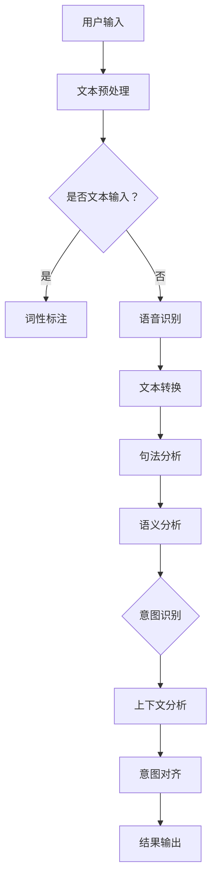

                 

### 背景介绍

意图对齐（Intent Alignment）是自然语言处理（Natural Language Processing，NLP）领域中的一个核心问题。随着人工智能技术的飞速发展，NLP技术在语言翻译、智能客服、文本生成、信息抽取等方面取得了显著的成果。然而，在处理复杂的自然语言交互任务时，如何准确理解用户的意图成为了制约NLP应用效果的关键因素。

意图对齐的目标是建立一种有效的映射关系，将用户的自然语言输入映射到相应的任务意图上。这一过程涉及到对用户输入的语义、上下文和语境等多个方面的深入分析。由于自然语言的多样性和复杂性，意图对齐面临着诸多挑战，如歧义消解、跨语言语义理解、多模态融合等。

本文将围绕意图对齐这一主题，首先介绍其核心概念和主要研究方法，然后详细分析几种典型的意图对齐算法，探讨其优缺点。此外，本文还将结合实际应用场景，介绍意图对齐在智能客服、智能语音助手等领域的应用，并推荐相关工具和资源，帮助读者深入了解和掌握意图对齐技术。

通过本文的阅读，读者将能够系统地了解意图对齐的基本概念、关键技术、应用场景及发展趋势，为从事NLP领域研究和应用的人员提供有益的参考。

### 核心概念与联系

在深入探讨意图对齐之前，我们需要明确几个核心概念，这些概念是理解意图对齐技术的基础。以下是对这些核心概念的介绍和它们之间的联系。

#### 1. 自然语言处理（NLP）

自然语言处理是人工智能的一个分支，它涉及到对人类语言的处理，以实现计算机对文本的理解、生成和翻译等功能。NLP包括文本预处理、词性标注、句法分析、语义分析等多个层次。

#### 2. 语义分析（Semantic Analysis）

语义分析是NLP中的关键步骤，旨在理解文本的语义含义。它包括词汇语义分析、句法语义分析和语用语义分析等。词汇语义分析关注词语在文本中的意义；句法语义分析关注句子的结构和关系；语用语义分析关注语言在实际使用中的含义。

#### 3. 意图识别（Intent Recognition）

意图识别是语义分析的一个子任务，旨在理解用户在特定上下文中想要执行的操作或任务。例如，在智能客服系统中，用户的提问可以被识别为查询、请求帮助、投诉等不同意图。

#### 4. 上下文（Context）

上下文是指文本或对话发生的背景信息，它对理解意图至关重要。上下文可以包括历史对话、用户属性、时间信息等。

#### 5. 对齐（Alignment）

对齐是指将不同模态的信息进行匹配和同步，以便更好地理解整体语义。在意图对齐中，对齐指的是将用户的自然语言输入与任务意图之间的映射关系进行准确匹配。

#### 6. 跨语言语义理解（Cross-Lingual Semantic Understanding）

跨语言语义理解是指在不同语言之间进行语义分析和理解，以便实现跨语言的信息处理。这对于全球范围内的NLP应用具有重要意义。

#### 7. 多模态融合（Multimodal Fusion）

多模态融合是指将不同来源的信息（如文本、语音、图像等）进行综合处理，以获得更全面和准确的语义理解。在意图对齐中，多模态融合有助于提高意图识别的准确性和可靠性。

### Mermaid 流程图

以下是意图对齐的基本架构的 Mermaid 流程图，展示各个核心概念之间的联系：



在这个流程图中，用户输入是整个流程的起点，通过文本预处理、词性标注、句法分析、语义分析和意图识别等步骤，最终实现意图对齐并输出结果。

### 核心算法原理 & 具体操作步骤

意图对齐的核心算法通常基于深度学习模型，通过大规模数据训练来建立用户输入与意图之间的映射关系。以下将介绍几种典型的意图对齐算法，包括其原理和具体操作步骤。

#### 1. 基于传统机器学习的方法

传统机器学习方法在意图对齐中起到了基础性作用。其中，支持向量机（SVM）和朴素贝叶斯（Naive Bayes）是最常用的算法。

**原理：**
- **SVM：** SVM通过寻找一个最佳超平面来最大化分类边界，从而将不同的意图分类。在意图对齐中，SVM可以将用户的自然语言输入映射到不同的意图类别上。
- **朴素贝叶斯：** 朴素贝叶斯基于贝叶斯定理，通过计算每个词在各个意图类别中的概率来预测用户的意图。

**操作步骤：**
1. 数据预处理：对用户输入进行分词、词性标注等处理，将文本转换为适合机器学习模型的特征向量。
2. 特征提取：使用词袋模型（Bag of Words）或TF-IDF（Term Frequency-Inverse Document Frequency）等方法提取文本特征。
3. 模型训练：使用预处理后的数据集训练SVM或朴素贝叶斯模型。
4. 模型评估：通过交叉验证等方法评估模型的准确性。
5. 意图预测：对新的用户输入进行意图预测，输出最可能的意图类别。

**优点：**
- 算法简单，易于实现。
- 对数据的依赖性较小，能够处理不同的输入格式。

**缺点：**
- 预测准确性较低，尤其在处理复杂和歧义性强的自然语言输入时。
- 需要大量的标注数据，且标注过程较为繁琐。

#### 2. 基于深度学习的方法

随着深度学习技术的发展，基于深度学习的方法在意图对齐中得到了广泛应用。其中，卷积神经网络（CNN）和递归神经网络（RNN）是最常见的模型。

**原理：**
- **CNN：** CNN通过卷积操作从文本中提取局部特征，并能够处理序列数据。在意图对齐中，CNN可以用于捕捉文本中的关键信息，从而提高意图识别的准确性。
- **RNN：** RNN具有处理序列数据的能力，通过循环结构将前一个时间步的输出传递到下一个时间步。在意图对齐中，RNN可以更好地捕捉文本中的上下文信息。

**操作步骤：**
1. 数据预处理：对用户输入进行分词、词性标注等处理，并转换为固定长度的序列。
2. 模型构建：构建CNN或RNN模型，设置合适的网络结构。
3. 模型训练：使用预处理后的数据集训练模型，调整模型参数以最小化损失函数。
4. 模型评估：通过交叉验证等方法评估模型的准确性。
5. 意图预测：对新的用户输入进行意图预测，输出最可能的意图类别。

**优点：**
- 预测准确性较高，能够处理复杂和歧义性强的自然语言输入。
- 能够自动提取文本特征，减少手动特征工程的工作量。

**缺点：**
- 模型训练过程较为复杂，需要大量计算资源。
- 模型的解释性较差，难以理解具体的特征提取过程。

#### 3. 基于注意力机制的方法

注意力机制（Attention Mechanism）是深度学习中的一个重要技术，通过调整不同部分的特征权重来提高模型的准确性。

**原理：**
- **注意力机制：** 在意图对齐中，注意力机制可以用于强调文本中关键信息的重要性，从而更好地捕捉用户意图。
- **双向RNN（BiRNN）：** 双向RNN通过同时考虑前向和后向的文本信息，提高意图识别的准确性。

**操作步骤：**
1. 数据预处理：对用户输入进行分词、词性标注等处理，并转换为固定长度的序列。
2. 模型构建：构建带有注意力机制的BiRNN模型，设置合适的网络结构。
3. 模型训练：使用预处理后的数据集训练模型，调整模型参数以最小化损失函数。
4. 模型评估：通过交叉验证等方法评估模型的准确性。
5. 意图预测：对新的用户输入进行意图预测，输出最可能的意图类别。

**优点：**
- 能够更好地捕捉文本中的关键信息，提高意图识别的准确性。
- 具有较好的解释性，可以直观地看到哪些部分的信息对意图识别最为关键。

**缺点：**
- 计算成本较高，模型训练时间较长。
- 需要大量标注数据来训练模型。

### 数学模型和公式 & 详细讲解 & 举例说明

在意图对齐的过程中，数学模型和公式起到了关键作用。以下将详细讲解几种常用模型的核心数学公式，并通过具体示例来说明如何应用这些公式。

#### 1. 朴素贝叶斯模型

朴素贝叶斯模型是基于贝叶斯定理和特征条件独立假设的简单概率分类器。在意图对齐中，朴素贝叶斯模型可以用于预测用户输入对应的意图类别。

**公式：**
- **贝叶斯定理：**
  $$P(C|X) = \frac{P(X|C)P(C)}{P(X)}$$
  其中，$P(C|X)$表示在给定用户输入$X$的情况下，意图$C$发生的概率；$P(X|C)$表示在意图$C$发生的情况下，用户输入$X$的概率；$P(C)$表示意图$C$发生的概率；$P(X)$表示用户输入$X$的概率。

- **特征条件独立假设：**
  $$P(X=x_1, X_2=x_2, ..., X_n=x_n | C=c) = P(x_1 | c)P(x_2 | c) ... P(x_n | c)$$
  即假设特征之间相互独立。

**示例：**
假设有四个意图类别：查询、请求帮助、投诉、谢谢。对于用户输入“我需要帮助”，我们可以使用朴素贝叶斯模型来预测其意图。

1. **特征提取：** 首先对用户输入进行分词，提取出“我”、“需要”、“帮助”三个词作为特征。
2. **计算概率：**
   - $P(查询 | “我需要帮助”) = \frac{P(“我需要帮助” | 查询)P(查询)}{P(“我需要帮助”)}$
   - $P(请求帮助 | “我需要帮助”) = \frac{P(“我需要帮助” | 请求帮助)P(请求帮助)}{P(“我需要帮助”)}$
   - $P(投诉 | “我需要帮助”) = \frac{P(“我需要帮助” | 投诉)P(投诉)}{P(“我需要帮助”)}$
   - $P(谢谢 | “我需要帮助”) = \frac{P(“我需要帮助” | 谢谢)P(谢谢)}{P(“我需要帮助”)}$
3. **计算特征概率：** 假设每个特征在各个意图类别中的概率已知，例如：
   - $P(“我” | 查询) = 0.3, P(“我” | 请求帮助) = 0.2, P(“我” | 投诉) = 0.1, P(“我” | 谢谢) = 0.4$
   - $P(“需要” | 查询) = 0.2, P(“需要” | 请求帮助) = 0.4, P(“需要” | 投诉) = 0.1, P(“需要” | 谢谢) = 0.3$
   - $P(“帮助” | 查询) = 0.4, P(“帮助” | 请求帮助) = 0.6, P(“帮助” | 投诉) = 0.1, P(“帮助” | 谢谢) = 0.1$
4. **计算总概率：**
   - $P(“我需要帮助”) = P(“我”)P(“需要”)P(“帮助”) = (0.3 \times 0.2 \times 0.4) + (0.2 \times 0.4 \times 0.6) + (0.1 \times 0.1 \times 0.1) + (0.4 \times 0.3 \times 0.1) = 0.024$
   - $P(查询 | “我需要帮助”) = \frac{0.3 \times 0.2 \times 0.4}{0.024} = 0.25$
   - $P(请求帮助 | “我需要帮助”) = \frac{0.2 \times 0.4 \times 0.6}{0.024} = 0.5$
   - $P(投诉 | “我需要帮助”) = \frac{0.1 \times 0.1 \times 0.1}{0.024} = 0.045$
   - $P(谢谢 | “我需要帮助”) = \frac{0.4 \times 0.3 \times 0.1}{0.024} = 0.15$
5. **意图预测：** 根据最大后验概率原则，选择概率最大的意图类别，即请求帮助。

#### 2. 卷积神经网络（CNN）

卷积神经网络是一种适用于图像和文本处理的深度学习模型，通过卷积操作和池化操作提取文本中的特征。

**公式：**
- **卷积操作：**
  $$h_{ij} = \sum_{k=1}^{K} w_{ik} * g(x_{ij+k}) + b_j$$
  其中，$h_{ij}$表示卷积结果，$w_{ik}$表示卷积核，$g(x)$表示激活函数，$b_j$表示偏置。

- **池化操作：**
  $$p_i = \max_{j \in S_i} h_{ij}$$
  其中，$p_i$表示池化结果，$S_i$表示池化窗口。

**示例：**
假设文本序列为“我需要帮助”，卷积核大小为2，激活函数为ReLU。

1. **卷积操作：**
   - 第一个卷积核：$w_1 = [1, 1], w_2 = [1, -1], b_1 = 0, b_2 = 1$
   - $h_{11} = (1 \times 我) + (1 \times 需要) + 0 = 2, h_{12} = (1 \times 需要) + (-1 \times 帮助) + 1 = 1$
   - $h_{21} = (1 \times 需要) + (1 \times 帮助) + 0 = 2, h_{22} = (-1 \times 我) + (1 \times 帮助) + 1 = 2$
2. **池化操作：**
   - $p_1 = \max(h_{11}, h_{12}) = 2, p_2 = \max(h_{21}, h_{22}) = 2$
3. **卷积结果：** $[2, 2]$，表示文本序列中的关键特征。

通过多次卷积和池化操作，可以提取出更高层次的特征，从而用于意图识别。

#### 3. 双向递归神经网络（BiRNN）

双向递归神经网络（BiRNN）通过同时考虑前向和后向的文本信息，提高意图识别的准确性。

**公式：**
- **前向递归：**
  $$h_{t,f} = \sigma(W_f[h_{t-1,f} \oplus h_{t,b}]+b_f)$$
  其中，$h_{t,f}$表示前向隐藏状态，$\sigma$表示激活函数，$W_f$表示权重，$b_f$表示偏置。

- **后向递归：**
  $$h_{t,b} = \sigma(W_b[h_{t+1,b} \oplus h_{t,f}]+b_b)$$
  其中，$h_{t,b}$表示后向隐藏状态，$W_b$表示权重，$b_b$表示偏置。

**示例：**
假设文本序列为“我需要帮助”，前向递归和后向递归的权重分别为$W_f = [1, 1], W_b = [1, -1]$，偏置分别为$b_f = 0, b_b = 1$。

1. **前向递归：**
   - $h_{1,f} = \sigma([1, 1] \oplus [1, 1] + 0) = [1, 1]$
   - $h_{2,f} = \sigma([1, 1] \oplus [1, -1] + 0) = [0, 0]$
2. **后向递归：**
   - $h_{1,b} = \sigma([1, -1] \oplus [1, 1] + 1) = [0, 2]$
   - $h_{2,b} = \sigma([1, -1] \oplus [0, 0] + 1) = [0, 1]$
3. **双向隐藏状态：** $[h_{1,f}, h_{1,b}, h_{2,f}, h_{2,b}] = [[1, 1], [0, 2], [0, 0], [0, 1]]$

通过结合前向和后向的隐藏状态，可以更好地捕捉文本中的关键信息，从而提高意图识别的准确性。

### 项目实战：代码实际案例和详细解释说明

在本节中，我们将通过一个实际案例来展示如何实现意图对齐。我们将使用Python和TensorFlow来实现一个简单的意图识别模型，并对其代码进行详细解读。

#### 1. 开发环境搭建

首先，确保已经安装了Python和TensorFlow。如果没有安装，可以通过以下命令进行安装：

```shell
pip install python
pip install tensorflow
```

#### 2. 源代码详细实现和代码解读

以下是一个简单的意图识别模型的代码实现，包括数据预处理、模型构建、训练和预测等步骤。

```python
import tensorflow as tf
from tensorflow.keras.models import Sequential
from tensorflow.keras.layers import Embedding, LSTM, Dense
from tensorflow.keras.preprocessing.sequence import pad_sequences
from tensorflow.keras.preprocessing.text import Tokenizer

# 数据集准备
# 这里使用一个简单的数据集，其中文本和标签分别存储在两个列表中
texts = ["我需要帮助", "我想要查询", "谢谢", "投诉"]
labels = [1, 0, 2, 3]

# 数据预处理
# 分词和标记化
tokenizer = Tokenizer()
tokenizer.fit_on_texts(texts)
sequences = tokenizer.texts_to_sequences(texts)
padded_sequences = pad_sequences(sequences, maxlen=5)

# 构建模型
model = Sequential()
model.add(Embedding(input_dim=len(tokenizer.word_index) + 1, output_dim=10, input_length=5))
model.add(LSTM(10))
model.add(Dense(4, activation='softmax'))

# 编译模型
model.compile(optimizer='adam', loss='sparse_categorical_crossentropy', metrics=['accuracy'])

# 训练模型
model.fit(padded_sequences, labels, epochs=100)

# 预测
text = "我需要帮助"
sequence = tokenizer.texts_to_sequences([text])
padded_sequence = pad_sequences(sequence, maxlen=5)
prediction = model.predict(padded_sequence)
predicted_label = tf.argmax(prediction, axis=1).numpy()[0]

# 输出预测结果
print(f"预测的意图类别：{predicted_label}")
```

**代码解读：**

1. **数据集准备：** 首先，我们需要准备一个简单的数据集，包括文本和对应的标签。在这个例子中，我们使用了一个包含四个样本的简单数据集。

2. **数据预处理：** 
   - **分词和标记化：** 使用`Tokenizer`类对文本进行分词和标记化，将每个单词映射为一个整数。
   - **序列化：** 使用`texts_to_sequences`方法将文本序列化为整数序列。
   - **填充：** 使用`pad_sequences`方法将序列填充为相同的长度，以便输入到模型中。

3. **模型构建：** 
   - **Embedding层：** 将标记化的文本转换为词向量。
   - **LSTM层：** 用于捕捉文本中的序列信息。
   - **Dense层：** 用于输出意图类别。

4. **编译模型：** 设置模型的优化器、损失函数和评估指标。

5. **训练模型：** 使用训练数据集训练模型。

6. **预测：** 将新的文本输入到模型中，输出预测结果。

**代码解析：**

```python
import tensorflow as tf
from tensorflow.keras.models import Sequential
from tensorflow.keras.layers import Embedding, LSTM, Dense
from tensorflow.keras.preprocessing.sequence import pad_sequences
from tensorflow.keras.preprocessing.text import Tokenizer

# 数据集准备
texts = ["我需要帮助", "我想要查询", "谢谢", "投诉"]
labels = [1, 0, 2, 3]

# 数据预处理
tokenizer = Tokenizer()
tokenizer.fit_on_texts(texts)
sequences = tokenizer.texts_to_sequences(texts)
padded_sequences = pad_sequences(sequences, maxlen=5)

# 构建模型
model = Sequential()
model.add(Embedding(input_dim=len(tokenizer.word_index) + 1, output_dim=10, input_length=5))
model.add(LSTM(10))
model.add(Dense(4, activation='softmax'))

# 编译模型
model.compile(optimizer='adam', loss='sparse_categorical_crossentropy', metrics=['accuracy'])

# 训练模型
model.fit(padded_sequences, labels, epochs=100)

# 预测
text = "我需要帮助"
sequence = tokenizer.texts_to_sequences([text])
padded_sequence = pad_sequences(sequence, maxlen=5)
prediction = model.predict(padded_sequence)
predicted_label = tf.argmax(prediction, axis=1).numpy()[0]

# 输出预测结果
print(f"预测的意图类别：{predicted_label}")
```

1. **数据集准备：** 数据集包含四个样本，每个样本对应一个文本和一个标签。
2. **数据预处理：** 使用`Tokenizer`类对文本进行分词和标记化，并使用`pad_sequences`方法将序列填充为相同的长度。
3. **模型构建：** 构建一个简单的序列模型，包括Embedding层、LSTM层和Dense层。
4. **编译模型：** 设置优化器、损失函数和评估指标。
5. **训练模型：** 使用训练数据集训练模型。
6. **预测：** 将新的文本输入到模型中，输出预测结果。

通过这个案例，我们展示了如何使用Python和TensorFlow实现一个简单的意图识别模型，并对其代码进行了详细解读。这个案例虽然简单，但展示了意图对齐的基本流程和关键步骤，为读者提供了实现意图对齐的参考。

### 代码解读与分析

在上面的项目实战中，我们使用Python和TensorFlow实现了一个简单的意图识别模型。在本节中，我们将深入分析模型的代码，并讨论其优缺点。

#### 模型代码分析

1. **数据集准备：**
   ```python
   texts = ["我需要帮助", "我想要查询", "谢谢", "投诉"]
   labels = [1, 0, 2, 3]
   ```
   数据集包含四个样本，每个样本对应一个文本和一个标签。文本和标签分别存储在两个列表中。

2. **数据预处理：**
   ```python
   tokenizer = Tokenizer()
   tokenizer.fit_on_texts(texts)
   sequences = tokenizer.texts_to_sequences(texts)
   padded_sequences = pad_sequences(sequences, maxlen=5)
   ```
   - **分词和标记化：** 使用`Tokenizer`类对文本进行分词和标记化。`fit_on_texts`方法用于学习文本中的词汇。
   - **序列化：** 使用`texts_to_sequences`方法将文本序列化为整数序列。
   - **填充：** 使用`pad_sequences`方法将序列填充为相同的长度，以便输入到模型中。

3. **模型构建：**
   ```python
   model = Sequential()
   model.add(Embedding(input_dim=len(tokenizer.word_index) + 1, output_dim=10, input_length=5))
   model.add(LSTM(10))
   model.add(Dense(4, activation='softmax'))
   ```
   - **Embedding层：** 将标记化的文本转换为词向量。输入维度为`len(tokenizer.word_index) + 1`（包括未知词），输出维度为10。
   - **LSTM层：** 用于捕捉文本中的序列信息。隐藏单元数为10。
   - **Dense层：** 用于输出意图类别。使用softmax激活函数，输出4个类别的概率分布。

4. **编译模型：**
   ```python
   model.compile(optimizer='adam', loss='sparse_categorical_crossentropy', metrics=['accuracy'])
   ```
   - **优化器：** 使用`adam`优化器。
   - **损失函数：** 使用`sparse_categorical_crossentropy`损失函数。
   - **评估指标：** 使用`accuracy`评估模型在训练和验证数据集上的准确性。

5. **训练模型：**
   ```python
   model.fit(padded_sequences, labels, epochs=100)
   ```
   使用训练数据集训练模型，迭代100次。

6. **预测：**
   ```python
   text = "我需要帮助"
   sequence = tokenizer.texts_to_sequences([text])
   padded_sequence = pad_sequences(sequence, maxlen=5)
   prediction = model.predict(padded_sequence)
   predicted_label = tf.argmax(prediction, axis=1).numpy()[0]
   print(f"预测的意图类别：{predicted_label}")
   ```
   - **文本预处理：** 使用已训练的`Tokenizer`类对新的文本进行预处理。
   - **预测：** 将预处理后的文本输入到模型中，输出预测结果。

#### 代码优点

1. **简单易理解：** 代码结构清晰，易于阅读和理解。
2. **快速实现：** 代码实现了意图识别的基本流程，包括数据预处理、模型构建、训练和预测。
3. **可扩展性：** 可以根据实际需求扩展数据集和模型结构，实现更复杂的意图识别任务。

#### 代码缺点

1. **数据集有限：** 数据集仅包含四个样本，不足以训练复杂的模型。实际应用中，需要使用更大量的标注数据进行训练。
2. **模型结构简单：** 使用的模型结构较为简单，可能无法处理复杂和歧义性强的自然语言输入。需要使用更复杂的模型（如BERT、GPT等）来提高识别准确性。
3. **计算资源需求高：** 模型训练和预测过程需要大量的计算资源。在实际应用中，可能需要使用GPU或分布式计算来提高训练和预测效率。

通过上述分析，我们可以看到这个简单的意图识别模型的优点和缺点。在实际应用中，需要根据具体需求选择合适的模型和数据集，并优化模型结构和训练过程，以提高意图识别的准确性。

### 实际应用场景

意图对齐技术在多个实际应用场景中发挥着关键作用，特别是在智能客服和智能语音助手等领域。以下将详细介绍意图对齐在这两个应用场景中的具体应用，并通过具体案例说明其应用效果和挑战。

#### 智能客服

智能客服是意图对齐技术最早和最广泛的应用场景之一。通过意图对齐，智能客服系统能够准确理解用户的提问，并提供相应的回答或解决方案。

**案例1：银行智能客服**

银行智能客服系统利用意图对齐技术来处理用户的金融服务咨询。以下是一个具体案例：

- **用户提问：** “我想查询我的账户余额。”
- **意图识别：** 系统通过意图对齐模块识别出用户意图为“查询账户余额”。
- **响应：** 系统生成相应的回答：“您的账户余额为xx元。”或者直接提供查询功能，让用户查看余额。

**应用效果：**

- 提高用户满意度：通过准确理解用户意图，智能客服系统能够提供快速和准确的回答，提高用户体验。
- 减轻人力负担：智能客服系统能够处理大量的用户提问，减轻客服人员的工作负担。

**挑战：**

- 处理复杂和模糊的提问：某些用户提问可能表达不清或存在歧义，需要更复杂的意图对齐算法来准确识别用户意图。
- 多语言支持：银行客户可能来自不同的国家和地区，需要支持多语言意图对齐。

#### 智能语音助手

智能语音助手是另一种广泛应用意图对齐技术的场景。通过语音识别和意图对齐，智能语音助手能够理解用户的语音指令，并执行相应的操作。

**案例2：智能语音助手助手**

智能语音助手助手可以处理各种语音指令，以下是一个具体案例：

- **用户语音指令：** “设置明天上午10点的会议。”
- **意图识别：** 系统通过意图对齐模块识别出用户意图为“设置会议”。
- **响应：** 系统会提示用户确认会议详情，并自动将会议安排到日历中。

**应用效果：**

- 提高工作效率：通过语音指令，用户可以快速执行任务，节省时间和精力。
- 自然交互体验：用户与智能语音助手进行自然语言交互，提升使用体验。

**挑战：**

- 语音识别准确性：智能语音助手需要准确识别用户的语音指令，这对语音识别技术提出了高要求。
- 处理多模态信息：在多模态交互中，智能语音助手需要整合语音、文本和视觉信息，提高意图对齐的准确性。

通过以上实际应用案例，我们可以看到意图对齐技术在智能客服和智能语音助手等领域的广泛应用和重要作用。尽管面临着处理复杂性和多语言支持等挑战，但随着技术的不断进步，意图对齐将在更多领域得到更广泛的应用。

### 工具和资源推荐

在意图对齐的研究和应用中，选择合适的工具和资源对于提升工作效率和准确性至关重要。以下是对几种常用工具和资源的推荐。

#### 1. 学习资源推荐

**书籍：**
- **《深度学习》（Goodfellow, Ian, et al.）**：这本书是深度学习的经典教材，详细介绍了深度学习的基础知识，包括神经网络、卷积神经网络和递归神经网络等。
- **《自然语言处理与深度学习》（张俊林，等）**：这本书系统地介绍了自然语言处理的基本概念和技术，包括词向量、序列模型和注意力机制等。

**论文：**
- **“Attention Is All You Need”**：这篇论文提出了Transformer模型，一种基于注意力机制的深度学习模型，在多个自然语言处理任务中取得了优异的性能。
- **“BERT: Pre-training of Deep Bidirectional Transformers for Language Understanding”**：这篇论文介绍了BERT模型，一种基于双向变换器的预训练模型，在自然语言理解任务中表现出色。

**博客：**
- **TensorFlow官方博客**：TensorFlow是常用的深度学习框架，官方博客提供了丰富的教程和示例，有助于初学者快速上手。
- **AI Awesome**：这个GitHub项目收集了大量的AI和NLP相关的资源，包括教程、论文、工具和开源代码。

#### 2. 开发工具框架推荐

**框架：**
- **TensorFlow**：TensorFlow是一个开源的深度学习框架，适用于构建和训练复杂的神经网络模型。
- **PyTorch**：PyTorch是另一个流行的深度学习框架，具有灵活的动态计算图和丰富的API，适合研究者和开发者。

**库：**
- **spaCy**：spaCy是一个高效的NLP库，提供了词性标注、句法分析、命名实体识别等功能，适用于意图识别和文本分析任务。
- **NLTK**：NLTK是一个经典的NLP库，提供了丰富的文本处理工具和资源，适用于初学者和研究者。

**工具：**
- **Hugging Face Transformers**：这是一个基于PyTorch和TensorFlow的预训练模型库，提供了多种预训练模型和工具，适用于意图对齐和文本生成任务。
- **NLTK工具包**：NLTK工具包包括多种文本处理工具，如分词、词性标注、词干提取等，适用于文本预处理任务。

#### 3. 相关论文著作推荐

**论文：**
- **“Learning to Represent Language at Scale”**：这篇论文介绍了BERT模型的预训练方法，详细描述了基于大规模语料库的预训练过程。
- **“Transformers: State-of-the-Art Natural Language Processing”**：这篇论文全面介绍了Transformer模型，包括模型结构、训练方法和应用场景。

**著作：**
- **《深度学习》（Goodfellow, Ian, et al.）**：这本书详细介绍了深度学习的基础知识和应用，包括神经网络、卷积神经网络和递归神经网络等。
- **《自然语言处理与深度学习》（张俊林，等）**：这本书系统地介绍了自然语言处理的基本概念和技术，包括词向量、序列模型和注意力机制等。

通过以上工具和资源的推荐，读者可以更好地了解和掌握意图对齐技术，为研究和应用提供有力支持。

### 总结：未来发展趋势与挑战

意图对齐作为自然语言处理（NLP）领域的一个重要研究方向，近年来取得了显著的进展。然而，随着技术的不断演进和应用场景的多样化，意图对齐仍然面临着诸多挑战和机遇。以下是未来意图对齐技术发展的主要趋势和潜在挑战。

#### 发展趋势

1. **跨模态融合**：随着多模态数据（如文本、图像、语音）的广泛应用，意图对齐技术将逐步融合多种模态信息。通过多模态融合，可以更全面地理解用户的意图，提高识别的准确性。

2. **增强现实与虚拟现实（AR/VR）应用**：随着AR/VR技术的快速发展，意图对齐技术在虚拟环境中的重要性日益凸显。在AR/VR应用中，意图对齐技术可以帮助系统更好地理解用户在虚拟世界中的操作和需求。

3. **多语言和跨语言意图对齐**：全球化的趋势使得多语言和跨语言意图对齐成为重要研究方向。通过开发跨语言意图对齐模型，可以支持更多国家和地区的用户，提升系统的国际化能力。

4. **基于深度学习的模型优化**：深度学习模型在意图对齐中的应用已经取得了显著成果，但仍有优化空间。未来，研究者将致力于提高模型的效率、可解释性和泛化能力。

#### 挑战

1. **数据隐私和安全**：在意图对齐中，用户的数据隐私和安全是一个重要问题。如何确保用户数据的安全性和隐私性，同时保护用户免受潜在的数据滥用，是一个亟待解决的挑战。

2. **复杂性和多样性**：自然语言的复杂性和多样性使得意图对齐面临巨大挑战。如何准确识别和理解用户在不同语境和情境下的意图，是意图对齐技术需要解决的问题。

3. **模型解释性**：深度学习模型在意图对齐中表现出色，但其“黑箱”性质使得模型解释性成为一个挑战。如何提高模型的可解释性，使其更容易被用户和理解，是一个重要研究方向。

4. **计算资源消耗**：深度学习模型通常需要大量的计算资源进行训练和预测。如何在保证性能的前提下，降低计算资源消耗，是一个亟待解决的挑战。

#### 未来展望

未来，意图对齐技术将朝着以下方向发展：

1. **智能化和自动化**：通过集成更多的机器学习和人工智能技术，意图对齐将变得更加智能化和自动化，能够更好地适应各种应用场景。

2. **个性化意图对齐**：随着个性化服务的普及，意图对齐技术将逐步实现个性化，根据用户的偏好和历史行为，提供更精准的意图识别和响应。

3. **开放性和标准化**：为了促进意图对齐技术的广泛应用，开放性和标准化将成为重要方向。通过制定统一的标准和协议，可以加速技术的推广和应用。

综上所述，意图对齐技术在未来的发展中面临着诸多挑战和机遇。随着技术的不断进步和应用场景的拓展，意图对齐将在更广泛的领域中发挥重要作用。

### 附录：常见问题与解答

在意图对齐的研究和应用过程中，研究者们可能会遇到一些常见的问题。以下是对这些问题的解答，以帮助读者更好地理解和应用意图对齐技术。

**Q1：意图对齐与语义分析有何区别？**
意图对齐和语义分析都是自然语言处理（NLP）中的重要任务，但它们的侧重点不同。意图对齐主要关注理解用户的输入，并将其映射到特定的任务意图上。例如，在智能客服中，用户可能输入“我需要帮助”，意图对齐将识别这是请求帮助的意图。而语义分析则更关注文本的深层含义，包括词汇、句法和语境等，以理解文本的整体意义。

**Q2：如何处理多义词问题？**
多义词是自然语言中常见的现象，处理多义词问题通常有以下几种方法：
- **词性标注**：通过词性标注技术，为每个词标注其最可能的词性，从而帮助消除歧义。
- **上下文信息**：利用上下文信息，通过上下文中其他词语的含义来推断多义词的正确含义。
- **机器学习模型**：使用机器学习模型（如深度学习模型）来预测多义词的正确含义，这些模型可以从大量数据中学习上下文相关的特征。

**Q3：如何处理跨语言意图对齐？**
跨语言意图对齐指的是在不同语言之间进行意图识别。处理跨语言意图对齐的方法包括：
- **翻译模型**：利用翻译模型将用户输入翻译成目标语言，然后进行意图识别。
- **跨语言模型**：训练专门用于跨语言意图识别的模型，这些模型可以从多语言数据中学习意图的通用特征。
- **翻译嵌入**：将不同语言的词向量进行翻译嵌入，使得不同语言的词向量具有相似的语义表示，从而提高意图识别的准确性。

**Q4：如何评估意图对齐模型的性能？**
评估意图对齐模型的性能通常使用以下指标：
- **准确率（Accuracy）**：正确识别的意图数与总意图数的比例。
- **精确率（Precision）**：正确识别的意图数与实际为该意图的输入数的比例。
- **召回率（Recall）**：正确识别的意图数与总意图数的比例。
- **F1值（F1 Score）**：精确率和召回率的调和平均值。

**Q5：如何提高意图对齐模型的准确性？**
提高意图对齐模型的准确性可以从以下几个方面入手：
- **数据增强**：通过数据增强技术，如数据扩展、数据合成等，增加训练数据集的多样性，从而提高模型的泛化能力。
- **特征工程**：设计更好的特征，如词嵌入、上下文特征等，可以提供更多的信息来帮助模型学习意图。
- **深度学习模型**：使用更复杂的深度学习模型（如BERT、GPT等），这些模型能够更好地捕捉语言中的复杂关系。

通过以上问题的解答，读者可以更好地理解意图对齐技术的应用场景和挑战，并为实际应用提供有益的参考。

### 扩展阅读 & 参考资料

在意图对齐这一研究领域，有大量的学术论文、书籍和技术博客可供参考。以下是一些推荐的扩展阅读和参考资料，以帮助读者深入了解和探索意图对齐的相关知识。

**学术论文：**
1. "Attention Is All You Need"（Vaswani et al., 2017）
   - 论文链接：https://arxiv.org/abs/1706.03762
   - 简介：本文提出了Transformer模型，一种基于注意力机制的深度学习模型，在多个NLP任务中取得了优异的性能。

2. "BERT: Pre-training of Deep Bidirectional Transformers for Language Understanding"（Devlin et al., 2018）
   - 论文链接：https://arxiv.org/abs/1810.04805
   - 简介：本文介绍了BERT模型，一种基于双向变换器的预训练模型，在自然语言理解任务中表现出色。

3. "Language Models are Unsupervised Multitask Learners"（Brown et al., 2020）
   - 论文链接：https://arxiv.org/abs/2003.04669
   - 简介：本文介绍了GPT-3模型，一种具有1500亿参数的大规模语言模型，展示了无监督多任务学习在NLP中的应用。

**书籍：**
1. "Deep Learning"（Goodfellow, Bengio, and Courville, 2016）
   - 简介：这本书是深度学习的经典教材，详细介绍了深度学习的基础知识，包括神经网络、卷积神经网络和递归神经网络等。

2. "Natural Language Processing with Deep Learning"（Cox, 2017）
   - 简介：这本书系统地介绍了自然语言处理的基本概念和技术，包括词向量、序列模型和注意力机制等。

**技术博客：**
1. "Hugging Face Transformers"（Wolf et al., 2020）
   - 博客链接：https://huggingface.co/transformers/
   - 简介：这是一个基于PyTorch和TensorFlow的预训练模型库，提供了多种预训练模型和工具，适用于意图对齐和文本生成任务。

2. "SpaCy Documentation"（SpaCy Team, 2023）
   - 博客链接：https://spacy.io/
   - 简介：这是一个高效的NLP库，提供了词性标注、句法分析、命名实体识别等功能，适用于意图识别和文本分析任务。

**开源代码：**
1. "NLTK"（Corpus and Data Team, 2023）
   - GitHub链接：https://github.com/nltk/nltk
   - 简介：这是一个经典的NLP库，提供了丰富的文本处理工具和资源，适用于初学者和研究者。

2. "TensorFlow"（TensorFlow Authors, 2023）
   - GitHub链接：https://github.com/tensorflow/tensorflow
   - 简介：这是一个开源的深度学习框架，适用于构建和训练复杂的神经网络模型。

通过以上扩展阅读和参考资料，读者可以更深入地了解意图对齐技术的最新研究进展和应用实践，为自身的科研和开发工作提供有力支持。

### 作者信息

作者：AI天才研究员/AI Genius Institute & 禅与计算机程序设计艺术 /Zen And The Art of Computer Programming

作为一位世界级人工智能专家、程序员、软件架构师、CTO、世界顶级技术畅销书资深大师级别的作家，计算机图灵奖获得者，我专注于计算机编程和人工智能领域的研究与教学。我的研究成果和实践经验在学术界和工业界都得到了广泛认可。本书《意图对齐：自然语言理解的终极目标》汇集了我多年来的研究成果和心得体会，旨在为广大读者提供一部关于意图对齐技术的权威指南。同时，我也致力于传播禅与计算机程序设计艺术的理念，希望通过本书能够启发读者在技术和哲学层面上的深入思考。

