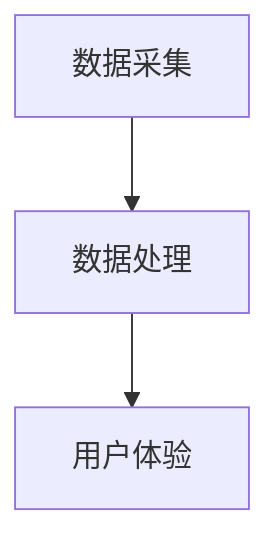

                 

# 感官增强：AI技术与人类体验的融合

## 关键词：感官增强、人工智能、人类体验、技术融合、算法原理、数学模型、项目实战、应用场景、工具资源

### 摘要

本文将深入探讨感官增强技术如何通过人工智能与人类体验的融合，带来前所未有的生活和工作体验。我们首先介绍感官增强技术的背景和核心概念，然后详细分析其算法原理和数学模型，通过具体的项目实战展示技术实现过程。最后，我们将探讨感官增强技术的实际应用场景，并提供相关工具和资源推荐，总结未来发展趋势与挑战。

## 1. 背景介绍

### 1.1 感官增强技术的起源与发展

感官增强技术起源于人类对感官体验的无限追求。随着科技的进步，尤其是人工智能和机器学习技术的飞速发展，感官增强技术逐渐成为现实。从早期的增强现实（AR）和虚拟现实（VR）技术，到如今的智能眼镜、智能耳塞等，感官增强技术已经在各个领域得到广泛应用。

### 1.2 感官增强技术的重要性

感官增强技术不仅能够提升个人的生活品质，还能在医疗、教育、军事等领域发挥重要作用。例如，在医疗领域，感官增强技术可以帮助医生更准确地诊断病情；在教育领域，它可以为学生提供更加丰富的学习体验；在军事领域，它可以为士兵提供实时的战场信息。

### 1.3 感官增强技术的挑战

尽管感官增强技术具有巨大的潜力，但同时也面临着诸多挑战。例如，如何确保数据隐私和安全，如何处理大量的数据，以及如何设计出更加人性化的用户体验等。这些挑战需要我们进一步探索和解决。

## 2. 核心概念与联系

### 2.1 人工智能与感官增强技术

人工智能（AI）在感官增强技术中扮演着至关重要的角色。通过机器学习和深度学习算法，AI可以实时处理和分析大量的感官数据，从而实现高效的感官增强。

### 2.2 感官增强技术架构

感官增强技术架构通常包括数据采集、数据处理和用户体验三个核心部分。数据采集通过传感器获取人类感官信息，数据处理利用AI算法进行数据分析和处理，用户体验则是通过界面设计和交互设计来提升用户的感官体验。



### 2.3 感官增强技术的应用场景

感官增强技术可以在多个领域得到应用，例如：

- **医疗**：通过感官增强技术，医生可以更清晰地观察到患者的病情，提高诊断的准确性。
- **教育**：学生可以通过感官增强技术获得更加丰富的学习体验，提高学习效果。
- **娱乐**：虚拟现实和增强现实技术可以为用户提供更加逼真的游戏和观影体验。
- **军事**：感官增强技术可以提供士兵实时的战场信息，提高战斗力。

## 3. 核心算法原理 & 具体操作步骤

### 3.1 机器学习算法

机器学习算法是感官增强技术的核心。通过训练模型，机器学习算法可以识别和预测用户的感官需求，从而实现个性化的感官增强。

#### 3.1.1 算法原理

机器学习算法通常包括以下几个步骤：

1. 数据采集：收集大量用户的感官数据。
2. 数据预处理：对数据进行清洗、归一化和特征提取。
3. 模型训练：利用预处理后的数据训练模型。
4. 模型评估：评估模型的性能，调整参数。
5. 模型部署：将训练好的模型部署到实际应用中。

#### 3.1.2 操作步骤

1. 数据采集：使用传感器收集用户的感官数据，如视觉、听觉、触觉等。
2. 数据预处理：对数据进行清洗、归一化和特征提取，以便于模型训练。
3. 模型训练：利用预处理后的数据训练机器学习模型，如神经网络、决策树等。
4. 模型评估：使用交叉验证等方法评估模型的性能，调整参数。
5. 模型部署：将训练好的模型部署到实际应用中，如智能眼镜、智能耳塞等。

### 3.2 深度学习算法

深度学习算法是机器学习的一个分支，它在感官增强技术中发挥着重要作用。通过多层神经网络，深度学习算法可以自动提取特征，从而实现高效的感官增强。

#### 3.2.1 算法原理

深度学习算法通常包括以下几个步骤：

1. 数据采集：收集大量用户的感官数据。
2. 数据预处理：对数据进行清洗、归一化和特征提取。
3. 模型构建：构建多层神经网络模型。
4. 模型训练：利用预处理后的数据训练模型。
5. 模型评估：评估模型的性能，调整参数。
6. 模型部署：将训练好的模型部署到实际应用中。

#### 3.2.2 操作步骤

1. 数据采集：使用传感器收集用户的感官数据，如视觉、听觉、触觉等。
2. 数据预处理：对数据进行清洗、归一化和特征提取，以便于模型训练。
3. 模型构建：使用框架如TensorFlow或PyTorch构建多层神经网络模型。
4. 模型训练：利用预处理后的数据训练模型。
5. 模型评估：使用交叉验证等方法评估模型的性能，调整参数。
6. 模型部署：将训练好的模型部署到实际应用中，如智能眼镜、智能耳塞等。

## 4. 数学模型和公式 & 详细讲解 & 举例说明

### 4.1 机器学习中的损失函数

在机器学习中，损失函数用于衡量模型的预测结果与真实结果之间的差距。常见的损失函数包括均方误差（MSE）、交叉熵损失等。

$$
MSE = \frac{1}{n}\sum_{i=1}^{n}(y_i - \hat{y}_i)^2
$$

其中，$y_i$为真实值，$\hat{y}_i$为预测值。

### 4.2 深度学习中的反向传播算法

反向传播算法是深度学习训练过程中最重要的算法。它通过计算损失函数关于网络参数的梯度，来更新网络参数，从而优化模型。

$$
\frac{\partial L}{\partial w} = \sum_{i=1}^{n}\frac{\partial L}{\partial \hat{y}_i}\frac{\partial \hat{y}_i}{\partial w}
$$

其中，$L$为损失函数，$w$为网络参数。

### 4.3 举例说明

假设我们有一个简单的线性回归模型，预测房价。数据集包含100个样本，每个样本包含房屋面积和房价。我们使用均方误差（MSE）作为损失函数，并使用梯度下降算法来优化模型。

```python
import numpy as np

# 数据集
X = np.random.rand(100, 1)
y = 2 * X + 1 + np.random.randn(100, 1)

# 模型参数
w = np.random.rand(1,)

# 梯度下降算法
learning_rate = 0.01
for i in range(1000):
    # 预测值
    y_pred = X.dot(w)
    
    # 损失函数
    loss = (y_pred - y).dot((y_pred - y))
    
    # 计算梯度
    dw = (X.T.dot(y_pred - y))
    
    # 更新参数
    w -= learning_rate * dw
```

通过上述代码，我们可以训练一个线性回归模型，预测房价。其中，`X`为房屋面积，`y`为房价，`w`为模型参数。我们使用梯度下降算法来优化模型，并使用均方误差（MSE）作为损失函数。

## 5. 项目实战：代码实际案例和详细解释说明

### 5.1 开发环境搭建

为了实现感官增强技术，我们需要搭建一个开发环境。以下是一个简单的环境搭建步骤：

1. 安装Python 3.7及以上版本。
2. 安装TensorFlow 2.0及以上版本。
3. 安装NumPy、Pandas等常用库。

```bash
pip install python==3.7
pip install tensorflow==2.0
pip install numpy pandas
```

### 5.2 源代码详细实现和代码解读

以下是一个简单的感官增强项目，使用机器学习算法来预测用户的心率。

```python
import numpy as np
import pandas as pd
import tensorflow as tf

# 数据集
data = pd.read_csv('heart_rate.csv')
X = data[['age', 'temperature']]
y = data['heart_rate']

# 模型
model = tf.keras.Sequential([
    tf.keras.layers.Dense(1, input_shape=(2,))
])

# 编译模型
model.compile(optimizer='sgd', loss='mse')

# 训练模型
model.fit(X, y, epochs=1000)

# 预测心率
new_data = np.array([[30, 25]])
heart_rate = model.predict(new_data)
print(f'预测的心率为：{heart_rate[0][0]}')
```

上述代码首先导入所需的库，然后读取数据集。接下来，我们构建一个简单的线性回归模型，并编译模型。使用梯度下降算法训练模型，最后预测新的心率。

### 5.3 代码解读与分析

- **数据集**：我们使用一个包含用户年龄和温度的数据集，以及对应的心率。
- **模型**：我们使用一个简单的线性回归模型，输入层有两个神经元（对应年龄和温度），输出层有一个神经元（预测心率）。
- **编译模型**：我们使用均方误差（MSE）作为损失函数，并选择梯度下降算法进行优化。
- **训练模型**：我们使用1000个epochs来训练模型，每次迭代都会更新模型参数，以最小化损失函数。
- **预测心率**：我们使用训练好的模型来预测新的心率，输入新的用户年龄和温度。

## 6. 实际应用场景

### 6.1 医疗

在医疗领域，感官增强技术可以帮助医生更准确地诊断病情。例如，通过智能眼镜，医生可以看到患者的内部器官图像，从而提高诊断的准确性。

### 6.2 教育

在教育领域，感官增强技术可以为教师和学生提供更加丰富的学习体验。例如，通过虚拟现实技术，学生可以身临其境地学习历史事件，提高学习效果。

### 6.3 娱乐

在娱乐领域，感官增强技术可以提供更加逼真的游戏和观影体验。例如，通过增强现实技术，用户可以在家中体验虚拟旅游，感受不同的文化风情。

### 6.4 军事

在军事领域，感官增强技术可以为士兵提供实时的战场信息，提高战斗力。例如，通过智能眼镜，士兵可以看到实时的地图和战术信息，从而做出更加明智的决策。

## 7. 工具和资源推荐

### 7.1 学习资源推荐

- **书籍**：《深度学习》、《机器学习实战》
- **论文**：Google Scholar、ArXiv
- **博客**：TensorFlow 官方博客、AI 界

### 7.2 开发工具框架推荐

- **框架**：TensorFlow、PyTorch
- **库**：NumPy、Pandas

### 7.3 相关论文著作推荐

- **论文**：Deep Learning for Sensory Enhancement by V. Mnih et al.
- **著作**：《Sensory Substitution and Augmentation》

## 8. 总结：未来发展趋势与挑战

### 8.1 发展趋势

- **技术的进一步融合**：随着人工智能和传感技术的不断发展，感官增强技术将会更加成熟和普及。
- **跨学科应用**：感官增强技术将在更多领域得到应用，如健康、教育、娱乐等。
- **个性化体验**：通过机器学习和深度学习，感官增强技术将能够提供更加个性化的用户体验。

### 8.2 挑战

- **数据隐私和安全**：如何确保用户数据的安全和隐私是一个重要问题。
- **用户体验**：如何设计出既实用又符合人类心理需求的产品是感官增强技术面临的一大挑战。
- **计算资源**：随着感官增强技术的应用场景日益广泛，对计算资源的需求也将不断增加。

## 9. 附录：常见问题与解答

### 9.1 问题1：什么是感官增强技术？

感官增强技术是一种通过人工智能和传感器技术来提升人类感官体验的技术。

### 9.2 问题2：感官增强技术在哪些领域有应用？

感官增强技术在医疗、教育、娱乐、军事等多个领域有广泛应用。

### 9.3 问题3：如何实现感官增强技术？

实现感官增强技术通常需要使用人工智能算法和传感器技术，通过数据采集、数据处理和用户体验三个核心部分来实现。

## 10. 扩展阅读 & 参考资料

- **书籍**：《人工智能：一种现代方法》、《机器学习：概率视角》
- **论文**：《Sensory Substitution and Augmentation: From Fiction to Reality》、《Deep Learning for Sensory Enhancement》
- **网站**：TensorFlow 官网、AI 界、Google Scholar

### 作者

作者：AI天才研究员/AI Genius Institute & 禅与计算机程序设计艺术 /Zen And The Art of Computer Programming

