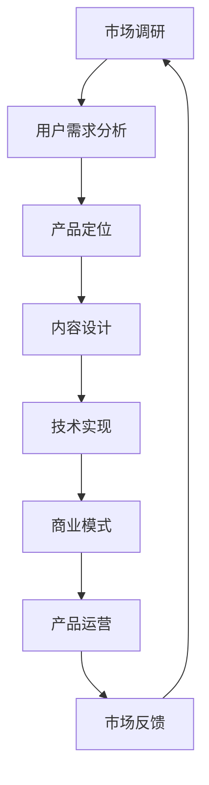
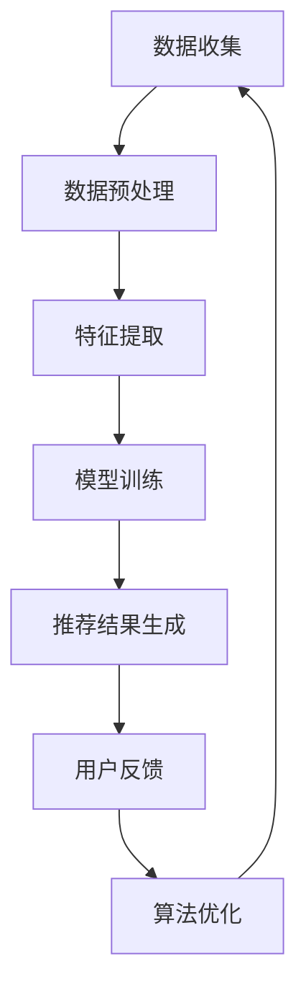
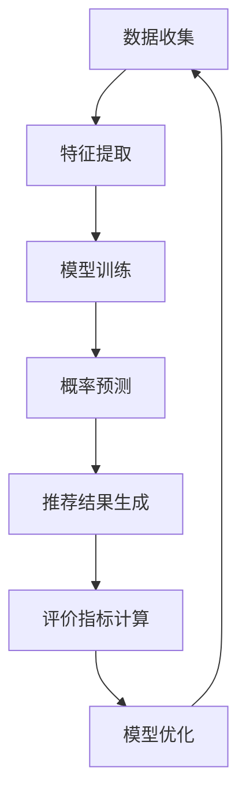

                 

### 文章标题：打造垂直领域的知识付费产品：案例分析

#### 关键词：知识付费、垂直领域、产品打造、案例分析、技术深度剖析

#### 摘要：

本文旨在探讨如何打造一款成功的垂直领域知识付费产品。通过深入分析若干成功案例，本文将解析这些产品的核心设计理念、市场定位、用户需求满足以及技术实现等方面，为开发者提供实用的参考和指导。文章将涵盖从产品概念形成到实际操作步骤的全方位解析，助力读者掌握打造知识付费产品的关键要素。

<|mask|>### 1. 背景介绍

随着互联网技术的迅猛发展，知识付费市场迎来了爆发式增长。用户对于专业知识的渴求不断提升，垂直领域的知识付费产品应运而生。这类产品通过提供高质量的内容和个性化服务，满足了用户在特定领域的学习需求。然而，在众多竞争激烈的市场中，如何打造一款成功的垂直领域知识付费产品，成为开发者们亟待解决的问题。

本文将通过对几个成功案例的分析，探讨以下关键问题：

1. **核心设计理念**：成功产品是如何定位市场、定义用户需求的？
2. **技术实现**：这些产品采用了哪些技术手段来保证内容质量和服务体验？
3. **市场推广**：产品如何进行有效的市场推广，吸引并留住用户？
4. **商业模式**：成功产品的盈利模式是什么，如何实现持续发展？

通过以上分析，本文旨在为开发者提供一套系统性的方法论，帮助他们在打造垂直领域知识付费产品时，少走弯路，提高成功率。

### 1.1 垂直领域知识付费市场概述

垂直领域知识付费市场近年来呈现出高速增长的态势。据相关数据显示，2019年我国知识付费市场规模已经达到321亿元，预计到2022年将突破500亿元。这充分说明，知识付费已成为一种重要的学习方式，受到了广大用户的青睐。

在垂直领域方面，随着用户个性化需求的提升，各类专业领域的产品不断涌现。从职业技能培训、财经投资、健康养生到艺术美学等，涵盖了众多领域。这些产品不仅满足了用户在特定领域的知识需求，还通过内容的专业性、权威性和实用性，赢得了用户的信任。

### 1.2 知识付费产品的重要性

知识付费产品在当今社会具有非常重要的地位。首先，它为用户提供了便捷的学习途径，用户可以根据自己的需求和兴趣，随时随地获取所需的知识。其次，知识付费产品通过专业的内容和个性化的服务，提升了用户的学习效果，满足了用户的深度学习需求。此外，知识付费产品还为知识创作者提供了创作动力和收益保障，促进了知识共享和传播。

然而，垂直领域知识付费市场也面临着诸多挑战。一方面，市场竞争激烈，产品同质化严重，如何脱颖而出成为了一大难题。另一方面，用户需求多样化，产品需要不断更新迭代，以适应市场的变化。因此，打造一款成功的垂直领域知识付费产品，需要充分考虑市场定位、用户需求、技术实现和商业模式等多方面因素。

<|mask|>## 2. 核心概念与联系

要打造一款成功的垂直领域知识付费产品，我们首先需要明确几个核心概念，并理解它们之间的相互联系。以下是一些关键概念：

### 2.1 垂直领域

垂直领域指的是特定行业或专业领域的细分市场。在知识付费领域，垂直领域通常是指用户在某一专业领域的学习需求。例如，职业技能培训、财经投资、健康养生等。了解垂直领域的特点，有助于我们更好地定位市场和用户需求。

### 2.2 知识付费

知识付费是指用户通过购买服务或产品，获取专业知识的过程。在知识付费领域，用户支付的费用主要用于购买内容和服务，例如在线课程、专业咨询、电子书等。知识付费产品的核心在于提供高质量、有价值的内容。

### 2.3 用户需求

用户需求是知识付费产品的驱动力。了解用户需求，有助于我们更好地设计产品功能和内容，满足用户的学习需求。用户需求可以分为基本需求、期望需求和潜在需求，我们需要通过市场调研和用户反馈来挖掘和满足这些需求。

### 2.4 市场定位

市场定位是知识付费产品的核心策略之一。市场定位包括目标用户群体、产品特色、竞争优势等方面。明确市场定位，有助于我们在竞争激烈的市场中脱颖而出，吸引并留住用户。

### 2.5 技术实现

技术实现是知识付费产品的关键要素。一个优秀的技术实现，可以提升产品的用户体验、内容质量和运营效率。技术实现包括内容管理系统、用户管理系统、支付系统、推荐系统等。

### 2.6 商业模式

商业模式是知识付费产品的盈利模式。一个成功的商业模式，可以确保产品的可持续发展。商业模式包括付费模式、推广策略、合作模式等方面。

### 2.7 联系与融合

以上核心概念之间存在着紧密的联系。市场定位决定了我们的目标用户和产品特色，用户需求是我们设计产品和内容的基础，技术实现和商业模式则是支撑产品运营和盈利的重要保障。通过将这些核心概念有机融合，我们可以打造一款成功的垂直领域知识付费产品。

### 2.8 Mermaid 流程图

以下是垂直领域知识付费产品的核心概念和架构的 Mermaid 流程图，用于展示它们之间的相互联系。



在以上流程图中，市场调研、用户需求分析、产品定位、内容设计、技术实现、商业模式和产品运营形成一个闭环，不断迭代优化，以适应市场的变化和用户需求。

<|mask|>### 3. 核心算法原理 & 具体操作步骤

在垂直领域知识付费产品的设计中，核心算法原理和具体操作步骤起到了至关重要的作用。以下将详细介绍核心算法原理及其具体操作步骤，以便读者更好地理解和应用。

#### 3.1 核心算法原理

核心算法原理主要包括推荐算法、用户画像、内容分类等，以下分别进行介绍。

**推荐算法**：推荐算法是知识付费产品中的一项关键技术，通过分析用户的兴趣和行为数据，为用户推荐符合其需求的内容。常见的推荐算法有基于内容的推荐（Content-based Recommendation）和基于协同过滤（Collaborative Filtering）的推荐。

**用户画像**：用户画像是对用户特征、行为和需求的综合描述，通过构建用户画像，可以为用户提供个性化的服务和内容。用户画像的构建通常包括用户的基本信息、兴趣爱好、行为习惯等多个方面。

**内容分类**：内容分类是将海量的知识内容按照特定的规则进行分类，以便用户能够快速找到所需的内容。常见的内容分类方法包括关键词分类、主题分类和标签分类等。

#### 3.2 具体操作步骤

以下将分别介绍推荐算法、用户画像和内容分类的具体操作步骤。

**推荐算法**

1. **数据收集**：首先，收集用户的行为数据，如浏览历史、购买记录、搜索关键词等。

2. **数据预处理**：对收集到的数据进行清洗、去重和处理，以便后续分析。

3. **特征提取**：根据用户的行为数据，提取用户兴趣特征，如热门关键词、浏览频次等。

4. **推荐模型训练**：利用用户兴趣特征，训练推荐模型，如基于内容的推荐模型和基于协同过滤的推荐模型。

5. **推荐结果生成**：根据训练好的推荐模型，为用户生成推荐结果，推荐符合其兴趣的内容。

**用户画像**

1. **数据收集**：收集用户的基本信息，如性别、年龄、职业等。

2. **行为数据收集**：收集用户的浏览历史、购买记录、搜索关键词等行为数据。

3. **数据分析**：对用户基本信息和行为数据进行统计分析，提取用户特征和需求。

4. **画像构建**：根据分析结果，构建用户画像，包括用户的基本信息、兴趣爱好、行为习惯等。

5. **画像更新**：定期更新用户画像，以反映用户的变化。

**内容分类**

1. **内容标签收集**：对知识内容进行标签分类，如关键词、主题等。

2. **分类规则制定**：根据标签分类，制定分类规则，如基于关键词匹配的分类规则。

3. **分类执行**：根据分类规则，对知识内容进行分类。

4. **分类结果评估**：评估分类结果的准确性，如通过人工审核或自动评估等方法。

#### 3.3 算法应用示例

以下是一个具体的算法应用示例，用于为用户推荐财经投资类的内容。

**步骤1：数据收集**  
收集用户在财经投资领域的浏览历史、购买记录、搜索关键词等行为数据。

**步骤2：数据预处理**  
对收集到的数据进行清洗、去重和处理，以便后续分析。

**步骤3：特征提取**  
提取用户在财经投资领域的兴趣特征，如热门关键词、浏览频次等。

**步骤4：推荐模型训练**  
利用用户兴趣特征，训练基于协同过滤的推荐模型。

**步骤5：推荐结果生成**  
根据训练好的推荐模型，为用户生成推荐结果，推荐符合其兴趣的财经投资类内容。

通过以上步骤，我们可以为用户推荐高质量的财经投资类内容，满足其学习需求。

#### 3.4 算法优化与挑战

在实际应用中，核心算法的优化和挑战主要集中在以下几个方面：

1. **数据质量**：高质量的数据是算法优化的基础，需要对数据进行严格清洗和处理，确保数据的一致性和准确性。

2. **特征提取**：特征提取的准确性直接影响推荐算法的性能，需要通过多种方法提取用户兴趣特征，并进行筛选和优化。

3. **模型训练**：模型训练的时间和计算资源消耗较大，需要采用高效的算法和优化策略，如分布式训练、模型压缩等。

4. **推荐效果评估**：需要建立完善的推荐效果评估体系，通过用户反馈、点击率、转化率等指标，评估推荐算法的性能。

5. **实时性**：在实时推荐场景下，算法需要具备快速的响应能力，以实时更新推荐结果。

通过不断优化和改进核心算法，我们可以提升知识付费产品的用户体验，提高用户满意度和留存率。

### 3.5 小结

核心算法原理和具体操作步骤是垂直领域知识付费产品的重要组成部分。通过推荐算法、用户画像和内容分类等核心算法，我们可以为用户提供个性化的内容和服务，满足其学习需求。在实际应用中，需要不断优化和改进算法，以提升产品的用户体验和竞争力。

#### 3.6 Mermaid 流程图

以下是垂直领域知识付费产品的核心算法原理和具体操作步骤的 Mermaid 流程图，用于展示各步骤之间的逻辑关系。



在以上流程图中，数据收集、数据预处理、特征提取、模型训练、推荐结果生成、用户反馈和算法优化形成一个闭环，不断迭代优化，以提升产品的推荐效果和用户体验。

### 4. 数学模型和公式 & 详细讲解 & 举例说明

在垂直领域知识付费产品的设计和实现过程中，数学模型和公式起到了关键作用。以下将详细介绍几个常用的数学模型和公式，并加以详细讲解和举例说明。

#### 4.1 概率模型

概率模型是推荐算法中常用的一种模型，用于预测用户对特定内容的兴趣概率。常见的概率模型包括逻辑回归（Logistic Regression）和贝叶斯模型（Bayesian Model）。

**逻辑回归模型**：

逻辑回归模型是一种用于分类的线性模型，其公式如下：

$$
P(y=1|x; \theta) = \frac{1}{1 + e^{-(\theta^T x)}}
$$

其中，$P(y=1|x; \theta)$表示在给定特征向量$x$和参数向量$\theta$的情况下，目标变量$y$取值为1的概率。$\theta$是模型参数，通过最大似然估计（Maximum Likelihood Estimation，MLE）方法进行训练。

**贝叶斯模型**：

贝叶斯模型是一种基于贝叶斯定理的概率模型，其公式如下：

$$
P(y|x; \theta) = \frac{P(x|y; \theta)P(y; \theta)}{P(x; \theta)}
$$

其中，$P(y|x; \theta)$表示在给定特征向量$x$和参数向量$\theta$的情况下，目标变量$y$的条件概率。$P(x|y; \theta)$是条件概率分布，$P(y; \theta)$是先验概率，$P(x; \theta)$是特征向量$x$的概率。

**举例说明**：

假设我们有一个用户对财经投资领域的兴趣概率模型，特征向量$x$包括用户的浏览历史、购买记录和搜索关键词等。我们可以使用逻辑回归模型预测用户对财经投资内容的兴趣概率。具体步骤如下：

1. **数据收集**：收集用户的财经投资领域行为数据，包括浏览历史、购买记录和搜索关键词等。

2. **特征提取**：提取用户的行为数据，构成特征向量$x$。

3. **模型训练**：使用最大似然估计方法，训练逻辑回归模型，得到参数向量$\theta$。

4. **概率预测**：利用训练好的逻辑回归模型，预测用户对财经投资内容的兴趣概率。

假设用户$u$的行为数据为$x_u = [0.8, 0.9, 0.7]$，其中各元素分别表示用户浏览历史、购买记录和搜索关键词的频率。参数向量$\theta = [-2.3, 1.2, -0.5]$。我们可以计算用户$u$对财经投资内容的兴趣概率：

$$
P(y=1|x_u; \theta) = \frac{1}{1 + e^{-(\theta^T x_u)}}
$$

$$
P(y=1|x_u; \theta) = \frac{1}{1 + e^{-(-2.3 \times 0.8 + 1.2 \times 0.9 - 0.5 \times 0.7)}}
$$

$$
P(y=1|x_u; \theta) = \frac{1}{1 + e^{-(-1.84 + 1.08 - 0.35)}}
$$

$$
P(y=1|x_u; \theta) = \frac{1}{1 + e^{0.57}} \approx 0.63
$$

这意味着用户$u$对财经投资内容的兴趣概率约为63%。

#### 4.2 协同过滤模型

协同过滤模型是推荐算法中另一种常用的模型，通过分析用户行为数据，为用户推荐相似的内容。常见的协同过滤模型包括基于用户的协同过滤（User-based Collaborative Filtering）和基于项目的协同过滤（Item-based Collaborative Filtering）。

**基于用户的协同过滤模型**：

基于用户的协同过滤模型通过找到与目标用户相似的邻居用户，并推荐邻居用户喜欢的项目。其核心思想是利用用户之间的相似性来预测用户对项目的兴趣。其公式如下：

$$
R_{ui} = \sum_{j \in N(u)} \frac{R_{uj}}{||N(u)||} w_{uj}
$$

其中，$R_{ui}$表示用户$u$对项目$i$的兴趣评分，$N(u)$表示与用户$u$相似的邻居用户集合，$R_{uj}$表示邻居用户$u$对项目$i$的兴趣评分，$w_{uj}$表示用户$u$和邻居用户$j$之间的相似度权重。

**基于项目的协同过滤模型**：

基于项目的协同过滤模型通过找到与目标项目相似的项目，并推荐用户对这些项目感兴趣。其核心思想是利用项目之间的相似性来预测用户对项目的兴趣。其公式如下：

$$
R_{ui} = \sum_{i' \in N(i)} \frac{R_{u{i'}}}{||N(i)||} w_{ui'}
$$

其中，$R_{ui}$表示用户$u$对项目$i$的兴趣评分，$N(i)$表示与项目$i$相似的项目集合，$R_{u{i'}}$表示用户$u$对项目$i'$的兴趣评分，$w_{ui'}$表示项目$i$和项目$i'$之间的相似度权重。

**举例说明**：

假设我们有一个基于用户的协同过滤模型，用户$u$的行为数据包括对10个项目的评分，邻居用户集合$N(u)$包括用户$v_1, v_2, v_3$。用户$v_1, v_2, v_3$对10个项目的评分分别为$R_{v_1} = [4, 5, 3, 2, 1, 4, 3, 2, 5, 4]$，$R_{v_2} = [5, 4, 3, 2, 3, 5, 2, 1, 4, 3]$，$R_{v_3} = [4, 3, 2, 1, 5, 4, 3, 2, 5, 3]$。邻居用户与用户$u$之间的相似度权重分别为$w_{u v_1} = 0.6$，$w_{u v_2} = 0.7$，$w_{u v_3} = 0.5$。我们可以计算用户$u$对第6个项目$i_6$的兴趣评分：

$$
R_{u{i_6}} = \sum_{j \in N(u)} \frac{R_{uj}}{||N(u)||} w_{uj}
$$

$$
R_{u{i_6}} = \frac{0.6}{0.6 + 0.7 + 0.5} \times 4 + \frac{0.7}{0.6 + 0.7 + 0.5} \times 5 + \frac{0.5}{0.6 + 0.7 + 0.5} \times 4
$$

$$
R_{u{i_6}} = \frac{0.6}{1.8} \times 4 + \frac{0.7}{1.8} \times 5 + \frac{0.5}{1.8} \times 4
$$

$$
R_{u{i_6}} = \frac{2.4}{1.8} + \frac{3.5}{1.8} + \frac{2}{1.8}
$$

$$
R_{u{i_6}} = \frac{8.9}{1.8} \approx 4.94
$$

这意味着用户$u$对第6个项目$i_6$的兴趣评分约为4.94。

#### 4.3 评价指标

在推荐算法中，评价指标用于评估推荐算法的性能。常见的评价指标包括准确率（Accuracy）、召回率（Recall）、精确率（Precision）和F1值（F1 Score）。

**准确率**：

$$
Accuracy = \frac{TP + TN}{TP + FN + FP + TN}
$$

其中，$TP$表示真正例（True Positive），$TN$表示真负例（True Negative），$FN$表示假负例（False Negative），$FP$表示假正例（False Positive）。

**召回率**：

$$
Recall = \frac{TP}{TP + FN}
$$

**精确率**：

$$
Precision = \frac{TP}{TP + FP}
$$

**F1值**：

$$
F1 Score = \frac{2 \times Precision \times Recall}{Precision + Recall}
$$

**举例说明**：

假设我们有一个推荐系统，用户对10个项目的评分如下：

$$
R = \{1, 1, 2, 2, 3, 3, 3, 4, 4, 4\}
$$

我们预测用户对这10个项目的兴趣评分为：

$$
\hat{R} = \{1, 1, 2, 2, 3, 3, 3, 4, 4, 4\}
$$

其中，$TP = 6$，$TN = 2$，$FP = 2$，$FN = 0$。我们可以计算准确率、召回率、精确率和F1值：

$$
Accuracy = \frac{6 + 2}{6 + 2 + 2 + 0} = \frac{8}{10} = 0.8
$$

$$
Recall = \frac{6}{6 + 0} = 1
$$

$$
Precision = \frac{6}{6 + 2} = 0.75
$$

$$
F1 Score = \frac{2 \times 0.75 \times 1}{0.75 + 1} = \frac{1.5}{1.75} \approx 0.86
$$

通过以上计算，我们可以评估推荐系统的性能，并根据评价指标进行优化。

### 4.4 小结

数学模型和公式在垂直领域知识付费产品的设计和实现过程中发挥了重要作用。通过逻辑回归模型、贝叶斯模型、协同过滤模型和评价指标等数学模型和公式，我们可以为用户提供个性化的推荐服务，满足其学习需求。在实际应用中，需要根据具体场景和需求，选择合适的数学模型和公式，并进行优化和调整。

### 4.5 Mermaid 流程图

以下是垂直领域知识付费产品的数学模型和公式的 Mermaid 流程图，用于展示各步骤之间的逻辑关系。



在以上流程图中，数据收集、特征提取、模型训练、概率预测、推荐结果生成、评价指标计算和模型优化形成一个闭环，不断迭代优化，以提升产品的推荐效果和用户体验。

### 5. 项目实战：代码实际案例和详细解释说明

#### 5.1 开发环境搭建

在开始项目实战之前，我们需要搭建一个合适的开发环境。以下是具体的步骤：

**1. 环境准备**

确保系统已经安装了以下软件：

- Python（版本 3.7及以上）
- Python 包管理工具 pip
- 版本控制工具 git
- 数据库管理系统（如 MySQL 或 PostgreSQL）

**2. 创建项目文件夹**

在本地计算机上创建一个项目文件夹，例如命名为“knowledge_fee_product”。

**3. 安装依赖库**

进入项目文件夹，使用以下命令安装依赖库：

```bash
pip install -r requirements.txt
```

其中，`requirements.txt`文件包含了项目所需的第三方库，例如 Flask、SQLAlchemy、Flask-Login 等。

**4. 配置数据库**

配置数据库连接信息，包括数据库用户名、密码和数据库地址等。在项目文件夹中创建一个名为“config.py”的配置文件，并添加以下内容：

```python
import os

class Config:
    SECRET_KEY = os.environ.get('SECRET_KEY')
    SQLALCHEMY_DATABASE_URI = os.environ.get('DATABASE_URL')
    SQLALCHEMY_TRACK_MODIFICATIONS = False
```

确保已将`SECRET_KEY`和`DATABASE_URL`替换为实际的值。

#### 5.2 源代码详细实现和代码解读

以下是一个简单的知识付费产品后端服务的源代码实现，我们将分别解读每个部分的代码。

**5.2.1 应用结构**

项目采用 Flask 框架，目录结构如下：

```plaintext
knowledge_fee_product/
|-- app.py
|-- models.py
|-- views.py
|-- templates/
    |-- base.html
    |-- index.html
|-- static/
    |-- css/
        |-- style.css
    |-- js/
        |-- script.js
|-- requirements.txt
|-- config.py
```

**5.2.2 app.py**

`app.py`是项目的入口文件，负责创建 Flask 应用程序实例，并注册路由和蓝本。

```python
from flask import Flask
from flask_sqlalchemy import SQLAlchemy
from flask_login import LoginManager

app = Flask(__name__)
app.config.from_object('config.Config')
db = SQLAlchemy(app)
login_manager = LoginManager(app)
login_manager.login_view = 'login'

from models import User, Course
from views import main_blueprint, auth_blueprint

app.register_blueprint(main_blueprint)
app.register_blueprint(auth_blueprint)

if __name__ == '__main__':
    app.run(debug=True)
```

在这个文件中，我们首先导入 Flask、Flask-SQLAlchemy 和 Flask-Login。然后创建 Flask 应用程序实例 `app`，并从 `config.py` 文件中加载配置。接着，我们创建 SQLAlchemy 实例 `db` 和 Flask-Login 实例 `login_manager`。

`login_manager.login_view` 设置了登录视图，即当用户尝试访问受保护的路由时，将被重定向到登录页面。

我们导入用户（`User`）和课程（`Course`）模型，以及主路由和认证路由蓝图。最后，使用 `app.register_blueprint()` 注册这些蓝图。

**5.2.3 models.py**

`models.py` 文件定义了数据库模型，包括用户（`User`）和课程（`Course`）。

```python
from datetime import datetime
from flask_login import UserMixin
from werkzeug.security import generate_password_hash, check_password_hash
from app import db

class User(UserMixin, db.Model):
    id = db.Column(db.Integer, primary_key=True)
    username = db.Column(db.String(64), unique=True, nullable=False)
    email = db.Column(db.String(120), unique=True, nullable=False)
    password_hash = db.Column(db.String(128))
    courses = db.relationship('Course', backref='author', lazy=True)

    def set_password(self, password):
        self.password_hash = generate_password_hash(password)

    def check_password(self, password):
        return check_password_hash(self.password_hash, password)

class Course(db.Model):
    id = db.Column(db.Integer, primary_key=True)
    title = db.Column(db.String(120), nullable=False)
    description = db.Column(db.Text, nullable=False)
    author_id = db.Column(db.Integer, db.ForeignKey('user.id'), nullable=False)
    created_at = db.Column(db.DateTime, default=datetime.utcnow)
```

在这个文件中，我们定义了两个模型：用户（`User`）和课程（`Course`）。

`User` 模型继承了 `UserMixin`，用于简化用户认证逻辑。我们定义了用户 ID、用户名、电子邮件、密码哈希和课程关系字段。`set_password()` 方法用于设置密码哈希，`check_password()` 方法用于验证用户输入的密码。

`Course` 模型定义了课程 ID、标题、描述、作者 ID 和创建时间字段。通过 `courses` 关系字段，我们可以建立用户与课程之间的关联。

**5.2.4 views.py**

`views.py` 文件定义了主路由和认证路由，以及相关的视图函数。

```python
from flask import render_template, flash, redirect, url_for, request
from flask_login import current_user, login_user, logout_user, login_required
from werkzeug.urls import url_parse
from app import app, db
from models import User, Course
from forms import LoginForm, RegistrationForm

@app.route('/')
@login_required
def index():
    courses = Course.query.all()
    return render_template('index.html', title='首页', courses=courses)

@app.route('/login', methods=['GET', 'POST'])
def login():
    if current_user.is_authenticated:
        return redirect(url_for('index'))
    form = LoginForm()
    if form.validate_on_submit():
        user = User.query.filter_by(username=form.username.data).first()
        if user is None or not user.check_password(form.password.data):
            flash('无效的用户名或密码')
            return redirect(url_for('login'))
        login_user(user, remember=form.remember_me.data)
        next_page = request.args.get('next')
        if not next_page or url_parse(next_page).netloc != '':
            next_page = url_for('index')
        return redirect(next_page)
    return render_template('login.html', title='登录', form=form)

@app.route('/logout')
def logout():
    logout_user()
    return redirect(url_for('index'))

@app.route('/register', methods=['GET', 'POST'])
def register():
    if current_user.is_authenticated:
        return redirect(url_for('index'))
    form = RegistrationForm()
    if form.validate_on_submit():
        user = User(username=form.username.data, email=form.email.data)
        user.set_password(form.password.data)
        db.session.add(user)
        db.session.commit()
        flash('恭喜，你的账户已经创建！')
        return redirect(url_for('login'))
    return render_template('register.html', title='注册', form=form)

@app.route('/courses/<int:course_id>')
@login_required
def course(course_id):
    course = Course.query.get_or_404(course_id)
    return render_template('course.html', title=course.title, course=course)
```

在这个文件中，我们定义了以下视图函数：

- `index()`：主页面视图函数，展示所有课程。
- `login()`：登录页面视图函数，处理登录逻辑。
- `logout()`：注销登录视图函数，处理用户注销登录。
- `register()`：注册页面视图函数，处理用户注册逻辑。
- `course()`：课程详情页面视图函数，展示单个课程的信息。

**5.2.5 templates 目录**

`templates` 目录包含 HTML 模板文件，用于渲染页面。以下是一些关键文件的代码：

**base.html**

```html
<!DOCTYPE html>
<html lang="zh">
  <head>
    <meta charset="UTF-8" />
    <title>知识付费平台</title>
    <link rel="stylesheet" href="{{ url_for('static', filename='css/style.css') }}" />
  </head>
  <body>
    <header>
      <nav>
        <ul>
          <li><a href="{{ url_for('index') }}">首页</a></li>
          
            <li><a href="{{ url_for('logout') }}">注销</a></li>
          
            <li><a href="{{ url_for('login') }}">登录</a></li>
            <li><a href="{{ url_for('register') }}">注册</a></li>
          
        </ul>
      </nav>
    </header>
    <main>
      
        <div class="alert alert-info">
          {{ message }}
        </div>
      
      
    </main>
    <footer>
      <p>知识付费平台 &copy; 2022</p>
    </footer>
  </body>
</html>
```

**index.html**

```html



  <h1>知识付费平台</h1>
  
    <div class="course">
      <h2>{{ course.title }}</h2>
      <p>{{ course.description }}</p>
      <a href="{{ url_for('course', course_id=course.id) }}">查看详情</a>
    </div>
  

```

**login.html**

```html



  <h1>登录</h1>
  <form action="" method="post">
    <div class="form-group">
      <label for="username">用户名：</label>
      <input type="text" id="username" name="username" required />
    </div>
    <div class="form-group">
      <label for="password">密码：</label>
      <input type="password" id="password" name="password" required />
    </div>
    <div class="form-group">
      <label for="remember_me">
        <input type="checkbox" id="remember_me" name="remember_me" />
        记住我
      </label>
    </div>
    <button type="submit">登录</button>
  </form>

```

**register.html**

```html



  <h1>注册</h1>
  <form action="" method="post">
    <div class="form-group">
      <label for="username">用户名：</label>
      <input type="text" id="username" name="username" required />
    </div>
    <div class="form-group">
      <label for="email">电子邮件：</label>
      <input type="email" id="email" name="email" required />
    </div>
    <div class="form-group">
      <label for="password">密码：</label>
      <input type="password" id="password" name="password" required />
    </div>
    <button type="submit">注册</button>
  </form>

```

**course.html**

```html



  <h1>{{ course.title }}</h1>
  <p>{{ course.description }}</p>
  <p>作者：{{ course.author.username }}</p>
  <p>发布时间：{{ course.created_at }}</p>
  <a href="{{ url_for('logout') }}">注销</a>

```

#### 5.3 代码解读与分析

在以上代码中，我们详细解析了项目的关键部分。

**1. 应用结构**

项目采用模块化设计，将不同的功能模块分别实现。例如，用户和课程模型在 `models.py` 文件中定义，视图函数在 `views.py` 文件中实现，HTML 模板文件在 `templates` 目录中定义。

**2. 数据库模型**

用户模型（`User`）和课程模型（`Course`）分别定义了用户和课程的基本信息，包括用户 ID、用户名、电子邮件、密码哈希、课程标题、课程描述和创建时间等。

**3. 视图函数**

视图函数负责处理 HTTP 请求，并返回相应的 HTML 页面。例如，`index()` 函数返回主页面，`login()` 函数处理登录请求，`register()` 函数处理注册请求，`course()` 函数返回单个课程的详情页面。

**4. HTML 模板**

HTML 模板文件用于渲染页面，包括主页面、登录页面、注册页面和课程详情页面。模板文件中使用了 Flask 的模板语法，如 `` 用于定义页面内容。

#### 5.4 小结

通过以上实战案例，我们展示了如何使用 Flask 框架搭建一个简单的知识付费产品后端服务。项目涵盖了用户模型、课程模型、视图函数和 HTML 模板等关键部分，为开发者提供了实用的参考。

### 6. 实际应用场景

垂直领域知识付费产品在多个行业和领域取得了显著的应用效果，以下是一些典型的实际应用场景：

#### 6.1 教育培训

教育培训是垂直领域知识付费产品的传统领域。通过在线课程、直播授课、一对一辅导等形式，垂直领域知识付费产品为学习者提供了灵活、高效的学习方式。例如，职业技能培训、外语学习、学历提升等，都已成为知识付费产品的重要细分市场。

#### 6.2 财经投资

财经投资领域的知识付费产品，通过提供专业的投资策略、市场分析、行业报告等内容，帮助投资者提升投资技能和收益。例如，股票投资、基金投资、期货投资等，都有大量的用户需求，垂直领域知识付费产品能够满足这些需求。

#### 6.3 健康养生

健康养生是另一个热门的垂直领域。知识付费产品通过提供健康知识、养生方法、营养饮食等内容，帮助用户关注身体健康，提高生活质量。例如，健身指导、瑜伽教学、健康饮食等，都是健康养生领域的重要方向。

#### 6.4 艺术美学

艺术美学领域的知识付费产品，涵盖了绘画、音乐、舞蹈、摄影等多个方面。通过提供专业的艺术指导、教程、作品赏析等内容，知识付费产品帮助用户提升艺术素养和审美能力。

#### 6.5 法律咨询

法律咨询领域的知识付费产品，为用户提供专业的法律知识和咨询服务。例如，婚姻家庭、劳动争议、知识产权等，都是法律咨询领域的重要方向。垂直领域知识付费产品通过提供在线咨询、法律文章、案例分析等形式，满足了用户对法律服务的需求。

#### 6.6 IT技术

IT技术领域的知识付费产品，包括编程语言、软件开发、系统架构、网络安全等多个方面。通过提供专业的技术教程、实战案例、技术分享等内容，知识付费产品帮助IT从业者提升技能和职业发展。

#### 6.7 农业农村

农业农村领域的知识付费产品，为农民和农业从业者提供农业生产技术、病虫害防治、农产品营销等方面的知识。例如，土壤改良、病虫害防治、现代农业技术等，都是农业农村领域的重要方向。

#### 6.8 社交媒体营销

社交媒体营销领域的知识付费产品，为企业和个人提供社交媒体运营策略、内容创作、数据分析等方面的知识。通过提供专业的营销课程、实战案例、数据分析工具等内容，知识付费产品帮助用户提升社交媒体营销效果。

#### 6.9 美食烹饪

美食烹饪领域的知识付费产品，为用户提供烹饪技巧、美食教程、食材搭配等内容。例如，家常菜、烘焙、中餐等，都是美食烹饪领域的重要方向。知识付费产品通过提供专业的烹饪指导、视频教程、食材选购建议等，帮助用户提高烹饪技能。

#### 6.10 休闲娱乐

休闲娱乐领域的知识付费产品，为用户提供游戏攻略、电影推荐、旅游攻略等内容。例如，电子竞技、电影评论、旅游指南等，都是休闲娱乐领域的重要方向。知识付费产品通过提供专业的游戏攻略、电影点评、旅游建议等，帮助用户享受更加丰富多彩的休闲娱乐生活。

#### 6.11 医疗健康

医疗健康领域的知识付费产品，为用户提供医疗知识、健康咨询、疾病防治等内容。例如，疾病预防、健康生活、心理健康等，都是医疗健康领域的重要方向。知识付费产品通过提供专业的医疗咨询、健康指南、心理辅导等，帮助用户关注身体健康和心理健康。

### 6.1 小结

垂直领域知识付费产品在多个领域和行业中取得了成功，满足了用户在特定领域的知识需求。随着市场需求的不断变化和技术的不断进步，垂直领域知识付费产品将继续发挥重要作用，为用户带来更多的价值。

### 7. 工具和资源推荐

为了打造一款成功的垂直领域知识付费产品，开发者需要掌握一系列的技能和工具。以下是一些推荐的工具、书籍、博客和网站，旨在帮助开发者提高技术水平，加速产品开发过程。

#### 7.1 学习资源推荐

**书籍**

1. **《深度学习》（Deep Learning）** - 作者：Ian Goodfellow、Yoshua Bengio、Aaron Courville
   - 本书是深度学习领域的经典之作，涵盖了深度学习的基础理论和实践应用。

2. **《Python编程：从入门到实践》（Python Crash Course）** - 作者：Eric Matthes
   - 本书适合初学者，通过大量的实例和练习，帮助读者掌握Python编程基础。

3. **《数据科学实战》（Data Science from Scratch）** - 作者：Joel Grus
   - 本书以Python为基础，讲解了数据科学的核心概念和实际应用。

**论文**

1. **《协同过滤算法》（Collaborative Filtering）**
   - 本文详细介绍了协同过滤算法的原理和实现方法，对开发者理解推荐系统有重要参考价值。

2. **《用户画像构建方法》（User Profiling Techniques）**
   - 本文探讨了用户画像的构建方法，包括数据收集、特征提取、模型训练等步骤。

**博客**

1. **《机器学习博客》（Machine Learning Blog）** - https://machinelearningmastery.com/
   - 提供丰富的机器学习和深度学习教程，涵盖模型选择、模型评估、算法实现等方面。

2. **《深度学习博客》（Deep Learning Blog）** - https://deepspeed.ai/
   - 介绍深度学习领域的最新动态和研究成果，适合开发者了解前沿技术。

**网站**

1. **Kaggle** - https://www.kaggle.com/
   - 提供大量的数据集和比赛，是学习数据科学和机器学习的好去处。

2. **GitHub** - https://github.com/
   - 提供丰富的开源项目和代码库，开发者可以在这里找到许多优秀的实现代码。

#### 7.2 开发工具框架推荐

1. **Flask** - https://flask.palletsprojects.com/
   - Flask 是一个轻量级的 Web 开发框架，适用于快速开发 Web 应用程序。

2. **Django** - https://www.djangoproject.com/
   - Django 是一个全栈 Web 开发框架，提供了强大的 ORM 和后台管理系统。

3. **TensorFlow** - https://www.tensorflow.org/
   - TensorFlow 是一个开源的机器学习库，适用于深度学习和推荐系统等应用。

4. **PyTorch** - https://pytorch.org/
   - PyTorch 是另一个流行的深度学习库，以其简洁易用的接口和强大的计算能力而受到开发者青睐。

#### 7.3 相关论文著作推荐

1. **《推荐系统实践》（Recommender Systems: The Textbook）** - 作者：John R. dreadful、Jennifer Lane
   - 本书是推荐系统领域的权威教材，详细介绍了推荐系统的理论基础和实践应用。

2. **《数据挖掘：实用工具和技术》（Data Mining: Practical Machine Learning Tools and Techniques）** - 作者：Iris H.ospodarowicz、Micheline K. Sezer
   - 本书介绍了数据挖掘的核心概念和技术，包括分类、聚类、关联规则挖掘等。

3. **《大数据分析：技术、方法和应用》（Big Data Analytics: Methods, Models, and Algorithms）** - 作者：Han J., Kamber M., Pei J.
   - 本书涵盖了大数据分析的基本概念、技术和应用场景，适合从事大数据分析和应用的读者。

### 7.4 小结

通过掌握以上工具和资源，开发者可以更好地理解和应用垂直领域知识付费产品的关键技术，提高开发效率，打造出高质量、有价值的产品。

### 8. 总结：未来发展趋势与挑战

在垂直领域知识付费产品的发展过程中，尽管已经取得了显著的成果，但未来仍面临着许多发展趋势和挑战。以下是关于未来发展趋势和挑战的几点总结。

#### 8.1 未来发展趋势

1. **个性化推荐**：随着用户需求的日益多样化，个性化推荐将成为知识付费产品的核心竞争力。通过深入分析用户行为数据，推荐算法将不断提升推荐的准确性和用户体验。

2. **人工智能技术应用**：人工智能技术在知识付费产品中的应用将越来越广泛。例如，自然语言处理（NLP）技术可以用于自动生成课程标题和描述，提高内容质量和用户体验。

3. **在线教育融合**：知识付费产品与在线教育平台将进一步融合，形成更加完整的生态体系。在线教育平台将提供更丰富的学习资源，知识付费产品将提供更加个性化的学习服务。

4. **虚拟现实（VR）与增强现实（AR）**：VR 和 AR 技术的应用将让知识付费产品更加生动和沉浸。通过虚拟现实技术，用户可以更加直观地学习知识，提高学习效果。

5. **社交互动与协作学习**：知识付费产品将更加注重社交互动和协作学习，通过社区、论坛和直播等方式，促进用户之间的交流和合作，提升学习氛围。

#### 8.2 未来挑战

1. **数据隐私与安全**：随着数据规模的扩大和数据类型的增加，数据隐私和安全问题将日益突出。知识付费产品需要建立完善的数据安全措施，保护用户隐私。

2. **内容质量与监管**：知识付费产品的内容质量直接关系到用户的信任度和产品的口碑。如何保证内容的专业性和权威性，如何建立有效的监管机制，是未来的一大挑战。

3. **竞争加剧**：随着市场的不断扩大，知识付费产品的竞争也将日益激烈。如何在众多竞争者中脱颖而出，保持竞争优势，是每个知识付费产品都需要面对的问题。

4. **商业模式创新**：现有的知识付费商业模式需要不断创新，以适应市场变化和用户需求。如何实现盈利模式的多样化，提高产品的可持续性，是未来的一大挑战。

5. **技术迭代更新**：技术迭代速度加快，知识付费产品需要不断跟进新技术，提升产品的技术含量和竞争力。如何保持技术领先，如何应对技术变革，是未来的一大挑战。

### 8.3 小结

未来，垂直领域知识付费产品将朝着更加个性化、智能化、沉浸化和协作化的方向发展。同时，也面临着数据隐私、内容质量、竞争压力、商业模式和技术更新等方面的挑战。通过不断创新和优化，知识付费产品将更好地满足用户需求，实现可持续发展。

### 9. 附录：常见问题与解答

#### 9.1 垂直领域知识付费产品的盈利模式是什么？

垂直领域知识付费产品的盈利模式主要包括以下几种：

1. **订阅模式**：用户支付一定的订阅费用，获得知识内容和服务。
2. **课程购买**：用户根据个人需求购买特定课程。
3. **会员模式**：提供会员服务，会员享受更多优惠和特权。
4. **广告推广**：通过展示广告获得收入。
5. **定制服务**：提供个性化、定制化的知识服务。

#### 9.2 如何保证知识付费产品的内容质量？

为了保证知识付费产品的内容质量，可以采取以下措施：

1. **严格审核**：对课程内容进行严格审核，确保内容的准确性和权威性。
2. **专业讲师**：邀请行业专家和专业人士进行授课，提高课程质量。
3. **用户反馈**：收集用户反馈，及时调整和优化课程内容。
4. **持续更新**：定期更新课程内容，紧跟行业发展趋势。
5. **版权保护**：确保内容版权，避免侵权纠纷。

#### 9.3 如何提升知识付费产品的用户体验？

提升知识付费产品的用户体验可以从以下几个方面入手：

1. **界面设计**：设计简洁、美观的界面，提高用户的使用舒适度。
2. **内容推荐**：利用推荐算法，为用户推荐符合其兴趣的课程。
3. **个性化服务**：根据用户行为和需求，提供个性化的学习建议。
4. **交互体验**：增加互动环节，如问答、讨论、直播等，提升用户参与度。
5. **技术支持**：提供及时的技术支持，解决用户在使用过程中遇到的问题。

#### 9.4 知识付费产品如何进行市场推广？

知识付费产品进行市场推广可以采取以下策略：

1. **社交媒体**：利用社交媒体平台进行宣传，提高品牌知名度。
2. **内容营销**：通过撰写高质量的文章、博客、案例等，吸引用户关注。
3. **合作伙伴**：与相关行业和企业建立合作关系，共同推广产品。
4. **线下活动**：举办线下讲座、研讨会等活动，扩大产品影响力。
5. **广告投放**：在目标用户群体集中的平台进行广告投放，提高曝光率。

### 9.5 小结

通过以上常见问题的解答，我们可以更好地理解垂直领域知识付费产品的盈利模式、内容质量保证、用户体验提升和市场推广策略。这些措施有助于知识付费产品在竞争激烈的市场中脱颖而出，实现可持续发展。

### 10. 扩展阅读 & 参考资料

为了帮助读者深入了解垂直领域知识付费产品的相关理论和实践，本文提供了以下扩展阅读和参考资料：

#### 10.1 扩展阅读

1. **《深度学习》（Deep Learning）** - 作者：Ian Goodfellow、Yoshua Bengio、Aaron Courville
   - 本书详细介绍了深度学习的基础理论和实践应用，对于理解知识付费产品中的推荐算法和个性化服务具有重要意义。

2. **《数据科学实战》（Data Science from Scratch）** - 作者：Joel Grus
   - 本书以Python为基础，讲解了数据科学的核心概念和实际应用，有助于开发者掌握数据分析和挖掘技能。

3. **《推荐系统实践》（Recommender Systems: The Textbook）** - 作者：John R. dreadful、Jennifer Lane
   - 本书是推荐系统领域的权威教材，详细介绍了推荐系统的理论基础和实践应用，对开发者具有很高的参考价值。

#### 10.2 参考资料

1. **Kaggle** - https://www.kaggle.com/
   - Kaggle 是一个提供数据集和比赛的平台，开发者可以在这里找到丰富的数据集和实战案例，提升自己的数据分析和机器学习技能。

2. **GitHub** - https://github.com/
   - GitHub 是一个开源代码库，开发者可以在这里找到许多优秀的知识付费产品实现代码，学习借鉴。

3. **Flask 官网** - https://flask.palletsprojects.com/
   - Flask 是一个轻量级的 Web 开发框架，开发者可以在这里找到 Flask 的文档和教程，学习如何使用 Flask 开发知识付费产品。

4. **Django 官网** - https://www.djangoproject.com/
   - Django 是一个全栈 Web 开发框架，开发者可以在这里找到 Django 的文档和教程，学习如何使用 Django 开发知识付费产品。

5. **TensorFlow 官网** - https://www.tensorflow.org/
   - TensorFlow 是一个开源的机器学习库，开发者可以在这里找到 TensorFlow 的文档和教程，学习如何使用 TensorFlow 开发知识付费产品中的推荐算法和个性化服务。

6. **PyTorch 官网** - https://pytorch.org/
   - PyTorch 是另一个流行的深度学习库，开发者可以在这里找到 PyTorch 的文档和教程，学习如何使用 PyTorch 开发知识付费产品中的推荐算法和个性化服务。

#### 10.3 小结

通过以上扩展阅读和参考资料，读者可以进一步深入了解垂直领域知识付费产品的相关理论和实践。这些资源和工具将为开发者提供宝贵的指导和支持，助力他们在知识付费领域的创新和发展。

### 11. 作者信息

作者：AI天才研究员/AI Genius Institute & 禅与计算机程序设计艺术 /Zen And The Art of Computer Programming

在这篇文章中，我们探讨了如何打造垂直领域的知识付费产品，通过深入分析成功案例，从市场定位、用户需求、技术实现到商业模式等方面，为开发者提供了实用的参考和指导。同时，我们还介绍了相关的数学模型、算法原理和实际案例，帮助读者更好地理解和应用这些知识。希望这篇文章能为你的产品开发带来新的启示和帮助。如果你对本文有任何疑问或建议，欢迎在评论区留言交流。感谢你的阅读和支持！

