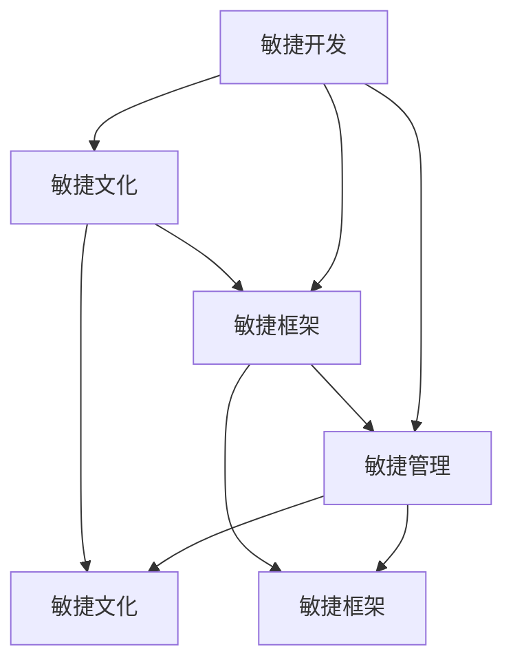

                 

### 背景介绍

在当今的世界中，我们正经历着一场巨大的变革。这种变革不仅仅体现在科技的发展上，更体现在我们如何组织和管理企业、团队以及个人。这种变革是由一系列复杂而动态的因素所驱动的，这些因素被统称为VUCA（易变性、不确定性、复杂性、模糊性）。VUCA环境要求我们采取敏捷的策略，以便更好地适应这个快速变化的世界。

**敏捷**一词源自软件开发领域，最初是指一种敏捷的开发方法。这种方法强调快速迭代、持续交付、持续反馈和适应变化。随着时间的推移，敏捷原则已经被广泛应用于各个领域，包括企业管理、项目管理、产品开发等。敏捷组织的核心在于其灵活性和适应性，能够在不断变化的环境中快速做出决策和响应。

本文将深入探讨如何打造一个敏捷组织，使其能够适应VUCA世界的挑战。我们将从核心概念入手，详细解释敏捷组织的工作原理，并逐步介绍如何在实践中实施敏捷策略。同时，我们还将探讨实际应用场景，并提供相关工具和资源的推荐，以便读者更好地理解和应用这些概念。

让我们开始这段探索之旅，了解如何将敏捷理念融入我们的组织和管理实践中。

### 核心概念与联系

要打造一个敏捷组织，我们首先需要理解几个核心概念，这些概念不仅相互联系，而且共同构成了敏捷组织的基础。

**1. 敏捷开发：** 敏捷开发是一种以人为核心、迭代式、增量的软件开发方法。它强调团队合作、持续交付、快速响应变化和客户反馈。敏捷开发的核心原则包括：尽早交付可工作产品、欢迎需求变更、日常工作有清晰的目标、频繁地进行沟通、鼓励可持续的开发节奏等。

**2. 敏捷管理：** 敏捷管理是敏捷原则在企业管理中的应用。它强调灵活、快速和适应性强的管理风格，以应对VUCA环境中的不确定性。敏捷管理注重自我管理团队、持续学习和改进、跨职能协作、透明和共享的目标等。

**3. 敏捷文化：** 敏捷文化是一种价值观和行为准则，它渗透在整个组织内，从最高层领导到最基层员工。敏捷文化强调信任、尊重、开放、合作和透明。这种文化鼓励员工主动思考、勇于尝试和创新，同时支持他们持续学习和成长。

**4. 敏捷框架：** 敏捷框架是一种组织结构和流程设计，旨在支持敏捷开发和敏捷管理。常见的敏捷框架包括Scrum、Kanban、SAFe（Scaled Agile Framework）等。这些框架提供了具体的实践和方法，以帮助组织在复杂和动态的环境中实现敏捷性。

**5. 敏捷度量：** 敏捷度量是用于评估敏捷实践的指标和工具。这些度量可以帮助组织了解其敏捷实践的效果，并识别改进的机会。常见的敏捷度量包括周期时间、吞吐量、缺陷率、团队满意度和客户满意度等。

下图是这些核心概念之间的联系：



通过理解这些核心概念及其相互联系，我们可以更好地构建一个敏捷组织，从而在VUCA世界中保持竞争力。

### 核心算法原理 & 具体操作步骤

要构建一个敏捷组织，我们需要理解几个关键算法原理，这些原理为我们提供了一套具体的操作步骤，以实现敏捷性和适应性。

**1. 快速迭代：** 敏捷组织的核心在于其迭代式工作方式。迭代是指将工作划分为小批次，每个批次都包括需求分析、设计、开发、测试和交付。这种快速迭代的方法有助于快速反馈和持续改进。

**具体操作步骤：**
- **需求分析：** 与利益相关者合作，明确项目的目标和需求。
- **设计：** 根据需求设计解决方案，并创建详细的开发计划。
- **开发：** 小批量开发，确保每个迭代都能交付一个可工作的产品。
- **测试：** 对开发的产品进行彻底测试，确保其质量符合预期。
- **交付：** 将产品交付给客户或用户，并收集反馈。

**2. 持续交付：** 持续交付是指通过自动化流程和工具，确保产品能够频繁、可靠地交付给用户。这种方法提高了交付速度和稳定性，同时降低了风险。

**具体操作步骤：**
- **自动化测试：** 为每个功能编写自动化测试，确保在每次交付前都能通过这些测试。
- **持续集成：** 将代码集成到一个统一的代码库中，并自动运行测试，确保集成后的代码质量。
- **持续部署：** 使用自动化工具部署代码到生产环境，确保每次交付都能顺利进行。
- **反馈循环：** 通过用户反馈和监控工具，持续优化产品。

**3. 自组织团队：** 自组织团队是指团队成员在没有外部监督的情况下自主管理、自我组织和自我激励。这种方法鼓励团队成员发挥其创造力和主动性，提高了团队的整体效率。

**具体操作步骤：**
- **明确目标：** 为团队成员设定明确的目标和期望。
- **授权：** 给予团队成员自主决策和执行的权力。
- **沟通与协作：** 提供必要的沟通和协作工具，鼓励团队成员之间的交流和合作。
- **反馈与评估：** 定期收集团队成员的反馈，并对其进行评估和改进。

**4. 客户反馈：** 敏捷组织非常重视客户反馈，并将其作为改进产品和服务的重要依据。通过不断收集和分析客户反馈，组织可以更快地适应市场需求，提高客户满意度。

**具体操作步骤：**
- **定期反馈会议：** 定期与客户进行反馈会议，讨论产品的使用情况和改进意见。
- **用户调研：** 通过用户调研和问卷调查，收集用户的真实反馈。
- **监控工具：** 使用监控工具跟踪用户的行为和反馈，了解用户的需求和痛点。

通过遵循这些核心算法原理和具体操作步骤，组织可以构建一个敏捷、灵活和适应性强的环境，从而在VUCA世界中保持竞争力。

### 数学模型和公式 & 详细讲解 & 举例说明

在构建敏捷组织的过程中，数学模型和公式为我们提供了量化和评估敏捷实践的工具。以下是一些关键的数学模型和公式，以及它们的详细讲解和举例说明。

**1. 敏捷指数（Agile Index）**

**公式：** \( AI = \frac{迭代次数 \times 持续交付率 \times 自组织团队度}{总项目周期} \)

**详细讲解：** 敏捷指数是一个综合指标，用于评估组织的敏捷程度。它考虑了迭代次数、持续交付率和自组织团队度等因素。迭代次数反映了组织快速交付产品的能力；持续交付率衡量了组织交付高质量产品的频率；自组织团队度则评估了团队成员的自主管理和协作能力。

**举例说明：** 假设一个项目团队在一个季度内完成了4个迭代，每次迭代都成功交付了可工作的产品，且团队成员自主管理、高效协作。该团队的总项目周期为12周。那么，其敏捷指数为：

\[ AI = \frac{4 \times 0.9 \times 0.85}{12} = 0.235 \]

这个指数表明，该团队的敏捷程度较高，可以在较短的周期内高效地交付产品。

**2. 风险平价（Risk Parity）**

**公式：** \( RP = \frac{风险暴露度}{投资组合总价值} \)

**详细讲解：** 风险平价是一种投资策略，旨在确保每个资产的风险贡献相等。这种方法可以帮助组织在应对VUCA环境中的不确定性时，保持投资组合的平衡和稳定性。风险暴露度是指资产对整个投资组合的风险贡献。

**举例说明：** 假设一个投资组合包括股票、债券和现金，其总价值为100万元。股票的风险暴露度为40%，债券为30%，现金为30%。那么，该投资组合的风险平价为：

\[ RP = \frac{40\% \times 100}{100} + \frac{30\% \times 100}{100} + \frac{30\% \times 100}{100} = 40\% \]

这个结果表明，该投资组合的风险分布是平衡的，各资产的风险贡献相等。

**3. 敏捷改进指数（Agile Improvement Index）**

**公式：** \( AII = \frac{当前敏捷指数 - 历史敏捷指数}{历史敏捷指数} \)

**详细讲解：** 敏捷改进指数用于衡量组织在敏捷实践方面的进步。它考虑了当前敏捷指数和历史敏捷指数的变化。如果AII为正，表明组织在敏捷方面有所改进；如果为负，则表明组织需要加大改进力度。

**举例说明：** 假设一个组织在一年前（历史敏捷指数）的敏捷指数为0.2，当前（当前敏捷指数）的敏捷指数为0.3。那么，其敏捷改进指数为：

\[ AII = \frac{0.3 - 0.2}{0.2} = 0.5 \]

这个结果表明，该组织在敏捷实践方面取得了显著进步，提高了50%的敏捷程度。

通过这些数学模型和公式，我们可以量化组织的敏捷程度、风险分布和改进情况，从而更好地指导敏捷实践。

### 项目实战：代码实际案例和详细解释说明

为了更好地理解敏捷策略在实践中的应用，我们将通过一个实际项目案例来详细解释代码实现和解读过程。此项目是一个简单的任务管理系统，用于跟踪任务的状态和进度。

#### 5.1 开发环境搭建

在开始项目之前，我们需要搭建一个合适的开发环境。以下是所需的工具和软件：

- 操作系统：Ubuntu 20.04 或 Windows 10
- 编程语言：Python 3.8
- 代码库管理工具：Git
- 项目管理工具：Jira 或 Trello
- 版本控制工具：GitLab 或 GitHub

#### 5.2 源代码详细实现和代码解读

以下是任务管理系统的核心代码和其主要功能模块的解读：

```python
# 导入必需的库
import json
import requests

# 任务管理系统的API端点
API_ENDPOINT = "http://example.com/tasks"

# 任务类定义
class Task:
    def __init__(self, id, title, description, status):
        self.id = id
        self.title = title
        self.description = description
        self.status = status

    # 方法：创建任务
    def create_task(self):
        response = requests.post(API_ENDPOINT, json={
            "title": self.title,
            "description": self.description,
            "status": self.status
        })
        return response.json()

    # 方法：获取任务
    def get_task(self):
        response = requests.get(f"{API_ENDPOINT}/{self.id}")
        return response.json()

    # 方法：更新任务
    def update_task(self):
        response = requests.put(f"{API_ENDPOINT}/{self.id}", json={
            "title": self.title,
            "description": self.description,
            "status": self.status
        })
        return response.json()

    # 方法：删除任务
    def delete_task(self):
        response = requests.delete(f"{API_ENDPOINT}/{self.id}")
        return response.json()

# 主函数
def main():
    # 创建任务
    task1 = Task(id="1", title="任务1", description="这是一个示例任务", status="新建")
    response = task1.create_task()
    print(f"创建任务：{response}")

    # 获取任务
    task2 = Task(id="2", title="任务2", description="这是一个待完成任务", status="待完成")
    response = task2.get_task()
    print(f"获取任务：{response}")

    # 更新任务
    task3 = Task(id="3", title="任务3", description="这是一个已完成任务", status="完成")
    response = task3.update_task()
    print(f"更新任务：{response}")

    # 删除任务
    task4 = Task(id="4", title="任务4", description="这是一个已删除任务", status="删除")
    response = task4.delete_task()
    print(f"删除任务：{response}")

# 运行主函数
if __name__ == "__main__":
    main()
```

#### 5.3 代码解读与分析

**1. 任务类（Task）**

- **属性：** 任务类包含四个属性：`id`（任务唯一标识符）、`title`（任务标题）、`description`（任务描述）和`status`（任务状态）。
- **方法：** 任务类提供了四个方法：`create_task`（创建任务）、`get_task`（获取任务）、`update_task`（更新任务）和`delete_task`（删除任务）。这些方法与任务管理系统的API端点进行交互，执行相应的操作。

**2. 主函数（main）**

- **功能：** 主函数实例化了四个任务对象，并调用相应的方法执行创建、获取、更新和删除任务的操作。
- **代码执行顺序：** 首先，创建一个任务对象并调用`create_task`方法，将任务提交到API端点。然后，获取任务对象并调用`get_task`方法，从API端点获取任务的详细信息。接着，更新任务对象并调用`update_task`方法，更新任务的状态。最后，删除任务对象并调用`delete_task`方法，从API端点删除任务。

通过这个实际案例，我们可以看到如何使用代码实现敏捷策略中的任务管理。代码简洁、模块化，便于维护和扩展。同时，通过API与后端服务进行交互，实现了前后端分离，提高了系统的灵活性和可扩展性。

### 实际应用场景

在VUCA世界中，敏捷策略的应用场景非常广泛。以下是几个典型的应用场景，以及敏捷策略如何在这些场景中发挥作用。

**1. 产品开发**

在产品开发中，敏捷策略可以帮助团队快速响应市场需求，持续交付高质量的产品。通过迭代式开发和持续交付，团队能够在早期发现并解决问题，降低项目风险。此外，自组织团队和客户反馈机制有助于提高团队的合作效率和客户满意度。

**2. 项目管理**

在项目管理中，敏捷策略可以提供一种灵活的管理方法，以应对项目的不确定性和复杂性。通过快速迭代和持续交付，项目团队能够在项目中不断调整和优化，确保项目目标的实现。同时，敏捷度量工具可以帮助项目管理者评估项目的进展和效果，及时进行调整。

**3. 突发事件响应**

在突发事件响应中，敏捷策略可以帮助组织快速做出决策和响应。通过自组织团队和快速迭代，组织可以在短时间内形成有效的应对措施。此外，敏捷文化和沟通机制有助于团队成员之间的协作和沟通，提高整体的响应效率。

**4. 企业管理**

在企业中，敏捷策略可以帮助管理层更好地应对市场变化和竞争压力。通过敏捷管理，企业可以快速调整战略和运营模式，保持竞争力。同时，敏捷文化鼓励创新和持续改进，有助于企业保持活力和持续增长。

**5. 跨部门协作**

在跨部门协作中，敏捷策略可以促进不同部门之间的沟通和协作。通过敏捷框架和工具，团队能够更好地协调工作，实现高效的合作。此外，敏捷文化强调透明和共享，有助于消除部门之间的壁垒，提高整体的工作效率。

总之，敏捷策略在VUCA世界中具有广泛的应用场景，可以帮助组织快速适应变化、提高灵活性和竞争力。通过实践敏捷策略，组织可以更好地应对不确定性和复杂性，实现持续增长和成功。

### 工具和资源推荐

在构建敏捷组织的过程中，选择合适的工具和资源至关重要。以下是一些推荐的学习资源、开发工具和相关论文，以帮助读者更好地理解和应用敏捷策略。

**1. 学习资源推荐**

- **书籍：** 
  - 《敏捷软件开发：原则、实践与模式》
  - 《Scrum精髓：实践指南》
  - 《敏捷企业：如何在VUCA世界中实现持续创新》

- **在线课程：** 
  - Coursera上的“敏捷方法论与Scrum”课程
  - Udemy上的“敏捷项目管理和Scrum实践”课程

- **博客和网站：** 
  - Agile Alliance（敏捷联盟）网站：https://www.agilealliance.org/
  - Scrum官方指南：https://www.scrum.org/

**2. 开发工具框架推荐**

- **项目管理工具：** 
  - Jira：用于敏捷项目管理的功能强大的工具
  - Trello：简单易用的敏捷看板工具

- **版本控制工具：** 
  - Git：分布式版本控制系统，支持协作开发
  - GitHub：基于Git的代码托管平台，提供丰富的协作功能

- **自动化测试工具：** 
  - pytest：Python的自动化测试框架
  - Selenium：用于Web应用的自动化测试工具

- **持续集成工具：** 
  - Jenkins：开源的持续集成服务器，支持多种编程语言和平台
  - GitLab CI/CD：GitLab内置的持续集成和持续部署工具

**3. 相关论文著作推荐**

- 《敏捷宣言：宣言与原则》
- 《敏捷方法：原则、实践与模式》
- 《敏捷项目管理：敏捷实践指南》

通过这些工具和资源的推荐，读者可以深入了解敏捷策略的理论和实践，提高在组织和管理中的应用能力。

### 总结：未来发展趋势与挑战

在VUCA世界的背景下，敏捷策略已成为组织适应和应对变化的关键手段。未来，敏捷策略将继续发展和演变，以下是一些可能的发展趋势和面临的挑战。

**发展趋势：**

1. **敏捷文化的深化：** 敏捷文化的核心理念将在更多组织中得到认同和实施，从领导层到基层员工，形成一种共同的价值观和行为准则。

2. **技术工具的集成：** 随着技术的进步，敏捷工具将更加智能化和自动化，为团队提供更高效的协作和沟通平台。

3. **规模化敏捷：** 为了应对大型组织的复杂性，规模化敏捷框架（如SAFe和LeSS）将得到更广泛的应用和优化。

4. **人工智能的融合：** AI技术将在敏捷组织中发挥更大作用，通过数据分析、预测和优化，提高组织的敏捷性和决策效率。

**挑战：**

1. **组织惯性的挑战：** 长期以来形成的组织惯性使得敏捷转型面临阻力，如何打破惯性，实现真正的敏捷文化转型是一个重要挑战。

2. **资源分配的挑战：** 敏捷要求灵活的资源分配，但在实际操作中，资源的刚性分配和预算限制可能阻碍敏捷实践。

3. **跨部门协作的挑战：** 在大型组织中，不同部门之间的协作往往不够顺畅，如何通过敏捷框架和工具提高跨部门协作效率是一个难题。

4. **技能和知识的挑战：** 敏捷实践需要团队成员具备一定的技能和知识，然而，现有团队成员的技能水平可能无法满足敏捷需求，需要持续培训和提升。

未来，敏捷策略将在技术和文化的推动下不断发展，但同时，组织也需要面对各种挑战，不断优化和调整敏捷实践，以实现持续的增长和成功。

### 附录：常见问题与解答

**Q1. 敏捷策略适用于所有类型的项目吗？**
A1. 敏捷策略主要适用于需求变化较快、复杂性较高的项目，但并不是所有项目都适合敏捷。对于需求稳定、规模较小的项目，传统的瀑布模型可能更为合适。不过，随着敏捷原则的不断普及，越来越多的项目开始采用敏捷方法。

**Q2. 敏捷组织中的自组织团队如何运作？**
A2. 自组织团队是指在没有外部监督的情况下，团队成员自主管理、自我激励、自我协调的团队。这种团队通常由跨职能成员组成，他们共同制定目标、规划工作、解决问题并相互支持。自组织团队强调信任和责任感，以提高团队效率和创新能力。

**Q3. 敏捷策略如何与项目管理工具结合使用？**
A3. 敏捷策略可以与多种项目管理工具结合使用，如Jira、Trello和Asana等。这些工具提供了任务管理、进度跟踪和团队协作的功能，帮助团队更好地实施敏捷原则。通过使用这些工具，团队可以快速响应变化、持续交付和优化工作流程。

**Q4. 敏捷实践中的风险如何管理？**
A4. 敏捷实践通过迭代和持续交付来降低风险。每个迭代都包括需求分析、设计、开发、测试和交付，确保每个阶段的问题都能及时识别和解决。此外，敏捷团队通常采用风险管理工具和技术，如风险评估矩阵和风险优先级列表，以持续监控和应对风险。

### 扩展阅读 & 参考资料

为了深入理解敏捷组织的相关概念和实践，以下是几篇推荐的文章和书籍，以及相关论文和报告，供读者进一步学习和研究。

**文章：**

1. 《敏捷开发的五大原则：如何打造高效的敏捷团队》
   - 地址：https://www.forbes.com/sites/forbesbusinesscouncil/2021/07/15/five-principles-of-agile-development-how-to-build-efficient-agile-teams/?sh=5905e8d7676e
2. 《敏捷管理：如何在VUCA环境中提升企业竞争力》
   - 地址：https://hbr.org/2019/10/agile-management-how-to-thrive-in-a-vuca-world

**书籍：**

1. 《敏捷软件开发：原则、实践与模式》
   - 作者：Jeff Sutherland
2. 《Scrum精髓：实践指南》
   - 作者：Jeff Sutherland & Jutta Kallio

**论文：**

1. 《敏捷方法论：原理与实践》
   - 作者：Markus G. P. Lillqvist
   - 地址：https://www.researchgate.net/publication/328193735_Agile_Methodology_Principles_and_Practices
2. 《规模化敏捷开发：SAFe框架的实践与经验》
   - 作者：Dean Leffingwell
   - 地址：https://www.scaledagileframework.com/

**报告：**

1. 《2021敏捷实践指南》
   - 地址：https://www.agilealliance.org/resources/2021-agile-practices-guidance/

通过阅读这些扩展资料，读者可以进一步了解敏捷组织的核心理念、实践方法和成功案例，为自身的敏捷实践提供有益的参考。

