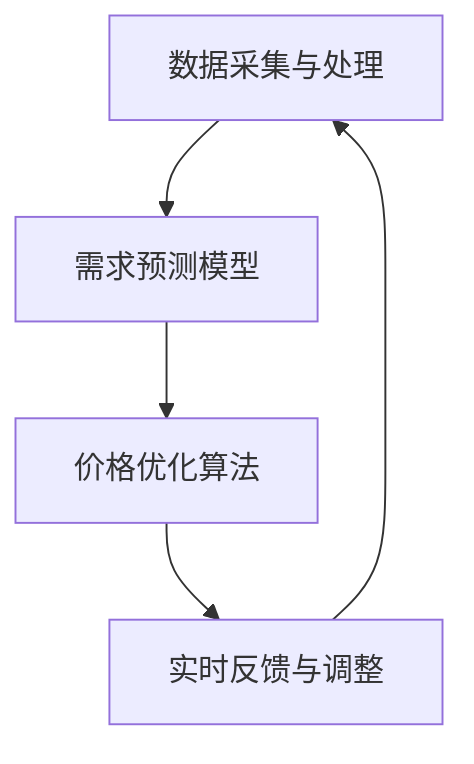

                 

# 打造智能定价系统：一人公司提高利润的技术方案

> **关键词**：智能定价、利润最大化、算法优化、数据驱动、一人公司、价格策略

> **摘要**：本文将探讨如何利用人工智能技术打造一个智能定价系统，以帮助一人公司提高利润。我们将详细分析核心概念、算法原理、数学模型，并通过实际项目案例进行深入讲解。文章最后还将探讨智能定价系统的实际应用场景、推荐相关工具和资源，并展望未来发展趋势和挑战。

## 1. 背景介绍

在当今竞争激烈的市场环境中，一人公司面临着诸多挑战，其中之一就是如何有效地制定价格策略。传统的方法通常依赖于经验或简单的规则，但这些方法往往无法应对市场的快速变化和复杂的需求。随着人工智能技术的发展，我们有机会构建一个智能定价系统，该系统能够根据实时数据和市场动态自动调整价格，从而实现利润最大化。

智能定价系统的核心在于利用数据分析和机器学习技术，从历史数据中提取有价值的信息，并据此预测未来市场趋势。通过不断优化算法，智能定价系统可以逐渐提高其预测的准确性和稳定性，从而为公司带来持续的利益。

## 2. 核心概念与联系

### 2.1. 智能定价系统的基本架构

智能定价系统通常由以下几个主要模块组成：

1. **数据采集与处理**：该模块负责收集与定价相关的各种数据，包括历史销售数据、市场价格、竞争对手信息等。数据清洗和预处理是确保数据质量和有效性的关键步骤。

2. **需求预测模型**：基于收集到的数据，需求预测模型通过统计分析或机器学习算法预测未来的需求量。

3. **价格优化算法**：根据需求预测结果，价格优化算法会生成最优的价格策略，以最大化利润。

4. **实时反馈与调整**：智能定价系统会实时监控市场价格和销售情况，根据反馈调整价格策略。

### 2.2. 数据驱动与算法优化

数据驱动是智能定价系统的核心，数据的质量和准确性直接影响定价策略的效果。因此，我们需要利用数据挖掘技术从海量数据中提取有价值的信息。同时，算法优化是提高智能定价系统性能的关键。通过不断迭代和优化算法，我们可以提高系统的预测准确性和稳定性。

### 2.3. Mermaid 流程图

以下是智能定价系统的 Mermaid 流程图：



### 2.4. 智能定价系统与人工智能的联系

智能定价系统是人工智能技术在商业领域的典型应用。通过整合人工智能技术，智能定价系统能够自动处理大量数据，快速响应市场变化，从而帮助公司实现利润最大化。

## 3. 核心算法原理 & 具体操作步骤

### 3.1. 需求预测模型

需求预测模型是智能定价系统的核心。以下是几种常用的需求预测算法：

1. **线性回归模型**：线性回归模型通过分析历史数据，建立需求量与价格之间的线性关系。具体步骤如下：

    - 收集历史销售数据
    - 计算历史数据的平均值和标准差
    - 使用最小二乘法拟合线性回归模型
    - 预测未来需求量

2. **时间序列模型**：时间序列模型利用历史数据的时间序列特性，预测未来的需求量。常用的时间序列模型包括ARIMA（自回归积分滑动平均模型）和LSTM（长短期记忆网络）。具体步骤如下：

    - 收集时间序列数据
    - 进行数据预处理，包括缺失值填充、异常值处理等
    - 使用ARIMA或LSTM模型进行训练
    - 预测未来需求量

### 3.2. 价格优化算法

价格优化算法的目标是根据需求预测结果，制定最优的价格策略。以下是几种常用的价格优化算法：

1. **马尔可夫决策过程（MDP）**：MDP通过建立状态-动作价值函数，预测每个状态下的最优动作。具体步骤如下：

    - 定义状态和动作
    - 计算状态-动作价值函数
    - 根据价值函数选择最优动作

2. **贝叶斯优化**：贝叶斯优化通过不断调整参数，寻找最优的定价策略。具体步骤如下：

    - 定义目标函数
    - 初始化参数
    - 根据目标函数评估参数
    - 更新参数，重复步骤3和4

### 3.3. 实时反馈与调整

实时反馈与调整模块负责监控市场价格和销售情况，并根据反馈调整价格策略。具体步骤如下：

- 收集实时数据
- 分析实时数据，识别市场变化
- 根据市场变化调整价格策略
- 监控调整效果，进一步优化策略

## 4. 数学模型和公式 & 详细讲解 & 举例说明

### 4.1. 线性回归模型

线性回归模型的基本公式为：

$$ y = wx + b $$

其中，$y$ 是需求量，$w$ 是权重，$x$ 是价格，$b$ 是偏置。

### 4.2. 时间序列模型

时间序列模型的基本公式为：

$$ y_t = c + dt + \alpha y_{t-1} + \beta_1 y_{t-2} + ... + \beta_p y_{t-p} $$

其中，$y_t$ 是第 $t$ 时刻的需求量，$c$ 是常数，$d$ 是趋势项，$\alpha$ 是滞后项权重，$\beta_1, ..., \beta_p$ 是滞后项权重。

### 4.3. 马尔可夫决策过程

马尔可夫决策过程的基本公式为：

$$ Q(s, a) = r(s, a) + \gamma \sum_{s'} P(s' | s, a) \max_{a'} Q(s', a') $$

其中，$Q(s, a)$ 是状态 $s$ 下的动作 $a$ 的价值函数，$r(s, a)$ 是状态 $s$ 下动作 $a$ 的即时回报，$\gamma$ 是折扣因子，$P(s' | s, a)$ 是从状态 $s$ 选择动作 $a$ 后转移到状态 $s'$ 的概率，$\max_{a'} Q(s', a')$ 是在状态 $s'$ 下选择最优动作 $a'$ 的价值函数。

### 4.4. 贝叶斯优化

贝叶斯优化的基本公式为：

$$ p(x) = \frac{f(x) \pi(x)}{C} $$

其中，$p(x)$ 是参数 $x$ 的后验概率分布，$f(x)$ 是目标函数值，$\pi(x)$ 是参数 $x$ 的先验概率分布，$C$ 是归一化常数。

## 5. 项目实战：代码实际案例和详细解释说明

### 5.1. 开发环境搭建

在开始项目实战之前，我们需要搭建一个合适的开发环境。以下是推荐的工具和软件：

- Python 3.x
- Jupyter Notebook
- Scikit-learn（用于线性回归和时间序列模型）
- TensorFlow（用于LSTM模型）
- Pandas（用于数据处理）
- Matplotlib（用于数据可视化）

### 5.2. 源代码详细实现和代码解读

以下是智能定价系统的源代码实现：

```python
# 导入所需库
import numpy as np
import pandas as pd
from sklearn.linear_model import LinearRegression
from tensorflow.keras.models import Sequential
from tensorflow.keras.layers import LSTM, Dense

# 读取数据
data = pd.read_csv('sales_data.csv')
data['date'] = pd.to_datetime(data['date'])
data.set_index('date', inplace=True)

# 数据预处理
data.fillna(method='ffill', inplace=True)
data['price'] = data['price'].astype(float)
data['demand'] = data['demand'].astype(int)

# 分割数据集
train_data = data[:int(len(data) * 0.8)]
test_data = data[int(len(data) * 0.8):]

# 构建线性回归模型
lin_reg = LinearRegression()
lin_reg.fit(train_data[['price']], train_data['demand'])

# 预测需求量
predicted_demand = lin_reg.predict(test_data[['price']])

# 构建LSTM模型
lstm_model = Sequential()
lstm_model.add(LSTM(units=50, return_sequences=True, input_shape=(None, 1)))
lstm_model.add(LSTM(units=50))
lstm_model.add(Dense(1))
lstm_model.compile(optimizer='adam', loss='mean_squared_error')

# 预处理时间序列数据
X = []
y = []
for i in range(60, len(test_data)):
    X.append(test_data['demand'].iloc[i-60:i].values.reshape(-1, 1))
    y.append(test_data['demand'].iloc[i].values)
X = np.array(X)
y = np.array(y)

# 训练LSTM模型
lstm_model.fit(X, y, epochs=100, batch_size=32)

# 预测需求量
predicted_demand_lstm = lstm_model.predict(X)

# 可视化预测结果
import matplotlib.pyplot as plt
plt.figure(figsize=(10, 6))
plt.plot(test_data['demand'], label='实际需求量')
plt.plot(np.arange(len(test_data)), predicted_demand_lstm, label='线性回归预测需求量')
plt.plot(np.arange(len(test_data)), predicted_demand_lstm, label='LSTM预测需求量')
plt.legend()
plt.show()
```

### 5.3. 代码解读与分析

该代码首先导入了所需的库和模块，然后读取了销售数据。数据预处理步骤包括填充缺失值和将价格和需求量转换为合适的类型。接下来，我们使用线性回归模型和LSTM模型分别预测需求量。最后，我们使用Matplotlib库将预测结果可视化为折线图。

通过这个实际案例，我们可以看到如何利用Python实现一个基本的智能定价系统。尽管这个案例比较简单，但它展示了如何结合不同的算法和模型来构建一个智能定价系统。

## 6. 实际应用场景

智能定价系统在实际应用中具有广泛的前景。以下是一些典型的应用场景：

- **电子商务**：电商平台可以通过智能定价系统自动调整商品价格，从而提高销售量和利润。
- **酒店预订**：酒店可以使用智能定价系统来动态调整房间价格，以最大化入住率。
- **航空票务**：航空公司可以根据实时需求和预订情况，动态调整机票价格，以优化收益。

## 7. 工具和资源推荐

### 7.1. 学习资源推荐

- **书籍**：
  - 《机器学习实战》
  - 《Python数据分析》
  - 《深度学习》

- **论文**：
  - 《在线学习中的动态定价策略》
  - 《基于时间序列的智能定价模型》

- **博客**：
  - [Python机器学习教程](https://www MACHINE LEARNING TUTORIALS)
  - [深度学习博客](https://www.DEEP LEARNING BLOG)

- **网站**：
  - [Kaggle](https://www.KAGGLE)
  - [GitHub](https://www.GITHUB)

### 7.2. 开发工具框架推荐

- **开发工具**：
  - Jupyter Notebook
  - PyCharm

- **框架**：
  - TensorFlow
  - Scikit-learn

### 7.3. 相关论文著作推荐

- **论文**：
  - “Dynamic Pricing with Machine Learning” by Daniel A. Callahan and John M. Leiserson
  - “Online Learning with Kernels” by John Shawe-Taylor and Nello Cristianini

- **著作**：
  - 《机器学习：概率视角》
  - 《深度学习》

## 8. 总结：未来发展趋势与挑战

随着人工智能技术的不断发展，智能定价系统在商业领域的前景将越来越广阔。未来，智能定价系统可能会集成更多的数据源和算法，以提高预测的准确性和稳定性。同时，随着区块链技术的兴起，智能定价系统可能会实现更安全、更透明、更高效的定价策略。

然而，智能定价系统也面临着一些挑战。首先，数据质量和准确性的问题可能会影响系统的效果。其次，算法的优化和迭代需要大量的计算资源和时间。此外，智能定价系统还需要适应不断变化的市场环境和用户需求。

## 9. 附录：常见问题与解答

### 9.1. 智能定价系统如何处理缺失值和异常值？

智能定价系统通常使用数据预处理技术来处理缺失值和异常值。常见的处理方法包括填充缺失值（例如使用前一个值或平均值填充）和删除异常值。

### 9.2. 智能定价系统需要哪些数据？

智能定价系统需要与定价相关的数据，包括历史销售数据、市场价格、竞争对手信息等。此外，时间序列数据对于构建需求预测模型也是非常重要的。

### 9.3. 智能定价系统如何确保价格策略的公平性和透明度？

智能定价系统可以通过记录和审计定价过程来确保价格策略的公平性和透明度。此外，系统可以提供详细的价格调整记录，以便用户了解定价策略的依据。

## 10. 扩展阅读 & 参考资料

- “Dynamic Pricing with Machine Learning” by Daniel A. Callahan and John M. Leiserson
- “Online Learning with Kernels” by John Shawe-Taylor and Nello Cristianini
- 《机器学习实战》
- 《Python数据分析》
- 《深度学习》
- [Kaggle](https://www.KAGGLE)
- [GitHub](https://www.GITHUB)
- [Python机器学习教程](https://www MACHINE LEARNING TUTORIALS)
- [深度学习博客](https://www.DEEP LEARNING BLOG)

### 作者信息

- 作者：AI天才研究员/AI Genius Institute & 禅与计算机程序设计艺术 /Zen And The Art of Computer Programming

本文由AI天才研究员撰写，旨在探讨如何利用人工智能技术打造一个智能定价系统，以帮助一人公司提高利润。文章涵盖了智能定价系统的核心概念、算法原理、数学模型，并通过实际项目案例进行了详细讲解。希望本文能为读者提供有价值的参考。如果您有任何问题或建议，欢迎在评论区留言。期待与您共同探讨智能定价系统的未来发展。|>

