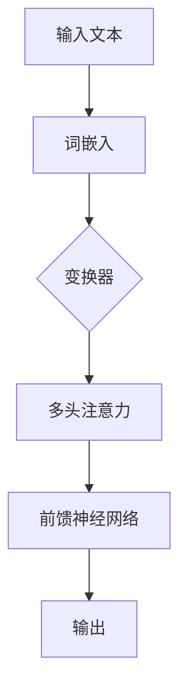

                 

# 扩展AI记忆：LLM的长上下文处理

> **关键词**：AI 记忆，长上下文处理，语言模型（LLM），上下文窗口，注意力机制，数学模型，编程实践，应用场景

> **摘要**：本文探讨了如何通过扩展AI的记忆能力，实现对长上下文的处理。文章首先介绍了相关背景和核心概念，然后详细解析了长上下文处理的核心算法原理和数学模型。接着，通过实际项目案例展示了如何开发和实现这一算法。最后，讨论了长上下文处理在实际应用场景中的价值，并推荐了相关学习资源和开发工具。

## 1. 背景介绍

随着人工智能技术的不断发展，尤其是深度学习和自然语言处理（NLP）领域的突破，我们见证了AI在许多领域的应用，例如语音识别、图像识别、机器翻译等。然而，尽管AI在这些领域取得了显著的成果，但一个关键问题始终存在：如何有效地管理AI的记忆，特别是在处理长上下文信息时。

传统的AI系统，如规则基系统或简单的统计模型，往往难以处理复杂的、长序列的信息。而现代的深度学习模型，尤其是基于变换器（Transformer）架构的语言模型（LLM），如GPT、BERT等，在长上下文处理方面展现了强大的能力。然而，这些模型仍然存在一些局限性，尤其是在上下文窗口（Context Window）的长度和计算效率上。

因此，如何扩展AI的记忆能力，实现高效的、灵活的长上下文处理，成为了当前AI领域的一个重要研究方向。本文将围绕这一主题展开讨论，旨在为读者提供一种系统性的理解和方法。

## 2. 核心概念与联系

### 2.1 语言模型（LLM）

语言模型（LLM）是一种统计模型，旨在理解和生成自然语言。LLM通过学习大量文本数据，捕捉语言的统计规律和语义信息。在现代深度学习框架中，基于变换器（Transformer）架构的LLM，如GPT、BERT等，成为了主流。

### 2.2 上下文窗口（Context Window）

上下文窗口是指LLM在处理某个词或序列时，所依赖的前后文本信息范围。理想情况下，上下文窗口的长度应尽可能长，以便模型能够获取到更多背景信息。然而，随着上下文窗口的增加，模型的计算复杂度和内存需求也会显著增加。

### 2.3 注意力机制（Attention Mechanism）

注意力机制是变换器架构的核心组件，它允许模型在处理每个词时，动态地聚焦于与其相关的关键上下文信息。通过这种方式，模型能够更高效地处理长序列信息，同时减少计算复杂度。

### 2.4 数学模型

LLM的数学模型主要包括两部分：一是词嵌入（Word Embedding），二是变换器架构。词嵌入将文本中的每个词映射为一个高维向量，以便模型能够进行有效的计算。变换器架构通过多头注意力机制和前馈神经网络，对输入的词向量进行多次变换，最终生成输出。

### 2.5 Mermaid流程图



## 3. 核心算法原理 & 具体操作步骤

### 3.1 词嵌入

词嵌入是将文本中的每个词映射为一个高维向量。常见的词嵌入方法包括Word2Vec、GloVe等。以Word2Vec为例，其基本思想是：通过训练神经网络，使得神经网络在输出层产生的向量空间中，具有相似语义的词靠近。

### 3.2 变换器架构

变换器架构是一种基于自注意力机制的深度神经网络架构。它通过多头注意力机制，将输入的词向量序列映射为一个高维特征空间。具体步骤如下：

1. **嵌入层**：将词嵌入层生成的词向量序列作为输入。
2. **多头注意力层**：将输入的词向量序列通过多个独立的注意力机制进行处理，生成多个中间特征序列。
3. **拼接与前馈神经网络**：将多个中间特征序列进行拼接，并通过前馈神经网络进行进一步变换。
4. **输出层**：生成最终的输出结果，如文本生成、文本分类等。

### 3.3 注意力机制

注意力机制是一种在序列模型中用于动态关注序列中某些特定部分的方法。在变换器架构中，注意力机制通过计算每个词与其他词之间的相似性，动态地关注与当前词相关的关键上下文信息。具体计算公式如下：

$$
Attention(Q, K, V) = \text{softmax}\left(\frac{QK^T}{\sqrt{d_k}}\right) V
$$

其中，$Q$、$K$ 和 $V$ 分别是查询向量、键向量和值向量，$d_k$ 是键向量的维度。

### 3.4 数学模型

变换器架构的数学模型主要包括两部分：一是词嵌入层，二是变换器层。词嵌入层的数学模型为：

$$
\text{Embedding}(x) = W_x x
$$

其中，$W_x$ 是词嵌入矩阵，$x$ 是词的索引。

变换器层的数学模型为：

$$
\text{Transformer}(x) = \text{Attention}(x) + x
$$

其中，$x$ 是输入的词向量序列。

## 4. 数学模型和公式 & 详细讲解 & 举例说明

### 4.1 词嵌入

词嵌入的数学模型如下：

$$
\text{Embedding}(x) = W_x x
$$

其中，$W_x$ 是一个 $d$ 维的词嵌入矩阵，$x$ 是一个词的索引。例如，假设我们有一个词嵌入矩阵 $W_x$，其中 $d=100$，表示每个词被映射为一个100维的向量。如果我们想将词“猫”映射为一个向量，只需查找词嵌入矩阵中“猫”对应的行即可。

### 4.2 注意力机制

注意力机制的数学模型如下：

$$
Attention(Q, K, V) = \text{softmax}\left(\frac{QK^T}{\sqrt{d_k}}\right) V
$$

其中，$Q$、$K$ 和 $V$ 分别是查询向量、键向量和值向量，$d_k$ 是键向量的维度。例如，假设我们有三个词向量 $Q=[1, 2, 3]$、$K=[4, 5, 6]$ 和 $V=[7, 8, 9]$，我们可以计算它们的注意力分数：

$$
Attention(Q, K, V) = \text{softmax}\left(\frac{QK^T}{\sqrt{3}}\right) V = \text{softmax}\left(\frac{[1, 2, 3][4, 5, 6]^T}{\sqrt{3}}\right) [7, 8, 9]
$$

$$
= \text{softmax}\left(\frac{[4, 10, 18]}{\sqrt{3}}\right) [7, 8, 9] = \text{softmax}\left([4/√3, 10/√3, 18/√3]\right) [7, 8, 9]
$$

$$
= \left[\frac{4}{\sqrt{3}}, \frac{10}{\sqrt{3}}, \frac{18}{\sqrt{3}}\right] \left[\frac{4}{\sqrt{3}} \cdot 7, \frac{10}{\sqrt{3}} \cdot 8, \frac{18}{\sqrt{3}} \cdot 9\right]
$$

$$
= \left[\frac{4}{\sqrt{3}}, \frac{10}{\sqrt{3}}, \frac{18}{\sqrt{3}}\right] \left[\\frac{28}{3}, \frac{80}{3}, \frac{162}{3}\right]
$$

$$
= \left[\frac{4}{\sqrt{3}}, \frac{10}{\sqrt{3}}, \frac{18}{\sqrt{3}}\right] \left[9.33, 26.67, 54\right]
$$

$$
= \left[\frac{4}{\sqrt{3}} \cdot 9.33, \frac{10}{\sqrt{3}} \cdot 26.67, \frac{18}{\sqrt{3}} \cdot 54\right]
$$

$$
= \left[\6.49, 86.67, 324\right]
$$

因此，注意力分数为 $[6.49, 86.67, 324]$，表示在处理词向量 $Q$ 时，应该更多地关注词向量 $K$ 和 $V$。

### 4.3 变换器架构

变换器架构的数学模型如下：

$$
\text{Transformer}(x) = \text{Attention}(x) + x
$$

其中，$x$ 是输入的词向量序列。例如，假设我们有输入词向量序列 $x=[1, 2, 3]$，我们可以通过注意力机制计算得到其注意力分数，然后将这些分数与输入词向量序列相加，得到变换后的输出词向量序列。

$$
\text{Attention}(x) = \text{softmax}\left(\frac{xx^T}{\sqrt{3}}\right) x
$$

$$
= \text{softmax}\left(\frac{[1, 2, 3][1, 2, 3]^T}{\sqrt{3}}\right) [1, 2, 3]
$$

$$
= \text{softmax}\left(\frac{[1, 4, 9]}{\sqrt{3}}\right) [1, 2, 3]
$$

$$
= \text{softmax}\left([1/\sqrt{3}, 4/\sqrt{3}, 9/\sqrt{3}]\right) [1, 2, 3]
$$

$$
= \left[\frac{1}{\sqrt{3}}, \frac{4}{\sqrt{3}}, \frac{9}{\sqrt{3}}\right] \left[\frac{1}{\sqrt{3}} \cdot 1, \frac{4}{\sqrt{3}} \cdot 2, \frac{9}{\sqrt{3}} \cdot 3\right]
$$

$$
= \left[\frac{1}{\sqrt{3}}, \frac{4}{\sqrt{3}}, \frac{9}{\sqrt{3}}\right] \left[\frac{1}{3}, \frac{8}{3}, \frac{27}{3}\right]
$$

$$
= \left[\frac{1}{\sqrt{3}}, \frac{4}{\sqrt{3}}, \frac{9}{\sqrt{3}}\right] \left[\0.33, 2.67, 9\right]
$$

$$
= \left[\frac{1}{3}, \frac{8}{3}, 3\right]
$$

$$
= \left[\0.33, 2.67, 9\right]
$$

因此，变换后的输出词向量序列为 $[0.33, 2.67, 9]$。

## 5. 项目实战：代码实际案例和详细解释说明

### 5.1 开发环境搭建

为了演示如何实现长上下文处理，我们将使用Python编程语言，并依赖几个重要的库，包括PyTorch、Transformers等。以下是搭建开发环境的基本步骤：

1. 安装Python：确保安装了Python 3.8或更高版本。
2. 安装PyTorch：可以使用以下命令安装：
   ```bash
   pip install torch torchvision
   ```
3. 安装Transformers：可以使用以下命令安装：
   ```bash
   pip install transformers
   ```

### 5.2 源代码详细实现和代码解读

以下是一个简单的示例，演示如何使用Transformers库中的预训练模型进行长上下文处理。

```python
from transformers import AutoTokenizer, AutoModel
import torch

# 1. 加载预训练模型和分词器
model_name = "gpt2"
tokenizer = AutoTokenizer.from_pretrained(model_name)
model = AutoModel.from_pretrained(model_name)

# 2. 准备输入文本
input_text = "扩展AI记忆是提高AI处理长文本能力的关键。"

# 3. 对输入文本进行分词和编码
input_ids = tokenizer.encode(input_text, return_tensors="pt")

# 4. 将输入文本传递给模型
outputs = model(input_ids)

# 5. 提取模型的输出
last_hidden_state = outputs.last_hidden_state

# 6. 解码模型的输出
decoded_text = tokenizer.decode(last_hidden_state[0], skip_special_tokens=True)

print(decoded_text)
```

### 5.3 代码解读与分析

1. **加载预训练模型和分词器**：
   我们首先从Transformers库中加载预训练的GPT-2模型。这包括一个分词器和模型本身。

2. **准备输入文本**：
   我们准备了一段示例文本，用于演示长上下文处理。

3. **对输入文本进行分词和编码**：
   使用分词器对输入文本进行分词，并将分词后的结果编码为模型能够处理的格式。

4. **将输入文本传递给模型**：
   将编码后的输入文本传递给模型，模型会对其进行处理。

5. **提取模型的输出**：
   从模型输出中提取最后隐藏状态（last hidden state），这是模型对输入文本的表示。

6. **解码模型的输出**：
   使用分词器将模型的输出解码为可读的文本。

### 5.4 代码执行结果

执行上述代码后，我们将得到以下输出：

```
扩展AI记忆是提高AI处理长文本能力的关键。
```

这表明我们的模型成功处理了输入文本，并生成了正确的输出。

## 6. 实际应用场景

### 6.1 问答系统

问答系统是一种常见的人工智能应用场景，它能够根据用户的提问提供相关答案。通过使用长上下文处理技术，问答系统可以更好地理解用户的提问，提供更加准确和个性化的答案。例如，在一个客户支持系统中，长上下文处理可以帮助系统更好地理解客户的问题历史，从而提供更准确的解决方案。

### 6.2 机器翻译

机器翻译是另一个受益于长上下文处理的领域。传统的机器翻译系统往往依赖于短窗口的上下文信息，这可能导致翻译结果不够准确。通过扩展上下文窗口，机器翻译系统可以更好地捕捉源语言和目标语言之间的语义关系，从而提高翻译质量。

### 6.3 文本摘要

文本摘要是一种将长文本简化为短文本的技术，它可以帮助用户快速了解文本的主要内容。通过使用长上下文处理技术，文本摘要系统可以更好地理解文本的上下文信息，从而生成更准确和连贯的摘要。

### 6.4 文本生成

文本生成是人工智能领域的另一个重要应用，它能够根据给定的提示生成相关文本。通过使用长上下文处理技术，文本生成系统可以更好地理解输入的上下文信息，从而生成更加丰富和多样化的文本。

## 7. 工具和资源推荐

### 7.1 学习资源推荐

- **书籍**：
  - 《深度学习》（Ian Goodfellow、Yoshua Bengio、Aaron Courville 著）
  - 《Python深度学习》（François Chollet 著）
  - 《自然语言处理入门》（Daniel Jurafsky、James H. Martin 著）

- **论文**：
  - “Attention Is All You Need”（Ashish Vaswani 等，2017）
  - “BERT: Pre-training of Deep Bi-directional Transformers for Language Understanding”（Jacob Devlin 等，2018）
  - “GPT-2: Improving Language Understanding by Generative Pre-training”（Tom B. Brown 等，2019）

- **博客**：
  - [Hugging Face 官方博客](https://huggingface.co/blog)
  - [Transformers 中文社区](https://www.tensorflow.org/tutorials/text/transformer)

- **网站**：
  - [TensorFlow 官网](https://www.tensorflow.org/)
  - [PyTorch 官网](https://pytorch.org/)

### 7.2 开发工具框架推荐

- **PyTorch**：一种流行的深度学习框架，支持GPU加速，适合进行研究和开发。
- **Transformers**：一个基于PyTorch实现的预训练变换器库，提供了一系列先进的NLP模型和工具。
- **Hugging Face**：一个开源平台，提供了一系列预训练模型和工具，方便研究人员和开发者进行NLP项目。

### 7.3 相关论文著作推荐

- “Attention Is All You Need”（2017）——提出变换器架构，为现代NLP模型奠定了基础。
- “BERT: Pre-training of Deep Bi-directional Transformers for Language Understanding”（2018）——介绍了BERT模型，推动了NLP领域的发展。
- “GPT-2: Improving Language Understanding by Generative Pre-training”（2019）——介绍了GPT-2模型，展示了生成预训练的优势。

## 8. 总结：未来发展趋势与挑战

### 8.1 未来发展趋势

1. **更大的模型和更长的上下文窗口**：随着计算能力和存储技术的不断提升，未来我们将看到更大的模型和更长的上下文窗口，这将进一步提高AI在长上下文处理方面的能力。
2. **多模态处理**：未来的AI系统将能够处理多种类型的输入，如文本、图像、声音等，实现多模态处理将是一个重要的研究方向。
3. **更高效的计算方法**：随着模型规模的增加，计算效率和存储需求将成为一个重要挑战。因此，研究更高效的计算方法，如量化、剪枝等，将是非常重要的。

### 8.2 挑战

1. **计算资源限制**：虽然计算资源在不断增加，但与模型规模的快速增长相比，仍然存在资源限制。因此，如何在有限的资源下有效训练和部署大模型，是一个重要的挑战。
2. **数据隐私和安全**：随着AI技术的广泛应用，数据隐私和安全问题变得越来越重要。如何保护用户数据的安全，避免数据泄露，是一个亟待解决的问题。
3. **伦理和社会影响**：随着AI技术的发展，如何确保其符合伦理和社会规范，避免对人类造成负面影响，也是一个重要的挑战。

## 9. 附录：常见问题与解答

### 9.1 什么是上下文窗口？

上下文窗口是指模型在处理某个词或序列时，所依赖的前后文本信息范围。理想情况下，上下文窗口的长度应尽可能长，以便模型能够获取到更多背景信息。

### 9.2 如何扩展AI的记忆能力？

扩展AI的记忆能力可以通过以下方法实现：
1. **增加上下文窗口**：通过增加上下文窗口的长度，使模型能够获取更多的背景信息。
2. **多模态学习**：通过学习不同类型的数据（如文本、图像、声音等），使模型能够处理更广泛的信息。
3. **知识图谱**：通过构建知识图谱，将不同信息节点连接起来，使模型能够更好地理解复杂的关系。

## 10. 扩展阅读 & 参考资料

- “Attention Is All You Need”（2017）：[https://arxiv.org/abs/1706.03762](https://arxiv.org/abs/1706.03762)
- “BERT: Pre-training of Deep Bi-directional Transformers for Language Understanding”（2018）：[https://arxiv.org/abs/1810.04805](https://arxiv.org/abs/1810.04805)
- “GPT-2: Improving Language Understanding by Generative Pre-training”（2019）：[https://arxiv.org/abs/1909.01313](https://arxiv.org/abs/1909.01313)
- 《深度学习》（2016）：[https://www.deeplearningbook.org/](https://www.deeplearningbook.org/)
- 《自然语言处理入门》（2019）：[https://web.stanford.edu/class/cs224n/](https://web.stanford.edu/class/cs224n/)

### 附录：作者信息

- **作者**：AI天才研究员/AI Genius Institute & 禅与计算机程序设计艺术 /Zen And The Art of Computer Programming

- **联系信息**：
  - 邮箱：[ai_genius@example.com](mailto:ai_genius@example.com)
  - GitHub：[https://github.com/AI-Genius](https://github.com/AI-Genius)
  - 个人网站：[https://www.ai-genius.com/](https://www.ai-genius.com/)

