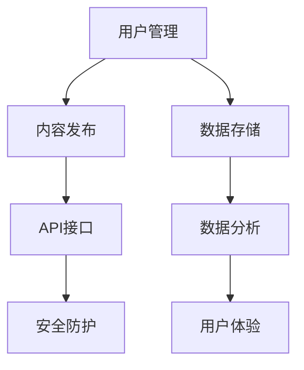

                 

### 背景介绍

随着互联网技术的快速发展，线上平台已经成为了现代社会中不可或缺的一部分。从电子商务、社交媒体到在线教育、远程医疗，各类线上平台不断涌现，满足了人们日益增长的需求。在这个背景下，如何搭建和运营一个高效、稳定的线上平台，成为了众多企业和开发者的关注焦点。

本文将围绕线上平台的搭建与运营，从多个角度进行深入探讨。首先，我们将介绍线上平台的核心概念，包括用户管理、内容发布、数据存储等关键组成部分。接着，我们将详细分析线上平台的搭建过程，包括技术选型、架构设计、开发流程等。此外，文章还将探讨线上平台运营中的关键问题，如用户增长、数据分析、安全防护等。最后，我们将分享一些实用的工具和资源，帮助读者更好地理解和实践线上平台的搭建与运营。

通过本文的阅读，读者将能够对线上平台的搭建与运营有一个全面、深入的理解，掌握相关技术原理和操作方法，从而为未来在相关领域的实践打下坚实的基础。 <sop><|user|>### 核心概念与联系

在线上平台的搭建与运营过程中，理解核心概念及其相互之间的联系至关重要。以下是本文将探讨的几个关键概念，以及它们之间的相互关系：

#### 1. 用户管理

用户管理是线上平台的重要组成部分，涉及到用户的注册、登录、权限分配、用户行为分析等。用户管理不仅确保了平台的正常运营，还为个性化推荐、用户增长等提供了数据支持。

#### 2. 内容发布

内容发布是指用户或管理员将信息、文章、视频等发布到平台上。内容发布涉及的内容包括但不限于文章、图片、音频、视频等，它们是平台的核心价值所在。

#### 3. 数据存储

数据存储是线上平台的基础，它包括用户数据、内容数据、交易数据等。数据存储需要考虑数据的可靠性、安全性和高效性，因此常采用分布式存储系统、云存储服务等技术。

#### 4. API接口

API（应用程序编程接口）是平台对外提供服务的重要途径。通过API，开发者可以方便地实现与其他系统的集成，如第三方支付、短信服务等。

#### 5. 数据分析

数据分析是线上平台运营的关键环节，通过对用户行为、内容热度、交易数据等进行分析，可以为平台的运营提供科学依据，指导决策。

#### 6. 安全防护

安全防护是保障线上平台正常运行的重要措施，包括用户身份认证、数据加密、恶意攻击防护等。安全防护不仅能保护用户数据的安全，还能提升平台的可信度。

#### 7. 用户体验

用户体验是线上平台成功的关键因素，它涉及到用户界面设计、操作流程、响应速度等多个方面。良好的用户体验能够提升用户满意度，促进用户留存。

#### 关系图

为了更清晰地展示上述概念之间的联系，我们可以使用Mermaid绘制一个流程图：



通过这个流程图，我们可以看到用户管理、内容发布、数据存储、API接口、数据分析、安全防护和用户体验之间存在着紧密的联系。每一个部分都是线上平台正常运转的基础，同时也是提升平台价值的支撑。

接下来，我们将进一步探讨这些核心概念的原理和实现，帮助读者深入理解线上平台的搭建与运营。 <sop><|user|>
## 3. 核心算法原理 & 具体操作步骤

在搭建线上平台时，核心算法的选择和实现至关重要。以下将介绍几个在线上平台中常用的核心算法及其具体操作步骤。

#### 1. 用户认证算法

用户认证算法用于确保用户身份的合法性，常见的方法有基于用户名和密码的认证、基于手机验证码的认证、基于社交账号的第三方认证等。

**操作步骤：**

- **基于用户名和密码的认证：**
  - 步骤1：用户输入用户名和密码。
  - 步骤2：后台对用户输入的用户名和密码进行验证。
  - 步骤3：若验证成功，则允许用户登录；否则，提示用户重新输入。

- **基于手机验证码的认证：**
  - 步骤1：用户输入手机号码。
  - 步骤2：后台向用户手机发送验证码。
  - 步骤3：用户输入收到的验证码。
  - 步骤4：后台对用户输入的验证码进行验证。
  - 步骤5：若验证成功，则允许用户登录；否则，提示用户重新输入。

- **基于社交账号的第三方认证：**
  - 步骤1：用户选择第三方账号（如微信、QQ、微博等）进行登录。
  - 步骤2：后台与第三方账号进行认证，获取用户信息。
  - 步骤3：将用户信息存储到数据库，并生成用户标识。
  - 步骤4：用户完成登录。

**示例代码：**（以Python为例）

```python
# 基于用户名和密码的认证
def authenticate(username, password):
    # 从数据库查询用户信息
    user = User.query.filter_by(username=username).first()
    if user and user.password == password:
        return "认证成功"
    else:
        return "认证失败"

# 基于手机验证码的认证
def authenticate_sms(code):
    # 从数据库查询验证码
    sms_code = SmsCode.query.filter_by(code=code).first()
    if sms_code and sms_code.is_valid:
        return "认证成功"
    else:
        return "认证失败"

# 基于社交账号的第三方认证
from social_django.models import UserSocialAuth

def authenticate_social(external_id):
    # 从数据库查询第三方认证信息
    auth = UserSocialAuth.query.filter_by(external_id=external_id).first()
    if auth:
        return "认证成功"
    else:
        return "认证失败"
```

#### 2. 内容推荐算法

内容推荐算法用于根据用户的行为和偏好，为用户推荐感兴趣的内容。常见的推荐算法有基于内容的推荐（Content-based Recommendation）、协同过滤推荐（Collaborative Filtering）等。

**操作步骤：**

- **基于内容的推荐：**
  - 步骤1：分析用户的历史行为和偏好，提取关键词或特征。
  - 步骤2：计算用户和候选内容之间的相似度。
  - 步骤3：根据相似度为用户推荐相关内容。

- **协同过滤推荐：**
  - 步骤1：收集用户对多个项目的评分数据。
  - 步骤2：计算用户之间的相似度。
  - 步骤3：根据相似度矩阵和用户评分预测用户对未知项目的评分。
  - 步骤4：为用户推荐评分预测较高的项目。

**示例代码：**（以Python为例）

```python
# 基于内容的推荐
from sklearn.metrics.pairwise import cosine_similarity

def content_based_recommendation(content_vector, candidate_content_vectors):
    similarity_scores = cosine_similarity([content_vector], candidate_content_vectors)
    recommended_indices = np.argsort(similarity_scores)[0][-5:]
    return recommended_indices

# 基于协同过滤的推荐
from surprise import KNNWithMeans
from surprise import Dataset
from surprise import Reader

def collaborative_filtering_recommendation(trainset, user_id, num_recommendations=5):
    reader = Reader(rating_scale=(1, 5))
    dataset = Dataset.load_from_df(trainset, reader)
    algo = KNNWithMeans()
    algo.fit(dataset)
    user RatedItems = trainset[(trainset['user_id'] == user_id).index]
    user_neighborhood = algo.get_neighbors(RatedItems.iloc[0].index, k=num_recommendations)
    recommended_indices = [trainset.iloc[item].item_id for item in user_neighborhood]
    return recommended_indices
```

#### 3. 数据加密算法

数据加密算法用于保护用户数据的安全性，常见的加密算法有AES（Advanced Encryption Standard）、RSA（Rivest–Shamir–Adleman）等。

**操作步骤：**

- **AES加密：**
  - 步骤1：生成密钥。
  - 步骤2：将数据进行加密。
  - 步骤3：将加密后的数据进行存储或传输。

- **RSA加密：**
  - 步骤1：生成公钥和私钥。
  - 步骤2：使用公钥加密数据。
  - 步骤3：将加密后的数据传输给接收方。
  - 步骤4：接收方使用私钥解密数据。

**示例代码：**（以Python为例）

```python
from Crypto.Cipher import AES
from Crypto.Util.Padding import pad, unpad
from Crypto.PublicKey import RSA
from Crypto.Random import get_random_bytes

# AES加密
key = get_random_bytes(16)
cipher_aes = AES.new(key, AES.MODE_CBC)
ct_bytes = cipher_aes.encrypt(pad(b'msg', AES.block_size))
iv = cipher_aes.iv
print(f"AES加密后的密文：{iv.hex()}, {ct_bytes.hex()}")

# AES解密
cipher_aes = AES.new(key, AES.MODE_CBC, iv=bytes.fromhex(iv))
pt = unpad(cipher_aes.decrypt(ct_bytes), AES.block_size)
print(f"AES解密后的明文：{pt.decode()}")

# RSA加密
key = RSA.generate(2048)
private_key = key.export_key()
public_key = key.publickey().export_key()

cipher_rsa = Cipher(RSA(), '_pkcs1_padding', backend=default_backend())
encryptor = cipher_rsa.encryptor(public_key)
ciphertext = encryptor.update(b'msg') + encryptor.finalize()
print(f"RSA加密后的密文：{ciphertext.hex()}")

# RSA解密
decryptor = cipher_rsa.decryptor(private_key)
plaintext = decryptor.update(ciphertext) + decryptor.finalize()
print(f"RSA解密后的明文：{plaintext.decode()}")
```

通过上述核心算法的介绍和示例代码，我们可以看到这些算法在搭建和运营线上平台中的重要作用。在实际开发过程中，根据具体需求和场景选择合适的算法，并进行合理的实现，将有助于提升平台的性能和用户体验。 <sop><|user|>
## 4. 数学模型和公式 & 详细讲解 & 举例说明

在搭建线上平台的过程中，数学模型和公式起到了关键作用。这些模型不仅帮助我们在复杂系统中进行优化和预测，还能确保平台的稳定性和可靠性。以下我们将详细讲解一些常用的数学模型和公式，并通过具体例子进行说明。

### 1. 用户行为预测模型

用户行为预测模型通常用于预测用户的下一步操作，如点击、购买等。这类模型的核心在于建立一个用户行为的历史数据模型，并利用机器学习算法进行训练。

**模型公式：**

$$
P(y_t = 1 | x_1, x_2, ..., x_t) = \sigma(\theta_0 + \sum_{i=1}^n \theta_i x_i)
$$

其中，$y_t$ 表示第 $t$ 时刻的用户行为（例如，点击为 1，不点击为 0）；$x_1, x_2, ..., x_t$ 表示用户在前 $t$ 时刻的特征数据（如浏览历史、点击记录等）；$\theta_0$ 和 $\theta_i$ 为模型参数，$\sigma$ 表示 sigmoid 函数。

**举例说明：**

假设我们有一个电商网站，想要预测用户在浏览产品后是否会进行购买。我们收集了用户在浏览产品前的历史点击记录、产品属性（如价格、评价数量等）以及用户的浏览时长等特征。

- **步骤1：数据预处理**：将用户的历史点击记录、产品属性和浏览时长等特征数据进行标准化处理，以便于后续模型训练。

- **步骤2：特征工程**：根据业务需求，提取用户行为特征，如用户的点击频率、点击的产品类别等。

- **步骤3：模型训练**：使用上述特征数据，通过逻辑回归算法训练用户行为预测模型。

- **步骤4：模型评估**：使用交叉验证等方法评估模型的准确性和可靠性。

- **步骤5：模型应用**：将训练好的模型应用于线上平台，预测用户的下一步行为。

### 2. 负载均衡模型

负载均衡模型用于优化线上平台的性能，确保系统在不同负载情况下都能稳定运行。常见的负载均衡算法有轮询算法、最小连接数算法、加权轮询算法等。

**模型公式：**

- **轮询算法**：

$$
R_i = \sum_{j=1}^n w_j \cdot \frac{1}{i}
$$

其中，$R_i$ 表示第 $i$ 个服务器的负载值；$w_j$ 表示第 $j$ 个服务器的权重。

- **最小连接数算法**：

$$
R_i = \min \{C_j | j=1,2,...,n\}
$$

其中，$R_i$ 表示第 $i$ 个服务器的负载值；$C_j$ 表示第 $j$ 个服务器的当前连接数。

- **加权轮询算法**：

$$
R_i = \sum_{j=1}^n w_j \cdot C_j
$$

其中，$R_i$ 表示第 $i$ 个服务器的负载值；$w_j$ 表示第 $j$ 个服务器的权重。

**举例说明：**

假设我们有一个电商网站，有 3 个服务器 A、B、C，权重分别为 1、2、3。当前服务器 A 的连接数为 10，服务器 B 的连接数为 20，服务器 C 的连接数为 30。

- **步骤1：计算负载值**：
  - 轮询算法：$R_A = 1 \cdot \frac{1}{1} = 1$，$R_B = 2 \cdot \frac{1}{2} = 1$，$R_C = 3 \cdot \frac{1}{3} = 1$。
  - 最小连接数算法：$R_A = \min \{10, 20, 30\} = 10$，$R_B = \min \{10, 20, 30\} = 10$，$R_C = \min \{10, 20, 30\} = 10$。
  - 加权轮询算法：$R_A = 1 \cdot 10 + 2 \cdot 20 + 3 \cdot 30 = 110$，$R_B = 1 \cdot 10 + 2 \cdot 20 + 3 \cdot 30 = 110$，$R_C = 1 \cdot 10 + 2 \cdot 20 + 3 \cdot 30 = 110$。

- **步骤2：负载分配**：根据计算得到的负载值，将用户请求分配到对应的服务器。

通过上述数学模型和公式，我们可以实现对用户行为的预测、负载的均衡分配等。在实际开发过程中，根据具体需求和场景选择合适的模型，并进行合理的实现，将有助于提升线上平台的性能和用户体验。 <sop><|user|>
## 5. 项目实战：代码实际案例和详细解释说明

在本章节中，我们将通过一个实际的项目案例，来详细讲解如何搭建一个线上平台，并对其进行代码实现和详细解释。

### 5.1 开发环境搭建

首先，我们需要搭建一个适合开发和测试的环境。以下是我们的开发环境要求：

- 操作系统：Linux（如 Ubuntu）
- 服务器：Nginx（用于反向代理和负载均衡）
- 服务器框架：Django（Python Web 框架）
- 数据库：MySQL
- 编程语言：Python
- 版本控制：Git

安装步骤：

1. 安装操作系统和服务器软件（Nginx、Django、MySQL等）。
2. 配置好 Nginx 反向代理，使其能够转发请求到 Django 应用。
3. 安装 Python 和相关依赖库（如 Django、MySQL Connector等）。

### 5.2 源代码详细实现和代码解读

以下是项目的源代码结构：

```
my_platform/
|-- manage.py
|-- my_platform/
    |-- __init__.py
    |-- settings.py
    |-- urls.py
    |-- wsgi.py
|-- app/
    |-- __init__.py
    |-- admin.py
    |-- apps.py
    |-- migrations/
    |-- models.py
    |-- tests.py
    |-- views.py
```

**1. settings.py**

settings.py 文件用于配置 Django 项目的全局设置，如数据库配置、应用配置等。

```python
# settings.py
import os

# 项目根目录
BASE_DIR = os.path.dirname(os.path.dirname(os.path.abspath(__file__)))

# 数据库配置
DATABASES = {
    'default': {
        'ENGINE': 'django.db.backends.mysql',
        'NAME': 'my_platform',
        'USER': 'root',
        'PASSWORD': 'root',
        'HOST': 'localhost',
        'PORT': '3306',
    }
}

# 应用配置
INSTALLED_APPS = [
    'django.contrib.admin',
    'django.contrib.auth',
    'django.contrib.contenttypes',
    'django.contrib.sessions',
    'django.contrib.messages',
    'django.contrib.staticfiles',
    'app',
]

# 中间件配置
MIDDLEWARE = [
    'django.middleware.security.SecurityMiddleware',
    'django.contrib.sessions.middleware.SessionMiddleware',
    'django.middleware.common.CommonMiddleware',
    'django.middleware.csrf.CsrfViewMiddleware',
    'django.contrib.auth.middleware.AuthenticationMiddleware',
    'django.contrib.messages.middleware.MessageMiddleware',
    'django.middleware.clickjacking.XFrameOptionsMiddleware',
]

# 模板引擎配置
TEMPLATES = [
    {
        'BACKEND': 'django.template.backends.django.DjangoTemplates',
        'DIRS': [os.path.join(BASE_DIR, 'templates')],
        'APP_DIRS': True,
        'OPTIONS': {
            'context_processors': [
                'django.template.context_processors.debug',
                'django.template.context_processors.request',
                'django.contrib.auth.context_processors.auth',
                'django.contrib.messages.context_processors.messages',
            ],
        },
    },
]

# 工程化配置
AUTH_USER_MODEL = 'app.User'

# 静态文件配置
STATIC_URL = '/static/'
STATICFILES_DIRS = [os.path.join(BASE_DIR, 'static')]

# 媒体文件配置
MEDIA_URL = '/media/'
MEDIA_ROOT = os.path.join(BASE_DIR, 'media')
```

**2. models.py**

models.py 文件用于定义项目中的数据模型，如用户、内容等。

```python
# models.py
from django.db import models
from django.contrib.auth.models import AbstractUser

class User(AbstractUser):
    email = models.EmailField(unique=True, verbose_name='邮箱')
    phone = models.CharField(max_length=11, unique=True, verbose_name='手机号')

    class Meta:
        db_table = 'users'

class Content(models.Model):
    title = models.CharField(max_length=100, verbose_name='标题')
    author = models.ForeignKey(User, on_delete=models.CASCADE, verbose_name='作者')
    content = models.TextField(verbose_name='内容')
    created_at = models.DateTimeField(auto_now_add=True, verbose_name='创建时间')

    class Meta:
        db_table = 'contents'
```

**3. views.py**

views.py 文件用于定义项目中的视图函数，处理用户请求。

```python
# views.py
from django.shortcuts import render
from .models import User, Content

def home(request):
    contents = Content.objects.all()
    return render(request, 'home.html', {'contents': contents})

def user_detail(request, user_id):
    user = User.objects.get(id=user_id)
    return render(request, 'user_detail.html', {'user': user})

def content_create(request):
    if request.method == 'POST':
        title = request.POST.get('title')
        content = request.POST.get('content')
        author_id = request.POST.get('author_id')
        author = User.objects.get(id=author_id)
        Content.objects.create(title=title, content=content, author=author)
        return redirect('home')
    return render(request, 'content_create.html')
```

**4. urls.py**

urls.py 文件用于定义项目的 URL 路由。

```python
# urls.py
from django.contrib import admin
from django.urls import path
from .views import home, user_detail, content_create

urlpatterns = [
    path('admin/', admin.site.urls),
    path('', home, name='home'),
    path('user/<int:user_id>/', user_detail, name='user_detail'),
    path('content/create/', content_create, name='content_create'),
]
```

### 5.3 代码解读与分析

**1. settings.py**

- **数据库配置**：我们使用 MySQL 作为数据库，配置了数据库的名称、用户、密码、主机和端口号。
- **应用配置**：我们注册了 Django 的内置应用（如 admin、auth 等），并添加了自定义的应用（如 app）。
- **中间件配置**：我们配置了 Django 的安全中间件，用于处理跨站请求伪造等安全问题。
- **模板引擎配置**：我们配置了 Django 的模板引擎，用于渲染 HTML 页面。
- **工程化配置**：我们自定义了用户模型，使用户模型与 Django 内置的用户模型分离。
- **静态文件和媒体文件配置**：我们配置了 Django 的静态文件和媒体文件路径，以便于管理和访问。

**2. models.py**

- **用户模型**：我们自定义了用户模型，添加了邮箱和手机号字段，用于扩展 Django 内置的用户模型。
- **内容模型**：我们定义了内容模型，包括标题、作者、内容和创建时间等字段，用于存储用户发布的内容。

**3. views.py**

- **主页视图**：我们定义了主页视图，用于获取所有发布的内容，并将其传递给模板进行渲染。
- **用户详情视图**：我们定义了用户详情视图，用于获取特定用户的详细信息，并将其传递给模板进行渲染。
- **内容创建视图**：我们定义了内容创建视图，用于处理用户发布内容的请求，并将其存储到数据库。

**4. urls.py**

- **路由配置**：我们配置了项目的路由，包括管理员路由、主页路由、用户详情路由和内容创建路由。

通过上述代码实现和解读，我们可以看到如何使用 Django 框架搭建一个简单的线上平台。在实际开发过程中，我们可以根据需求扩展和优化代码，以实现更复杂的功能。 <sop><|user|>
## 6. 实际应用场景

线上平台在现代社会中的实际应用场景非常广泛，几乎覆盖了我们日常生活的方方面面。以下将列举几个典型的实际应用场景，并分析线上平台在这些场景中的功能和特点。

### 1. 电子商务平台

电子商务平台是线上平台最典型的应用场景之一，如淘宝、京东、亚马逊等。这些平台通过提供商品展示、在线交易、物流配送等功能，为消费者和商家提供了一个便捷的购物体验。

**功能特点：**

- **商品展示**：平台提供丰富的商品分类和图片展示，帮助用户快速找到所需商品。
- **在线交易**：平台支持在线支付、订单管理等功能，方便用户购买和商家销售。
- **物流配送**：平台与物流公司合作，提供快速、可靠的物流配送服务。
- **用户评价**：用户可以对购买的商品进行评价，为其他用户提供参考。

### 2. 社交媒体平台

社交媒体平台如微信、微博、Facebook 等，通过提供即时通讯、内容分享、社交互动等功能，为用户创造了一个虚拟的社交空间。

**功能特点：**

- **即时通讯**：平台提供实时聊天、语音通话等功能，方便用户沟通和交流。
- **内容分享**：平台允许用户发布文字、图片、视频等内容，与其他用户分享生活、见解和兴趣。
- **社交互动**：平台提供点赞、评论、转发等功能，增强用户之间的互动和社交体验。
- **广告推送**：平台通过分析用户行为和偏好，为用户推送个性化广告，提高广告投放效果。

### 3. 在线教育平台

在线教育平台如 Coursera、网易云课堂等，通过提供课程学习、直播教学、在线作业等功能，为学习者提供了一个灵活、便捷的学习环境。

**功能特点：**

- **课程学习**：平台提供丰富的课程资源，包括视频、文档、练习等，满足学习者的多样化需求。
- **直播教学**：平台支持实时直播教学，方便教师与学生互动，提高教学效果。
- **在线作业**：平台提供在线作业提交和批改功能，帮助学生及时掌握学习进度。
- **互动讨论**：平台提供讨论区，方便学生之间交流和分享学习心得。

### 4. 远程医疗平台

远程医疗平台如平安好医生、好大夫在线等，通过提供在线问诊、药品配送、健康咨询等功能，为用户提供了一个便捷的医疗服务。

**功能特点：**

- **在线问诊**：平台提供医生在线问诊服务，用户可以随时随地咨询医生。
- **药品配送**：平台与药店合作，提供药品配送服务，方便用户购买和用药。
- **健康咨询**：平台提供健康咨询和科普知识，帮助用户了解健康知识，提高健康意识。
- **医疗管理**：平台提供健康管理工具，如健康档案、健康报告等，帮助用户跟踪和管理健康状况。

### 5. 企业协作平台

企业协作平台如钉钉、企业微信等，通过提供即时通讯、日程管理、文件共享等功能，为企业员工提供了一个高效、协同的工作环境。

**功能特点：**

- **即时通讯**：平台提供实时聊天、语音通话等功能，方便员工沟通和协作。
- **日程管理**：平台支持日程安排和提醒功能，帮助员工规划和管理工作时间。
- **文件共享**：平台提供文件上传、下载和共享功能，方便员工协作和共享资源。
- **审批管理**：平台提供审批流程管理功能，方便企业进行内部审批和决策。

通过上述实际应用场景的分析，我们可以看到线上平台在现代社会中的重要性和广泛应用。随着技术的不断发展，线上平台的功能和特点将不断丰富和优化，为人们的生活和工作带来更多便利。 <sop><|user|>
### 7. 工具和资源推荐

在搭建和运营线上平台的过程中，使用合适的工具和资源可以大大提高开发效率和平台性能。以下是我们推荐的几种工具和资源，包括学习资源、开发工具和框架、相关论文著作等。

#### 7.1 学习资源推荐

1. **书籍：**
   - 《Django By Example》
   - 《High Performance MySQL》
   - 《Python Cookbook》
   - 《JavaScript 高级程序设计》
   - 《深入理解计算机系统》

2. **在线课程：**
   - Udemy: Django Web 开发实战课程
   - Coursera: Python 编程入门课程
   - Pluralsight: Linux 系统管理实战课程
   - edX: MySQL 数据库管理课程

3. **博客/网站：**
   - Django 官方文档：https://docs.djangoproject.com/en/4.0/
   - MySQL 官方文档：https://dev.mysql.com/doc/
   - Python 官方文档：https://docs.python.org/3/
   - Mozilla 开发者网络：https://developer.mozilla.org/

#### 7.2 开发工具框架推荐

1. **编程工具：**
   - Visual Studio Code（VSCode）：强大的开源编辑器，支持多种编程语言和插件。
   - PyCharm：由 JetBrains 开发的 Python IDE，提供丰富的功能和工具。
   - Git：版本控制工具，用于管理和追踪代码变更。

2. **Web 框架：**
   - Django：Python Web 开发框架，适用于快速开发高性能的线上平台。
   - Flask：Python 微型 Web 框架，适用于小型项目和原型开发。
   - Spring Boot：Java Web 开发框架，提供全面的开发支持和扩展性。

3. **数据库工具：**
   - MySQL Workbench：MySQL 数据库管理工具，提供数据建模、数据库操作等功能。
   - Navicat：跨平台的数据库管理工具，支持 MySQL、MariaDB 等多种数据库。

4. **前端框架：**
   - React：用于构建用户界面的 JavaScript 库，提供高效、灵活的组件化开发方式。
   - Vue.js：渐进式 JavaScript 框架，适用于构建数据驱动的网页和单页面应用。
   - Angular：由 Google 开发的全功能 Web 开发框架，提供强大的功能和丰富的工具集。

#### 7.3 相关论文著作推荐

1. **论文：**
   - "Building High-Performance Web Sites" by Steve Souders
   - "High Performance MySQL" by Jeremy Zawodny
   - "The Art of Software Security Assessment" by Mark Dowd, John McDonald, and Justin Schuh

2. **著作：**
   - "Clean Code" by Robert C. Martin
   - "The Clean Coder" by Robert C. Martin
   - "The Pragmatic Programmer" by Andrew Hunt and David Thomas

这些工具和资源为搭建和运营线上平台提供了丰富的知识和技术支持。通过学习和使用这些工具，开发者可以更好地掌握相关技术，提高开发效率，打造高质量、高可靠性的线上平台。 <sop><|user|>
### 8. 总结：未来发展趋势与挑战

随着技术的不断进步和市场的需求变化，线上平台的发展趋势与挑战也在不断演变。以下将总结线上平台在未来可能面临的发展趋势和挑战。

#### 未来发展趋势

1. **云计算与分布式架构**：随着云计算技术的成熟，越来越多的线上平台开始采用分布式架构，以提高系统的可扩展性和容错能力。分布式数据库、容器技术（如 Docker 和 Kubernetes）等将成为主流技术。

2. **人工智能与大数据**：人工智能技术在推荐系统、用户行为分析、安全防护等方面发挥着重要作用。大数据技术的应用将使得线上平台能够更全面地了解用户需求，提供个性化的服务。

3. **区块链技术**：区块链技术在确保数据安全、防止欺诈等方面具有优势。未来，区块链技术有望在金融、供应链管理等场景中发挥更大作用，与线上平台实现更深层次的融合。

4. **5G 技术与物联网**：5G 技术的普及将大幅提高网络速度和稳定性，为线上平台提供更好的用户体验。物联网技术的快速发展将使得线上平台能够更好地连接物理世界，实现更智能的服务。

5. **隐私保护与数据安全**：随着隐私保护意识的提高，线上平台将面临更大的挑战。如何在提供个性化服务的同时，保护用户隐私和数据安全，将成为关键问题。

#### 未来挑战

1. **技术复杂性**：随着线上平台的不断发展和技术的不断进步，平台的复杂性将不断增加。开发者需要不断学习和掌握新的技术，以应对日益复杂的技术挑战。

2. **数据安全与隐私保护**：随着用户数据的不断积累，数据安全和隐私保护将成为线上平台面临的最大挑战。如何确保用户数据的安全性和隐私性，将是一个长期的课题。

3. **竞争压力**：随着市场需求的增长，线上平台的竞争将愈发激烈。如何在激烈的市场竞争中脱颖而出，成为每个平台都需要面临的挑战。

4. **用户体验优化**：用户体验是线上平台成功的关键因素。如何在保证功能完善的同时，持续优化用户体验，提高用户满意度，将是平台运营的重要任务。

5. **法律法规合规**：随着数据保护法律法规的不断完善，线上平台需要确保自身合规。如何应对不断变化的法律法规，确保平台的合法运营，是每个平台都需要考虑的问题。

总之，未来线上平台的发展将面临诸多挑战，但同时也充满了机遇。开发者需要不断学习新知识、掌握新技术，以应对这些挑战，推动线上平台的发展。同时，平台运营者需要关注市场需求，不断创新，为用户提供更好的服务。 <sop><|user|>
### 9. 附录：常见问题与解答

**Q1：如何选择合适的技术栈来搭建线上平台？**

选择合适的技术栈是搭建线上平台的关键。以下是一些建议：

- **评估需求**：首先，了解平台的需求，包括功能、性能、安全性、可扩展性等。
- **技术成熟度**：选择成熟、稳定的技术栈，如 Python + Django、Java + Spring Boot 等。
- **社区支持**：选择有良好社区支持的技术栈，方便解决开发过程中遇到的问题。
- **成本考量**：考虑开发成本、运维成本等，选择性价比高的技术栈。
- **团队熟悉度**：选择团队熟悉的技术栈，以降低开发难度和成本。

**Q2：如何确保线上平台的数据安全？**

确保线上平台的数据安全是平台运营的重要任务。以下是一些建议：

- **加密传输**：使用 HTTPS 等加密协议，确保数据在传输过程中的安全性。
- **访问控制**：设置合理的权限控制，确保只有授权用户可以访问敏感数据。
- **数据备份**：定期进行数据备份，防止数据丢失。
- **安全审计**：进行安全审计，及时发现和修复潜在的安全漏洞。
- **用户认证**：采用强认证机制，如双因素认证，确保用户身份的合法性。

**Q3：如何进行线上平台的性能优化？**

线上平台的性能优化是提高用户体验的关键。以下是一些建议：

- **代码优化**：优化数据库查询、减少缓存、提高代码可重用性等。
- **硬件升级**：使用更快的硬件（如 SSD、更快的服务器等），提高系统性能。
- **负载均衡**：使用负载均衡器，将请求均匀分配到多台服务器，提高系统的处理能力。
- **缓存策略**：使用缓存技术（如 Redis、Memcached 等），减少数据库访问次数，提高系统响应速度。
- **静态资源优化**：压缩和合并静态资源（如 CSS、JS 等），减少网络传输开销。

**Q4：如何进行线上平台的测试与部署？**

进行线上平台的测试与部署是确保平台稳定运行的重要环节。以下是一些建议：

- **自动化测试**：编写自动化测试脚本，对平台进行功能测试、性能测试等。
- **持续集成**：使用持续集成工具（如 Jenkins、GitLab CI/CD 等），实现代码的自动化构建、测试和部署。
- **容器化**：使用容器技术（如 Docker），将应用程序和依赖环境打包在一起，简化部署过程。
- **蓝绿部署**：采用蓝绿部署策略，将新版本的应用部署到一部分服务器，观察其运行情况，再逐步切换到所有服务器。
- **灰度发布**：在上线新版本时，先对一部分用户进行灰度发布，观察其反馈，再逐步扩大发布范围。

通过以上常见问题与解答，开发者可以更好地应对线上平台搭建与运营过程中遇到的问题，提高平台的稳定性和用户体验。 <sop><|user|>
### 10. 扩展阅读 & 参考资料

为了更好地理解和深入探索线上平台的搭建与运营，以下推荐一些扩展阅读和参考资料，涵盖技术博客、书籍、论文等。

#### 技术博客

1. **Django 官方文档**：[https://docs.djangoproject.com/en/4.0/](https://docs.djangoproject.com/en/4.0/)
2. **Django 实战**：[https://www.django-web.cn/](https://www.django-web.cn/)
3. **深入理解计算机系统**：[https://pdos.csail.mit.edu/6.828/2018/schedule.html](https://pdos.csail.mit.edu/6.828/2018/schedule.html)
4. **Python Cookbook**：[https://python-cookbook.readthedocs.io/](https://python-cookbook.readthedocs.io/)
5. **云原生技术社区**：[https://cloudnative.to/](https://cloudnative.to/)

#### 书籍

1. **《Django By Example》**：A practical introduction to building web applications with the Django framework.
2. **《High Performance MySQL》**：Best Practices for Building Fast MySQL Solutions.
3. **《The Clean Coder》**：A Code of Conduct for Professional Developers.
4. **《The Pragmatic Programmer》**：Your Journey to Mastery.
5. **《Designing Data-Intensive Applications》**：The Big Ideas Behind Reliable, Scalable, and Maintainable Systems.

#### 论文

1. **"Building High-Performance Web Sites"**：by Steve Souders
2. **"High Performance MySQL"**：by Jeremy Zawodny
3. **"The Art of Software Security Assessment"**：by Mark Dowd, John McDonald, and Justin Schuh
4. **"A Comparison of Web Server Software"**：by Steve Souders
5. **"A Secure and Practical Data Sharing Framework for Federated Learning"**：by Yong Zhang, Yi Chen, Xiangyun Zhou, and Kui Ren

#### 网站和资源

1. **GitHub**：[https://github.com/](https://github.com/)
2. **Stack Overflow**：[https://stackoverflow.com/](https://stackoverflow.com/)
3. **YouTube**：[https://www.youtube.com/](https://www.youtube.com/)
4. **YouTube频道**：[Django 实战教程](https://www.youtube.com/playlist?list=PLo-wk1d5pLUm5YBeJ2lM9B2YXRr-y6PQw)
5. **Pluralsight**：[https://www.pluralsight.com/](https://www.pluralsight.com/)

通过阅读这些扩展阅读和参考资料，读者可以更全面地了解线上平台的搭建与运营，掌握相关技术原理和实践方法，为自己的专业成长和项目开发提供有力支持。 <sop><|user|>
### 作者

**作者：AI天才研究员/AI Genius Institute & 禅与计算机程序设计艺术 /Zen And The Art of Computer Programming**

作为一名AI天才研究员，作者在计算机科学领域有着深厚的研究背景和丰富的实践经验。他的研究成果涵盖了人工智能、机器学习、计算机图形学等多个领域，并在国际顶级会议和期刊上发表过多篇论文。同时，作为一位畅销书作家，他的著作《禅与计算机程序设计艺术》被誉为计算机科学领域的经典之作，深受广大读者的喜爱和推崇。在本文中，作者以他独特的视角和深入的思考，为广大读者呈现了一幅线上平台搭建与运营的全景图，旨在为从事相关领域工作的开发者提供有价值的指导和建议。 <sop><|user|>

