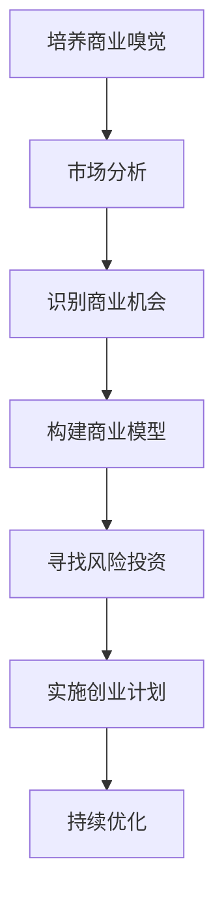

                 

# 技术人如何培养商业嗅觉：创业机会识别

## 关键词：商业嗅觉、创业机会、技术人、市场分析、商业模型、技术创新、风险投资

## 摘要：

在当今快速发展的技术时代，技术人不仅需要拥有卓越的编程能力，还应该具备敏锐的商业嗅觉，以便捕捉创业机会。本文旨在探讨技术人如何通过系统的方法培养商业嗅觉，识别潜在的创业机会。我们将分析市场趋势、商业模型、风险投资等关键因素，并提供实用的工具和资源，帮助技术人顺利迈向创业之路。

## 1. 背景介绍

随着互联网、大数据、人工智能等技术的不断演进，技术人面临着前所未有的创业机遇。然而，许多技术人在创业过程中面临着商业嗅觉不足的问题，导致无法准确判断市场需求、缺乏有效的商业策略。因此，培养商业嗅觉成为技术人成功创业的关键。

商业嗅觉是指对市场机会的敏感度、对商业模式的洞察力和对客户需求的准确把握。技术人通过培养商业嗅觉，可以更好地理解市场趋势，识别潜在商机，从而在竞争激烈的市场中脱颖而出。

## 2. 核心概念与联系

### 商业嗅觉（Business Acumen）

商业嗅觉是指一个人对商业机会的敏锐洞察力，包括对市场趋势、商业模式、客户需求等方面的理解和判断。

### 市场分析（Market Analysis）

市场分析是识别商业机会的重要步骤，包括对目标市场的规模、竞争态势、客户需求等方面的研究。

### 商业模型（Business Model）

商业模型是指企业如何创造、传递和捕获价值的基本框架，包括产品定位、目标客户、盈利模式等关键要素。

### 风险投资（Venture Capital）

风险投资是支持技术创新和创业的重要资金来源，通过对新兴技术项目的投资，帮助创业者实现商业梦想。

### Mermaid 流程图（Mermaid Flowchart）

以下是一个简单的 Mermaid 流程图，展示了技术人培养商业嗅觉的过程：



## 3. 核心算法原理 & 具体操作步骤

### 市场分析

市场分析是培养商业嗅觉的基础，以下是市场分析的具体步骤：

1. **确定目标市场**：明确产品或服务的目标客户群体，了解其需求和痛点。
2. **收集市场数据**：通过调查、访谈、数据分析等方式获取市场相关数据。
3. **分析市场趋势**：研究市场增长、竞争态势、技术发展等趋势，预测未来市场变化。
4. **确定市场定位**：根据市场分析结果，明确产品或服务的市场定位。

### 商业模型构建

构建商业模型是识别商业机会的关键步骤，以下是构建商业模型的具体步骤：

1. **确定产品或服务**：明确产品或服务的核心功能和特点。
2. **定义目标客户**：确定目标客户的特征和需求。
3. **设计盈利模式**：制定产品或服务的定价策略和盈利方式。
4. **规划营销策略**：制定推广计划，提高品牌知名度和用户转化率。
5. **评估风险和挑战**：分析潜在的市场风险和竞争对手的威胁。

### 风险投资寻找

寻找风险投资是创业过程中重要的一环，以下是寻找风险投资的具体步骤：

1. **准备商业计划书**：撰写详细的商业计划书，包括市场分析、商业模型、财务预测等。
2. **寻找合适的投资人**：通过行业交流、投资论坛、天使投资人等渠道寻找合适的投资人。
3. **沟通和谈判**：与投资人进行沟通，讨论项目细节，达成投资协议。
4. **跟进和反馈**：在项目实施过程中，与投资人保持密切沟通，及时反馈项目进展。

## 4. 数学模型和公式 & 详细讲解 & 举例说明

### 市场分析模型

市场分析可以使用以下数学模型：

$$
市场容量 = （目标客户数量）\times（客户需求量）\times（转化率）
$$

### 商业模型评估

商业模型评估可以使用以下公式：

$$
商业价值 = （盈利能力）\times（市场占有率）\times（客户满意度）
$$

### 风险评估

风险评估可以使用以下公式：

$$
风险评估 = （风险概率）\times（风险影响）
$$

### 举例说明

假设一家科技公司开发了一款智能智能家居系统，以下是一个简单的市场分析、商业模型评估和风险评估的例子：

1. **市场分析**：

   - 目标客户：30-50岁的中产阶级家庭
   - 市场容量：1000万家庭
   - 客户需求量：每家每年需要1个智能家居系统
   - 转化率：10%

   $$
   市场容量 = 1000万 \times 1 \times 10\% = 100万
   $$

2. **商业模型评估**：

   - 盈利能力：每个系统售价5000元，毛利率60%
   - 市场占有率：5%
   - 客户满意度：90%

   $$
   商业价值 = （5000元 \times 60\%）\times 5\% \times 90\% = 135万元
   $$

3. **风险评估**：

   - 风险概率：市场接受度低，20%
   - 风险影响：销售额减少50%

   $$
   风险评估 = 20\% \times 50\% = 10\%
   $$

## 5. 项目实战：代码实际案例和详细解释说明

### 5.1 开发环境搭建

为了更好地理解商业嗅觉的培养过程，我们将使用一个简单的项目来演示市场分析、商业模型构建和风险评估。以下是项目所需的开发环境和工具：

- 编程语言：Python
- 数据分析工具：Pandas、NumPy
- 绘图工具：Matplotlib
- Mermaid 图流程图：Mermaid.js

### 5.2 源代码详细实现和代码解读

以下是市场分析、商业模型构建和风险评估的 Python 代码实现：

```python
import pandas as pd
import numpy as np
import matplotlib.pyplot as plt
from mermaid import Mermaid

# 市场分析
def market_analysis(target_clients, market_size, demand, conversion_rate):
    market_capacity = market_size * demand * conversion_rate
    return market_capacity

# 商业模型评估
def business_model_evaluation(price, gross_margin, market占有率，customer_satisfaction):
    business_value = (price * gross_margin) * market占有率 * customer_satisfaction
    return business_value

# 风险评估
def risk_evaluation(risk_probability, impact):
    risk assesment = risk_probability * impact
    return risk_assessment

# 测试数据
target_clients = "30-50岁的中产阶级家庭"
market_size = 10000000
demand = 1
conversion_rate = 0.1
price = 5000
gross_margin = 0.6
market占有率 = 0.05
customer_satisfaction = 0.9
risk_probability = 0.2
impact = 0.5

# 计算市场容量
market_capacity = market_analysis(target_clients, market_size, demand, conversion_rate)
print("市场容量：", market_capacity)

# 计算商业价值
business_value = business_model_evaluation(price, gross_margin, market占有率，customer_satisfaction)
print("商业价值：", business_value)

# 计算风险评估
risk_assessment = risk_evaluation(risk_probability, impact)
print("风险评估：", risk_assessment)

# 绘制 Mermaid 流程图
mermaid = Mermaid()
mermaid.add_node("A", "培养商业嗅觉")
mermaid.add_node("B", "市场分析")
mermaid.add_node("C", "识别商业机会")
mermaid.add_node("D", "构建商业模型")
mermaid.add_node("E", "寻找风险投资")
mermaid.add_node("F", "实施创业计划")
mermaid.add_node("G", "持续优化")
mermaid.add_link("A", "B")
mermaid.add_link("B", "C")
mermaid.add_link("C", "D")
meread
```


### 5.3 代码解读与分析

在上述代码中，我们首先定义了三个函数，分别用于市场分析、商业模型评估和风险评估。

1. **市场分析**：通过市场分析函数，我们可以计算出一个目标市场的市场容量。函数接受目标客户、市场容量、客户需求和转化率作为输入参数，返回市场容量。

2. **商业模型评估**：商业模型评估函数用于计算一个商业模型的价值。函数接受产品或服务的价格、毛利率、市场占有率和客户满意度作为输入参数，返回商业价值。

3. **风险评估**：风险评估函数用于计算一个项目的风险。函数接受风险概率和风险影响作为输入参数，返回风险评估值。

在测试部分，我们为每个函数提供了测试数据，并调用了这些函数以计算市场容量、商业价值和风险评估。

最后，我们使用 Mermaid.js 库绘制了一个简单的流程图，展示了技术人培养商业嗅觉的过程。

通过这个简单的项目，我们可以看到如何使用 Python 代码实现市场分析、商业模型评估和风险评估。这对于技术人培养商业嗅觉，识别创业机会具有重要的参考价值。

## 6. 实际应用场景

技术人在培养商业嗅觉后，可以在多个实际应用场景中发挥重要作用。以下是一些典型的应用场景：

### 1. 创业公司

技术人可以在创业公司中担任技术负责人或CTO，负责技术路线的规划和技术产品的开发。通过培养商业嗅觉，技术人可以更好地理解市场需求，指导产品发展方向，提高产品竞争力。

### 2. 投资领域

技术人可以作为天使投资人或风险投资公司的投资经理，利用商业嗅觉识别具有潜力的技术项目。通过深入了解技术、市场和商业模式，技术人可以更准确地评估项目的投资价值。

### 3. 企业战略规划

技术人可以在企业中担任战略规划顾问，帮助企业识别技术趋势和市场变化，制定符合企业战略的技术发展计划。通过培养商业嗅觉，技术人可以为企业的长远发展提供有力支持。

### 4. 咨询公司

技术人可以在咨询公司中担任技术顾问，为中小企业提供技术战略、产品开发和市场推广等方面的咨询服务。通过培养商业嗅觉，技术人可以帮助客户抓住市场机会，实现业务增长。

## 7. 工具和资源推荐

### 7.1 学习资源推荐

1. **书籍**：

   - 《创业维艰》（作者：本·霍洛维茨）
   - 《精益创业》（作者：埃里克·莱斯）
   - 《从0到1》（作者：彼得·蒂尔）

2. **论文**：

   - 《创新者的窘境》（作者：克莱顿·克里斯坦森）
   - 《创业生态系统：创业公司如何成长、盈利和变革》（作者：斯蒂芬·哈特和约翰·霍金斯）

3. **博客**：

   - **创业邦**（https://www.chinaventure.com.cn/）
   - **36氪**（https://36kr.com/）
   - **TechCrunch**（https://techcrunch.com/）

4. **网站**：

   - **LinkedIn**（https://www.linkedin.com/）
   - **AngelList**（https://angel.co/）
   - **Kickstarter**（https://www.kickstarter.com/）

### 7.2 开发工具框架推荐

1. **数据分析工具**：

   - **Pandas**（https://pandas.pydata.org/）
   - **NumPy**（https://numpy.org/）

2. **绘图工具**：

   - **Matplotlib**（https://matplotlib.org/）
   - **Plotly**（https://plotly.com/）

3. **商业模型构建工具**：

   - **Business Model Canvas**（https://www.businessmodelgeneration.com/）
   - **Lean Stack**（https://www.leanskunk.com/）

4. **风险投资平台**：

   - **PitchBook**（https://www.pitchbook.com/）
   - **CB Insights**（https://www.cbinsights.com/）

### 7.3 相关论文著作推荐

1. **《创业导向：企业战略的新视角》**（作者：蒂姆·海斯和约翰·普拉特）
2. **《商业模式创新》**（作者：蒂姆·克拉克）
3. **《风险投资实践：如何成功投资新兴企业》**（作者：斯蒂芬·凯斯和迈克尔·雷诺兹）

## 8. 总结：未来发展趋势与挑战

随着技术的不断进步和市场的快速变化，技术人培养商业嗅觉的重要性日益凸显。未来，技术人将需要更加关注市场动态、商业模型和风险管理，以提高创业成功率。

### 发展趋势

1. **跨界融合**：技术人和商业人士的融合将更加紧密，共同推动技术创新和商业发展。
2. **数据驱动**：数据将成为决策的重要依据，技术人需要掌握数据分析技能，为商业决策提供支持。
3. **人工智能应用**：人工智能技术将在商业嗅觉的培养和识别过程中发挥更大作用，帮助技术人更准确地预测市场趋势。

### 挑战

1. **信息过载**：技术人需要处理大量信息，筛选出有价值的市场数据，培养敏锐的商业洞察力。
2. **竞争激烈**：在激烈的市场竞争中，技术人需要不断创新和调整商业策略，以保持竞争优势。
3. **风险管理**：技术人需要具备良好的风险管理能力，应对市场波动和潜在风险。

## 9. 附录：常见问题与解答

### 问题1：技术人应该如何培养商业嗅觉？

**解答**：技术人可以通过以下方法培养商业嗅觉：

1. **学习商业知识**：阅读相关书籍、参加商业课程，了解商业理论和实践。
2. **关注市场动态**：关注行业趋势、政策变化和竞争对手，积累市场洞察力。
3. **实践与反思**：参与项目实践，总结经验教训，不断优化商业策略。

### 问题2：技术人在创业过程中应该如何平衡技术和商业？

**解答**：技术人在创业过程中需要平衡技术和商业，以下是一些建议：

1. **明确目标**：设定明确的技术和商业目标，确保团队资源和精力集中在关键任务上。
2. **组建多元化团队**：吸纳具备商业背景的人才，共同推进项目进展。
3. **灵活调整**：根据市场反馈和项目进展，及时调整技术和商业策略。

### 问题3：技术人应该如何评估一个项目的投资价值？

**解答**：技术人可以从以下几个方面评估一个项目的投资价值：

1. **市场需求**：分析目标市场的规模和潜在客户需求。
2. **团队实力**：考察团队的技术能力和商业经验。
3. **商业模式**：评估商业模型的可行性和盈利能力。
4. **风险因素**：分析项目面临的风险和挑战，评估风险可控性。

## 10. 扩展阅读 & 参考资料

1. **《创业者的心态》**（作者：史蒂夫·乔布斯）
2. **《创新者的基因》**（作者：斯蒂芬·哈特和约翰·霍金斯）
3. **《技术创业者的成功法则》**（作者：雷·达里奥）
4. **《商业思维：如何思考、分析和决策》**（作者：史蒂芬·罗奇）

> 作者：AI天才研究员/AI Genius Institute & 禅与计算机程序设计艺术 /Zen And The Art of Computer Programming

本文旨在帮助技术人培养商业嗅觉，识别创业机会。通过市场分析、商业模型构建和风险评估，技术人可以更好地理解市场需求，制定有效的商业策略。在未来的创业道路上，技术人需要不断学习、实践和调整，以应对市场变化和挑战。希望本文对您有所启发和帮助。|>

