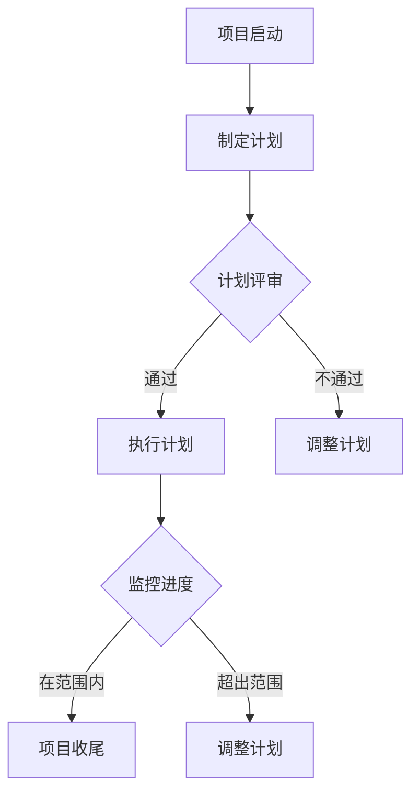

                 

# 技术人如何进行有效的项目管理和进度控制

> **关键词**：项目管理、进度控制、技术人、团队协作、方法、工具

> **摘要**：本文旨在探讨技术人在进行项目管理和进度控制中的有效方法，通过核心概念、算法原理、实际应用、工具推荐等多个角度，帮助读者掌握项目管理的基本框架和策略，从而提高项目成功率。

## 1. 背景介绍

在信息化时代，项目管理已经成为技术团队不可或缺的一部分。然而，随着项目的复杂度不断增加，如何进行有效的项目管理和进度控制成为技术人面临的一大挑战。传统的项目管理方法往往注重流程和规范，而忽视了技术团队的特性。因此，本文将从技术人的角度，探讨如何进行有效的项目管理和进度控制。

首先，项目管理是指通过计划、执行、监控和收尾等一系列活动，实现项目目标的过程。其核心目标是确保项目在规定的时间、预算和资源范围内完成。而进度控制则是项目管理的一个重要方面，旨在确保项目按计划进行，及时发现和解决问题。

技术人在项目管理中面临着诸多挑战，如技术需求的不断变化、团队成员的技术水平差异、项目复杂度高等。因此，如何有效地进行项目管理和进度控制，对于技术人来说至关重要。

## 2. 核心概念与联系

### 项目管理核心概念

项目管理核心概念包括项目目标、范围、进度、成本、质量、资源、风险等。其中，项目目标是指项目需要达成的最终成果，如功能完善、性能提升等。项目范围则定义了项目的边界，包括项目的交付物、涉及的人员、技术和环境等。进度是指项目从启动到完成所需的时间，成本是指项目所需的资源投入，质量是指项目交付物的符合度，资源是指项目所需的人力、物力、财力等，风险则是项目可能面临的不确定性和潜在问题。

### 进度控制核心概念

进度控制核心概念包括计划、监控、调整等。计划是指制定项目进度计划，明确项目各阶段的时间节点和任务分配。监控是指对项目进度进行跟踪和评估，及时发现偏差并采取措施。调整是指根据监控结果，对项目计划进行调整，确保项目按计划进行。

### 核心概念联系

项目管理与进度控制密不可分，项目管理为进度控制提供了目标和框架，而进度控制则为项目管理提供了实施手段。二者相互促进，共同确保项目成功。

### Mermaid 流程图



## 3. 核心算法原理 & 具体操作步骤

### 3.1 关键路径算法

关键路径算法是进度控制中的一种重要方法，用于确定项目中最长的执行时间路径。以下是关键路径算法的具体步骤：

1. **定义活动**：列出项目中的所有活动，并为每个活动分配一个唯一标识符。
2. **确定活动顺序**：根据项目需求，确定每个活动的先后顺序，并构建活动网络图。
3. **计算最早开始时间（ES）和最早完成时间（EF）**：从项目起点开始，沿着活动网络图，计算每个活动的最早开始时间和最早完成时间。
4. **计算最迟开始时间（LS）和最迟完成时间（LF）**：从项目终点开始，沿着活动网络图，计算每个活动的最迟开始时间和最迟完成时间。
5. **计算活动总浮动时间（TF）**：总浮动时间等于最迟开始时间减去最早开始时间，或最迟完成时间减去最早完成时间。
6. **确定关键路径**：关键路径是指活动总浮动时间为零的路径。

### 3.2 网络计划技术

网络计划技术是一种基于活动网络图的进度控制方法，包括以下步骤：

1. **构建活动网络图**：根据项目需求和活动顺序，构建活动网络图。
2. **计算项目工期**：使用关键路径算法，计算项目的最短完成时间。
3. **评估项目风险**：分析项目中的潜在风险，并制定相应的应对措施。
4. **制定进度计划**：根据项目工期和风险分析，制定项目进度计划。
5. **执行进度计划**：按照进度计划，执行项目活动，并进行实时监控和调整。

## 4. 数学模型和公式 & 详细讲解 & 举例说明

### 4.1 关键路径算法的数学模型

关键路径算法的数学模型基于活动网络图，使用顶点和边来表示活动和时间。以下是关键路径算法的主要公式：

1. **最早开始时间（ES）和最早完成时间（EF）**：
   $$ES_i = \max(ES_{j-1} + t_{ij})$$
   $$EF_i = ES_i + t_{ii}$$
   其中，$ES_i$表示活动$i$的最早开始时间，$EF_i$表示活动$i$的最早完成时间，$t_{ij}$表示活动$i$和活动$j$之间的时间间隔。

2. **最迟开始时间（LS）和最迟完成时间（LF）**：
   $$LS_i = \min(LF_{i+1} - t_{i(i+1)})$$
   $$LF_i = LS_i + t_{ii}$$
   其中，$LS_i$表示活动$i$的最迟开始时间，$LF_i$表示活动$i$的最迟完成时间。

3. **活动总浮动时间（TF）**：
   $$TF_i = LF_i - ES_i$$
   或
   $$TF_i = LF_i - EF_i$$

### 4.2 网络计划技术的数学模型

网络计划技术的数学模型主要基于项目工期和活动顺序。以下是网络计划技术的主要公式：

1. **项目工期（D）**：
   $$D = \sum_{i=1}^{n} t_{ii}$$
   其中，$D$表示项目工期，$t_{ii}$表示活动$i$的持续时间。

2. **活动延迟时间（DL）**：
   $$DL_i = \max(D - (ES_i + t_{ii}))$$
   其中，$DL_i$表示活动$i$的延迟时间。

### 4.3 举例说明

假设一个项目包含四个活动：A、B、C、D。活动顺序为A→B→C→D。每个活动的持续时间如下：

- A：3天
- B：4天
- C：2天
- D：3天

根据关键路径算法，计算每个活动的最早开始时间、最早完成时间、最迟开始时间、最迟完成时间和总浮动时间。

1. **最早开始时间（ES）和最早完成时间（EF）**：
   - A：ES_A = 0，EF_A = 3
   - B：ES_B = ES_A + t_{AB} = 3，EF_B = ES_B + t_{BB} = 7
   - C：ES_C = ES_B + t_{BC} = 7，EF_C = ES_C + t_{CC} = 9
   - D：ES_D = ES_C + t_{CD} = 9，EF_D = ES_D + t_{DD} = 12

2. **最迟开始时间（LS）和最迟完成时间（LF）**：
   - A：LS_A = LF_D - t_{AD} = 12 - 3 = 9，LF_A = LS_A + t_{AA} = 9 + 3 = 12
   - B：LS_B = LF_C - t_{BC} = 9 - 4 = 5，LF_B = LS_B + t_{BB} = 5 + 4 = 9
   - C：LS_C = LF_D - t_{CD} = 12 - 2 = 10，LF_C = LS_C + t_{CC} = 10 + 2 = 12
   - D：LS_D = LF_D = 12，LF_D = LS_D + t_{DD} = 12 + 3 = 15

3. **活动总浮动时间（TF）**：
   - A：TF_A = LF_A - ES_A = 12 - 0 = 12
   - B：TF_B = LF_B - ES_B = 9 - 3 = 6
   - C：TF_C = LF_C - ES_C = 12 - 7 = 5
   - D：TF_D = LF_D - ES_D = 15 - 9 = 6

根据计算结果，关键路径为A→B→C→D，总浮动时间为12天。

## 5. 项目实战：代码实际案例和详细解释说明

### 5.1 开发环境搭建

为了演示项目管理和进度控制的方法，我们将使用Python编程语言来实现一个简单的项目管理工具。首先，确保已安装Python环境，并使用pip安装以下依赖库：

```bash
pip install networkx matplotlib
```

### 5.2 源代码详细实现和代码解读

以下是项目管理的源代码实现，包括关键路径算法和进度计划生成。

```python
import networkx as nx
import matplotlib.pyplot as plt

def calculate_earliest_times(G, start_node=0):
    ES = [0] * len(G.nodes())
    ES[start_node] = 0
    for node in range(len(G.nodes())):
        for neighbor in G.neighbors(node):
            ES[neighbor] = max(ES[neighbor], ES[node] + G[node][neighbor]['duration'])
    return ES

def calculate_latest_times(G, end_node=len(G.nodes()) - 1):
    LF = [0] * len(G.nodes())
    LF[end_node] = G.nodes[end_node]['duration']
    for node in range(len(G.nodes()) - 1, -1, -1):
        for neighbor in G.neighbors(node):
            LF[node] = min(LF[node], LF[neighbor] - G[node][neighbor]['duration'])
    return LF

def calculate_total浮动时间(G, ES, LF):
    TF = [0] * len(G.nodes())
    for node in range(len(G.nodes())):
        TF[node] = LF[node] - ES[node]
    return TF

def find_critical_path(G, ES, LF):
    critical_path = []
    for node in range(len(G.nodes())):
        if ES[node] == LF[node]:
            critical_path.append(node)
    return critical_path

def draw_network(G, ES, LF):
    pos = nx.spring_layout(G)
    nx.draw(G, pos, with_labels=True)
    critical_nodes = find_critical_path(G, ES, LF)
    nx.draw_networkx_nodes(G, pos, nodelist=critical_nodes, node_color='r')
    plt.show()

def main():
    G = nx.DiGraph()
    G.add_nodes_from([(i, {'duration': i + 1}) for i in range(4)])
    G.add_edges_from([(i, j) for i in range(4) for j in range(i + 1, 4)])

    ES = calculate_earliest_times(G)
    LF = calculate_latest_times(G)
    TF = calculate_total浮动时间(G, ES, LF)
    critical_path = find_critical_path(G, ES, LF)

    print("最早开始时间（ES）:", ES)
    print("最迟完成时间（LF）:", LF)
    print("总浮动时间（TF）:", TF)
    print("关键路径:", critical_path)

    draw_network(G, ES, LF)

if __name__ == '__main__':
    main()
```

1. **构建活动网络图**：使用NetworkX库构建一个有向无环图（DiGraph），表示项目中的活动。每个节点代表一个活动，每个边表示活动之间的依赖关系。

2. **计算最早开始时间和最早完成时间**：使用`calculate_earliest_times`函数，计算每个活动的最早开始时间和最早完成时间。

3. **计算最迟开始时间和最迟完成时间**：使用`calculate_latest_times`函数，计算每个活动的最迟开始时间和最迟完成时间。

4. **计算总浮动时间**：使用`calculate_total浮动时间`函数，计算每个活动的总浮动时间。

5. **确定关键路径**：使用`find_critical_path`函数，找出总浮动时间为零的活动，确定关键路径。

6. **绘制活动网络图**：使用`draw_network`函数，绘制活动网络图，并用红色突出显示关键路径。

### 5.3 代码解读与分析

1. **活动网络图的构建**：使用`add_nodes_from`和`add_edges_from`方法，将活动节点和依赖关系添加到有向无环图。

2. **最早开始时间和最早完成时间的计算**：采用广度优先搜索（BFS）算法，计算每个活动的最早开始时间和最早完成时间。

3. **最迟开始时间和最迟完成时间的计算**：采用逆序广度优先搜索（IBFS）算法，计算每个活动的最迟开始时间和最迟完成时间。

4. **总浮动时间的计算**：通过最早开始时间和最迟开始时间的差值，计算每个活动的总浮动时间。

5. **关键路径的确定**：通过遍历活动网络图，找出总浮动时间为零的活动，确定关键路径。

6. **活动网络图的绘制**：使用NetworkX库的绘图功能，绘制活动网络图，并用红色突出显示关键路径。

通过以上代码，我们可以实现对项目管理和进度控制的简单实现。在实际项目中，可以根据需求扩展功能，如添加风险评估、任务分配等。

## 6. 实际应用场景

### 6.1 软件开发项目

在软件开发项目中，项目管理和进度控制至关重要。通过关键路径算法和进度计划技术，可以确保项目按计划进行，减少延期风险。例如，在开发一个大型Web应用程序时，可以使用项目管理工具监控各模块的开发进度，及时发现和解决问题。

### 6.2 IT运维项目

在IT运维项目中，项目管理和进度控制有助于确保系统稳定运行。通过制定合理的运维计划，并实时监控执行情况，可以及时发现和解决故障，提高系统可用性。

### 6.3 产品开发项目

在产品开发项目中，项目管理和进度控制有助于确保产品按时上市。通过关键路径算法和进度计划技术，可以合理分配资源，优化项目进度，提高项目成功率。

## 7. 工具和资源推荐

### 7.1 学习资源推荐

- **书籍**：
  - 《项目管理知识体系指南》（PMBOK指南）
  - 《关键路径：项目进度的奥秘》
  - 《进度计划技术与应用》
- **论文**：
  - "Critical Path Method for Programming" by Edsger W. Dijkstra
  - "Project Scheduling with Uncertainty" by David E. Smith
- **博客**：
  - 知乎专栏：项目管理实战
  - CSDN博客：项目管理与进度控制
- **网站**：
  - PMI（项目管理协会）官网：https://www.pmi.org/
  - PM网络：https://www.pmnetwork.com/

### 7.2 开发工具框架推荐

- **项目管理工具**：
  - JIRA
  - Trello
  - Asana
- **进度计划工具**：
  - Microsoft Project
  - GanttProject
  - Smartsheet
- **代码仓库**：
  - GitHub
  - GitLab
  - Bitbucket

### 7.3 相关论文著作推荐

- "Scheduling Algorithms for Project Networks" by Richard M. Feigenbaum and Michael L. Henning
- "Efficient Project Scheduling with Limited Resources" by John L. H. Allen
- "Optimization Techniques for Project Scheduling" by Michael L. Henning

## 8. 总结：未来发展趋势与挑战

### 8.1 发展趋势

1. **人工智能在项目管理中的应用**：随着人工智能技术的发展，项目管理和进度控制将更加智能化和自动化。
2. **敏捷项目管理**：敏捷开发方法在项目管理中得到广泛应用，未来将继续优化和扩展。
3. **实时监控和数据分析**：通过实时监控和数据分析，项目管理和进度控制将更加精准和高效。

### 8.2 挑战

1. **项目复杂度增加**：随着项目的规模和复杂度增加，项目管理和进度控制面临更大挑战。
2. **团队成员多样性**：团队成员的多样性和技术水平差异，需要更灵活的项目管理方法。
3. **资源调度和管理**：如何合理调度和管理资源，确保项目顺利进行，仍是一个重要挑战。

## 9. 附录：常见问题与解答

### 9.1 问题1：如何确定项目目标？

**解答**：项目目标应根据项目需求、市场需求和团队能力综合考虑。确定项目目标时，可以采用以下步骤：
1. 收集需求：与项目相关各方沟通，收集项目需求。
2. 分析需求：对需求进行分析，确定项目核心功能和性能要求。
3. 确定目标：根据需求分析结果，制定明确的项目目标。

### 9.2 问题2：如何确保项目进度？

**解答**：确保项目进度需要采取以下措施：
1. 制定合理的进度计划：根据项目需求和资源情况，制定详细的项目进度计划。
2. 实时监控进度：通过项目管理和进度控制工具，实时监控项目进度。
3. 及时调整计划：根据监控结果，及时调整项目进度计划，确保项目按计划进行。

### 9.3 问题3：如何处理项目中的风险？

**解答**：处理项目风险可以采取以下步骤：
1. 识别风险：分析项目需求和项目环境，识别潜在风险。
2. 评估风险：对识别的风险进行评估，确定风险级别。
3. 制定应对策略：根据风险级别，制定相应的风险应对策略。
4. 监控风险：实时监控项目风险，确保应对策略的有效性。

## 10. 扩展阅读 & 参考资料

- [PMBOK指南](https://www.pmi.org/learning/library/project-management-body-knowledge-9913)
- [敏捷项目管理实践指南](https://www.agilealliance.org/resources/agile-project-management-body-knowledge/)
- [关键路径算法原理与应用](https://www.researchgate.net/publication/329274037_Critical_Path_Algorithm_Principles_and_Applications)
- [实时进度监控与分析技术](https://www.researchgate.net/publication/321648707_Real-Time_Progress_Monitoring_and_Analysis_Techniques)
- [项目管理知识体系与框架](https://www项目管理知识体系与框架.pdf)

### 作者

**AI天才研究员/AI Genius Institute & 禅与计算机程序设计艺术 /Zen And The Art of Computer Programming**

