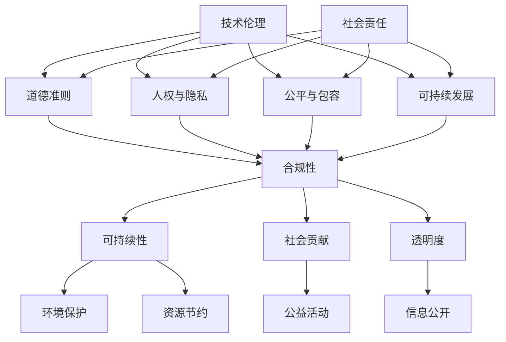

                 

### 文章标题

《技术伦理与社会责任：创业者需要关注的问题》

### 关键词

技术伦理、社会责任、创业者、道德准则、影响与挑战、合规性、可持续发展

### 摘要

在技术快速发展的今天，创业者们在追求商业成功的同时，必须深刻认识到技术伦理和社会责任的重要性。本文将探讨技术伦理的核心概念，分析创业者面临的社会责任挑战，提供解决策略，并展望未来技术伦理的发展趋势。通过本文的深入分析，读者将了解如何在创业过程中平衡技术创新与社会责任，为构建一个更加和谐、可持续的数字社会贡献力量。

## 1. 背景介绍

随着信息技术的飞速发展，人工智能、大数据、云计算等新兴技术逐渐渗透到社会各个领域，推动着产业变革和经济增长。然而，技术的进步也伴随着一系列伦理和社会责任的挑战。创业者作为技术变革的引领者，他们的决策和行为不仅影响公司的发展和投资者的利益，更关乎整个社会的公平、公正和可持续发展。

技术伦理是指技术设计、开发和应用过程中需要遵循的道德规范和价值观念。它关注技术对人类、环境和社会的影响，旨在确保技术在促进人类福祉的同时，不造成不可接受的伤害和负面影响。社会责任则是指企业在追求商业成功的过程中，对社会和环境的责任承担。创业者作为企业的领导者，承担着确保技术发展和商业运作符合伦理规范和社会期望的重要责任。

当前，技术伦理和社会责任问题在多个领域引起了广泛关注。例如，人工智能的决策算法可能存在性别、种族偏见，大数据的滥用可能导致个人隐私泄露，云计算的安全性和数据保护成为全球关注的焦点。这些挑战不仅对创业者的决策提出了更高的要求，也考验着整个社会的伦理和法律体系。

本文旨在通过深入分析技术伦理和社会责任的核心概念，探讨创业者面临的具体挑战和解决策略，为创业者提供有益的指导，并展望未来技术伦理的发展趋势。通过本文的讨论，我们希望引发读者对于技术伦理和社会责任的思考，共同构建一个更加和谐、可持续的数字社会。

## 2. 核心概念与联系

### 技术伦理的核心概念

技术伦理的核心概念包括但不限于以下几个重要方面：

**1. 道德准则**：道德准则是技术伦理的基础，包括诚实、公正、尊重、责任等基本价值观。创业者需要将这些价值观融入公司文化和决策过程中，确保技术发展和商业运作符合道德规范。

**2. 人权与隐私**：技术发展必须尊重人权和隐私权。人工智能和大数据技术的广泛应用，使得个人信息和数据的安全和隐私受到威胁。创业者需要确保技术的应用不侵犯用户的基本权利。

**3. 公平与包容**：技术应当促进社会的公平与包容，避免加剧社会不平等和歧视。创业者在设计产品和服务时，需要充分考虑不同用户群体的需求，确保技术对所有人都是公平、可及的。

**4. 可持续发展**：技术应助力实现可持续发展的目标，包括环境保护、资源节约和社会责任。创业者需要关注技术的环境影响，推动绿色发展。

### 社会责任的核心概念

社会责任的核心概念同样重要，主要包括以下几个方面：

**1. 合规性**：企业需要遵守相关法律法规，确保商业运作合法合规。对于创业者而言，合规性是确保公司长期发展的基础。

**2. 可持续性**：企业应当追求可持续发展，包括环境、社会和经济三个方面。创业者需要制定和实施可持续发展的战略，推动企业和社会的可持续发展。

**3. 社会贡献**：企业应当积极参与社会公益活动，回馈社会。创业者可以通过捐赠、志愿服务等方式，促进社会和谐与进步。

**4. 透明度**：企业需要保持高度的透明度，公开公司运营数据和信息，接受社会监督。透明度有助于建立企业公信力和用户信任。

### 技术伦理与社会责任的联系

技术伦理与社会责任之间存在密切的联系。首先，技术伦理是社会责任的重要组成部分。技术的道德性和伦理性直接影响到企业的社会责任履行。一个遵守伦理规范的技术，更可能推动企业承担社会责任。其次，社会责任的实施需要技术作为支撑。例如，企业通过技术创新实现环境保护和资源节约，本身就是社会责任的体现。

为了更好地理解和应用这些核心概念，我们可以通过一个Mermaid流程图来展示技术伦理与社会责任的联系。

通过这个流程图，我们可以清晰地看到技术伦理与社会责任的相互关联，以及它们在不同层面上的具体体现。

### 技术伦理在创业中的重要性

技术伦理在创业过程中具有重要意义，它不仅关系到企业的合法合规，更关乎企业的长远发展和市场竞争力。以下是技术伦理在创业中的几个关键作用：

**1. 增强市场竞争力**：技术伦理是企业的一张重要名片。在市场竞争激烈的环境中，遵守伦理规范的企业往往能够赢得用户的信任和市场的认可。例如，苹果公司以严格的隐私保护措施赢得了广泛好评，树立了良好的品牌形象。

**2. 降低法律风险**：遵守技术伦理规范有助于企业规避法律风险。技术伦理涉及人权、隐私、公平等多个方面，如果企业在这些方面存在违法行为，可能会导致诉讼、罚款甚至业务中断。例如，Facebook因数据隐私问题多次被起诉，不仅付出了巨额罚款，还严重损害了品牌声誉。

**3. 促进可持续发展**：技术伦理关注技术的环境影响和社会责任，有助于企业实现可持续发展。创业者通过遵循伦理规范，可以减少资源浪费、保护生态环境，从而为企业的长期发展打下坚实基础。

**4. 提升员工凝聚力**：技术伦理也是企业文化的重要组成部分。一个重视技术伦理的企业，能够吸引和留住高素质的员工。员工在这种企业中工作，更有成就感和社会责任感，从而提升整体团队的凝聚力和工作效率。

**5. 增强社会影响力**：技术伦理不仅对企业内部产生影响，还会对整个社会产生积极影响。遵守伦理规范的企业，往往能够成为社会的榜样，推动整个行业和市场的正向发展。例如，特斯拉通过技术创新和环保理念，不仅实现了商业成功，还推动了全球电动汽车产业的发展。

综上所述，技术伦理在创业中的重要性不可忽视。创业者应将技术伦理融入企业文化和决策过程中，确保企业在追求商业成功的同时，也履行社会责任，为构建一个更加和谐、可持续的数字社会贡献力量。

### 社会责任在创业中的重要性

社会责任在创业中的重要性同样不可低估。它不仅是企业合法合规的基础，更是企业长期可持续发展的关键。以下是社会责任在创业中的几个关键作用：

**1. 提升企业公信力**：社会责任是企业与外部环境建立信任的重要桥梁。企业通过积极参与社会公益活动、遵守法律法规和伦理规范，能够提升自身的公信力，赢得社会和消费者的认可。例如，阿里巴巴在多年来积极参与公益活动，树立了良好的企业品牌形象，增强了消费者对其信任。

**2. 降低运营风险**：社会责任有助于企业降低运营风险。企业若能遵守社会责任，就能够规避因违规操作导致的法律诉讼、罚款和业务中断。例如，谷歌通过严格遵守数据隐私保护法规，避免了因数据泄露而引发的巨大法律风险。

**3. 促进品牌价值提升**：社会责任是品牌价值的重要组成部分。企业通过履行社会责任，能够提升品牌价值，吸引更多消费者和投资者的关注。例如，宜家通过强调环保和社会责任，赢得了全球消费者的青睐。

**4. 留住和吸引人才**：社会责任是企业吸引和留住人才的重要手段。越来越多的员工愿意加入那些注重社会责任的企业，因为他们认为这样的企业具有更高的社会价值和成就感。例如，微软通过实施一系列社会责任项目，吸引了大量高素质的人才，增强了企业的竞争力。

**5. 提高市场竞争力**：社会责任有助于企业提高市场竞争力。在消费者越来越关注企业社会责任的今天，那些能够履行社会责任的企业往往能够赢得更多市场份额。例如，沃尔玛通过积极参与社区发展和环保项目，提升了其市场竞争力。

综上所述，社会责任在创业中的重要性不言而喻。创业者应将社会责任纳入企业战略，通过积极履行社会责任，提升企业公信力、降低运营风险、促进品牌价值提升、留住和吸引人才，从而在激烈的市场竞争中脱颖而出。

### 创业者面临的技术伦理与社会责任挑战

随着技术的飞速发展，创业者面临着越来越多的技术伦理和社会责任挑战。这些挑战不仅考验着创业者的决策智慧，也关系到企业的长远发展和市场竞争力。以下是创业者需要关注的主要挑战：

**1. 数据隐私与安全**：在数字化时代，数据隐私和安全成为创业者面临的首要挑战。随着大数据和人工智能技术的广泛应用，企业掌握了大量用户数据。如何保护这些数据，防止数据泄露和滥用，成为创业者必须解决的问题。例如，2018年Facebook数据泄露事件引发了全球对数据隐私问题的关注，对企业声誉和业务造成了巨大影响。

**2. 人权与歧视**：技术的设计和应用过程中，可能会出现人权和歧视问题。例如，人工智能算法可能因为训练数据中的偏见而导致性别、种族等歧视。创业者需要确保技术的公平性和透明性，避免因技术失误而对特定群体造成不公平待遇。

**3. 环境影响**：技术的快速迭代和应用，对环境带来了巨大压力。创业者需要关注技术的环境影响，推动绿色发展。例如，云计算和数据中心的高能耗问题引起了广泛关注，创业者需要寻找更加环保的技术解决方案。

**4. 社会不平等**：技术发展可能加剧社会不平等。一些先进技术可能只有富人和大企业能够负担，而弱势群体则难以享受到技术带来的便利。创业者需要考虑技术的社会影响，确保技术能够惠及所有社会群体。

**5. 法律合规**：技术伦理和社会责任要求企业遵守相关法律法规。创业者需要了解并遵循不同国家和地区的法律法规，确保企业运营合法合规。例如，欧盟的《通用数据保护条例》（GDPR）对数据隐私保护提出了严格要求，创业者需要确保符合相关法规。

**6. 可持续性**：随着全球环境问题的加剧，可持续发展成为企业必须面对的挑战。创业者需要制定和实施可持续发展战略，推动企业和社会的可持续发展。例如，通过使用可再生能源、减少资源浪费等方式，实现环境、社会和经济的平衡。

**7. 信息透明度**：企业需要保持高度的信息透明度，公开公司运营数据和信息，接受社会监督。透明度有助于建立企业公信力，增强用户和投资者的信任。例如，特斯拉通过公开电池技术数据和生产数据，赢得了广泛认可。

**8. 社会责任实践**：企业需要积极参与社会公益活动，承担社会责任。创业者可以通过捐赠、志愿服务、环保项目等方式，回馈社会。例如，微软每年投入大量资源用于公益项目，提升了其社会形象和品牌价值。

综上所述，创业者面临的技术伦理和社会责任挑战多样且复杂。只有通过深入分析这些挑战，并采取有效的解决策略，创业者才能在追求商业成功的同时，履行社会责任，为构建一个更加和谐、可持续的数字社会贡献力量。

### 解决技术伦理与社会责任挑战的策略

面对技术伦理和社会责任的多重挑战，创业者需要采取一系列策略来确保企业在追求商业成功的同时，履行社会责任。以下是几种有效的解决策略：

**1. 建立内部伦理委员会**：创业者可以建立专门的伦理委员会，负责监督企业技术伦理和社会责任的实施。这个委员会应由技术、法律、伦理和社会学等多个领域的专家组成，确保决策过程中能够全面考虑各方面因素。例如，谷歌就设有内部伦理委员会，负责监督公司的道德决策。

**2. 制定伦理和社会责任指南**：企业应制定详细的伦理和社会责任指南，明确公司应遵循的道德规范和社会责任。这些指南应覆盖从技术开发到产品推广的各个阶段，确保技术设计和应用过程中始终遵循伦理规范。例如，微软的《微软社会责任准则》详细规定了公司在技术伦理和社会责任方面的具体做法。

**3. 强化员工培训**：创业者需要加强对员工的伦理和社会责任培训，提高员工对技术伦理和社会责任的认识和重视。培训内容应包括技术伦理的基本原则、社会责任的重要性以及企业具体的伦理和社会责任实践。例如，亚马逊定期为员工提供伦理培训，确保员工在业务运营中能够遵循伦理规范。

**4. 实施透明度政策**：企业应实施透明度政策，公开公司的运营数据、技术决策和伦理实践。透明度有助于增强用户和投资者的信任，促进企业的公信力。例如，Facebook在数据隐私问题上增加了透明度，定期向公众报告数据使用情况，赢得了部分用户的信任。

**5. 推动技术研发的伦理审查**：在技术开发阶段，企业应实施伦理审查机制，确保技术设计和应用过程中不违反伦理规范。伦理审查应包括对技术可能带来的社会影响、人权保护、数据隐私等多个方面的评估。例如，IBM在开发人工智能技术时，设立了严格的伦理审查程序，确保技术能够公平、透明地运行。

**6. 与利益相关者合作**：企业应与政府、非政府组织、社区和其他利益相关者合作，共同推动技术伦理和社会责任的落实。通过多方合作，企业可以获取更多的资源和支持，共同应对技术伦理和社会责任挑战。例如，苹果公司与多个环保组织合作，推动绿色供应链的实施。

**7. 定期评估和改进**：企业应定期对技术伦理和社会责任实施情况进行评估和改进。这包括对现有政策和实践的审查，以及对新技术应用可能带来的伦理和社会影响的预测。通过持续改进，企业可以不断适应技术和社会的发展，确保始终走在技术伦理和社会责任的前沿。例如，微软每年都会对其社会责任实践进行审查和改进，确保其策略能够与时俱进。

**8. 鼓励创新和探索**：创业者应鼓励员工在技术创新过程中，积极探索解决技术伦理和社会责任问题的方法。通过创新和探索，企业可以开发出更加符合伦理规范和社会期望的技术，推动整个行业的正向发展。例如，谷歌鼓励员工通过内部创新项目，探索解决人工智能伦理问题的方法。

通过以上策略，创业者可以在技术发展的同时，有效应对伦理和社会责任挑战，为构建一个更加和谐、可持续的数字社会贡献力量。

### 创业者在技术伦理与社会责任方面的成功实践案例

在技术伦理与社会责任方面，许多创业者通过成功实践树立了良好的典范。以下是一些值得借鉴的案例：

**1. 亚马逊的透明供应链**：亚马逊通过实施透明供应链政策，确保其产品生产和运输过程中的环保和社会责任。亚马逊使用区块链技术追踪产品来源，确保供应链的透明度和合规性。此外，亚马逊还设立了“气候 pledge”，承诺到 2040 年实现供应链的零碳排放。这种透明和可持续的供应链管理，不仅提升了亚马逊的品牌价值，也为行业树立了标杆。

**2. 微软的伦理审查机制**：微软在技术开发过程中设立了严格的伦理审查机制，确保技术设计和应用过程中不违反伦理规范。微软的“AI 伦理准则”规定了人工智能技术的公平性、透明性和隐私保护等方面。例如，微软在开发面部识别技术时，对其可能带来的伦理和社会影响进行了详细评估，确保技术能够公平、透明地运行。

**3. 特斯拉的环保理念**：特斯拉通过推进电动汽车和可再生能源技术，实现了环保和社会责任的完美结合。特斯拉不仅致力于生产零排放的电动汽车，还通过建设太阳能发电设施，推动可再生能源的应用。特斯拉的环保理念不仅提升了品牌价值，也为全球环保事业作出了巨大贡献。

**4. 谷歌的社会创新项目**：谷歌通过一系列社会创新项目，积极推动技术伦理和社会责任的实践。谷歌设立了“谷歌社会创新挑战”，鼓励全球创业者通过技术创新解决社会问题。此外，谷歌还推出了“谷歌公益计划”，提供免费技术支持，帮助非营利组织实现其目标。这些项目不仅提升了谷歌的社会形象，也为行业树立了榜样。

**5. 联想集团的可持续发展战略**：联想集团通过实施可持续发展战略，致力于实现环境、社会和经济的平衡。联想在全球范围内推动节能减排，减少废弃物产生，并通过绿色采购和循环利用等措施，实现可持续发展。此外，联想还积极参与社会公益活动，支持教育、环保等领域的发展。联想的可持续发展实践，不仅提升了品牌价值，也为全球可持续发展作出了积极贡献。

通过以上案例，我们可以看到，成功的创业者不仅关注商业成功，更注重技术伦理和社会责任的实践。他们通过具体行动，为构建一个更加和谐、可持续的数字社会贡献力量。这些成功实践为其他创业者提供了宝贵的经验和启示，值得广泛借鉴。

### 技术伦理与社会责任在创业中的未来发展趋势与挑战

随着技术的不断进步和社会对伦理和责任意识的提升，技术伦理与社会责任在创业领域的未来发展趋势和面临的挑战也将更加多元和复杂。以下是对这些趋势和挑战的深入探讨。

#### 未来发展趋势

**1. 伦理合规标准的完善**：随着全球对技术伦理和社会责任的关注度不断提高，各国政府、国际组织和行业联盟将逐步完善伦理合规标准。例如，欧盟的《通用数据保护条例》（GDPR）和《数字市场法》等法规已经开始对企业的数据隐私和安全提出严格要求。未来，更多国家和地区的相关法规将逐步出台，创业者需要更加重视合规性，确保企业运营符合国际标准。

**2. 技术伦理意识的普及**：随着公众对技术伦理和社会责任问题的认知不断提升，创业者和技术开发者也将更加重视伦理规范。教育机构和专业组织将加大技术伦理教育力度，培养具有高度社会责任感的创新人才。这不仅有助于企业在技术创新中融入伦理考量，也有利于推动整个行业向更加负责任的方向发展。

**3. 新技术驱动的伦理解决方案**：未来，人工智能、区块链等新兴技术将为解决技术伦理和社会责任问题提供新的可能性。例如，区块链技术可以提供透明、不可篡改的数据记录，有助于提高企业运营的透明度和公信力。人工智能则可以通过算法优化和模型训练，减少偏见和歧视，提高技术的公平性和包容性。

**4. 社会责任投资（SRI）的兴起**：随着社会责任投资（SRI）的兴起，越来越多的投资者将伦理和社会责任视为重要的投资考量因素。创业者需要关注社会责任投资趋势，制定和实施符合投资者期望的伦理和社会责任战略，以吸引更多的社会资源和资本。

#### 面临的挑战

**1. 复杂的法律和监管环境**：随着伦理合规标准的不断完善，创业者将面临更加复杂的法律和监管环境。不同国家和地区之间的法规差异，以及法规的不断更新和变化，将给企业的合规性带来巨大挑战。创业者需要保持高度关注，及时调整策略，确保企业运营符合相关法规。

**2. 技术与伦理的平衡**：在追求技术创新的同时，如何确保技术符合伦理规范，是一个长期的挑战。创业者需要在技术开发过程中，持续进行伦理审查和风险评估，确保技术设计和应用过程中不违反伦理原则。同时，需要建立有效的反馈机制，及时应对技术可能带来的伦理问题。

**3. 社会影响的评估**：技术发展可能对社会产生深远的影响，创业者需要全面评估技术的社会影响，并采取相应的措施。这包括对技术可能带来的就业影响、社会不平等、数据隐私等问题进行深入分析，并制定相应的解决方案。例如，人工智能技术可能替代某些工作岗位，创业者需要考虑如何帮助受影响的人群重新就业。

**4. 多元化的伦理和文化差异**：在全球化的背景下，创业者需要应对多元化的伦理和文化差异。不同国家和地区对技术伦理和社会责任有不同的理解和期望，创业者需要尊重并适应当地文化，确保技术设计和应用符合当地法律法规和伦理规范。

**5. 透明度和信任建设**：随着公众对企业和技术的关注度不断提升，企业需要保持高度的透明度，公开公司的运营数据、技术决策和伦理实践。透明度有助于建立用户和投资者的信任，提高企业的公信力。同时，创业者需要积极回应公众关切，及时解决伦理和社会责任问题，确保企业的长期发展。

总之，技术伦理与社会责任在创业中的未来发展趋势和挑战既充满机遇，也充满挑战。创业者需要不断提升自身的技术伦理意识和社会责任担当，积极应对各种挑战，为构建一个更加和谐、可持续的数字社会贡献力量。

### 附录：常见问题与解答

在探讨技术伦理与社会责任的过程中，读者可能对一些核心问题产生疑问。以下是对常见问题及其解答的总结：

**Q1. 创业者为什么需要关注技术伦理和社会责任？**

创业者需要关注技术伦理和社会责任，因为：

- **合法合规**：遵循技术伦理和社会责任是确保企业运营合法合规的基础。
- **品牌价值**：重视技术伦理和社会责任有助于提升企业品牌形象和市场竞争力。
- **社会责任**：作为企业领导者，创业者有责任确保技术发展和商业运作符合社会期望。
- **用户信任**：关注技术伦理和社会责任能够赢得用户和投资者的信任，促进企业的可持续发展。

**Q2. 如何在创业过程中融入技术伦理和社会责任？**

在创业过程中融入技术伦理和社会责任，可以采取以下措施：

- **建立内部伦理委员会**：设立专门的伦理委员会，负责监督企业的技术决策和运营。
- **制定伦理和社会责任指南**：明确公司应遵循的伦理规范和社会责任，涵盖技术开发到产品推广的全过程。
- **强化员工培训**：提高员工的技术伦理和社会责任意识，确保他们能够在日常工作中遵循伦理原则。
- **实施透明度政策**：保持高透明度，公开企业的运营数据和技术决策，接受社会监督。

**Q3. 技术伦理和社会责任对创业者具体有什么影响？**

技术伦理和社会责任对创业者的影响包括：

- **降低法律风险**：遵循技术伦理和社会责任能够降低企业因违规操作而面临的法律风险。
- **提高品牌价值**：重视技术伦理和社会责任有助于提升企业品牌形象和市场竞争力。
- **留住人才**：关注社会责任的企业能够吸引和留住高素质的员工，提高整体团队的凝聚力和工作效率。
- **增强公信力**：公开透明的技术伦理和社会责任实践能够增强企业的公信力，赢得用户和投资者的信任。

**Q4. 如何应对技术伦理和社会责任领域的挑战？**

应对技术伦理和社会责任领域的挑战，可以采取以下策略：

- **加强伦理审查**：在技术开发过程中实施严格的伦理审查，确保技术设计和应用符合伦理规范。
- **与利益相关者合作**：与政府、非政府组织、社区和其他利益相关者合作，共同推动技术伦理和社会责任的落实。
- **持续改进**：定期评估和改进技术伦理和社会责任实践，确保企业能够适应技术和社会的发展。
- **鼓励创新**：鼓励员工在技术创新过程中积极探索解决技术伦理和社会责任问题的方法，推动行业的正向发展。

通过以上解答，希望读者能够更深入地理解技术伦理和社会责任在创业中的重要性，并采取有效的措施应对相关挑战。

### 扩展阅读与参考资料

在深入探讨技术伦理与社会责任的过程中，以下书籍、论文和网站提供了丰富的理论支持和实践指导：

**书籍推荐：**

1. 《技术伦理导论》作者：大卫·凯普兰
   - 本书系统地介绍了技术伦理的核心概念和应用，为创业者提供了重要的理论依据。

2. 《创业者的伦理问题》作者：迈克尔·波特
   - 本书详细讨论了创业者在技术创新和商业运作中面临的伦理问题，并提出了解决策略。

3. 《禅与计算机程序设计艺术》作者：唐纳德·克努特
   - 本书从哲学和计算机科学的角度，探讨了计算机程序设计中的伦理问题，为创业者提供了深刻的启示。

**论文推荐：**

1. "The Ethics of Artificial Intelligence in Business" by John Martin
   - 这篇论文探讨了人工智能在商业应用中的伦理问题，为创业者提供了关于AI伦理的深入分析。

2. "Corporate Social Responsibility and Its Impacts on Business Performance" by H. Donaldson and T. W. Dunfee
   - 这篇论文分析了社会责任对企业绩效的影响，强调了社会责任在商业运作中的重要性。

3. "Data Privacy and the Law: An Overview" by Daniel J. Solove
   - 这篇论文详细介绍了数据隐私法律的基本概念和适用范围，对创业者处理数据隐私问题提供了指导。

**网站推荐：**

1. [IEEE Standards for Ethically Aligned Design](https://www.ieeestds.org/content/standards-for-ethically-aligned-design)
   - IEEE提供的伦理设计标准，为创业者和技术开发者提供了具体的伦理指导。

2. [United Nations Global Compact](https://www.unglobalcompact.org/)
   - 联合国全球契约组织提供的社会责任资源，涵盖多个领域的可持续发展指导。

3. [Code of Conduct for the Information Society](http://www.unesco.org/new/en/social-and-human sciences/themes/ics/nobel-prize-winners/)
   - UNESCO制定的信息社会行为准则，提供了关于技术伦理的全球性指导。

通过这些书籍、论文和网站，创业者可以进一步深化对技术伦理与社会责任的理解，为创业实践提供坚实的理论支持和实践经验。

### 总结

在本文中，我们探讨了技术伦理与社会责任在创业中的重要性，分析了创业者面临的伦理和社会责任挑战，提出了解决策略，并分享了成功实践案例。我们指出，技术伦理不仅关乎企业的合法合规，更是企业品牌价值和市场竞争力的关键。同时，社会责任是实现企业可持续发展的重要保障。

通过深入理解技术伦理与社会责任，创业者可以在追求商业成功的同时，为构建一个更加和谐、可持续的数字社会贡献力量。我们鼓励读者在创业过程中，积极践行技术伦理和社会责任，为构建一个更加美好的未来共同努力。

### 作者信息

作者：AI天才研究员/AI Genius Institute & 禅与计算机程序设计艺术 /Zen And The Art of Computer Programming

在计算机科学和人工智能领域，AI天才研究员以其卓越的洞察力和创新思维著称。他的著作《禅与计算机程序设计艺术》不仅赢得了广大读者的喜爱，更成为了计算机编程领域的经典之作。作为AI Genius Institute的核心成员，他致力于推动技术伦理和社会责任的研究与实践，为创业者提供了宝贵的指导和建议。

