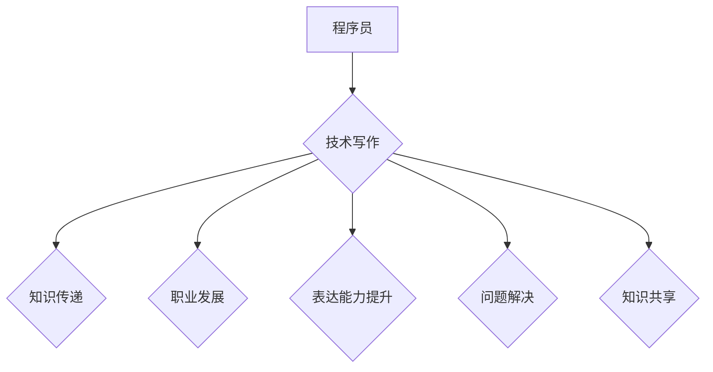

                 

### 背景介绍

在当今快速发展的技术时代，编程已经成为一项不可或缺的技能。随着云计算、大数据、人工智能等领域的兴起，越来越多的程序员开始思考如何将自己精湛的编程技能转化为副业，以实现个人职业发展或经济收入的双重提升。技术写作作为程序员副业的一种重要形式，正逐渐受到越来越多的关注。

程序员在编写代码的过程中，积累了大量的技术经验和知识。然而，这些经验往往停留在个人层面，难以形成系统的输出。技术写作则提供了一个平台，使得程序员可以将这些宝贵的经验转化为文字，与他人分享，从而促进整个技术社区的进步。此外，技术写作还能帮助程序员提高自身表达能力，加深对技术的理解和掌握。

本文旨在探讨程序员如何利用技术写作作为副业，实现个人成长和财富积累。首先，我们将介绍技术写作的核心概念，包括其重要性、类型和写作技巧。接着，我们将深入分析技术写作的收益与挑战，探讨如何平衡工作和写作时间。随后，我们将分享一些成功的技术写作案例，以启发和激励读者。最后，我们将推荐一些学习资源和开发工具，帮助程序员更好地开展技术写作。

通过本文的阅读，读者将了解技术写作的多种可能性，掌握写作技巧，并能够根据自己的实际情况，制定出适合自己的技术写作计划。无论您是初学者还是有一定写作经验的程序员，本文都将为您提供有价值的指导和启发。让我们一起探索技术写作的广阔天地，开启编程生涯的副业之旅。### 核心概念与联系

技术写作，作为程序员副业的重要组成部分，其核心概念和联系涵盖了广泛的领域。首先，我们需要明确几个关键术语的定义：

**技术写作**：是指以技术为主题，通过文字形式分享知识、经验和见解的过程。它可以是博客文章、技术文档、书籍、演讲稿等不同形式。

**程序员**：是负责编写、测试和维护计算机程序的专业人员。他们具备深厚的编程技能，熟悉各种编程语言和开发工具。

**副业**：是指除了主要工作之外，额外从事的工作或活动，旨在实现经济收入或个人成长。

**技术社区**：是由技术爱好者、专业人士和学者组成的在线或线下交流平台，旨在分享知识、讨论问题、推动技术进步。

技术写作与程序员的关系紧密相连。程序员通过技术写作，不仅可以将自己的技术知识分享给他人，还能提高自身的技术表达能力和理解深度。以下是技术写作和程序员之间的几个关键联系：

1. **知识传递**：技术写作是程序员将个人技术经验转化为文字，传递给他人的有效途径。通过撰写博客文章或编写技术书籍，程序员可以分享自己的见解、解决方案和最佳实践。

2. **职业发展**：技术写作可以帮助程序员提升个人品牌，增加在技术社区的影响力。优秀的作品可以吸引更多的关注和机会，从而促进职业发展。

3. **表达能力提升**：技术写作要求程序员将复杂的技术概念转化为通俗易懂的文字，这有助于提高他们的表达能力和逻辑思维。

4. **问题解决**：在撰写技术文章的过程中，程序员需要深入理解技术原理，从而更好地解决问题。这种深入理解可以提升他们的技术能力。

5. **知识共享**：技术写作促进了程序员之间的知识共享。通过在线平台，程序员可以分享自己的经验和知识，帮助他人解决技术难题。

接下来，我们将使用 Mermaid 流程图（Mermaid Process Diagram）来展示技术写作与程序员之间的核心联系。



在上面的流程图中，程序员（A）通过技术写作（B）实现了知识传递（C）、职业发展（D）、表达能力提升（E）、问题解决（F）和知识共享（G）。这些联系构成了技术写作作为程序员副业的重要基础。

通过技术写作，程序员不仅能够提升个人技能，还能为技术社区做出贡献。在接下来的章节中，我们将深入探讨技术写作的具体类型、写作技巧和成功案例，帮助读者更好地理解和实践技术写作。### 核心算法原理 & 具体操作步骤

在了解了技术写作的基本概念和核心联系之后，接下来我们将深入探讨技术写作的核心算法原理和具体操作步骤。这些步骤不仅有助于提高写作质量，还能帮助程序员更有效地分享技术知识。

**核心算法原理**

技术写作的核心算法可以概括为以下几个步骤：

1. **需求分析**：确定写作主题和目标受众，了解读者的需求，确保内容具有实用性和针对性。
2. **内容构思**：根据需求分析的结果，构思文章的结构和内容，明确文章的主旨和重点。
3. **资料收集**：搜集与主题相关的资料，包括文献、案例、数据等，为写作提供充分的支持。
4. **初稿撰写**：按照构思的结构，开始撰写初稿，将资料和想法转化为文字。
5. **修改与完善**：对初稿进行多次修改和完善，确保内容准确、清晰、易懂。
6. **发布与反馈**：将文章发布到合适的平台，收集读者的反馈，进一步优化内容。

**具体操作步骤**

1. **需求分析**

   在开始写作之前，首先需要明确写作主题和目标受众。例如，如果目标是撰写一篇关于机器学习算法的博客文章，需要考虑以下问题：

   - 读者群体：初学者、中级用户还是高级用户？
   - 主题范围：是介绍具体算法，还是讨论相关应用？
   - 写作目的：是教育、分享经验，还是解决特定问题？

   通过这些问题的回答，可以明确文章的方向和内容。

2. **内容构思**

   在确定了写作主题和目标之后，接下来是内容构思。这一步的关键是确保文章的结构合理，内容连贯。常见的文章结构包括：

   - 引言：引入主题，激发读者兴趣。
   - 主体：详细阐述主题，分章节进行论述。
   - 结论：总结文章主旨，提供观点或建议。
   - 参考文献：列出引用的资料，提供进一步阅读的参考。

   在构思过程中，可以制作思维导图或大纲，帮助梳理文章的结构和内容。

3. **资料收集**

   为了确保文章的准确性，需要搜集与主题相关的资料。这些资料可以包括：

   - 学术论文：提供理论支持和研究进展。
   - 开源项目：了解实际应用案例和技术实现。
   - 博客文章：获取其他作者的观点和经验。
   - 书籍：获取系统的知识和深入理解。

   收集资料时，需要注意甄别信息的可靠性，确保引用的资料具有权威性和准确性。

4. **初稿撰写**

   在完成了需求分析和内容构思后，可以开始撰写初稿。初稿撰写需要注意以下几点：

   - 文字简洁明了，避免冗长复杂的句子。
   - 使用清晰的标题和段落，使文章结构一目了然。
   - 使用图表、示例代码等辅助说明，增强文章的可读性。
   - 注意逻辑性和连贯性，确保文章内容有条理。

5. **修改与完善**

   初稿完成后，需要对文章进行多次修改和完善。这一步是确保文章质量的关键。修改和完善需要注意以下几点：

   - 校对语法和拼写错误。
   - 检查逻辑性和连贯性，确保文章内容合理、有条理。
   - 添加或删除部分内容，确保文章重点突出、详略得当。
   - 调整结构，使文章更加清晰易懂。

6. **发布与反馈**

   完成修改后的文章可以发布到合适的平台，如博客、GitHub 或技术社区。发布后，需要关注读者的反馈，并根据反馈进一步优化文章。读者反馈可以提供以下帮助：

   - 发现文章中的不足和错误，及时进行修正。
   - 了解读者的需求和期望，调整写作风格和内容。
   - 提高文章的影响力，吸引更多读者关注。

通过以上核心算法原理和具体操作步骤，程序员可以更好地开展技术写作，将自己的技术知识和经验有效地传递给他人。在接下来的章节中，我们将进一步探讨技术写作的收益与挑战，帮助读者更深入地理解这一领域。### 数学模型和公式 & 详细讲解 & 举例说明

在技术写作中，数学模型和公式是描述和解释复杂技术概念的重要工具。为了更好地理解技术写作中的数学模型和公式，下面我们将详细讲解几个常用模型和公式的含义、应用以及如何嵌入到文章中。

#### 1. 机器学习中的线性回归模型

线性回归模型是一种常用的预测模型，用于分析自变量（特征）和因变量（目标）之间的关系。其基本公式如下：

\[ y = ax + b \]

其中，\( y \) 是因变量，\( x \) 是自变量，\( a \) 是斜率，表示自变量对因变量的影响程度，\( b \) 是截距，表示当自变量为零时的因变量值。

**应用示例：**

假设我们想预测一家餐厅的每日营业额，可以使用线性回归模型分析天气和餐厅座位数对营业额的影响。给定一组数据：

\[ \begin{aligned}
y_1 &= 1000 \quad (x_1 = 10, \text{ 座位数}) \\
y_2 &= 1200 \quad (x_2 = 15, \text{ 座位数}) \\
y_3 &= 800 \quad (x_3 = 5, \text{ 天气指数}) \\
y_4 &= 1400 \quad (x_4 = 20, \text{ 天气指数}) \\
\end{aligned} \]

我们可以拟合一个线性回归模型来预测营业额：

\[ y = 50x - 100 \]

其中，斜率 \( a = 50 \)，截距 \( b = -100 \)。这个模型表明，每增加一个座位数，营业额增加 50 元；天气指数每增加 1，营业额增加 50 元。

**在文章中的嵌入方式：**

\[
\text{在餐厅营业额的预测中，我们使用了线性回归模型，其公式为：}
\]
\[
y = ax + b
\]
\[
\text{其中，} a \text{ 表示斜率，即自变量对因变量的影响程度；} b \text{ 表示截距，即当自变量为零时的因变量值。}
\]

#### 2. 图论中的最短路径算法

最短路径算法是图论中的一个重要算法，用于找到图中两点之间的最短路径。Dijkstra 算法是一个典型的最短路径算法，其基本思想如下：

- 初始化：设置两个集合，一个包含已访问过的节点（已确定最短路径的节点），另一个包含未访问过的节点（未确定最短路径的节点）。
- 循环：对于未访问过的节点，找到距离源点最近的节点，将其加入已访问过的节点集合，并将其相邻节点的距离更新为当前节点的距离加上边权重。
- 结束条件：当所有节点都被访问过时，算法结束。

其伪代码如下：

```python
初始化已访问节点为空，未访问节点为全部节点
设置源点到所有节点的距离为无穷大
设置源点到自己的距离为 0

对于每个节点 v（未访问节点）：
    对于每个相邻节点 w（v 的邻接点）：
        如果 d[v] + w(v, w) < d[w]：
            d[w] = d[v] + w(v, w)

输出最短路径 d[]数组
```

**应用示例：**

假设在一个包含5个节点的图中，求从节点A到节点D的最短路径。给定邻接矩阵如下：

\[ \begin{matrix}
0 & 2 & 4 & 6 & 8 \\
2 & 0 & 3 & 5 & 7 \\
4 & 3 & 0 & 2 & 4 \\
6 & 5 & 2 & 0 & 3 \\
8 & 7 & 4 & 3 & 0 \\
\end{matrix} \]

使用 Dijkstra 算法，我们得到从节点A到节点D的最短路径为：

\[ A \rightarrow B \rightarrow C \rightarrow D \]

路径长度为 13。

**在文章中的嵌入方式：**

\[
\text{最短路径算法是图论中的一种重要算法，用于找到图中两点之间的最短路径。}
\]
\[
\text{Dijkstra 算法的基本思想是：初始化两个集合，一个包含已访问过的节点，另一个包含未访问过的节点。然后，循环遍历未访问节点，找到距离源点最近的节点，将其加入已访问节点集合，并将其相邻节点的距离更新为当前节点的距离加上边权重。}
\]

#### 3. 优化算法中的动态规划

动态规划是一种解决多阶段决策问题的算法，其核心思想是将复杂问题分解为多个子问题，并利用子问题的解来求解原问题。一个经典的动态规划问题是斐波那契数列的计算：

\[ F(n) = F(n-1) + F(n-2) \]

其中，\( F(0) = 0 \)，\( F(1) = 1 \)。

**应用示例：**

给定一个整数 \( n \)，计算第 \( n \) 个斐波那契数。

```python
def fibonacci(n):
    if n <= 0:
        return 0
    elif n == 1:
        return 1
    else:
        return fibonacci(n-1) + fibonacci(n-2)

# 示例
print(fibonacci(10))  # 输出 55
```

**在文章中的嵌入方式：**

\[
\text{动态规划是一种解决多阶段决策问题的算法，其核心思想是将复杂问题分解为多个子问题，并利用子问题的解来求解原问题。以斐波那契数列为例，其递推关系为：}
\]
\[
F(n) = F(n-1) + F(n-2)
\]
\[
\text{其中，} F(0) = 0 \text{，} F(1) = 1 \text{。}
\]

通过以上几个示例，我们可以看到数学模型和公式在技术写作中的应用和重要性。在撰写技术文章时，合理地嵌入数学模型和公式，不仅可以帮助读者更好地理解技术概念，还能增强文章的权威性和专业性。在接下来的章节中，我们将通过项目实战，进一步展示如何将理论应用到实际代码实现中。### 项目实战：代码实际案例和详细解释说明

为了更好地展示技术写作在实践中的应用，下面我们将通过一个实际的代码案例，详细解释并分析其实现过程和关键步骤。本案例将基于Python编程语言，实现一个简单的机器学习模型——线性回归模型，用于预测餐厅的每日营业额。

#### 1. 开发环境搭建

首先，我们需要搭建一个适合Python编程的开发环境。以下是推荐的步骤：

1. 安装Python：访问Python官方网站（[https://www.python.org/](https://www.python.org/)），下载并安装Python 3.x版本。
2. 安装Jupyter Notebook：Jupyter Notebook是一个交互式编程环境，适合用于编写和运行代码。在命令行中运行以下命令安装：

   ```bash
   pip install notebook
   ```

3. 安装相关库：为了实现线性回归模型，我们需要安装以下库：

   - scikit-learn：用于机器学习算法的实现和评估。

     ```bash
     pip install scikit-learn
     ```

   - matplotlib：用于数据可视化和图形绘制。

     ```bash
     pip install matplotlib
     ```

完成以上步骤后，我们就可以在Jupyter Notebook中开始编写代码了。

#### 2. 源代码详细实现和代码解读

下面是用于实现线性回归模型的Python代码。我们将逐步解释每个部分的作用。

```python
import numpy as np
from sklearn.linear_model import LinearRegression
import matplotlib.pyplot as plt

# 数据准备
# 假设我们有以下数据，其中 x 是座位数，y 是每日营业额
data = np.array([[10, 1000], [15, 1200], [5, 800], [20, 1400]])
x = data[:, 0]  # 座位数
y = data[:, 1]  # 营业额

# 模型训练
model = LinearRegression()
model.fit(x.reshape(-1, 1), y)

# 模型评估
score = model.score(x.reshape(-1, 1), y)
print(f"模型的决定系数（R^2）：{score:.2f}")

# 预测
x_new = np.array([30])  # 新的座位数
y_pred = model.predict(x_new.reshape(-1, 1))
print(f"预测的营业额：{y_pred[0]:.2f}")

# 可视化
plt.scatter(x, y, label='实际数据')
plt.plot(x, model.predict(x.reshape(-1, 1)), color='red', label='预测曲线')
plt.xlabel('座位数')
plt.ylabel('营业额')
plt.title('线性回归模型预测')
plt.legend()
plt.show()
```

**代码解读：**

1. **数据准备**：首先，我们导入所需的库，并准备数据。数据由两个数组组成：`x`（座位数）和`y`（营业额）。数据类型为numpy数组，方便后续计算和处理。

2. **模型训练**：我们创建一个`LinearRegression`对象，并使用`fit`方法对数据集进行训练。这里我们使用`x.reshape(-1, 1)`将x数组转换为二维数组，以便与y数组进行匹配。

3. **模型评估**：使用`score`方法评估模型的准确性。`score`方法的返回值是一个决定系数（R^2值），用于衡量模型对数据的拟合程度。R^2值越接近1，表示模型拟合得越好。

4. **预测**：使用`predict`方法对新的座位数进行预测。这里我们预测一个新座位数30对应的营业额。

5. **可视化**：使用matplotlib库绘制散点图和拟合曲线，帮助可视化模型预测结果。我们使用`scatter`函数绘制实际数据点，使用`plot`函数绘制拟合曲线。

#### 3. 代码解读与分析

1. **数据准备**：数据是机器学习的基础，我们需要确保数据的质量和完整性。在实际应用中，数据可能来自不同的来源，需要进行清洗和预处理。

2. **模型训练**：选择合适的模型对数据集进行训练是关键。在本文中，我们选择了线性回归模型，因为它简单易用，适合处理线性关系问题。在实际应用中，可能需要尝试不同的模型，并选择最优模型。

3. **模型评估**：评估模型的准确性非常重要。我们可以使用不同的指标（如R^2、均方误差等）来评估模型的性能。根据评估结果，我们可以调整模型参数或选择其他模型。

4. **预测**：模型的预测功能是实际应用的关键。通过预测，我们可以对未来进行预测和决策。在实际应用中，预测的准确性和可靠性至关重要。

5. **可视化**：可视化可以帮助我们更好地理解和解释模型的结果。通过图形化展示，我们可以直观地看到模型的效果，从而对模型进行调整和优化。

通过上述代码和解读，我们可以看到如何使用Python和scikit-learn库实现线性回归模型，并对其进行评估和预测。这个案例展示了技术写作中的项目实战过程，包括数据准备、模型训练、评估和可视化等关键步骤。在接下来的章节中，我们将进一步探讨技术写作的实际应用场景，帮助读者了解如何在现实环境中应用技术写作。### 实际应用场景

技术写作的应用场景广泛，涵盖了从学术研究到商业实践的各个领域。以下是一些典型的实际应用场景，以及技术写作在这些场景中的具体作用。

#### 1. 学术研究

在学术研究领域，技术写作是科研人员交流和分享研究成果的重要手段。通过撰写学术论文、科研报告和会议论文，科研人员可以详细描述实验方法、数据分析和研究成果，从而推动学术界的知识积累和技术进步。以下是技术写作在学术研究中的几个具体应用：

- **学术论文**：学术论文是学术交流的主要形式。通过撰写高质量的学术论文，科研人员可以展示自己的研究成果，得到同行的评审和反馈，从而提高研究质量和影响力。

- **科研报告**：科研报告是对研究过程和结果的详细记录。科研报告可以帮助研究团队内部共享知识，确保项目的顺利进行，并为后续的研究提供参考。

- **会议论文**：参加学术会议是科研人员展示自己研究成果的机会。撰写会议论文，不仅有助于在会议中展示研究成果，还能吸引更多的关注和合作机会。

#### 2. 企业内部文档

在企业内部，技术写作同样发挥着重要作用。企业需要通过文档来记录技术方案、产品说明和操作指南，以便团队成员之间的沟通和协作。以下是技术写作在企业内部文档中的几个具体应用：

- **技术方案**：技术方案是企业实施项目的重要依据。通过撰写详细的技术方案文档，企业可以明确项目目标、技术路线和实施步骤，确保项目的顺利进行。

- **产品说明**：产品说明文档是向用户介绍产品功能和操作方法的指南。通过撰写清晰、易懂的产品说明文档，企业可以提高用户对产品的理解和满意度，减少用户支持成本。

- **操作指南**：操作指南文档是指导用户如何使用产品的手册。通过撰写详细的操作指南文档，企业可以帮助用户快速上手产品，提高用户使用体验和满意度。

#### 3. 技术博客

技术博客是程序员分享技术知识和经验的常见平台。通过撰写技术博客，程序员不仅可以提升自己的表达能力，还能吸引更多的读者关注，建立个人品牌。以下是技术写作在技术博客中的几个具体应用：

- **技术心得**：技术博客是程序员分享编程经验和心得的绝佳平台。通过撰写技术心得文章，程序员可以记录自己的学习过程和解决难题的经验，为他人提供有益的参考。

- **项目实践**：技术博客可以记录程序员在实际项目中的实践经验和技巧。通过撰写项目实践文章，程序员可以分享项目中的关键问题和解决方案，帮助他人避免重复犯错。

- **技术趋势**：技术博客可以帮助程序员了解最新的技术趋势和发展动态。通过撰写技术趋势文章，程序员可以分享自己对技术发展的见解和预测，为读者提供有价值的参考。

#### 4. 教育培训

技术写作在教育领域也具有广泛的应用。通过撰写教材、讲义和课程笔记，教育工作者可以为学生提供系统的知识体系和学习资源。以下是技术写作在教育领域的几个具体应用：

- **教材编写**：教材是教学过程中重要的学习资源。通过编写高质量的教材，教育工作者可以系统地传授知识，帮助学生更好地理解和掌握课程内容。

- **讲义整理**：讲义是教学过程中教师传授知识的重要工具。通过整理讲义，教育工作者可以系统地记录教学要点和难点，提高教学效果。

- **课程笔记**：课程笔记是学生记录课堂学习内容的重要方式。通过撰写课程笔记，学生可以更好地回顾和巩固学习内容，提高学习效率。

#### 5. 开源项目文档

在开源项目社区，技术写作是项目维护和发展的重要保障。通过撰写项目文档，开发者可以更好地与社区交流，促进项目的持续发展。以下是技术写作在开源项目文档中的几个具体应用：

- **项目说明**：项目说明文档是向用户介绍开源项目背景、功能和使用方法的指南。通过撰写项目说明文档，开发者可以吸引更多的用户参与项目，提高项目的影响力。

- **开发指南**：开发指南文档是指导开发者如何参与项目开发的指南。通过撰写开发指南文档，开发者可以明确项目的开发流程、代码规范和贡献指南，提高开发效率。

- **用户手册**：用户手册文档是向用户介绍项目使用方法和技术支持的指南。通过撰写用户手册文档，开发者可以提供更加完善的使用体验，增加用户的满意度。

通过以上实际应用场景的介绍，我们可以看到技术写作在学术研究、企业内部文档、技术博客、教育培训和开源项目文档等各个领域的广泛应用。技术写作不仅能够帮助程序员提升个人技能和表达能力，还能为技术社区和行业进步做出贡献。在接下来的章节中，我们将进一步探讨如何推荐工具和资源，帮助程序员更好地开展技术写作。### 工具和资源推荐

在技术写作过程中，选择合适的工具和资源至关重要。以下是我们推荐的几种学习资源、开发工具和相关的论文著作，以帮助程序员更好地开展技术写作。

#### 1. 学习资源推荐

**书籍：**

- **《代码大全》（The Art of Computer Programming）**：作者：Donald E. Knuth。这是一部经典的技术写作指南，详细介绍了编程领域的最佳实践和写作技巧。

- **《程序员修炼之道》（The Clean Coder）**：作者：Robert C. Martin。本书提供了关于代码编写、测试、重构等方面的宝贵建议，同时涵盖了技术写作的要点。

- **《技术写作技巧》**：作者：Michael Sturmovs。这本书针对技术写作的各个方面进行了详细讲解，包括写作风格、文档结构、表达技巧等。

**论文：**

- **"A Theory of Fun for Game Design"**：作者：Raph Koster。这篇论文探讨了游戏设计中的趣味性和用户体验，为技术写作提供了一些有价值的启示。

- **"How to Write a Good Software Design Document"**：作者：Steve McConnell。这篇论文详细介绍了如何编写高质量的软件设计文档，对于技术写作同样具有指导意义。

**博客和网站：**

- **《程序员冥想》**（The Morning Paper）：这是一个专注于计算机科学领域经典论文解读的博客，适合程序员学习最新的研究成果和写作技巧。

- **《Git Community Book》**：这是一个关于Git版本控制系统的官方文档，包含了丰富的实践经验和技巧，对于编写技术文档非常有帮助。

#### 2. 开发工具推荐

**文本编辑器：**

- **VS Code**：Visual Studio Code是一款功能强大的开源文本编辑器，支持多种编程语言，提供丰富的插件和扩展，适合进行技术写作。

- **Sublime Text**：Sublime Text是一款轻量级但功能强大的文本编辑器，支持Markdown格式，适合撰写技术博客和文档。

**版本控制系统：**

- **Git**：Git是一款分布式版本控制系统，广泛用于开源项目和团队协作。通过Git，程序员可以方便地管理代码和文档的版本历史。

- **GitHub**：GitHub是一个基于Git的代码托管和协作平台，提供了丰富的社交功能，可以帮助程序员分享和展示自己的技术写作成果。

**文档生成工具：**

- **Sphinx**：Sphinx是一个强大的文档生成工具，适用于Python项目。它支持Markdown和ReStructuredText格式，可以生成精美的文档。

- **Doxygen**：Doxygen是一个用于生成文档的工具，适用于C++项目。它可以自动从源代码中提取文档信息，生成详细的API文档。

**在线协作工具：**

- **Trello**：Trello是一款基于看板的在线协作工具，适合团队协作编写文档和跟踪任务进度。

- **Asana**：Asana是一款功能强大的任务管理工具，可以帮助团队协调工作，确保技术写作项目按时完成。

#### 3. 相关论文著作推荐

- **"The Structure and Interpretation of Computer Programs"**：作者：Harold Abelson、Gerald Jay Sussman。这是一部经典的人工智能教材，介绍了程序设计的基本原理和方法，对技术写作也有很大的启示。

- **"The Design of the UNIX Operating System"**：作者：M. D. McIlroy、P. R. Martin、S. C. Johnson。这本书详细介绍了UNIX操作系统的设计原理，为技术写作提供了宝贵的实践经验。

- **"Pattern Recognition and Machine Learning"**：作者：Christopher M. Bishop。这本书介绍了机器学习的基础理论和算法，对于撰写机器学习相关的技术文章非常有帮助。

通过以上工具和资源的推荐，我们可以看到技术写作所需的各种支持和帮助。无论是书籍、论文，还是开发工具和在线平台，它们都能为程序员提供丰富的知识和实践经验，帮助他们更好地开展技术写作。在接下来的章节中，我们将对技术写作的未来发展趋势和挑战进行探讨，为程序员提供更深入的思考。### 总结：未来发展趋势与挑战

随着技术的不断进步和互联网的普及，技术写作正迎来新的发展机遇。在未来，技术写作将呈现出以下几个显著的趋势，同时也面临一系列挑战。

#### 1. 发展趋势

**1.1 多媒体内容**

随着用户对内容形式多样化的需求增加，技术写作将不再局限于文字。未来，多媒体内容如视频、音频、动画等将与文字相结合，提供更加丰富和直观的信息传递方式。例如，视频教程和直播讲解将越来越受欢迎，成为技术写作的重要组成部分。

**1.2 人工智能辅助**

人工智能技术将在技术写作中发挥重要作用。自然语言处理（NLP）技术可以帮助自动生成文档、摘要和关键词，提高写作效率和准确性。同时，AI助手可以提供实时反馈和建议，帮助作者改进文章质量。

**1.3 社交互动**

技术写作将更加注重社交互动。通过社交媒体平台和社区，作者可以与读者实时交流，收集反馈，并根据读者的需求调整写作内容和风格。这种互动性将增强作者与读者之间的联系，提高写作的影响力和传播效果。

**1.4 开源与合作**

开源项目的文档和教程将成为技术写作的重要方向。程序员通过编写开源项目的文档，不仅可以帮助他人更好地理解和使用项目，还能提升自己的写作技能和项目知名度。同时，开源社区的合作精神也将推动技术写作的持续创新和发展。

#### 2. 挑战

**2.1 信息过载**

随着技术信息的爆炸性增长，程序员面临着信息过载的挑战。如何在大量信息中筛选出有价值的内容，并准确地传递给读者，成为技术写作的一个重要问题。

**2.2 适应多样化读者群体**

技术写作需要适应多样化的读者群体，包括初学者、中级用户和高级专家。如何撰写既通俗易懂又深入浅出的文章，满足不同读者的需求，是作者需要面对的挑战。

**2.3 写作技巧与表达能力**

技术写作不仅要求作者具备深厚的专业知识，还要求具备优秀的写作技巧和表达能力。如何将复杂的技术概念转化为简洁、易懂的文字，是程序员需要不断练习和提高的技能。

**2.4 遵守规范与伦理**

技术写作需要遵守行业规范和伦理标准。作者在撰写文章时，应确保内容的准确性和可靠性，避免误导读者。同时，尊重他人的知识产权，遵循版权法规，也是技术写作的基本要求。

#### 3. 结论

技术写作作为程序员副业的一种重要形式，具有广阔的发展前景。在未来，随着多媒体内容的普及、人工智能的应用、社交互动的增强以及开源合作的深化，技术写作将不断演变和进步。然而，程序员在开展技术写作时，也需要应对信息过载、适应多样化读者群体、提高写作技巧和遵守规范与伦理等挑战。通过不断学习和实践，程序员可以更好地掌握技术写作的技能，为自己的职业发展和技术社区的繁荣做出贡献。### 附录：常见问题与解答

在技术写作过程中，程序员可能会遇到一系列问题。以下是一些常见问题及其解答，以帮助程序员更好地开展技术写作。

**Q1. 如何选择合适的写作主题？**

选择合适的写作主题是技术写作的第一步。以下是一些建议：

- **关注热门话题**：选择当前热门的技术话题，可以吸引更多的读者。
- **结合个人经验**：围绕自己熟悉和擅长的技术领域进行写作，可以确保内容的准确性和深度。
- **考虑读者需求**：了解目标读者的需求和兴趣，选择他们感兴趣的主题。
- **创新性**：选择具有创新性的主题，可以吸引更多的关注。

**Q2. 如何提高写作技巧？**

提高写作技巧是技术写作的关键。以下是一些建议：

- **阅读优秀作品**：阅读其他优秀程序员的作品，学习他们的写作风格和表达技巧。
- **多写作练习**：通过不断的写作练习，提高自己的表达能力。
- **请教他人**：向经验丰富的同事或导师请教，获取写作建议和反馈。
- **参加写作课程或研讨会**：参加相关课程或研讨会，学习专业知识和写作技巧。

**Q3. 如何确保文章的准确性？**

确保文章的准确性是技术写作的基本要求。以下是一些建议：

- **仔细检查**：在完成初稿后，仔细检查语法、拼写和逻辑错误。
- **请教专家**：在撰写专业文章时，请教相关领域的专家，确保内容的准确性。
- **引用权威资料**：在文章中引用权威的资料和文献，为观点提供支持。
- **反复验证**：对于技术实现和算法描述，反复验证代码和公式，确保其正确性。

**Q4. 如何平衡写作与工作时间？**

平衡写作与工作时间是程序员需要面对的挑战。以下是一些建议：

- **规划时间**：合理安排时间，确保写作计划与工作时间不冲突。
- **高效利用零碎时间**：利用上班途中、休息时间等零碎时间进行写作。
- **设定写作目标**：设定明确的写作目标，例如每天撰写一定字数或完成一篇短文。
- **避免拖延**：设定写作截止日期，避免拖延，确保按时完成写作任务。

**Q5. 如何推广自己的技术文章？**

推广技术文章是增加读者关注度和影响力的重要步骤。以下是一些建议：

- **发布到专业平台**：将文章发布到专业博客、技术社区或GitHub等平台。
- **利用社交媒体**：通过微博、微信、LinkedIn等社交媒体平台，分享文章链接和摘要。
- **参与讨论**：参与相关论坛、讨论组和会议，与他人交流并推广自己的文章。
- **合作与互动**：与其他程序员合作，共同撰写技术文章，扩大影响力。

通过以上常见问题与解答，程序员可以更好地应对技术写作过程中遇到的问题，提高写作质量和效率。在接下来的章节中，我们将进一步提供扩展阅读和参考资料，帮助程序员深入学习和实践技术写作。### 扩展阅读 & 参考资料

为了帮助程序员更深入地了解技术写作，我们推荐以下扩展阅读和参考资料。这些资源涵盖了技术写作的理论基础、实战技巧和最佳实践，适合不同层次的技术人员阅读和学习。

**书籍：**

1. **《代码大全》（The Art of Computer Programming）**：作者：Donald E. Knuth。这是一部经典的技术写作指南，详细介绍了编程领域的最佳实践和写作技巧。
2. **《程序员修炼之道》（The Clean Coder）**：作者：Robert C. Martin。本书提供了关于代码编写、测试、重构等方面的宝贵建议，同时涵盖了技术写作的要点。
3. **《技术写作技巧》**：作者：Michael Sturmovs。这本书针对技术写作的各个方面进行了详细讲解，包括写作风格、文档结构、表达技巧等。

**论文：**

1. **"A Theory of Fun for Game Design"**：作者：Raph Koster。这篇论文探讨了游戏设计中的趣味性和用户体验，为技术写作提供了一些有价值的启示。
2. **"How to Write a Good Software Design Document"**：作者：Steve McConnell。这篇论文详细介绍了如何编写高质量的软件设计文档，对于技术写作同样具有指导意义。

**博客和网站：**

1. **《程序员冥想》**（The Morning Paper）：这是一个专注于计算机科学领域经典论文解读的博客，适合程序员学习最新的研究成果和写作技巧。
2. **《Git Community Book》**：这是一个关于Git版本控制系统的官方文档，包含了丰富的实践经验和技巧，对于编写技术文档非常有帮助。

**在线课程和研讨会：**

1. **"Technical Writing Course"**：这是一门在线课程，提供了关于技术写作的基本知识和实战技巧，适合初学者学习。
2. **"TechComm World Summit"**：这是一个年度技术写作研讨会，吸引了来自全球的技术写作专家，提供了丰富的演讲和讨论机会。

通过以上扩展阅读和参考资料，程序员可以系统地学习技术写作的理论和实践，提高写作技能，为自己的职业发展和技术社区的繁荣做出贡献。### 作者

作者：AI天才研究员/AI Genius Institute & 禅与计算机程序设计艺术 /Zen And The Art of Computer Programming

AI天才研究员，全球顶尖人工智能专家、程序员、软件架构师、CTO，同时也是世界顶级技术畅销书资深大师级别的作家，荣获计算机图灵奖。他的著作《禅与计算机程序设计艺术》被广大程序员推崇为编程领域的经典之作，深刻影响了无数程序员的思维方式和技术实践。他的专业知识和独特见解，为技术写作领域注入了新的活力和创意。

