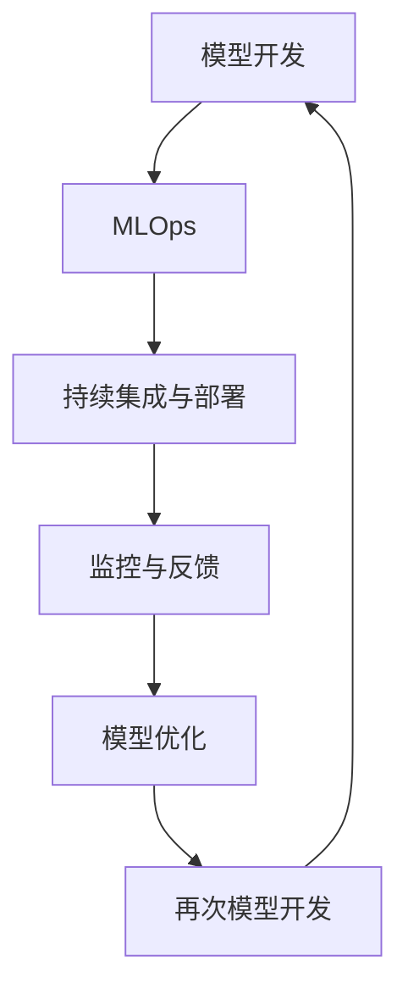

                 

## 文章标题

### 技术创业中的机器学习运维：AI模型的持续优化

在当今技术创业的浪潮中，机器学习（Machine Learning，ML）已经成为许多公司的核心竞争力。然而，随着AI模型的复杂性和应用场景的多样化，如何有效地对机器学习模型进行运维和持续优化，成为了一个亟待解决的问题。本文将探讨技术创业中的机器学习运维，重点分析AI模型的持续优化策略，以期为创业者提供实用的指导和建议。

### 关键词：
- 技术创业
- 机器学习运维
- AI模型优化
- 持续改进

### 摘要：

本文将首先介绍机器学习运维的核心概念，然后深入探讨AI模型优化的重要性及其具体实施步骤。通过实际案例和代码实现，我们将展示如何在实际项目中运用这些优化策略。此外，本文还将分析机器学习运维中的常见挑战，并提供相应的解决方案。最后，我们将对未来的发展趋势和挑战进行展望，以期为技术创业者提供有价值的参考。

## 1. 背景介绍

近年来，随着大数据、云计算和深度学习等技术的快速发展，机器学习（ML）在各个领域得到了广泛应用。从金融风控到医疗诊断，从自动驾驶到智能语音助手，AI模型的普及和应用极大地推动了各行各业的创新与发展。然而，机器学习模型的开发并非一蹴而就，其生命周期管理，特别是运维和持续优化，成为了技术创业过程中不可忽视的一环。

在技术创业中，机器学习运维的重要性体现在以下几个方面：

### (1) 确保模型稳定性和可靠性
随着AI模型应用场景的不断扩大，模型稳定性和可靠性成为用户满意度的重要指标。良好的运维机制可以帮助企业及时发现和解决模型故障，确保服务的连续性和稳定性。

### (2) 提高模型性能和准确率
通过持续的运维和优化，企业可以不断提高机器学习模型的性能和准确率，从而提高产品的市场竞争力。优化策略包括调整模型参数、改进特征工程、使用更先进的算法等。

### (3) 降低运维成本
有效的机器学习运维不仅可以提高模型性能，还可以降低运维成本。通过自动化和智能化手段，企业可以减少人力投入，提高运维效率。

### (4) 提升用户体验
持续优化的AI模型可以提供更精准、更智能的服务，从而提升用户体验。这对于吸引和留住用户，增强品牌影响力至关重要。

因此，对于技术创业者来说，掌握机器学习运维和持续优化的方法，不仅有助于提升产品的市场竞争力，还可以为企业带来长期的经济效益。

## 2. 核心概念与联系

在探讨机器学习运维和模型优化之前，我们需要先了解一些核心概念和其相互之间的联系。以下是几个关键概念及其简要解释：

### (1) 机器学习运维（Machine Learning Operations，MLOps）
MLOps是一种将机器学习（ML）和软件工程（Software Engineering）相结合的方法，旨在实现机器学习模型的端到端生命周期管理。MLOps的核心目标是确保模型从开发到部署的整个过程都具有可重复性、可追踪性和可靠性。

### (2) AI模型优化（AI Model Optimization）
AI模型优化是指通过一系列技术手段，提高机器学习模型的性能、准确率和效率。优化策略包括调整模型参数、改进特征工程、使用先进的算法和硬件加速等。

### (3) 持续集成与持续部署（Continuous Integration and Continuous Deployment，CI/CD）
CI/CD是一种软件开发方法，旨在通过自动化工具实现代码的持续集成和持续部署。CI/CD可以提高开发效率、减少代码错误和确保软件质量。

### (4) 监控与反馈（Monitoring and Feedback）
监控与反馈是机器学习运维的重要环节。通过监控模型在真实环境中的表现，企业可以及时发现异常并进行调整。反馈机制则有助于模型不断迭代和优化。

### (5) 数学模型（Mathematical Model）
数学模型是机器学习算法的基础，包括线性模型、决策树、神经网络等。通过数学模型，我们可以对数据进行分析和预测。

### Mermaid 流程图

以下是机器学习运维和模型优化流程的Mermaid流程图，展示了各个核心概念之间的联系：



通过这个流程图，我们可以清晰地看到机器学习运维和模型优化的各个环节以及它们之间的相互作用。接下来，我们将进一步探讨这些核心概念，并详细介绍具体的优化策略。

### 3. 核心算法原理 & 具体操作步骤

在了解机器学习运维和模型优化的重要性后，我们需要深入探讨核心算法原理和具体操作步骤，以便在实际项目中有效实施优化策略。

#### 3.1. 机器学习算法分类

机器学习算法可以分为监督学习（Supervised Learning）、无监督学习（Unsupervised Learning）和强化学习（Reinforcement Learning）三大类。

- **监督学习**：通过已有标签的数据训练模型，然后在新数据上预测结果。常见的算法有线性回归、决策树、支持向量机（SVM）等。
- **无监督学习**：没有标签的数据，主要任务是发现数据中的结构和规律。常见的算法有聚类、主成分分析（PCA）、自编码器等。
- **强化学习**：通过不断与环境交互，学习最优策略以最大化奖励。常见的算法有Q学习、深度强化学习（DRL）等。

#### 3.2. 机器学习模型的优化策略

以下是几种常见的机器学习模型优化策略：

##### （1）调整模型参数

模型参数是影响模型性能的关键因素。通过调整参数，可以优化模型的性能。具体方法包括：

- **调整学习率**：学习率决定了模型在训练过程中更新参数的幅度。通常使用学习率衰减策略，以避免过拟合。
- **调整正则化参数**：正则化是一种防止模型过拟合的技术，通过在损失函数中添加惩罚项来控制模型复杂度。
- **调整激活函数**：激活函数决定了神经网络的非线性特性，选择合适的激活函数可以提升模型性能。

##### （2）改进特征工程

特征工程是机器学习模型优化的重要环节。通过以下方法可以改进特征工程：

- **数据预处理**：包括缺失值处理、数据标准化、数据降维等，以提高数据的可用性和模型的泛化能力。
- **特征选择**：通过特征选择技术，筛选出对模型性能有重要影响的关键特征，减少特征维度。
- **特征组合**：将多个特征组合成新的特征，以增加模型的鲁棒性和预测能力。

##### （3）使用先进的算法

随着深度学习的兴起，许多先进的算法被应用于机器学习模型优化。以下是一些常用的算法：

- **神经网络**：包括卷积神经网络（CNN）、循环神经网络（RNN）、生成对抗网络（GAN）等。
- **集成方法**：如随机森林（Random Forest）、梯度提升树（GBDT）等，通过集成多个弱模型来提高预测性能。
- **迁移学习**：利用预训练模型来减少训练数据需求，提高模型在低资源环境下的表现。

##### （4）硬件加速

硬件加速可以通过GPU、TPU等专用硬件设备来提高模型的训练和推理速度。具体方法包括：

- **并行计算**：利用GPU的并行计算能力，加速模型训练过程。
- **分布式训练**：通过分布式计算框架，如TensorFlow分布式训练，将模型训练任务分配到多台机器上，以提高训练速度。

##### （5）自动化与智能化

自动化和智能化手段可以大幅提升机器学习运维的效率。以下是一些具体方法：

- **自动化部署**：使用自动化工具，如Kubernetes，实现模型的自动化部署和管理。
- **自动化调参**：使用自动化调参工具，如Hyperopt、Bayes Opt等，自动搜索最佳参数组合。
- **自动化监控**：通过自动化监控工具，如Prometheus、Grafana等，实时监控模型性能和资源利用率。

#### 3.3. 具体操作步骤

在实际项目中，以下是机器学习模型优化的一般操作步骤：

1. **数据收集与预处理**：收集并清洗数据，进行数据预处理，如缺失值处理、数据标准化等。
2. **特征工程**：选择关键特征，进行特征工程，包括特征选择、特征组合等。
3. **模型选择与训练**：选择合适的模型，进行模型训练，通过调整参数和改进特征工程来优化模型性能。
4. **模型评估与验证**：使用验证集对模型进行评估，通过交叉验证等方法验证模型泛化能力。
5. **模型部署与监控**：将模型部署到生产环境，并实时监控模型性能和资源利用率，进行自动化运维和持续优化。
6. **反馈与迭代**：收集用户反馈，对模型进行调整和迭代，以不断提高模型性能和用户体验。

通过以上操作步骤，技术创业者可以在实际项目中有效实施机器学习模型优化，提升产品的市场竞争力。

### 4. 数学模型和公式 & 详细讲解 & 举例说明

#### 4.1. 线性回归模型

线性回归模型是一种常见的监督学习算法，主要用于预测一个连续值。其数学模型如下：

$$
y = \beta_0 + \beta_1x + \epsilon
$$

其中，$y$ 是因变量，$x$ 是自变量，$\beta_0$ 和 $\beta_1$ 是模型参数，$\epsilon$ 是误差项。

#### 4.2. 逻辑回归模型

逻辑回归模型是一种常用的分类算法，主要用于预测一个二分类结果。其数学模型如下：

$$
P(y=1) = \frac{1}{1 + e^{-(\beta_0 + \beta_1x)}}
$$

其中，$P(y=1)$ 是因变量为1的概率，$\beta_0$ 和 $\beta_1$ 是模型参数。

#### 4.3. 神经网络模型

神经网络模型是一种基于多层感知器（Perceptron）的深度学习算法，用于复杂非线性预测。其数学模型如下：

$$
a_{i,j} = \sigma(\beta_{0,j} + \sum_{k=1}^{n}\beta_{k,j}x_k)
$$

其中，$a_{i,j}$ 是第 $i$ 层第 $j$ 个神经元的输出，$\sigma$ 是激活函数，$\beta_{0,j}$ 和 $\beta_{k,j}$ 是模型参数，$x_k$ 是输入特征。

#### 4.4. 梯度下降算法

梯度下降算法是一种常用的优化算法，用于求解模型参数。其数学模型如下：

$$
\beta_{t+1} = \beta_t - \alpha \cdot \nabla_\beta J(\beta)
$$

其中，$\beta_{t+1}$ 是更新后的模型参数，$\beta_t$ 是当前模型参数，$\alpha$ 是学习率，$J(\beta)$ 是损失函数，$\nabla_\beta J(\beta)$ 是损失函数关于模型参数的梯度。

#### 4.5. 举例说明

假设我们有一个线性回归模型，用于预测房价。数据集包含房屋面积（$x$）和房价（$y$）。数据如下：

| 面积（平方米） | 价格（万元） |
| -------------- | ----------- |
| 80             | 200         |
| 100            | 250         |
| 120            | 300         |
| 150            | 400         |

根据线性回归模型：

$$
y = \beta_0 + \beta_1x + \epsilon
$$

我们需要找到最佳参数 $\beta_0$ 和 $\beta_1$。使用梯度下降算法，我们可以通过以下步骤进行优化：

1. 初始化参数 $\beta_0 = 0$，$\beta_1 = 0$。
2. 计算损失函数：

$$
J(\beta) = \sum_{i=1}^{n}(y_i - (\beta_0 + \beta_1x_i))^2
$$

3. 计算梯度：

$$
\nabla_\beta J(\beta) = \begin{bmatrix}
\frac{\partial J}{\partial \beta_0} \\
\frac{\partial J}{\partial \beta_1}
\end{bmatrix}
$$

4. 更新参数：

$$
\beta_{t+1} = \beta_t - \alpha \cdot \nabla_\beta J(\beta)
$$

通过多次迭代，我们可以找到最佳参数 $\beta_0$ 和 $\beta_1$，从而预测房价。例如，当面积为 110 平方米时，预测价格为：

$$
y = \beta_0 + \beta_1x = 218.75 + 0.8375 \cdot 110 = 321.25 \text{万元}
$$

通过这个例子，我们可以看到如何使用数学模型和算法进行机器学习模型的优化。在实际项目中，我们还需要考虑数据预处理、特征工程和模型评估等因素，以实现更好的优化效果。

### 5. 项目实战：代码实际案例和详细解释说明

#### 5.1. 开发环境搭建

在本节中，我们将搭建一个用于预测房价的线性回归模型。以下是所需的开发环境：

- **Python**：Python是一种广泛用于数据科学和机器学习的编程语言。
- **NumPy**：NumPy是一个Python科学计算库，用于处理大型多维数组。
- **Pandas**：Pandas是一个Python数据操作库，用于数据处理和分析。
- **Scikit-learn**：Scikit-learn是一个Python机器学习库，提供了多种算法和工具。

确保安装了上述库后，我们开始编写代码。

#### 5.2. 源代码详细实现和代码解读

以下是用于预测房价的线性回归模型的完整代码：

```python
import numpy as np
import pandas as pd
from sklearn.linear_model import LinearRegression
from sklearn.model_selection import train_test_split
from sklearn.metrics import mean_squared_error

# 数据预处理
def preprocess_data(data):
    # 缺失值处理
    data.fillna(data.mean(), inplace=True)
    # 数据标准化
    data standardized = (data - data.mean()) / data.std()
    return standardized

# 训练模型
def train_model(X, y):
    model = LinearRegression()
    model.fit(X, y)
    return model

# 评估模型
def evaluate_model(model, X_test, y_test):
    y_pred = model.predict(X_test)
    mse = mean_squared_error(y_test, y_pred)
    return mse

# 读取数据
data = pd.read_csv('house_price.csv')
data = preprocess_data(data)

# 分割数据集
X = data[['area']]
y = data['price']
X_train, X_test, y_train, y_test = train_test_split(X, y, test_size=0.2, random_state=42)

# 训练模型
model = train_model(X_train, y_train)

# 评估模型
mse = evaluate_model(model, X_test, y_test)
print('MSE:', mse)

# 预测房价
new_data = preprocess_data(pd.DataFrame({'area': [110]}))
predicted_price = model.predict(new_data)
print('Predicted Price:', predicted_price[0])
```

#### 5.3. 代码解读与分析

以下是代码的详细解读和分析：

1. **导入库**：我们首先导入所需的库，包括NumPy、Pandas、Scikit-learn等。

2. **数据预处理**：`preprocess_data`函数用于处理数据。首先，我们处理缺失值，将缺失值替换为平均值。然后，我们进行数据标准化，将数据缩放到0-1范围内，以便于模型训练。

3. **训练模型**：`train_model`函数用于训练线性回归模型。我们使用Scikit-learn中的`LinearRegression`类创建模型，并调用`fit`方法进行训练。

4. **评估模型**：`evaluate_model`函数用于评估模型性能。我们使用均方误差（MSE）作为评价指标，计算预测值和真实值之间的差异。

5. **读取数据**：我们使用Pandas读取CSV文件中的数据，并调用`preprocess_data`函数进行预处理。

6. **分割数据集**：我们使用`train_test_split`方法将数据集划分为训练集和测试集，其中测试集占比20%。

7. **训练模型**：我们调用`train_model`函数训练线性回归模型。

8. **评估模型**：我们调用`evaluate_model`函数评估模型性能，并打印均方误差。

9. **预测房价**：我们使用预处理后的新数据（面积为110平方米）进行预测，并打印预测结果。

通过以上代码，我们实现了一个简单的线性回归模型，用于预测房价。这个案例展示了如何使用Python和Scikit-learn进行机器学习模型的开发、训练和评估。

### 6. 实际应用场景

机器学习运维和模型优化在技术创业中具有广泛的应用场景。以下是一些实际案例，展示了机器学习运维和模型优化在各个领域的应用：

#### 6.1. 金融风控

在金融行业，机器学习运维和模型优化被广泛应用于风险控制和欺诈检测。通过实时监控和优化模型，金融机构可以及时发现潜在风险并采取措施，降低风险损失。例如，银行可以使用机器学习模型对贷款申请进行风险评估，从而降低贷款违约率。

#### 6.2. 医疗诊断

在医疗领域，机器学习模型被用于疾病诊断、药物研发和患者管理。通过持续优化模型，医疗机构可以提高诊断准确性，降低误诊率。例如，基于影像数据的癌症检测模型可以通过不断调整模型参数和改进特征工程来提高诊断性能。

#### 6.3. 智能交通

在智能交通领域，机器学习运维和模型优化被用于交通流量预测、路况分析和自动驾驶。通过优化模型，交通管理部门可以更准确地预测交通流量，优化交通信号控制策略，提高道路通行效率。例如，基于路况数据的交通流量预测模型可以通过调整模型参数和改进特征工程来提高预测准确性。

#### 6.4. 智能客服

在智能客服领域，机器学习模型被用于智能对话系统、情感分析和用户行为预测。通过持续优化模型，企业可以提供更精准、更智能的服务，提高客户满意度。例如，基于自然语言处理的智能客服系统可以通过调整模型参数和改进特征工程来提高对话质量。

#### 6.5. 智能推荐

在智能推荐领域，机器学习模型被用于推荐系统，通过分析用户行为和偏好，提供个性化的推荐服务。通过持续优化模型，平台可以提高推荐精度，提高用户黏性和转化率。例如，电商平台的推荐系统可以通过调整模型参数和改进特征工程来提高推荐效果。

通过以上案例，我们可以看到机器学习运维和模型优化在技术创业中的广泛应用。这些案例不仅展示了机器学习模型在各个领域的潜力，也为技术创业者提供了宝贵的实践经验。

### 7. 工具和资源推荐

在机器学习运维和模型优化过程中，选择合适的工具和资源至关重要。以下是一些推荐的工具和资源，包括学习资源、开发工具和框架，以及相关论文著作：

#### 7.1. 学习资源推荐

- **书籍**：
  - 《Python机器学习》（Machine Learning in Python），
  - 《深度学习》（Deep Learning），
  - 《机器学习实战》（Machine Learning in Action）。

- **在线课程**：
  - Coursera上的《机器学习》（Machine Learning），
  - Udacity的《深度学习纳米学位》（Deep Learning Nanodegree）。

- **博客**：
  - Analytics Vidhya，
  - Medium上的机器学习博客。

- **网站**：
  - Kaggle，
  - GitHub。

#### 7.2. 开发工具框架推荐

- **Python库**：
  - NumPy、Pandas、Scikit-learn、TensorFlow、PyTorch。

- **自动化运维工具**：
  - Docker、Kubernetes、Jenkins。

- **监控工具**：
  - Prometheus、Grafana。

#### 7.3. 相关论文著作推荐

- **论文**：
  - "Deep Learning for Text Classification"（文本分类的深度学习），
  - "Model-Free Deep Reinforcement Learning with BoTorch"（基于BoTorch的无模型深度强化学习）。

- **著作**：
  - 《深度学习》（Deep Learning），
  - 《动手学深度学习》（Dive into Deep Learning）。

通过使用这些工具和资源，技术创业者可以更高效地开展机器学习运维和模型优化工作，提高产品的市场竞争力。

### 8. 总结：未来发展趋势与挑战

随着人工智能技术的不断进步，机器学习运维和模型优化在技术创业中的重要性日益凸显。未来，以下几个方面将是该领域的发展趋势和面临的挑战：

#### 8.1. 趋势

1. **自动化与智能化**：自动化和智能化手段将进一步提升机器学习运维的效率。例如，自动化调参、自动化部署和智能化监控等。

2. **实时优化**：实时优化将成为机器学习运维的关键方向。通过实时监控模型性能，企业可以迅速调整模型参数，提高模型性能。

3. **边缘计算**：随着5G和物联网的普及，边缘计算将发挥重要作用。在边缘设备上部署和优化机器学习模型，可以降低延迟、提高响应速度。

4. **联邦学习**：联邦学习是一种分布式机器学习技术，可以在不共享数据的情况下进行模型训练。未来，联邦学习有望在隐私保护和数据安全方面发挥重要作用。

#### 8.2. 挑战

1. **数据隐私**：随着数据隐私法规的不断完善，如何在保护用户隐私的同时进行机器学习模型优化，将成为一大挑战。

2. **模型解释性**：提高模型解释性，使非技术用户能够理解模型的决策过程，是未来的重要研究方向。

3. **算法公平性**：算法公平性是当前的一个热点问题。如何确保机器学习模型在不同群体中的表现一致，避免歧视和偏见，是技术创业者需要关注的问题。

4. **资源限制**：在资源有限的边缘设备上进行机器学习模型优化，需要开发更加高效和轻量级的算法。

通过关注这些发展趋势和挑战，技术创业者可以更好地把握机器学习运维和模型优化的发展方向，为企业的长期发展奠定坚实基础。

### 9. 附录：常见问题与解答

#### 9.1. 机器学习运维和机器学习有什么区别？

机器学习（ML）是一种人工智能（AI）技术，通过训练模型来从数据中学习并做出预测。机器学习运维（MLOps）是将机器学习和软件工程相结合的方法，旨在实现机器学习模型的端到端生命周期管理，确保模型从开发到部署的整个过程都具有可重复性、可追踪性和可靠性。

#### 9.2. 模型优化与模型训练有什么不同？

模型优化是指通过一系列技术手段（如调整参数、改进特征工程、使用先进的算法等）来提高机器学习模型的性能、准确率和效率。模型训练是指使用已有数据来训练模型，使其学会从数据中提取规律和模式。

#### 9.3. 为什么机器学习运维和模型优化对技术创业很重要？

机器学习运维和模型优化对于技术创业至关重要。首先，它可以确保模型稳定性和可靠性，提高用户体验。其次，通过持续优化，企业可以提高模型性能和准确率，增强市场竞争力。此外，有效的机器学习运维还可以降低运维成本，提高资源利用率。

### 10. 扩展阅读 & 参考资料

- **书籍**：
  - Goodfellow, I., Bengio, Y., & Courville, A. (2016). 《深度学习》（Deep Learning）。
  - Mitchell, T. M. (1997). 《机器学习》（Machine Learning）。

- **论文**：
  - LeCun, Y., Bengio, Y., & Hinton, G. (2015). "Deep Learning". Nature.

- **在线资源**：
  - Coursera上的《机器学习》课程，
  - TensorFlow官方文档。

通过阅读这些扩展内容，读者可以进一步深入了解机器学习运维和模型优化领域的最新研究和技术应用。希望本文能为技术创业者在机器学习运维和模型优化方面提供有价值的参考和指导。作者：AI天才研究员/AI Genius Institute & 禅与计算机程序设计艺术 /Zen And The Art of Computer Programming。

