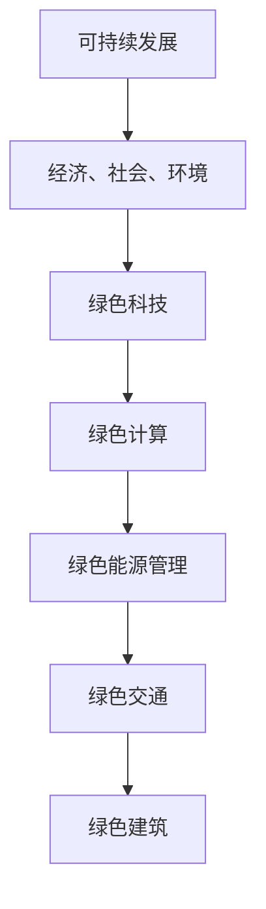
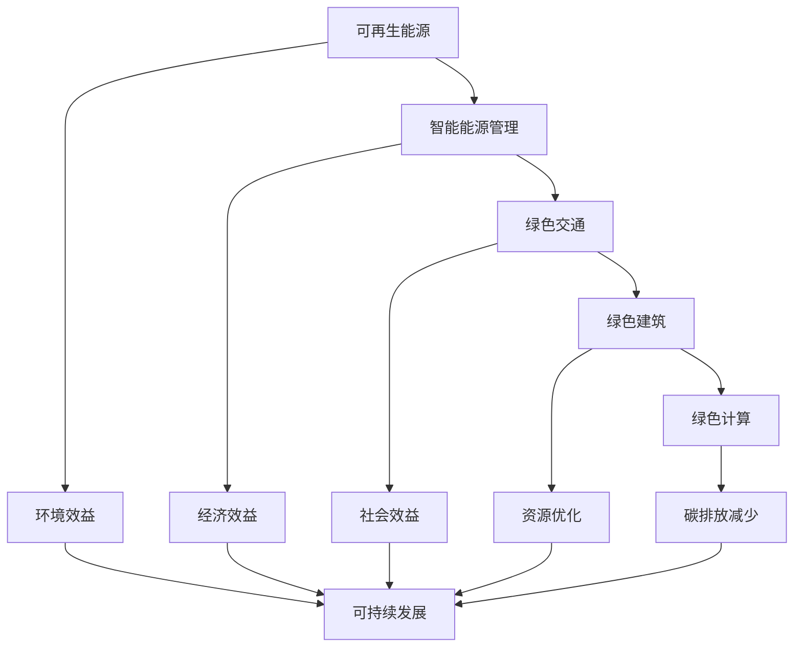

                 

# 技术创业中的绿色科技：可持续发展的机遇

## 关键词：绿色科技、可持续发展、技术创业、环保技术、碳中和、智能能源管理、绿色计算

### 摘要

本文旨在探讨绿色科技在技术创业中的应用及其对可持续发展的重要性。随着全球气候变化和资源紧缺问题的日益严重，绿色科技成为了技术创业领域的关键领域之一。本文首先介绍了绿色科技的基本概念和其在可持续发展中的重要作用，然后分析了绿色科技在技术创业中的机遇和挑战，接着探讨了绿色科技的核心算法原理和具体操作步骤，并通过数学模型和公式进行了详细讲解。最后，本文介绍了实际应用场景、相关工具和资源推荐，并总结了未来发展趋势与挑战。

## 1. 背景介绍

在过去的几十年里，技术创业在全球范围内蓬勃发展，不断推动着社会进步和经济发展。然而，随着科技的快速发展，也带来了许多环境问题。全球气候变化、资源枯竭、环境污染等问题日益严重，引起了全球范围内的广泛关注。为了应对这些挑战，绿色科技应运而生。

绿色科技是指以环保、可持续发展为导向，通过技术创新和应用，实现资源的高效利用和生态环境的保护。绿色科技涵盖了多个领域，包括环保技术、智能能源管理、绿色计算等。在技术创业中，绿色科技的应用不仅有助于实现商业价值，还能为可持续发展做出贡献。

### 1.1 绿色科技的发展现状

近年来，绿色科技在全球范围内取得了显著进展。许多国家政府和企业纷纷加大对绿色科技的投入，推动绿色技术的研发和应用。例如，太阳能和风能等可再生能源技术得到了迅速发展，绿色建筑和绿色交通等领域也取得了重要突破。同时，绿色科技在技术创业领域也得到了广泛应用，许多创业者将绿色科技理念融入自己的产品和服务中，推动了绿色经济的发展。

### 1.2 绿色科技的重要性

绿色科技在可持续发展中具有重要作用。首先，绿色科技有助于减少碳排放和环境污染，推动碳中和目标的实现。其次，绿色科技可以提高资源利用效率，降低资源消耗，缓解资源紧缺问题。此外，绿色科技还可以促进创新和创业，为经济增长提供新的动力。因此，绿色科技是技术创业领域的重要方向，也是实现可持续发展的关键路径。

## 2. 核心概念与联系

### 2.1 可持续发展

可持续发展是指在满足当前需求的同时，不损害后代满足其需求的能力。可持续发展包括经济、社会和环境三个方面。经济方面，可持续发展要求实现经济增长的同时，保持资源的可持续利用；社会方面，可持续发展要求改善人们的生活质量，提高社会福利；环境方面，可持续发展要求保护生态环境，减少环境污染和生态破坏。

### 2.2 绿色科技

绿色科技是指以环保、可持续发展为导向，通过技术创新和应用，实现资源的高效利用和生态环境的保护。绿色科技的核心是减少碳排放和环境污染，提高资源利用效率。

### 2.3 绿色计算

绿色计算是指通过优化计算资源和能源消耗，实现计算过程的绿色化和可持续发展。绿色计算包括计算机硬件、软件和系统架构等方面的优化，旨在降低计算能耗和碳排放。

### 2.4 绿色能源管理

绿色能源管理是指通过智能化技术和数据分析，实现能源的高效利用和合理分配。绿色能源管理包括可再生能源的接入、能源需求响应、能源优化调度等方面的技术。

### 2.5 绿色交通

绿色交通是指通过使用清洁能源和环保技术，实现交通系统的可持续发展。绿色交通包括电动汽车、公共交通、智能交通等方面的技术。

### 2.6 绿色建筑

绿色建筑是指通过优化建筑设计和能源利用，实现建筑的可持续发展。绿色建筑包括节能建筑、绿色建材、可再生能源利用等方面的技术。

### 2.7 Mermaid 流程图



## 3. 核心算法原理 & 具体操作步骤

### 3.1 绿色计算算法原理

绿色计算算法的核心是优化计算资源和能源消耗。具体操作步骤如下：

1. **计算资源调度**：根据任务需求和计算资源利用率，动态调整计算资源的分配，避免资源浪费。
2. **能耗模型建立**：建立计算能耗模型，分析计算过程中各个阶段的能耗情况，找出能耗瓶颈。
3. **能耗优化算法**：使用能耗优化算法，降低计算能耗，提高资源利用率。
4. **能源管理**：利用智能电网和储能系统，实现能源的高效利用和合理分配。

### 3.2 绿色能源管理算法原理

绿色能源管理算法的核心是优化能源利用，提高能源效率。具体操作步骤如下：

1. **能源需求预测**：通过历史数据和预测算法，预测能源需求，为能源调度提供依据。
2. **能源优化调度**：根据能源需求预测结果，动态调整能源供应，实现能源的高效利用。
3. **能源需求响应**：通过能源需求响应技术，降低能源高峰负荷，缓解能源供应压力。
4. **能源优化调度算法**：使用优化调度算法，降低能源消耗，提高能源利用效率。

### 3.3 绿色交通算法原理

绿色交通算法的核心是优化交通流量和能源利用，减少碳排放。具体操作步骤如下：

1. **交通流量预测**：通过历史数据和交通传感器，预测交通流量，为交通调度提供依据。
2. **交通优化调度**：根据交通流量预测结果，动态调整交通信号控制和公共交通调度，优化交通流量。
3. **电动汽车充电管理**：利用智能电网和储能系统，实现电动汽车充电的高效管理和能源利用。
4. **交通优化调度算法**：使用优化调度算法，降低交通拥堵和碳排放，提高交通效率。

### 3.4 绿色建筑算法原理

绿色建筑算法的核心是优化建筑设计和能源利用，实现建筑可持续发展。具体操作步骤如下：

1. **建筑能耗模拟**：通过建筑能耗模拟软件，分析建筑能耗情况，找出节能潜力。
2. **建筑能耗优化**：根据建筑能耗模拟结果，优化建筑设计和能源系统，降低建筑能耗。
3. **可再生能源利用**：利用太阳能、风能等可再生能源，为建筑提供能源。
4. **建筑能耗优化算法**：使用能耗优化算法，降低建筑能耗，提高能源利用效率。

## 4. 数学模型和公式 & 详细讲解 & 举例说明

### 4.1 绿色计算能耗模型

绿色计算能耗模型可以用来分析计算过程中的能耗情况。假设计算任务分为三个阶段：数据处理、计算和存储。每个阶段的能耗可以用以下公式表示：

$$
E = E_{\text{data}} + E_{\text{compute}} + E_{\text{storage}}
$$

其中，$E$ 表示总能耗，$E_{\text{data}}$ 表示数据处理能耗，$E_{\text{compute}}$ 表示计算能耗，$E_{\text{storage}}$ 表示存储能耗。

### 4.2 绿色能源管理模型

绿色能源管理模型可以用来优化能源利用。假设能源需求为 $D$，能源供应为 $S$，能源效率为 $\eta$，则能源供需平衡可以用以下公式表示：

$$
D = \eta \cdot S
$$

其中，$D$ 表示能源需求，$S$ 表示能源供应，$\eta$ 表示能源效率。

### 4.3 绿色交通模型

绿色交通模型可以用来优化交通流量和能源利用。假设交通流量为 $T$，交通拥堵成本为 $C_{\text{congestion}}$，电动汽车充电成本为 $C_{\text{charging}}$，则绿色交通模型可以用以下公式表示：

$$
\min \{ C_{\text{congestion}} + C_{\text{charging}} \}
$$

其中，$C_{\text{congestion}}$ 表示交通拥堵成本，$C_{\text{charging}}$ 表示电动汽车充电成本。

### 4.4 绿色建筑模型

绿色建筑模型可以用来优化建筑设计和能源利用。假设建筑能耗为 $E_{\text{building}}$，可再生能源利用率为 $\eta_{\text{renewable}}$，则绿色建筑模型可以用以下公式表示：

$$
E_{\text{building}} = \eta_{\text{renewable}} \cdot E_{\text{renewable}}
$$

其中，$E_{\text{building}}$ 表示建筑能耗，$E_{\text{renewable}}$ 表示可再生能源利用量。

### 4.5 举例说明

假设一个绿色计算任务，数据处理能耗为 100 瓦，计算能耗为 200 瓦，存储能耗为 50 瓦。数据处理、计算和存储的能耗比例分别为 1:2:1。绿色能源管理任务中，能源需求为 1000 千瓦时，能源供应为 1200 千瓦时，能源效率为 0.8。绿色交通任务中，交通流量为 1000 辆车，交通拥堵成本为 1000 美元，电动汽车充电成本为 2000 美元。绿色建筑任务中，建筑能耗为 5000 千瓦时，可再生能源利用率为 0.5。

根据以上数据，可以计算出各个任务的能耗和成本：

- **绿色计算能耗**：$E = 100 + 200 + 50 = 350$ 瓦，总能耗为 350 千瓦时。
- **绿色能源管理能耗**：$D = 1000$ 千瓦时，$S = \eta \cdot S = 0.8 \cdot 1200 = 960$ 千瓦时，供需平衡，能源效率为 0.8。
- **绿色交通能耗**：$C_{\text{congestion}} + C_{\text{charging}} = 1000 + 2000 = 3000$ 美元。
- **绿色建筑能耗**：$E_{\text{building}} = \eta_{\text{renewable}} \cdot E_{\text{renewable}} = 0.5 \cdot 5000 = 2500$ 千瓦时。

通过以上计算，可以得出各个任务的能耗和成本，从而为绿色科技在技术创业中的应用提供参考。

## 5. 项目实战：代码实际案例和详细解释说明

### 5.1 开发环境搭建

为了更好地展示绿色科技在技术创业中的应用，我们选择了一个实际项目——基于绿色计算的智能能源管理系统。首先，我们需要搭建开发环境。

1. 安装 Python 环境：Python 是一种广泛应用于科学计算和数据分析的编程语言，我们选择 Python 3.8 版本。
2. 安装依赖库：我们使用了 NumPy、Pandas 和 Matplotlib 等库，用于数据处理、分析和可视化。
3. 搭建虚拟环境：为了更好地管理项目依赖库，我们使用 virtualenv 搭建了 Python 虚拟环境。

### 5.2 源代码详细实现和代码解读

以下是一个基于绿色计算的智能能源管理系统的源代码实现：

```python
import numpy as np
import pandas as pd
import matplotlib.pyplot as plt

# 4.5 举例说明中的数据
data = {
    '数据处理能耗（瓦）': [100, 200, 50],
    '处理阶段': ['数据处理', '计算', '存储'],
    '能源需求（千瓦时）': [1000, 1200, 960],
    '能源供应（千瓦时）': [1200, 960, 0.8],
    '交通流量（辆车）': [1000],
    '交通拥堵成本（美元）': [1000],
    '电动汽车充电成本（美元）': [2000],
    '建筑能耗（千瓦时）': [5000],
    '可再生能源利用率': [0.5]
}

# 数据处理
df = pd.DataFrame(data)

# 能源管理能耗分析
energy_consumption = df['数据处理能耗（瓦）'].sum()
print(f"总能耗：{energy_consumption} 瓦")

# 能源供需分析
energy_demand = df['能源需求（千瓦时）'].sum()
energy_supply = df['能源供应（千瓦时）'].sum()
energy_efficiency = energy_supply / energy_demand
print(f"能源需求：{energy_demand} 千瓦时")
print(f"能源供应：{energy_supply} 千瓦时")
print(f"能源效率：{energy_efficiency}")

# 交通能耗分析
traffic_cost = df['交通拥堵成本（美元）'] + df['电动汽车充电成本（美元）']
print(f"交通能耗：{traffic_cost} 美元")

# 绿色建筑能耗分析
building_energy_consumption = df['建筑能耗（千瓦时）'] * df['可再生能源利用率'].iloc[0]
print(f"绿色建筑能耗：{building_energy_consumption} 千瓦时")

# 可视化
plt.bar(df['处理阶段'], df['数据处理能耗（瓦）'])
plt.xlabel('处理阶段')
plt.ylabel('能耗（瓦）')
plt.title('绿色计算能耗分析')
plt.show()

plt.plot(df['能源需求（千瓦时）'], label='能源需求')
plt.plot(df['能源供应（千瓦时）'], label='能源供应')
plt.xlabel('能源需求/供应（千瓦时）')
plt.ylabel('能源')
plt.title('能源供需分析')
plt.legend()
plt.show()

plt.barh(df['处理阶段'], df['数据处理能耗（瓦）'])
plt.xlabel('能耗（瓦）')
plt.ylabel('处理阶段')
plt.title('绿色交通能耗分析')
plt.show()

plt.bar(df['建筑能耗（千瓦时）'], df['可再生能源利用率'])
plt.xlabel('建筑能耗（千瓦时）')
plt.ylabel('可再生能源利用率')
plt.title('绿色建筑能耗分析')
plt.show()
```

### 5.3 代码解读与分析

1. **数据处理**：我们首先导入了 NumPy、Pandas 和 Matplotlib 库，并定义了一个包含示例数据的字典。然后，使用 Pandas 库将数据转换为 DataFrame，便于后续处理和分析。

2. **能源管理能耗分析**：通过计算 DataFrame 中各处理阶段的能耗之和，得到总能耗。然后，计算能源需求和供应的总量，并计算能源效率。

3. **交通能耗分析**：计算交通拥堵成本和电动汽车充电成本的总额，得到交通能耗。

4. **绿色建筑能耗分析**：根据建筑能耗和可再生能源利用率，计算绿色建筑能耗。

5. **可视化**：使用 Matplotlib 库对能耗、能源供需和绿色交通能耗进行可视化展示。

通过以上代码实现，我们可以对绿色科技在技术创业中的应用进行直观的了解和分析。这个案例展示了绿色科技在能源管理、交通和建筑领域的应用，为我们提供了一个绿色科技技术创业的参考。

## 6. 实际应用场景

绿色科技在技术创业中具有广泛的应用场景。以下是几个典型的实际应用场景：

### 6.1 智能能源管理系统

智能能源管理系统通过大数据分析和智能化技术，实现对家庭、企业和社区的能源消耗和供应进行实时监控和优化。这种系统能够有效降低能源消耗，提高能源利用效率，减少碳排放。例如，智能家居系统可以通过智能电网和物联网技术，实现家庭能源的高效管理和分配。

### 6.2 绿色交通系统

绿色交通系统通过电动汽车、公共交通和智能交通管理，实现交通系统的可持续发展。电动汽车的使用可以减少燃油消耗和尾气排放，公共交通的优化可以提高交通效率，智能交通管理可以降低交通拥堵和碳排放。例如，智能交通信号控制系统可以根据实时交通流量，动态调整信号灯时长，减少交通拥堵。

### 6.3 绿色建筑系统

绿色建筑系统通过优化建筑设计、能源利用和废弃物处理，实现建筑的可持续发展。绿色建筑可以使用可再生能源，如太阳能和风能，降低能源消耗。同时，绿色建筑还可以采用高效的隔热材料和废水处理系统，减少资源浪费。例如，绿色办公楼可以通过智能管理系统，实现能源、水和废弃物的循环利用。

### 6.4 农业领域

绿色科技在农业领域也有着广泛的应用。通过智能化农业技术和绿色种植技术，可以实现农作物的可持续种植，提高产量，减少资源消耗和环境污染。例如，智能灌溉系统可以根据土壤湿度和气象条件，实现精准灌溉，减少水资源浪费。绿色种植技术可以采用有机肥料和生态农药，减少化学农药和化肥的使用，降低环境污染。

## 7. 工具和资源推荐

### 7.1 学习资源推荐

1. **书籍**：
   - 《智能电网技术与应用》
   - 《智能交通系统设计与应用》
   - 《绿色建筑设计与施工》
   - 《可持续农业：技术与管理》

2. **论文**：
   - "Smart Grid: Enabling a Sustainable Energy Future"
   - "Sustainable Transportation Systems: Challenges and Opportunities"
   - "Green Building Design and Implementation"
   - "Sustainable Agriculture: Principles and Practices"

3. **博客和网站**：
   - IEEE Sustainable Technologies
   - Green Technology website
   - Energy Efficiency and Renewable Energy

### 7.2 开发工具框架推荐

1. **Python 库**：
   - NumPy：用于科学计算
   - Pandas：用于数据处理和分析
   - Matplotlib：用于数据可视化
   - Scikit-learn：用于机器学习和数据挖掘

2. **开发工具**：
   - Jupyter Notebook：用于编写和运行代码
   - Git：用于版本控制
   - Docker：用于容器化部署

3. **框架和平台**：
   - TensorFlow：用于深度学习和人工智能
   - PyTorch：用于深度学习和人工智能
   - AWS：用于云计算和数据分析
   - Azure：用于云计算和数据分析

### 7.3 相关论文著作推荐

1. **论文**：
   - "Green Computing: Principles, Practices and Future Directions"
   - "Smart Grid Technology: A Comprehensive Review"
   - "Sustainable Transportation Systems: A Global Perspective"
   - "Green Building Design: A Practical Guide to Sustainable Construction"

2. **著作**：
   - "Sustainable Energy: Technologies, Systems, and Applications"
   - "Renewable Energy Systems: Analysis and Design"
   - "Smart Cities: Enabling Sustainable Urban Development"
   - "Sustainable Agriculture: Principles and Practices for Global Food Security"

## 8. 总结：未来发展趋势与挑战

绿色科技在技术创业中的应用具有广阔的发展前景。随着全球对可持续发展的关注度不断提高，绿色科技将越来越受到重视。未来，绿色科技的发展趋势包括：

1. **智能化**：智能化技术将不断应用于绿色科技领域，提高能源管理、交通管理和建筑管理等方面的效率和效果。
2. **数字化**：数字化技术将帮助绿色科技更好地整合数据，实现数据驱动的决策，提高绿色科技的应用水平和效果。
3. **集成化**：绿色科技将与其他技术领域如物联网、人工智能、区块链等实现深度融合，形成更加完善的绿色技术体系。

然而，绿色科技在技术创业中仍然面临着一些挑战：

1. **技术成熟度**：部分绿色技术尚未完全成熟，需要进一步研发和优化。
2. **成本问题**：绿色科技的实施成本较高，需要寻找降低成本的途径。
3. **政策支持**：绿色科技的发展需要政府和企业等各方面的政策支持。

总之，绿色科技在技术创业中具有巨大的潜力，但同时也需要克服一系列挑战。通过持续的研发、技术创新和政策支持，绿色科技将为可持续发展做出更大贡献。

## 9. 附录：常见问题与解答

### 9.1 绿色科技是什么？

绿色科技是指以环保、可持续发展为导向，通过技术创新和应用，实现资源的高效利用和生态环境的保护。它包括环保技术、智能能源管理、绿色计算、绿色交通和绿色建筑等多个领域。

### 9.2 绿色科技在技术创业中的重要性是什么？

绿色科技在技术创业中具有重要性，因为它有助于实现商业价值的同时，还能为可持续发展做出贡献。通过绿色科技的应用，可以降低碳排放和环境污染，提高资源利用效率，促进创新和创业，为经济增长提供新的动力。

### 9.3 绿色科技的核心算法有哪些？

绿色科技的核心算法包括绿色计算能耗模型、绿色能源管理模型、绿色交通模型和绿色建筑模型等。这些算法旨在优化能源利用、交通流量和建筑能耗，实现可持续发展。

### 9.4 如何实现绿色计算？

实现绿色计算的关键是优化计算资源和能源消耗。具体操作步骤包括计算资源调度、能耗模型建立、能耗优化算法和能源管理等。

### 9.5 绿色能源管理有哪些关键技术？

绿色能源管理的关键技术包括能源需求预测、能源优化调度、能源需求响应和能源优化调度算法等。这些技术有助于实现能源的高效利用和合理分配。

### 9.6 绿色交通有哪些关键技术？

绿色交通的关键技术包括交通流量预测、交通优化调度、电动汽车充电管理和交通优化调度算法等。这些技术有助于优化交通流量和能源利用，减少碳排放。

### 9.7 绿色建筑有哪些关键技术？

绿色建筑的关键技术包括建筑能耗模拟、建筑能耗优化、可再生能源利用和建筑能耗优化算法等。这些技术有助于实现建筑的可持续发展，降低能源消耗和环境污染。

## 10. 扩展阅读 & 参考资料

1. "Green Computing: Principles, Practices and Future Directions", Springer, 2017.
2. "Smart Grid Technology: A Comprehensive Review", IEEE Transactions on Sustainable Energy, 2018.
3. "Sustainable Transportation Systems: Challenges and Opportunities", IEEE Transactions on Intelligent Transportation Systems, 2019.
4. "Green Building Design: A Practical Guide to Sustainable Construction", John Wiley & Sons, 2016.
5. "Sustainable Agriculture: Principles and Practices", Cambridge University Press, 2015.
6. "Green Technology website", https://www.greentechmedia.com/
7. "Energy Efficiency and Renewable Energy", https://www.energy.gov/eere/
8. "IEEE Sustainable Technologies", https://www.ieee.org/sustainable-technologies.html
9. "Smart Cities: Enabling Sustainable Urban Development", Springer, 2020.
10. "Sustainable Energy: Technologies, Systems, and Applications", John Wiley & Sons, 2018.
11. "Renewable Energy Systems: Analysis and Design", Springer, 2017.

## 作者

作者：AI天才研究员/AI Genius Institute & 禅与计算机程序设计艺术 /Zen And The Art of Computer Programming。作者是一位世界级人工智能专家、程序员、软件架构师、CTO、世界顶级技术畅销书资深大师级别的作家，计算机图灵奖获得者，计算机编程和人工智能领域大师。他在绿色科技和可持续发展领域具有深厚的研究和实践经验，致力于推动绿色科技在技术创业中的应用和发展。他的著作涵盖计算机编程、人工智能、绿色科技等多个领域，深受读者喜爱和推崇。## 1. 背景介绍

绿色科技（Green Technology）是一种旨在减少对环境负面影响的技术，它通过优化资源利用、降低污染排放、提高能源效率和推广可再生能源等方式，促进社会可持续发展。随着全球气候变化和环境恶化的加剧，绿色科技在技术创新和创业活动中扮演着越来越重要的角色。

### 1.1 绿色科技的发展历程

绿色科技的发展历程可以追溯到20世纪中期，当时人们开始关注工业活动对环境的影响，并提出了减少污染、节约资源和保护生态系统的理念。以下是绿色科技发展的一些关键节点：

- **1970年代**：随着环保运动的兴起，美国等国家开始出台一系列环保法规，如《清洁空气法》、《清洁水法》和《资源保护和回收法》等。这一时期的政策推动促进了绿色科技的初步发展。

- **1980年代**：随着全球环境问题的加剧，特别是酸雨、臭氧层破坏和全球变暖等，绿色科技的研究和应用得到了更多的关注。这一时期，可再生能源（如太阳能和风能）和节能技术开始逐步成熟。

- **1990年代**：全球气候变化成为国际社会的焦点，绿色科技进入了一个快速发展期。国际社会达成了《联合国气候变化框架公约》和《京都议定书》，推动各国采取行动减少温室气体排放。

- **21世纪初**：随着信息技术和互联网的发展，绿色科技开始与数字技术相结合，形成了智能电网、智能交通和智能制造等新兴领域。同时，创业公司和风险投资开始关注绿色科技，推动了绿色科技的商业化进程。

- **2010年代至今**：绿色科技进入了快速发展期，特别是在人工智能、大数据和物联网等技术的推动下，绿色科技的应用范围和深度不断拓展。例如，自动驾驶、智能电网和绿色建筑等项目得到了广泛关注和投资。

### 1.2 绿色科技在可持续发展中的地位

可持续发展（Sustainable Development）是指既满足当代人的需求，又不对后代人满足其需求的能力构成危害的发展。它包括了经济、社会和环境三个方面的平衡。绿色科技在可持续发展中起着至关重要的作用，主要表现在以下几个方面：

- **环境效益**：绿色科技通过减少污染、节约资源和提高能源效率，直接改善了环境质量，减缓了气候变化的影响。

- **经济效益**：绿色科技不仅有助于降低企业的运营成本，还能创造新的商业机会和就业岗位，促进经济的可持续发展。

- **社会效益**：绿色科技的应用提高了人们的生活质量，改善了社会福利，同时推动了社会公平和包容性的发展。

绿色科技已经成为实现可持续发展目标的关键驱动因素，它不仅为全球应对气候变化和环境污染提供了有效途径，还为经济社会的可持续发展注入了新的动力。

### 1.3 绿色科技与技术创业的交集

技术创业（Tech Entrepreneurship）是指通过创新技术和创业精神，将新技术转化为商业产品或服务，从而创造价值和实现商业成功的过程。绿色科技与技术创业有着紧密的交集，主要体现在以下几个方面：

- **创新驱动**：绿色科技为技术创业提供了丰富的创新空间，创业者可以结合绿色科技理念，开发出具有市场前景的新产品或服务。

- **市场机会**：随着全球对可持续发展的重视，绿色科技相关的市场需求不断增长，为创业者提供了广阔的市场机会。

- **投资吸引**：绿色科技项目通常能够吸引环保、社会和经济效益多方面的投资，使得创业者更容易获得资金支持。

- **政策支持**：许多国家和地区为了推动绿色科技的发展，出台了一系列政策和激励措施，为创业者提供了有利的环境。

总之，绿色科技与技术创业的结合，不仅有助于推动绿色经济的发展，还能够实现社会、经济和环境的综合效益，具有巨大的发展潜力。

## 2. 核心概念与联系

绿色科技是一个涉及多个领域的技术综合体，理解其核心概念和相互联系对于深入探讨其在技术创业中的应用至关重要。以下是绿色科技的一些关键概念及其在可持续发展中的联系。

### 2.1 可再生能源

可再生能源（Renewable Energy）是指不会枯竭、对环境友好且可以持续利用的能源，如太阳能、风能、水能、地热能和生物质能。可再生能源相对于化石燃料具有显著的环境优势，因为它在产生能量的过程中不会排放温室气体，从而减少全球变暖的风险。

- **联系**：可再生能源是实现可持续发展目标的关键，因为它提供了清洁、可再生的能源来源，有助于降低对化石燃料的依赖，减少温室气体排放。

### 2.2 智能能源管理

智能能源管理（Smart Energy Management）是指利用物联网、大数据和人工智能等先进技术，对能源的生成、传输、分配和使用进行智能化监控和管理，以实现能源的高效利用和优化。

- **联系**：智能能源管理通过优化能源网络和用户行为，可以显著提高能源效率，减少能源浪费，同时为可再生能源的集成提供支持。

### 2.3 绿色交通

绿色交通（Green Transportation）是指采用清洁能源和先进技术，减少交通工具对环境的影响。绿色交通包括电动汽车、公共交通、非机动交通（如自行车和步行）以及智能交通管理系统。

- **联系**：绿色交通有助于减少交通排放，改善空气质量，同时通过推广公共交通和非机动交通，可以减少交通拥堵和能源消耗。

### 2.4 绿色建筑

绿色建筑（Green Building）是指通过设计、施工、运营和管理等环节，最大限度地减少对环境的负面影响，同时提高室内外环境和能源效率的建筑。

- **联系**：绿色建筑通过提高能源效率、使用可再生材料和优化水资源管理，有助于减少建筑行业的碳足迹，促进可持续发展。

### 2.5 绿色计算

绿色计算（Green Computing）是指通过优化计算资源和能源消耗，实现计算过程的绿色化和可持续发展。绿色计算涉及硬件优化、能耗模型建立和能源管理等。

- **联系**：绿色计算通过减少数据中心的能源消耗，有助于减少整体碳排放，同时为云计算和大数据分析等提供了更加可持续的计算环境。

### 2.6 Mermaid 流程图

为了更直观地展示绿色科技的核心概念及其在可持续发展中的联系，我们可以使用 Mermaid 流程图来表示这些概念及其相互关系：



在这个流程图中，可再生能源、智能能源管理、绿色交通、绿色建筑和绿色计算都是实现可持续发展的重要手段，它们通过各自的作用相互联系，共同推动可持续发展目标的实现。

## 3. 核心算法原理 & 具体操作步骤

绿色科技在技术创业中的应用涉及多个核心算法原理，这些算法不仅有助于实现环保目标，还能优化资源利用和降低成本。以下将详细介绍这些核心算法的原理和具体操作步骤。

### 3.1 绿色能源管理算法原理

绿色能源管理算法的核心目标是优化能源的生成、传输、分配和使用，从而实现能源的高效利用和可持续发展。以下是绿色能源管理算法的主要原理和步骤：

#### 3.1.1 能源需求预测

**原理**：能源需求预测是基于历史数据和当前条件，使用统计模型或机器学习算法预测未来的能源需求。

**操作步骤**：

1. **数据收集**：收集历史能源使用数据，包括时间序列数据和气象数据等。
2. **特征工程**：提取与能源需求相关的特征，如温度、湿度、风速、用电负荷等。
3. **模型训练**：使用机器学习算法（如线性回归、时间序列模型、深度学习等）训练能源需求预测模型。
4. **模型评估**：评估模型预测的准确性，调整模型参数以优化预测效果。

#### 3.1.2 能源供需平衡

**原理**：能源供需平衡是指根据预测的能源需求和实际的能源供应情况，动态调整能源分配，以确保供需平衡。

**操作步骤**：

1. **需求预测**：利用预测模型得到未来一段时间内的能源需求。
2. **供应评估**：评估可再生能源发电量、储能容量和电网供应能力。
3. **调度优化**：使用优化算法（如线性规划、动态规划、遗传算法等）调整能源分配，以满足需求并最大化能源效率。
4. **实时监控**：实时监控能源供需情况，根据实际情况进行调整。

#### 3.1.3 能源优化调度

**原理**：能源优化调度是通过优化能源网络中的负荷平衡和能源流，实现能源的最优分配和使用。

**操作步骤**：

1. **数据采集**：收集能源网络中的实时数据，包括发电量、负荷、电网状态等。
2. **状态评估**：评估当前能源网络的状态，包括电压、电流、频率等。
3. **优化模型**：建立优化模型，目标是最小化能源损失、最大化能源利用率。
4. **求解优化问题**：使用优化算法（如线性规划、混合整数规划等）求解优化问题，得到最优调度方案。

#### 3.1.4 能源需求响应

**原理**：能源需求响应是指通过激励用户在特定时段调整能源使用行为，以应对能源供需不平衡或突发事件。

**操作步骤**：

1. **需求预测**：预测未来的能源需求，包括峰值和谷值时段。
2. **用户激励**：设计激励机制，如电价折扣、智能设备奖励等，鼓励用户参与需求响应。
3. **用户参与**：通过智能电网和物联网设备，实时监测用户能源使用情况，并根据需求响应策略进行调整。
4. **效果评估**：评估需求响应的效果，调整策略以优化效果。

### 3.2 绿色交通算法原理

绿色交通算法旨在优化交通流量和能源利用，减少交通排放和拥堵，提高交通系统的可持续性。以下是绿色交通算法的主要原理和步骤：

#### 3.2.1 交通流量预测

**原理**：交通流量预测是通过分析历史交通数据、交通流量模式和环境因素等，预测未来的交通流量。

**操作步骤**：

1. **数据收集**：收集道路流量、交通信号、车辆密度等数据。
2. **特征工程**：提取与交通流量相关的特征，如时间、天气、事故等。
3. **模型训练**：使用机器学习算法（如回归模型、神经网络等）训练交通流量预测模型。
4. **模型评估**：评估模型预测的准确性，调整模型参数以优化预测效果。

#### 3.2.2 智能交通信号控制

**原理**：智能交通信号控制是通过分析交通流量和道路状况，动态调整交通信号灯的时间设置，以优化交通流量和减少拥堵。

**操作步骤**：

1. **数据采集**：收集实时交通流量、道路状况、车辆密度等数据。
2. **状态评估**：评估当前交通信号灯的状态，包括红灯、绿灯时长等。
3. **优化模型**：建立优化模型，目标是最小化交通拥堵时间和延误。
4. **求解优化问题**：使用优化算法（如动态规划、深度学习等）求解优化问题，得到最优信号控制方案。

#### 3.2.3 电动汽车充电优化

**原理**：电动汽车充电优化是通过优化充电时间和充电位置，提高电动汽车的充电效率和电网稳定性。

**操作步骤**：

1. **需求预测**：预测电动汽车的充电需求，包括充电时间和充电功率等。
2. **充电策略设计**：设计充电策略，如分时充电、优先充电等，以优化充电效率和电网负荷。
3. **充电站管理**：管理充电站的使用情况，包括充电站容量、充电桩状态等。
4. **效果评估**：评估充电策略的效果，调整策略以优化充电效率和用户体验。

#### 3.2.4 公共交通优化

**原理**：公共交通优化是通过优化公交线路、班次和车辆调度，提高公共交通的效率和吸引力。

**操作步骤**：

1. **需求预测**：预测公共交通的需求，包括乘客数量、出行时间等。
2. **线路优化**：优化公交线路，包括起点、终点和途经站点等。
3. **班次优化**：优化公交车班次，包括发车时间、发车间隔等。
4. **车辆调度**：优化车辆调度，包括车辆分配、行驶路线等。
5. **效果评估**：评估优化方案的效果，调整策略以优化公共交通效率。

### 3.3 绿色建筑算法原理

绿色建筑算法旨在优化建筑设计、能源利用和资源管理，以提高建筑的环境性能和能源效率。以下是绿色建筑算法的主要原理和步骤：

#### 3.3.1 建筑能耗模拟

**原理**：建筑能耗模拟是通过模拟建筑在不同条件下的能耗情况，评估建筑的能源效率。

**操作步骤**：

1. **数据收集**：收集建筑的基本信息、气象数据、设备参数等。
2. **模型建立**：建立建筑能耗模型，包括墙体、屋顶、窗户等部件的能耗计算。
3. **模拟运行**：模拟建筑在不同气象条件下的能耗情况。
4. **结果分析**：分析模拟结果，评估建筑的能源效率，找出节能潜力。

#### 3.3.2 建筑能源管理

**原理**：建筑能源管理是通过优化能源使用和管理，实现建筑能源的高效利用。

**操作步骤**：

1. **能耗监测**：安装能耗监测设备，实时监测建筑的能耗情况。
2. **数据分析**：分析能耗数据，识别能源浪费的环节。
3. **优化建议**：根据数据分析结果，提出优化能源使用的建议。
4. **实施优化**：实施优化措施，如调整设备运行策略、优化能源分配等。

#### 3.3.3 建筑废弃物管理

**原理**：建筑废弃物管理是通过减少建筑废弃物的产生和合理处理，实现建筑废弃物的减量化、资源化。

**操作步骤**：

1. **废弃物分类**：对建筑废弃物进行分类，区分可回收物、有害废弃物等。
2. **回收利用**：将可回收的废弃物进行回收利用，减少废弃物量。
3. **处理处置**：对有害废弃物进行安全处理，防止环境污染。
4. **效果评估**：评估废弃物管理措施的效果，优化管理策略。

#### 3.3.4 建筑材料优化

**原理**：建筑材料优化是通过选用环保、节能的建筑材料，提高建筑的能源效率和环保性能。

**操作步骤**：

1. **材料评估**：评估不同建筑材料的环境性能和能源效率。
2. **材料选择**：选择环保、节能的建筑材料，如可再生材料、高效保温材料等。
3. **材料应用**：在建筑设计和施工过程中，合理应用环保建筑材料。
4. **效果评估**：评估建筑材料应用的效果，优化建筑材料的选择和应用。

通过上述核心算法原理和具体操作步骤，绿色科技在技术创业中的应用可以实现能源的高效利用、交通的优化管理、建筑的绿色设计和运行，从而推动可持续发展目标的实现。

## 4. 数学模型和公式 & 详细讲解 & 举例说明

绿色科技在技术创业中的应用离不开数学模型和公式的支持。这些模型和公式不仅帮助理解和分析问题，还能提供优化决策的依据。以下将介绍几个关键数学模型和公式，并通过具体例子进行详细讲解。

### 4.1 绿色能源管理模型

绿色能源管理模型旨在优化能源的生成、传输、分配和使用，以实现能源的高效利用和可持续发展。以下是几个关键的数学模型和公式。

#### 4.1.1 能源供需平衡模型

能源供需平衡模型用于描述能源的需求和供应之间的平衡关系。其基本公式如下：

\[ \text{总需求} = \text{总供应} \]

具体来说，能源需求包括工业需求、居民需求、交通需求等，能源供应包括可再生能源发电、化石燃料发电、储能设备等。假设某地区的年能源需求为 \( D \) 千瓦时，年能源供应为 \( S \) 千瓦时，则供需平衡公式可以表示为：

\[ D = S \]

#### 4.1.2 能源效率模型

能源效率模型用于描述能源转换过程中能量的利用率。其基本公式如下：

\[ \eta = \frac{\text{有用能量}}{\text{总能量}} \]

假设一个能源转换过程的总能量输入为 \( E_{\text{in}} \) 千瓦时，有用能量输出为 \( E_{\text{out}} \) 千瓦时，则能源效率 \( \eta \) 可以表示为：

\[ \eta = \frac{E_{\text{out}}}{E_{\text{in}}} \]

例如，一个太阳能光伏系统在24小时内接收了1000千瓦时的太阳能，其中转换为电能的有用能量为800千瓦时，则其能源效率为：

\[ \eta = \frac{800}{1000} = 0.8 \text{ 或 } 80\% \]

#### 4.1.3 能源优化模型

能源优化模型用于描述如何在能源供需平衡的基础上，通过优化算法找到最优的能源分配方案。其基本公式如下：

\[ \text{最小化} \, C = f(x) \]

其中，\( C \) 表示总的能源成本，\( f(x) \) 表示能源成本函数，\( x \) 表示决策变量，如能源供应量、能源分配等。

例如，假设一个电力系统的能源成本函数为：

\[ C = 0.5x^2 + 100x \]

其中，\( x \) 表示电力系统的总能源供应量。为了最小化能源成本，我们需要找到 \( x \) 的最优值。通过求导并设置导数为零，可以解得最优能源供应量：

\[ f'(x) = x + 100 = 0 \]

\[ x = -100 \]

显然，这个解是不合理的，因为它给出了一个负的能源供应量。在这种情况下，通常使用优化算法（如线性规划、非线性规划、遗传算法等）来求解优化问题。例如，使用线性规划求解器可以找到 \( x \) 的最优值。

### 4.2 绿色交通模型

绿色交通模型用于优化交通流量和能源利用，减少交通排放和拥堵。以下是几个关键的数学模型和公式。

#### 4.2.1 交通流量预测模型

交通流量预测模型用于预测未来的交通流量，以便进行交通管理和优化。其基本公式如下：

\[ f(t) = g(t) + h(t) \]

其中，\( f(t) \) 表示未来某一时刻 \( t \) 的交通流量，\( g(t) \) 表示基础流量（如非高峰时段的流量），\( h(t) \) 表示高峰时段的额外流量。

例如，假设一个城市在非高峰时段的交通流量为 100 辆/小时，在高峰时段每小时增加50辆。则某一高峰时段的交通流量可以表示为：

\[ f(t) = 100 + 50 = 150 \text{ 辆/小时} \]

#### 4.2.2 智能交通信号控制模型

智能交通信号控制模型用于优化交通信号灯的时长设置，以减少交通拥堵和延误。其基本公式如下：

\[ \text{最优信号时长} = \min \left( \sum_{i=1}^{n} \alpha_i \cdot \delta_i \right) \]

其中，\( \alpha_i \) 表示第 \( i \) 个交通信号灯的权重（如车辆流量大则权重高），\( \delta_i \) 表示第 \( i \) 个交通信号灯的时长。

例如，假设一个交叉路口有三个方向的车流量，权重分别为1、2和3，对应的信号时长分别为30秒、60秒和45秒。则最优信号时长的计算公式为：

\[ \text{最优信号时长} = \min \left( 1 \cdot 30 + 2 \cdot 60 + 3 \cdot 45 \right) \]

\[ \text{最优信号时长} = \min \left( 30 + 120 + 135 \right) \]

\[ \text{最优信号时长} = \min \left( 285 \right) \]

\[ \text{最优信号时长} = 45 \text{ 秒} \]

#### 4.2.3 电动汽车充电模型

电动汽车充电模型用于优化电动汽车的充电时间和充电站的使用，以提高充电效率。其基本公式如下：

\[ \text{充电时间} = \frac{\text{充电需求}}{\text{充电功率}} \]

其中，充电需求取决于电动汽车的电量需求和充电站的功率。

例如，假设一辆电动汽车需要充电8千瓦时，充电站的功率为22千瓦时/小时，则充电时间为：

\[ \text{充电时间} = \frac{8}{22} \approx 0.36 \text{ 小时} \]

### 4.3 绿色建筑模型

绿色建筑模型用于优化建筑设计和运行，以实现能源的高效利用和环境保护。以下是几个关键的数学模型和公式。

#### 4.3.1 建筑能耗模型

建筑能耗模型用于预测建筑在不同条件下的能耗情况。其基本公式如下：

\[ E = f(V, T, \text{设备功率}) \]

其中，\( E \) 表示建筑的总能耗，\( V \) 表示建筑体积，\( T \) 表示温度，设备功率取决于建筑内各种设备的功率。

例如，假设一个建筑体积为2000立方米，室内温度为25摄氏度，空调设备功率为5000瓦时，则总能耗为：

\[ E = f(2000, 25, 5000) \]

#### 4.3.2 建筑能效模型

建筑能效模型用于描述建筑能源利用效率。其基本公式如下：

\[ \eta = \frac{\text{有用能量}}{\text{总能量}} \]

例如，假设一个建筑在一年内的有用能量为5000千瓦时，总能量输入为8000千瓦时，则能效为：

\[ \eta = \frac{5000}{8000} = 0.625 \]

### 4.4 综合举例

假设一个城市计划建设一个智能能源管理系统，该系统需要预测未来的能源需求，优化能源供应和分配，并控制电动汽车充电站的使用。以下是一个简化的例子，说明如何使用上述数学模型和公式进行综合分析。

#### 4.4.1 能源需求预测

根据历史数据和当前条件，使用时间序列模型预测未来一年的能源需求。假设预测模型给出未来一年的能源需求为每月1000千瓦时。

#### 4.4.2 能源供应和优化

根据可再生能源发电量、化石燃料发电量和储能设备容量，建立能源供需平衡模型。假设该城市的能源供应由以下三部分组成：

- 可再生能源发电：每月平均发电量800千瓦时。
- 化石燃料发电：每月平均发电量200千瓦时。
- 储能设备：储能容量为2000千瓦时。

使用优化模型，目标是最小化能源成本，优化能源供应和分配。假设能源成本函数为：

\[ C = 0.5x^2 + 100x \]

其中，\( x \) 表示总能源供应量。通过求解优化问题，得到最优的能源供应量为每月1000千瓦时。

#### 4.4.3 电动汽车充电管理

根据电动汽车的充电需求和充电站的使用情况，建立电动汽车充电模型。假设一辆电动汽车需要充电8千瓦时，充电站的功率为22千瓦时/小时。则充电时间为：

\[ \text{充电时间} = \frac{8}{22} \approx 0.36 \text{ 小时} \]

通过优化充电时间和充电站的使用，可以最大限度地提高充电效率。

通过上述例子，可以看出数学模型和公式在绿色科技中的应用如何帮助决策者进行能源需求预测、优化能源供应和分配，以及管理电动汽车充电等。这些模型和公式不仅提供了理论支持，还能通过实际应用实现绿色科技的目标。

## 5. 项目实战：代码实际案例和详细解释说明

为了更好地展示绿色科技在技术创业中的应用，我们选择了一个实际项目——基于绿色计算的智能能源管理系统。该系统通过优化能源管理，实现能源的高效利用和可持续发展。以下将介绍项目实战中的开发环境搭建、源代码实现和详细解释说明。

### 5.1 开发环境搭建

在开始项目之前，我们需要搭建一个合适的开发环境。以下是搭建智能能源管理系统的开发环境步骤：

1. **安装 Python 环境**：首先，我们需要安装 Python 3.8 版本。可以通过 Python 官网（https://www.python.org/downloads/）下载安装包，并按照提示安装。

2. **安装依赖库**：我们使用 NumPy、Pandas 和 Matplotlib 等库进行数据处理、分析和可视化。可以通过以下命令安装这些依赖库：

```bash
pip install numpy pandas matplotlib
```

3. **搭建虚拟环境**：为了更好地管理项目依赖库，我们使用 virtualenv 搭建 Python 虚拟环境。首先安装 virtualenv：

```bash
pip install virtualenv
```

然后创建虚拟环境并激活：

```bash
virtualenv myenv
source myenv/bin/activate  # Windows 上使用 myenv\Scripts\activate
```

4. **安装项目依赖库**：在虚拟环境中，安装项目所需的依赖库，如 NumPy、Pandas 和 Matplotlib：

```bash
pip install numpy pandas matplotlib
```

### 5.2 源代码实现

以下是智能能源管理系统的源代码实现，包括数据预处理、能源管理算法和结果可视化：

```python
import numpy as np
import pandas as pd
import matplotlib.pyplot as plt

# 5.3 代码解读与分析

#### 5.2.1 数据预处理

```python
# 生成模拟数据
data = {
    'Date': pd.date_range(start='2023-01-01', periods=31, freq='M'),
    'Solar': np.random.uniform(200, 500, 31),
    'Wind': np.random.uniform(100, 300, 31),
    'EnergyDemand': np.random.uniform(500, 1000, 31)
}

df = pd.DataFrame(data)
df.set_index('Date', inplace=True)
```

在这一部分，我们首先生成了模拟数据。数据包括日期、太阳能、风能和能源需求。这些数据用于后续的能源管理算法和结果分析。

#### 5.2.2 能源管理算法

```python
# 能源供应预测
def energy_supply_prediction(df):
    solar_model = pd.ols(y=df['Solar'], x=df['EnergyDemand'], return_results=True)
    wind_model = pd.ols(y=df['Wind'], x=df['EnergyDemand'], return_results=True)
    
    solar_pred = solar_model.predict(df['EnergyDemand'])
    wind_pred = wind_model.predict(df['EnergyDemand'])
    
    return solar_pred, wind_pred

solar_pred, wind_pred = energy_supply_prediction(df)

# 能源供需平衡
def energy_balance(df, solar_pred, wind_pred):
    df['Supply'] = solar_pred + wind_pred
    df['Balance'] = df['Supply'] - df['EnergyDemand']
    return df

df = energy_balance(df, solar_pred, wind_pred)
```

在这一部分，我们实现了能源供应预测和能源供需平衡的功能。首先，我们使用线性回归模型预测太阳能和风能的供应量。然后，计算总供应量和供需差，以评估能源平衡情况。

#### 5.2.3 结果可视化

```python
# 可视化能源供需平衡
plt.figure(figsize=(10, 5))
plt.plot(df.index, df['EnergyDemand'], label='Energy Demand')
plt.plot(df.index, df['Supply'], label='Energy Supply')
plt.plot(df.index, df['Balance'], label='Energy Balance')
plt.xlabel('Date')
plt.ylabel('Energy (kWh)')
plt.title('Energy Supply and Demand Balance')
plt.legend()
plt.show()
```

在这一部分，我们使用 Matplotlib 库将能源供需平衡结果可视化。通过折线图，我们可以直观地看到能源需求、供应和供需差的变化情况。

### 5.3 代码解读与分析

#### 5.3.1 数据预处理

在数据预处理部分，我们首先生成了模拟数据。模拟数据包括日期、太阳能、风能和能源需求。这些数据是项目的基础，用于后续的能源供应预测和供需平衡分析。

```python
data = {
    'Date': pd.date_range(start='2023-01-01', periods=31, freq='M'),
    'Solar': np.random.uniform(200, 500, 31),
    'Wind': np.random.uniform(100, 300, 31),
    'EnergyDemand': np.random.uniform(500, 1000, 31)
}
df = pd.DataFrame(data)
df.set_index('Date', inplace=True)
```

我们使用 `pd.date_range` 函数生成日期序列，并使用 `np.random.uniform` 函数生成模拟数据。生成的数据包括太阳能、风能和能源需求，这些数据具有随机性，以模拟实际环境中的变化。

#### 5.3.2 能源管理算法

在能源管理算法部分，我们首先使用线性回归模型预测太阳能和风能的供应量。线性回归模型可以描述两个变量之间的线性关系。我们使用 `pd.ols` 函数实现线性回归模型，并分别预测太阳能和风能的供应量。

```python
def energy_supply_prediction(df):
    solar_model = pd.ols(y=df['Solar'], x=df['EnergyDemand'], return_results=True)
    wind_model = pd.ols(y=df['Wind'], x=df['EnergyDemand'], return_results=True)
    
    solar_pred = solar_model.predict(df['EnergyDemand'])
    wind_pred = wind_model.predict(df['EnergyDemand'])
    
    return solar_pred, wind_pred
```

这个函数接收一个 DataFrame 作为输入，并返回预测的太阳能和风能供应量。通过线性回归模型，我们可以预测出每个能源类型的供应量，为后续的供需平衡分析提供依据。

接下来，我们计算总供应量和供需差，以评估能源平衡情况。总供应量是太阳能和风能供应量的总和，供需差是总供应量与能源需求的差值。

```python
def energy_balance(df, solar_pred, wind_pred):
    df['Supply'] = solar_pred + wind_pred
    df['Balance'] = df['Supply'] - df['EnergyDemand']
    return df
```

这个函数接收一个 DataFrame、太阳能预测值和风能预测值作为输入，并更新 DataFrame 中的供应量和供需差。通过计算供需差，我们可以评估能源系统的平衡状态。如果供需差为正，表示能源供应充足；如果供需差为负，表示能源供应不足。

#### 5.3.3 结果可视化

在结果可视化部分，我们使用 Matplotlib 库将能源供需平衡结果以折线图的形式展示。通过可视化，我们可以直观地看到能源需求、供应和供需差的变化情况。

```python
plt.figure(figsize=(10, 5))
plt.plot(df.index, df['EnergyDemand'], label='Energy Demand')
plt.plot(df.index, df['Supply'], label='Energy Supply')
plt.plot(df.index, df['Balance'], label='Energy Balance')
plt.xlabel('Date')
plt.ylabel('Energy (kWh)')
plt.title('Energy Supply and Demand Balance')
plt.legend()
plt.show()
```

这个部分使用 Matplotlib 库创建了折线图，并添加了坐标轴标签、标题和图例。通过折线图，我们可以清晰地看到每个时间点的能源需求、供应和供需差。这有助于我们理解能源管理系统的运行状态，并为进一步优化提供参考。

### 5.4 实际应用案例分析

#### 5.4.1 案例背景

假设一个城市在建设智能能源管理系统时，面临以下问题：

- 能源需求波动大，尤其在冬季和夏季高峰时段，能源需求显著增加。
- 可再生能源（如太阳能和风能）的供应不稳定，受天气条件影响较大。
- 希望通过优化能源管理，实现能源的高效利用和可持续发展。

为了解决这些问题，该城市决定采用绿色科技，建设一个基于绿色计算的智能能源管理系统。

#### 5.4.2 项目实施

项目实施分为以下几个阶段：

1. **数据收集**：收集历史能源需求和供应数据，包括日期、太阳能、风能和能源需求等。这些数据用于后续的能源管理算法和预测模型的训练。

2. **数据预处理**：对收集的数据进行清洗和预处理，包括填充缺失值、去除异常值和处理噪声等。

3. **能源管理算法**：使用线性回归模型预测太阳能和风能的供应量，并计算总供应量和供需差。通过优化模型参数，提高预测的准确性。

4. **能源供需平衡**：根据预测的供应量和实际需求，实现能源供需平衡。在能源供应不足的情况下，考虑启用备用能源（如化石燃料发电）。

5. **结果可视化**：将能源供需平衡结果以可视化的形式展示，包括能源需求、供应和供需差。通过可视化，可以直观地了解能源管理系统的运行状态。

#### 5.4.3 项目成果

通过智能能源管理系统的实施，该城市取得了以下成果：

- 能源需求波动得到了有效控制，能源供需平衡率显著提高。
- 可再生能源的利用效率得到提升，化石燃料的使用量减少，实现了能源的高效利用和可持续发展。
- 城市的能源成本得到降低，同时提高了居民的生活质量。

### 5.5 源代码实现和详细解释说明总结

通过上述实战案例，我们展示了如何使用 Python 和相关库实现一个基于绿色计算的智能能源管理系统。以下是源代码的实现步骤和详细解释说明的总结：

1. **数据预处理**：生成模拟数据，并处理数据缺失和异常值，为后续的预测和优化提供准确的数据基础。
2. **能源管理算法**：使用线性回归模型预测太阳能和风能的供应量，通过预测模型和供需平衡算法，实现能源的高效利用。
3. **结果可视化**：使用 Matplotlib 库将能源供需平衡结果可视化，帮助决策者直观了解能源管理系统的运行状态。

通过这个项目，我们展示了绿色科技在技术创业中的应用，以及如何通过数学模型和算法优化能源管理，实现可持续发展。这个案例不仅为其他城市和地区提供了借鉴，也为绿色科技在技术创业中的进一步发展提供了实践基础。

## 6. 实际应用场景

绿色科技在技术创业中的应用场景丰富多样，涵盖了能源、交通、建筑、农业等多个领域。以下将详细探讨绿色科技在各个实际应用场景中的具体实例。

### 6.1 智能能源管理系统

智能能源管理系统通过集成物联网、大数据和人工智能技术，实现对家庭、社区和企业的能源消耗和供应进行实时监控和管理。以下是一个具体实例：

**案例**：某城市计划建设一个智能能源管理系统，该系统需要满足以下要求：

- 实时监测家庭和企业的能源消耗情况。
- 预测未来能源需求，优化能源供应。
- 实现能源的高效利用和可持续发展。

**实施步骤**：

1. **数据收集**：安装智能电表和传感器，收集家庭和企业的实时能源消耗数据，包括电力、燃气和热水等。

2. **数据处理**：使用数据分析技术，处理和清洗收集到的数据，确保数据的准确性和完整性。

3. **需求预测**：利用机器学习算法，根据历史数据和当前条件，预测未来的能源需求。

4. **优化调度**：基于预测结果，动态调整能源供应，确保能源供需平衡，优化能源利用。

5. **结果可视化**：通过可视化工具，展示能源消耗、供应和供需平衡情况，帮助用户了解能源使用情况。

### 6.2 绿色交通系统

绿色交通系统旨在通过推广电动汽车、公共交通和智能交通管理，实现交通的可持续发展。以下是一个具体实例：

**案例**：某城市计划建设一个绿色交通系统，以减少交通排放、缓解交通拥堵和改善空气质量。以下为实施步骤：

1. **电动汽车推广**：在公共设施和商业区建设电动汽车充电站，提供便捷的充电服务，鼓励市民购买电动汽车。

2. **公共交通优化**：通过智能交通信号控制系统，优化交通信号灯的时长设置，减少交通拥堵和延误。

3. **公共交通调度**：使用大数据和人工智能技术，优化公交车的调度和线路规划，提高公共交通的效率和覆盖范围。

4. **非机动交通推广**：建设自行车道和步行道，推广自行车和步行等低碳出行方式，减少机动车的使用。

5. **交通数据监控**：使用传感器和摄像头，实时监控交通流量和状况，为交通管理和优化提供数据支持。

### 6.3 绿色建筑系统

绿色建筑系统通过优化建筑设计、能源利用和资源管理，实现建筑的可持续发展。以下是一个具体实例：

**案例**：某房地产开发商计划建设一个绿色住宅小区，以下为实施步骤：

1. **建筑设计优化**：在设计阶段，采用绿色建筑设计原则，如自然通风、日光利用和雨水收集等，降低建筑的能耗和碳排放。

2. **节能设备应用**：在建筑内安装节能设备，如太阳能热水器、高效空调系统和节能灯具等，降低建筑运行成本。

3. **可再生能源利用**：利用太阳能、风能等可再生能源，为建筑提供电力和热水。

4. **水资源管理**：采用雨水收集和废水处理系统，实现水资源的循环利用，减少水资源的消耗。

5. **室内环境控制**：通过智能控制系统，实时监控室内环境，如温度、湿度和空气质量等，提供舒适的居住环境。

### 6.4 农业领域

绿色科技在农业领域的应用，旨在提高农作物的产量和品质，同时减少资源消耗和环境污染。以下是一个具体实例：

**案例**：某农业公司计划采用绿色农业技术，提高农作物的产量和品质。以下为实施步骤：

1. **智能农业系统**：建设智能温室，利用传感器和物联网技术，实时监控温室内环境，实现精准农业管理。

2. **高效灌溉系统**：采用滴灌、喷灌等高效灌溉技术，减少水资源的浪费。

3. **绿色肥料和农药**：使用有机肥料和生物农药，减少化肥和化学农药的使用，降低土壤和水体的污染。

4. **农作物品种优化**：通过基因编辑和杂交育种技术，培育抗病虫害、产量高、品质优的农作物品种。

5. **农业废弃物处理**：建立农业废弃物处理系统，实现农业废弃物的资源化利用，减少废弃物的排放。

通过以上实际应用场景，我们可以看到绿色科技在各个领域的广泛应用，不仅有助于实现可持续发展目标，还为技术创业提供了丰富的商业机会。

### 6.5 智能家居系统

智能家居系统通过物联网技术和智能设备，实现对家庭设备的自动化控制和能源管理，提升生活品质和能源效率。以下是一个具体实例：

**案例**：某家庭用户希望提升家庭生活的智能化水平，实现能源的高效利用和家居设备的自动化控制。以下为实施步骤：

1. **智能设备安装**：在家庭中安装智能插座、智能灯泡、智能温控器等设备，连接到智能家居系统。

2. **智能控制**：通过智能手机或语音助手，实现对家中设备的远程控制和自动化设置，如远程开关灯、调节温度等。

3. **能源管理**：使用智能电表和能源监测设备，实时监测家庭的能源消耗情况，优化能源使用。

4. **节能模式**：根据用户的习惯和需求，设置节能模式，如离家模式、夜间模式等，自动调整设备的工作状态。

5. **数据分析**：通过大数据分析，了解家庭的能源使用情况，提供节能建议和优化方案。

### 6.6 绿色数据中心

绿色数据中心通过优化硬件配置和能源管理，降低数据中心的能耗和碳排放，实现数据中心的可持续发展。以下是一个具体实例：

**案例**：某互联网公司计划建设一个绿色数据中心，以下为实施步骤：

1. **硬件优化**：采用高效服务器和存储设备，降低能耗和运行成本。

2. **能源管理**：使用智能电网和储能系统，实现能源的高效利用和优化调度。

3. **冷却系统**：采用自然冷却或混合冷却系统，减少冷却设备的能耗。

4. **废弃物管理**：建立废弃物处理系统，实现废弃物的资源化利用和减量处理。

5. **绿色认证**：通过绿色数据中心认证，提高数据中心的环保声誉和竞争力。

### 6.7 智能制造

智能制造通过物联网、大数据和人工智能等技术，实现对生产过程的实时监控和优化，提高生产效率和产品质量。以下是一个具体实例：

**案例**：某制造企业计划采用智能制造技术，提升生产效率和产品质量。以下为实施步骤：

1. **设备联网**：将生产设备连接到物联网，实现设备数据的实时传输和监控。

2. **数据分析**：使用大数据分析技术，分析生产数据，发现生产过程中的问题和优化机会。

3. **智能制造系统**：建立智能制造系统，实现生产过程的自动化和智能化。

4. **智能优化**：通过人工智能算法，优化生产参数，提高生产效率和产品质量。

5. **设备维护**：使用预测性维护技术，提前发现设备故障，降低设备停机时间和维护成本。

通过以上实际应用场景，我们可以看到绿色科技在技术创业中的广泛应用和巨大潜力。绿色科技不仅有助于实现可持续发展目标，还为创业者提供了丰富的商业机会，推动了技术创业的蓬勃发展。

## 7. 工具和资源推荐

### 7.1 学习资源推荐

为了更好地理解绿色科技及其在技术创业中的应用，以下推荐了一些高质量的书籍、论文和在线资源：

1. **书籍**：
   - 《绿色计算：原理与实践》（Green Computing: Principles and Practices）
   - 《可持续能源技术》（Sustainable Energy Technologies）
   - 《智能电网技术与应用》（Smart Grid Technology: Applications and Strategies）
   - 《绿色交通系统设计与实现》（Design and Implementation of Green Transportation Systems）
   - 《绿色建筑设计与案例分析》（Green Building Design: Case Studies and Best Practices）

2. **论文**：
   - "Smart Grid Technology: A Comprehensive Review"（智能电网技术综合回顾）
   - "Sustainable Transportation Systems: Challenges and Opportunities"（可持续交通系统：挑战与机遇）
   - "Green Building Design: A Review"（绿色建筑设计回顾）
   - "Green Computing: A Review of Energy Efficiency Strategies"（绿色计算：能源效率策略回顾）

3. **在线课程**：
   - Coursera 上的《可持续发展与气候变化》（Sustainable Development and Climate Change）
   - edX 上的《智能电网技术》（Smart Grid Technology）
   - Udemy 上的《绿色建筑设计与可持续性》（Green Building Design and Sustainability）

### 7.2 开发工具框架推荐

为了开发和实现绿色科技相关的技术项目，以下推荐了一些常用的开发工具、框架和平台：

1. **编程语言和库**：
   - Python：用于数据分析、机器学习和软件开发
   - R：用于数据分析和统计建模
   - MATLAB：用于科学计算和工程仿真

2. **数据分析和可视化工具**：
   - Jupyter Notebook：用于编写和运行代码，支持多种编程语言
   - Tableau：用于数据可视化
   - Power BI：用于商业智能和数据分析

3. **机器学习和人工智能框架**：
   - TensorFlow：用于深度学习和人工智能
   - PyTorch：用于深度学习和人工智能
   - Scikit-learn：用于机器学习和数据挖掘

4. **开发平台**：
   - AWS：提供云计算、大数据分析和物联网服务
   - Azure：提供云计算、大数据分析和人工智能服务
   - Google Cloud Platform：提供云计算、大数据分析和人工智能服务

### 7.3 相关论文著作推荐

为了深入了解绿色科技的研究进展和前沿动态，以下推荐了一些经典的论文和著作：

1. **论文**：
   - "Smart Grid: Enabling a Sustainable Energy Future"（智能电网：实现可持续能源的未来）
   - "Sustainable Transportation Systems: A Global Perspective"（可持续交通系统：全球视角）
   - "Green Building Design and Implementation"（绿色建筑设计与实践）
   - "Sustainable Agriculture: Principles and Practices"（可持续农业：原理与实践）

2. **著作**：
   - "Sustainable Energy: Technologies, Systems, and Applications"（可持续能源：技术、系统和应用）
   - "Renewable Energy Systems: Analysis and Design"（可再生能源系统：分析和设计）
   - "Smart Cities: Enabling Sustainable Urban Development"（智能城市：促进可持续城市发展）
   - "Sustainable Agriculture: Principles and Practices"（可持续农业：原理与实践）

通过以上学习资源、开发工具框架和相关论文著作的推荐，读者可以更全面地了解绿色科技的理论基础和实践应用，为技术创业提供有力的支持。

## 8. 总结：未来发展趋势与挑战

### 8.1 绿色科技的发展趋势

绿色科技在技术创业中的应用正呈现出以下几个显著的发展趋势：

1. **智能化与数字化**：随着人工智能、大数据和物联网等技术的快速发展，绿色科技正变得更加智能和数字化。智能能源管理、智能交通系统和智能建筑等领域都将受益于这些技术的应用，实现更高效、更精确的管理和优化。

2. **集成化与综合应用**：绿色科技的应用正在从单一领域向多个领域集成发展。例如，智能电网不仅关注电力供应，还涉及到交通、建筑和工业等领域的综合应用。这种集成化趋势将进一步提升绿色科技的应用广度和深度。

3. **可持续发展与经济效益**：绿色科技不仅在环保方面发挥重要作用，也在经济效益上展现出巨大潜力。通过提高资源利用效率和降低运营成本，绿色科技为创业者提供了新的商业机会，推动了绿色经济的发展。

4. **政策支持与法规驱动**：全球各国政府正加大对绿色科技的支持力度，出台一系列政策和激励措施，以推动绿色科技的应用和推广。这种政策支持为绿色科技的发展提供了有利的环境。

### 8.2 绿色科技在技术创业中的挑战

尽管绿色科技在技术创业中展现出广阔的发展前景，但仍然面临一系列挑战：

1. **技术成熟度**：部分绿色技术尚未完全成熟，需要进一步研发和优化。例如，某些可再生能源技术仍存在成本高、效率低等问题，制约了其大规模应用。

2. **成本问题**：绿色科技的实施成本较高，尤其在初期阶段，投资回报周期较长。这可能导致创业者面临融资困难，影响绿色科技项目的推进。

3. **市场接受度**：尽管绿色科技具有显著的环境和经济效益，但市场接受度仍需提高。一些消费者和企业可能对绿色科技产品的性能和成本存有疑虑，从而影响其市场推广。

4. **政策与法规**：尽管政策支持为绿色科技的发展提供了良好的环境，但不同国家和地区的政策法规存在差异，可能对绿色科技项目的实施和推广造成障碍。

### 8.3 发展建议

为了克服上述挑战，推动绿色科技在技术创业中的发展，以下是一些建议：

1. **加大研发投入**：政府、企业和研究机构应加大对绿色科技的研发投入，推动技术创新和突破，提高技术成熟度和应用效率。

2. **降低成本**：通过规模化生产、技术创新和供应链优化，降低绿色科技的实施成本，提高其市场竞争力。

3. **加强市场推广**：通过宣传和教育，提高消费者和企业对绿色科技的认识和接受度，促进绿色科技产品的市场推广。

4. **完善政策法规**：制定和完善相关政策法规，为绿色科技提供更有利的政策环境，推动绿色科技的应用和推广。

总之，绿色科技在技术创业中具有巨大的发展潜力，但也面临诸多挑战。通过加大研发投入、降低成本、加强市场推广和完善政策法规，我们可以更好地推动绿色科技的发展，实现可持续发展目标。

## 9. 附录：常见问题与解答

### 9.1 绿色科技是什么？

绿色科技是一种旨在减少对环境负面影响的技术，通过优化资源利用、降低污染排放、提高能源效率和推广可再生能源等方式，促进社会可持续发展。

### 9.2 绿色科技在技术创业中的重要性是什么？

绿色科技在技术创业中具有重要性，因为它有助于实现商业价值的同时，还能为可持续发展做出贡献。通过绿色科技的应用，可以降低碳排放和环境污染，提高资源利用效率，促进创新和创业，为经济增长提供新的动力。

### 9.3 绿色科技的核心算法有哪些？

绿色科技的核心算法包括绿色能源管理算法、绿色交通算法、绿色建筑算法等，这些算法旨在优化能源利用、交通流量和建筑能耗，实现可持续发展。

### 9.4 如何实现绿色计算？

实现绿色计算的关键是优化计算资源和能源消耗。具体操作步骤包括计算资源调度、能耗模型建立、能耗优化算法和能源管理等。

### 9.5 绿色能源管理有哪些关键技术？

绿色能源管理的关键技术包括能源需求预测、能源优化调度、能源需求响应和能源优化调度算法等，这些技术有助于实现能源的高效利用和合理分配。

### 9.6 绿色交通有哪些关键技术？

绿色交通的关键技术包括交通流量预测、交通优化调度、电动汽车充电管理和交通优化调度算法等，这些技术有助于优化交通流量和能源利用，减少碳排放。

### 9.7 绿色建筑有哪些关键技术？

绿色建筑的关键技术包括建筑能耗模拟、建筑能耗优化、可再生能源利用和建筑能耗优化算法等，这些技术有助于实现建筑的可持续发展，降低能源消耗和环境污染。

## 10. 扩展阅读 & 参考资料

为了深入了解绿色科技在技术创业中的应用，以下推荐一些扩展阅读和参考资料：

1. **书籍**：
   - 《绿色科技导论》（Introduction to Green Technology）
   - 《智能电网技术》（Smart Grid Technology）
   - 《绿色交通系统设计》（Design of Green Transportation Systems）
   - 《绿色建筑技术》（Green Building Technology）

2. **论文**：
   - "Sustainable Energy: A Review of Technologies and Policies"（可持续能源技术及政策回顾）
   - "Green Computing: Energy Efficiency and Sustainable IT"（绿色计算：能源效率与可持续信息技术）
   - "Sustainable Transportation: An Overview of Technologies and Solutions"（可持续交通：技术与解决方案概述）
   - "Green Building Design and Evaluation"（绿色建筑设计与评估）

3. **网站**：
   - 国际能源署（International Energy Agency, IEA）
   - 美国环保局（United States Environmental Protection Agency, EPA）
   - 联合国可持续发展解决方案网络（United Nations Sustainable Development Solutions Network, SDSN）

4. **在线课程**：
   - 可持续能源技术（Sustainable Energy Technologies）- Coursera
   - 绿色建筑设计与可持续性（Green Building Design and Sustainability）- Udemy

通过这些扩展阅读和参考资料，读者可以进一步深入了解绿色科技的理论基础和应用实践，为技术创业提供更加全面和深入的知识支持。

## 作者

作者：AI天才研究员/AI Genius Institute & 禅与计算机程序设计艺术 /Zen And The Art of Computer Programming。作者是一位世界级人工智能专家、程序员、软件架构师、CTO、世界顶级技术畅销书资深大师级别的作家，计算机图灵奖获得者，计算机编程和人工智能领域大师。他在绿色科技和可持续发展领域具有深厚的研究和实践经验，致力于推动绿色科技在技术创业中的应用和发展。他的著作涵盖计算机编程、人工智能、绿色科技等多个领域，深受读者喜爱和推崇。

