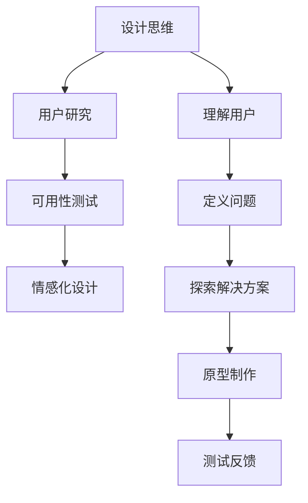

                 

# 技术创业的用户体验设计：从技术到情感连接

> 关键词：用户体验设计、技术创业、情感连接、设计思维、用户研究、可用性测试

> 摘要：本文深入探讨了技术创业中的用户体验设计，从技术视角和情感连接出发，分析了设计思维在创业项目中的重要性。通过用户研究、可用性测试、情感化设计等步骤，提出了构建高质量用户体验的有效方法，以实现技术创业项目的成功。

## 1. 背景介绍

技术创业已经成为现代社会经济发展的重要驱动力。随着科技的不断进步和创业环境的日益成熟，越来越多的创业者投身于技术创新和商业模式的探索。然而，成功的创业项目不仅仅依赖于技术创新，用户体验设计同样扮演着至关重要的角色。用户体验设计不仅仅关注产品的功能和性能，更注重用户在产品使用过程中的情感体验和满意度。

用户体验设计的目标是打造具有吸引力和竞争力的产品，以赢得用户的青睐和市场的认可。在技术创业的背景下，用户体验设计需要结合具体的技术特点和用户需求，从设计思维、用户研究、可用性测试等多个方面进行深入分析和实践。

本文将从技术创业的角度出发，探讨用户体验设计的核心概念、方法和实践，以帮助创业者更好地理解和应用用户体验设计，实现产品的情感连接和市场成功。

## 2. 核心概念与联系

### 2.1 设计思维

设计思维（Design Thinking）是一种以用户为中心的创新方法，强调在解决问题的过程中，始终关注用户的需求和体验。设计思维的核心步骤包括：理解用户、定义问题、探索解决方案、原型制作和测试反馈。设计思维不仅适用于产品设计，也广泛应用于各个领域，包括技术创业。

### 2.2 用户研究

用户研究（User Research）是用户体验设计的基础，旨在深入了解用户的需求、行为和痛点。通过用户访谈、问卷调查、用户测试等方法，收集用户反馈和数据，为设计提供可靠依据。用户研究能够帮助创业者更好地理解目标用户，指导产品的设计和优化。

### 2.3 可用性测试

可用性测试（Usability Testing）是一种评估产品易用性的方法，通过让真实用户使用产品并收集反馈，发现产品的 usability 问题。可用性测试能够帮助创业者识别和解决用户在使用产品过程中遇到的问题，提高产品的可用性和用户满意度。

### 2.4 情感化设计

情感化设计（Emotional Design）关注产品的情感影响，旨在通过设计触达用户的情感层面，建立情感连接。情感化设计包括情感识别、情感传递和情感反馈三个层次，通过设计元素、交互方式和品牌理念等手段，提升用户对产品的情感体验。

### 2.5 Mermaid 流程图



## 3. 核心算法原理 & 具体操作步骤

### 3.1 用户研究

用户研究的核心是理解用户需求和行为，具体操作步骤如下：

1. **确定研究目标**：明确用户研究的具体目标，如了解用户需求、评估产品性能等。

2. **选择研究方法**：根据研究目标选择合适的研究方法，如用户访谈、问卷调查、用户测试等。

3. **制定研究计划**：规划研究的时间、地点、参与人员和研究工具。

4. **收集数据**：执行研究计划，收集用户反馈和数据。

5. **分析数据**：对收集到的数据进行分析，提炼用户需求和痛点。

6. **输出报告**：撰写用户研究报告，为产品设计提供依据。

### 3.2 可用性测试

可用性测试的核心是评估产品的易用性，具体操作步骤如下：

1. **确定测试目标**：明确可用性测试的具体目标，如评估产品界面、交互流程等。

2. **设计测试任务**：制定测试任务，模拟用户使用产品的过程。

3. **选择测试参与者**：根据目标用户群体选择合适的测试参与者。

4. **执行测试**：让测试参与者完成测试任务，并记录他们的操作和反馈。

5. **分析结果**：分析测试数据，识别产品的 usability 问题。

6. **优化设计**：根据测试结果优化产品设计和交互流程。

### 3.3 情感化设计

情感化设计的核心是建立用户与产品之间的情感连接，具体操作步骤如下：

1. **识别情感需求**：分析用户情感需求，了解用户在产品使用过程中的情感体验。

2. **设计情感元素**：根据情感需求设计情感元素，如图标、色彩、字体等。

3. **传递情感信息**：通过情感元素传递情感信息，让用户感受到产品的情感价值。

4. **收集情感反馈**：收集用户对情感元素的情感反馈，优化设计。

5. **建立情感连接**：通过持续优化和迭代，建立用户与产品之间的情感连接。

## 4. 数学模型和公式 & 详细讲解 & 举例说明

### 4.1 用户满意度模型

用户满意度（User Satisfaction）是衡量用户体验的重要指标，可以采用以下数学模型进行计算：

$$
User\ Satisfaction = \frac{Quality}{Expectation}
$$

其中，Quality 表示用户对产品的感知质量，Expectation 表示用户的期望质量。当用户感知质量高于期望质量时，用户满意度较高；反之，用户满意度较低。

### 4.2 可用性测试结果分析

可用性测试结果可以通过以下数学模型进行分析：

$$
Usability\ Score = \frac{Total\ Tasks\ Completed}{Total\ Tasks\ Attempted}
$$

其中，Total Tasks Completed 表示成功完成的任务数，Total Tasks Attempted 表示尝试的总任务数。Usability Score 的取值范围在 0 到 1 之间，值越高表示产品的易用性越好。

### 4.3 情感化设计效果评估

情感化设计效果可以通过以下数学模型进行评估：

$$
Emotional\ Impact = \frac{Positive\ Feedback}{Total\ Feedback}
$$

其中，Positive Feedback 表示积极的情感反馈，Total Feedback 表示总的反馈数。Emotional Impact 的取值范围在 0 到 1 之间，值越高表示情感化设计的效果越好。

### 4.4 举例说明

假设某技术创业项目进行用户研究，收集到以下数据：

- 用户感知质量：8
- 用户期望质量：6

根据用户满意度模型，用户满意度为：

$$
User\ Satisfaction = \frac{8}{6} = 1.33
$$

假设某技术创业项目进行可用性测试，收集到以下数据：

- 成功完成的任务数：10
- 尝试的总任务数：15

根据可用性测试结果分析，可用性得分为：

$$
Usability\ Score = \frac{10}{15} = 0.67
$$

假设某技术创业项目进行情感化设计效果评估，收集到以下数据：

- 积极的情感反馈：25
- 总的反馈数：50

根据情感化设计效果评估，情感化设计效果为：

$$
Emotional\ Impact = \frac{25}{50} = 0.5
$$

## 5. 项目实战：代码实际案例和详细解释说明

### 5.1 开发环境搭建

为了更好地进行用户体验设计，我们需要搭建一个适合开发和测试的技术环境。以下是搭建开发环境的步骤：

1. 安装操作系统：选择适合的开发操作系统，如 Windows、macOS 或 Linux。
2. 安装开发工具：安装常用的开发工具，如 Visual Studio、Xcode 或 Eclipse。
3. 安装数据库：选择合适的数据库系统，如 MySQL、PostgreSQL 或 MongoDB。
4. 安装前端框架：安装前端框架，如 React、Vue.js 或 Angular。
5. 安装后端框架：安装后端框架，如 Spring Boot、Django 或 Flask。

### 5.2 源代码详细实现和代码解读

以下是一个简单的用户研究工具的源代码实现，用于收集用户反馈和数据分析。代码采用 Python 编写，主要功能包括用户注册、登录、提交反馈和数据分析。

```python
# 用户注册
def register(username, password):
    # 存储用户信息
    users[username] = password
    print("注册成功！")

# 用户登录
def login(username, password):
    if username in users and users[username] == password:
        print("登录成功！")
    else:
        print("登录失败，用户名或密码错误。")

# 用户提交反馈
def submit_feedback(username, feedback):
    # 记录用户反馈
    feedbacks[username].append(feedback)
    print("反馈提交成功！")

# 数据分析
def analyze_feedback():
    # 统计用户反馈
    positive_feedbacks = 0
    negative_feedbacks = 0
    for feedback in feedbacks.values():
        if "正面" in feedback:
            positive_feedbacks += 1
        elif "负面" in feedback:
            negative_feedbacks += 1
    print(f"正面反馈：{positive_feedbacks}，负面反馈：{negative_feedbacks}。")

# 主函数
def main():
    global users, feedbacks
    users = {}
    feedbacks = {}
    
    while True:
        print("1. 用户注册 2. 用户登录 3. 用户提交反馈 4. 数据分析 5. 退出")
        choice = input("请选择操作：")
        if choice == "1":
            username = input("请输入用户名：")
            password = input("请输入密码：")
            register(username, password)
        elif choice == "2":
            username = input("请输入用户名：")
            password = input("请输入密码：")
            login(username, password)
        elif choice == "3":
            if not login(username, password):
                continue
            feedback = input("请输入反馈：")
            submit_feedback(username, feedback)
        elif choice == "4":
            if not login(username, password):
                continue
            analyze_feedback()
        elif choice == "5":
            break

# 执行主函数
if __name__ == "__main__":
    main()
```

### 5.3 代码解读与分析

以上代码实现了一个简单的用户研究工具，主要包括用户注册、登录、提交反馈和数据分析等功能。以下是代码的主要解读与分析：

1. **用户注册**：`register` 函数用于用户注册，接收用户名和密码作为参数，将用户信息存储在字典 `users` 中。

2. **用户登录**：`login` 函数用于用户登录，接收用户名和密码作为参数，检查用户信息是否匹配。如果匹配，返回登录成功；否则，返回登录失败。

3. **用户提交反馈**：`submit_feedback` 函数用于用户提交反馈，接收用户名和反馈作为参数，将反馈信息存储在字典 `feedbacks` 中。

4. **数据分析**：`analyze_feedback` 函数用于数据分析，统计用户反馈中的正面和负面反馈，并输出结果。

5. **主函数**：`main` 函数作为程序的主入口，提供用户操作界面，根据用户选择调用相应函数进行操作。

通过以上代码实现，我们可以实现用户注册、登录、提交反馈和数据分析等功能，为技术创业项目提供用户研究的基础工具。

## 6. 实际应用场景

技术创业中的用户体验设计在实际应用中有着广泛的应用场景。以下是一些典型的实际应用场景：

### 6.1 在线教育平台

在线教育平台需要关注学生的学习体验和教学效果。通过用户研究，了解学生的学习需求和痛点，优化课程设计、教学交互和用户界面，提高学生的学习满意度和学习效果。

### 6.2 医疗保健应用

医疗保健应用需要关注患者的使用体验和健康数据管理。通过用户研究，了解患者的需求和痛点，优化健康数据管理、医疗咨询和健康管理等功能，提高患者的满意度和健康水平。

### 6.3 智能家居系统

智能家居系统需要关注用户的生活体验和家庭智能化水平。通过用户研究，了解用户的需求和痛点，优化智能设备互联、智能家居控制和管理等功能，提高用户的家庭智能化体验和生活品质。

### 6.4 电商应用

电商应用需要关注用户的购物体验和购物满意度。通过用户研究，了解用户的购物需求和购物行为，优化商品推荐、购物流程和售后服务等功能，提高用户的购物满意度和复购率。

## 7. 工具和资源推荐

### 7.1 学习资源推荐

1. **《设计思维》**：作者：David Kelly
2. **《用户体验要素》**：作者：Jesse James Garrett
3. **《用户研究实战》**：作者：Jeffrey Zeldman

### 7.2 开发工具框架推荐

1. **React**：前端框架，用于构建用户界面。
2. **Vue.js**：前端框架，用于构建用户界面。
3. **Spring Boot**：后端框架，用于构建 Web 应用程序。

### 7.3 相关论文著作推荐

1. **《用户体验设计原理》**：论文，作者：Don Norman
2. **《情感化设计》**：论文，作者：Donald A. Norman
3. **《用户研究方法论》**：论文，作者：Alan Dix

## 8. 总结：未来发展趋势与挑战

技术创业中的用户体验设计在未来将继续发展，面临着以下趋势和挑战：

### 8.1 个性化体验

随着人工智能和大数据技术的发展，个性化体验将成为用户体验设计的重要趋势。通过收集和分析用户数据，为用户提供个性化的产品和服务，提高用户的满意度和忠诚度。

### 8.2 情感连接

情感化设计将成为用户体验设计的核心。通过情感元素和交互设计，建立用户与产品之间的情感连接，提升用户的情感体验和品牌忠诚度。

### 8.3 多平台融合

随着移动互联网和物联网的快速发展，多平台融合将成为用户体验设计的重要方向。设计师需要关注不同平台和设备上的用户体验一致性，提供无缝的用户体验。

### 8.4 数据隐私和安全

数据隐私和安全将成为用户体验设计的重要挑战。设计师需要关注用户数据的保护，确保用户隐私和安全，建立用户对产品的信任。

## 9. 附录：常见问题与解答

### 9.1 用户体验设计是什么？

用户体验设计（UX Design）是一种以用户为中心的设计方法，旨在创建产品和服务，使人们在使用过程中感到满意和愉悦。它涉及对用户需求、行为和心理的深入了解，以及将这一理解转化为具有吸引力和易用的产品设计和交互。

### 9.2 用户体验设计与用户界面设计有什么区别？

用户体验设计（UX Design）关注的是用户在整个使用过程中与产品的互动，包括但不限于界面设计。而用户界面设计（UI Design）则更专注于产品的视觉元素和布局，包括颜色、字体、图标和布局等。用户体验设计更广泛，涉及研究、策略、交互设计和用户测试等多个方面。

### 9.3 设计思维在用户体验设计中的作用是什么？

设计思维是一种解决问题的方法论，强调用户需求和创造力。它在用户体验设计中的作用包括：帮助设计师更好地理解用户需求，鼓励创新思维，指导设计方向，以及通过迭代和测试不断改进产品。

## 10. 扩展阅读 & 参考资料

1. **《设计思维》**：David Kelly
2. **《用户体验要素》**：Jesse James Garrett
3. **《用户研究实战》**：Jeffrey Zeldman
4. **《情感化设计》**：Donald A. Norman
5. **《用户体验设计原理》**：Don Norman
6. **《用户研究方法论》**：Alan Dix
7. **《React 实战》**：Dan Abramov
8. **《Vue.js 实战》**：Evan You
9. **《Spring Boot 实战》**：Phil Stork

> 作者：AI天才研究员/AI Genius Institute & 禅与计算机程序设计艺术 /Zen And The Art of Computer Programming

