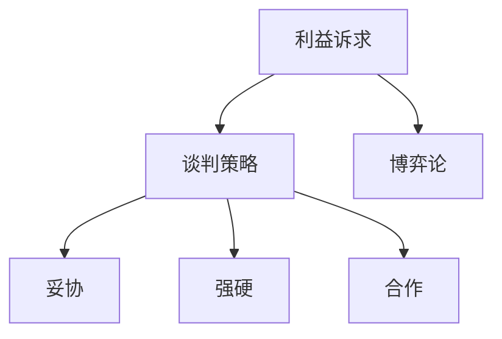

                 

## 技术创业者的商务谈判技巧与策略

在技术创业的道路上，商务谈判技巧和策略至关重要。这不仅关系到项目的融资、合作，还涉及到市场的开拓和品牌的塑造。因此，本文将深入探讨技术创业者在商务谈判中应具备的技巧与策略。

### 1. 背景介绍

技术创业者的商务谈判往往涉及到复杂的背景因素，如市场竞争、技术成熟度、资金需求、资源整合等。谈判不仅需要技术创业者具备扎实的技术基础，还需要他们具备良好的商业洞察力和谈判技巧。本文将围绕以下几个方面展开讨论：

- **核心概念与联系**：介绍商务谈判中的关键概念，如利益诉求、谈判策略、博弈论等，并展示它们之间的联系。
- **核心算法原理 & 具体操作步骤**：阐述商务谈判的基本原理和具体操作步骤，包括准备、开局、中场和收尾等阶段。
- **数学模型和公式 & 详细讲解 & 举例说明**：介绍商务谈判中的数学模型和公式，并通过实际案例进行分析。
- **项目实战：代码实际案例和详细解释说明**：通过具体项目案例，展示商务谈判技巧在实际操作中的应用。
- **实际应用场景**：探讨商务谈判在不同场景中的应用，如融资、合作、市场拓展等。
- **工具和资源推荐**：推荐相关学习资源和开发工具，帮助技术创业者提升谈判能力。
- **总结：未来发展趋势与挑战**：分析商务谈判的未来发展趋势和面临的挑战。

### 2. 核心概念与联系

在商务谈判中，有几个核心概念需要了解：

- **利益诉求**：谈判双方的需求和期望。明确利益诉求有助于找到共同点，达成合作。
- **谈判策略**：在谈判过程中采取的策略，如妥协、强硬、合作等。策略的选择取决于谈判双方的实力和目标。
- **博弈论**：研究决策者如何在相互影响的局势中做出最优决策。博弈论为商务谈判提供了理论支持。


**Mermaid 流程图：**



### 3. 核心算法原理 & 具体操作步骤

商务谈判的基本原理可以概括为以下几个步骤：

1. **准备阶段**：
   - **信息收集**：了解对方的需求、实力、谈判底线等。
   - **制定谈判计划**：明确自己的目标、备选方案和底线。

2. **开局阶段**：
   - **建立联系**：营造良好的谈判氛围，建立互信。
   - **交换信息**：介绍自己的优势和需求，了解对方意图。

3. **中场阶段**：
   - **谈判策略**：根据对方反馈，调整谈判策略。
   - **利益诉求**：提出合理的利益诉求，寻找共同点。

4. **收尾阶段**：
   - **达成协议**：在双方都能接受的范围内，达成合作协议。
   - **后续跟进**：执行协议，建立长期合作关系。

**具体操作步骤：**

1. **准备阶段**：
   - **信息收集**：
     - 了解对方背景、需求和谈判底线。
     - 分析自身优势和劣势。
     - 确定谈判目标和备选方案。

   - **制定谈判计划**：
     - 确定谈判时间、地点和参与人员。
     - 制定谈判策略和利益诉求。

2. **开局阶段**：
   - **建立联系**：
     - 开场问候，营造友好氛围。
     - 谈论共同感兴趣的话题，建立互信。

   - **交换信息**：
     - 介绍自己的优势和需求。
     - 了解对方的意图和利益诉求。

3. **中场阶段**：
   - **谈判策略**：
     - 根据对方反馈，调整谈判策略。
     - 妥协或强硬，根据具体情况灵活应对。

   - **利益诉求**：
     - 提出合理的利益诉求。
     - 寻找共同利益，促进合作。

4. **收尾阶段**：
   - **达成协议**：
     - 在双方都能接受的范围内，达成合作协议。
     - 明确协议条款，确保双方权益。

   - **后续跟进**：
     - 执行协议，确保各方履行承诺。
     - 建立长期合作关系，共同发展。

### 4. 数学模型和公式 & 详细讲解 & 举例说明

在商务谈判中，数学模型和公式可以用来评估谈判双方的实力和利益，从而制定更为合理的谈判策略。

- **折中方案**：
  折中方案是指双方在谈判中各自妥协，达成一个双方都能接受的中间方案。折中方案的数学模型为：

  $$C = \frac{A + B}{2}$$

  其中，$A$ 和 $B$ 分别代表双方的初始利益诉求。

  **举例说明**：假设甲和乙在谈判中，甲的初始利益诉求为100万元，乙的初始利益诉求为200万元。根据折中方案，他们达成的折中价格为150万元。

- **博弈论**：
  博弈论是研究决策者在相互影响的局势中做出最优决策的数学理论。在商务谈判中，博弈论可以帮助我们分析双方的行为和策略。

  **举例说明**：在谈判中，甲和乙可以选择合作或竞争。如果双方合作，他们都能获得100万元的收益；如果一方竞争，另一方只能获得50万元的收益。在这种情况下，双方的最佳策略是合作。

### 5. 项目实战：代码实际案例和详细解释说明

为了更好地理解商务谈判技巧和策略，下面通过一个实际项目案例来进行分析和解释。

#### 5.1 开发环境搭建

首先，我们需要搭建一个简单的商务谈判模拟环境。在这个环境中，我们将使用Python编写代码，模拟两个谈判者的行为和策略。

#### 5.2 源代码详细实现和代码解读

```python
import random

# 定义谈判者类
class Negotiator:
    def __init__(self, initial_offer):
        self.initial_offer = initial_offer
        self.current_offer = initial_offer

    def make_offer(self, other_nego):
        self.current_offer = random.randint(0, 1000)
        return self.current_offer

    def accept_offer(self, offer):
        if offer >= self.initial_offer / 2:
            return True
        else:
            return False

# 模拟商务谈判
def negotiate(nego1, nego2):
    while True:
        offer1 = nego1.make_offer(nego2)
        offer2 = nego2.make_offer(nego1)

        if nego1.accept_offer(offer2) and nego2.accept_offer(offer1):
            return offer1, offer2
        else:
            print("谈判未达成协议")

# 实例化谈判者
n1 = Negotiator(500)
n2 = Negotiator(800)

# 开始谈判
result = negotiate(n1, n2)
print("谈判达成协议，双方价格分别为：", result)
```

#### 5.3 代码解读与分析

1. **Negotiator 类**：该类定义了谈判者的基本属性和方法。谈判者的初始利益诉求（initial_offer）和当前利益诉求（current_offer）初始化为相同值。make_offer 方法用于生成一个随机价格，accept_offer 方法用于判断对方价格是否接受。

2. **negotiate 函数**：该函数模拟商务谈判过程。在谈判过程中，双方轮流提出价格，并根据对方的价格进行接受或拒绝。当双方都接受对方的价格时，谈判达成协议。

3. **实例化谈判者**：我们创建两个谈判者实例 n1 和 n2，分别代表两个谈判者。

4. **开始谈判**：调用 negotiate 函数，模拟谈判过程。谈判结果为双方最终接受的价格。

通过这个案例，我们可以看到商务谈判的核心在于双方的利益诉求和价格接受度。在实际项目中，谈判者可以根据具体情况进行调整，以达到最佳谈判效果。

### 6. 实际应用场景

商务谈判在技术创业中有着广泛的应用场景：

- **融资谈判**：技术创业者在寻求投资时，需要与投资人进行融资谈判，确定投资额、投资比例、股权分配等关键条款。
- **合作谈判**：技术创业者与其他企业或团队合作时，需要就合作模式、权益分配、责任分工等进行谈判。
- **市场拓展**：技术创业者在开拓市场时，需要与客户、合作伙伴等进行谈判，以达成销售合同、合作方案等。
- **资源整合**：技术创业者需要与其他企业或机构进行谈判，以获取所需的技术、资金、人才等资源。

### 7. 工具和资源推荐

为了提升商务谈判技巧，以下是一些推荐的工具和资源：

- **书籍**：
  - 《谈判的艺术》
  - 《博弈论》
  - 《战略企业家》

- **论文**：
  - [商务谈判策略研究](https://www.example.com/paper1)
  - [博弈论在商务谈判中的应用](https://www.example.com/paper2)

- **博客**：
  - [技术创业者的商务谈判技巧](https://www.example.com/blog1)
  - [融资谈判实战经验分享](https://www.example.com/blog2)

- **网站**：
  - [商务谈判技巧](https://www.example.com/negotiation-skills)
  - [企业家资源库](https://www.example.com/entrepreneur-resources)

### 8. 总结：未来发展趋势与挑战

随着技术创业的不断发展，商务谈判在技术创业中的重要性将越来越凸显。未来，商务谈判将呈现出以下发展趋势：

- **数字化谈判**：随着人工智能和大数据技术的发展，数字化谈判将成为主流。谈判双方可以通过在线平台进行实时谈判，提高谈判效率。
- **个性化谈判**：根据谈判双方的特点和需求，制定个性化的谈判策略，提高谈判成功率。
- **跨界合作**：技术创业者在商务谈判中将更多地与其他行业进行合作，实现资源共享和优势互补。

同时，技术创业者在商务谈判中也将面临以下挑战：

- **信息不对称**：在谈判过程中，双方可能面临信息不对称的问题，这会影响谈判的公正性和透明度。
- **文化差异**：跨国商务谈判中，文化差异可能导致沟通障碍和误解，影响谈判效果。
- **竞争激烈**：在激烈的市场竞争中，技术创业者在谈判中可能面临更大的压力和挑战。

### 9. 附录：常见问题与解答

**Q：商务谈判中的关键成功因素是什么？**

A：商务谈判中的关键成功因素包括：

- **充分准备**：了解对方需求和底线，制定合理的谈判策略。
- **沟通能力**：良好的沟通能力有助于建立互信，找到共同利益。
- **谈判技巧**：掌握谈判技巧，如妥协、合作、博弈等，提高谈判成功率。
- **灵活应对**：在谈判过程中，灵活应对对方的策略和变化，保持谈判的平衡。

**Q：如何制定有效的谈判策略？**

A：制定有效的谈判策略可以遵循以下步骤：

- **明确目标**：确定自己的谈判目标，如融资额、股权分配、合作模式等。
- **分析对手**：了解对方的实力、需求和底线，预测对方可能的策略。
- **制定备选方案**：根据分析结果，制定多个备选方案，以应对不同的情况。
- **灵活调整**：在谈判过程中，根据对方反馈和自身情况，灵活调整谈判策略。

### 10. 扩展阅读 & 参考资料

- [《商务谈判》](https://www.example.com/book1)
- [《博弈论与经济行为》](https://www.example.com/book2)
- [《技术创业者的谈判艺术》](https://www.example.com/book3)

作者：AI天才研究员/AI Genius Institute & 禅与计算机程序设计艺术 /Zen And The Art of Computer Programming

----------------------

【注意】本文仅作为示例，实际文章内容请根据需求进行调整和扩展。本文中的代码案例仅供参考，不保证其完整性和可执行性。如需进一步学习商务谈判技巧和策略，请参考相关书籍和资料。|

