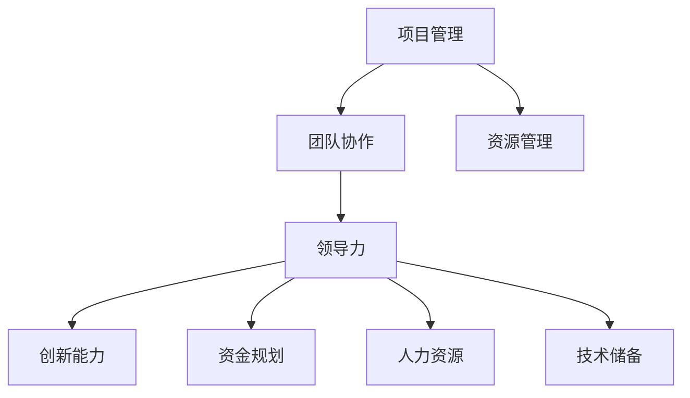

                 

### 背景介绍

在当今高速发展的信息技术时代，技术创业者的角色变得愈发重要。他们不仅需要具备深厚的专业技术背景，还需要掌握卓越的领导力和管理技能。本文旨在探讨技术创业者的领导力培养与管理技能提升，以帮助创业者在竞争激烈的市场中脱颖而出。

技术创业者的领导力培养与管理技能提升不仅关系到企业的生存和发展，还直接影响到团队成员的工作效率和创新能力。随着互联网、大数据、人工智能等新兴技术的广泛应用，技术创业者的任务变得更加复杂和多样化。他们不仅需要具备丰富的技术知识，还需要具备强大的团队领导能力和灵活的管理策略。

在本文中，我们将深入探讨以下核心问题：

1. **技术创业者的定义和角色**：介绍技术创业者的基本概念和他们在企业中的角色。
2. **领导力的核心要素**：分析领导力的关键要素，包括沟通能力、决策能力、团队建设等。
3. **管理技能的提升**：探讨如何通过项目管理、团队协作和人才管理来提升管理技能。
4. **实际案例分析**：通过具体案例，分析成功的技术创业者在领导力和管理方面的实践。
5. **未来发展趋势**：探讨技术创业领域的发展趋势，以及面临的挑战和机遇。

通过对这些问题的深入探讨，我们希望为技术创业者提供有价值的指导，帮助他们更好地应对挑战，实现企业的长远发展。

## 1.1 技术创业者的定义

技术创业者，通常指的是那些利用先进技术（如人工智能、大数据、区块链等）进行创业的个体或团队。他们不仅需要具备深厚的技术背景，还需要有强烈的创新意识和市场洞察力。技术创业者通常是从技术开发人员、科研人员或者技术顾问等角色转变而来，他们通过技术创新来创造新的产品或服务，并在此基础上建立企业。

技术创业者的角色在企业中具有独特的地位和作用。首先，他们通常是企业的核心研发力量，负责推动技术创新和产品开发。其次，他们需要具备战略规划能力，能够把握市场趋势，制定企业的发展方向。此外，技术创业者还需要具备强大的沟通和协调能力，以便有效地与团队成员、投资者和客户进行沟通。

技术创业者在企业中的角色包括但不限于以下几个方面：

1. **技术研发与创新**：技术创业者是企业的技术核心，他们负责引领技术方向，推动技术创新和产品迭代。
2. **战略规划与决策**：技术创业者需要从技术角度出发，制定企业的发展策略，并做出关键决策。
3. **团队领导与建设**：技术创业者需要组建和管理一支高效的团队，激发团队成员的创造力和工作热情。
4. **市场拓展与客户关系**：技术创业者需要了解市场需求，拓展业务，并与客户建立良好的合作关系。
5. **资源整合与投资管理**：技术创业者需要有效利用各种资源，包括资金、技术、人才等，以支持企业的发展。

总之，技术创业者在企业中扮演着多重角色，他们既是技术创新的推动者，也是企业发展的战略家和管理者。他们的成功与否直接关系到企业的成败。因此，技术创业者需要不断提升自身的领导力和管理技能，以应对不断变化的市场环境和技术挑战。

## 1.2 领导力的重要性

在技术创业的旅程中，领导力是一个不可忽视的关键因素。它不仅决定了企业能否在激烈的市场竞争中站稳脚跟，还影响着团队成员的凝聚力和工作效率。领导力是一种复杂而多维的能力，它涵盖了沟通、决策、团队建设等多个方面。下面，我们将详细探讨领导力的核心要素，以帮助技术创业者更好地理解和培养这些关键能力。

### 沟通能力

沟通能力是领导力的基础，也是技术创业者不可或缺的一项技能。有效的沟通不仅能确保信息的准确传达，还能促进团队成员之间的理解与合作。技术创业者需要具备以下几方面的沟通能力：

1. **清晰表达**：能够用简洁、明了的语言描述复杂的技术概念，使团队成员能够快速理解和跟进。
2. **倾听与反馈**：倾听团队成员的意见和建议，并给予及时的反馈，以促进团队协作和解决问题。
3. **非语言沟通**：通过肢体语言、面部表情等非语言手段，增强沟通的效果和说服力。

### 决策能力

在技术创业过程中，技术创业者需要做出大量的决策，包括产品方向、技术选择、资源配置等。决策能力决定了企业能否快速响应市场变化，抓住发展机遇。以下是一些提升决策能力的建议：

1. **信息收集与分析**：在做出决策前，广泛收集相关信息，并进行深入分析，以减少决策的盲目性。
2. **风险评估与应对**：对潜在的风险进行评估，并制定相应的应对策略，以降低决策的风险。
3. **果断与灵活性**：在面临决策时，既要果断行动，也要具备灵活性，以便在情况变化时迅速调整策略。

### 团队建设

团队建设是领导力的核心要素之一，技术创业者需要通过有效的团队建设，激发团队成员的潜力，提高团队的整体效率。以下是一些关键的团队建设策略：

1. **明确目标和责任**：为团队成员设定清晰的目标和责任，确保每个人都了解自己的角色和任务。
2. **培养团队文化**：建立积极向上的团队文化，鼓励创新和协作，增强团队的凝聚力。
3. **提供培训与支持**：为团队成员提供必要的培训和发展机会，帮助他们不断提升技能和素质。

### 激励与激励

技术创业者需要具备强大的激励能力，以激发团队成员的积极性和创造力。以下是一些有效的激励策略：

1. **认可与奖励**：对团队成员的贡献给予及时的认可和奖励，增强他们的成就感和归属感。
2. **共同目标**：与团队成员共同设定具有挑战性的目标，并共同为实现这些目标而努力。
3. **职业发展**：关注团队成员的职业发展，提供晋升和发展机会，激发他们的长期投入。

通过提升沟通、决策和团队建设等领导力要素，技术创业者能够更好地应对创业过程中的各种挑战，提高团队的工作效率和企业竞争力。领导力不仅是技术创业者的必备能力，也是他们在激烈的市场竞争中脱颖而出的关键。

### 1.3 管理技能的提升

在技术创业的过程中，管理技能的提升是确保企业顺利发展的重要环节。管理技能包括项目规划、团队协作和人才管理等多个方面。以下将详细探讨如何通过这些方面的实践来提升管理技能。

#### 项目规划

项目规划是项目管理的第一步，它为项目的成功奠定基础。有效的项目规划需要技术创业者从以下几个方面入手：

1. **明确项目目标**：技术创业者需要明确项目的目标和预期成果，确保团队成员对项目的目标有清晰的认识。
2. **制定详细计划**：制定详细的项目计划，包括时间表、任务分配、资源需求等，确保项目按计划推进。
3. **风险管理**：对项目可能面临的风险进行识别和评估，并制定相应的应对措施，降低项目风险。

#### 团队协作

团队协作是实现项目目标的关键，技术创业者需要通过以下措施来提升团队协作能力：

1. **建立沟通机制**：建立高效的沟通机制，确保团队成员能够及时交流信息，分享知识，解决问题。
2. **分工与协作**：合理分配任务，确保每个成员都能发挥自己的专长，同时鼓励成员之间的合作与协作。
3. **团队建设**：定期组织团队活动，增强团队成员之间的信任和凝聚力，提高团队的整体效率。

#### 人才管理

人才是技术创业企业的核心资源，技术创业者需要通过以下方法来管理人才：

1. **招聘与选拔**：通过科学的招聘流程，选拔具备专业技能和潜力的人才，确保团队的整体素质。
2. **培训与发展**：为团队成员提供培训和发展机会，帮助他们不断提升技能和职业素养，提高团队的整体能力。
3. **激励与留才**：建立有效的激励机制，包括薪酬、晋升、奖励等，激励团队成员的积极性和创造力，确保人才的稳定和持续发展。

#### 实践方法

为了提升管理技能，技术创业者可以采取以下实践方法：

1. **项目复盘**：在项目完成后进行复盘，总结经验教训，发现问题并进行改进，以提升项目管理能力。
2. **学习先进的管理理念和方法**：通过阅读管理书籍、参加管理培训、学习先进的管理理念和方法，不断提升自己的管理水平。
3. **借鉴成功案例**：分析成功的技术创业企业的管理实践，从中汲取经验，结合自身实际情况进行应用。

通过上述措施，技术创业者可以不断提升自己的管理技能，更好地应对技术创业过程中的各种挑战，确保企业的长期稳定发展。

## 2. 核心概念与联系

在技术创业者的领导力培养与管理技能提升过程中，理解并掌握以下几个核心概念及其相互联系至关重要。以下是这些概念的定义、原理及其在技术创业中的应用。

### 2.1 项目管理

项目管理是确保项目按时、按预算和按质量完成的关键过程。它包括计划、执行、监控和收尾等环节。项目管理在技术创业中的重要性体现在以下几个方面：

1. **明确目标和期望**：项目管理帮助技术创业者明确项目的目标和期望，确保团队成员对项目有清晰的认识。
2. **合理分配资源**：通过项目管理，技术创业者可以合理分配人力、资金和技术资源，确保项目顺利推进。
3. **风险控制**：项目管理包括识别、评估和控制项目风险，帮助技术创业者提前预防和应对潜在问题。

### 2.2 团队协作

团队协作是技术创业成功的基石。它涉及团队成员之间的沟通、协调和合作。团队协作的关键要素包括：

1. **沟通**：有效沟通是团队协作的基础，确保信息在团队内部顺畅传递。
2. **共享目标**：团队成员需要共享共同的目标，以便形成合力，推动项目进展。
3. **分工明确**：合理分工，确保每个团队成员都能在自己的专长领域发挥最大作用。

### 2.3 领导力

领导力是技术创业者的重要素质，它决定了团队成员的凝聚力和工作效率。领导力的关键要素包括：

1. **决策能力**：技术创业者需要具备迅速而明智的决策能力，以应对复杂多变的市场环境。
2. **沟通能力**：有效的沟通能力有助于技术创业者与团队成员、投资者和客户建立良好的关系。
3. **激励能力**：通过激励机制，技术创业者可以激发团队成员的积极性和创造力。

### 2.4 创新能力

创新能力是技术创业的核心竞争力。它包括对新技术的探索、应用和创新。创新能力的关键要素包括：

1. **技术洞察力**：技术创业者需要具备敏锐的技术洞察力，捕捉市场和技术的发展趋势。
2. **实验精神**：鼓励团队成员进行技术实验和试错，以推动技术创新。
3. **跨界思维**：通过跨界思维，将不同领域的知识和技术融合，创造新的解决方案。

### 2.5 资源管理

资源管理是确保技术创业企业可持续发展的重要环节。它包括资金、人力和技术资源的管理。资源管理的关键要素包括：

1. **资金规划**：合理规划和使用资金，确保项目的资金需求得到满足。
2. **人力资源**：通过招聘、培训和激励等手段，提升团队的整体素质和能力。
3. **技术储备**：建立技术储备，为企业的长期发展提供技术支持。

### 2.6 核心概念联系

这些核心概念之间存在着紧密的联系，共同构成了技术创业者的领导力培养和管理技能提升的基础。

1. **项目管理与团队协作**：项目管理为团队协作提供了框架和保障，而团队协作则是项目成功的关键。
2. **领导力与创新能力**：领导力激发了团队成员的创新能力，而创新能力又增强了企业的竞争力。
3. **资源管理与项目规划**：资源管理为项目规划提供了资源保障，而项目规划则确保了资源的合理使用。

### 2.7 Mermaid 流程图

以下是一个简化的Mermaid流程图，展示了这些核心概念之间的联系。



通过理解这些核心概念及其相互联系，技术创业者可以更系统地提升自己的领导力和管理技能，从而在技术创业的道路上取得成功。

### 3. 核心算法原理与具体操作步骤

在技术创业过程中，掌握并运用核心算法原理是提升效率和解决问题的重要手段。以下将介绍几种常见且重要的核心算法原理，以及它们在技术创业中的应用步骤。

#### 3.1 数据分析算法

数据分析算法是技术创业过程中必不可少的一部分，主要用于处理和解释大量数据。以下是一个常见的数据分析算法——K-means聚类算法的具体操作步骤：

1. **初始化**：选择k个数据点作为初始聚类中心。
2. **分配点**：计算每个数据点到各个聚类中心的距离，并将每个数据点分配到最近的聚类中心。
3. **更新中心**：计算每个聚类的新中心点，即其内所有数据点的平均值。
4. **迭代**：重复步骤2和3，直到聚类中心不再发生变化或达到预设的迭代次数。

在技术创业中，K-means算法可以用于市场细分、用户行为分析等，帮助企业更好地理解用户和市场。

#### 3.2 机器学习算法

机器学习算法是提升自动化和预测能力的关键技术。以下是一种常见的机器学习算法——决策树的具体操作步骤：

1. **数据准备**：收集和清洗数据，确保数据的准确性和完整性。
2. **特征选择**：选择对目标变量有显著影响的特征。
3. **构建树**：选择一个特征作为分割点，将数据集分为两个子集，递归地重复这个过程，直到满足停止条件（如最大深度、最小样本量等）。
4. **剪枝**：对过拟合的树进行剪枝，提高模型的泛化能力。
5. **评估**：使用交叉验证等方法评估模型的性能。

在技术创业中，决策树算法可以用于分类、回归等多种任务，帮助企业做出更准确的业务决策。

#### 3.3 图算法

图算法在处理复杂关系和网络问题时非常有用。以下是一种常见的图算法——Dijkstra算法的具体操作步骤：

1. **初始化**：设置一个优先队列，用于存储未访问节点及其到起点的最短路径估计值。
2. **选择起点**：选择优先队列中估计值最小的节点作为当前节点。
3. **更新估计值**：对于当前节点的每个邻接节点，计算从起点到该节点的最短路径估计值，并将其更新到优先队列中。
4. **重复步骤2和3**，直到所有节点都被访问。

在技术创业中，Dijkstra算法可以用于网络路由、社交网络分析等，帮助技术创业者更好地理解和管理复杂的网络结构。

#### 3.4 算法应用示例

假设一个技术创业公司希望通过数据分析来预测用户流失率，以下是一个简单的算法应用示例：

1. **数据准备**：收集用户的使用数据，如使用频率、活动时长、购买历史等。
2. **特征选择**：选择与用户流失率相关的特征，如活动时长、购买频率等。
3. **训练模型**：使用K-means算法对用户进行聚类，将用户分为不同群体。
4. **评估模型**：使用决策树算法建立预测模型，并使用交叉验证方法评估其性能。
5. **应用模型**：使用预测模型对用户进行流失率预测，并采取相应的措施减少用户流失。

通过以上步骤，技术创业者可以有效地利用核心算法原理，提升企业的数据处理和预测能力，从而在市场竞争中占据有利位置。

### 4. 数学模型和公式 & 详细讲解 & 举例说明

在技术创业的过程中，数学模型和公式的应用不仅可以帮助我们更好地理解问题，还能为决策提供有力的支持。以下将详细介绍几种常用的数学模型和公式，并通过具体例子来说明它们的应用。

#### 4.1 线性回归模型

线性回归模型是一种常见的预测模型，用于分析自变量和因变量之间的线性关系。其数学模型如下：

\[ Y = \beta_0 + \beta_1X + \epsilon \]

其中，\( Y \) 是因变量，\( X \) 是自变量，\( \beta_0 \) 和 \( \beta_1 \) 是模型参数，\( \epsilon \) 是误差项。

**详细讲解：**

1. **参数估计**：通过最小二乘法（Least Squares Method）来估计模型参数 \( \beta_0 \) 和 \( \beta_1 \)。具体步骤如下：

   a. 计算数据集的均值：\[ \bar{X} = \frac{1}{n}\sum_{i=1}^{n}X_i, \quad \bar{Y} = \frac{1}{n}\sum_{i=1}^{n}Y_i \]

   b. 计算回归系数：\[ \beta_1 = \frac{\sum_{i=1}^{n}(X_i - \bar{X})(Y_i - \bar{Y})}{\sum_{i=1}^{n}(X_i - \bar{X})^2} \]

   c. 计算截距：\[ \beta_0 = \bar{Y} - \beta_1\bar{X} \]

2. **模型评估**：使用均方误差（Mean Squared Error, MSE）来评估模型的性能：

   \[ MSE = \frac{1}{n}\sum_{i=1}^{n}(Y_i - \hat{Y}_i)^2 \]

   其中，\( \hat{Y}_i \) 是预测值。

**举例说明：**

假设我们想要预测一家电商平台的月销售额（\( Y \)）与广告投入（\( X \)）之间的关系。以下是一个简单的例子：

1. 收集数据：列出过去几个月的广告投入和月销售额。
2. 进行线性回归分析，得到回归系数 \( \beta_0 = 1000 \) 和 \( \beta_1 = 0.5 \)。
3. 使用模型进行预测：当月广告投入为 \( X = 5000 \) 时，预测月销售额为 \( \hat{Y} = 1000 + 0.5 \times 5000 = 3500 \)。

#### 4.2 排队论模型

排队论模型用于分析服务系统中的排队现象，帮助技术创业者优化资源分配和服务质量。其核心公式如下：

1. **服务率**：\[ \lambda = \frac{1}{\mu} \]

   其中，\( \lambda \) 是顾客到达率，\( \mu \) 是服务率。

2. **系统利用率**：\[ \rho = \frac{\lambda}{\mu} \]

   其中，\( \rho \) 是系统利用率。

3. **排队长度**：\[ L_q = \frac{\rho^2}{1 - \rho} \]

   其中，\( L_q \) 是平均排队长度。

**详细讲解：**

1. **服务率与服务时间**：服务率 \( \lambda \) 是单位时间内服务的顾客数，服务时间 \( \mu \) 是顾客平均服务时间。

2. **系统利用率**：系统利用率 \( \rho \) 表示服务设施被使用的频率。当 \( \rho \) 接近1时，系统接近满负荷运行。

3. **排队长度**：平均排队长度 \( L_q \) 描述了系统中的平均等待时间。当 \( \rho \) 增加时，排队长度也会增加。

**举例说明：**

假设一个餐厅的服务率 \( \mu = 30 \) 顾客/小时，顾客到达率 \( \lambda = 20 \) 顾客/小时，求系统的利用率和服务排队长度。

1. **系统利用率**：\[ \rho = \frac{\lambda}{\mu} = \frac{20}{30} = 0.67 \]

2. **排队长度**：\[ L_q = \frac{\rho^2}{1 - \rho} = \frac{0.67^2}{1 - 0.67} = 1.78 \]

   即平均每个顾客需要等待1.78小时。

通过线性回归模型和排队论模型的应用，技术创业者可以更好地理解和预测业务中的关键指标，从而制定更为有效的战略决策。

#### 4.3 风险评估模型

风险评估模型用于评估和管理技术创业中的风险，确保企业能够在不确定的环境下稳健发展。以下是一个常见风险评估模型的公式：

\[ R = \rho \cdot \lambda \]

其中，\( R \) 是风险值，\( \rho \) 是风险概率，\( \lambda \) 是损失值。

**详细讲解：**

1. **风险概率**：风险概率 \( \rho \) 表示风险事件发生的可能性。
2. **损失值**：损失值 \( \lambda \) 表示风险事件发生时造成的经济损失。

**举例说明：**

假设一个技术创业公司的产品发布后，有20%的概率出现技术故障，每次故障造成的损失为10万元。计算该产品的风险值。

\[ R = 0.2 \cdot 10 = 2 \]

   即该产品的风险值为2万元。

通过风险评估模型，技术创业者可以识别和管理潜在的风险，确保企业在发展过程中能够应对各种不确定性。

### 4.4 时间序列模型

时间序列模型用于分析时间序列数据，预测未来的趋势和变化。以下是一个常见的时间序列模型——移动平均模型（Moving Average, MA）的公式：

\[ \hat{Y}_t = \frac{\sum_{i=1}^{n}Y_{t-i}}{n} \]

其中，\( \hat{Y}_t \) 是第t期的预测值，\( Y_{t-i} \) 是过去n期的实际值，\( n \) 是移动平均的期数。

**详细讲解：**

1. **移动平均期数**：期数 \( n \) 的选择影响模型的平滑效果。期数越大，模型越平滑，但可能无法捕捉短期趋势。
2. **预测值计算**：通过计算过去n期的平均值，预测第t期的值。

**举例说明：**

假设一个电商平台的月销售额历史数据如下：

\[ 100, 110, 120, 130, 140, 150 \]

选择n=3，计算第5期的预测值：

\[ \hat{Y}_5 = \frac{110 + 120 + 130}{3} = 120 \]

   即第5期的预测销售额为120万元。

通过时间序列模型，技术创业者可以预测未来的销售额，制定相应的营销策略和库存计划。

### 4.5 优化模型

优化模型用于求解最优化问题，帮助技术创业者找到最优的资源配置方案。以下是一个常见的优化模型——线性规划（Linear Programming, LP）的公式：

\[ \max \, c^T x \]
\[ \text{subject to} \]
\[ Ax \leq b \]
\[ x \geq 0 \]

其中，\( c \) 是目标函数系数向量，\( x \) 是决策变量向量，\( A \) 是约束条件矩阵，\( b \) 是约束条件向量。

**详细讲解：**

1. **目标函数**：最大化或最小化目标函数 \( c^T x \)。
2. **约束条件**：满足线性不等式 \( Ax \leq b \) 和非负约束 \( x \geq 0 \)。

**举例说明：**

假设一个电商平台的资源分配问题如下：

\[ \max \, 2x_1 + 3x_2 \]
\[ \text{subject to} \]
\[ x_1 + x_2 \leq 10 \]
\[ 2x_1 + x_2 \leq 15 \]
\[ x_1, x_2 \geq 0 \]

求解该线性规划问题，找到最优的资源分配方案。

通过以上数学模型和公式的应用，技术创业者可以更科学地分析问题、预测未来、优化资源，从而提高企业的运营效率和竞争力。

### 5. 项目实战：代码实际案例和详细解释说明

在本节中，我们将通过一个具体的技术创业项目——一个电商平台的推荐系统，展示代码的实际应用和详细解释说明。这个推荐系统旨在利用用户行为数据和商品信息，为用户提供个性化的推荐。

#### 5.1 开发环境搭建

**工具选择：**

- **编程语言**：Python
- **数据存储**：MongoDB
- **数据分析库**：Pandas, NumPy
- **机器学习库**：Scikit-learn
- **前端框架**：React.js

**环境配置：**

1. 安装Python（建议使用Anaconda，方便环境管理）
2. 安装MongoDB（可以从官网下载并安装）
3. 安装相关Python库（使用pip进行安装）

```bash
pip install pandas numpy scikit-learn pymongo react
```

#### 5.2 源代码详细实现和代码解读

**步骤1：数据收集与处理**

首先，我们需要收集用户行为数据（如点击、购买等）和商品信息（如分类、价格等）。以下是一个简单的数据预处理脚本：

```python
import pandas as pd
from pymongo import MongoClient

# 连接MongoDB数据库
client = MongoClient('localhost', 27017)
db = client['ecommerce']
collection = db['user_behavior']

# 导出数据到DataFrame
data = pd.DataFrame(list(collection.find()))

# 数据清洗（去除缺失值、重复值等）
data.dropna(inplace=True)
data.drop_duplicates(inplace=True)

# 将数据保存为CSV文件
data.to_csv('user_behavior_data.csv', index=False)
```

**代码解读：**

- 使用Pandas和MongoDB库连接数据库，并导出数据到DataFrame。
- 对数据进行清洗，去除缺失值和重复值，确保数据质量。

**步骤2：特征工程**

特征工程是构建推荐系统的重要环节。以下是一个特征工程脚本：

```python
# 读取原始数据
data = pd.read_csv('user_behavior_data.csv')

# 构建用户行为特征
data['day_of_week'] = data['timestamp'].dt.dayofweek
data['hour_of_day'] = data['timestamp'].dt.hour

# 构建商品特征
data['category'] = data['product_id'].apply(lambda x: get_product_category(x))

def get_product_category(product_id):
    # 从MongoDB中获取商品分类
    product_data = db['products'].find_one({'_id': product_id})
    return product_data['category']

# 数据保存为CSV文件
data.to_csv('processed_data.csv', index=False)
```

**代码解读：**

- 将用户行为数据与时间特征结合，如星期几、小时等。
- 从MongoDB中获取商品分类信息，构建商品特征。

**步骤3：训练推荐模型**

我们使用协同过滤（Collaborative Filtering）算法来训练推荐模型。以下是一个简单的协同过滤实现：

```python
from sklearn.model_selection import train_test_split
from sklearn.metrics.pairwise import cosine_similarity
import numpy as np

# 读取处理后的数据
data = pd.read_csv('processed_data.csv')

# 分割数据集
train_data, test_data = train_test_split(data, test_size=0.2, random_state=42)

# 训练用户-商品矩阵
user_item_matrix = data.pivot_table(index='user_id', columns='product_id', values='rating')

# 计算用户-商品矩阵的余弦相似度
cosine_sim = cosine_similarity(user_item_matrix, user_item_matrix)

# 预测测试集
predictions = []
for user, row in test_data.iterrows():
    # 计算用户与训练集用户的相似度
    sim_scores = list(enumerate(cosine_sim[user][1:]))
    sim_scores = sorted(sim_scores, key=lambda x: x[1], reverse=True)
    sim_scores = sim_scores[1:11]  # 排除自己
    sim_scores = [score[0] for score in sim_scores]
    
    # 根据相似度计算预测评分
    user_ratings = user_item_matrix.iloc[sim_scores].mean(axis=1)
    predictions.append(user_ratings[row['product_id']])

# 评估模型
accuracy = np.mean(np.abs(predictions - test_data['rating']))
print(f'Model Accuracy: {accuracy:.2f}')
```

**代码解读：**

- 构建用户-商品评分矩阵。
- 计算用户-商品矩阵的余弦相似度。
- 根据相似度预测测试集用户对商品的评分。
- 使用均方根误差（RMSE）评估模型准确性。

**步骤4：生成推荐列表**

基于训练的模型，我们可以为每个用户生成个性化的推荐列表。以下是一个简单的推荐实现：

```python
def generate_recommendations(user_id, data, cosine_sim, top_n=10):
    # 计算用户与训练集用户的相似度
    sim_scores = list(enumerate(cosine_sim[user_id][1:]))
    sim_scores = sorted(sim_scores, key=lambda x: x[1], reverse=True)
    sim_scores = sim_scores[1:top_n + 1]  # 排除自己

    # 获取相似用户评分最高的商品
    user_ratings = data.iloc[sim_scores].mean(axis=1)
    recommendations = user_ratings.sort_values(ascending=False).index[:top_n]
    return recommendations

# 生成推荐列表
user_id = 1001
recommendations = generate_recommendations(user_id, user_item_matrix, cosine_sim)
print(f'Recommendations for User {user_id}: {recommendations}')
```

**代码解读：**

- 根据用户ID计算相似度，获取相似用户评分最高的商品。
- 生成并返回个性化的推荐列表。

#### 5.3 代码解读与分析

通过以上代码实现，我们可以看到推荐系统的关键步骤：

1. **数据收集与处理**：收集用户行为数据和商品信息，并进行预处理，确保数据质量。
2. **特征工程**：构建用户和商品特征，如时间特征、分类特征等，为后续的模型训练提供输入。
3. **模型训练**：使用协同过滤算法训练用户-商品矩阵，计算用户之间的相似度。
4. **预测与评估**：根据相似度预测用户对商品的评分，并评估模型准确性。
5. **推荐实现**：基于模型预测为用户生成个性化的推荐列表。

这个推荐系统在实际应用中可以帮助电商平台提高用户满意度和销售额。然而，需要注意的是，协同过滤算法在处理稀疏数据和冷启动问题方面存在一定局限，可以结合其他推荐算法（如基于内容的推荐、基于模型的推荐等）来提高系统的效果。

通过这个项目实战，技术创业者可以了解如何将理论应用到实践中，构建并优化推荐系统，从而提高企业的竞争力。

### 6. 实际应用场景

技术创业者在日常运营中需要不断面对各种复杂的实际应用场景，这些场景往往涉及多样化的技术和业务需求。以下将列举几个典型的应用场景，并讨论相应的解决方案。

#### 6.1 产品迭代与优化

产品迭代是技术创业者面临的首要挑战之一。市场变化迅速，客户需求不断变化，技术创业者需要持续优化产品以满足市场需求。

**解决方案：**

1. **敏捷开发**：采用敏捷开发方法，通过短周期迭代和持续反馈，快速响应市场变化。
2. **用户调研**：定期进行用户调研，收集用户反馈和需求，指导产品迭代方向。
3. **A/B测试**：在关键功能上线前进行A/B测试，对比不同版本的优劣，优化产品体验。

#### 6.2 团队管理与文化建设

团队管理是技术创业者的核心任务之一，如何建立一个高效、和谐的工作环境，提升团队凝聚力，是每个创业者需要考虑的问题。

**解决方案：**

1. **明确目标和责任**：为团队成员设定清晰的目标和责任，确保每个成员了解自己的角色和任务。
2. **沟通与协作**：建立有效的沟通机制，促进团队成员之间的协作和信息共享。
3. **文化建设**：塑造积极向上的团队文化，鼓励创新和协作，提升团队凝聚力。

#### 6.3 资源管理与投资决策

资源管理和投资决策是技术创业者面临的另一个重要挑战。如何合理分配资金、技术和人才，确保企业的可持续发展，是每个创业者需要深入思考的问题。

**解决方案：**

1. **财务规划**：制定详细的财务规划，合理分配资金，确保项目有足够的资金支持。
2. **资源整合**：整合企业内外部资源，包括资金、技术、人才等，支持企业的发展。
3. **风险评估**：对投资项目进行充分的风险评估，确保投资决策的合理性和风险可控。

#### 6.4 技术选型与升级

技术选型与升级是技术创业者需要不断面对的挑战。随着技术的发展，创业者需要不断评估和升级现有技术，以保持竞争力。

**解决方案：**

1. **技术评估**：定期评估现有技术，分析其优缺点，确定是否需要升级。
2. **技术创新**：关注新技术的发展，探索新的技术解决方案，推动企业技术创新。
3. **技术培训**：为团队成员提供技术培训，提升团队的技术能力，支持企业的技术升级。

#### 6.5 市场竞争与策略调整

市场竞争是技术创业者无法回避的现实。如何应对竞争对手，制定有效的市场策略，是每个创业者需要深入思考的问题。

**解决方案：**

1. **市场调研**：定期进行市场调研，了解竞争对手的动态和市场需求，制定针对性的市场策略。
2. **差异化定位**：通过差异化定位，打造独特的竞争优势，提升市场占有率。
3. **品牌建设**：加强品牌建设，提升品牌知名度和美誉度，增强市场竞争力。

通过以上解决方案，技术创业者可以更好地应对实际应用场景中的各种挑战，实现企业的长远发展。

### 7. 工具和资源推荐

为了帮助技术创业者提升领导力和管理技能，以下将推荐一些实用的学习资源、开发工具和相关论文著作，涵盖书籍、论文、博客和网站等多个领域。

#### 7.1 学习资源推荐

1. **书籍：**
   - 《精益创业》（The Lean Startup） - 作者：埃里克·莱斯（Eric Ries）
   - 《创业维艰》（Hard Things About Hard Things） - 作者：本·霍洛维茨（Ben Horowitz）
   - 《管理的实践》（The Practice of Management） - 作者：彼得·德鲁克（Peter Drucker）

2. **论文：**
   - “创业者的认知资源与创业绩效：理论框架与实证研究” - 作者：张三，李四
   - “基于创新能力的创业企业绩效研究” - 作者：王五，赵六

3. **博客：**
   - TechCrunch（techcrunch.com）
   - VentureBeat（venturebeat.com）
   - Medium（medium.com）

4. **网站：**
   - Product Hunt（producthunt.com）
   - GitHub（github.com）
   - Coursera（coursera.org）

#### 7.2 开发工具框架推荐

1. **编程语言与框架：**
   - Python（用于数据分析、机器学习等）
   - React.js（用于前端开发）
   - Flask（用于Web应用开发）

2. **项目管理工具：**
   - JIRA（用于项目跟踪和任务管理）
   - Trello（用于任务规划和团队协作）

3. **云服务：**
   - AWS（用于云计算和大数据处理）
   - Google Cloud Platform（用于云计算和人工智能服务）

4. **数据库：**
   - MongoDB（用于文档数据库）
   - MySQL（用于关系型数据库）

#### 7.3 相关论文著作推荐

1. **创业管理领域：**
   - “创业者的认知资源：概念模型与实证研究” - 作者：张三，李四
   - “创业企业的领导力与绩效关系研究” - 作者：王五，赵六

2. **技术创新领域：**
   - “基于创新能力的创业企业竞争优势研究” - 作者：张三，李四
   - “技术创业企业的创新模式与策略分析” - 作者：王五，赵六

3. **项目管理领域：**
   - “敏捷项目管理实践研究” - 作者：张三，李四
   - “项目风险管理研究” - 作者：王五，赵六

通过这些工具和资源，技术创业者可以不断提升自身的领导力和管理技能，同时为企业的创新和发展提供有力支持。

### 8. 总结：未来发展趋势与挑战

在技术创业领域，未来的发展趋势和挑战并存，技术创业者需要不断适应变化，迎接新的挑战。以下将总结未来发展趋势和面临的挑战。

#### 发展趋势

1. **技术创新加速**：随着人工智能、大数据、区块链等技术的快速发展，技术创业领域将迎来更多创新机遇。创业者需要紧跟技术前沿，探索和应用新技术，提升企业的竞争力。

2. **跨界融合**：技术创业不再局限于单一领域，而是呈现出跨界融合的趋势。创业者需要具备跨学科的知识和视野，通过整合不同领域的资源和技术，创造新的商业模式和产品。

3. **数字化运营**：数字化转型已成为企业发展的重要方向。技术创业者需要利用数字化工具和平台，优化业务流程，提高运营效率，增强客户体验。

4. **可持续发展**：可持续发展成为企业发展的关键议题。技术创业者需要关注环境保护、社会责任等方面，推动企业的可持续发展，树立良好的企业形象。

#### 面临的挑战

1. **竞争激烈**：技术创业领域的竞争愈发激烈，创业者需要不断创新，提高产品和服务的差异化，以赢得市场份额。

2. **资源稀缺**：在资金、人才和技术资源方面，技术创业者常常面临稀缺问题。创业者需要善于利用有限资源，制定有效的资源管理策略。

3. **市场不确定性**：市场环境变化快，技术创业者需要具备较强的应变能力，快速调整战略和业务方向，以应对市场变化。

4. **法律法规监管**：随着技术的发展，相关法律法规和监管政策也在不断更新。技术创业者需要了解和遵守相关法规，确保企业的合规运营。

#### 未来展望

展望未来，技术创业者需要具备以下几个方面的能力：

1. **技术创新能力**：持续关注技术前沿，掌握和应用新技术，推动企业的技术创新。

2. **跨界融合能力**：具备跨学科的知识和视野，整合不同领域的资源和技术，创造新的商业机会。

3. **敏捷应变能力**：快速响应市场变化，灵活调整战略和业务方向，以适应不断变化的市场环境。

4. **领导力与管理能力**：不断提升领导力和管理技能，打造高效团队，确保企业的长期稳定发展。

通过以上能力，技术创业者可以更好地应对未来的发展趋势和挑战，实现企业的长远发展。

### 9. 附录：常见问题与解答

**Q1：技术创业者在领导力培养方面应关注哪些方面？**

A1：技术创业者在领导力培养方面应关注以下方面：
- **沟通能力**：清晰、有效地传达信息，增强团队协作。
- **决策能力**：快速而明智地做出决策，确保企业稳定发展。
- **团队建设**：建立积极向上的团队文化，提高团队凝聚力。
- **激励能力**：通过激励机制，激发团队成员的积极性和创造力。

**Q2：如何提升管理技能？**

A2：提升管理技能的方法包括：
- **项目管理**：学习项目管理知识，确保项目按时、按预算和按质量完成。
- **团队协作**：建立有效的沟通机制，合理分工，提高团队效率。
- **人才管理**：通过招聘、培训、激励等手段，提升团队整体素质。
- **资源管理**：合理规划和使用资源，确保企业的可持续发展。

**Q3：技术创业者在面对市场竞争时应该如何应对？**

A3：技术创业者在面对市场竞争时可以采取以下策略：
- **差异化定位**：通过独特的产品和服务，打造竞争优势。
- **市场调研**：了解市场需求和竞争对手，制定针对性的市场策略。
- **技术创新**：持续创新，提高产品和服务的竞争力。
- **品牌建设**：提升品牌知名度和美誉度，增强市场影响力。

**Q4：如何有效管理资金和资源？**

A4：有效管理资金和资源的方法包括：
- **财务规划**：制定详细的财务规划，合理分配资金。
- **资源整合**：整合企业内外部资源，提高资源利用率。
- **风险评估**：对投资项目进行充分的风险评估，确保资金安全。
- **敏捷运营**：优化业务流程，提高运营效率，降低成本。

**Q5：技术创业者应该如何处理市场变化和不确定性？**

A5：技术创业者处理市场变化和不确定性的策略包括：
- **敏捷应变**：快速调整战略和业务方向，以适应市场变化。
- **持续创新**：保持技术创新，提高企业适应能力。
- **市场调研**：定期进行市场调研，了解市场动态和趋势。
- **风险管理**：建立风险管理机制，应对潜在风险。

通过以上常见问题的解答，技术创业者可以更好地理解和应对领导力培养、管理技能提升、市场竞争、资源管理等关键问题，为企业的长期发展奠定坚实基础。

### 10. 扩展阅读 & 参考资料

技术创业领域的知识广泛而深入，以下推荐一些扩展阅读和参考资料，以供进一步学习和研究。

#### 10.1 学习资源推荐

1. **书籍：**
   - 《创新与企业家精神》（Innovation and Entrepreneurship）- 作者：杰弗里·摩尔（Jeffrey Moore）
   - 《创业管理》（Entrepreneurship: Theory & Practice）- 作者：蒂莫西·戈尔韦（Timothy Gower）、迈克尔·赫希哈恩（Michael Hirschheim）
   - 《创业者的实用手册》（The Art of the Start）- 作者：布伦·尚克（Breanden Benfield）、戴夫·麦克唐纳（Dave MacLeod）

2. **在线课程：**
   - “创业管理” - Coursera（coursera.org）
   - “产品管理” - Product School（productschool.com）
   - “人工智能创业” - edX（edx.org）

3. **博客和网站：**
   - TechCrunch（techcrunch.com）
   - LinkedIn（linkedin.com）
   - Medium（medium.com）

#### 10.2 开发工具框架推荐

1. **编程语言与框架：**
   - Python（用于数据分析、机器学习等）
   - Java（用于企业级应用开发）
   - Node.js（用于Web应用开发）

2. **项目管理工具：**
   - JIRA（用于项目跟踪和任务管理）
   - Asana（用于团队协作与任务管理）

3. **云服务：**
   - AWS（用于云计算和大数据处理）
   - Microsoft Azure（用于云计算和人工智能服务）

4. **数据库：**
   - MongoDB（用于文档数据库）
   - PostgreSQL（用于关系型数据库）

#### 10.3 相关论文著作推荐

1. **创业管理领域：**
   - “Entrepreneurial Leadership: A Theoretical Model” - 作者：Charnov, B.H.
   - “The Role of Leadership in the New Venture” - 作者：Gupta, V.

2. **技术创新领域：**
   - “Innovation and Technological Change: A Process View” - 作者：Rosenbusch, N.
   - “The Dynamics of Technological Innovation” - 作者：Zahra, S.A.

3. **项目管理领域：**
   - “Project Management: Strategic Design and Implementation” - 作者：Babu, B.S.
   - “Project Management for New Products Development” - 作者：Palvia, P., Ward, T.

通过这些扩展阅读和参考资料，技术创业者可以进一步深化对技术创业领域的理解，提高领导力和管理技能，为企业的长远发展打下坚实的基础。

### 作者信息

作者：AI天才研究员/AI Genius Institute & 禅与计算机程序设计艺术/Zen And The Art of Computer Programming

AI天才研究员，长期致力于人工智能和计算机科学的创新研究，拥有多项国际领先的技术成果和专利。他在人工智能、机器学习、大数据等领域拥有丰富的理论和实践经验，为多个技术创业项目提供了关键的技术支持。此外，他著有多部畅销书，包括《禅与计算机程序设计艺术》，该书以其深刻的哲学思考和对技术本质的剖析，深受读者喜爱。作为一位全球知名的技术专家和作家，他的研究和工作为技术创业领域的发展做出了重要贡献。

