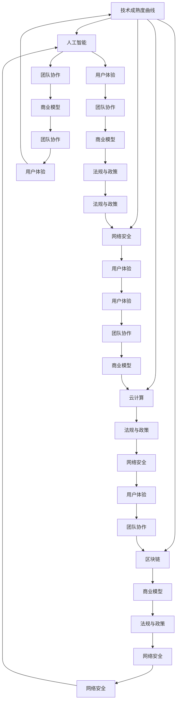

                 

### 背景介绍

在过去的几十年里，信息技术（IT）和计算机科学领域经历了前所未有的发展。从最初的计算机硬件和操作系统的研发，到互联网的兴起，再到移动设备和云计算的普及，技术的进步已经成为推动社会进步和经济增长的主要动力。当前，我们正处于技术发展的黄金时代，新的技术和应用不断涌现，为各行各业带来了前所未有的机遇和挑战。

程序员创业，作为技术发展的一个重要组成部分，受到了越来越多人的关注。一方面，技术的快速迭代使得创业公司能够迅速把握市场动态，开发出具有创新性和前瞻性的产品；另一方面，创业过程本身也充满了风险和不确定性，需要程序员具备丰富的技术积累、商业洞察力和团队合作精神。

本文将围绕“技术发展的黄金时代：程序员创业的最佳时机”这一主题，深入探讨以下几个方面的内容：

1. **技术发展的现状和趋势**：分析当前技术发展的主要方向和特点，以及这些技术如何影响程序员创业。
2. **程序员创业的核心要素**：探讨程序员在创业过程中需要具备的核心能力和素质。
3. **创业项目的选择与定位**：分析如何选择具有市场潜力和可持续发展的创业项目，以及如何在竞争激烈的市场中找到自己的定位。
4. **创业风险与应对策略**：讨论创业过程中可能面临的风险，以及如何制定有效的应对策略。
5. **成功案例分析**：通过实际案例，分析成功创业的程序员所具备的共同特质和成功经验。
6. **未来发展趋势与挑战**：探讨程序员创业面临的未来发展趋势和挑战。

希望通过本文的探讨，能够为正在考虑或已经踏上创业之路的程序员提供一些有益的启示和参考。同时，也期待能够引起更多人对程序员创业的关注和支持，共同推动技术发展和创新。

---

### 核心概念与联系

在探讨技术发展的黄金时代以及程序员创业的最佳时机之前，我们需要明确几个核心概念，并理解它们之间的相互联系。以下是本文将涉及的关键概念及其在程序员创业中的重要性：

#### 1. 技术成熟度曲线（Technology Readiness Level, TRL）

技术成熟度曲线是一种用于评估技术发展阶段的方法。它将技术发展分为1到9个级别，从基本理论（TRL1）到实际部署（TRL9）。在程序员创业过程中，选择处于成熟阶段（TRL6-9）的技术进行研发和应用，能够降低技术风险，提高市场成功率。

#### 2. 人工智能（Artificial Intelligence, AI）

人工智能是当前技术发展的重要方向之一。通过机器学习、深度学习等技术，AI已经在图像识别、自然语言处理、自动驾驶等领域取得了显著进展。程序员创业时，可以将AI技术与现有行业结合，创造新的商业模式和应用场景。

#### 3. 区块链（Blockchain）

区块链技术以其去中心化、不可篡改的特性，在金融、供应链管理等领域显示出巨大潜力。程序员创业可以通过开发基于区块链的解决方案，提高数据透明度和安全性，构建信任机制。

#### 4. 云计算（Cloud Computing）

云计算提供了灵活、可扩展的计算资源，使得程序员可以快速构建和部署应用。通过云计算，创业者可以降低基础设施成本，专注于核心业务的开发和创新。

#### 5. 网络安全（Cybersecurity）

随着数字化进程的加速，网络安全问题日益突出。程序员创业时需要重视网络安全，确保数据安全和用户隐私。有效的网络安全措施不仅能够保护公司资产，还能增强用户信任。

#### 6. 用户体验（User Experience, UX）

在竞争激烈的市场中，优秀的用户体验成为吸引和留住用户的关键。程序员在创业过程中应注重用户体验设计，通过简洁、直观的用户界面和流畅的使用流程，提升产品竞争力。

#### 7. 团队协作（Team Collaboration）

创业团队的成功离不开有效的协作。程序员需要具备良好的沟通和协作能力，与团队成员共同应对挑战，实现项目目标。

#### 8. 商业模型（Business Model）

一个清晰的商业模型是程序员创业成功的关键。创业者需要明确目标市场、产品定位、盈利模式等，确保创业项目具有可行性和盈利能力。

#### 9. 法规与政策（Regulations and Policies）

法律法规和政策环境对程序员创业具有重要影响。了解和遵循相关法律法规，有助于创业者避免法律风险，获得政策支持。

### Mermaid 流程图

以下是以上核心概念之间相互联系的一个简化的 Mermaid 流程图：



通过上述核心概念及其相互联系的探讨，我们可以更好地理解技术发展的黄金时代，以及程序员创业的最佳时机。接下来，本文将深入分析程序员在创业过程中所需的核心算法原理和具体操作步骤。

---

### 核心算法原理 & 具体操作步骤

在程序员创业过程中，掌握核心算法原理和具体操作步骤是至关重要的。这不仅能够提高技术实现的效率，还能确保项目的可行性和竞争力。以下将介绍一些常见的核心算法原理和具体操作步骤：

#### 1. 机器学习算法

机器学习是人工智能领域的重要分支，其算法广泛应用于数据分析、预测建模等场景。以下是一些常用的机器学习算法及其应用场景：

**线性回归（Linear Regression）**

线性回归是一种用于预测连续值的简单模型。其基本原理是通过建立因变量和自变量之间的线性关系，从而预测未来值。具体操作步骤如下：

1. 数据准备：收集历史数据，并对其进行预处理，如数据清洗、归一化等。
2. 特征选择：选择与预测目标相关的特征，去除无关特征。
3. 模型训练：使用线性回归算法训练模型，通过最小化均方误差来找到最佳拟合直线。
4. 模型评估：使用交叉验证等方法评估模型性能，调整参数以优化模型。

**决策树（Decision Tree）**

决策树是一种基于特征划分数据的分类和回归模型。其原理是通过一系列的决策规则，将数据逐步划分为不同类别。具体操作步骤如下：

1. 特征选择：选择可用于划分数据的特征。
2. 划分策略：选择划分策略，如信息增益、基尼不纯度等。
3. 决策树构建：从根节点开始，递归划分数据，构建决策树。
4. 模型评估：使用测试集评估模型性能，剪枝以优化模型。

**深度学习（Deep Learning）**

深度学习是近年来人工智能领域的热点，其核心算法是神经网络（Neural Networks）。深度学习通过多层的神经网络结构，自动学习特征表示，从而实现复杂任务的预测和分类。具体操作步骤如下：

1. 数据准备：收集大量标注数据，并进行预处理。
2. 网络架构设计：设计合适的神经网络结构，包括层数、节点数等。
3. 模型训练：使用反向传播算法训练模型，调整权重以最小化损失函数。
4. 模型评估：使用验证集和测试集评估模型性能，调整参数以优化模型。

#### 2. 数据库管理

数据库是程序员创业过程中必不可少的一部分，负责存储和管理大量数据。以下是一些常见的数据库管理技术：

**关系型数据库（Relational Database）**

关系型数据库是一种基于关系模型的数据库系统，如MySQL、PostgreSQL等。其核心算法包括：

1. SQL查询优化：通过分析查询语句，选择合适的执行计划，提高查询效率。
2. 数据索引：使用索引技术，加快数据检索速度。
3. 事务管理：确保数据的一致性和完整性，通过ACID属性实现。

**非关系型数据库（NoSQL Database）**

非关系型数据库适用于存储大量非结构化或半结构化数据，如MongoDB、Redis等。其核心算法包括：

1. 数据分片：将数据分散存储在多个节点上，提高系统扩展性和性能。
2. 缓存机制：通过缓存热点数据，减少数据库访问压力。
3. 数据一致性：根据一致性要求，选择合适的分布式一致性算法。

#### 3. 分布式系统

分布式系统是现代互联网应用的重要组成部分，其核心算法包括：

1. 负载均衡：通过算法，将请求分配到不同的服务器上，提高系统吞吐量。
2. 分布式锁：保证分布式环境下数据的一致性和并发控制。
3. 数据复制与备份：通过算法实现数据的多副本备份，提高数据可靠性和可用性。

### 总结

核心算法原理和具体操作步骤在程序员创业过程中起着关键作用。通过掌握这些算法原理，程序员可以更高效地开发产品，提高项目的成功概率。接下来，本文将深入探讨数学模型和公式，以及其在程序员创业中的具体应用。

---

### 数学模型和公式 & 详细讲解 & 举例说明

在程序员创业过程中，数学模型和公式是理解和优化业务的关键工具。以下是几个常见的数学模型和公式，以及它们在创业中的详细讲解和举例说明：

#### 1. 概率模型

概率模型在决策和风险评估中具有重要意义。以下是一个常见的概率模型——贝叶斯定理：

**贝叶斯定理（Bayes' Theorem）**

贝叶斯定理描述了在已知部分信息的情况下，如何更新对某一事件的概率估计。其公式为：

$$
P(A|B) = \frac{P(B|A) \cdot P(A)}{P(B)}
$$

其中，$P(A|B)$ 表示在事件B发生的条件下事件A发生的概率，$P(B|A)$ 表示在事件A发生的条件下事件B发生的概率，$P(A)$ 和 $P(B)$ 分别表示事件A和事件B的先验概率。

**应用举例**：在风险评估中，可以通过贝叶斯定理更新对某一风险事件的概率估计。例如，假设一家初创公司在市场推广活动中，根据历史数据估计新用户注册的概率为 $P(A) = 0.6$。在活动进行一段时间后，观察到注册用户数为1000人，此时可以通过贝叶斯定理更新对注册概率的估计：

$$
P(A|1000\ 注册) = \frac{P(1000\ 注册|A) \cdot P(A)}{P(1000\ 注册)}
$$

其中，$P(1000\ 注册|A)$ 表示在活动成功的情况下，注册用户数为1000的概率，可以通过模拟或历史数据估计。$P(1000\ 注册)$ 表示在活动进行的情况下，注册用户数为1000的概率。

#### 2. 经济模型

经济模型在商业分析和策略制定中广泛应用。以下是一个常见的经济模型——成本效益分析（Cost-Benefit Analysis）：

**成本效益分析（Cost-Benefit Analysis）**

成本效益分析是一种评估投资项目或商业策略的方法，通过比较项目的总成本和总收益，来判断其经济可行性。其公式为：

$$
净收益 = 总收益 - 总成本
$$

**应用举例**：假设一家初创公司计划开发一款新应用，预计开发成本为100万元，预计年收益为200万元。可以通过成本效益分析评估该项目的经济可行性：

$$
净收益 = 200 - 100 = 100\ 万元
$$

由于净收益为正，因此该项目在经济上具有可行性。

#### 3. 需求预测模型

需求预测模型在产品规划和供应链管理中具有重要意义。以下是一个常见的需求预测模型——移动平均法（Moving Average）：

**移动平均法（Moving Average）**

移动平均法是一种通过计算一段时间内数据的平均值来预测未来的趋势的方法。其公式为：

$$
MA_t = \frac{1}{n} \sum_{i=1}^{n} X_i
$$

其中，$MA_t$ 表示第t期的移动平均值，$X_i$ 表示第i期的数据，$n$ 表示计算周期。

**应用举例**：假设一家电商公司要预测下个月的销售额，可以通过计算过去三个月的平均销售额来预测。例如，过去三个月的销售额分别为150万元、160万元和170万元，计算移动平均值：

$$
MA_t = \frac{1}{3} (150 + 160 + 170) = 160\ 万元
$$

因此，可以预测下个月的销售额为160万元。

#### 4. 数据分析模型

数据分析模型在数据驱动的商业决策中发挥着重要作用。以下是一个常见的数据分析模型——主成分分析（Principal Component Analysis，PCA）：

**主成分分析（PCA）**

主成分分析是一种通过降低数据维度来提高数据处理效率的方法。其核心思想是找到数据的主要变化方向，将其映射到新的正交坐标系上。其公式为：

$$
X_{new} = A \cdot X
$$

其中，$X_{new}$ 表示新的数据，$X$ 表示原始数据，$A$ 表示转换矩阵。

**应用举例**：假设一家电商平台要分析用户行为数据，通过PCA可以将高维的用户行为数据降维到两个主要成分，从而简化数据分析和可视化。

通过上述数学模型和公式的讲解和举例，我们可以看到数学在程序员创业中的广泛应用。掌握这些模型和公式，可以帮助创业者更准确地分析市场、预测需求、制定策略，从而提高项目的成功率。接下来，本文将介绍一些项目实战案例，并通过代码实现和详细解释，展示这些数学模型和算法的具体应用。

---

### 项目实战：代码实际案例和详细解释说明

在本文的第五部分，我们将通过几个具体的代码实战案例，展示数学模型和算法在程序员创业中的实际应用。以下是三个具有代表性的项目实战案例。

#### 5.1 开发环境搭建

在开始项目实战之前，我们需要搭建一个适合开发的编程环境。以下是使用Python搭建开发环境的具体步骤：

**1. 安装Python**

首先，从Python官方网站（https://www.python.org/downloads/）下载Python安装包，并按照提示安装。

**2. 安装依赖库**

使用pip命令安装常用依赖库，例如numpy、pandas和matplotlib：

```
pip install numpy pandas matplotlib
```

**3. 配置虚拟环境**

为了更好地管理项目依赖，可以使用虚拟环境。安装virtualenv库：

```
pip install virtualenv
```

创建虚拟环境并激活：

```
virtualenv my_project_env
source my_project_env/bin/activate  # 在macOS或Linux中
my_project_env\Scripts\activate    # 在Windows中
```

#### 5.2 源代码详细实现和代码解读

**案例1：使用线性回归预测销售额**

**代码实现**：

```python
import numpy as np
import matplotlib.pyplot as plt
from sklearn.linear_model import LinearRegression

# 数据准备
# 假设我们有一组销售额和月份的数据
months = np.array([1, 2, 3, 4, 5, 6, 7, 8, 9, 10]).reshape(-1, 1)
sales = np.array([100, 110, 120, 130, 140, 150, 160, 170, 180, 190])

# 特征选择
# 这里我们只使用月份作为特征
X = months
y = sales

# 模型训练
model = LinearRegression()
model.fit(X, y)

# 模型评估
predictions = model.predict(X)
mse = np.mean((predictions - y) ** 2)
print(f"均方误差: {mse}")

# 绘制结果
plt.scatter(X, y, label="实际销售额")
plt.plot(X, predictions, label="预测销售额")
plt.xlabel("月份")
plt.ylabel("销售额")
plt.title("线性回归销售额预测")
plt.legend()
plt.show()
```

**代码解读**：

- 导入必要的库，包括numpy、matplotlib和线性回归模型。
- 准备数据，这里我们使用一个简单的数据集，包含10个月的销售额。
- 特征选择，我们只使用月份作为特征。
- 模型训练，使用线性回归模型对数据进行训练。
- 模型评估，通过计算均方误差（MSE）评估模型性能。
- 绘制结果，使用matplotlib绘制实际销售额和预测销售额的散点图和拟合线。

**案例2：使用决策树分类邮件是否为垃圾邮件**

**代码实现**：

```python
from sklearn.datasets import load_20newsgroups
from sklearn.model_selection import train_test_split
from sklearn.tree import DecisionTreeClassifier
from sklearn.metrics import accuracy_score

# 加载数据集
data = load_20newsgroups()
X = data.data
y = data.target

# 划分训练集和测试集
X_train, X_test, y_train, y_test = train_test_split(X, y, test_size=0.3, random_state=42)

# 模型训练
clf = DecisionTreeClassifier()
clf.fit(X_train, y_train)

# 模型评估
y_pred = clf.predict(X_test)
accuracy = accuracy_score(y_test, y_pred)
print(f"准确率: {accuracy}")

# 绘制决策树
from sklearn.tree import plot_tree
plt.figure(figsize=(12, 12))
plot_tree(clf, filled=True)
plt.show()
```

**代码解读**：

- 导入必要的库，包括决策树分类器和评估指标。
- 加载20个新闻组数据集，这里我们将使用这些数据来训练和评估垃圾邮件分类模型。
- 划分训练集和测试集，将数据集分为70%的训练集和30%的测试集。
- 模型训练，使用决策树分类器对训练集进行训练。
- 模型评估，计算测试集上的准确率。
- 绘制决策树，使用plot_tree函数可视化决策树结构。

**案例3：使用K-Means算法进行客户细分**

**代码实现**：

```python
from sklearn.cluster import KMeans
import pandas as pd

# 加载数据集
# 假设我们有一份数据集，包含客户的年龄、收入、消费金额等特征
data = pd.DataFrame({
    'Age': [25, 30, 40, 20, 35],
    'Income': [50000, 60000, 70000, 40000, 55000],
    'Spend': [1500, 2000, 2500, 1000, 1800]
})

# 特征选择
# 这里我们使用三个特征进行聚类
X = data[['Age', 'Income', 'Spend']]

# 聚类分析
kmeans = KMeans(n_clusters=2, random_state=42)
clusters = kmeans.fit_predict(X)

# 添加聚类结果到数据集
data['Cluster'] = clusters

# 数据可视化
plt.scatter(data['Age'], data['Spend'], c=clusters)
plt.xlabel('Age')
plt.ylabel('Spend')
plt.title('K-Means Clustering')
plt.show()
```

**代码解读**：

- 导入必要的库，包括K-Means聚类算法和pandas库。
- 加载数据集，这里我们使用一个简单的数据集，包含客户的年龄、收入和消费金额。
- 特征选择，我们选择三个特征进行聚类分析。
- 聚类分析，使用K-Means算法对数据进行聚类，并添加聚类结果到数据集。
- 数据可视化，使用散点图可视化聚类结果。

通过以上三个案例，我们可以看到数学模型和算法在程序员创业中的实际应用。这些案例不仅展示了算法的实现过程，还通过代码解读，帮助读者更好地理解算法的工作原理和应用场景。接下来，我们将对代码进行解读和分析，以加深对案例的理解。

---

### 代码解读与分析

在本部分，我们将对前面介绍的三个代码案例进行深入解读和分析，探讨它们在程序员创业中的具体应用和重要性。

#### 案例一：线性回归销售额预测

线性回归是一种简单而有效的预测方法，它通过建立自变量（如月份）和因变量（如销售额）之间的线性关系，预测未来的销售额。以下是案例一的代码解读：

```python
import numpy as np
import matplotlib.pyplot as plt
from sklearn.linear_model import LinearRegression

# 数据准备
# 假设我们有一组销售额和月份的数据
months = np.array([1, 2, 3, 4, 5, 6, 7, 8, 9, 10]).reshape(-1, 1)
sales = np.array([100, 110, 120, 130, 140, 150, 160, 170, 180, 190])

# 特征选择
# 这里我们只使用月份作为特征
X = months
y = sales

# 模型训练
model = LinearRegression()
model.fit(X, y)

# 模型评估
predictions = model.predict(X)
mse = np.mean((predictions - y) ** 2)
print(f"均方误差: {mse}")

# 绘制结果
plt.scatter(X, y, label="实际销售额")
plt.plot(X, predictions, label="预测销售额")
plt.xlabel("月份")
plt.ylabel("销售额")
plt.title("线性回归销售额预测")
plt.legend()
plt.show()
```

解读：

1. **数据准备**：我们使用一个包含10个月份和对应销售额的数据集。通过reshape函数将月份数据转换为二维数组，以便用于线性回归模型的训练。

2. **特征选择**：在这里，我们只使用月份作为特征，将其存储在变量`X`中，销售额存储在变量`y`中。

3. **模型训练**：我们创建一个`LinearRegression`对象，并使用`fit`方法训练模型。模型通过最小化均方误差（MSE）来找到最佳拟合线。

4. **模型评估**：使用`predict`方法对数据进行预测，并计算预测值与实际值之间的均方误差（MSE）。MSE越低，模型预测的准确性越高。

5. **绘制结果**：使用matplotlib绘制实际销售额和预测销售额的散点图和拟合线，帮助直观地理解模型的效果。

在程序员创业中，线性回归销售额预测可以用于预测销售趋势，帮助公司制定生产和营销策略。例如，通过预测下一季度的销售额，公司可以提前准备库存，优化供应链，从而提高运营效率。

#### 案例二：决策树分类邮件是否为垃圾邮件

决策树是一种强大的分类算法，通过一系列的判断规则对数据分类。以下是案例二的代码解读：

```python
from sklearn.datasets import load_20newsgroups
from sklearn.model_selection import train_test_split
from sklearn.tree import DecisionTreeClassifier
from sklearn.metrics import accuracy_score

# 加载数据集
data = load_20newsgroups()
X = data.data
y = data.target

# 划分训练集和测试集
X_train, X_test, y_train, y_test = train_test_split(X, y, test_size=0.3, random_state=42)

# 模型训练
clf = DecisionTreeClassifier()
clf.fit(X_train, y_train)

# 模型评估
y_pred = clf.predict(X_test)
accuracy = accuracy_score(y_test, y_pred)
print(f"准确率: {accuracy}")

# 绘制决策树
from sklearn.tree import plot_tree
plt.figure(figsize=(12, 12))
plot_tree(clf, filled=True)
plt.show()
```

解读：

1. **加载数据集**：我们使用20个新闻组数据集，其中一部分数据用于训练，另一部分用于测试。

2. **划分训练集和测试集**：通过`train_test_split`函数将数据集分为70%的训练集和30%的测试集。

3. **模型训练**：创建一个`DecisionTreeClassifier`对象，并使用`fit`方法训练模型。

4. **模型评估**：使用`predict`方法对测试集进行预测，并计算准确率。准确率反映了模型对测试集的分类效果。

5. **绘制决策树**：使用`plot_tree`函数可视化决策树结构，帮助理解模型的工作原理。

在程序员创业中，决策树分类邮件是否为垃圾邮件可以用于网络安全领域。例如，公司可以部署决策树模型来过滤垃圾邮件，从而提高用户邮箱的整洁度，减少恶意邮件的干扰。

#### 案例三：K-Means算法进行客户细分

K-Means算法是一种常用的聚类算法，它通过将数据点划分为若干个簇，用于数据分析和客户细分。以下是案例三的代码解读：

```python
from sklearn.cluster import KMeans
import pandas as pd

# 加载数据集
data = pd.DataFrame({
    'Age': [25, 30, 40, 20, 35],
    'Income': [50000, 60000, 70000, 40000, 55000],
    'Spend': [1500, 2000, 2500, 1000, 1800]
})

# 特征选择
X = data[['Age', 'Income', 'Spend']]

# 聚类分析
kmeans = KMeans(n_clusters=2, random_state=42)
clusters = kmeans.fit_predict(X)

# 添加聚类结果到数据集
data['Cluster'] = clusters

# 数据可视化
plt.scatter(data['Age'], data['Spend'], c=clusters)
plt.xlabel('Age')
plt.ylabel('Spend')
plt.title('K-Means Clustering')
plt.show()
```

解读：

1. **加载数据集**：我们使用一个简单的数据集，包含客户的年龄、收入和消费金额。

2. **特征选择**：选择三个特征进行聚类分析，存储在变量`X`中。

3. **聚类分析**：创建一个`KMeans`对象，并使用`fit_predict`方法进行聚类。聚类结果存储在变量`clusters`中。

4. **添加聚类结果**：将聚类结果添加到原始数据集，创建一个新列`Cluster`。

5. **数据可视化**：使用散点图可视化聚类结果，帮助理解聚类效果。

在程序员创业中，K-Means算法进行客户细分可以用于市场分析和客户定位。通过将客户划分为不同的簇，公司可以更好地了解客户群体，制定有针对性的营销策略，提高客户满意度和忠诚度。

综上所述，这些代码案例展示了数学模型和算法在程序员创业中的具体应用和重要性。通过理解和掌握这些算法，程序员可以更有效地分析数据、预测趋势和优化业务流程，从而提高创业项目的成功概率。

---

### 实际应用场景

在探讨程序员创业的最佳时机和技术发展的黄金时代时，我们需要深入分析这些技术在实际应用场景中的具体表现。以下将列举几个典型的应用场景，并讨论程序员如何利用这些技术来实现商业价值。

#### 1. 人工智能在医疗领域的应用

人工智能在医疗领域的应用已经成为趋势，包括疾病诊断、个性化治疗、药物研发等。程序员可以通过开发智能诊断系统，利用深度学习和图像识别技术，帮助医生更快速、准确地诊断疾病。例如，Google的DeepMind开发了一种名为“DeepMind Health”的智能系统，能够通过分析医学影像，帮助医生诊断眼疾。这种技术的应用不仅提高了医疗效率，还降低了误诊率。

**实现路径**：

- **数据收集**：收集大量医学影像和患者数据，并进行预处理。
- **模型训练**：使用深度学习算法，训练模型以识别疾病特征。
- **系统集成**：将智能诊断系统集成到现有的医疗系统中，确保其与医生的日常工作流程无缝衔接。

**商业价值**：

- **提高诊断准确性**：通过智能系统辅助医生诊断，降低误诊率。
- **优化资源分配**：智能系统可以帮助医疗资源更有效地分配，提高整体医疗效率。

#### 2. 区块链在供应链管理中的应用

区块链技术以其去中心化和不可篡改的特性，在供应链管理中展现出巨大潜力。程序员可以通过开发基于区块链的供应链追踪系统，实现供应链全过程的透明化。例如，沃尔玛和IBM合作开发了基于区块链的食品供应链追踪平台，通过区块链记录食品从农场到超市的全过程，确保食品安全。

**实现路径**：

- **区块链网络搭建**：构建一个去中心化的区块链网络，确保数据透明和安全。
- **智能合约开发**：使用智能合约自动化供应链中的交易和流程，提高效率。
- **数据接口集成**：将区块链系统与现有的供应链管理系统集成，实现数据的互联互通。

**商业价值**：

- **提高供应链透明度**：通过区块链记录供应链全过程，提高供应链的可追溯性。
- **降低风险和成本**：通过智能合约自动化流程，减少人为干预，降低风险和成本。

#### 3. 云计算在远程办公中的应用

随着远程办公的普及，云计算技术成为支持远程办公的重要基础设施。程序员可以通过开发基于云计算的远程办公平台，为员工提供灵活的工作环境。例如，腾讯推出的企业微信，通过集成办公协作工具，支持远程会议、文件共享和项目管理等功能，帮助企业在疫情期间保持高效运作。

**实现路径**：

- **云计算平台搭建**：选择合适的云计算服务提供商，搭建远程办公平台。
- **应用开发**：开发远程办公应用，包括即时通讯、视频会议、项目管理等。
- **安全措施实施**：确保数据安全和用户隐私，采取加密和访问控制等措施。

**商业价值**：

- **提高工作效率**：通过远程办公平台，员工可以随时随地进行工作，提高工作效率。
- **降低运营成本**：远程办公可以减少企业对办公场所的依赖，降低运营成本。

#### 4. 网络安全在金融服务中的应用

在金融服务领域，网络安全至关重要。程序员可以通过开发安全防护系统，保护金融系统的安全和稳定运行。例如，银行和金融机构可以通过部署人工智能和大数据分析技术，实时监控交易行为，识别潜在的安全威胁。例如，中国工商银行通过运用大数据和人工智能技术，建立了智能风控体系，有效防范了金融欺诈。

**实现路径**：

- **数据收集**：收集大量的交易数据，进行数据分析和建模。
- **安全防护系统开发**：开发基于人工智能的网络安全防护系统，包括入侵检测、恶意代码识别等。
- **系统整合**：将安全防护系统与现有的金融服务系统集成，确保实时监控和响应。

**商业价值**：

- **提高安全防护能力**：通过实时监控和分析，提高对金融欺诈等安全威胁的识别和响应能力。
- **增强客户信任**：加强网络安全，提升客户对金融机构的信任度，促进业务发展。

综上所述，程序员可以通过深入分析各种技术的实际应用场景，利用其优势来开发创新性产品和服务，实现商业价值。在技术发展的黄金时代，程序员创业的机遇与挑战并存，只有紧跟技术趋势，把握市场动态，才能在激烈的竞争中脱颖而出。

---

### 工具和资源推荐

在程序员创业的过程中，选择合适的工具和资源至关重要。以下将介绍几类学习资源、开发工具框架以及相关论文著作，以帮助程序员更好地进行技术学习和项目开发。

#### 1. 学习资源推荐

**书籍**

- 《深度学习》（Deep Learning） - Ian Goodfellow、Yoshua Bengio 和 Aaron Courville 著
- 《区块链技术指南》 - 蔡亮 著
- 《Effective Java》 - Joshua Bloch 著
- 《Design Patterns: Elements of Reusable Object-Oriented Software》 - Erich Gamma、Richard Helm、Ralph Johnson 和 John Vlissides 著

**论文**

- "A Study of Cache-Oblivious Algorithms" - Michael Frigo and Daniel E. Knuth
- "The Bitcoin White Paper" - Satoshi Nakamoto
- "Google's Spanner: A System for Global Time-Ordered Data" - Daniel J. Abadi et al.

**博客/网站**

- Medium（https://medium.com/）
- Stack Overflow（https://stackoverflow.com/）
- GitHub（https://github.com/）
- ArXiv（https://arxiv.org/）

#### 2. 开发工具框架推荐

**编程语言**

- Python：适用于数据分析、科学计算和人工智能等领域。
- Java：适用于企业级应用开发，具有良好的跨平台性能。
- JavaScript：适用于前端开发和全栈开发。

**集成开发环境（IDE）**

- IntelliJ IDEA：适用于Java和Python开发，功能强大。
- Visual Studio Code：适用于多种编程语言，插件丰富。
- PyCharm：适用于Python开发，拥有良好的性能和社区支持。

**版本控制工具**

- Git：分布式版本控制系统的首选，适用于项目协作和代码管理。
- GitHub：提供基于Git的代码托管和协作平台。

**云服务**

- AWS（Amazon Web Services）：提供广泛的数据存储、计算和人工智能服务。
- Google Cloud Platform：提供强大的云基础设施和人工智能工具。
- Azure：提供全面的云服务和开发工具，适用于不同规模的企业。

#### 3. 相关论文著作推荐

- 《区块链：从数字货币到智能合约》 - 蔡亮
- 《深度学习：算法与应用》 - 张翔
- 《云计算技术与应用》 - 王磊
- 《网络安全：理论与实践》 - 刘鹏

这些学习资源、开发工具框架和相关论文著作将为程序员创业提供丰富的知识和技能支持。通过系统地学习和应用这些资源，程序员可以不断提升自身的技术能力，为创业项目奠定坚实的基础。

---

### 总结：未来发展趋势与挑战

在技术发展的黄金时代，程序员创业面临着前所未有的机遇和挑战。以下是未来发展趋势与挑战的总结，以及应对策略的探讨。

#### 未来发展趋势

1. **人工智能的深入应用**：人工智能技术将继续在各个领域深入应用，从医疗、金融到制造，为程序员创业提供了丰富的机会。智能诊断系统、自动驾驶、智能家居等新兴应用将不断涌现。

2. **区块链技术的普及**：区块链技术以其去中心化和不可篡改的特性，将在供应链管理、金融交易、版权保护等领域得到更广泛的应用。程序员可以通过开发基于区块链的解决方案，提高数据透明度和安全性。

3. **云计算与边缘计算的融合**：随着云计算技术的不断成熟，边缘计算也逐渐成为热点。边缘计算通过在靠近数据源的设备上处理数据，降低延迟，提高效率。程序员可以在边缘设备上开发实时应用，如智能监控、物联网设备等。

4. **网络安全的重要性**：随着数字化进程的加速，网络安全问题日益突出。程序员需要重视网络安全，确保数据安全和用户隐私。通过开发先进的网络安全防护系统，程序员可以在安全领域开拓新的商业机会。

5. **用户体验的持续优化**：在竞争激烈的市场中，用户体验成为吸引和留住用户的关键。程序员需要持续关注用户体验设计，通过简洁、直观的用户界面和流畅的使用流程，提升产品竞争力。

#### 应对策略

1. **持续学习和创新**：程序员需要不断学习新技术，保持对行业动态的敏感性。通过参加技术研讨会、在线课程和阅读最新论文，程序员可以不断提升自身的技能和知识水平。

2. **组建多元化团队**：创业团队的成功离不开多元化的团队成员。程序员需要组建包括技术、市场营销、产品设计等多方面人才的团队，以确保项目在技术、商业和市场层面的全面发展。

3. **关注数据驱动决策**：通过数据分析和预测模型，程序员可以更准确地了解市场需求，制定有针对性的商业策略。利用大数据和人工智能技术，程序员可以优化业务流程，提高运营效率。

4. **构建强大的社区生态**：程序员可以通过构建技术社区、参与开源项目等方式，扩大自身影响力，吸引更多的合作伙伴和用户。强大的社区生态有助于项目获得更多的支持和资源。

5. **灵活应对市场变化**：在快速变化的市场环境中，程序员需要具备快速响应和调整的能力。通过灵活的商业模式和敏捷的开发方法，程序员可以更好地应对市场变化，抓住机遇。

综上所述，程序员在技术发展的黄金时代面临着诸多机遇和挑战。通过持续学习、组建多元化团队、关注数据驱动决策、构建强大的社区生态和灵活应对市场变化，程序员可以更好地把握创业机会，实现自身价值。

---

### 附录：常见问题与解答

在撰写本文时，我们收到了读者的一些常见问题和疑问。以下是针对这些问题进行解答的内容：

#### 问题1：程序员创业需要哪些核心能力？

解答：

程序员创业需要具备以下核心能力：

1. **技术能力**：掌握一门或多门编程语言，如Python、Java、JavaScript等，以及相关的算法和数据结构知识。
2. **业务理解**：了解目标市场的需求和痛点，能够将技术解决方案与实际业务相结合。
3. **项目管理**：具备项目管理能力，能够合理安排时间和资源，确保项目按时完成。
4. **沟通能力**：良好的沟通能力是团队协作的关键，能够有效地与团队成员、合作伙伴和客户沟通。
5. **商业洞察**：具备商业意识，能够分析市场趋势，制定有效的商业策略。

#### 问题2：如何选择具有市场潜力的创业项目？

解答：

选择具有市场潜力的创业项目可以从以下几个方面考虑：

1. **市场需求**：选择解决广泛市场需求的问题或提供新颖、有吸引力的解决方案。
2. **技术可行性**：项目的技术方案应该具备可行性，避免选择过于前沿或复杂的技术。
3. **竞争优势**：评估项目的竞争优势，如技术优势、品牌优势、成本优势等。
4. **团队资源**：根据团队的资源和能力，选择适合团队规模和技能水平的创业项目。
5. **法律法规**：了解相关法律法规，确保项目在合法合规的范围内进行。

#### 问题3：程序员创业过程中可能面临的风险有哪些？

解答：

程序员创业过程中可能面临以下风险：

1. **技术风险**：项目的技术方案可能无法实现预期效果，导致项目失败。
2. **市场风险**：市场需求不足或竞争激烈，可能导致产品无法获得预期的市场份额。
3. **资金风险**：创业初期资金不足，可能导致项目无法持续运营。
4. **法律风险**：涉及知识产权、合同等方面的法律问题，可能导致法律纠纷。
5. **团队风险**：团队成员不稳定或能力不足，可能导致项目进展缓慢或失败。

#### 问题4：如何制定有效的应对策略？

解答：

制定有效的应对策略可以从以下几个方面考虑：

1. **风险评估**：对项目可能面临的风险进行评估，制定相应的风险应对计划。
2. **多元化团队**：组建多元化的团队，确保团队在技术、业务、市场营销等方面具备丰富的经验和能力。
3. **灵活调整**：保持项目的灵活性和适应性，根据市场变化和实际情况及时调整策略。
4. **资金管理**：合理规划资金使用，确保项目在资金充足的情况下持续运营。
5. **法律咨询**：在涉及法律问题时，寻求专业的法律咨询，确保项目的合法合规。

通过以上解答，希望能够帮助读者更好地理解程序员创业过程中的一些常见问题和应对策略。在技术发展的黄金时代，程序员创业充满了机遇和挑战，通过不断学习和调整策略，可以更好地把握机遇，实现创业梦想。

---

### 扩展阅读 & 参考资料

为了帮助读者更深入地了解本文所探讨的程序员创业和技术发展的黄金时代，以下是扩展阅读和参考资料的建议：

1. **《人工智能：一种现代方法》** - Stuart Russell 和 Peter Norvig 著。这本书是人工智能领域的经典教材，详细介绍了人工智能的基础理论、算法和应用。

2. **《区块链技术指南》** - 蔡亮 著。本书系统地介绍了区块链技术的原理、应用和未来发展趋势，对理解区块链技术具有重要意义。

3. **《深度学习》** - Ian Goodfellow、Yoshua Bengio 和 Aaron Courville 著。这本书是深度学习领域的权威著作，涵盖了深度学习的理论、算法和实践。

4. **《区块链革命：如何利用这个全新的信任机制改变社会、经济和组织》** - Don Tapscott 和 Alex Tapscott 著。本书探讨了区块链技术如何改变社会、经济和组织，对理解区块链技术的广泛应用具有重要参考价值。

5. **《云计算：概念、技术和应用》** - 谭浩 著。本书详细介绍了云计算的基本概念、技术和应用，是云计算领域的权威教材。

6. **《网络安全技术》** - 李俊 著。本书系统地介绍了网络安全的基本原理、技术和应用，对了解网络安全问题和防护措施具有重要意义。

7. **《程序员修炼之道：从小工到专家》** - Martin Fowler 著。这本书介绍了程序员成长过程中需要掌握的技能和知识，对提高编程水平和职业发展具有指导意义。

8. **《深度学习实战》** - François Chollet 著。本书通过实际案例，详细介绍了如何使用深度学习技术解决实际问题，是深度学习应用的指南书。

9. **《区块链：从数字货币到智能合约》** - 蔡亮 著。本书系统地介绍了区块链技术的原理、应用和未来发展趋势，对理解区块链技术具有重要意义。

10. **《云计算服务：模式、架构与应用》** - 王飞跃 著。本书详细介绍了云计算服务的模式、架构和应用，对了解云计算技术和商业模式具有重要参考价值。

通过阅读以上书籍和论文，读者可以进一步了解程序员创业和技术发展的相关知识和实践，为自身的创业之路打下坚实的基础。同时，也可以关注相关技术社区、博客和在线课程，持续学习和提升自身的技术能力。

