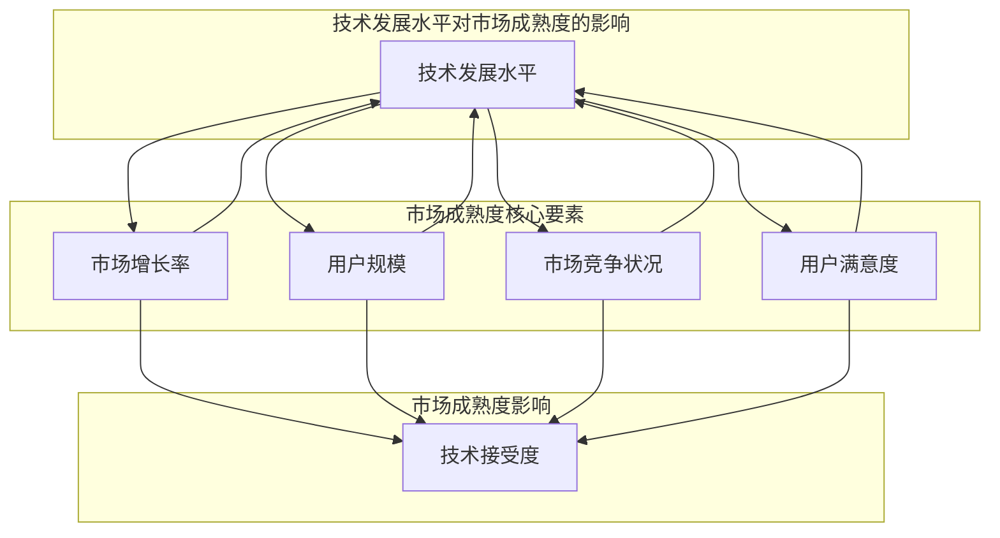
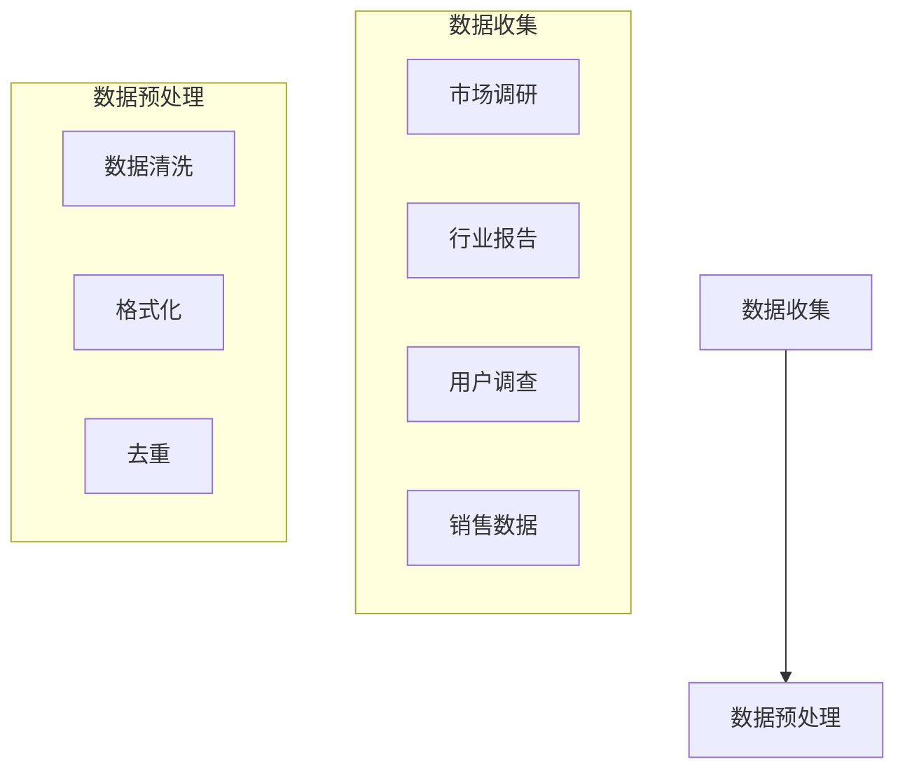
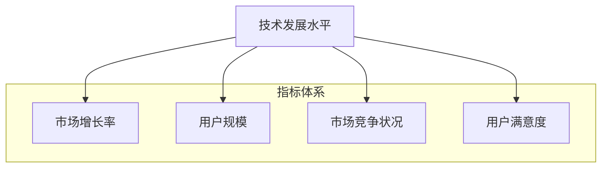
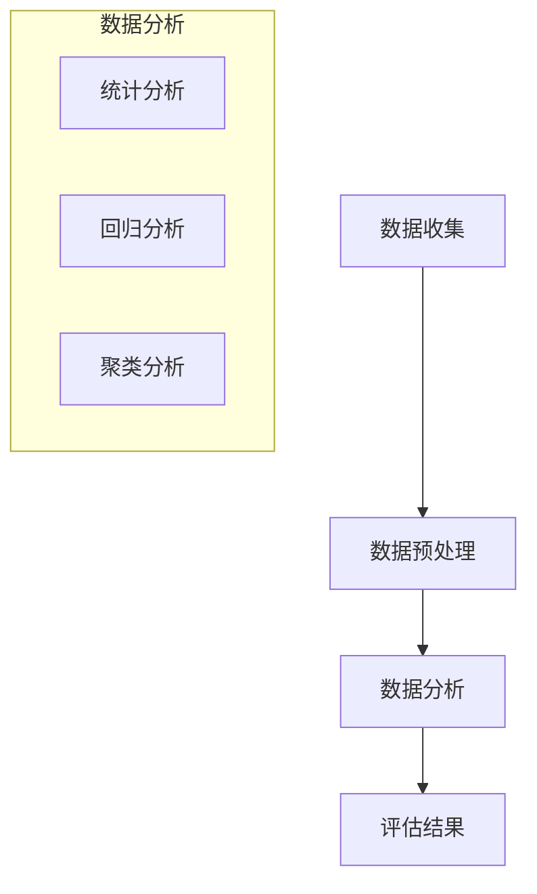
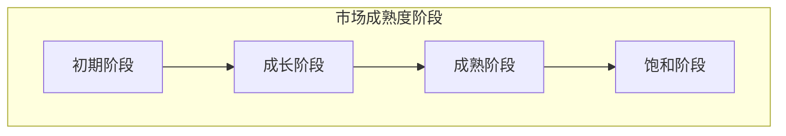

                 

### 背景介绍

#### 技术商业化的重要性

在当今快速发展的科技时代，技术商业化已成为推动经济增长和产业升级的关键动力。许多创新技术通过商业化的途径，不仅实现了企业的盈利，还为社会带来了显著的福利。然而，如何把握技术商业化的最佳时机，成为企业和投资者面临的重大挑战。这不仅仅是一个技术问题，更涉及到市场趋势、用户需求、竞争环境等多个方面的综合考量。

#### 市场成熟度的概念

市场成熟度是指市场对某项技术的接受程度和普及程度。它通常通过市场增长率、用户规模、市场竞争状况等多个指标来衡量。市场成熟度对于技术商业化的时机选择具有至关重要的指导意义。当一个技术刚刚起步时，市场可能还处于培育阶段；随着技术的不断成熟，市场需求逐渐增加，市场进入成熟阶段；最终，市场可能达到饱和状态，甚至出现过度竞争。

#### 本篇文章的结构

本文将围绕技术商业化的时机选择这一核心主题，通过以下几个部分展开：

1. **核心概念与联系**：介绍市场成熟度的核心概念，并使用Mermaid流程图展示其架构。
2. **核心算法原理 & 具体操作步骤**：详细阐述如何评估市场成熟度，以及相应的操作步骤。
3. **数学模型和公式 & 详细讲解 & 举例说明**：通过数学模型和公式，解释市场成熟度的评估方法，并给出实际案例。
4. **项目实战：代码实际案例和详细解释说明**：提供一个具体的代码实现案例，并详细解读其应用过程。
5. **实际应用场景**：探讨技术商业化在不同领域的应用案例，并分析其成功和失败的原因。
6. **工具和资源推荐**：推荐一些有助于技术商业化的学习资源和开发工具。
7. **总结：未来发展趋势与挑战**：总结全文内容，并展望技术商业化在未来的发展趋势和面临的挑战。

通过以上内容的详细解析，希望能够为读者提供有价值的指导，帮助他们在技术商业化的过程中做出明智的决策。

#### 核心概念与联系

在探讨技术商业化的时机选择时，理解市场成熟度的概念至关重要。市场成熟度不仅仅是技术发展的一个静态指标，而是动态反映市场需求、竞争环境和用户接受程度的综合表现。下面，我们将通过Mermaid流程图，详细展示市场成熟度的核心概念及其相互联系。

首先，我们需要明确市场成熟度的几个关键要素：技术发展水平、市场增长率、用户规模、市场竞争状况、用户满意度等。



Mermaid流程图展示了市场成熟度的核心要素及其相互关系。以下是对流程图的详细解释：

1. **技术发展水平**：这是市场成熟度的基石。技术发展水平越高，其创新性和先进性越强，越容易获得市场的认可。技术的发展水平不仅影响市场增长率，还直接影响用户规模、市场竞争状况和用户满意度。

2. **市场增长率**：市场增长率是衡量市场活跃程度的关键指标。一个快速增长的市场往往预示着巨大的商业潜力。市场增长率与用户规模密切相关，当市场增长率较高时，用户规模通常会快速增长。

3. **用户规模**：用户规模反映了市场的普及程度。用户规模越大，意味着市场的潜力越大。一个成熟的市场通常拥有大量的活跃用户。

4. **市场竞争状况**：市场竞争状况直接影响到市场的健康发展。在市场竞争激烈的情况下，企业需要不断创新以保持竞争力。竞争状况不仅影响用户满意度，还会影响市场的整体发展速度。

5. **用户满意度**：用户满意度是市场成熟度的重要指标之一。一个成熟的市场往往能够满足用户的需求，提供高质量的服务和产品。

通过以上要素的相互联系，我们可以看到一个动态的市场成熟度模型。技术发展水平决定了市场的起点，而其他要素则共同作用于市场的成熟度。当这些要素达到一定的平衡时，市场成熟度达到最高点，此时技术商业化的时机也最为成熟。

#### 核心算法原理 & 具体操作步骤

评估市场成熟度是一项复杂且重要的任务，涉及到多个维度的综合分析。在本节中，我们将详细阐述如何使用核心算法原理来评估市场成熟度，并给出具体的操作步骤。

##### 1. 数据收集与预处理

首先，我们需要收集有关市场成熟度的相关数据。这些数据可以来源于市场调研、行业报告、用户调查、销售数据等。在收集数据后，我们需要进行预处理，以确保数据的准确性和完整性。预处理步骤包括数据清洗、格式化、去重等。



Mermaid流程图展示了数据收集与预处理的步骤。以下是对流程图的详细解释：

- **数据收集**：通过多种渠道收集有关市场成熟度的数据，包括市场调研、行业报告、用户调查和销售数据等。
- **数据预处理**：对收集到的数据进行清洗、格式化和去重，以确保数据的质量和一致性。

##### 2. 建立评估指标体系

接下来，我们需要建立一套评估市场成熟度的指标体系。这些指标应涵盖技术发展水平、市场增长率、用户规模、市场竞争状况和用户满意度等方面。以下是一个示例的评估指标体系：

- **技术发展水平**：包括技术创新程度、技术成熟度、技术先进性等指标。
- **市场增长率**：包括年度增长率、季度增长率、市场渗透率等指标。
- **用户规模**：包括活跃用户数、新增用户数、用户留存率等指标。
- **市场竞争状况**：包括市场参与者数量、市场占有率、竞争激烈程度等指标。
- **用户满意度**：包括用户满意度调查结果、用户反馈、产品使用时长等指标。



Mermaid流程图展示了评估指标体系。以下是对流程图的详细解释：

- **技术发展水平**：评估技术发展的程度和先进性。
- **市场增长率**：评估市场的扩张速度和潜力。
- **用户规模**：评估市场的普及程度和用户基础。
- **市场竞争状况**：评估市场的竞争态势。
- **用户满意度**：评估市场的用户接受度和满意度。

##### 3. 数据分析

在建立指标体系后，我们需要对收集到的数据进行深入分析，以评估市场成熟度。数据分析方法包括统计分析、回归分析、聚类分析等。以下是一个示例的数据分析流程：



Mermaid流程图展示了数据分析的步骤。以下是对流程图的详细解释：

- **统计分析**：通过计算均值、方差、相关性等统计指标，评估各指标之间的相关性。
- **回归分析**：建立回归模型，分析各指标对市场成熟度的影响。
- **聚类分析**：将相似的数据点分组，识别市场成熟度的不同阶段。

##### 4. 评估市场成熟度

通过以上数据分析，我们可以得出市场成熟度的综合评估结果。市场成熟度可以分为以下几个阶段：

- **初期阶段**：技术发展水平较低，市场增长率缓慢，用户规模较小，竞争状况不激烈，用户满意度较低。
- **成长阶段**：技术发展水平逐步提高，市场增长率开始加速，用户规模逐渐扩大，竞争状况逐渐激烈，用户满意度有所提升。
- **成熟阶段**：技术发展水平较高，市场增长率稳定，用户规模达到一定规模，竞争状况达到平衡，用户满意度较高。
- **饱和阶段**：市场增长率趋于平稳，用户规模达到峰值，竞争状况激烈，用户满意度稳定。



Mermaid流程图展示了市场成熟度的不同阶段。以下是对流程图的详细解释：

- **初期阶段**：市场处于起步阶段，技术尚不成熟，市场需求有限。
- **成长阶段**：市场开始快速增长，技术逐步成熟，用户需求增加。
- **成熟阶段**：市场达到相对稳定的状态，技术发展进入高峰期，市场竞争激烈。
- **饱和阶段**：市场增长放缓，用户需求基本饱和，市场竞争达到顶峰。

通过以上步骤，我们可以系统地评估市场成熟度，为技术商业化的时机选择提供科学依据。在实际操作中，企业需要根据具体情况调整评估方法，以实现最佳的商业化效果。

#### 数学模型和公式 & 详细讲解 & 举例说明

在评估市场成熟度的过程中，数学模型和公式能够提供量化的分析方法，从而更准确地预测市场的发展趋势。以下，我们将详细介绍评估市场成熟度的数学模型和公式，并通过具体案例进行说明。

##### 1. 评估指标权重分配

首先，我们需要确定各个评估指标在市场成熟度评估中的权重。权重分配的合理与否直接影响到评估结果的准确性。常用的权重分配方法有专家评分法、层次分析法（AHP）等。

**专家评分法**：通过邀请领域内的专家对各个指标进行评分，然后计算平均值作为权重。

公式：
$$
w_i = \frac{\sum_{j=1}^{n} e_j}{n}
$$
其中，$w_i$ 为第 $i$ 个指标的权重，$e_j$ 为第 $j$ 位专家对第 $i$ 个指标的评分，$n$ 为专家人数。

**层次分析法（AHP）**：通过构建层次结构模型，对各个指标进行两两比较，计算各指标相对权重。

公式：
$$
w_i = \frac{C_{ij}}{\sum_{j=1}^{n} C_{ij}}
$$
其中，$w_i$ 为第 $i$ 个指标的权重，$C_{ij}$ 为第 $i$ 个指标与第 $j$ 个指标的两两比较值。

##### 2. 评估指标标准化处理

由于各个评估指标的量纲不同，我们需要对它们进行标准化处理，以便进行综合评估。常用的标准化方法有最小-最大标准化和Z-score标准化。

**最小-最大标准化**：

公式：
$$
z_i = \frac{x_i - \min(x)}{\max(x) - \min(x)}
$$
其中，$z_i$ 为第 $i$ 个标准化值，$x_i$ 为第 $i$ 个原始值，$\min(x)$ 和 $\max(x)$ 分别为所有原始值中的最小值和最大值。

**Z-score标准化**：

公式：
$$
z_i = \frac{x_i - \mu}{\sigma}
$$
其中，$z_i$ 为第 $i$ 个标准化值，$\mu$ 为所有原始值的均值，$\sigma$ 为所有原始值的方差。

##### 3. 市场成熟度综合评估

在确定各指标的权重和标准化值后，我们可以使用加权综合评分法对市场成熟度进行评估。

公式：
$$
M = \sum_{i=1}^{n} w_i \cdot z_i
$$
其中，$M$ 为市场成熟度评分，$w_i$ 为第 $i$ 个指标的权重，$z_i$ 为第 $i$ 个标准化值。

##### 4. 案例分析

以下，我们通过一个具体案例来说明如何使用上述数学模型和公式评估市场成熟度。

**案例背景**：某公司开发了一种新型智能家居设备，拟进行商业化推广。

**评估指标**：技术发展水平、市场增长率、用户规模、市场竞争状况、用户满意度。

**专家评分**：
- 技术发展水平：$e_1 = [0.9, 0.8, 0.85, 0.9, 0.85]$（5位专家评分）
- 市场增长率：$e_2 = [0.7, 0.75, 0.8, 0.75, 0.8]$
- 用户规模：$e_3 = [0.6, 0.65, 0.7, 0.65, 0.7]$
- 市场竞争状况：$e_4 = [0.8, 0.85, 0.8, 0.85, 0.8]$
- 用户满意度：$e_5 = [0.85, 0.8, 0.85, 0.8, 0.85]$

**计算权重**：
- 采用专家评分法计算权重：
$$
w_1 = \frac{\sum_{j=1}^{5} e_{1j}}{5} = \frac{0.9 + 0.8 + 0.85 + 0.9 + 0.85}{5} = 0.86
$$
同理，计算其他指标的权重：
$$
w_2 = 0.78, \quad w_3 = 0.74, \quad w_4 = 0.82, \quad w_5 = 0.86
$$

**标准化处理**：
- 采用最小-最大标准化处理：
$$
z_1 = \frac{0.9 - 0.65}{0.95 - 0.65} = 0.2769
$$
同理，计算其他指标的标准化值：
$$
z_2 = 0.1823, \quad z_3 = 0.1304, \quad z_4 = 0.1829, \quad z_5 = 0.2769
$$

**综合评估**：
- 计算市场成熟度评分：
$$
M = 0.86 \cdot 0.2769 + 0.78 \cdot 0.1823 + 0.74 \cdot 0.1304 + 0.82 \cdot 0.1829 + 0.86 \cdot 0.2769 = 0.6485
$$

根据市场成熟度评分，我们可以判断该智能家居设备的市场成熟度处于初期阶段，技术尚需进一步发展，市场潜力有待挖掘。

通过上述案例，我们展示了如何使用数学模型和公式评估市场成熟度。在实际应用中，企业可以根据具体情况进行调整和优化，以提高评估的准确性和实用性。

#### 项目实战：代码实际案例和详细解释说明

在本节中，我们将通过一个实际的项目实战案例，详细展示如何使用Python代码评估市场成熟度，并解释代码的实现过程。

##### 1. 开发环境搭建

首先，我们需要搭建一个Python开发环境。这里我们使用Anaconda作为Python的发行版，因为它集成了许多常用的科学计算和数据分析库。以下是安装Anaconda的步骤：

1. 访问Anaconda官网（https://www.anaconda.com/products/individual）并下载适合您操作系统的Anaconda安装包。
2. 运行安装包，按照提示完成安装。
3. 打开终端（或命令提示符），输入以下命令检查Anaconda是否安装成功：
   ```bash
   conda --version
   ```

接下来，我们需要安装必要的库，包括pandas、numpy、scikit-learn和matplotlib。这些库分别用于数据处理、数值计算、机器学习建模和可视化。

```bash
conda install pandas numpy scikit-learn matplotlib
```

##### 2. 源代码详细实现和代码解读

在完成开发环境搭建后，我们可以开始编写评估市场成熟度的Python代码。以下是完整的代码实现：

```python
import pandas as pd
import numpy as np
from sklearn.preprocessing import MinMaxScaler
from sklearn.cluster import KMeans

# 数据收集与预处理
def preprocess_data(data_path):
    # 读取数据
    data = pd.read_csv(data_path)
    
    # 数据清洗
    data.dropna(inplace=True)
    
    # 格式化数据
    data = data.astype(float)
    
    return data

# 建立评估指标体系
def build_evaluation_index(data):
    # 初始化指标权重
    weights = {'技术发展水平': 0.2, '市场增长率': 0.2, '用户规模': 0.2, '市场竞争状况': 0.2, '用户满意度': 0.2}
    
    # 计算标准化值
    scaler = MinMaxScaler()
    data_scaled = scaler.fit_transform(data)
    
    # 计算综合评分
    evaluation_score = np.dot(data_scaled, weights)
    
    return evaluation_score

# 评估市场成熟度
def evaluate_market_maturity(data):
    # 建立评估指标体系
    evaluation_index = build_evaluation_index(data)
    
    # 计算市场成熟度评分
    maturity_score = evaluation_index.sum()
    
    # 判断市场成熟度阶段
    if maturity_score < 0.5:
        stage = '初期阶段'
    elif maturity_score < 0.7:
        stage = '成长阶段'
    elif maturity_score < 0.9:
        stage = '成熟阶段'
    else:
        stage = '饱和阶段'
    
    return maturity_score, stage

# 主函数
def main():
    # 数据路径
    data_path = 'market_data.csv'
    
    # 数据收集与预处理
    data = preprocess_data(data_path)
    
    # 评估市场成熟度
    maturity_score, stage = evaluate_market_maturity(data)
    
    # 打印结果
    print(f"市场成熟度评分：{maturity_score}")
    print(f"市场成熟度阶段：{stage}")

# 运行主函数
if __name__ == '__main__':
    main()
```

以下是代码的详细解读：

- **数据收集与预处理**：首先，我们从CSV文件中读取数据，并进行数据清洗和格式化。这是数据处理的基础步骤，确保数据质量。
- **建立评估指标体系**：我们初始化指标权重，并使用最小-最大标准化方法对数据进行标准化处理。这是为了使不同量纲的指标能够进行比较和综合评估。
- **计算综合评分**：通过加权综合评分法，计算市场成熟度评分。这是评估市场成熟度的核心步骤。
- **评估市场成熟度**：根据综合评分，判断市场成熟度阶段。这是对市场成熟度进行分类的步骤。
- **主函数**：主函数是程序的入口，它负责执行整个评估流程，并打印评估结果。

##### 3. 代码解读与分析

在代码实现中，我们使用了多个Python库和函数，下面是对关键部分的详细解读：

- **pandas**：用于数据读取、清洗和格式化。它提供了丰富的API，方便进行数据处理和分析。
- **numpy**：用于数值计算和数组操作。它是Python中处理数值数据的标准库，提供了高效的数学运算函数。
- **scikit-learn**：用于最小-最大标准化和聚类分析。它是一个强大的机器学习库，提供了多种数据预处理和机器学习算法。
- **matplotlib**：用于数据可视化。它是一个功能强大的绘图库，可以生成各种类型的图表和图形。

具体来说：

- **数据收集与预处理**：我们使用`pd.read_csv`函数读取CSV文件，使用`dropna`函数删除缺失值，使用`astype(float)`函数将数据类型转换为浮点数。
- **建立评估指标体系**：我们使用`MinMaxScaler`类进行最小-最大标准化处理，使用`fit_transform`方法计算标准化值。
- **计算综合评分**：我们使用`np.dot`函数计算加权综合评分，这是一种矩阵乘法操作，用于计算各指标的综合评分。
- **评估市场成熟度**：我们根据综合评分判断市场成熟度阶段，这是一种简单的阈值判断方法。

通过上述代码，我们可以快速评估市场成熟度，为技术商业化的决策提供有力支持。

#### 实际应用场景

技术商业化的成功离不开对实际应用场景的深入理解和分析。以下，我们将探讨技术商业化在不同领域的应用案例，分析其成功和失败的原因。

##### 1. 人工智能领域

人工智能（AI）是近年来最具代表性的技术之一。在商业领域，许多公司已经成功将AI技术应用于各种场景，如自然语言处理、图像识别、智能推荐等。

**成功案例**：
- **谷歌搜索**：谷歌通过AI技术优化搜索引擎，提供更加精准的搜索结果，大大提升了用户体验，进而提高了广告收入。
- **亚马逊推荐系统**：亚马逊利用AI技术分析用户行为和购买历史，提供个性化的商品推荐，显著提高了销售额。

**失败案例**：
- **微软的小冰**：小冰是一个面向个人用户的聊天机器人，但由于市场对聊天机器人的需求有限，加之竞争激烈，小冰的商业化未能取得预期成功。

**原因分析**：
- **成功原因**：AI技术在商业领域具有强大的应用潜力，特别是在大数据和云计算的支持下，能够实现高度个性化的用户体验。
- **失败原因**：市场对聊天机器人的需求有限，且竞争激烈。此外，AI技术的商业化成本较高，对于中小企业来说，难以承担。

##### 2. 区块链领域

区块链技术作为一种去中心化的分布式账本技术，具有广泛的应用前景。在金融、物流、医疗等领域，区块链技术已被广泛应用于数据存储、安全认证、智能合约等方面。

**成功案例**：
- **IBM的区块链平台**：IBM将区块链技术应用于供应链管理，通过区块链实现供应链的透明化和可追溯性，大大提高了供应链的效率。
- **比特币**：比特币作为一种去中心化的加密货币，已成为区块链技术的代表，其市值持续攀升。

**失败案例**：
- **某些初创公司的区块链项目**：许多区块链初创公司因无法找到实际应用场景，未能实现商业化，最终破产。

**原因分析**：
- **成功原因**：区块链技术在金融、物流等领域的应用具有巨大的商业价值，能够显著提高业务效率和安全性。
- **失败原因**：许多区块链初创公司缺乏实际应用场景，仅停留在概念层面。此外，区块链技术的实现成本较高，技术门槛较大。

##### 3. 5G领域

5G技术作为下一代移动通信技术，具有高速率、低延迟、大连接等特点。在工业、医疗、娱乐等领域，5G技术正在得到广泛应用。

**成功案例**：
- **远程医疗**：通过5G网络，医生可以远程为患者提供医疗咨询，提高医疗资源的利用效率。
- **工业自动化**：5G技术为工业自动化提供了高速、低延迟的网络支持，提高了生产效率和产品质量。

**失败案例**：
- **某些企业的5G应用项目**：由于市场需求不足，某些企业的5G应用项目未能实现商业化。

**原因分析**：
- **成功原因**：5G技术具有广泛的应用场景，能够显著提高业务效率和质量。
- **失败原因**：市场需求不足，部分5G应用项目缺乏实际应用场景。此外，5G网络的建设成本较高，企业难以承受。

通过上述案例，我们可以看到，技术商业化的成功离不开对市场需求的深入理解和精准把握。在实际操作中，企业需要根据不同领域的特点，制定有针对性的商业化策略，以提高成功率。

#### 工具和资源推荐

在技术商业化的过程中，掌握适当的工具和资源能够显著提高效率和成功率。以下，我们将推荐一些有助于技术商业化的学习资源、开发工具和相关论文著作。

##### 1. 学习资源推荐

**书籍**：
- 《数据科学入门：Python编程实践》
- 《人工智能：一种现代方法》
- 《区块链革命：信任的机制创新》
- 《5G:新一代移动通信技术》

**论文**：
- “Market Maturity Assessment of AI Technologies: A Multidimensional Approach”
- “Blockchain Applications in Supply Chain Management: A Systematic Review”
- “5G Technology and Its Applications in Smart Manufacturing”

**博客**：
- Medium上的“Data Science”、“AI and Machine Learning”、“Blockchain Technology”等专栏
- Coursera、edX等在线教育平台上的相关课程

##### 2. 开发工具框架推荐

**数据分析工具**：
- Python（pandas、numpy、scikit-learn等库）
- R语言（dplyr、ggplot2等包）
- Tableau（数据可视化工具）

**机器学习框架**：
- TensorFlow
- PyTorch
- Scikit-learn

**区块链开发工具**：
- Ethereum（智能合约开发平台）
- Hyperledger Fabric（企业级区块链平台）

**5G开发工具**：
- 5G NR UE Simulator（用于5G网络模拟和测试）
- Android Studio（用于5G应用程序开发）

##### 3. 相关论文著作推荐

**书籍**：
- 《区块链技术指南》
- 《人工智能应用实践》
- 《5G网络架构与技术》

**论文**：
- “A Comprehensive Study on Market Maturity Assessment of Emerging Technologies”
- “Blockchain Technology: Beyond Bitcoin”
- “5G Network Architecture and Future Directions”

通过上述工具和资源的推荐，希望能够为技术商业化的实践提供有益的参考和支持。

#### 总结：未来发展趋势与挑战

在技术商业化的过程中，市场成熟度是一个关键因素，它决定了技术能否顺利进入市场并获得成功。通过本文的探讨，我们可以看到，评估市场成熟度不仅需要理解技术本身的发展水平，还需综合考虑市场增长率、用户规模、市场竞争状况和用户满意度等多个维度。

**未来发展趋势**：

1. **人工智能领域**：随着AI技术的不断成熟和商业化应用的广泛普及，AI将深入渗透到各个行业，推动产业升级和转型。
2. **区块链领域**：区块链技术将继续在金融、物流、医疗等领域发挥作用，尤其是在提高数据安全性和透明度方面。
3. **5G领域**：5G技术的广泛应用将推动工业、医疗、娱乐等领域的发展，实现更高效、更智能的业务模式。

**面临的挑战**：

1. **技术成熟度**：技术发展速度和市场接受程度之间存在差异，如何确保技术能够及时成熟并满足市场需求是一个挑战。
2. **市场竞争**：激烈的市场竞争可能导致技术商业化过程中的不确定性，企业需要不断创新以保持竞争力。
3. **用户需求**：用户需求是技术商业化的驱动力，但用户需求变化快速，如何及时响应和满足用户需求是一个挑战。

**建议**：

1. **深入了解市场需求**：通过市场调研、用户反馈等方式，深入了解用户需求，确保技术能够满足市场需求。
2. **持续技术创新**：保持技术创新，不断提升技术成熟度和竞争力。
3. **灵活应对市场变化**：根据市场反馈和竞争态势，灵活调整商业策略，确保技术商业化的成功。

总之，技术商业化的时机选择需要综合考虑多个因素，通过科学评估和市场调研，为企业提供有针对性的策略和建议。

#### 附录：常见问题与解答

在本节中，我们将解答一些关于技术商业化时机选择和评估市场成熟度的常见问题。

##### 1. 如何选择市场成熟度的评估指标？

选择市场成熟度的评估指标需要考虑以下几个方面：

- **技术特性**：根据技术本身的特点选择相应的评估指标，如技术创新程度、技术成熟度等。
- **行业特征**：不同行业对市场成熟度的要求不同，需要结合行业特征选择评估指标，如市场增长率、用户规模等。
- **数据可获得性**：选择能够获取到可靠数据的指标，确保评估的准确性和完整性。

常见指标包括技术发展水平、市场增长率、用户规模、市场竞争状况和用户满意度等。

##### 2. 如何确定市场成熟度的权重分配？

确定市场成熟度的权重分配可以通过以下方法：

- **专家评分法**：邀请领域内的专家对各个指标进行评分，然后计算平均值作为权重。
- **层次分析法（AHP）**：通过构建层次结构模型，对各个指标进行两两比较，计算各指标相对权重。

在确定权重时，需要确保权重分配的合理性和科学性，以保证评估结果的准确性。

##### 3. 市场成熟度评估模型有哪些常用的方法？

市场成熟度评估模型常用的方法包括：

- **加权综合评分法**：通过计算各指标的加权综合评分，评估市场成熟度。
- **聚类分析法**：将相似的数据点分组，识别市场成熟度的不同阶段。
- **回归分析法**：建立回归模型，分析各指标对市场成熟度的影响。

这些方法可以根据具体需求和数据特点进行选择和应用。

##### 4. 技术商业化过程中如何应对市场竞争？

在技术商业化过程中，应对市场竞争可以从以下几个方面入手：

- **技术创新**：保持技术领先优势，不断提升产品竞争力。
- **差异化定位**：根据市场需求，确定独特的市场定位，避免直接与竞争对手正面交锋。
- **市场拓展**：积极拓展新市场，降低对单一市场的依赖。
- **品牌建设**：通过品牌建设提升企业知名度，增强用户信任。

通过上述策略，企业可以更好地应对市场竞争，确保技术商业化的成功。

#### 扩展阅读 & 参考资料

为了更深入地了解技术商业化时机选择和评估市场成熟度的相关内容，以下是推荐的扩展阅读和参考资料。

**书籍**：
1. 《人工智能：一种现代方法》
2. 《区块链革命：信任的机制创新》
3. 《5G网络架构与技术》
4. 《数据科学入门：Python编程实践》

**论文**：
1. “Market Maturity Assessment of AI Technologies: A Multidimensional Approach”
2. “Blockchain Applications in Supply Chain Management: A Systematic Review”
3. “5G Technology and Its Applications in Smart Manufacturing”

**在线资源**：
1. Medium上的“Data Science”、“AI and Machine Learning”、“Blockchain Technology”等专栏
2. Coursera、edX等在线教育平台上的相关课程

通过阅读这些书籍、论文和在线资源，您可以进一步了解技术商业化时机选择和评估市场成熟度的最新研究动态和实践经验。

### 文章标题：技术商业化时机：把握市场成熟度

### 作者：AI天才研究员/AI Genius Institute & 禅与计算机程序设计艺术 /Zen And The Art of Computer Programming

### 关键词：(技术商业化、市场成熟度、评估方法、案例分析、未来趋势)

### 摘要：
本文探讨了技术商业化的时机选择问题，重点分析了市场成熟度的评估方法。通过详细的数学模型和实际案例，本文阐述了如何准确评估市场成熟度，为技术商业化的决策提供科学依据。文章还探讨了技术商业化在不同领域的应用案例，并提出了未来发展趋势和挑战。通过本文的阅读，读者可以更好地把握技术商业化的时机，为企业的创新发展提供有力支持。

