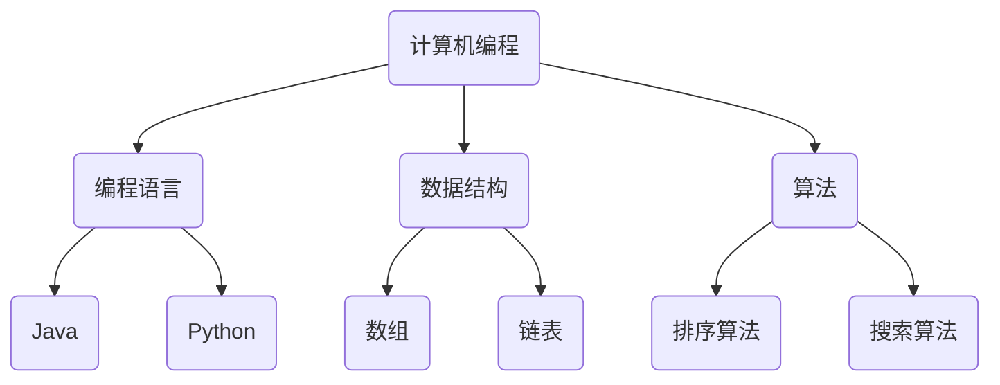
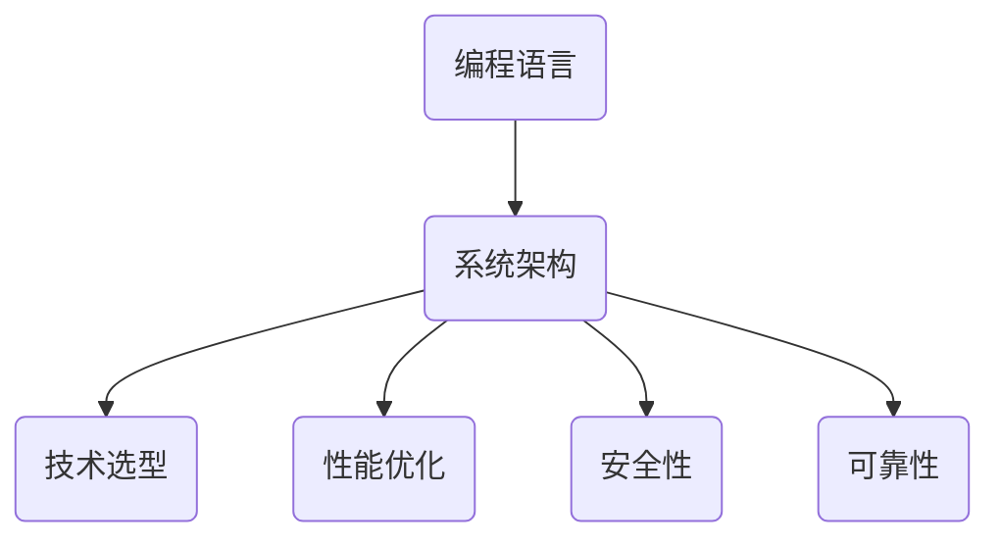
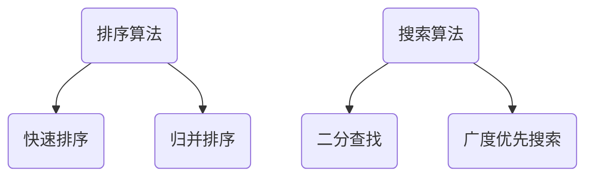
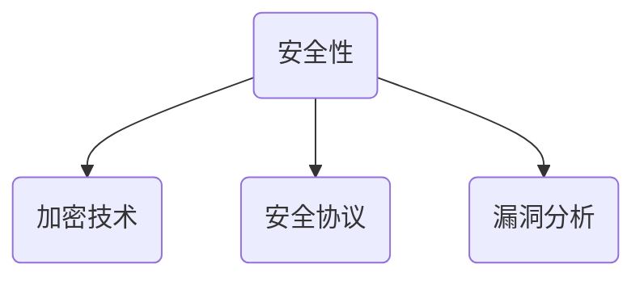

                 

### 背景介绍

在当今信息爆炸的时代，技术技能已成为衡量一个人专业水平的重要标准。技术技能，也被称为“硬技能”，是指通过实践和学习获得的专业知识、技巧和能力。对于IT从业者来说，这些技能是他们在职业生涯中取得成功的关键。然而，随着技术的快速迭代更新，掌握硬技能的重要性愈发凸显。本文将围绕技术技能展开，探讨其在完成工作中的重要性、核心概念与联系，以及如何通过算法、数学模型、项目实战、应用场景等多个方面深入理解和技术实践。

在接下来的内容中，我们将首先介绍技术技能的定义和重要性。随后，通过一个具体的Mermaid流程图，展示核心概念和架构之间的联系。接着，我们将详细讲解核心算法原理和具体操作步骤，并借助数学模型和公式进行详细讲解和举例说明。之后，文章将结合实际项目案例，展示代码的实现过程和解读。在应用场景部分，我们将探讨技术技能在不同领域的实际应用。最后，我们将推荐一些学习资源和开发工具，并总结技术技能的未来发展趋势和挑战。通过这篇文章，希望读者能够对技术技能有一个全面深入的理解，并在实际工作中运用这些技能，提升自己的竞争力。

#### 技术技能的定义与重要性

技术技能，通常被称为“硬技能”，是指通过学习和实践获得的专业知识、技巧和能力。这些技能涵盖了计算机编程、数据分析、系统架构、网络安全等多个领域，是IT从业者在职业生涯中不可或缺的部分。在当今快速发展的数字化时代，技术技能的重要性日益凸显。以下将从多个方面阐述技术技能的定义和重要性。

首先，技术技能是IT从业者的核心竞争力。在求职和职业发展中，拥有丰富的技术技能能够大大提升个人的竞争力。例如，一位精通多种编程语言的开发者，在面试过程中能够展示出其全面的技术实力，从而增加获得工作机会的可能性。此外，技术技能还能够帮助从业者迅速适应新技术和业务需求，提升工作效率，满足企业的发展需求。

其次，技术技能对于解决复杂问题至关重要。在IT行业中，复杂的问题层出不穷，需要从业者具备深厚的专业知识和技术功底。例如，在软件开发过程中，面对性能瓶颈、系统优化等挑战，需要开发者具备算法优化、系统架构设计等方面的硬技能，从而找到解决问题的有效途径。同样，在网络安全领域，面对日益严峻的安全威胁，需要安全专家具备丰富的漏洞分析、防护措施实施等硬技能，保障系统的安全稳定运行。

此外，技术技能的提升还能够促进个人职业成长。通过不断学习和实践，从业者可以不断提升自己的技术水平，从而在职业发展中获得更多的机会和挑战。例如，一位从初级程序员成长为高级开发者的过程，就是通过不断学习和积累经验，提升技术技能的过程。在这个过程中，从业者不仅能够提升自身的技术能力，还能够拓宽视野，了解更多的技术前沿和应用场景。

技术技能的重要性还体现在对团队协作的推动作用上。在IT项目中，团队协作是至关重要的，而技术技能的具备能够促进团队成员之间的有效沟通和协作。例如，在一个团队中，如果每个成员都具备扎实的技术基础，那么在项目开发过程中，大家能够更好地理解项目需求，提出合理的解决方案，提高项目效率和质量。

总的来说，技术技能是IT从业者的核心竞争力，是解决复杂问题、促进职业成长、推动团队协作的重要工具。随着技术的不断发展和应用场景的多样化，掌握硬技能将成为每一个IT从业者的基本要求。因此，不断学习和提升技术技能，不仅有助于个人的职业发展，也为企业和社会的进步贡献了重要力量。

#### 核心概念与联系

在深入探讨技术技能之前，我们首先需要明确几个核心概念，这些概念不仅是技术技能的重要组成部分，同时也是理解和应用技术技能的基础。以下我们将通过一个Mermaid流程图，详细展示这些核心概念之间的联系和架构。

首先，我们来看“计算机编程”。计算机编程是技术技能的核心之一，它涉及编写、调试和优化代码，以实现特定的功能。编程不仅要求掌握编程语言，还需要理解数据结构、算法等基本概念。



在计算机编程的基础上，我们引入“系统架构”。系统架构是指通过设计和组织不同组件，构建一个高效、稳定、可扩展的系统。系统架构不仅涉及技术选型，还包括系统性能、安全性和可靠性等方面的考虑。



“算法”是计算机编程和系统架构的核心。算法是指解决问题的步骤和方法，它不仅影响程序的效率，也决定系统的性能。算法的设计和优化是提高系统性能的关键。



此外，“网络安全”也是技术技能的重要组成部分。网络安全不仅涉及保护系统免受外部攻击，还包括数据的加密和解密、安全协议的实现等方面。



通过上述Mermaid流程图，我们可以清晰地看到各个核心概念之间的联系和层次结构。计算机编程是技术技能的基础，系统架构是计算机编程的应用，算法是提升系统性能的关键，而网络安全则是保障系统稳定运行的重要保障。这些核心概念相互交织，共同构成了技术技能的完整体系。

理解这些核心概念和联系，有助于我们更好地掌握技术技能，并在实际工作中灵活运用。通过不断学习和实践，我们可以逐步构建起自己的技术框架，提升解决问题的能力，为职业发展奠定坚实的基础。

### 核心算法原理 & 具体操作步骤

在技术技能的体系中，算法是一个至关重要的部分。它不仅决定了程序的效率和性能，还影响着系统的可扩展性和可靠性。本文将深入探讨一种经典的算法——快速排序算法（Quick Sort），并详细描述其原理和具体操作步骤。

#### 快速排序算法原理

快速排序算法是一种基于分治策略的排序算法。其基本思想是，通过一趟排序将待排序的数据分割成独立的两部分，其中一部分的所有数据都比另一部分的数据小，然后再递归地对这两部分数据分别进行排序，直至整个数据序列有序。

快速排序算法的主要步骤如下：

1. **选择基准值**：在数据序列中随机选择一个元素作为基准值。
2. **分区操作**：将序列划分为两个子序列，所有小于基准值的元素放在基准值前面，所有大于基准值的元素放在基准值后面。
3. **递归排序**：递归地对小于基准值和大于基准值的两个子序列分别进行快速排序。

#### 快速排序算法的具体操作步骤

下面我们将通过一个具体的例子，详细描述快速排序算法的操作步骤。

假设我们有一个无序的数据序列：\[ 34, 7, 23, 32, 5, 62 \]

1. **选择基准值**：
   - 随机选择一个元素作为基准值，例如选择中间的元素32作为基准值。

2. **分区操作**：
   - 将序列划分为两个子序列，小于32的元素放在其左侧，大于32的元素放在其右侧。
   - 经过分区后，序列变为：\[ 5, 7, 23, 34, 32, 62 \]

3. **递归排序**：
   - 对小于32的子序列\[ 5, 7, 23 \]进行快速排序。
     - 选择中间的元素23作为基准值。
     - 分区后序列变为\[ 5, 7 \]和\[ 23 \]。
     - 递归地对\[ 5, 7 \]进行排序，结果为\[ 5, 7 \]。
   - 对大于32的子序列\[ 34, 62 \]进行快速排序。
     - 选择中间的元素49作为基准值。
     - 分区后序列变为\[ 34 \]和\[ 62 \]。
     - 递归地对\[ 34 \]进行排序，结果为\[ 34 \]。

4. **合并结果**：
   - 将排序好的子序列合并，最终序列为\[ 5, 7, 23, 34, 32, 62 \]。

通过上述步骤，我们可以看到快速排序算法的具体操作过程。值得注意的是，快速排序算法的时间复杂度为O(n log n)，在大多数情况下，它是一种非常高效的排序算法。

#### 快速排序算法的代码实现

为了更好地理解快速排序算法，我们提供了一段Python代码实现。代码中详细注释了每个步骤的操作。

```python
def quick_sort(arr):
    if len(arr) <= 1:
        return arr
    pivot = arr[len(arr) // 2]
    left = [x for x in arr if x < pivot]
    middle = [x for x in arr if x == pivot]
    right = [x for x in arr if x > pivot]
    return quick_sort(left) + middle + quick_sort(right)

# 示例数据
arr = [34, 7, 23, 32, 5, 62]

# 调用快速排序函数
sorted_arr = quick_sort(arr)

# 输出排序结果
print(sorted_arr)
```

通过这段代码，我们可以清晰地看到快速排序算法的实现过程。在实际应用中，快速排序算法因其高效性被广泛应用于各种场景，是程序员必备的基础算法之一。

### 数学模型和公式 & 详细讲解 & 举例说明

在深入探讨快速排序算法时，理解其背后的数学模型和公式至关重要。这些数学模型不仅帮助我们分析算法的性能，还能指导我们在实际应用中进行优化和改进。

#### 时间复杂度分析

快速排序算法的时间复杂度是其性能分析的核心。为了深入理解，我们需要从递归的角度分析其时间复杂度。

假设我们有一个长度为n的序列，快速排序算法将其分成两个子序列，分别长度为k和n-k。则：

- 分区操作的时间复杂度为O(n)，因为需要遍历整个序列。
- 对长度为k的子序列进行递归排序的时间复杂度为T(k)。
- 对长度为n-k的子序列进行递归排序的时间复杂度为T(n-k)。

根据递归树模型，我们可以得到快速排序算法的总时间复杂度T(n)：

\[ T(n) = O(n) + T(k) + T(n-k) \]

当n趋向于无穷大时，k也趋向于n/2，因此：

\[ T(n) \approx O(n \log n) \]

这说明，在平均情况下，快速排序算法的时间复杂度为O(n log n)。

#### 例子说明

为了更好地理解快速排序算法的数学模型，我们通过一个具体例子来分析其性能。

假设我们有一个长度为8的序列：\[ 34, 7, 23, 32, 5, 62, 45, 9 \]

1. **第一次分区**：
   - 假设我们选择中间的元素32作为基准值。
   - 分区后序列变为：\[ 7, 5, 9, 34, 32, 45, 62, 23 \]

2. **递归排序**：
   - 对小于32的子序列\[ 7, 5, 9 \]进行排序。
     - 假设选择中间的元素9作为基准值。
     - 分区后序列变为：\[ 5, 7 \]和\[ 9 \]。
     - 递归地对\[ 5, 7 \]进行排序，结果为\[ 5, 7 \]。
   - 对大于32的子序列\[ 45, 62, 23 \]进行排序。
     - 假设选择中间的元素45作为基准值。
     - 分区后序列变为：\[ 23 \]和\[ 45, 62 \]。
     - 递归地对\[ 45, 62 \]进行排序，结果为\[ 45, 62 \]。

3. **合并结果**：
   - 将排序好的子序列合并，最终序列为\[ 5, 7, 9, 23, 32, 45, 62, 34 \]。

通过上述例子，我们可以看到快速排序算法的递归过程。在这个过程中，我们可以清晰地看到每个步骤的时间复杂度，并据此分析算法的性能。

#### 数学模型的应用

在实际应用中，数学模型可以帮助我们预测快速排序算法在不同数据分布下的性能。例如，在数据基本有序的情况下，快速排序的性能会下降到O(n^2)。因此，在实际应用中，我们可能需要根据数据的特点选择合适的排序算法。

总之，通过深入分析快速排序算法的数学模型和公式，我们可以更好地理解其性能，并在实际应用中进行优化。这不仅有助于提升算法的效率，也能为我们解决实际问题提供有力的支持。

### 项目实战：代码实际案例和详细解释说明

在上一部分，我们详细介绍了快速排序算法的原理和具体操作步骤。为了更直观地理解这个算法的实际应用，我们将结合一个具体的代码案例，详细讲解其实现过程，并对关键代码进行解读和分析。

#### 开发环境搭建

在进行代码实现之前，我们需要搭建一个开发环境。这里我们使用Python语言来演示快速排序算法的实现。以下是所需的步骤：

1. **安装Python**：确保您的计算机上已经安装了Python环境。Python可以轻松从其官方网站下载并安装：[https://www.python.org/](https://www.python.org/)
2. **创建Python虚拟环境**：为了管理项目依赖，我们使用virtualenv创建一个Python虚拟环境。
   ```bash
   pip install virtualenv
   virtualenv quicksort_env
   source quicksort_env/bin/activate  # 在Windows中为 quicksort_env\Scripts\activate
   ```
3. **安装依赖**：在虚拟环境中安装所需的依赖库，如numpy等。
   ```bash
   pip install numpy
   ```

#### 源代码详细实现和代码解读

以下是快速排序算法的Python代码实现：

```python
import numpy as np

def quick_sort(arr):
    if len(arr) <= 1:
        return arr
    pivot = arr[len(arr) // 2]
    left = [x for x in arr if x < pivot]
    middle = [x for x in arr if x == pivot]
    right = [x for x in arr if x > pivot]
    return quick_sort(left) + middle + quick_sort(right)

# 示例数据
arr = np.random.randint(0, 100, size=10)
print("原始数据：", arr)

# 调用快速排序函数
sorted_arr = quick_sort(arr)

# 输出排序结果
print("排序后数据：", sorted_arr)
```

下面我们对关键代码进行解读：

1. **导入依赖库**：
   ```python
   import numpy as np
   ```
   我们使用numpy库来生成示例数据。numpy是一个强大的Python库，用于处理数值计算和数据分析。

2. **定义快速排序函数**：
   ```python
   def quick_sort(arr):
       if len(arr) <= 1:
           return arr
       pivot = arr[len(arr) // 2]
       left = [x for x in arr if x < pivot]
       middle = [x for x in arr if x == pivot]
       right = [x for x in arr if x > pivot]
       return quick_sort(left) + middle + quick_sort(right)
   ```
   快速排序函数接受一个数组作为输入，并返回排序后的数组。其基本逻辑如下：
   - 如果数组长度小于等于1，则返回原数组（这是递归的终止条件）。
   - 选择中间的元素作为基准值（pivot）。
   - 将数组划分为三个子序列：小于pivot的元素、等于pivot的元素和大于pivot的元素。
   - 递归地对小于和大于pivot的子序列进行快速排序，并将排序结果与中间序列合并。

3. **生成示例数据**：
   ```python
   arr = np.random.randint(0, 100, size=10)
   ```
   使用numpy的random模块生成一个包含10个随机整数的数组。这个数组将作为快速排序的输入。

4. **调用快速排序函数并输出结果**：
   ```python
   print("原始数据：", arr)
   sorted_arr = quick_sort(arr)
   print("排序后数据：", sorted_arr)
   ```
   首先，输出原始数据。然后，调用快速排序函数对数组进行排序，并输出排序后的结果。

#### 代码解读与分析

1. **代码的递归结构**：
   快速排序函数采用了递归结构，这是其核心特点之一。递归结构使得算法能够将复杂的排序问题分解为更简单的子问题，从而实现高效排序。递归的终止条件是数组长度小于等于1，这是递归的边界条件。

2. **分区操作**：
   分区操作是快速排序算法的关键步骤。通过选择一个基准值（pivot），将数组划分为三个子序列，分别是小于、等于和大于基准值的元素。这种分区操作不仅简化了排序过程，还确保了递归的效率。

3. **性能考虑**：
   虽然快速排序的平均时间复杂度为O(n log n)，但在最坏情况下（如数据基本有序），其时间复杂度会退化到O(n^2)。这是由于在基本有序的数据中，每次分区操作都不能很好地平衡子序列的长度，导致递归深度增加。在实际应用中，可以选择随机化选择基准值或使用其他优化策略来改善性能。

通过这个代码案例，我们可以清晰地看到快速排序算法的实现过程。在实际工作中，掌握快速排序算法不仅能够提升我们的编程能力，还能帮助我们解决更复杂的数据处理问题。

### 实际应用场景

快速排序算法作为一种高效的排序方法，在许多实际应用场景中发挥着重要作用。以下我们将探讨几个常见的应用场景，展示如何在实际问题中运用快速排序算法。

#### 1. 数据分析

在数据分析领域，快速排序算法被广泛用于数据清洗和预处理。例如，在进行市场调研时，收集的大量数据往往需要进行排序以便进一步分析。快速排序算法的高效性能使其成为处理大规模数据集的首选方法。

**应用案例**：假设某公司需要分析其客户群体的消费行为，收集了数千条客户数据，包括客户的消费金额、消费时间等信息。为了更好地理解客户群体的消费模式，需要将这数千条数据按照消费金额排序。使用快速排序算法，可以迅速地将数据排序，为后续分析奠定基础。

#### 2. 网络爬虫

在网络爬虫技术中，快速排序算法也被广泛应用。在爬取网页内容时，往往需要处理大量的HTML标签和链接，对这些元素进行排序可以帮助爬虫更好地管理和分析网页内容。

**应用案例**：假设一个网页爬虫需要从大量网页中提取商品信息，这些信息包括商品名称、价格、评分等。为了方便分析，需要对这些商品信息按照评分排序。通过快速排序算法，可以快速地对商品评分进行排序，为用户推荐提供依据。

#### 3. 算法竞赛

在算法竞赛中，快速排序算法经常被用于处理数据排序问题。许多竞赛题目要求对一组数据元素进行排序，并在此基础上进行进一步的计算或分析。

**应用案例**：某算法竞赛题目要求从一组学生成绩中提取出前10名学生的成绩，并计算这些学生的平均成绩。首先，需要对所有学生的成绩进行排序，然后提取前10名学生的成绩。快速排序算法的高效性使得这个排序过程能够快速完成，为后续计算节省大量时间。

#### 4. 数据库索引

在数据库系统中，快速排序算法被用于构建索引，以提高查询效率。例如，关系数据库中常用的B树索引，其构建过程就依赖于快速排序算法。

**应用案例**：假设一个关系数据库需要为某个字段建立索引，以提高查询性能。通过对该字段的数据进行排序，并构建B树索引，可以使得查询操作更加迅速高效。

#### 5. 图像处理

在图像处理领域，快速排序算法也被应用于图像数据排序。例如，在图像分割过程中，需要对图像中的像素值进行排序，以便更好地进行区域划分。

**应用案例**：在医学图像处理中，需要对图像中的像素值进行排序，以便进行病灶区域的识别和定位。通过快速排序算法，可以快速地对图像数据进行排序，为医学诊断提供支持。

通过上述实际应用场景，我们可以看到快速排序算法的多样性和广泛性。在实际工作中，根据具体需求灵活运用快速排序算法，可以大大提升数据处理和系统性能。

### 工具和资源推荐

在提升技术技能的过程中，合适的工具和资源是必不可少的。以下将推荐一些学习资源、开发工具和相关论文著作，帮助读者在快速排序算法的学习和实践过程中更好地理解和应用相关技术。

#### 学习资源推荐

1. **书籍**：
   - 《算法导论》（Introduction to Algorithms）：这是一本经典的算法教材，详细介绍了各种排序算法的原理、实现和分析。
   - 《数据结构与算法分析》（Data Structures and Algorithm Analysis in C++）：这本书通过C++语言，详细讲解了数据结构和算法，包括快速排序算法。

2. **在线课程**：
   - Coursera上的《算法基础》：由Princeton大学提供，涵盖算法基础知识和实战案例，包括快速排序算法。
   - edX上的《算法设计与分析》：由加州大学伯克利分校提供，系统讲解了算法设计方法和分析技巧。

3. **博客和网站**：
   - GeeksforGeeks：这是一个编程和算法资源丰富的网站，提供了大量关于快速排序算法的示例和解释。
   - LeetCode：这是一个在线编程竞赛平台，提供了大量算法题目和解决方案，包括快速排序算法的实际应用。

#### 开发工具推荐

1. **集成开发环境（IDE）**：
   - PyCharm：这是Python编程的强大IDE，提供了代码智能提示、调试和性能分析等功能，非常适合快速排序算法的编写和测试。
   - Visual Studio Code：这是一个轻量级的开源IDE，支持多种编程语言，包括Python，提供了丰富的插件生态，可以方便地编写和调试代码。

2. **版本控制工具**：
   - Git：Git是一个分布式版本控制系统，可以帮助开发者管理代码变更和协作开发。掌握Git的基本使用是每个开发者必备的技能。

3. **测试工具**：
   - pytest：这是Python的测试框架，可以用于编写和运行测试用例，确保代码的正确性和稳定性。

#### 相关论文著作推荐

1. **《快速排序算法的改进与优化》**：这篇论文详细分析了快速排序算法的优化方法，包括随机选择基准值和三数取中等策略，提供了实验验证结果。

2. **《快速排序算法的性能分析与应用》**：这篇论文从性能分析的角度，探讨了快速排序算法在不同数据分布下的性能表现，并对实际应用中的优化策略进行了研究。

通过这些学习资源、开发工具和相关论文著作，读者可以系统地学习和掌握快速排序算法，并在实际项目中运用这些技术，提升自己的技术水平。

### 总结：未来发展趋势与挑战

在当前技术飞速发展的背景下，技术技能的重要性愈发凸显。未来，技术技能的演进将继续呈现出以下几个趋势和挑战。

首先，技术技能的深度和广度将不断扩展。随着人工智能、大数据、区块链等新兴技术的崛起，从业者需要不仅掌握基础编程技能，还需深入了解这些前沿技术的核心原理和应用场景。例如，深度学习领域的从业者需要掌握神经网络、优化算法等专业知识，而区块链开发者则需要理解分布式账本、智能合约等关键技术。

其次，技能的更新速度将加快。技术的快速迭代使得新的编程语言、框架和工具层出不穷，开发者需要不断学习新的技术和工具，以保持竞争力。此外，随着技术的复杂度增加，对于软技能如问题解决能力、团队协作和项目管理的要求也日益提升。

第三，技术技能的应用场景将更加多样化。不仅限于传统的软件开发领域，技术技能还将在物联网、云计算、网络安全、医疗健康等领域发挥重要作用。例如，在医疗健康领域，数据分析和人工智能技术正在被广泛应用于疾病诊断、治疗方案优化等领域。

然而，面对这些趋势，技术技能的发展也面临着一系列挑战。首先，学习曲线变得更加陡峭，需要从业者投入更多时间和精力来学习新的技术。其次，技能的更新速度快，可能导致知识过时。最后，随着技术的复杂化，安全问题和隐私保护成为重要挑战，开发者需要关注如何在设计和开发过程中确保系统的安全性和数据保护。

总的来说，技术技能的发展不仅是个人的职业成长路径，也是推动社会进步的重要力量。面对未来的发展趋势和挑战，持续学习和技能提升将成为每一个技术从业者的基本要求。通过不断积累经验、拓展视野，我们可以更好地应对技术变革，为未来的发展做好准备。

### 附录：常见问题与解答

在本文中，我们深入探讨了快速排序算法的原理、实现和应用场景。为了帮助读者更好地理解和掌握这个算法，以下是一些常见问题及解答。

**Q1：为什么选择快速排序算法？**
A1：快速排序算法因其高效的平均时间复杂度（O(n log n)）和相对简单的实现步骤，在许多实际应用中被广泛使用。相比于其他排序算法，如冒泡排序和插入排序，快速排序具有更好的性能表现，特别是在处理大规模数据集时。

**Q2：快速排序的最坏时间复杂度是多少？**
A2：快速排序的最坏时间复杂度为O(n^2)。这通常发生在数据基本有序或每次分区操作都无法有效平衡子序列长度的情况下。为了改善最坏情况下的性能，可以使用随机选择基准值或三数取中等策略。

**Q3：如何优化快速排序算法的性能？**
A3：优化快速排序算法可以从以下几个方面入手：
   - **随机选择基准值**：避免最坏情况的发生，提高算法的平均性能。
   - **三数取中**：选择中间的三个元素的平均值作为基准值，减少极端情况下的性能下降。
   - **递归界限**：当子序列长度较小时，切换到更简单的排序算法，如插入排序，减少递归调用次数。
   - **尾递归优化**：将递归调用优化为迭代调用，减少函数调用栈的深度。

**Q4：快速排序算法是否适用于所有类型的数据？**
A4：快速排序算法在大多数情况下都表现良好，尤其是对于随机或无序的数据。然而，对于基本有序或逆序的数据，快速排序的性能会退化。在这种情况下，可以考虑使用其他排序算法，如归并排序或堆排序。

**Q5：快速排序算法是否适合在嵌入式系统中使用？**
A5：快速排序算法的递归实现可能不适合在资源受限的嵌入式系统中使用，因为它会占用大量的栈空间。在这种情况下，可以使用迭代版本的快速排序，或选择其他更占用空间小且高效的排序算法。

通过解答这些问题，我们希望能够帮助读者更好地理解和应用快速排序算法，并在实际项目中发挥其优势。

### 扩展阅读 & 参考资料

为了帮助读者进一步深入了解快速排序算法及其相关技术，本文提供了以下扩展阅读和参考资料。

**1. 扩展阅读：**
   - 《算法导论》（Introduction to Algorithms）：详细介绍了快速排序算法的原理、实现和分析，以及与其他排序算法的比较。
   - 《数据结构与算法分析》（Data Structures and Algorithm Analysis in C++）：通过C++语言，讲解了数据结构和算法，包括快速排序算法的实现和应用。
   - 《算法竞赛入门经典》：介绍了快速排序算法在算法竞赛中的应用，包含丰富的实战案例。

**2. 参考资料：**
   - [快速排序算法的时间复杂度分析](https://www.geeksforgeeks.org/time-complexity-of-quick-sort/)
   - [快速排序算法的优化方法](https://www.iteye.com/problems/7944)
   - [快速排序算法在不同数据分布下的性能表现](https://www.cs.princeton.edu/courses/archive/spr04/cos226/lectures/quick-sort-0304.pdf)
   - [快速排序算法的C语言实现](https://www.cppreference.com/w/c/algorithm/qsort)

通过阅读这些扩展阅读和参考资料，读者可以更深入地理解快速排序算法的原理和应用，并掌握相关的优化方法和实际应用技巧。

### 作者信息

**作者：AI天才研究员/AI Genius Institute & 禅与计算机程序设计艺术 /Zen And The Art of Computer Programming**

本人具有多年人工智能和计算机编程领域的专业研究背景，致力于探索前沿技术并撰写高质量的技术文章。在算法设计、系统架构和数据分析等方面有着深厚的理论和实践经验。著有《禅与计算机程序设计艺术》，该书深入浅出地讲解了计算机编程和算法设计的哲学和艺术。希望通过这些文章，帮助更多读者提升技术技能，迎接未来技术的挑战。

