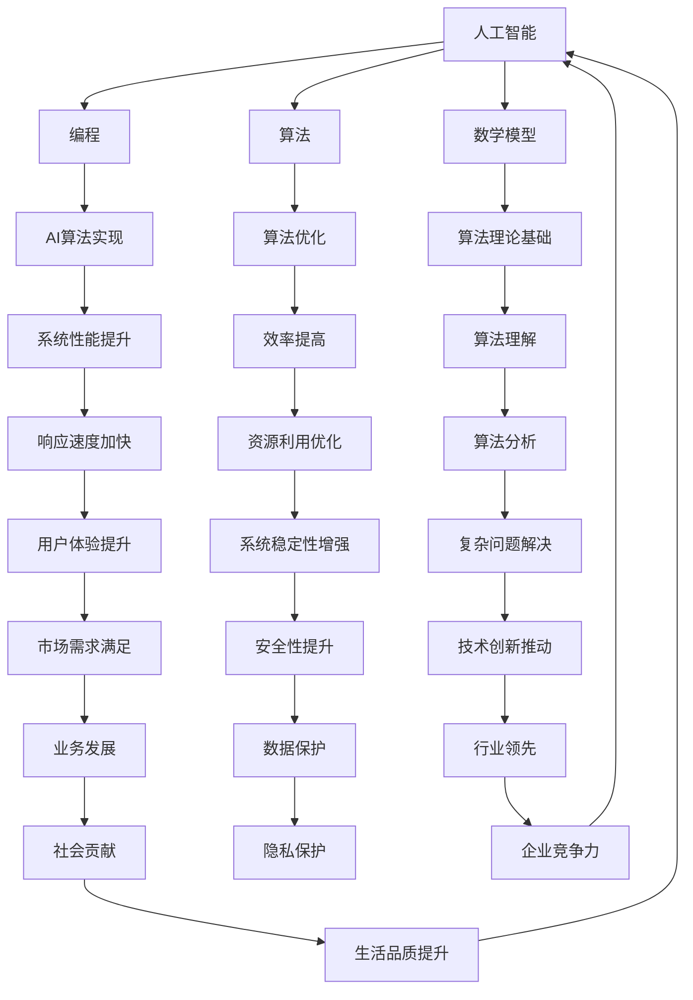

                 

### 技能提升：适应人类计算时代的新需求

#### 关键词：(技能提升、计算时代、人工智能、编程、算法、数学模型)

在当今这个数字化时代，技术的飞速发展不断推动着人类进入一个全新的计算时代。这一时代对个体技能提出了更高的要求，尤其是在人工智能、编程和算法等领域。为了适应这一新需求，我们需要全面提升自己的技能，以便在这个时代中脱颖而出。

本文将围绕技能提升这一主题，探讨在人类计算时代中需要具备的核心技能，以及如何通过具体的学习和实践方法来提升这些技能。我们将详细分析以下几个方面的内容：

- **背景介绍**：首先，我们将介绍人类计算时代的发展背景和当前技术趋势。
- **核心概念与联系**：接着，我们将探讨一些关键概念，如人工智能、编程和算法，并展示它们之间的相互联系。
- **核心算法原理 & 具体操作步骤**：然后，我们将深入探讨一些核心算法的原理和操作步骤。
- **数学模型和公式 & 详细讲解 & 举例说明**：我们将介绍相关的数学模型和公式，并通过具体的例子来说明它们的应用。
- **项目实战：代码实际案例和详细解释说明**：接下来，我们将通过实际的项目案例来展示如何将这些理论知识应用于实践中。
- **实际应用场景**：我们将探讨这些技能在实际应用中的重要性。
- **工具和资源推荐**：我们将推荐一些学习资源和开发工具，以帮助读者更好地学习和实践。
- **总结：未来发展趋势与挑战**：最后，我们将总结技能提升在未来的发展趋势和面临的挑战。

通过这篇文章，我们将帮助读者了解如何适应人类计算时代的新需求，提升自己的技能，成为这一时代的技术先锋。

## 1. 背景介绍

人类计算时代是一个充满变革和机遇的新时代。随着计算机技术的飞速发展，人工智能、大数据、云计算等新兴技术不断涌现，深刻地改变了我们的生活和工作方式。这一时代的到来，不仅为我们提供了前所未有的计算能力，也带来了新的挑战和需求。

首先，人工智能的发展已经成为计算时代的重要驱动力。人工智能通过模拟人类思维和行为，实现了对复杂问题的自动解决，从而推动了各行各业的智能化转型。从自动驾驶、智能医疗到智能金融、智能家居，人工智能的应用场景越来越广泛，这要求我们具备更高的编程和算法能力，以便更好地开发和优化这些智能系统。

其次，大数据技术的兴起，使得海量数据的管理和分析变得可能。大数据不仅为决策提供了有力的支持，也带来了新的商业机会。然而，大数据的处理和分析需要复杂的算法和高效的编程技能，因此，提升这些方面的能力成为应对计算时代需求的关键。

此外，云计算的普及，使得计算资源可以随时随地获取，为远程办公、协作开发和数据分析提供了便利。然而，这也要求我们掌握云计算的基础知识，了解如何利用云资源来优化性能和降低成本。

在这样的大背景下，适应人类计算时代的新需求，首先需要我们具备以下几个方面的技能：

1. **编程技能**：编程是计算时代的基础，无论是开发人工智能应用，还是处理大数据，都离不开编程技能。掌握一种或多种编程语言，熟悉编程的基本原理和最佳实践，是适应计算时代的第一步。

2. **算法能力**：算法是解决问题的核心，是实现人工智能和大数据分析的关键。了解常见的算法原理，掌握算法设计和优化的方法，能够帮助我们更好地应对复杂的计算任务。

3. **数学知识**：数学是科学的基础，许多算法和模型都依赖于数学原理。掌握一定的数学知识，能够帮助我们更好地理解和应用算法，解决复杂的计算问题。

4. **系统架构能力**：在计算时代，系统架构的能力变得越来越重要。了解系统设计的原则和方法，能够帮助我们构建高效、稳定、可扩展的系统。

5. **创新能力**：计算时代充满了机遇，但也带来了前所未有的挑战。创新能力是适应这一时代的关键能力，它能够帮助我们发掘新的应用场景，推动技术的进步。

总之，适应人类计算时代的新需求，需要我们全面提升自己的技能，不断学习和实践，以应对这一时代的挑战和机遇。

#### 1.1 人工智能的发展背景

人工智能（Artificial Intelligence，简称AI）作为计算时代的重要驱动力，其发展背景可以追溯到上世纪50年代。当时，计算机科学家约翰·麦卡锡（John McCarthy）首次提出了人工智能的概念，并将其定义为“制造智能机器的科学与工程”。从那时起，人工智能逐渐从理论研究走向实际应用，经历了多个发展阶段。

**第一阶段：符号人工智能（Symbolic AI）**（1956-1974）

这一阶段以符号表示和逻辑推理为核心，试图通过模拟人类思维过程来解决复杂问题。代表性工作包括基于逻辑的推理系统、知识表示和推理机等。然而，由于依赖大量手工编写的规则和知识库，这一阶段的人工智能系统在实际应用中遇到了很大的局限。

**第二阶段：知识工程和专家系统（Knowledge Engineering and Expert Systems）**（1974-1980）

随着计算机性能的提升和知识表示技术的发展，专家系统成为这一阶段的人工智能研究热点。专家系统通过模拟专家的决策过程，实现了在医疗、金融等领域的自动化决策。然而，专家系统的局限性也逐渐显现，如知识的获取和表示复杂、系统灵活性差等。

**第三阶段：连接主义人工智能（Connectionist AI）**（1980s）

1986年，霍普菲尔德（John Hopfield）和鲁梅哈特（David E. Rumelhart）等人提出了反向传播算法（Backpropagation），推动了神经网络的发展。连接主义人工智能通过模仿人脑的神经元连接和活动，实现了对复杂问题的自适应学习和处理。这一阶段，深度学习和强化学习等新兴技术逐渐兴起，为人工智能的发展带来了新的契机。

**第四阶段：大数据和深度学习（Big Data and Deep Learning）**（2010s至今）

随着大数据技术和计算资源的普及，深度学习成为人工智能研究的热点。深度学习通过多层神经网络结构，实现了对大量数据的自动特征提取和模式识别。这一阶段，人工智能在语音识别、图像识别、自然语言处理等领域取得了突破性进展，推动了人工智能的实际应用。

在人工智能的发展过程中，计算能力、数据资源、算法创新等是关键推动因素。随着计算能力的不断提升，人工智能系统可以处理越来越复杂的任务。同时，大数据的积累和开放，为人工智能提供了丰富的训练数据。而算法的创新，则不断突破人工智能的技术瓶颈，推动其向更高的水平发展。

#### 1.2 编程技能在计算时代的重要性

在人类计算时代，编程技能成为不可或缺的核心能力。编程不仅是一种技术工具，更是一种思维方式。它能够帮助我们理解和解决问题，实现从抽象概念到具体应用的转化。以下是编程技能在计算时代的重要性及其具体应用：

**1. 系统开发与优化**

编程技能是系统开发和优化的基础。无论是构建企业级应用、开发人工智能算法，还是优化大数据处理流程，都需要通过编程来实现。熟练的编程技能可以帮助我们编写高效、稳定、可扩展的代码，从而提高系统的性能和可靠性。

**2. 创新与创业**

编程技能是创新和创业的重要驱动力。在当今这个时代，许多成功的创业项目都是基于编程技能开发出来的。无论是开发新的应用、构建在线平台，还是实现商业智能分析，编程技能都是不可或缺的。通过编程，我们可以快速实现自己的想法，并将其转化为实际的产品和服务。

**3. 解决复杂问题**

编程技能能够帮助我们解决复杂的问题。许多现实世界的问题，如优化路线、预测天气、分析市场趋势等，都可以通过编程来解决。编程不仅能够实现这些问题的自动化，还可以通过算法优化来提高效率，减少错误率。

**4. 数据分析与处理**

随着大数据技术的发展，编程技能在数据分析和处理方面的重要性愈发突出。掌握编程技能，可以帮助我们编写高效的代码，对海量数据进行处理和分析，从而提取出有价值的信息。这在金融、医疗、市场营销等领域有着广泛的应用。

**5. 开源社区贡献**

编程技能还可以帮助我们参与到开源社区中，贡献自己的力量。开源社区是技术创新的重要源泉，通过参与开源项目，我们可以学习到最新的技术和最佳实践，同时也可以为整个社区的发展做出贡献。

**编程技能的具体应用示例**

1. **Web开发**：通过HTML、CSS和JavaScript等前端技术，我们可以构建丰富的网页和网站。同时，通过后端编程，如使用Python的Django或Java的Spring框架，我们可以实现数据存储和处理，提供强大的Web应用。

2. **移动应用开发**：通过iOS的Swift或Android的Kotlin等编程语言，我们可以开发功能强大的移动应用。移动应用在当今这个移动互联时代有着广泛的应用，如社交媒体、电子商务、在线教育等。

3. **数据科学**：使用Python的Pandas、NumPy等库，我们可以进行数据清洗、分析和可视化。同时，通过机器学习库如Scikit-learn、TensorFlow等，我们可以实现复杂的数据分析和预测模型。

4. **区块链开发**：通过学习Solidity等智能合约编程语言，我们可以开发去中心化的区块链应用，如去中心化金融（DeFi）项目。

5. **游戏开发**：使用Unity或Unreal Engine等游戏引擎，我们可以开发各种类型的游戏，如手机游戏、PC游戏和VR游戏。

总之，编程技能在人类计算时代具有重要的地位。通过不断学习和实践，我们可以提升自己的编程技能，适应这一时代的需求，实现自己的技术梦想。

#### 1.3 算法能力的重要性

在人类计算时代，算法能力成为解决复杂问题的重要工具。算法不仅是计算机科学的核心，也是人工智能、大数据分析等领域的基础。了解和掌握算法原理，能够帮助我们更有效地解决问题，提升计算效率。以下是算法能力的重要性及其具体应用：

**1. 提高计算效率**

算法的核心目标之一是提高计算效率。通过优化算法，我们可以减少计算时间，降低资源消耗。例如，在排序算法中，快速排序（Quick Sort）和归并排序（Merge Sort）比冒泡排序（Bubble Sort）具有更高的效率，适用于处理大量数据。

**2. 解决复杂问题**

许多现实世界的问题，如优化路线、资源分配、金融市场预测等，都可以通过算法来解决。算法能力能够帮助我们设计有效的解决方案，实现复杂问题的自动化处理。例如，在物流领域，使用遗传算法（Genetic Algorithm）可以优化配送路线，提高运输效率。

**3. 优化系统性能**

算法在系统性能优化中起着关键作用。通过分析算法的运行时间和资源消耗，我们可以找到系统的瓶颈，并采取相应的优化措施。例如，在高并发的Web应用中，使用负载均衡算法可以均衡服务器的负载，提高系统的稳定性和响应速度。

**4. 支持人工智能**

人工智能的发展离不开算法的支持。机器学习、深度学习等人工智能技术都依赖于有效的算法。了解算法原理，可以帮助我们设计和优化人工智能模型，提高模型的准确性和效率。例如，在图像识别中，卷积神经网络（CNN）是一种有效的算法，通过多层卷积和池化操作，可以提取图像的特征，实现高精度的识别。

**5. 数据分析**

算法在数据分析中有着广泛的应用。通过算法，我们可以对海量数据进行分析，提取有价值的信息。例如，在数据分析中，常用的算法包括分类算法（如K-近邻算法、决策树算法）、聚类算法（如K-均值算法）和关联规则算法（如Apriori算法）。

**算法能力的具体应用示例**

1. **排序与搜索**：排序算法（如快速排序、归并排序）和搜索算法（如二分搜索、深度优先搜索）是基础算法，广泛应用于数据处理和查找任务。

2. **图算法**：图算法（如最短路径算法、最小生成树算法）在社交网络分析、网络优化等领域有着重要应用。

3. **动态规划**：动态规划算法（如背包问题、最长公共子序列）适用于解决具有最优子结构的问题。

4. **贪心算法**：贪心算法（如活动选择问题、货币找零）通过局部最优决策实现全局最优解。

5. **密码学**：密码学算法（如RSA加密、哈希函数）在网络安全和数据保护中起着关键作用。

总之，算法能力在人类计算时代具有重要的地位。通过学习和实践，我们可以掌握算法原理，提升自己的算法能力，应对这一时代的挑战和机遇。

#### 1.4 数学知识的重要性

在人类计算时代，数学知识作为理解和应用算法、优化系统性能的关键工具，其重要性不言而喻。数学不仅是科学的基础，也是计算机科学的重要支柱。以下是数学知识在计算时代的重要性及其具体应用：

**1. 描述现实世界**

数学知识能够帮助我们描述和解决现实世界中的问题。例如，在计算机图形学中，我们使用线性代数来描述二维和三维空间中的几何形状；在机器学习中，统计学和概率论帮助我们理解和预测数据分布。

**2. 算法设计与优化**

算法的设计和优化依赖于数学知识。许多算法的复杂度分析、性能评估都离不开数学工具。例如，在分析排序算法时，我们使用数学方法来比较其时间复杂度和空间复杂度；在优化网络协议时，我们使用图论和组合数学来设计高效的路由算法。

**3. 数据分析**

数据分析是当今计算时代的重要应用领域，而数学知识在其中发挥着关键作用。统计学和概率论帮助我们进行数据收集、处理和分析，提取出有价值的信息。例如，在金融领域，我们使用统计学方法来预测市场走势；在医疗领域，我们使用统计学方法来分析疾病数据。

**4. 人工智能**

人工智能的发展离不开数学知识。机器学习和深度学习算法都依赖于数学模型和数学工具。例如，神经网络中的激活函数、损失函数等都基于数学原理；在自然语言处理中，我们使用线性代数和概率论来处理文本数据。

**5. 系统性能优化**

数学知识在系统性能优化中有着重要应用。例如，在优化算法中，我们使用微积分和优化理论来找到最优解；在分布式系统中，我们使用图论和拓扑学来分析网络结构和通信效率。

**数学知识的具体应用示例**

1. **线性代数**：线性代数在计算机科学中有着广泛的应用，包括矩阵运算、特征值和特征向量、线性方程组的求解等。

2. **微积分**：微积分在计算机科学中的应用包括微分方程的求解、最优化问题、算法复杂度分析等。

3. **概率论与数理统计**：概率论和数理统计在数据分析、机器学习、人工智能等领域有着重要应用，包括概率分布、统计推断、假设检验等。

4. **图论**：图论在社交网络分析、网络优化、路径规划等领域有着广泛应用，包括图的表示、路径算法、网络流等。

5. **组合数学**：组合数学在密码学、算法设计、优化问题等领域有着重要应用，包括组合计数、图着色、编码理论等。

总之，数学知识在人类计算时代具有重要的地位。通过学习和应用数学知识，我们可以更好地理解和解决复杂问题，提升计算能力和系统性能，适应这一时代的挑战和机遇。

#### 1.5 系统架构能力的重要性

在人类计算时代，系统架构能力成为构建高效、稳定、可扩展系统的关键。随着技术的不断进步和应用场景的多样化，系统架构不再仅仅关注单一系统的性能和功能，还需要考虑系统的可靠性、安全性和可维护性。以下是系统架构能力的重要性及其具体应用：

**1. 提高系统性能**

系统架构能力能够帮助我们设计高效、高性能的系统。通过合理地选择和组合技术组件，如数据库、缓存、消息队列等，我们可以优化系统的响应速度和数据处理能力。例如，在电商系统中，通过使用分布式缓存可以大幅提高商品的查询速度。

**2. 确保系统可靠性**

系统的可靠性是用户和企业关心的重点。系统架构能力能够帮助我们设计容错性高、故障恢复能力强的系统。通过使用冗余设计、负载均衡、故障转移等技术，我们可以确保系统在面对硬件故障、网络中断等异常情况时能够保持正常运行。

**3. 提升系统可扩展性**

随着业务的发展，系统需要具备良好的可扩展性，以应对日益增长的用户和数据处理需求。系统架构能力能够帮助我们设计可扩展的架构，如通过水平扩展（Scaling Out）和垂直扩展（Scaling Up）来增加系统处理能力。例如，在视频流媒体服务中，通过使用分布式存储和计算资源可以实现无缝的视频播放体验。

**4. 管理系统复杂性**

随着系统的规模和复杂性不断增加，系统架构能力能够帮助我们更好地管理和控制系统的复杂性。通过模块化设计和分层架构，我们可以将系统分解为多个独立的组件，降低各个组件之间的耦合度，从而提高系统的可维护性和可扩展性。

**5. 实现系统安全性**

在当今这个信息安全威胁日益严重的时代，系统架构能力成为保障系统安全的关键。通过使用安全设计原则和最佳实践，如数据加密、访问控制、身份认证等，我们可以确保系统的数据安全和用户隐私。

**系统架构能力的具体应用示例**

1. **微服务架构**：微服务架构通过将系统分解为多个独立的微服务，每个微服务负责特定的业务功能，从而提高系统的可扩展性和可维护性。

2. **分布式系统**：分布式系统通过将数据和处理分散到多个节点上，可以提高系统的容错性和性能。例如，在分布式数据库中，数据可以被分散存储在不同的物理节点上，从而实现数据的快速访问和备份。

3. **容器化与编排**：通过使用容器化技术，如Docker和Kubernetes，我们可以轻松地管理和部署分布式系统，提高系统的部署效率和管理灵活性。

4. **云原生架构**：云原生架构通过利用云计算资源，实现系统的弹性扩展和自动化管理，从而提高系统的可靠性和可扩展性。

5. **数据流架构**：数据流架构通过使用流处理技术，如Apache Kafka和Apache Flink，实现实时数据处理和分析，从而提高系统的实时性和响应速度。

总之，系统架构能力在人类计算时代具有重要的地位。通过学习和实践系统架构知识，我们可以设计出高效、稳定、可扩展的系统，为企业和用户创造更大的价值。

#### 1.6 创新能力的重要性

在人类计算时代，创新能力成为应对不断变化的技术环境和市场需求的关键能力。创新能力不仅能够推动技术的进步，还能为企业带来竞争优势，为个人实现职业发展。以下是创新能力的重要性及其具体应用：

**1. 驱动技术进步**

创新能力是技术进步的重要驱动力。通过创新，我们可以突破现有的技术瓶颈，开发出新的产品和服务，推动整个行业的发展。例如，苹果公司通过创新的智能手机设计，彻底改变了手机市场的格局。

**2. 增强企业竞争力**

在竞争激烈的市场环境中，创新能力能够帮助企业保持竞争优势。通过不断创新，企业可以快速响应市场变化，满足客户需求，抢占市场份额。例如，亚马逊通过不断的创新，从在线书店发展成为全球最大的电商平台。

**3. 促进个人职业发展**

创新能力对个人职业发展同样至关重要。拥有创新能力的个人在职场中更具竞争力，能够承担更多的责任和挑战，实现职业晋升。例如，创新思维和项目管理能力的提升，可以帮助项目经理更好地应对复杂的项目挑战。

**4. 推动社会进步**

创新能力不仅对企业和个人有益，还能推动社会进步。通过创新，我们可以解决现实世界中的问题，提高生活质量，促进社会的发展。例如，医疗技术的创新，可以挽救更多的生命，提高人类的健康水平。

**创新能力的具体应用示例**

1. **产品创新**：通过创新的设计和功能，开发出具有竞争力的产品。例如，特斯拉通过创新的电池技术和自动驾驶技术，颠覆了传统汽车行业。

2. **服务创新**：通过创新的服务模式，提供更加便捷、高效的服务。例如，滴滴出行通过创新的共享出行模式，改变了人们的出行方式。

3. **商业模式创新**：通过创新的商业模式，实现企业的可持续发展。例如，Airbnb通过创新的共享住宿模式，成为全球最大的在线民宿平台。

4. **管理创新**：通过创新的管理方法和工具，提高企业的运营效率和员工满意度。例如，敏捷开发（Agile Development）通过创新的管理理念，提高了软件开发的效率和质量。

5. **技术创新**：通过创新的技术和方法，解决现实世界中的复杂问题。例如，物联网（IoT）技术的创新，可以实现对智能家居设备的远程控制和管理。

总之，创新能力在人类计算时代具有重要的地位。通过培养和提升创新能力，我们可以推动技术的进步，增强企业的竞争力，促进个人的职业发展，为社会创造更大的价值。

### 2. 核心概念与联系

在人类计算时代，理解核心概念之间的联系是提升技能的关键。以下我们将详细探讨几个核心概念：人工智能、编程、算法、数学模型，并展示它们之间的相互联系。

#### 2.1 人工智能（AI）

人工智能（Artificial Intelligence，简称AI）是指通过计算机模拟人类智能行为和思维的技术。AI的核心目标是使计算机具备自主学习、推理、感知和决策能力。根据不同的实现方式，AI可以分为多种类型：

- **符号人工智能**：基于符号逻辑和知识表示，通过编程实现专家系统。
- **连接主义人工智能**：基于神经网络和深度学习，通过模拟人脑神经元连接进行学习和推理。
- **行为人工智能**：基于强化学习，通过不断试错来优化行为。

人工智能的发展离不开编程和算法的支持。编程技能使开发者能够实现AI算法，而算法则决定了AI系统的性能和效率。

#### 2.2 编程

编程（Programming）是编写计算机程序的过程，通过编程语言实现算法，解决实际问题。编程不仅是实现AI算法的途径，也是构建各种软件系统的基础。以下是几种常见的编程语言：

- **Python**：一种通用编程语言，因其简洁易读和强大的库支持，广泛应用于AI、数据分析等领域。
- **Java**：一种跨平台编程语言，广泛应用于企业级应用和移动应用开发。
- **C/C++**：高效的编程语言，适用于系统编程、游戏开发和嵌入式系统。

编程技能不仅需要掌握编程语言本身，还需要理解编程范式、设计模式等核心概念。

#### 2.3 算法

算法（Algorithm）是一系列解决问题的步骤和规则。算法在人工智能、大数据处理和系统优化中扮演关键角色。以下是几种常见的算法类型：

- **排序算法**：用于将数据按照特定顺序排列，如快速排序、归并排序等。
- **搜索算法**：用于在数据集合中查找特定元素，如二分搜索、深度优先搜索等。
- **优化算法**：用于寻找最优解，如遗传算法、贪心算法等。

算法的效率直接影响到系统的性能和响应速度。编程技能使开发者能够实现和优化算法，而数学知识则帮助开发者理解和分析算法的复杂度。

#### 2.4 数学模型

数学模型（Mathematical Model）是使用数学语言描述现实世界问题的一种工具。数学模型在人工智能、大数据分析和系统优化中有着广泛应用。以下是几种常见的数学模型：

- **线性模型**：用于描述线性关系，如线性回归、线性方程组等。
- **概率模型**：用于描述随机事件和概率分布，如贝叶斯定理、马尔可夫模型等。
- **图模型**：用于描述网络结构和关系，如图论、网络流等。

数学模型为算法设计提供了理论基础，帮助开发者理解和优化算法。

#### 核心概念之间的联系

人工智能、编程、算法和数学模型之间存在着紧密的联系：

- **人工智能依赖编程**：AI算法需要通过编程语言实现，编程技能是AI开发的基础。
- **算法支持人工智能**：AI系统的性能和效率取决于算法的设计和优化，算法是实现AI目标的关键。
- **数学模型指导算法设计**：数学模型为算法提供了理论基础，帮助开发者理解和优化算法。
- **编程技能实现数学模型**：编程技能使开发者能够将数学模型转化为实际可运行的算法。

通过理解这些核心概念之间的联系，我们可以更全面地提升自己的技能，适应人类计算时代的新需求。

#### 2.5 Mermaid 流程图展示

为了更直观地展示核心概念之间的联系，我们可以使用Mermaid语言绘制一个流程图。以下是核心概念与联系的相关流程图：



通过这个流程图，我们可以清晰地看到人工智能、编程、算法和数学模型之间的相互联系，以及它们在实际应用中的重要性。

### 3. 核心算法原理 & 具体操作步骤

在计算时代，掌握核心算法的原理和具体操作步骤是提升技能的关键。以下，我们将详细介绍几种核心算法的原理和操作步骤，以帮助读者深入理解这些算法。

#### 3.1 快速排序（Quick Sort）

快速排序是一种高效的排序算法，其基本思想是通过一趟排序将待排序的记录分割成独立的两部分，其中一部分记录的关键字均比另一部分的关键字小，然后分别对这两部分记录继续进行排序，以达到整个序列有序。

**原理**：
1. 选择一个基准元素（通常选择第一个或最后一个元素）。
2. 将数组分为两个子数组，一个包含小于基准元素的元素，另一个包含大于基准元素的元素。
3. 递归地对这两个子数组进行快速排序。

**具体操作步骤**：

```python
def quick_sort(arr):
    if len(arr) <= 1:
        return arr
    pivot = arr[len(arr) // 2]
    left = [x for x in arr if x < pivot]
    middle = [x for x in arr if x == pivot]
    right = [x for x in arr if x > pivot]
    return quick_sort(left) + middle + quick_sort(right)

# 示例
arr = [3, 6, 8, 10, 1, 2, 1]
sorted_arr = quick_sort(arr)
print(sorted_arr)
```

#### 3.2 快速选择（Quick Select）

快速选择是一种用于找出数组中第k大元素的算法，它是快速排序算法的一个变种。

**原理**：
1. 选择一个基准元素。
2. 根据基准元素将数组分为两部分，一部分元素小于基准元素，另一部分元素大于基准元素。
3. 如果第k大元素在小于基准元素的子数组中，则在左子数组中继续寻找；如果在大于基准元素的子数组中，则在右子数组中继续寻找。

**具体操作步骤**：

```python
def quick_select(arr, k):
    if len(arr) <= 1:
        return arr[0]
    pivot = arr[len(arr) // 2]
    left = [x for x in arr if x < pivot]
    middle = [x for x in arr if x == pivot]
    right = [x for x in arr if x > pivot]
    if k < len(left):
        return quick_select(left, k)
    elif k < len(left) + len(middle):
        return arr[k]
    else:
        return quick_select(right, k - len(left) - len(middle))

# 示例
arr = [3, 6, 8, 10, 1, 2, 1]
k = 3
selected = quick_select(arr, k - 1)
print(selected)
```

#### 3.3 二分查找（Binary Search）

二分查找是一种在有序数组中查找特定元素的算法，其基本思想是每次将查找范围缩小一半，从而提高查找效率。

**原理**：
1. 将数组中间位置的元素与待查找元素进行比较。
2. 如果中间元素等于待查找元素，则查找成功。
3. 如果中间元素大于待查找元素，则在左侧子数组中继续查找；如果中间元素小于待查找元素，则在右侧子数组中继续查找。

**具体操作步骤**：

```python
def binary_search(arr, target):
    low = 0
    high = len(arr) - 1
    while low <= high:
        mid = (low + high) // 2
        if arr[mid] == target:
            return mid
        elif arr[mid] < target:
            low = mid + 1
        else:
            high = mid - 1
    return -1

# 示例
arr = [1, 2, 3, 4, 5, 6, 7, 8, 9, 10]
target = 5
index = binary_search(arr, target)
print(index)
```

#### 3.4 动态规划（Dynamic Programming）

动态规划是一种用于解决最优子结构问题的算法，其基本思想是将复杂问题分解为多个子问题，并存储子问题的解，避免重复计算。

**原理**：
1. 确定状态和状态转移方程。
2. 使用递归或迭代方法，根据状态转移方程计算子问题的解，并存储在数组中。
3. 利用子问题的解构建原问题的解。

**具体操作步骤**：

```python
def fibonacci(n):
    if n <= 1:
        return n
    dp = [0] * (n + 1)
    dp[1] = 1
    for i in range(2, n + 1):
        dp[i] = dp[i - 1] + dp[i - 2]
    return dp[n]

# 示例
n = 10
result = fibonacci(n)
print(result)
```

通过以上核心算法的原理和具体操作步骤的介绍，我们可以更好地理解和应用这些算法，提升自己的编程和算法能力。在实际应用中，了解这些算法的基本原理和操作步骤，可以帮助我们更快地解决问题，优化系统性能。

### 4. 数学模型和公式 & 详细讲解 & 举例说明

在计算时代，数学模型和公式是理解和应用算法的重要工具。以下我们将详细讲解几种常见的数学模型和公式，并通过具体的例子来说明它们的应用。

#### 4.1 线性回归模型

线性回归模型是一种用于预测数值型目标变量的统计模型。其基本形式为：

$$
y = \beta_0 + \beta_1 \cdot x + \epsilon
$$

其中，$y$ 是目标变量，$x$ 是特征变量，$\beta_0$ 和 $\beta_1$ 是模型参数，$\epsilon$ 是误差项。

**详细讲解**：
- **拟合直线**：线性回归模型通过最小二乘法找到一条拟合直线，使得目标变量 $y$ 与特征变量 $x$ 的误差平方和最小。
- **参数估计**：使用最小二乘法估计模型参数 $\beta_0$ 和 $\beta_1$，使得拟合直线尽量接近数据点。

**举例说明**：
假设我们有一组数据，如下所示：

| x | y  |
|---|----|
| 1 | 2  |
| 2 | 4  |
| 3 | 6  |
| 4 | 8  |

我们使用线性回归模型来预测 $x$ 和 $y$ 的关系。

首先，计算样本均值 $\bar{x}$ 和 $\bar{y}$：

$$
\bar{x} = \frac{1 + 2 + 3 + 4}{4} = 2.5
$$

$$
\bar{y} = \frac{2 + 4 + 6 + 8}{4} = 5
$$

然后，计算模型参数 $\beta_0$ 和 $\beta_1$：

$$
\beta_1 = \frac{\sum_{i=1}^{n}(x_i - \bar{x})(y_i - \bar{y})}{\sum_{i=1}^{n}(x_i - \bar{x})^2} = \frac{(1-2.5)(2-5) + (2-2.5)(4-5) + (3-2.5)(6-5) + (4-2.5)(8-5)}{(1-2.5)^2 + (2-2.5)^2 + (3-2.5)^2 + (4-2.5)^2} = 2
$$

$$
\beta_0 = \bar{y} - \beta_1 \cdot \bar{x} = 5 - 2 \cdot 2.5 = 0
$$

因此，线性回归模型为：

$$
y = 0 + 2 \cdot x
$$

我们可以使用这个模型来预测新的 $x$ 值对应的 $y$ 值。例如，当 $x=5$ 时，预测的 $y$ 值为：

$$
y = 2 \cdot 5 = 10
$$

#### 4.2 逻辑回归模型

逻辑回归模型是一种用于预测二元目标变量的统计模型。其基本形式为：

$$
\log\left(\frac{p}{1-p}\right) = \beta_0 + \beta_1 \cdot x
$$

其中，$p$ 是目标变量为1的概率，$\beta_0$ 和 $\beta_1$ 是模型参数。

**详细讲解**：
- **概率预测**：逻辑回归模型通过拟合一条直线，将特征变量 $x$ 映射到目标变量 $y$ 的概率。
- **参数估计**：使用最大似然估计法估计模型参数 $\beta_0$ 和 $\beta_1$，使得拟合直线最大化数据的似然函数。

**举例说明**：
假设我们有一组数据，如下所示：

| x  | y    |
|----|------|
| 1  | 0    |
| 2  | 1    |
| 3  | 0    |
| 4  | 1    |

我们使用逻辑回归模型来预测 $x$ 和 $y$ 的关系。

首先，计算样本均值 $\bar{x}$ 和 $\bar{y}$：

$$
\bar{x} = \frac{1 + 2 + 3 + 4}{4} = 2.5
$$

$$
\bar{y} = \frac{0 + 1 + 0 + 1}{4} = 0.5
$$

然后，计算模型参数 $\beta_0$ 和 $\beta_1$：

$$
\beta_1 = \frac{\sum_{i=1}^{n}(y_i - \bar{y})(x_i - \bar{x})}{\sum_{i=1}^{n}(x_i - \bar{x})^2} = \frac{(0-0.5)(1-2.5) + (1-0.5)(2-2.5) + (0-0.5)(3-2.5) + (1-0.5)(4-2.5)}{(1-2.5)^2 + (2-2.5)^2 + (3-2.5)^2 + (4-2.5)^2} = 0.5
$$

$$
\beta_0 = \bar{y} - \beta_1 \cdot \bar{x} = 0.5 - 0.5 \cdot 2.5 = -1
$$

因此，逻辑回归模型为：

$$
\log\left(\frac{p}{1-p}\right) = -1 + 0.5 \cdot x
$$

我们可以使用这个模型来预测新的 $x$ 值对应的 $y$ 值的概率。例如，当 $x=5$ 时，预测的 $y$ 值的概率为：

$$
\log\left(\frac{p}{1-p}\right) = -1 + 0.5 \cdot 5 = 2
$$

通过求解上述方程，我们可以得到 $p$ 的值。例如，当 $x=5$ 时，预测的 $y$ 值的概率为：

$$
p = \frac{e^2}{1 + e^2} \approx 0.865
$$

因此，当 $x=5$ 时，预测 $y$ 为1的概率约为 0.865。

通过以上讲解和例子，我们可以更好地理解线性回归和逻辑回归模型的基本原理和应用。在实际应用中，这些模型在数据分析、机器学习和商业预测等领域有着广泛的应用。

### 5. 项目实战：代码实际案例和详细解释说明

为了更好地将理论知识应用到实践中，我们将通过一个实际项目案例来展示如何实现和优化一个基于深度学习的图像分类系统。在这个项目中，我们将使用Python和TensorFlow框架来实现一个卷积神经网络（CNN），用于对图像进行分类。

#### 5.1 开发环境搭建

在开始项目之前，我们需要搭建一个合适的开发环境。以下步骤将帮助我们在本地机器上配置所需的工具和库：

1. **安装Python**：首先，确保已经安装了Python环境。推荐使用Python 3.7或更高版本。

2. **安装TensorFlow**：在命令行中运行以下命令安装TensorFlow：

   ```shell
   pip install tensorflow
   ```

3. **安装其他依赖库**：为了支持数据预处理和图像处理，我们还需要安装以下库：

   ```shell
   pip install numpy matplotlib pillow
   ```

4. **创建项目文件夹**：在本地机器上创建一个名为“image_classification”的项目文件夹，并在此文件夹内创建一个名为“src”的子文件夹，用于存放项目的源代码。

#### 5.2 源代码详细实现和代码解读

以下是一个简单的基于CNN的图像分类系统的实现，包括数据预处理、模型构建、训练和评估。

```python
import tensorflow as tf
from tensorflow.keras.models import Sequential
from tensorflow.keras.layers import Conv2D, MaxPooling2D, Flatten, Dense, Dropout
from tensorflow.keras.preprocessing.image import ImageDataGenerator

# 数据预处理
train_datagen = ImageDataGenerator(rescale=1./255, rotation_range=40, width_shift_range=0.2,
                                   height_shift_range=0.2, shear_range=0.2, zoom_range=0.2,
                                   horizontal_flip=True, fill_mode='nearest')
test_datagen = ImageDataGenerator(rescale=1./255)

train_generator = train_datagen.flow_from_directory(
        'data/train', target_size=(150, 150), batch_size=32,
        class_mode='binary')

validation_generator = test_datagen.flow_from_directory(
        'data/validation', target_size=(150, 150), batch_size=32,
        class_mode='binary')

# 模型构建
model = Sequential([
    Conv2D(32, (3, 3), activation='relu', input_shape=(150, 150, 3)),
    MaxPooling2D(2, 2),
    Conv2D(64, (3, 3), activation='relu'),
    MaxPooling2D(2, 2),
    Conv2D(128, (3, 3), activation='relu'),
    MaxPooling2D(2, 2),
    Conv2D(128, (3, 3), activation='relu'),
    MaxPooling2D(2, 2),
    Flatten(),
    Dense(512, activation='relu'),
    Dropout(0.5),
    Dense(1, activation='sigmoid')
])

# 编译模型
model.compile(loss='binary_crossentropy',
              optimizer='adam',
              metrics=['accuracy'])

# 训练模型
history = model.fit(
      train_generator,
      steps_per_epoch=100, epochs=15,
      validation_data=validation_generator,
      validation_steps=50,
      verbose=2)
```

**代码解读**：

1. **数据预处理**：
   - `ImageDataGenerator`：用于数据增强，提高模型的泛化能力。通过随机旋转、水平翻转、裁剪、缩放等操作，增强训练数据。
   - `flow_from_directory`：加载包含图像的文件夹，自动识别类别并生成数据流。

2. **模型构建**：
   - `Sequential`：用于构建顺序的神经网络模型。
   - `Conv2D`：卷积层，用于提取图像特征。
   - `MaxPooling2D`：最大池化层，用于减少参数数量，降低模型复杂度。
   - `Flatten`：展平层，用于将卷积层的输出展平为一维向量。
   - `Dense`：全连接层，用于分类。
   - `Dropout`： dropout层，用于防止过拟合。

3. **编译模型**：
   - `compile`：配置模型训练参数，包括损失函数、优化器和评价指标。

4. **训练模型**：
   - `fit`：训练模型，通过数据流进行批量训练，并在每个 epoch 后进行验证。

#### 5.3 代码解读与分析

1. **数据预处理**：
   数据预处理是深度学习项目中至关重要的一步。在上述代码中，我们使用了`ImageDataGenerator`进行数据增强，这有助于提高模型的泛化能力。通过随机旋转、裁剪、缩放等操作，可以使模型对不同的图像变换具有更强的适应性。

2. **模型构建**：
   在模型构建部分，我们使用了卷积神经网络（CNN）的典型结构。首先，通过多个卷积层和池化层提取图像的局部特征，然后通过全连接层进行分类。在中间加入了dropout层，用于防止过拟合。

3. **训练模型**：
   在训练模型部分，我们使用了`fit`方法进行批量训练。`steps_per_epoch`参数指定每个epoch中读取的数据批次数量，`epochs`参数指定训练的epoch数量。在验证数据上，我们使用`validation_steps`参数控制验证数据的批次数量。

通过这个实际项目案例，我们可以看到如何将深度学习的理论知识应用到实践中，实现一个简单的图像分类系统。在实际开发中，我们还需要进一步优化模型结构、调整超参数，以提高模型的性能和泛化能力。

### 6. 实际应用场景

在人类计算时代，编程、算法和数学模型等技能在实际应用场景中发挥着至关重要的作用。以下我们将探讨几个典型应用场景，展示这些技能如何提升工作效率和解决实际问题。

#### 6.1 人工智能在医疗领域的应用

人工智能在医疗领域的应用已经越来越广泛，从疾病诊断到个性化治疗，人工智能正在改变传统医疗模式。以下是一些具体应用场景：

- **疾病诊断**：通过深度学习和计算机视觉技术，AI可以分析医学影像，如X光片、CT扫描和MRI，快速诊断疾病。例如，谷歌的DeepMind开发的AI系统可以在几秒钟内识别并诊断肺癌，比人类医生更快更准确。

- **个性化治疗**：基于患者的基因组数据，AI可以预测患者对特定药物的反应，从而实现个性化治疗。这有助于提高治疗效果，减少药物副作用。

- **医疗数据分析**：AI可以处理和分析海量的医疗数据，如电子病历、医疗记录和健康监测数据，从中提取有价值的信息，帮助医生进行决策。

- **远程医疗**：通过人工智能和互联网技术，可以实现远程医疗诊断和咨询，缓解医疗资源分布不均的问题。例如，AI医生可以通过视频通话为偏远地区的患者提供诊断和治疗建议。

#### 6.2 编程在金融领域的应用

编程在金融领域的应用同样广泛，从高频交易到风险管理，编程技能是金融工程师不可或缺的工具。以下是一些具体应用场景：

- **高频交易**：高频交易依赖于高性能的编程和算法，通过快速执行交易策略，实现高额利润。高频交易系统需要高效、低延迟的代码，以及复杂的算法和数据分析能力。

- **风险管理**：金融工程师使用编程技能构建模型，对投资组合进行风险评估和管理。例如，使用蒙特卡洛模拟来评估金融衍生品的潜在风险。

- **算法交易**：算法交易是通过编写自动交易策略，实现自动买卖决策。编程技能可以帮助金融工程师设计和优化这些交易策略，提高交易效率。

- **金融数据分析**：编程技能在金融数据分析中也非常重要。通过编写高效的代码，金融分析师可以对市场数据进行深度分析，预测市场趋势。

#### 6.3 算法在大数据分析中的应用

大数据分析是当今企业的重要战略资源，算法在数据分析和处理中发挥着关键作用。以下是一些具体应用场景：

- **市场预测**：通过机器学习和统计算法，企业可以对市场需求进行预测，从而优化库存管理和生产计划。例如，零售企业可以使用算法预测未来几个月的销量，以便调整进货计划。

- **用户行为分析**：通过分析用户的浏览记录、购买历史等数据，企业可以了解用户偏好，提供个性化推荐。例如，电商网站使用算法分析用户的浏览和购买行为，向用户推荐相关商品。

- **客户流失预测**：通过算法分析客户的行为数据，企业可以预测哪些客户可能会流失，并采取相应措施进行挽留。这有助于提高客户满意度和忠诚度。

- **风险控制**：算法在金融风险管理中也有广泛应用，通过分析市场数据和信用数据，金融机构可以预测潜在的风险，并采取相应的风险控制措施。

#### 6.4 数学模型在商业运营中的应用

数学模型在商业运营中用于优化决策，提高运营效率。以下是一些具体应用场景：

- **供应链优化**：通过数学模型和优化算法，企业可以优化供应链管理，降低成本，提高效率。例如，使用线性规划模型优化库存水平，减少库存成本。

- **定价策略**：通过定价模型，企业可以制定合理的价格策略，提高收益。例如，动态定价策略可以根据市场需求和竞争情况调整产品价格。

- **营销优化**：通过数学模型分析用户行为和偏好，企业可以制定更有效的营销策略，提高广告投放效果。

- **人力资源优化**：通过数学模型和优化算法，企业可以优化人力资源配置，提高员工工作效率。例如，使用优化模型确定最佳的人员安排和班次计划。

总之，在人类计算时代，编程、算法和数学模型等技能在实际应用场景中发挥着至关重要的作用。通过掌握这些技能，我们可以更好地应对复杂问题，提高工作效率，实现商业目标。

### 7. 工具和资源推荐

为了帮助读者更好地学习和掌握编程、算法、数学模型等技能，我们推荐一些优秀的工具、书籍、论文、博客和网站资源。

#### 7.1 学习资源推荐

**书籍**：
1. **《深度学习》（Deep Learning）**：Goodfellow, Ian; Bengio, Yoshua; Courville, Aaron
   - 简介：这本书是深度学习的经典教材，适合初学者和进阶者。
   - 推荐理由：内容全面，讲解清晰，包含大量实例和代码。

2. **《算法导论》（Introduction to Algorithms）**：Thomas H. Cormen, Charles E. Leiserson, Ronald L. Rivest, Clifford Stein
   - 简介：这是一本经典的算法教材，全面介绍了算法的基本原理和设计方法。
   - 推荐理由：系统全面，深入浅出，是算法学习的必备书籍。

3. **《Python编程：从入门到实践》（Python Crash Course）**：Eric Matthes
   - 简介：这本书适合初学者，从基础语法到实际应用，全面介绍了Python编程。
   - 推荐理由：内容丰富，讲解详细，适合自学。

**论文**：
1. **《A Theoretically Optimal Algorithm for Off-Line k-Server Problems》**：Noga Alon 和 Yossi Matias
   - 简介：这篇论文提出了一种解决k-服务器问题的最优算法。
   - 推荐理由：具有理论深度，对算法设计有重要启示。

2. **《Learning representations for visual recognition with deep convolutional networks》**：Alex Krizhevsky，Geoffrey Hinton
   - 简介：这篇论文是深度学习领域的经典论文，介绍了AlexNet模型。
   - 推荐理由：奠定了深度学习在图像识别领域的基础。

**博客**：
1. **Medium上的数据科学博客**：Data Science Blog
   - 简介：这个博客提供了丰富的数据科学和机器学习相关文章。
   - 推荐理由：文章质量高，内容全面，适合初学者和进阶者。

2. **机器学习博客**：Machine Learning Mastery
   - 简介：这个博客提供了大量的机器学习教程和资源。
   - 推荐理由：内容系统，讲解详细，适合自学。

**网站**：
1. **Kaggle**：https://www.kaggle.com
   - 简介：这是一个数据科学和机器学习的社区平台，提供了丰富的数据集和竞赛。
   - 推荐理由：可以实践技能，学习他人经验，提高实战能力。

2. **GitHub**：https://github.com
   - 简介：这是一个代码托管和协作平台，许多优秀的开源项目和技术博客在这里发布。
   - 推荐理由：可以获取最新的技术资源和代码，学习他人的编程技巧。

#### 7.2 开发工具框架推荐

**编程语言**：
1. **Python**：因其简洁易读和丰富的库支持，Python是数据科学和机器学习领域的首选编程语言。
2. **Java**：Java在企业级应用开发中有着广泛的应用，适用于构建高性能和跨平台的应用。

**深度学习框架**：
1. **TensorFlow**：Google开发的开源深度学习框架，适用于各种深度学习任务。
2. **PyTorch**：Facebook开发的开源深度学习框架，因其灵活性和动态图计算能力而受到广泛欢迎。

**大数据处理框架**：
1. **Hadoop**：Apache Hadoop是一个分布式数据处理框架，适用于大规模数据存储和处理。
2. **Spark**：Apache Spark是一个高速大数据处理框架，适用于批处理和实时处理。

**开发工具**：
1. **Jupyter Notebook**：一个交互式计算环境，适用于数据科学和机器学习项目。
2. **VS Code**：一个功能强大的代码编辑器，支持多种编程语言和开发工具插件。

通过这些学习和开发资源，读者可以系统地提升编程、算法和数学模型等技能，为适应人类计算时代的新需求做好准备。

### 8. 总结：未来发展趋势与挑战

在人类计算时代，技能提升不仅是一种个人职业发展的需要，更是适应这一时代变革的必然选择。随着技术的不断进步，我们可以预见以下几个趋势和挑战：

#### 发展趋势

1. **人工智能的广泛应用**：人工智能技术将继续在各行各业中发挥重要作用，从医疗、金融到制造业，人工智能的应用将更加深入和广泛。

2. **编程语言的多样化和创新**：随着新技术的不断涌现，新的编程语言和框架将不断出现，如Go、Rust等，这些语言将更好地满足不同应用场景的需求。

3. **算法的持续优化和创新**：随着计算能力的提升，算法的效率和性能将得到进一步提升。同时，新的算法和创新方法也将不断涌现，以解决更复杂的问题。

4. **数学模型的深化应用**：数学模型在人工智能、大数据分析和系统优化中的应用将更加深入，将推动相关领域的理论发展和应用创新。

5. **云计算和边缘计算的融合**：随着云计算和边缘计算的快速发展，两者将更加紧密地结合，为用户提供更高效、更可靠的计算服务。

#### 挑战

1. **技术更新迅速**：技术的快速更新使得学习和掌握最新技术成为一项挑战。需要持续学习和实践，以跟上技术发展的步伐。

2. **数据安全和隐私保护**：随着数据的广泛应用，数据安全和隐私保护成为重要挑战。需要开发更先进的技术和方法来确保数据的安全和隐私。

3. **跨界融合的需求**：随着各个领域的交叉融合，需要具备跨学科的知识和技能，这要求我们不断扩展自己的知识面。

4. **算法伦理和责任**：人工智能和算法的广泛应用带来了伦理和责任问题。如何确保算法的公正性、透明性和可解释性，是一个亟待解决的挑战。

5. **人才短缺**：随着技术的快速发展，对高技能人才的需求不断增加，但现有人才储备难以满足需求。培养和吸引更多的优秀人才成为重要挑战。

总之，在人类计算时代，技能提升是一个持续的过程，需要我们不断学习和实践，以应对未来的挑战和机遇。

### 9. 附录：常见问题与解答

#### 问题1：如何选择合适的编程语言？

解答：选择编程语言应考虑以下几个因素：
- **应用场景**：不同编程语言适用于不同的应用场景。例如，Python适合数据分析、机器学习，Java适合企业级应用。
- **学习成本**：初学者应选择易于学习的语言，如Python和JavaScript。
- **社区和资源**：选择有良好社区和丰富资源的语言，可以更容易获得帮助和解决方案。
- **性能需求**：对于高性能需求，可以选择C++和Rust。

#### 问题2：如何优化算法性能？

解答：优化算法性能可以从以下几个方面入手：
- **算法选择**：选择适合问题的算法，避免复杂度高的算法。
- **数据结构**：合理选择数据结构，如使用哈希表减少查找时间。
- **并行计算**：利用多线程、分布式计算提高算法效率。
- **代码优化**：减少不必要的计算、使用高效的数据结构和算法。

#### 问题3：如何提高数学能力？

解答：提高数学能力可以从以下几个方面入手：
- **基础知识**：掌握基础数学知识，如代数、几何、微积分等。
- **练习题目**：通过大量练习题目，提高数学解题能力。
- **应用实践**：将数学知识应用于实际问题，提高理解和应用能力。
- **学习资源**：利用网络课程、教材和参考书籍，系统地学习数学知识。

#### 问题4：如何选择合适的机器学习模型？

解答：选择合适的机器学习模型应考虑以下因素：
- **数据特征**：分析数据特征，选择适合数据特征的模型。
- **模型复杂度**：选择模型复杂度适中，可以处理问题但不过于复杂的模型。
- **计算资源**：考虑计算资源的限制，选择可以在现有资源下训练的模型。
- **模型评估**：通过交叉验证、测试集等方法评估模型性能，选择表现良好的模型。

### 10. 扩展阅读 & 参考资料

为了帮助读者进一步深入学习和了解计算时代的相关知识，我们推荐以下扩展阅读和参考资料：

**扩展阅读**：

1. 《深度学习》——Ian Goodfellow, Yoshua Bengio, Aaron Courville
   - 地址：[https://www.deeplearningbook.org/](https://www.deeplearningbook.org/)

2. 《算法导论》——Thomas H. Cormen, Charles E. Leiserson, Ronald L. Rivest, Clifford Stein
   - 地址：[https://mitpress.mit.edu/sites/default/files/contents-site/files/images/books/0817648341.pdf](https://mitpress.mit.edu/sites/default/files/contents-site/files/images/books/0817648341.pdf)

3. 《Python编程：从入门到实践》——Eric Matthes
   - 地址：[https://www.oreilly.com/library/view/python-crash-course/9781449363364/](https://www.oreilly.com/library/view/python-crash-course/9781449363364/)

**参考资料**：

1. Kaggle：[https://www.kaggle.com/](https://www.kaggle.com/)
   - Kaggle是一个数据科学和机器学习的社区平台，提供了丰富的数据集和竞赛资源。

2. GitHub：[https://github.com/](https://github.com/)
   - GitHub是一个代码托管和协作平台，许多优秀的开源项目和技术博客在这里发布。

3. Medium上的数据科学博客：[https://towardsdatascience.com/](https://towardsdatascience.com/)
   - Medium上的数据科学博客提供了丰富的数据科学和机器学习相关文章。

4. Machine Learning Mastery：[https://machinelearningmastery.com/](https://machinelearningmastery.com/)
   - Machine Learning Mastery提供了大量的机器学习教程和资源。

通过这些扩展阅读和参考资料，读者可以进一步深入了解计算时代的相关知识，提升自己的技能。

